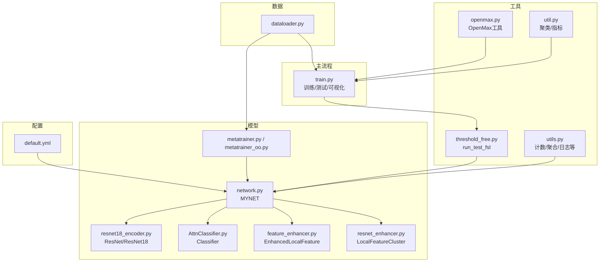
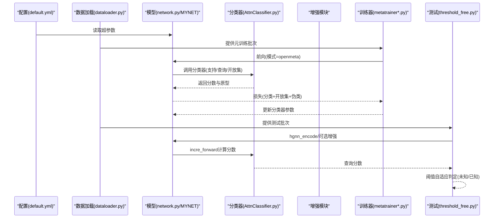
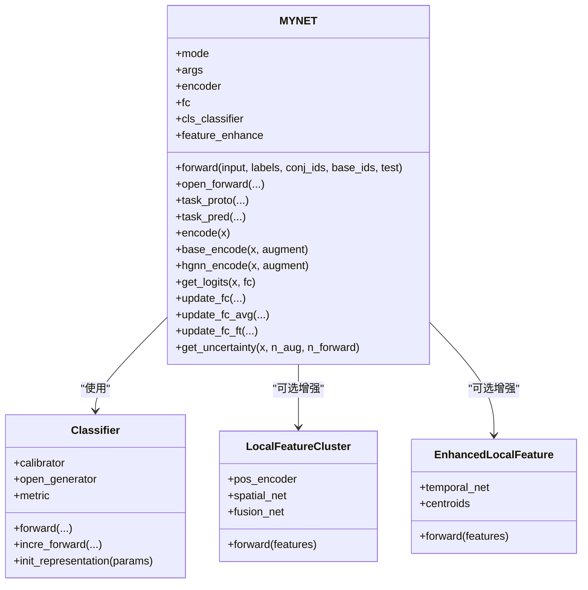
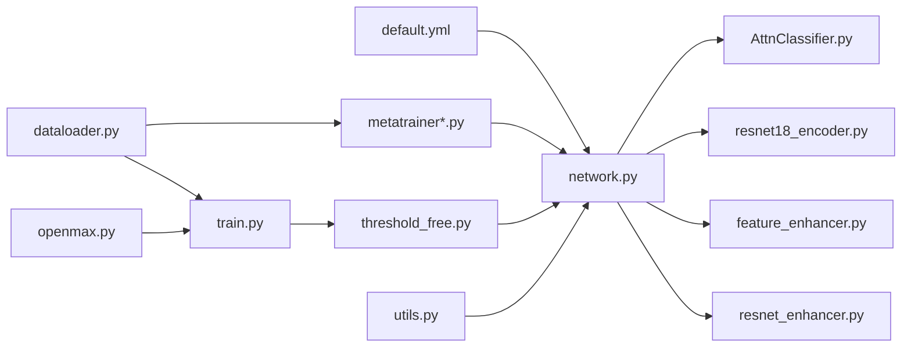

# API参考文档

<cite>
**本文档引用的文件**
- [train.py](file://train.py)
- [network.py](file://network.py)
- [enhance_module.py](file://enhance_module.py)
- [openmax.py](file://openmax.py)
- [threshold_free.py](file://threshold_free.py)
- [resnet18_encoder.py](file://models/resnet18_encoder.py)
- [AttnClassifier.py](file://models/AttnClassifier.py)
- [default.yml](file://configs/default.yml)
- [util.py](file://utils/util.py)
- [dataloader.py](file://data/dataloader.py)
- [resnet_enhancer.py](file://models/resnet_enhancer.py)
- [utils.py](file://utils/utils.py)
- [feature_enhancer.py](file://models/feature_enhancer.py)
- [metatrainer.py](file://models/metatrainer.py)
- [metatrainer_oo.py](file://models/metatrainer_oo.py)
</cite>

## 目录
1. [简介](#简介)
2. [项目结构](#项目结构)
3. [核心组件](#核心组件)
4. [架构总览](#架构总览)
5. [详细组件分析](#详细组件分析)
6. [依赖关系分析](#依赖关系分析)
7. [性能考量](#性能考量)
8. [故障排查指南](#故障排查指南)
9. [结论](#结论)
10. [附录](#附录)

## 简介
本文件为VAZE项目的完整API参考文档，面向开发者与研究者，系统梳理项目中的公共类与方法接口规范，覆盖参数类型、返回值、异常处理策略、调用关系与依赖关系、参数验证与错误处理、版本兼容与迁移建议、性能与使用限制，以及典型与高级用法示例路径。VAZE聚焦增量/开放集学习场景，结合音频特征提取、原型学习、注意力机制与特征增强技术，实现从基类到新类的持续学习与未知样本识别。

## 项目结构
- 配置层：configs/default.yml定义训练与网络超参数
- 数据层：data/dataloader.py提供元训练/测试数据加载器
- 模型层：models/目录包含编码器、分类器、特征增强器与训练器
- 工具层：utils/提供评估、日志、工具函数等
- 主流程：train.py与threshold_free.py分别负责训练与推理/测试流程

**图表来源**
- [default.yml:1-88](file://configs/default.yml#L1-L88)
- [dataloader.py:1-351](file://data/dataloader.py#L1-L351)
- [network.py:1-724](file://network.py#L1-L724)
- [resnet18_encoder.py:1-471](file://models/resnet18_encoder.py#L1-L471)
- [AttnClassifier.py:1-369](file://models/AttnClassifier.py#L1-L369)
- [feature_enhancer.py:1-93](file://models/feature_enhancer.py#L1-L93)
- [resnet_enhancer.py:1-172](file://models/resnet_enhancer.py#L1-L172)
- [metatrainer.py:1-201](file://models/metatrainer.py#L1-L201)
- [metatrainer_oo.py:1-237](file://models/metatrainer_oo.py#L1-L237)
- [utils.py:1-566](file://utils/utils.py#L1-L566)
- [threshold_free.py:1-394](file://threshold_free.py#L1-L394)
- [openmax.py:1-109](file://openmax.py#L1-L109)
- [util.py:1-75](file://utils/util.py#L1-L75)
- [train.py:1-1296](file://train.py#L1-L1296)

**章节来源**
- [default.yml:1-88](file://configs/default.yml#L1-L88)
- [dataloader.py:1-351](file://data/dataloader.py#L1-L351)
- [network.py:1-724](file://network.py#L1-L724)
- [resnet18_encoder.py:1-471](file://models/resnet18_encoder.py#L1-L471)
- [AttnClassifier.py:1-369](file://models/AttnClassifier.py#L1-L369)
- [feature_enhancer.py:1-93](file://models/feature_enhancer.py#L1-L93)
- [resnet_enhancer.py:1-172](file://models/resnet_enhancer.py#L1-L172)
- [metatrainer.py:1-201](file://models/metatrainer.py#L1-L201)
- [metatrainer_oo.py:1-237](file://models/metatrainer_oo.py#L1-L237)
- [utils.py:1-566](file://utils/utils.py#L1-L566)
- [threshold_free.py:1-394](file://threshold_free.py#L1-L394)
- [openmax.py:1-109](file://openmax.py#L1-L109)
- [util.py:1-75](file://utils/util.py#L1-L75)
- [train.py:1-1296](file://train.py#L1-L1296)

## 核心组件
- MYNET：主干网络，封装音频特征提取、分类器、原型学习与注意力模块，支持多种模式（编码、开放集元训练、增量测试等）
- Classifier：支持校准器与开放集生成器，结合余弦相似度度量与温度参数，输出查询与未知样本的分类分数
- LocalFeatureCluster：局部特征聚类增强模块，支持空间位置编码、动态聚类与融合
- EnhancedLocalFeature：基于LSTM与时序注意力的局部特征增强
- ResNet/ResNet18：骨干编码器，支持预训练权重加载
- 数据加载器：支持基类/增量会话/测试数据的采样与批次组织
- 训练器：元训练（metatrainer/metrainer_oo）与主流程（train.py）中的训练/测试/可视化

**章节来源**
- [network.py:18-518](file://network.py#L18-L518)
- [AttnClassifier.py:39-120](file://models/AttnClassifier.py#L39-L120)
- [enhance_module.py:70-160](file://enhance_module.py#L70-L160)
- [feature_enhancer.py:27-93](file://models/feature_enhancer.py#L27-L93)
- [resnet18_encoder.py:240-334](file://models/resnet18_encoder.py#L240-L334)
- [dataloader.py:13-351](file://data/dataloader.py#L13-L351)
- [metatrainer.py:17-178](file://models/metatrainer.py#L17-L178)
- [metatrainer_oo.py:17-214](file://models/metatrainer_oo.py#L17-L214)

## 架构总览
VAZE采用“配置驱动 + 数据加载 + 模型组件 + 工具函数”的分层架构。训练阶段通过元训练器冻结编码器、训练分类器参数；推理阶段通过run_test_fsl进行阈值自适应的未知/已知样本判定；特征增强模块贯穿编码与测试阶段以提升判别能力。

**图表来源**
- [default.yml:1-88](file://configs/default.yml#L1-L88)
- [dataloader.py:100-168](file://data/dataloader.py#L100-L168)
- [network.py:102-151](file://network.py#L102-L151)
- [AttnClassifier.py:47-101](file://models/AttnClassifier.py#L47-L101)
- [threshold_free.py:178-230](file://threshold_free.py#L178-L230)
- [metatrainer.py:87-178](file://models/metatrainer.py#L87-L178)
- [metatrainer_oo.py:87-214](file://models/metatrainer_oo.py#L87-L214)

## 详细组件分析

### MYNET（主干网络）
- 角色：音频特征提取、分类头、原型学习、注意力模块、模式切换
- 关键方法与接口
  - forward(input, labels=None, conj_ids=None, base_ids=None, test=False)
    - 参数：input（支持/查询/开放集拼接）、labels（标签元组）、conj_ids/base_ids（类别索引）、test（是否测试）
    - 返回：模式决定返回编码、元训练损失或测试特征/原型/概率
  - open_forward(the_input, labels, conj_ids, base_ids, test)
    - 参数：拼接输入、标签元组、集合索引、是否测试
    - 返回：(特征, 原型, 概率, 损失) 或 (特征, 原型, 概率)
  - task_proto(features, cls_ids, cls_label, query_label, test=False)
    - 动态标签分配与交叉熵损失计算
  - task_pred(query_cls_scores, openset_cls_scores, many_cls_scores=None)
    - 返回已知/未知概率（可选多类别）
  - encode(x) / base_encode(x, augment=False) / hgnn_encode(x, augment=False)
    - 特征提取（可选SpecAugment）
  - get_logits(x, fc) / get_att_proto / get_att_proto_shot_score
    - 余弦/点积相似度与注意力原型
  - update_fc / update_fc_avg / update_fc_ft
    - 新类原型更新与微调
  - get_uncertainty(x, n_aug=5, n_forward=5)
    - 基于MC Dropout的不确定性估计
- 参数验证与异常
  - 模式非法时行为未显式抛错，建议调用方确保mode合法
  - SpecAugment开关与设备一致性需由调用方保证
- 性能与限制
  - 多头注意力与余弦相似度计算复杂度较高，建议合理设置温度与批次大小
  - 增量阶段原型更新涉及均值计算，注意内存占用

**图表来源**
- [network.py:18-518](file://network.py#L18-L518)
- [AttnClassifier.py:39-120](file://models/AttnClassifier.py#L39-L120)
- [enhance_module.py:70-160](file://enhance_module.py#L70-L160)
- [feature_enhancer.py:27-93](file://models/feature_enhancer.py#L27-L93)

**章节来源**
- [network.py:18-518](file://network.py#L18-L518)
- [AttnClassifier.py:39-120](file://models/AttnClassifier.py#L39-L120)
- [enhance_module.py:70-160](file://enhance_module.py#L70-L160)
- [feature_enhancer.py:27-93](file://models/feature_enhancer.py#L27-L93)

### Classifier（分类器）
- 角色：支持集校准、开放集负原型生成、余弦相似度度量
- 关键方法
  - forward(features, cls_ids, test=False)
    - 输入：支持/查询/开放集特征与类别索引
    - 输出：(查询分数, 开放集分数), 正原型, 负原型, 距离损失
  - incre_forward(features, proto, cls_ids)
    - 增量测试时直接计算分数
  - init_representation(params) / get_representation(cls_ids, base_ids, randpick=False)
    - 初始化/获取基础原型权重
- 参数与返回
  - 支持/查询/开放集特征形状需满足预期，类别索引需与n_ways一致
  - 返回值包含分数张量与原型张量，便于后续阈值判定

**章节来源**
- [AttnClassifier.py:39-120](file://models/AttnClassifier.py#L39-L120)
- [AttnClassifier.py:121-271](file://models/AttnClassifier.py#L121-L271)
- [AttnClassifier.py:274-369](file://models/AttnClassifier.py#L274-L369)

### LocalFeatureCluster（局部特征聚类增强）
- 角色：空间位置编码、动态聚类、时序相似度加权、空间权重融合
- 关键方法
  - forward(features)
    - 输入：[B, C, H, W]
    - 输出：融合后的增强特征（与输入同形）与聚类中心
- 参数与返回
  - k_ratio控制聚类数，temporal_scale影响时序相似度
  - 返回增强特征张量，可用于后续编码或直接进入分类器

**章节来源**
- [enhance_module.py:70-160](file://enhance_module.py#L70-L160)
- [resnet_enhancer.py:51-172](file://models/resnet_enhancer.py#L51-L172)

### EnhancedLocalFeature（时序增强）
- 角色：LSTM时序特征提取、注意力加权、原型聚类
- 关键方法
  - forward(features)
    - 输入：[B, C, H, W]
    - 输出：[B, k, C]或适配后的特征
- 参数与返回
  - feat_dim需与输入通道匹配，k_ratio决定聚类中心数
  - 返回张量形状受维度修正与聚合方式影响

**章节来源**
- [feature_enhancer.py:27-93](file://models/feature_enhancer.py#L27-L93)

### 数据加载器（dataloader.py）
- 角色：基类/增量/测试数据的采样与批次组织
- 关键接口
  - get_dataloader(args, session) / get_testloader(args, session)
  - get_base_dataloader_stdu(args) / get_new_dataloader(args, session)
  - CurriculumMetaDataset（课程化元数据集）
- 参数与返回
  - 支持不同数据集（LibriSpeech/NSynth/S2S）与会话切换
  - 返回torch.utils.data.Dataset与DataLoader对象

**章节来源**
- [dataloader.py:13-351](file://data/dataloader.py#L13-L351)

### 训练器（metatrainer.py / metatrainer_oo.py）
- 角色：冻结编码器、训练分类器参数，计算分类与开放集损失
- 关键接口
  - meta_train(args, model, train_loader, eval_loader)
  - train_episode(epoch, train_loader, model, optimizer, args)
- 参数与返回
  - 支持余弦退火/阶梯学习率调度
  - 返回训练精度、AUROC与损失统计

**章节来源**
- [metatrainer.py:17-178](file://models/metatrainer.py#L17-L178)
- [metatrainer_oo.py:17-214](file://models/metatrainer_oo.py#L17-L214)

### 推理/测试（threshold_free.py）
- 角色：无阈值开放集测试，自适应阈值估计与未知/已知判定
- 关键接口
  - run_test_fsl(model, args, test_loader, session=None)
  - compute_feats(model, label_id, features, proto)
  - _adaptive_margin_threshold / _session_aware_threshold
- 参数与返回
  - 返回未知/已知样本列表与标签
  - 支持会话感知阈值混合

**章节来源**
- [threshold_free.py:178-230](file://threshold_free.py#L178-L230)
- [threshold_free.py:357-364](file://threshold_free.py#L357-L364)

### 开放集工具（openmax.py）
- 角色：距离计算、Weibull建模与开放集评分
- 关键接口
  - compute_distance / compute_test_dist
  - get_weibull_model / update_weibull
  - openmax_scores
- 参数与返回
  - 返回未知/已知样本与标签

**章节来源**
- [openmax.py:7-32](file://openmax.py#L7-L32)
- [openmax.py:63-82](file://openmax.py#L63-L82)
- [openmax.py:84-109](file://openmax.py#L84-L109)

### 工具函数（utils.py / util.py）
- 角色：计数/聚合/日志/评估/可视化辅助
- 关键接口
  - Averager / AverageMeter / DAverageMeter
  - count_acc / count_per_cls_acc / count_acc_topk
  - cluster_acc / calc
  - plot_tsne / confmatrix
- 参数与返回
  - 提供通用评估与可视化能力

**章节来源**
- [utils.py:190-286](file://utils/utils.py#L190-L286)
- [utils.py:383-437](file://utils/utils.py#L383-L437)
- [utils.py:360-381](file://utils/utils.py#L360-L381)
- [util.py:12-57](file://utils/util.py#L12-L57)

### 主流程（train.py）
- 角色：训练入口、测试、可视化、原型更新
- 关键接口
  - train(args) / test(args, model, testloader, session)
  - debug_cluster / visualize_decision_boundary
  - update_fc_avg / replace_base_fc
- 参数与返回
  - 支持增量会话与原型更新
  - 提供t-SNE/相关性/分布等可视化

**章节来源**
- [train.py:799-803](file://train.py#L799-L803)
- [train.py:763-780](file://train.py#L763-L780)
- [train.py:416-503](file://train.py#L416-L503)
- [train.py:212-227](file://train.py#L212-L227)

## 依赖关系分析

**图表来源**
- [default.yml:1-88](file://configs/default.yml#L1-L88)
- [dataloader.py:1-351](file://data/dataloader.py#L1-L351)
- [network.py:1-724](file://network.py#L1-L724)
- [AttnClassifier.py:1-369](file://models/AttnClassifier.py#L1-L369)
- [resnet18_encoder.py:1-471](file://models/resnet18_encoder.py#L1-L471)
- [feature_enhancer.py:1-93](file://models/feature_enhancer.py#L1-L93)
- [resnet_enhancer.py:1-172](file://models/resnet_enhancer.py#L1-L172)
- [metatrainer.py:1-201](file://models/metatrainer.py#L1-L201)
- [metatrainer_oo.py:1-237](file://models/metatrainer_oo.py#L1-L237)
- [utils.py:1-566](file://utils/utils.py#L1-L566)
- [threshold_free.py:1-394](file://threshold_free.py#L1-L394)
- [openmax.py:1-109](file://openmax.py#L1-L109)
- [train.py:1-1296](file://train.py#L1-L1296)

**章节来源**
- [network.py:1-724](file://network.py#L1-L724)
- [AttnClassifier.py:1-369](file://models/AttnClassifier.py#L1-L369)
- [resnet18_encoder.py:1-471](file://models/resnet18_encoder.py#L1-L471)
- [feature_enhancer.py:1-93](file://models/feature_enhancer.py#L1-L93)
- [resnet_enhancer.py:1-172](file://models/resnet_enhancer.py#L1-L172)
- [dataloader.py:1-351](file://data/dataloader.py#L1-L351)
- [metatrainer.py:1-201](file://models/metatrainer.py#L1-L201)
- [metatrainer_oo.py:1-237](file://models/metatrainer_oo.py#L1-L237)
- [utils.py:1-566](file://utils/utils.py#L1-L566)
- [threshold_free.py:1-394](file://threshold_free.py#L1-L394)
- [openmax.py:1-109](file://openmax.py#L1-L109)
- [train.py:1-1296](file://train.py#L1-L1296)

## 性能考量
- 计算复杂度
  - 注意力与余弦相似度：O(B·N·D)（B为批次，N为原型/样本数，D为特征维度）
  - 聚类与LSTM：受H、W、k_ratio影响，建议在GPU上运行
- 内存占用
  - 增量阶段原型更新与多头注意力缓存需关注显存
- 优化建议
  - 合理设置温度参数与批次大小
  - 使用预训练编码器与冻结策略降低训练成本
  - 在测试阶段可选择性启用增强模块以平衡速度与效果

[本节为通用指导，无需特定文件引用]

## 故障排查指南
- 设备与dtype问题
  - 确保输入张量与模型参数在同一设备；增强模块需与输入设备一致
- 模式切换
  - 模式非法可能导致前向行为异常，建议在调用前明确mode
- 数据维度
  - 特征增强模块要求输入通道与feat_dim一致；若不一致需通过维度修正层
- 学习率与收敛
  - 若AUROC不提升，检查学习率调度与损失权重（gamma/funit）

**章节来源**
- [network.py:50-101](file://network.py#L50-L101)
- [feature_enhancer.py:49-93](file://models/feature_enhancer.py#L49-L93)
- [resnet_enhancer.py:168-172](file://models/resnet_enhancer.py#L168-L172)
- [utils.py:383-437](file://utils/utils.py#L383-L437)

## 结论
VAZE提供了从配置、数据、模型到训练与推理的完整API体系，支持增量/开放集学习场景下的特征增强、原型学习与阈值自适应判定。通过清晰的模块划分与接口设计，开发者可在保证性能的前提下灵活扩展与定制。

[本节为总结，无需特定文件引用]

## 附录

### API清单与示例路径
- 训练入口
  - [train(args):799-803](file://train.py#L799-L803)
  - 示例路径：[train.py:799-803](file://train.py#L799-L803)
- 测试接口
  - [test(args, model, testloader, session):763-780](file://train.py#L763-L780)
  - 示例路径：[train.py:763-780](file://train.py#L763-L780)
- 推理/测试（阈值自适应）
  - [run_test_fsl(model, args, test_loader, session):178-230](file://threshold_free.py#L178-L230)
  - 示例路径：[threshold_free.py:178-230](file://threshold_free.py#L178-L230)
- 特征增强
  - [LocalFeatureCluster.forward:95-148](file://enhance_module.py#L95-L148)
  - [EnhancedLocalFeature.forward:49-93](file://feature_enhancer.py#L49-L93)
  - 示例路径：[enhance_module.py:95-148](file://enhance_module.py#L95-L148), [feature_enhancer.py:49-93](file://feature_enhancer.py#L49-L93)
- 分类器
  - [Classifier.forward/incre_forward:47-101](file://models/AttnClassifier.py#L47-L101)
  - 示例路径：[AttnClassifier.py:47-101](file://models/AttnClassifier.py#L47-L101)
- 数据加载
  - [get_dataloader / get_testloader:48-81](file://data/dataloader.py#L48-L81)
  - 示例路径：[dataloader.py:48-81](file://data/dataloader.py#L48-L81)
- 元训练
  - [meta_train / train_episode:17-178](file://models/metatrainer.py#L17-L178)
  - 示例路径：[metatrainer.py:17-178](file://models/metatrainer.py#L17-L178)

### 参数验证与错误处理要点
- 输入维度与设备一致性
  - 增强模块与LSTM需确保输入维度与设备一致
- 模式合法性
  - 建议在调用前校验mode，避免非预期行为
- 标签与类别索引
  - n_ways与base_ids需与数据集一致，避免索引越界

**章节来源**
- [enhance_module.py:95-148](file://enhance_module.py#L95-L148)
- [feature_enhancer.py:49-93](file://models/feature_enhancer.py#L49-L93)
- [network.py:50-101](file://network.py#L50-L101)
- [dataloader.py:100-168](file://data/dataloader.py#L100-L168)

### 版本兼容与迁移指南
- 配置文件
  - default.yml中新增/变更字段需同步至训练脚本
- 模块替换
  - LocalFeatureCluster可替换为EnhancedLocalFeature，需调整输入维度
- 训练流程
  - 元训练器支持两种实现（metatrainer与metatrainer_oo），功能等价，选择其一即可

**章节来源**
- [default.yml:1-88](file://configs/default.yml#L1-L88)
- [metatrainer.py:17-178](file://models/metatrainer.py#L17-L178)
- [metatrainer_oo.py:17-214](file://models/metatrainer_oo.py#L17-L214)