# 工具函数API

<cite>
**本文档引用的文件**
- [utils/util.py](file://utils/util.py)
- [utils/utils.py](file://utils/utils.py)
- [utils/audio_augment.py](file://utils/audio_augment.py)
- [utils/streamCluster.py](file://utils/streamCluster.py)
- [enhance_module.py](file://enhance_module.py)
- [network.py](file://network.py)
- [data/FMC.py](file://data/FMC.py)
- [configs/default.yml](file://configs/default.yml)
- [scripts/plot_separate_embeddings.py](file://scripts/plot_separate_embeddings.py)
- [scripts/viz_feature_space.py](file://scripts/viz_feature_space.py)
- [train.py](file://train.py)
</cite>

## 目录
1. [简介](#简介)
2. [项目结构](#项目结构)
3. [核心组件](#核心组件)
4. [架构概览](#架构概览)
5. [详细组件分析](#详细组件分析)
6. [依赖分析](#依赖分析)
7. [性能考虑](#性能考虑)
8. [故障排除指南](#故障排除指南)
9. [结论](#结论)

## 简介
本文件提供了工具函数库的完整API文档，涵盖评估工具、可视化工具、音频处理工具、聚类分析工具以及通用工具函数。文档详细记录了各类工具函数的接口规范、参数说明、返回值类型和使用示例，并提供了相应的架构图和流程图以便理解各组件之间的关系。

## 项目结构
工具函数库位于项目的`utils`目录下，包含多个功能模块：
- 评估工具：用于计算准确率、混淆矩阵等性能指标
- 可视化工具：用于嵌入空间绘图、t-SNE降维和特征分布可视化
- 音频处理工具：用于数据增强、特征变换和音频格式转换
- 聚类分析工具：用于流式聚类算法、类别中心计算和相似性度量
- 通用工具：路径管理、日志记录、配置加载、性能计数器等

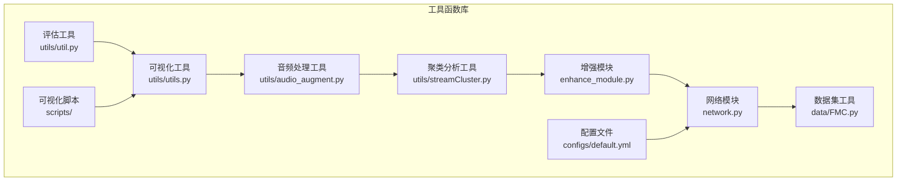

**图表来源**
- [utils/util.py:1-75](file://utils/util.py#L1-L75)
- [utils/utils.py:1-566](file://utils/utils.py#L1-L566)
- [utils/audio_augment.py:1-31](file://utils/audio_augment.py#L1-L31)
- [utils/streamCluster.py:1-132](file://utils/streamCluster.py#L1-L132)

## 核心组件

### 评估工具函数
评估工具函数库提供了多种性能评估指标计算方法，包括聚类准确率、F1分数、混淆矩阵等。

**主要函数：**
- `cluster_acc(args, y_true, y_pred)`: 计算聚类准确率
- `calc(args, known, unknown)`: 计算二分类F1分数
- `count_acc(logits, label)`: 计算分类准确率
- `count_per_cls_acc(logits, true_label)`: 计算每类准确率
- `count_acc_topk(x, y, k=5)`: 计算Top-k准确率
- `count_acc_taskIL(logits, label, args)`: 计算任务增量学习准确率
- `confmatrix(logits, label, filename)`: 生成混淆矩阵

**章节来源**
- [utils/util.py:12-57](file://utils/util.py#L12-L57)
- [utils/utils.py:383-489](file://utils/utils.py#L383-L489)

### 可视化工具函数
可视化工具函数提供了丰富的数据可视化能力，包括t-SNE降维、特征分布比较和嵌入空间绘图。

**主要函数：**
- `plot_tsne(fc_proto, test_class, save_path, session)`: t-SNE降维可视化
- `plot_embedding(data, label, title)`: 嵌入空间绘图
- `confmatrix(logits, label, filename)`: 混淆矩阵可视化
- `plot_feature_distribution(original_features, enhanced_features, save_path, timestamp)`: 特征分布对比图
- `embed_and_plot(X, labels, centers, classes, out_path, title='')`: 嵌入空间可视化

**章节来源**
- [utils/utils.py:360-520](file://utils/utils.py#L360-L520)
- [train.py:305-328](file://train.py#L305-L328)

### 音频处理工具函数
音频处理工具提供了完整的音频数据增强和特征变换功能。

**主要类：**
- `AudioAugment`: 音频数据增强类
  - `__call__(x)`: 音频增强主入口
  - `time_stretch(x)`: 时间拉伸增强
  - `pitch_shift(x)`: 音高变换增强
  - `add_noise(x)`: 添加噪声

**章节来源**
- [utils/audio_augment.py:4-31](file://utils/audio_augment.py#L4-L31)

### 聚类分析工具函数
聚类分析工具提供了高效的流式聚类算法，适用于大规模数据集的实时聚类需求。

**主要类：**
- `FStream`: 优化版流式聚类器
  - `process_batch(batch)`: 处理小批量数据
  - `get_clusters()`: 获取最终聚类结果
  - `fit_predict(X)`: 批量接口
  - `MicroCluster`: 微簇类，包含中心点、权重等属性

**章节来源**
- [utils/streamCluster.py:5-132](file://utils/streamCluster.py#L5-L132)

### 通用工具函数
通用工具函数提供了路径管理、日志记录、配置加载等基础功能。

**主要类和函数：**
- `Averager`: 简单平均计算器
- `AverageMeter`: 平均值计算器
- `DAverageMeter`: 字典平均值计算器
- `Logger`: 日志记录器
- `Timer`: 性能计数器
- `ensure_path(path)`: 路径创建函数
- `set_seed(seed)`: 随机种子设置
- `set_gpu(args)`: GPU设置函数

**章节来源**
- [utils/utils.py:190-287](file://utils/utils.py#L190-L287)
- [utils/utils.py:534-559](file://utils/utils.py#L534-L559)

## 架构概览

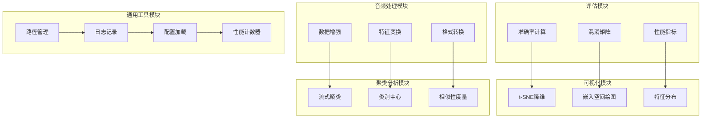

**图表来源**
- [utils/util.py:12-57](file://utils/util.py#L12-L57)
- [utils/utils.py:360-559](file://utils/utils.py#L360-L559)
- [utils/audio_augment.py:4-31](file://utils/audio_augment.py#L4-L31)
- [utils/streamCluster.py:5-132](file://utils/streamCluster.py#L5-L132)

## 详细组件分析

### 评估工具组件分析

#### 准确率计算组件
准确率计算组件提供了多种准确率计算方法，适用于不同的应用场景。

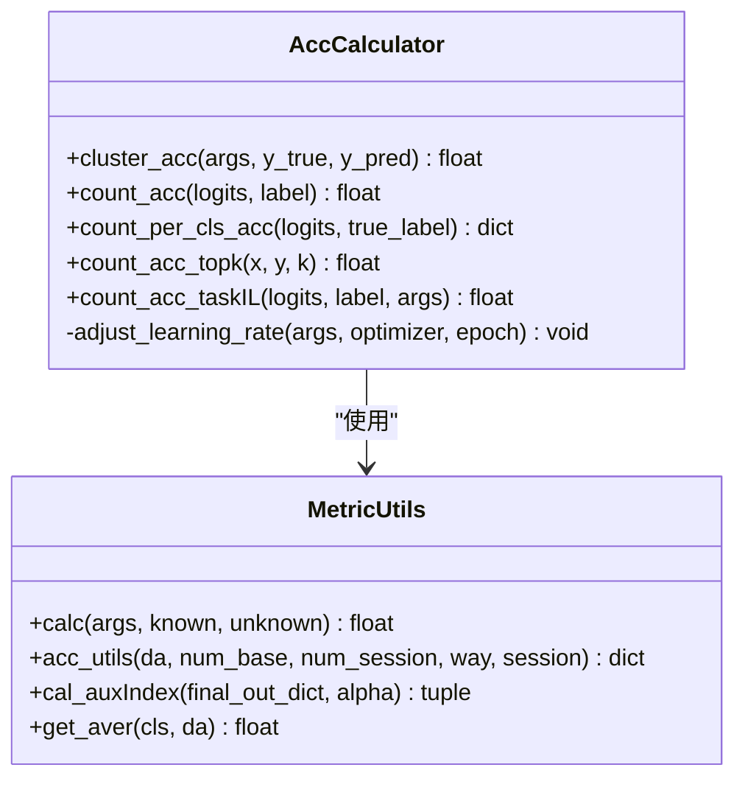

**图表来源**
- [utils/util.py:12-72](file://utils/util.py#L12-L72)
- [utils/utils.py:289-358](file://utils/utils.py#L289-L358)

**章节来源**
- [utils/util.py:12-72](file://utils/util.py#L12-L72)
- [utils/utils.py:289-358](file://utils/utils.py#L289-L358)

#### 混淆矩阵生成组件
混淆矩阵生成组件提供了完整的混淆矩阵计算和可视化功能。

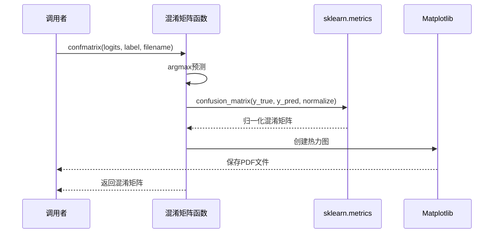

**图表来源**
- [utils/utils.py:439-489](file://utils/utils.py#L439-L489)

**章节来源**
- [utils/utils.py:439-489](file://utils/utils.py#L439-L489)

### 可视化工具组件分析

#### t-SNE降维组件
t-SNE降维组件提供了高效的降维可视化功能，支持自定义参数配置。

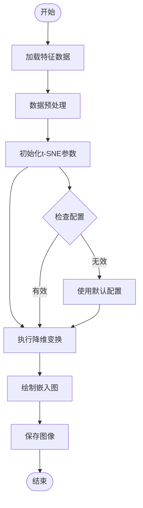

**图表来源**
- [utils/utils.py:360-367](file://utils/utils.py#L360-L367)
- [scripts/viz_feature_space.py:93-95](file://scripts/viz_feature_space.py#L93-L95)

**章节来源**
- [utils/utils.py:360-367](file://utils/utils.py#L360-L367)
- [scripts/viz_feature_space.py:59-128](file://scripts/viz_feature_space.py#L59-L128)

#### 特征分布可视化组件
特征分布可视化组件提供了特征值分布的对比分析功能。

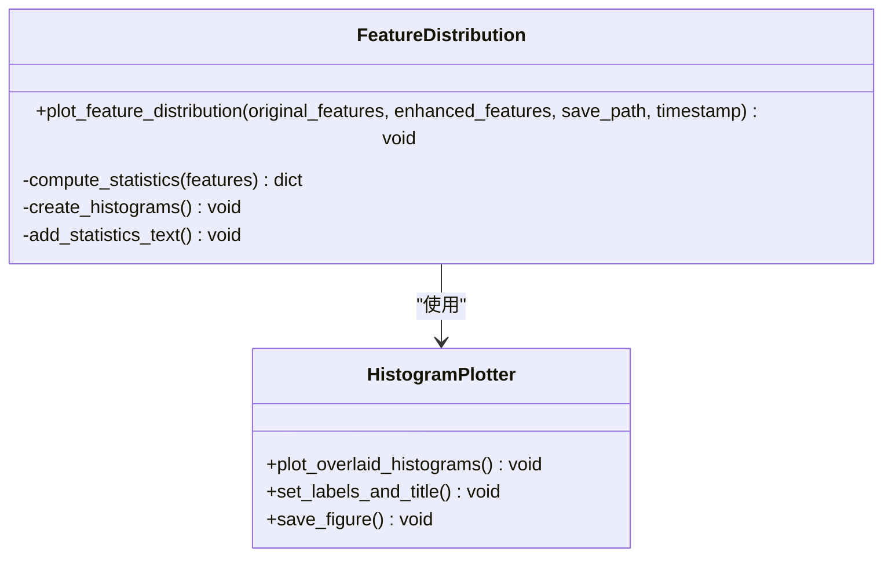

**图表来源**
- [train.py:305-328](file://train.py#L305-L328)

**章节来源**
- [train.py:305-328](file://train.py#L305-L328)

### 音频处理工具组件分析

#### 音频数据增强组件
音频数据增强组件提供了多种音频增强技术，包括时间拉伸、音高变换和噪声添加。

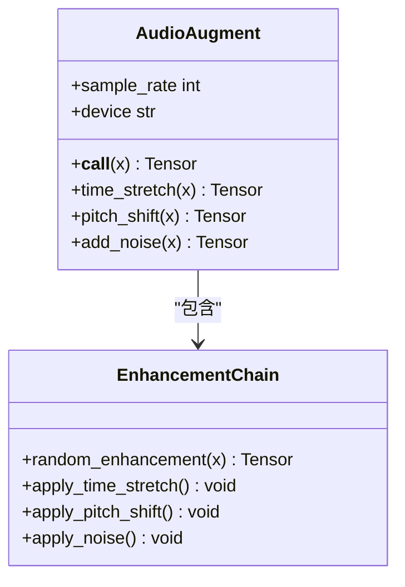

**图表来源**
- [utils/audio_augment.py:4-31](file://utils/audio_augment.py#L4-L31)

**章节来源**
- [utils/audio_augment.py:4-31](file://utils/audio_augment.py#L4-L31)

### 聚类分析工具组件分析

#### 流式聚类组件
流式聚类组件提供了高效的流式聚类算法，适用于大规模数据集的实时聚类需求。

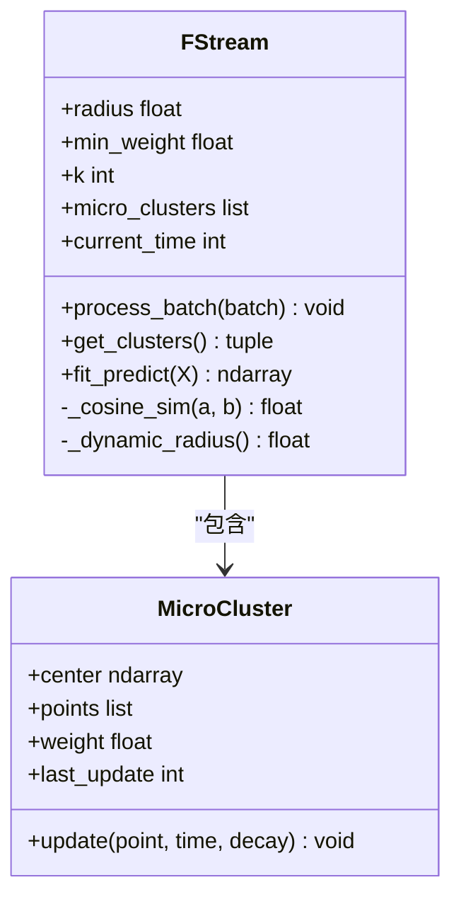

**图表来源**
- [utils/streamCluster.py:5-132](file://utils/streamCluster.py#L5-L132)

**章节来源**
- [utils/streamCluster.py:5-132](file://utils/streamCluster.py#L5-L132)

### 通用工具组件分析

#### 性能计数器组件
性能计数器组件提供了精确的时间测量和性能统计功能。

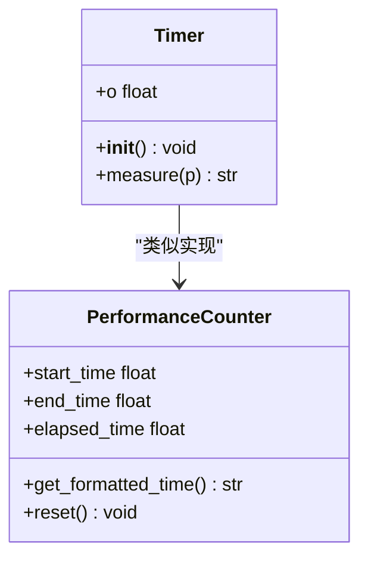

**图表来源**
- [utils/utils.py:368-381](file://utils/utils.py#L368-L381)

**章节来源**
- [utils/utils.py:368-381](file://utils/utils.py#L368-L381)

#### 日志记录组件
日志记录组件提供了灵活的日志记录功能，支持文件和控制台输出。

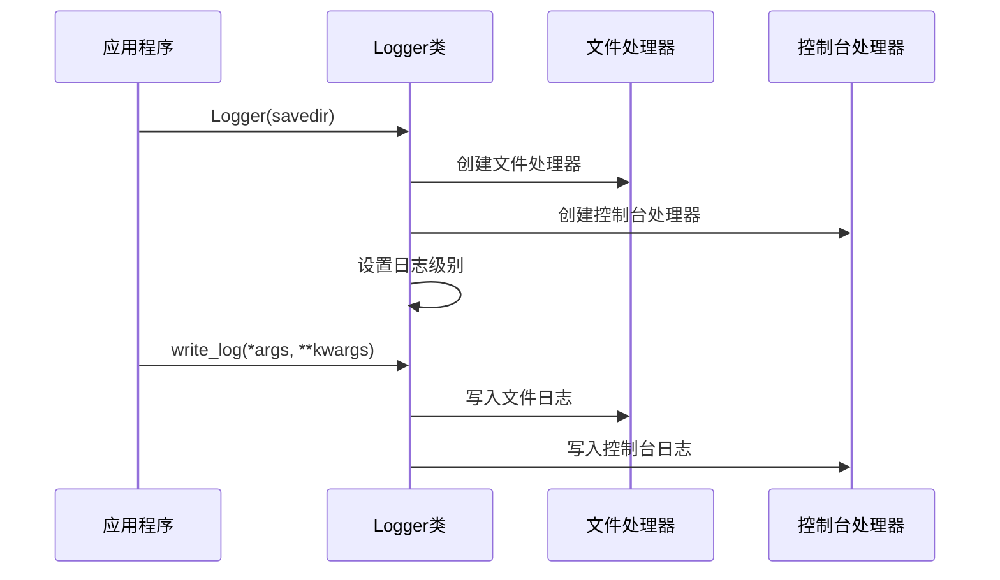

**图表来源**
- [utils/utils.py:534-553](file://utils/utils.py#L534-L553)

**章节来源**
- [utils/utils.py:534-553](file://utils/utils.py#L534-L553)

## 依赖分析

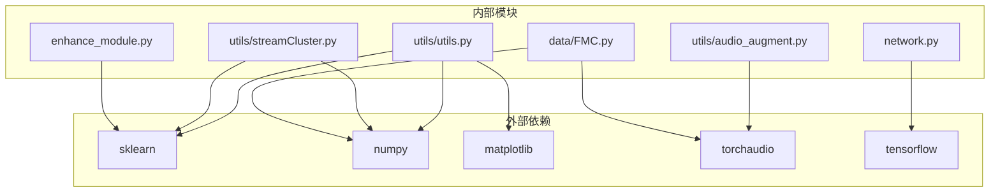

**图表来源**
- [utils/utils.py:1-20](file://utils/utils.py#L1-L20)
- [utils/audio_augment.py:1-3](file://utils/audio_augment.py#L1-L3)
- [utils/streamCluster.py:1-3](file://utils/streamCluster.py#L1-L3)

**章节来源**
- [utils/utils.py:1-20](file://utils/utils.py#L1-L20)
- [utils/audio_augment.py:1-3](file://utils/audio_augment.py#L1-L3)
- [utils/streamCluster.py:1-3](file://utils/streamCluster.py#L1-L3)

## 性能考虑
- **内存优化**: 流式聚类算法采用微簇概念，减少内存占用
- **计算效率**: t-SNE降维使用PCA初始化，提高收敛速度
- **并行处理**: 数据增强支持批处理，充分利用GPU资源
- **缓存策略**: 性能计数器提供时间测量，便于性能分析
- **内存管理**: 日志记录器支持文件和控制台双重输出，避免内存泄漏

## 故障排除指南

### 常见问题及解决方案

#### 1. 模型加载失败
**症状**: 模型权重加载时报错
**解决方案**: 
- 检查模型状态字典键名是否匹配
- 使用`strict=False`参数允许部分加载
- 确认设备兼容性

#### 2. GPU内存不足
**症状**: CUDA内存溢出错误
**解决方案**:
- 减少批处理大小
- 使用更小的特征维度
- 实施梯度累积

#### 3. 数据增强效果不佳
**症状**: 增强后的音频质量差
**解决方案**:
- 调整增强参数范围
- 检查采样率设置
- 验证音频格式兼容性

#### 4. 聚类结果不稳定
**症状**: 流式聚类结果随时间变化
**解决方案**:
- 调整半径参数
- 增加最小权重阈值
- 优化k-NN邻居数量

**章节来源**
- [scripts/plot_separate_embeddings.py:67-78](file://scripts/plot_separate_embeddings.py#L67-L78)
- [utils/streamCluster.py:17-21](file://utils/streamCluster.py#L17-L21)

## 结论
本工具函数库提供了完整的机器学习和音频处理工具集，涵盖了从数据预处理、特征工程到模型训练和评估的全流程。各组件设计合理，接口清晰，具有良好的可扩展性和维护性。通过合理的架构设计和性能优化，能够满足大规模数据处理和实时应用的需求。