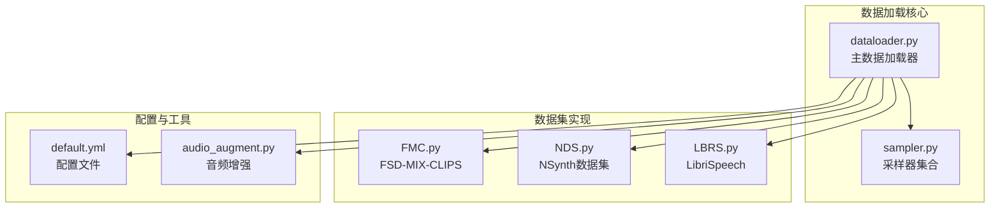
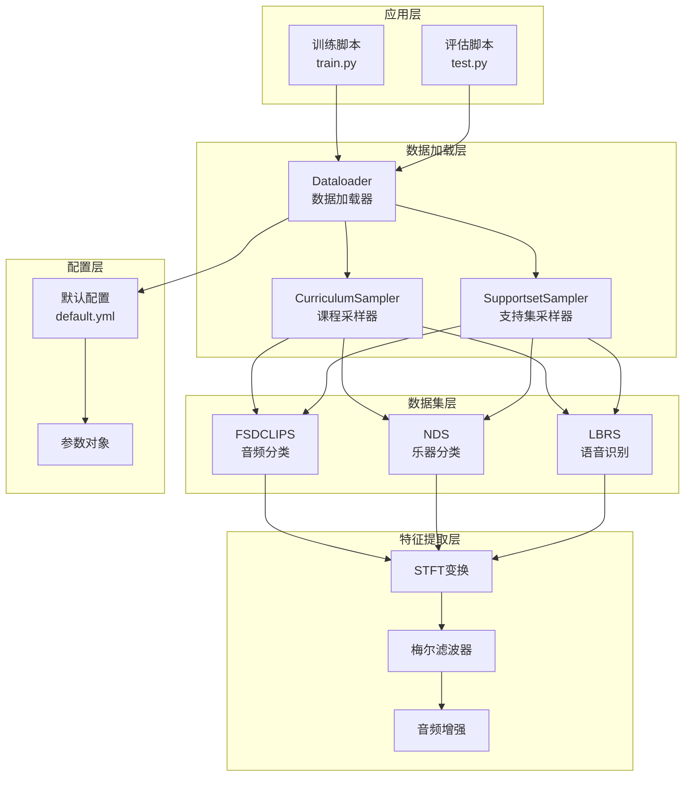
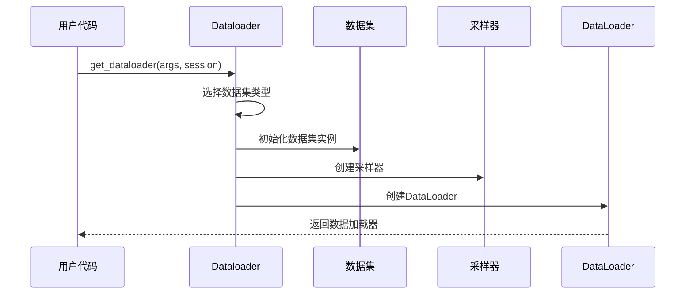
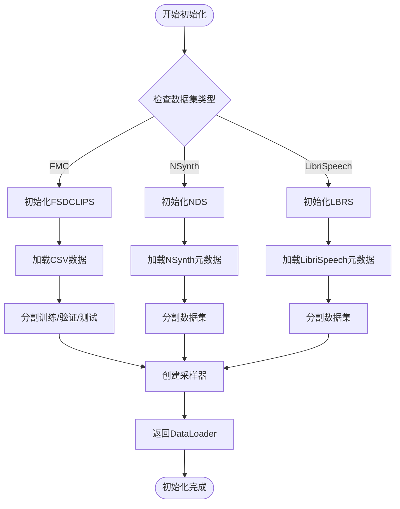
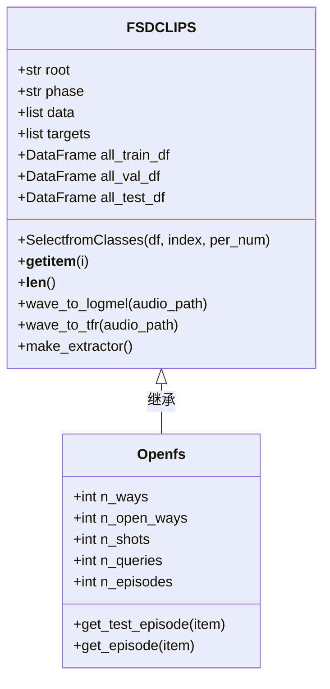
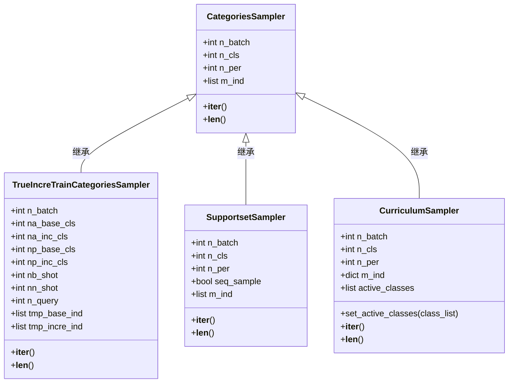
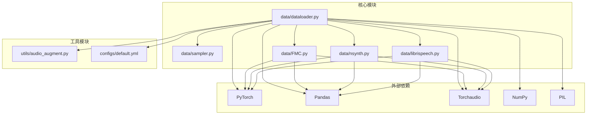
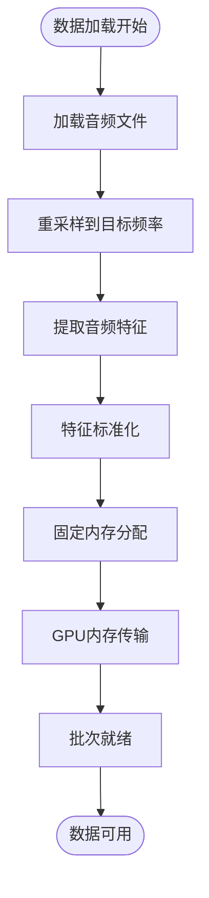

# 数据加载API

<cite>
**本文档引用的文件**
- [dataloader.py](file://data/dataloader.py)
- [FMC.py](file://data/FMC.py)
- [nsynth.py](file://data/nsynth.py)
- [librispeech.py](file://data/librispeech.py)
- [sampler.py](file://data/sampler.py)
- [default.yml](file://configs/default.yml)
- [audio_augment.py](file://utils/audio_augment.py)
</cite>

## 目录
1. [简介](#简介)
2. [项目结构](#项目结构)
3. [核心组件](#核心组件)
4. [架构概览](#架构概览)
5. [详细组件分析](#详细组件分析)
6. [依赖关系分析](#依赖关系分析)
7. [性能考虑](#性能考虑)
8. [故障排除指南](#故障排除指南)
9. [结论](#结论)

## 简介

本文件为数据加载系统的完整API文档，涵盖了音频数据加载、批次生成、数据增强和采样策略的详细接口规范。系统支持多种音频数据集（FMC、NSynth、LibriSpeech），提供元学习（few-shot）和增量学习场景下的数据管道配置。

## 项目结构

数据加载系统主要由以下核心模块组成：

**图表来源**
- [dataloader.py:1-351](file://data/dataloader.py#L1-L351)
- [sampler.py:1-201](file://data/sampler.py#L1-L201)
- [FMC.py:1-367](file://data/FMC.py#L1-L367)
- [nsynth.py:1-287](file://data/nsynth.py#L1-L287)
- [librispeech.py:1-278](file://data/librispeech.py#L1-L278)

**章节来源**
- [dataloader.py:1-351](file://data/dataloader.py#L1-L351)
- [default.yml:1-88](file://configs/default.yml#L1-L88)

## 核心组件

### Dataloader类接口

Dataloader模块提供了完整的数据加载接口，支持多种训练模式和数据集类型：

#### 主要数据加载函数

| 函数名 | 参数 | 返回值 | 描述 |
|--------|------|--------|------|
| `get_dataloader(args, session)` | args, session | trainset, trainloader | 获取指定会话的数据加载器 |
| `get_testloader(args, session)` | args, session | testset, testloader | 获取测试数据加载器 |
| `get_base_dataloader_stdu(args)` | args | trainset, trainloader | 获取基础阶段数据加载器 |
| `get_new_dataloader(args, session)` | args, session | trainset, trainloader | 获取新类别数据加载器 |
| `get_unknow_dataloader(args, session)` | args, session | trainset, trainloader | 获取未知类别数据加载器 |

#### 数据集初始化接口

| 接口 | 参数 | 返回值 | 描述 |
|------|------|--------|------|
| `get_dataset_for_data_init(args)` | args | dataset | 获取数据初始化用数据集 |
| `get_know_dataloader(args, session)` | args, session | trainset, trainloader | 获取已知类别数据加载器 |
| `get_inc_testloader(args, session)` | args, session | testset, testloader | 获取增量测试数据加载器 |

**章节来源**
- [dataloader.py:48-254](file://data/dataloader.py#L48-L254)

### 数据集类接口

#### FSDCLIPS数据集

FSDCLIPS数据集提供音频片段分类功能，支持基础会话和增量会话模式。

**核心方法**
- `__init__(root, phase, index, k, base_sess, data_type, args)`
- `SelectfromClasses(df, index, per_num)` - 从指定类别中选择样本
- `__getitem__(i)` - 获取单个样本
- `__len__()` - 返回数据集大小

**属性**
- `data`: 音频文件路径列表
- `targets`: 对应标签列表
- `all_train_df`: 训练数据框
- `all_val_df`: 验证数据框
- `all_test_df`: 测试数据框

#### NSynth数据集

NSynth数据集专注于乐器声音分类，提供专业音频特征提取能力。

**核心方法**
- `wave_to_logmel(audio_path)` - 提取对数梅尔频谱图
- `wave_to_tfr(audio_path)` - 提取时频表示
- `make_extractor()` - 初始化特征提取器

**特征提取器**
- 短时傅里叶变换（STFT）
- 对数梅尔滤波器组
- 频谱增强（SpecAugmentation）

#### LibriSpeech数据集

LibriSpeech数据集提供语音识别相关的音频数据，支持大规模语音数据集。

**核心方法**
- `SelectfromClasses(df, index, per_num)` - 类别选择逻辑
- `__getitem__(i)` - 音频加载和返回

**数据格式**
- WAV格式音频文件
- 标准化的采样率设置
- 分段存储的音频片段

**章节来源**
- [FMC.py:21-367](file://data/FMC.py#L21-L367)
- [nsynth.py:21-287](file://data/nsynth.py#L21-L287)
- [librispeech.py:21-278](file://data/librispeech.py#L21-L278)

### 采样器API

采样器模块提供了多种采样策略，支持元学习和增量学习场景。

#### CategoriesSampler

基础类别采样器，支持标准的小样本学习场景。

**构造参数**
- `label`: 样本标签数组
- `n_batch`: 批次数量
- `n_cls`: 类别数量
- `n_per`: 每类别样本数

#### TrueIncreTrainCategoriesSampler

增量训练专用采样器，支持基础类别和增量类别的动态组合。

**构造参数**
- `label`: 样本标签数组
- `n_batch`: 批次数量
- `na_base_cls`: 基础类别数
- `na_inc_cls`: 增量类别数
- `np_base_cls`: 基础类别采样数
- `np_inc_cls`: 增量类别采样数
- `nb_shot`: 基础类别支持集样本数
- `nn_shot`: 增量类别支持集样本数
- `n_query`: 查询集样本数

#### SupportsetSampler

支持集采样器，专门用于支持集和查询集的动态采样。

**构造参数**
- `label`: 样本标签数组
- `n_cls`: 类别数量
- `n_per`: 每类别样本数
- `n_batch`: 批次数量
- `seq_sample`: 是否使用顺序采样

#### CurriculumSampler

课程学习采样器，支持从简单到困难的学习过程。

**核心特性**
- `set_active_classes(class_list)`: 设置活跃类别池
- 动态调整学习难度
- 支持类别级别的课程学习

**章节来源**
- [sampler.py:6-201](file://data/sampler.py#L6-L201)

## 架构概览

数据加载系统采用分层架构设计，确保了高度的模块化和可扩展性。

**图表来源**
- [dataloader.py:19-46](file://data/dataloader.py#L19-L46)
- [sampler.py:38-94](file://data/sampler.py#L38-L94)
- [FMC.py:116-150](file://data/FMC.py#L116-L150)

## 详细组件分析

### Dataloader类详细分析

Dataloader类提供了完整的数据加载生命周期管理，包括数据集初始化、批次生成和数据增强。

#### 数据加载流程

**图表来源**
- [dataloader.py:48-54](file://data/dataloader.py#L48-L54)
- [dataloader.py:134-168](file://data/dataloader.py#L134-L168)

#### 数据集初始化流程

**图表来源**
- [dataloader.py:170-183](file://data/dataloader.py#L170-L183)
- [FMC.py:35-54](file://data/FMC.py#L35-L54)

**章节来源**
- [dataloader.py:19-132](file://data/dataloader.py#L19-L132)

### 数据集类详细分析

#### FSDCLIPS数据集实现

FSDCLIPS数据集实现了复杂的音频片段选择和组织逻辑。

**图表来源**
- [FMC.py:21-367](file://data/FMC.py#L21-L367)

#### NSynth数据集特征提取

NSynth数据集提供了专业的音频特征提取能力。

**特征提取流程**
1. 音频文件加载
2. 重采样到目标采样率
3. STFT变换
4. 梅尔域映射
5. 对数压缩

**章节来源**
- [FMC.py:116-150](file://data/FMC.py#L116-L150)
- [nsynth.py:111-158](file://data/nsynth.py#L111-L158)

### 采样器详细分析

#### 采样器继承关系

**图表来源**
- [sampler.py:6-201](file://data/sampler.py#L6-L201)

#### 采样策略对比

| 采样器类型 | 主要用途 | 特点 | 适用场景 |
|------------|----------|------|----------|
| CategoriesSampler | 标准小样本学习 | 随机采样，均衡分布 | 基础few-shot任务 |
| TrueIncreTrainCategoriesSampler | 增量学习 | 支持基础+增量类别组合 | 持续学习场景 |
| SupportsetSampler | 支持集采样 | 固定类别数量 | 元学习支持集构建 |
| CurriculumSampler | 课程学习 | 动态类别池 | 渐进式学习 |

**章节来源**
- [sampler.py:38-141](file://data/sampler.py#L38-L141)

## 依赖关系分析

数据加载系统具有清晰的依赖层次结构，确保了模块间的松耦合。

**图表来源**
- [dataloader.py:1-8](file://data/dataloader.py#L1-L8)
- [FMC.py:8-18](file://data/FMC.py#L8-L18)
- [nsynth.py:8-18](file://data/nsynth.py#L8-L18)
- [librispeech.py:8-18](file://data/librispeech.py#L8-L18)

**章节来源**
- [dataloader.py:1-351](file://data/dataloader.py#L1-L351)

## 性能考虑

### 并行处理优化

系统采用了多进程并行处理机制来提升数据加载性能：

- **num_workers**: 默认8个工作进程
- **pin_memory**: 启用固定内存以加速GPU传输
- **worker_init_fn**: 种子管理确保可重现性

### 内存管理策略

### 数据增强策略

系统提供了灵活的音频增强选项：

- **时间拉伸**: 0.8-1.2倍速率变化
- **音高变换**: ±2个半音范围
- **噪声注入**: 0.01幅度的高斯噪声

**章节来源**
- [dataloader.py:5-8](file://data/dataloader.py#L5-L8)
- [audio_augment.py:4-31](file://utils/audio_augment.py#L4-L31)

## 故障排除指南

### 常见问题及解决方案

#### 数据集路径问题
- **症状**: FileNotFoundError异常
- **原因**: 数据根目录配置错误
- **解决**: 检查`args.dataroot`配置项

#### 内存不足问题
- **症状**: OOM错误或性能下降
- **原因**: 批大小过大或并行进程过多
- **解决**: 调整`dataloader.train_batch_size`和`num_workers`

#### 采样器配置错误
- **症状**: 采样失败或类别不平衡
- **原因**: 采样参数设置不当
- **解决**: 检查`episode`相关配置参数

#### 配置文件缺失
- **症状**: 配置加载失败
- **原因**: 缺少必要的配置文件
- **解决**: 确保`configs/default.yml`存在且格式正确

**章节来源**
- [default.yml:57-65](file://configs/default.yml#L57-L65)

## 结论

本数据加载系统提供了完整的音频数据处理解决方案，支持多种数据集类型和学习场景。系统具有以下特点：

1. **模块化设计**: 清晰的分层架构便于维护和扩展
2. **高性能**: 多进程并行处理和内存优化
3. **灵活性**: 支持多种采样策略和数据增强技术
4. **可配置性**: 丰富的配置选项适应不同应用场景

该系统为音频领域的few-shot学习和增量学习提供了坚实的基础，能够有效支持各种开放世界音频分类任务。