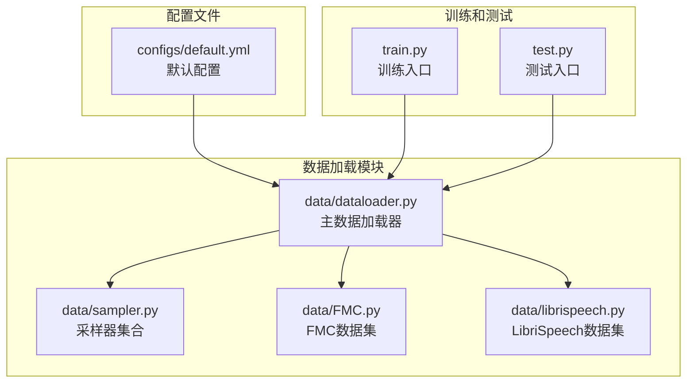
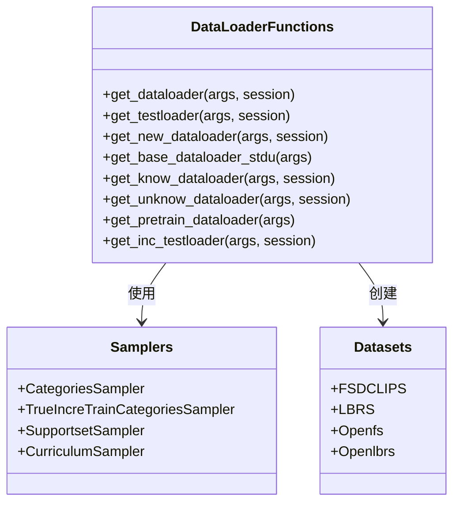
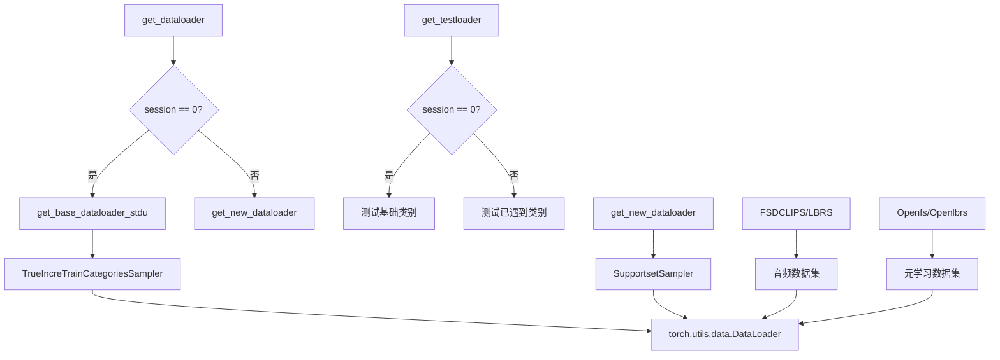
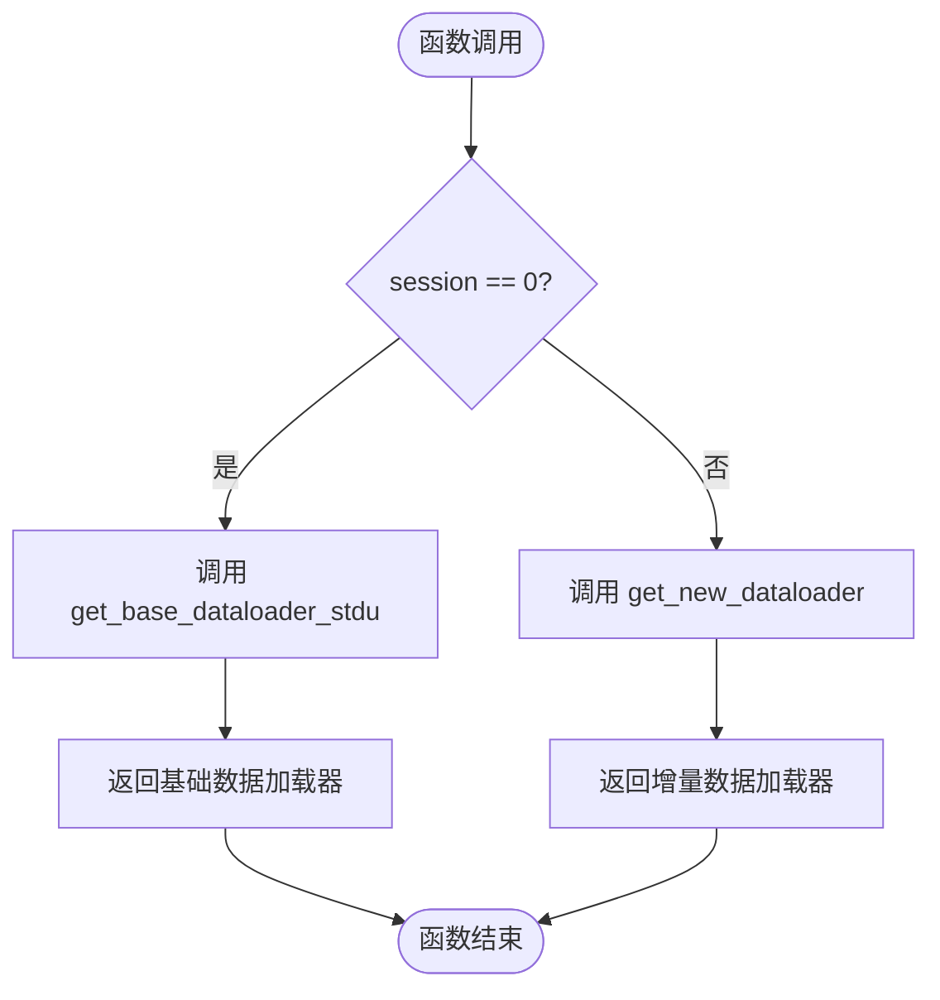
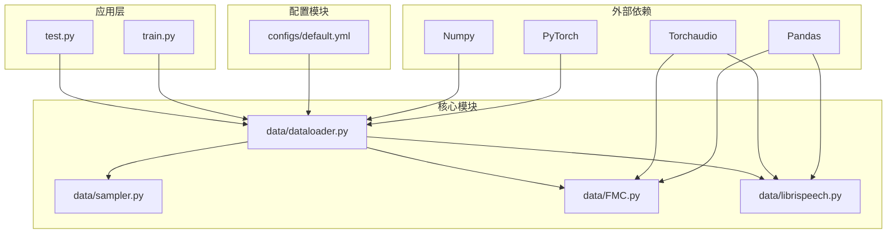
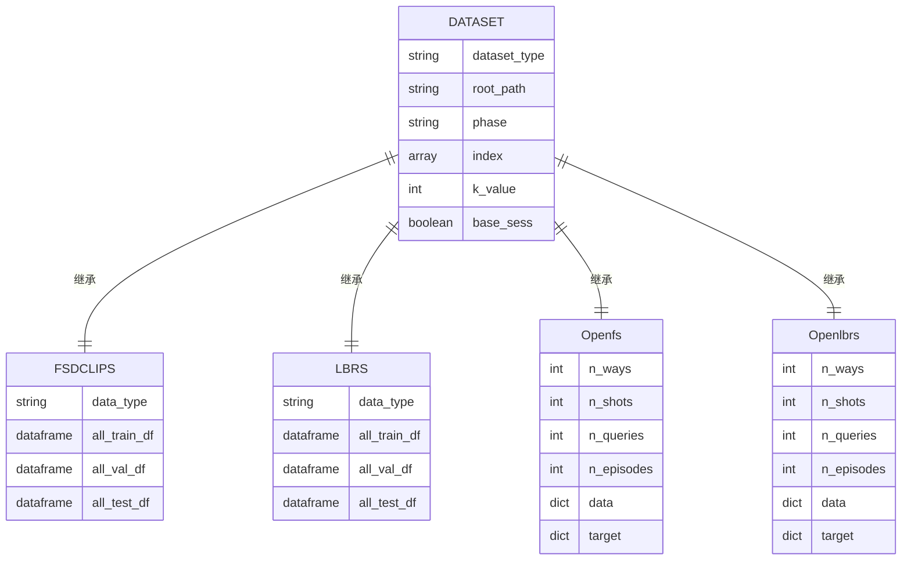
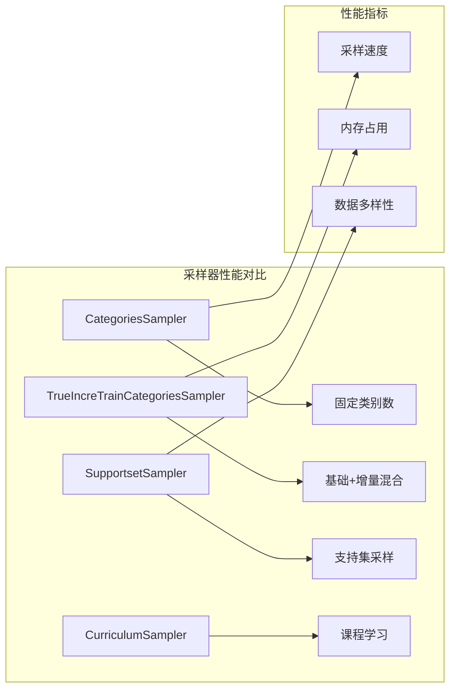

# 数据加载器函数

<cite>
**本文档引用的文件**
- [data/dataloader.py](file://data/dataloader.py)
- [data/sampler.py](file://data/sampler.py)
- [configs/default.yml](file://configs/default.yml)
- [data/FMC.py](file://data/FMC.py)
- [data/librispeech.py](file://data/librispeech.py)
- [train.py](file://train.py)
- [test.py](file://test.py)
</cite>

## 目录
1. [简介](#简介)
2. [项目结构](#项目结构)
3. [核心组件](#核心组件)
4. [架构概览](#架构概览)
5. [详细组件分析](#详细组件分析)
6. [依赖关系分析](#依赖关系分析)
7. [性能考虑](#性能考虑)
8. [故障排除指南](#故障排除指南)
9. [结论](#结论)

## 简介

本文档提供了数据加载器函数的完整API文档，重点涵盖以下核心函数：
- `get_dataloader`: 主要的数据加载器入口函数，根据会话阶段返回相应的训练数据加载器
- `get_testloader`: 测试数据加载器函数，支持基础会话和增量会话的测试
- `get_new_dataloader`: 增量会话的新类数据加载器

文档详细说明了不同会话阶段的数据加载策略，包括基础会话(base)、增量会话(incremental)和测试会话(test)的处理逻辑。同时涵盖了数据加载器的配置选项、性能优化技巧和错误处理策略。

## 项目结构

该项目采用模块化的数据加载架构，主要文件组织如下：

**图表来源**
- [data/dataloader.py:1-351](file://data/dataloader.py#L1-L351)
- [data/sampler.py:1-201](file://data/sampler.py#L1-L201)
- [configs/default.yml:1-88](file://configs/default.yml#L1-L88)

**章节来源**
- [data/dataloader.py:1-351](file://data/dataloader.py#L1-L351)
- [configs/default.yml:1-88](file://configs/default.yml#L1-L88)

## 核心组件

### 数据加载器函数族

系统提供了完整的数据加载器函数族，支持多种数据集类型和会话模式：

**图表来源**
- [data/dataloader.py:48-254](file://data/dataloader.py#L48-L254)
- [data/sampler.py:6-201](file://data/sampler.py#L6-L201)

### 会话阶段处理策略

系统实现了三种主要的会话阶段处理策略：

1. **基础会话(Base Session)**: 仅包含已知类别的训练数据
2. **增量会话(Incremental Session)**: 包含已知类别和新增类别的混合训练数据
3. **测试会话(Test Session)**: 评估模型在已遇到类别的表现

**章节来源**
- [data/dataloader.py:48-106](file://data/dataloader.py#L48-L106)

## 架构概览

数据加载器架构采用分层设计，支持多种数据集类型和采样策略：

**图表来源**
- [data/dataloader.py:48-254](file://data/dataloader.py#L48-L254)
- [data/sampler.py:38-141](file://data/sampler.py#L38-L141)

## 详细组件分析

### get_dataloader 函数

`get_dataloader` 是数据加载器的主要入口函数，负责根据会话阶段返回相应的训练数据加载器。

**函数签名**: `get_dataloader(args, session)`

**参数说明**:
- `args`: 配置参数对象，包含数据集路径、批次大小、工作进程数等配置
- `session`: 会话编号，0表示基础会话，>0表示增量会话

**返回值**:
- `(trainset, trainloader)`: 返回训练数据集和对应的DataLoader实例

**使用场景**:
- 基础会话训练：`get_dataloader(args, 0)`
- 增量会话训练：`get_dataloader(args, session)` (session > 0)

**实现逻辑**:

**图表来源**
- [data/dataloader.py:48-54](file://data/dataloader.py#L48-L54)

**章节来源**
- [data/dataloader.py:48-54](file://data/dataloader.py#L48-L54)

### get_testloader 函数

`get_testloader` 函数用于生成测试数据加载器，支持基础会话和增量会话的测试需求。

**函数签名**: `get_testloader(args, session)`

**参数说明**:
- `args`: 配置参数对象
- `session`: 会话编号

**返回值**:
- `(testset, testloader)`: 返回测试数据集和DataLoader实例

**测试范围差异**:
- 基础会话: 测试所有已知类别 (0 到 num_base)
- 增量会话: 测试到当前会话为止的所有已遇到类别 (0 到 num_base + session*way)

**数据集支持**:
- FMC: FSDCLIPS 数据集
- NSynth: NDS 数据集  
- LibriSpeech: LBRS 数据集
- S2S: S2S 数据集 (多源转换)

**章节来源**
- [data/dataloader.py:57-81](file://data/dataloader.py#L57-L81)

### get_new_dataloader 函数

`get_new_dataloader` 专门处理增量会话的新类别数据加载。

**函数签名**: `get_new_dataloader(args, session)`

**参数说明**:
- `args`: 配置参数对象
- `session`: 必须 > 0 的增量会话编号

**返回值**:
- `(trainset, trainloader)`: 返回新类别训练数据集和DataLoader

**采样策略**:
使用 `SupportsetSampler` 进行支持集采样，支持以下配置：
- `n_cls`: 每批次类别数 (episode_way*2)
- `n_per`: 每类别样本数 (episode_shot)
- `seq_sample`: 是否使用顺序采样

**章节来源**
- [data/dataloader.py:206-230](file://data/dataloader.py#L206-L230)
- [data/sampler.py:97-141](file://data/sampler.py#L97-L141)

### 基础数据加载器

`get_base_dataloader_stdu` 处理基础会话的数据加载，支持临时训练配置。

**关键特性**:
- 支持临时训练配置 (`tmp_train`)
- 使用 `TrueIncreTrainCategoriesSampler` 进行类别采样
- 支持基础类别和增量类别的组合

**采样器配置**:
- `na_base_cls`: 基础类别数量
- `na_inc_cls`: 增量类别数量  
- `np_base_cls`: 基础类别采样数 (low_way)
- `np_inc_cls`: 增量类别采样数 (episode_way)
- `nb_shot`: 基础类别样本数 (low_shot)
- `nn_shot`: 增量类别样本数 (episode_shot)
- `n_query`: 查询样本数 (episode_query)

**章节来源**
- [data/dataloader.py:134-168](file://data/dataloader.py#L134-L168)
- [data/sampler.py:38-94](file://data/sampler.py#L38-L94)

## 依赖关系分析

数据加载器系统具有清晰的依赖层次结构：

**图表来源**
- [data/dataloader.py:1-3](file://data/dataloader.py#L1-L3)
- [configs/default.yml:57-60](file://configs/default.yml#L57-L60)

### 数据集依赖关系

**图表来源**
- [data/FMC.py:21-367](file://data/FMC.py#L21-L367)
- [data/librispeech.py:21-278](file://data/librispeech.py#L21-L278)

**章节来源**
- [data/dataloader.py:1-351](file://data/dataloader.py#L1-L351)
- [data/sampler.py:1-201](file://data/sampler.py#L1-L201)

## 性能考虑

### 并行处理配置

数据加载器采用了多进程并行处理来提升性能：

**配置选项**:
- `num_workers`: 默认8个工作进程
- `pin_memory`: 启用页面锁定内存
- `batch_size`: 训练批次大小128，测试批次大小100

**性能优化建议**:
1. **CPU利用率**: 根据CPU核心数调整 `num_workers`
2. **内存管理**: 合理设置 `batch_size` 避免内存溢出
3. **I/O优化**: 使用 `pin_memory` 加速GPU数据传输

### 采样器性能特性

**章节来源**
- [data/dataloader.py:128-130](file://data/dataloader.py#L128-L130)
- [data/sampler.py:6-201](file://data/sampler.py#L6-L201)

## 故障排除指南

### 常见问题及解决方案

**问题1: 数据集路径错误**
- **症状**: FileNotFoundError 或数据集为空
- **解决方案**: 检查 `args.dataroot` 和 `args.dataset` 配置

**问题2: 内存不足**
- **症状**: OOM错误或系统假死
- **解决方案**: 减少 `batch_size` 或 `num_workers`

**问题3: 采样器异常**
- **症状**: AssertionError 或采样失败
- **解决方案**: 检查类别数量是否足够支持 `n_cls` 配置

**问题4: 数据加载缓慢**
- **症状**: 数据加载时间过长
- **解决方案**: 调整 `num_workers` 和启用 `pin_memory`

### 调试方法

**数据管道调试**:
1. **检查数据集完整性**: 验证 `__len__` 和 `__getitem__` 方法
2. **验证采样器**: 确认类别采样逻辑正确
3. **监控内存使用**: 使用 `torch.cuda.memory_allocated()`

**监控指标**:
- 数据加载时间
- 内存使用情况  
- 批次大小适配度
- 采样器效率

**章节来源**
- [data/dataloader.py:1-351](file://data/dataloader.py#L1-L351)
- [data/sampler.py:1-201](file://data/sampler.py#L1-L201)

## 结论

本数据加载器系统提供了完整的增量学习数据处理解决方案，具有以下特点：

1. **模块化设计**: 清晰的函数分离和依赖关系
2. **多数据集支持**: 支持FMC、NSynth、LibriSpeech等多种数据集
3. **会话感知**: 针对基础、增量、测试三种会话模式的专门处理
4. **性能优化**: 多进程并行、内存管理和采样器优化
5. **可扩展性**: 易于添加新的数据集类型和采样策略

该系统为增量学习任务提供了可靠的数据加载基础设施，支持高效的训练和测试流程。