# 数据集类API

<cite>
**本文档引用的文件**
- [FMC.py](file://data/FMC.py)
- [librispeech.py](file://data/librispeech.py)
- [nsynth.py](file://data/nsynth.py)
- [dataloader.py](file://data/dataloader.py)
- [sampler.py](file://data/sampler.py)
- [audio_augment.py](file://utils/audio_augment.py)
- [default.yml](file://configs/default.yml)
- [mid_eval.yml](file://configs/mid_eval.yml)
</cite>

## 目录
1. [简介](#简介)
2. [项目结构](#项目结构)
3. [核心组件](#核心组件)
4. [架构概览](#架构概览)
5. [详细组件分析](#详细组件分析)
6. [依赖关系分析](#依赖关系分析)
7. [性能考虑](#性能考虑)
8. [故障排除指南](#故障排除指南)
9. [结论](#结论)

## 简介

本文件为数据集类的详细API文档，涵盖FSDCLIPS、NDS、LBRS等数据集类的完整接口规范。这些数据集类专为少样本音频分类任务设计，支持基础会话（base session）和增量会话（incremental session）两种训练模式，并提供开放集识别能力。

## 项目结构

该项目采用模块化的数据集组织方式，主要文件结构如下：

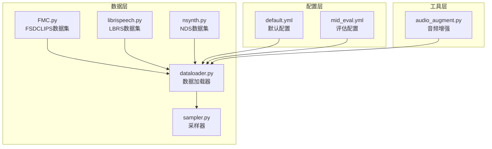

**图表来源**
- [FMC.py:1-367](file://data/FMC.py#L1-L367)
- [librispeech.py:1-278](file://data/librispeech.py#L1-L278)
- [nsynth.py:1-287](file://data/nsynth.py#L1-L287)
- [dataloader.py:1-351](file://data/dataloader.py#L1-L351)

**章节来源**
- [FMC.py:1-367](file://data/FMC.py#L1-L367)
- [librispeech.py:1-278](file://data/librispeech.py#L1-L278)
- [nsynth.py:1-287](file://data/nsynth.py#L1-L287)
- [dataloader.py:1-351](file://data/dataloader.py#L1-L351)

## 核心组件

### 数据集基类架构

所有数据集类都继承自PyTorch的Dataset基类，提供统一的接口规范：

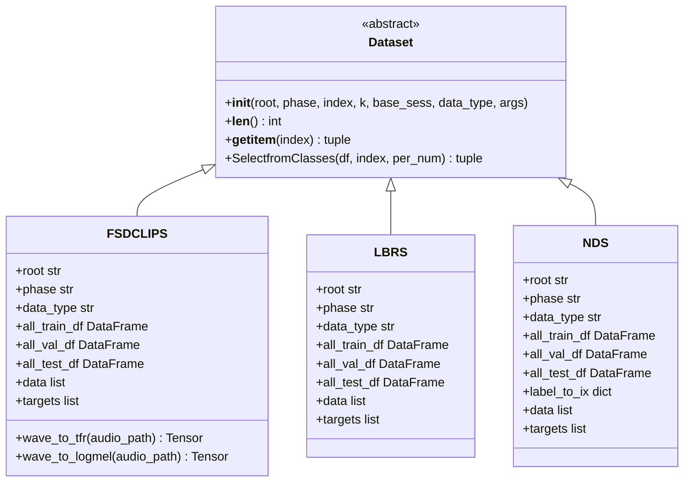

**图表来源**
- [FMC.py:21-101](file://data/FMC.py#L21-L101)
- [librispeech.py:21-79](file://data/librispeech.py#L21-L79)
- [nsynth.py:21-109](file://data/nsynth.py#L21-L109)

### 开放集数据集类

针对元学习场景设计的开放集数据集类：

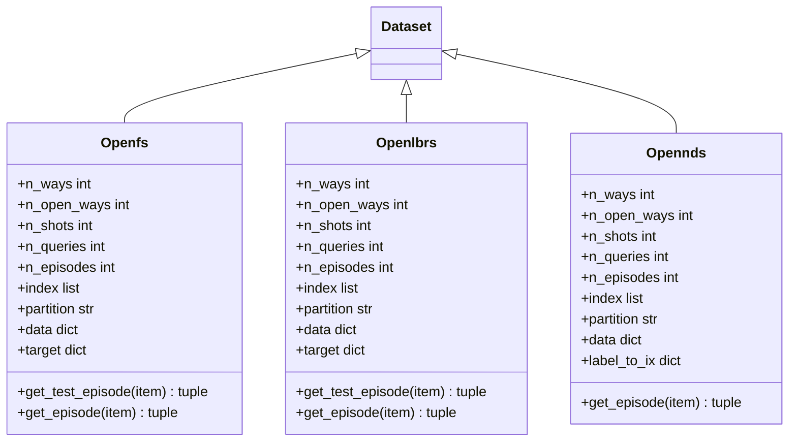

**图表来源**
- [FMC.py:151-351](file://data/FMC.py#L151-L351)
- [librispeech.py:82-263](file://data/librispeech.py#L82-L263)
- [nsynth.py:160-272](file://data/nsynth.py#L160-L272)

## 架构概览

数据集系统采用分层架构设计，确保了良好的可扩展性和可维护性：

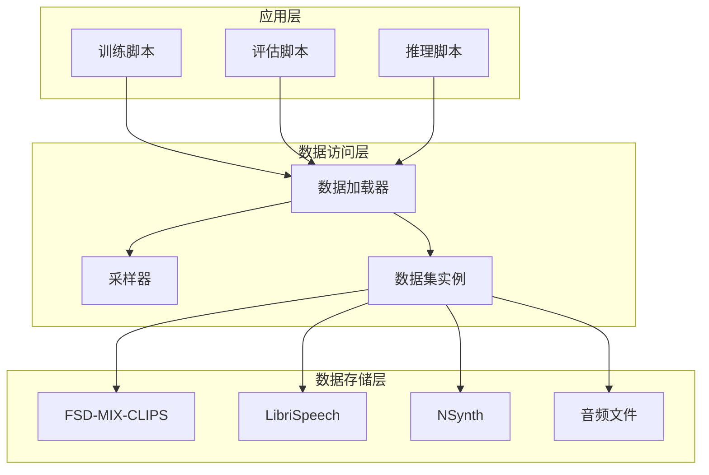

**图表来源**
- [dataloader.py:19-46](file://data/dataloader.py#L19-L46)
- [sampler.py:6-36](file://data/sampler.py#L6-L36)

## 详细组件分析

### FSDCLIPS数据集类

#### 初始化参数

| 参数名 | 类型 | 必需 | 默认值 | 描述 |
|--------|------|------|--------|------|
| root | str | 是 | './' | 数据根目录路径 |
| phase | str | 是 | 'train' | 数据集阶段 ('train', 'val', 'test') |
| index | list | 否 | None | 类别索引列表 |
| k | int | 否 | 5 | 每类样本数量限制 |
| base_sess | bool | 否 | None | 是否为基础会话 |
| data_type | str | 否 | 'audio' | 数据类型 |
| args | object | 否 | None | 配置参数对象 |

#### 数据加载方法

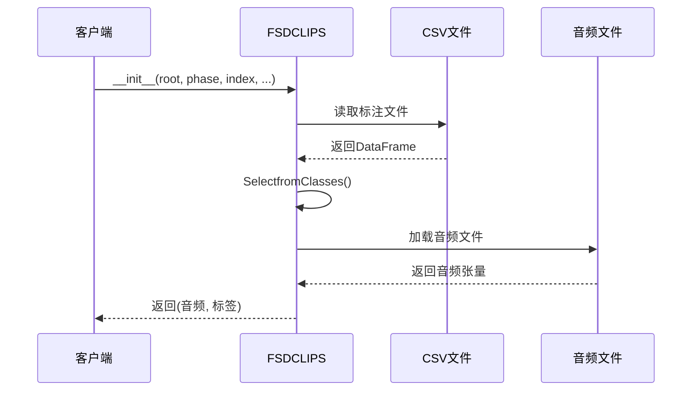

**图表来源**
- [FMC.py:23-54](file://data/FMC.py#L23-L54)
- [FMC.py:57-90](file://data/FMC.py#L57-L90)

#### 数据格式要求

- **音频格式**: WAV文件，采样率44100Hz
- **标注格式**: CSV文件，包含以下列：
  - `FSD_MIX_SED_filename`: 音频文件名
  - `start_time`: 起始时间戳
  - `label`: 类别标签
  - `data_folder`: 数据文件夹路径

#### 标签映射规则

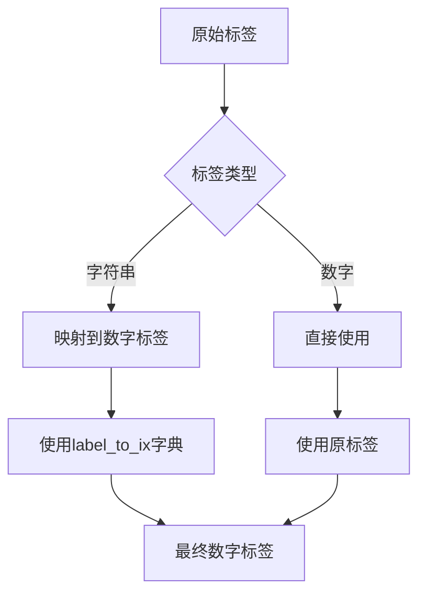

**图表来源**
- [FMC.py:32-34](file://data/FMC.py#L32-L34)
- [FMC.py:76-78](file://data/FMC.py#L76-L78)

#### 特征提取接口

| 方法名 | 输入 | 输出 | 描述 |
|--------|------|------|------|
| wave_to_tfr | audio_path | Tensor | 计算时频图 |
| wave_to_logmel | audio_path | Tensor | 计算对数梅尔谱 |

#### 数据验证机制

1. **文件存在性检查**: 自动验证音频文件路径
2. **标签一致性**: 确保标签与音频文件匹配
3. **数据完整性**: 验证音频文件可正常解码

**章节来源**
- [FMC.py:21-101](file://data/FMC.py#L21-L101)
- [FMC.py:103-150](file://data/FMC.py#L103-L150)

### LBRS数据集类

#### 初始化参数

| 参数名 | 类型 | 必需 | 默认值 | 描述 |
|--------|------|------|--------|------|
| root | str | 是 | './' | 数据根目录路径 |
| phase | str | 是 | 'train' | 数据集阶段 ('train', 'val', 'test') |
| index | list | 否 | None | 类别索引列表 |
| k | int | 否 | 5 | 每类样本数量限制 |
| base_sess | bool | 否 | None | 是否为基础会话 |
| data_type | str | 否 | 'audio' | 数据类型 |
| args | object | 否 | None | 配置参数对象 |
| session | int | 否 | 0 | 会话编号 |

#### 数据格式要求

- **音频格式**: WAV文件
- **标注格式**: CSV文件，包含以下列：
  - `filename`: 音频文件相对路径
  - `label`: 类别标签

#### 数据分割方法

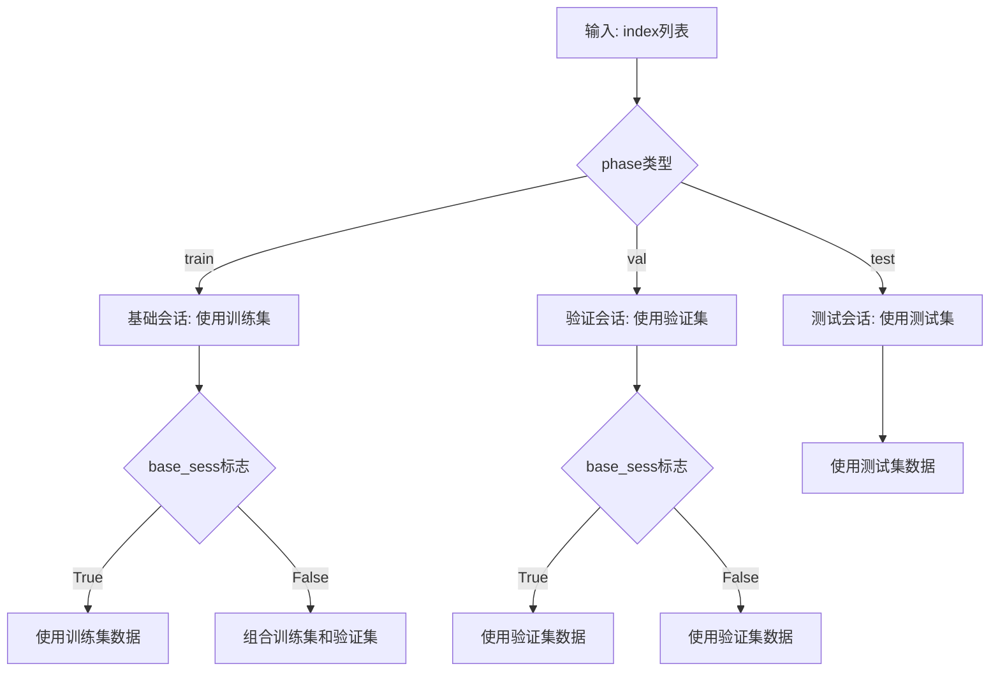

**图表来源**
- [librispeech.py:35-53](file://data/librispeech.py#L35-L53)

**章节来源**
- [librispeech.py:21-79](file://data/librispeech.py#L21-L79)
- [librispeech.py:55-71](file://data/librispeech.py#L55-L71)

### NDS数据集类

#### 初始化参数

| 参数名 | 类型 | 必需 | 默认值 | 描述 |
|--------|------|------|--------|------|
| root | str | 是 | './' | 数据根目录路径 |
| phase | str | 是 | 'train' | 数据集阶段 ('train', 'val', 'test') |
| index | list | 否 | None | 类别索引列表 |
| k | int | 否 | 5 | 每类样本数量限制 |
| base_sess | bool | 否 | None | 是否为基础会话 |
| data_type | str | 否 | 'audio' | 数据类型 |
| args | object | 否 | None | 配置参数对象 |

#### 标签映射规则

NDS数据集使用JSON词表文件进行标签映射：

**图表来源**
- [nsynth.py:34-35](file://data/nsynth.py#L34-L35)
- [nsynth.py:76-78](file://data/nsynth.py#L76-L78)

#### 数据格式要求

- **音频格式**: WAV文件，采样率16000Hz
- **标注格式**: CSV文件，包含以下列：
  - `audio_source`: 音频源标识
  - `filename`: 音频文件名
  - `instrument`: 乐器类型

**章节来源**
- [nsynth.py:21-109](file://data/nsynth.py#L21-L109)
- [nsynth.py:185-212](file://data/nsynth.py#L185-L212)

### 开放集数据集类

#### 元学习接口

开放集数据集类提供专门的元学习接口：

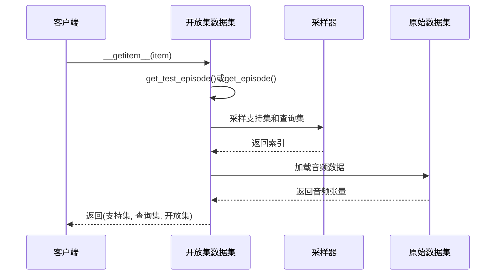

**图表来源**
- [FMC.py:231-287](file://data/FMC.py#L231-L287)
- [librispeech.py:143-261](file://data/librispeech.py#L143-L261)
- [nsynth.py:214-272](file://data/nsynth.py#L214-L272)

#### 参数配置

| 参数名 | 类型 | 描述 |
|--------|------|------|
| n_ways | int | 任务中的类别数量 |
| n_open_ways | int | 开放集类别数量 |
| n_shots | int | 每类支持样本数 |
| n_queries | int | 每类查询样本数 |
| n_episodes | int | 试验次数 |
| fix_seed | bool | 固定随机种子 |

**章节来源**
- [FMC.py:152-164](file://data/FMC.py#L152-L164)
- [librispeech.py:83-94](file://data/librispeech.py#L83-L94)
- [nsynth.py:161-168](file://data/nsynth.py#L161-L168)

## 依赖关系分析

### 数据加载器架构

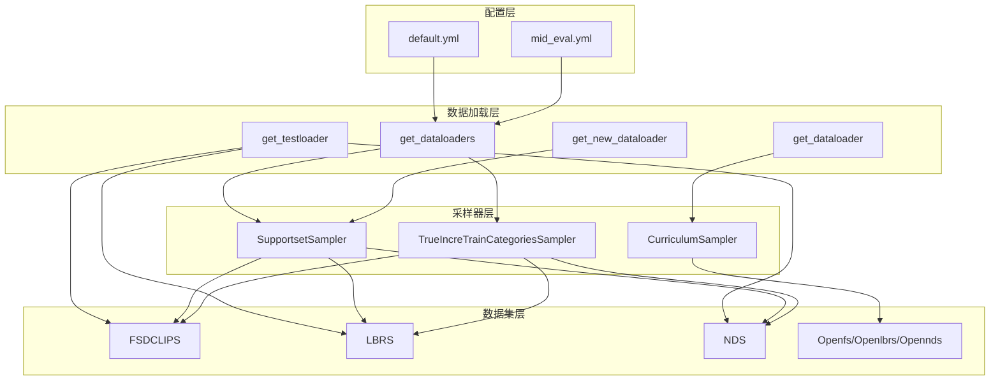

**图表来源**
- [dataloader.py:19-46](file://data/dataloader.py#L19-L46)
- [sampler.py:6-36](file://data/sampler.py#L6-L36)

### 数据流处理

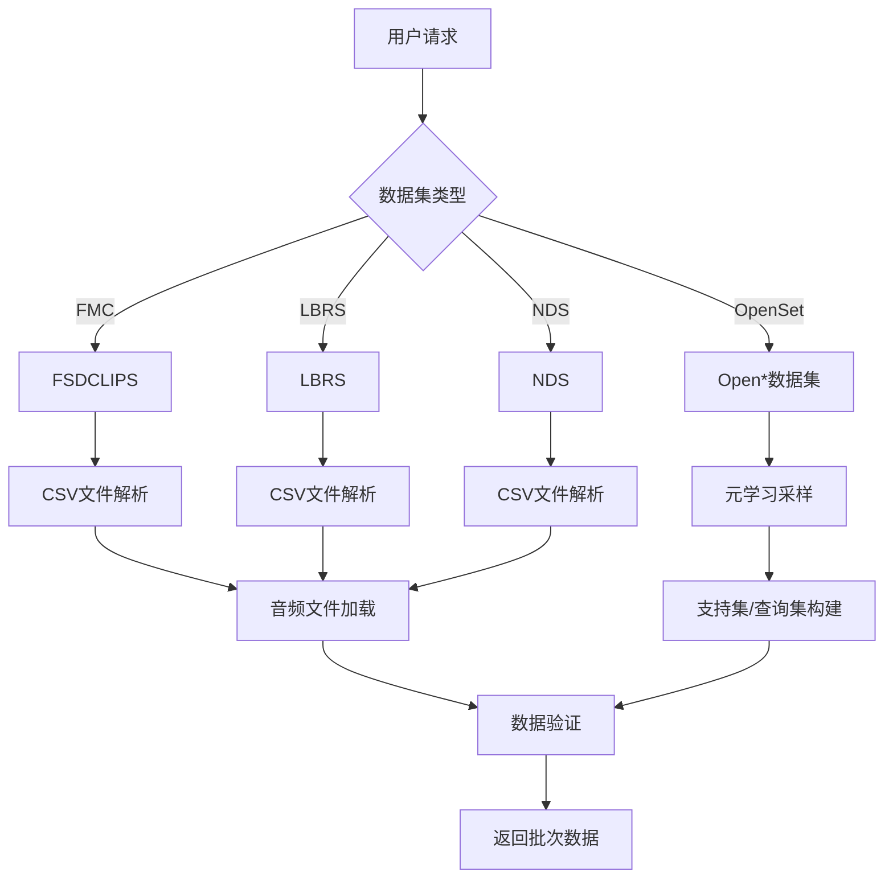

**图表来源**
- [dataloader.py:48-81](file://data/dataloader.py#L48-L81)
- [dataloader.py:206-230](file://data/dataloader.py#L206-L230)

**章节来源**
- [dataloader.py:19-351](file://data/dataloader.py#L19-L351)
- [sampler.py:1-201](file://data/sampler.py#L1-L201)

## 性能考虑

### 内存优化策略

1. **延迟加载**: 音频文件仅在需要时加载
2. **批处理优化**: 使用适当的batch size平衡内存使用
3. **数据类型优化**: 使用合适的张量数据类型

### 并行处理配置

| 配置项 | 默认值 | 说明 |
|--------|--------|------|
| num_workers | 8 | 数据加载工作进程数 |
| pin_memory | True | 锁页内存加速GPU传输 |
| batch_size | 128 | 训练批次大小 |
| test_batch_size | 100 | 测试批次大小 |

### 缓存策略

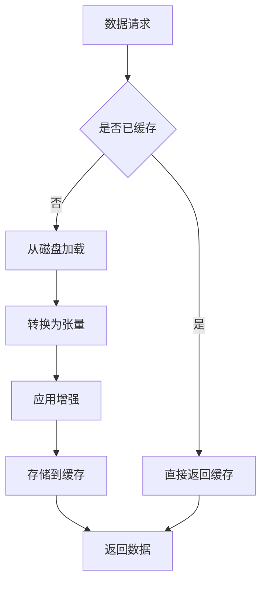

**图表来源**
- [dataloader.py:128-132](file://data/dataloader.py#L128-L132)

## 故障排除指南

### 常见问题及解决方案

#### 数据集初始化错误

**问题**: 数据集路径不存在
**解决方案**: 检查root参数和CSV文件路径

**问题**: 标签映射失败
**解决方案**: 验证label_to_ix字典和CSV文件格式

#### 数据加载错误

**问题**: 音频文件损坏
**解决方案**: 使用torchaudio.load()进行文件完整性检查

**问题**: 内存不足
**解决方案**: 减小batch_size或num_workers

#### 元学习采样错误

**问题**: 类别数量不足
**解决方案**: 检查index参数和可用类别数量

**章节来源**
- [FMC.py:32-34](file://data/FMC.py#L32-L34)
- [librispeech.py:31-33](file://data/librispeech.py#L31-L33)
- [nsynth.py:31-35](file://data/nsynth.py#L31-L35)

## 结论

本数据集类API提供了完整的少样本音频分类解决方案，具有以下特点：

1. **标准化接口**: 统一的Dataset基类接口，便于扩展和维护
2. **灵活配置**: 支持多种数据集类型和配置选项
3. **高效性能**: 优化的数据加载和采样机制
4. **开放集支持**: 专门的元学习接口，支持开放集识别
5. **易于使用**: 清晰的参数说明和使用示例

该API为音频少样本学习研究提供了坚实的基础，支持从基础会话到增量会话的完整训练流程。