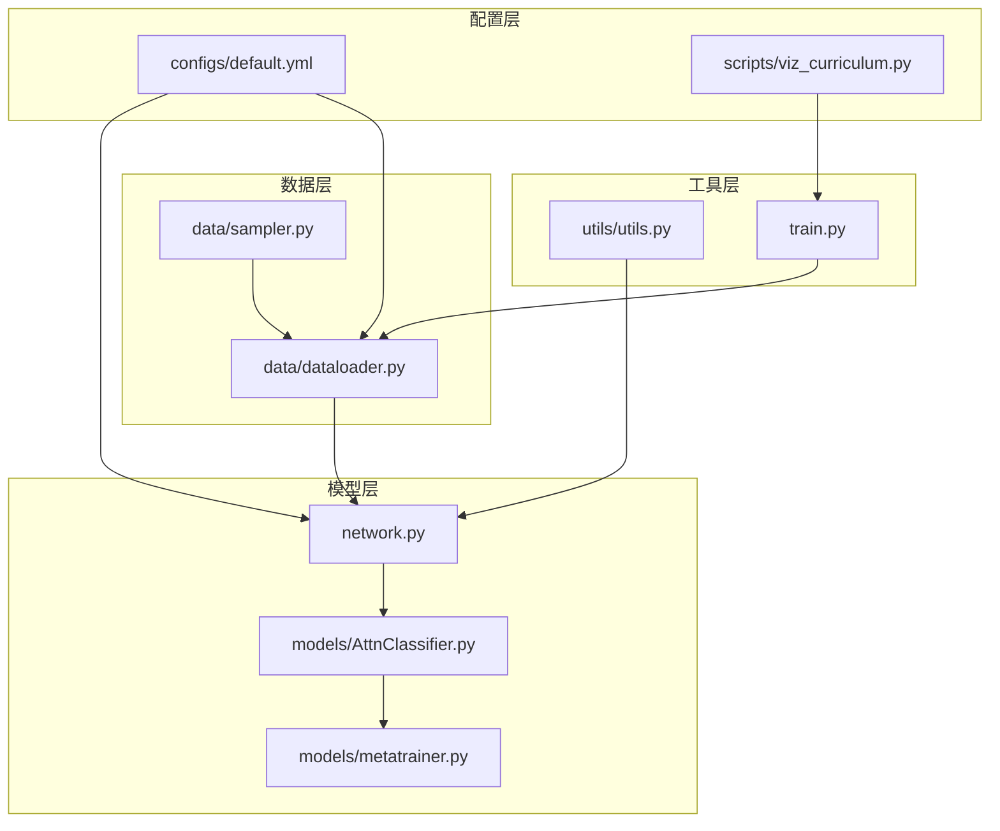
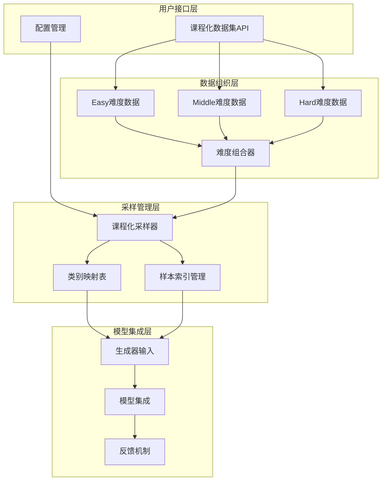
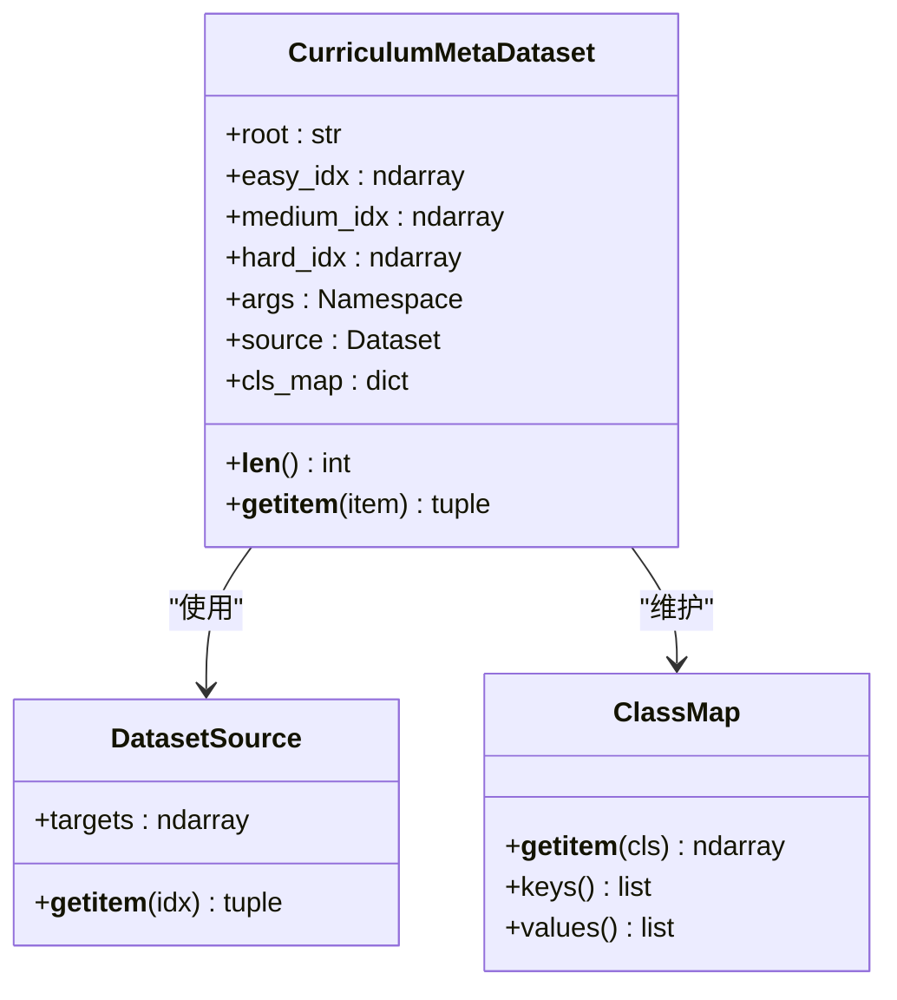
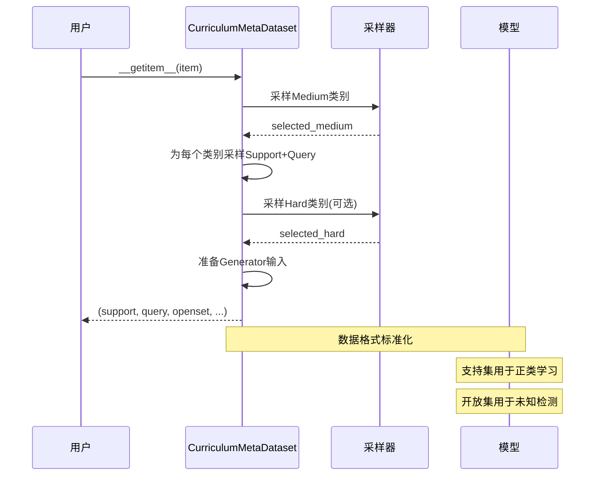
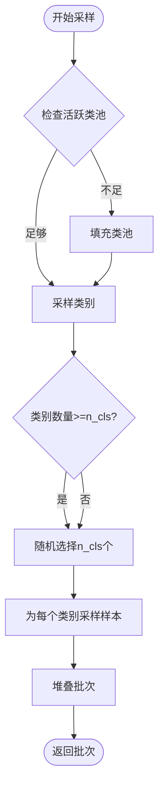
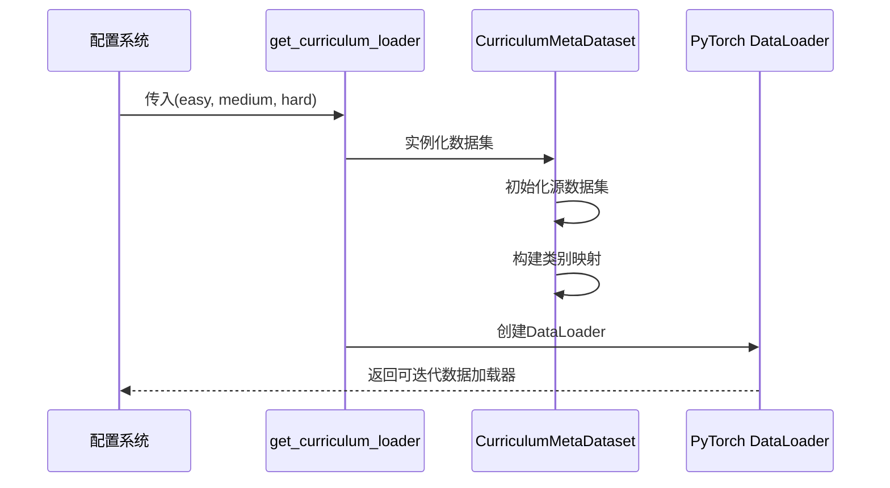
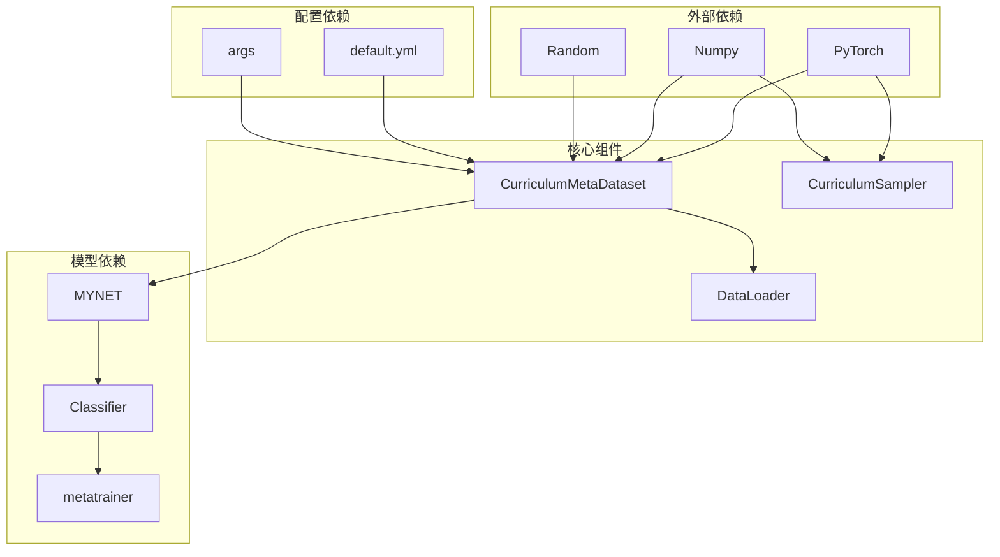

# 课程化数据集API

<cite>
**本文档引用的文件**
- [data/dataloader.py](file://data/dataloader.py)
- [data/sampler.py](file://data/sampler.py)
- [configs/default.yml](file://configs/default.yml)
- [scripts/viz_curriculum.py](file://scripts/viz_curriculum.py)
- [network.py](file://network.py)
- [models/metatrainer.py](file://models/metatrainer.py)
- [models/AttnClassifier.py](file://models/AttnClassifier.py)
- [utils/utils.py](file://utils/utils.py)
- [train.py](file://train.py)
</cite>

## 目录
1. [简介](#简介)
2. [项目结构](#项目结构)
3. [核心组件](#核心组件)
4. [架构概览](#架构概览)
5. [详细组件分析](#详细组件分析)
6. [依赖关系分析](#依赖关系分析)
7. [性能考虑](#性能考虑)
8. [故障排除指南](#故障排除指南)
9. [结论](#结论)
10. [附录](#附录)

## 简介

课程化数据集CurriculumMetaDataset是本项目实现课程化学习的核心组件，专门设计用于处理少样本开放集增量学习场景中的难度递进数据组织。该数据集接口实现了Easy-Medium-Hard三个难度级别的数据组织和访问方法，通过动态组合策略将已知类别(Easy)、当前任务(Medium)和未知类别(Hard)有机结合，为模型提供渐进式的学习体验。

课程化学习的核心理念是模拟人类认知发展过程，从简单的已知概念开始，逐步过渡到复杂的当前任务，最后挑战未知领域。这种设计不仅提高了模型的学习效率，还增强了泛化能力和鲁棒性。

## 项目结构

该项目采用模块化的架构设计，主要包含以下核心模块：

**图表来源**
- [data/dataloader.py:263-351](file://data/dataloader.py#L263-L351)
- [data/sampler.py:141-201](file://data/sampler.py#L141-L201)
- [configs/default.yml:1-88](file://configs/default.yml#L1-L88)

**章节来源**
- [data/dataloader.py:1-351](file://data/dataloader.py#L1-L351)
- [data/sampler.py:1-201](file://data/sampler.py#L1-L201)
- [configs/default.yml:1-88](file://configs/default.yml#L1-L88)

## 核心组件

### CurriculumMetaDataset类

CurriculumMetaDataset是课程化学习数据集的核心实现，继承自PyTorch的Dataset基类，提供了完整的课程化采样机制。

#### 主要特性

1. **三难度级别组织**：
   - Easy (已知类别)：记忆/上下文信息
   - Medium (当前任务)：支持/查询数据
   - Hard (未知类别)：开放集拒绝

2. **动态采样策略**：
   - 支持可重复采样机制
   - 自适应难度调整
   - 智能类别组合

3. **完整的数据流**：
   - 支持集(Support)和查询集(Query)分离
   - 开放集数据处理
   - 原型生成器输入准备

**章节来源**
- [data/dataloader.py:263-346](file://data/dataloader.py#L263-L346)

### CurriculumSampler类

CurriculumSampler是专门为课程化学习设计的采样器，实现了基于活跃类池的动态采样机制。

#### 关键功能

1. **活跃类池管理**：
   - 动态更新允许采样的类别集合
   - 支持课程化难度递增
   - 智能类池填充机制

2. **采样策略**：
   - 从活跃类池中随机采样
   - 支持重复采样确保样本充足
   - 保持课程化学习的渐进性

**章节来源**
- [data/sampler.py:141-201](file://data/sampler.py#L141-L201)

## 架构概览

课程化数据集系统采用分层架构设计，各组件职责明确，耦合度低，便于扩展和维护。

**图表来源**
- [data/dataloader.py:263-346](file://data/dataloader.py#L263-L346)
- [data/sampler.py:141-201](file://data/sampler.py#L141-L201)

## 详细组件分析

### CurriculumMetaDataset详细实现

CurriculumMetaDataset类实现了完整的课程化学习数据集功能，包括数据组织、采样策略和输出格式。

#### 初始化参数详解

| 参数名 | 类型 | 必需 | 描述 |
|--------|------|------|------|
| root | str | 是 | 数据根目录路径 |
| easy_idx | array-like | 是 | Easy难度类别索引数组 |
| medium_idx | array-like | 是 | Medium难度类别索引数组 |
| hard_idx | array-like | 是 | Hard难度类别索引数组 |
| args | Namespace | 是 | 配置参数对象 |

#### 数据组织结构

**图表来源**
- [data/dataloader.py:263-286](file://data/dataloader.py#L263-L286)

#### 采样流程分析

**图表来源**
- [data/dataloader.py:290-346](file://data/dataloader.py#L290-L346)

**章节来源**
- [data/dataloader.py:263-346](file://data/dataloader.py#L263-L346)

### CurriculumSampler详细实现

CurriculumSampler类提供了课程化学习的核心采样机制，实现了基于活跃类池的动态采样。

#### 采样算法流程

**图表来源**
- [data/sampler.py:184-201](file://data/sampler.py#L184-L201)

#### 活跃类池管理机制

CurriculumSampler的核心优势在于其动态活跃类池管理：

1. **初始状态**：所有基础类都处于活跃状态
2. **动态更新**：根据课程化进度更新允许采样的类别
3. **智能填充**：当活跃类不足时自动填充随机基础类
4. **边界处理**：确保采样过程的稳定性和有效性

**章节来源**
- [data/sampler.py:141-201](file://data/sampler.py#L141-L201)

### 数据加载器集成

课程化数据集通过专用的加载器函数与训练流程集成：

**图表来源**
- [data/dataloader.py:348-351](file://data/dataloader.py#L348-L351)

**章节来源**
- [data/dataloader.py:348-351](file://data/dataloader.py#L348-L351)

## 依赖关系分析

课程化数据集系统具有清晰的依赖层次结构，各组件之间的耦合度适中，便于维护和扩展。

**图表来源**
- [data/dataloader.py:263-351](file://data/dataloader.py#L263-L351)
- [configs/default.yml:1-88](file://configs/default.yml#L1-L88)

### 关键依赖关系

1. **数据依赖**：CurriculumMetaDataset依赖于底层数据集实现
2. **配置依赖**：通过args参数接收训练配置
3. **模型依赖**：与MYNET模型紧密集成
4. **采样依赖**：与CurriculumSampler协同工作

**章节来源**
- [data/dataloader.py:263-351](file://data/dataloader.py#L263-L351)
- [configs/default.yml:1-88](file://configs/default.yml#L1-L88)

## 性能考虑

课程化数据集在设计时充分考虑了性能优化，采用了多种策略来提升训练效率和稳定性。

### 内存管理优化

1. **延迟加载**：仅在需要时加载数据样本
2. **缓存机制**：构建类别映射表减少重复查询
3. **批量处理**：通过DataLoader实现高效的批处理

### 训练效率优化

1. **并行采样**：利用多进程提高数据采样速度
2. **内存映射**：支持大容量数据集的高效访问
3. **动态调整**：根据可用资源动态调整采样参数

### 扩展性考虑

1. **插件化设计**：支持不同数据集类型的扩展
2. **配置驱动**：通过配置文件灵活调整参数
3. **接口标准化**：提供统一的数据访问接口

## 故障排除指南

### 常见问题及解决方案

#### 1. 类别数量不足问题

**问题描述**：当Easy或Medium难度类别的样本数量不足时，可能出现采样错误。

**解决方案**：
- 检查类别映射表的完整性
- 确认数据集索引的有效性
- 调整采样参数以支持重复采样

#### 2. 内存溢出问题

**问题描述**：处理大规模数据集时可能出现内存不足。

**解决方案**：
- 调整batch_size参数
- 启用pin_memory选项
- 优化数据加载器的num_workers设置

#### 3. 训练不稳定问题

**问题描述**：课程化学习过程中出现训练不稳定现象。

**解决方案**：
- 检查活跃类池的状态更新
- 调整难度递增策略
- 监控课程化比率的变化趋势

**章节来源**
- [data/dataloader.py:290-346](file://data/dataloader.py#L290-L346)
- [data/sampler.py:161-179](file://data/sampler.py#L161-L179)

## 结论

课程化数据集CurriculumMetaDataset为少样本开放集增量学习提供了强大的数据支撑框架。通过Easy-Medium-Hard三级难度组织和动态组合策略，该系统有效模拟了人类的学习过程，显著提升了模型的学习效率和泛化能力。

### 主要优势

1. **结构化难度递进**：清晰的难度层次设计
2. **动态适应性强**：能够根据学习进度调整难度
3. **扩展性良好**：支持多种数据集类型和模型架构
4. **性能优化完善**：多方面的性能优化策略

### 应用前景

该课程化数据集API为未来的增量学习研究奠定了坚实基础，特别是在少样本学习、开放集识别和持续学习等领域具有广阔的应用前景。

## 附录

### 配置参数参考

| 参数名 | 类型 | 默认值 | 描述 |
|--------|------|--------|------|
| n_ways | int | 5 | 课程化训练中的类别数 |
| n_shots | int | 5 | 支持集样本数 |
| n_queries | int | 15 | 查询集样本数 |
| num_session | int | 5 | 会话总数 |
| num_base | int | 80 | 基础类别数 |
| num_novel | int | 20 | 新类别数 |

### 扩展指南

#### 自定义难度级别

要实现自定义难度级别，需要：

1. **扩展数据集类**：继承CurriculumMetaDataset并重写采样逻辑
2. **修改配置参数**：添加新的难度级别参数
3. **更新采样器**：实现相应的难度级别管理策略

#### 集成新数据集

集成新数据集类型需要：

1. **实现数据集接口**：提供标准的数据访问接口
2. **更新初始化逻辑**：在__init__方法中添加新数据集支持
3. **测试兼容性**：确保与现有采样器的兼容性

**章节来源**
- [configs/default.yml:1-88](file://configs/default.yml#L1-L88)
- [data/dataloader.py:277-280](file://data/dataloader.py#L277-L280)