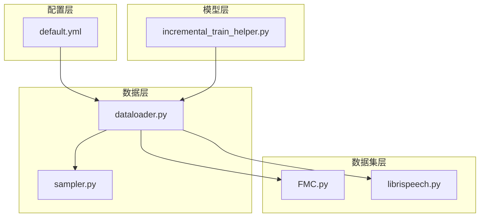
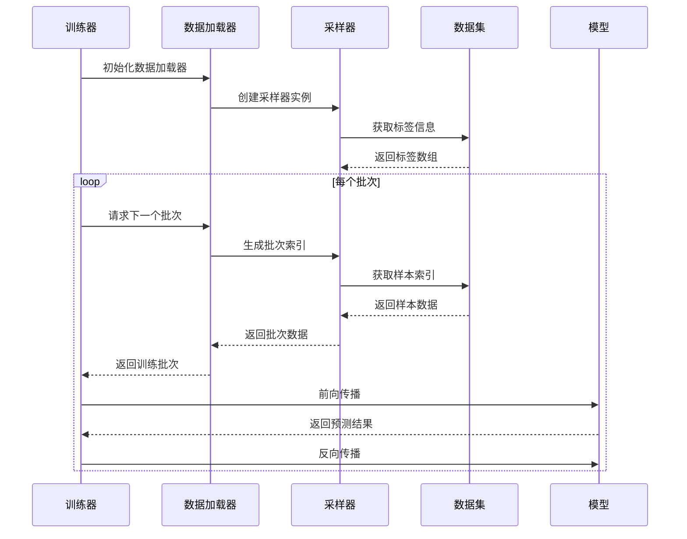
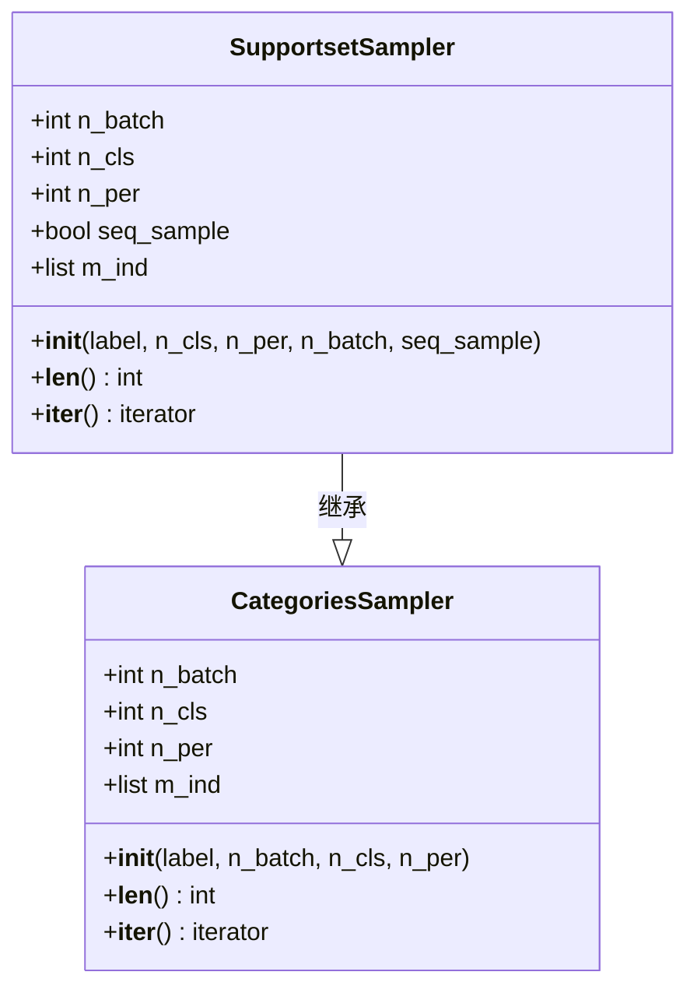
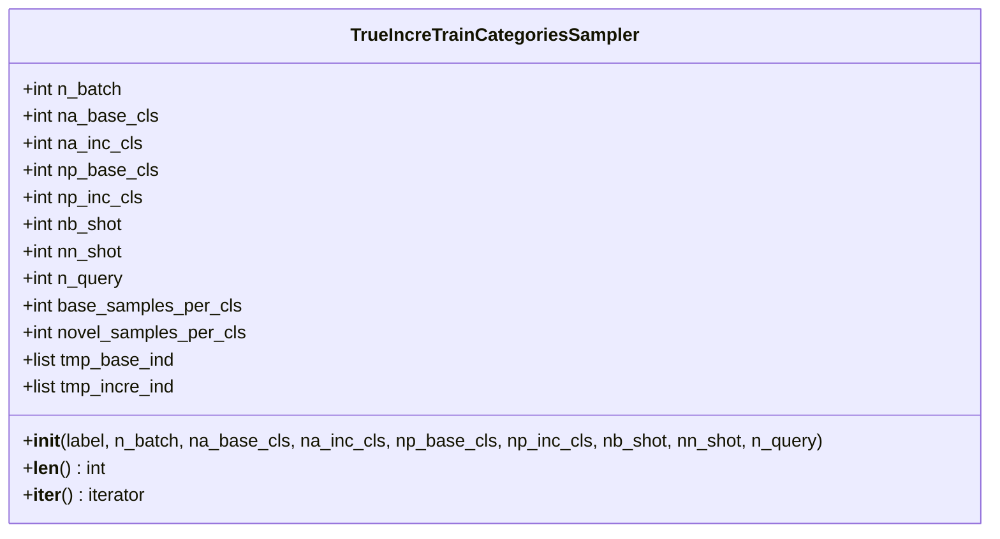
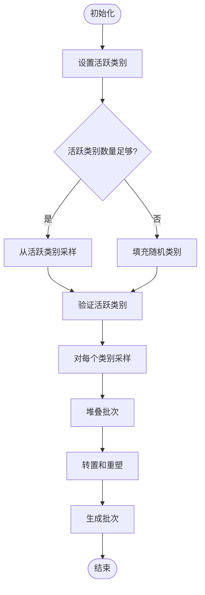
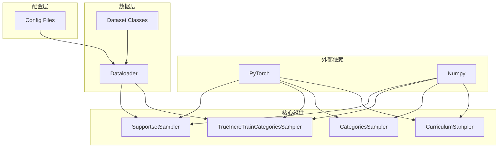
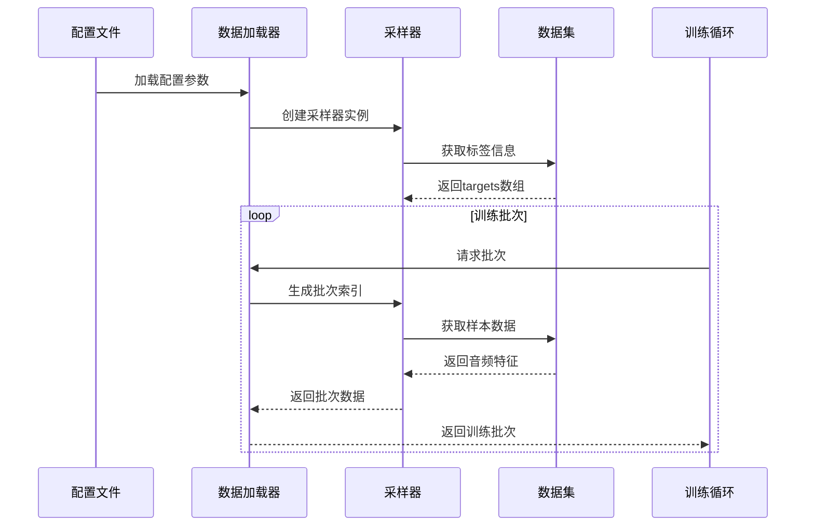

# 采样器API

<cite>
**本文档引用的文件**
- [sampler.py](file://data/sampler.py)
- [dataloader.py](file://data/dataloader.py)
- [default.yml](file://configs/default.yml)
- [FMC.py](file://data/FMC.py)
- [librispeech.py](file://data/librispeech.py)
- [incremental_train_helper.py](file://models/incremental_train_helper.py)
</cite>

## 目录
1. [简介](#简介)
2. [项目结构](#项目结构)
3. [核心组件](#核心组件)
4. [架构概览](#架构概览)
5. [详细组件分析](#详细组件分析)
6. [依赖关系分析](#依赖关系分析)
7. [性能考虑](#性能考虑)
8. [故障排除指南](#故障排除指南)
9. [结论](#结论)

## 简介

本文档提供了采样器系统的详细API文档，重点关注SupportsetSampler和TrueIncreTrainCategoriesSampler两个核心采样器的完整接口规范。这些采样器实现了元学习中的N-way K-shot采样策略，支持支持集和查询集的动态采样过程，包括类别分布控制和样本重采样策略。

采样器系统采用分层设计，支持多种采样策略：
- **SupportsetSampler**: 标准的N-way K-shot采样器，支持序列采样和随机采样
- **TrueIncreTrainCategoriesSampler**: 增量训练专用采样器，支持基础类别和新类别分离采样
- **CurriculumSampler**: 课程学习采样器，支持动态类别激活

## 项目结构

采样器系统位于`data/`目录下，主要文件组织如下：



**图表来源**
- [sampler.py:1-201](file://data/sampler.py#L1-L201)
- [dataloader.py:1-351](file://data/dataloader.py#L1-L351)

**章节来源**
- [sampler.py:1-201](file://data/sampler.py#L1-L201)
- [dataloader.py:1-351](file://data/dataloader.py#L1-L351)

## 核心组件

### SupportsetSampler

SupportsetSampler是标准的N-way K-shot采样器，用于生成支持集和查询集的批次数据。

**主要特性**：
- N-way K-shot采样策略
- 支持序列采样和随机采样模式
- 自动类别索引管理
- 批次数据重新排列

**关键参数**：
- `label`: 数据标签数组
- `n_cls`: 类别数量 (N-way)
- `n_per`: 每类别样本数 (K-shot)
- `n_batch`: 批次数量
- `seq_sample`: 是否启用序列采样模式

**章节来源**
- [sampler.py:97-140](file://data/sampler.py#L97-L140)

### TrueIncreTrainCategoriesSampler

TrueIncreTrainCategoriesSampler是专为增量训练设计的采样器，支持基础类别和新类别分离采样。

**主要特性**：
- 基础类别和新类别分离采样
- 不同的采样策略组合
- 支持临时基础类别和增量类别的动态管理
- 统一的批次生成机制

**关键参数**：
- `label`: 数据标签数组
- `n_batch`: 批次数量
- `na_base_cls`: 基础类别总数
- `na_inc_cls`: 增量类别总数
- `np_base_cls`: 基础类别采样数
- `np_inc_cls`: 增量类别采样数
- `nb_shot`: 基础类别支持集样本数
- `nn_shot`: 新类别支持集样本数
- `n_query`: 查询集样本数

**章节来源**
- [sampler.py:38-93](file://data/sampler.py#L38-L93)

### CategoriesSampler

CategoriesSampler是基础的分类采样器，提供基本的N-way K-shot采样功能。

**主要特性**：
- 简单的类别采样逻辑
- 固定的批次生成策略
- 标准的N-way K-shot实现

**章节来源**
- [sampler.py:6-36](file://data/sampler.py#L6-L36)

## 架构概览

采样器系统采用分层架构，通过数据加载器与训练流程集成：



**图表来源**
- [dataloader.py:157-164](file://data/dataloader.py#L157-L164)
- [dataloader.py:221-227](file://data/dataloader.py#L221-L227)

## 详细组件分析

### SupportsetSampler 详细分析

SupportsetSampler实现了标准的N-way K-shot采样策略，支持两种采样模式：

#### 类结构图



**图表来源**
- [sampler.py:6-36](file://data/sampler.py#L6-L36)
- [sampler.py:97-140](file://data/sampler.py#L97-L140)

#### 采样流程

```mermaid
flowchart TD
Start([开始采样]) --> CheckMode{检查采样模式}
CheckMode --> |序列采样| SeqMode[序列采样模式]
CheckMode --> |随机采样| RandMode[随机采样模式]
SeqMode --> GetClasses[获取类别索引<br/>range(len(m_ind))[:n_cls]]
RandMode --> PermClasses[随机打乱类别<br/>randperm(len(m_ind))[:n_cls]]
GetClasses --> SamplePerClass[对每个类别采样]
PermClasses --> SamplePerClass
SamplePerClass --> CheckSeq{检查是否序列采样}
CheckSeq --> |是| SeqSample[序列采样<br/>range(len(l))[:n_per]]
CheckSeq --> |否| RandSample[随机采样<br/>randperm(len(l))[:n_per]]
SeqSample --> StackBatch[堆叠批次]
RandSample --> StackBatch
StackBatch --> Transpose[转置操作<br/>.t()]
Transpose --> Reshape[重塑为一维索引<br/>.reshape(-1)]
Reshape --> YieldBatch[生成批次]
YieldBatch --> End([结束])
```

**图表来源**
- [sampler.py:118-140](file://data/sampler.py#L118-L140)

#### 关键实现细节

1. **类别索引管理**：自动构建每个类别的样本索引列表
2. **采样策略**：支持随机采样和序列采样两种模式
3. **批次生成**：通过转置和重塑操作生成连续的批次索引
4. **内存优化**：使用PyTorch张量进行高效的数据操作

**章节来源**
- [sampler.py:97-140](file://data/sampler.py#L97-L140)

### TrueIncreTrainCategoriesSampler 详细分析

TrueIncreTrainCategoriesSampler专门设计用于增量训练场景，支持基础类别和新类别的分离采样：

#### 类结构图



**图表来源**
- [sampler.py:38-93](file://data/sampler.py#L38-L93)

#### 增量采样流程

```mermaid
flowchart TD
Start([开始增量采样]) --> BaseBatch[生成基础类别批次]
BaseBatch --> SampleBaseClasses[随机采样基础类别<br/>randperm(len(tmp_base_ind))[:np_base_cls]]
SampleBaseClasses --> SampleBasePerClass[对基础类别采样<br/>base_samples_per_cls = nb_shot + n_query]
SampleBasePerClass --> StackBase[堆叠基础批次<br/>.stack().t().reshape(-1)]
StackBase --> IncreBatch[生成增量类别批次]
IncreBatch --> SampleIncreClasses[随机采样增量类别<br/>randperm(len(tmp_incre_ind))[:np_inc_cls]]
SampleIncreClasses --> SampleIncrePerClass[对增量类别采样<br/>novel_samples_per_cls = nn_shot + n_query]
SampleIncrePerClass --> StackIncre[堆叠增量批次<br/>.stack().t().reshape(-1)]
StackBase --> ConcatBatch[连接批次<br/>torch.concat([base_batch, incre_fs_batch])]
StackIncre --> ConcatBatch
ConcatBatch --> YieldBatch[生成最终批次]
YieldBatch --> End([结束])
```

**图表来源**
- [sampler.py:70-93](file://data/sampler.py#L70-L93)

#### 增量训练策略

1. **类别分离**：基础类别和增量类别分别处理
2. **不同采样策略**：基础类别和新类别使用不同的采样参数
3. **统一批次**：将基础批次和增量批次合并生成最终批次
4. **动态管理**：支持临时基础类别和增量类别的动态切换

**章节来源**
- [sampler.py:38-93](file://data/sampler.py#L38-L93)

### CurriculumSampler 详细分析

CurriculumSampler支持课程学习策略，通过动态调整活跃类别来实现从简单到困难的学习过程：

#### 课程学习机制



**图表来源**
- [sampler.py:141-201](file://data/sampler.py#L141-L201)

**章节来源**
- [sampler.py:141-201](file://data/sampler.py#L141-L201)

## 依赖关系分析

采样器系统与其他组件的依赖关系如下：



**图表来源**
- [sampler.py:1-201](file://data/sampler.py#L1-L201)
- [dataloader.py:1-351](file://data/dataloader.py#L1-L351)

### 数据加载器集成

采样器通过数据加载器与训练流程集成：



**图表来源**
- [dataloader.py:157-164](file://data/dataloader.py#L157-L164)
- [dataloader.py:221-227](file://data/dataloader.py#L221-L227)

**章节来源**
- [dataloader.py:134-230](file://data/dataloader.py#L134-L230)

## 性能考虑

### 内存使用优化

1. **张量操作**：使用PyTorch张量进行高效的内存操作
2. **索引管理**：预构建类别索引列表，避免重复计算
3. **批次生成**：通过转置和重塑操作减少内存复制
4. **数据类型**：使用适当的张量数据类型优化内存使用

### 计算效率提升

1. **向量化操作**：利用NumPy和PyTorch的向量化操作
2. **随机采样优化**：使用`randperm`进行高效的随机采样
3. **批处理策略**：通过批次堆叠减少循环开销
4. **内存预分配**：预分配必要的内存空间

### 并行处理

1. **多进程数据加载**：配置`num_workers`参数进行并行数据加载
2. **GPU加速**：自动将数据移动到GPU进行加速处理
3. **异步I/O**：使用`pin_memory`优化数据传输

## 故障排除指南

### 常见问题及解决方案

1. **类别数量不足**
   - **问题**：活跃类别数量少于所需的N-way
   - **解决方案**：使用`set_active_classes`方法动态调整活跃类别
   - **参考**：[CurriculumSampler.set_active_classes:161-179](file://data/sampler.py#L161-L179)

2. **批次大小异常**
   - **问题**：生成的批次大小与预期不符
   - **解决方案**：检查`n_cls`和`n_per`参数设置
   - **参考**：[SupportsetSampler.__iter__:118-140](file://data/sampler.py#L118-L140)

3. **内存溢出**
   - **问题**：大批量数据导致内存不足
   - **解决方案**：减少`n_batch`或`n_cls`参数，增加`num_workers`
   - **参考**：[dataloader配置:128-130](file://data/dataloader.py#L128-L130)

### 调试技巧

1. **启用调试输出**：在采样器中添加日志输出
2. **验证数据结构**：检查标签数组的形状和内容
3. **监控内存使用**：使用系统工具监控内存使用情况
4. **性能基准测试**：测量不同参数组合的性能表现

**章节来源**
- [sampler.py:161-179](file://data/sampler.py#L161-L179)
- [dataloader.py:128-130](file://data/dataloader.py#L128-L130)

## 结论

采样器系统提供了完整的元学习采样解决方案，支持多种采样策略和配置选项。SupportsetSampler和TrueIncreTrainCategoriesSampler分别针对标准元学习和增量训练场景提供了优化的实现。

### 主要优势

1. **灵活性**：支持多种采样策略和配置选项
2. **性能**：优化的内存使用和计算效率
3. **可扩展性**：清晰的架构设计便于功能扩展
4. **易用性**：简洁的API接口和详细的文档

### 未来改进方向

1. **更多采样策略**：支持更多的采样算法和变体
2. **性能监控**：添加更详细的性能指标和监控功能
3. **配置管理**：提供更灵活的配置管理和参数验证
4. **可视化支持**：添加采样过程的可视化和调试工具

该采样器系统为元学习和增量学习任务提供了坚实的基础，能够有效支持各种音频分类场景的训练需求。