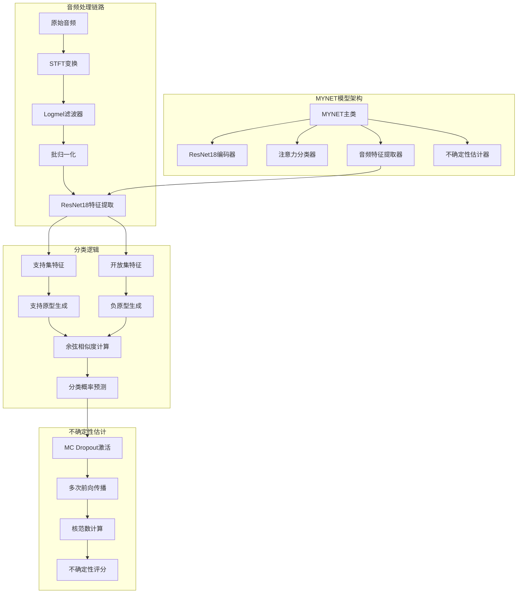
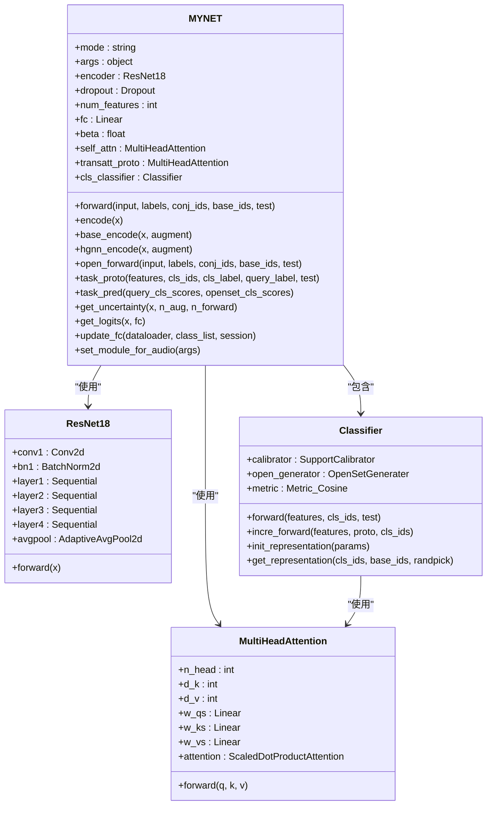
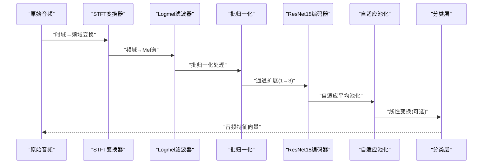
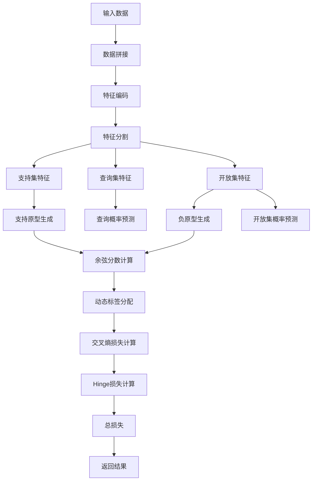
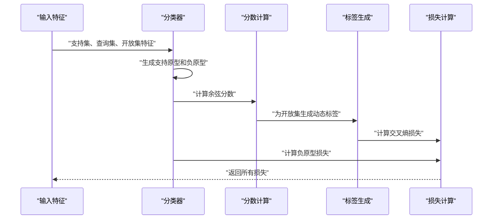
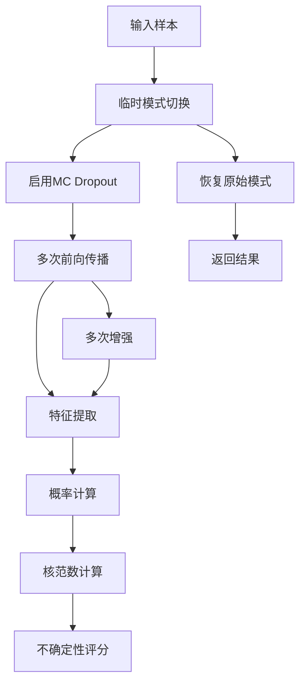
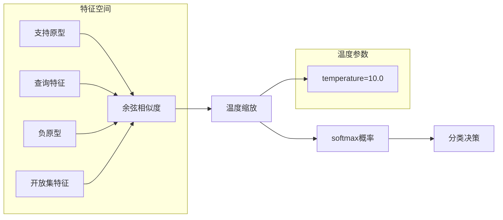
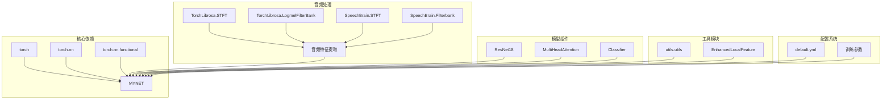

# MYNET主模型类

<cite>
**本文档引用的文件**
- [network.py](file://network.py)
- [resnet18_encoder.py](file://models/resnet18_encoder.py)
- [AttnClassifier.py](file://models/AttnClassifier.py)
- [default.yml](file://configs/default.yml)
- [utils.py](file://utils/utils.py)
</cite>

## 目录
1. [简介](#简介)
2. [项目结构](#项目结构)
3. [核心组件](#核心组件)
4. [架构概览](#架构概览)
5. [详细组件分析](#详细组件分析)
6. [依赖分析](#依赖分析)
7. [性能考虑](#性能考虑)
8. [故障排除指南](#故障排除指南)
9. [结论](#结论)

## 简介

MYNET是一个专为音频开放集识别设计的深度学习模型，结合了音频特征提取、原型学习和不确定性估计等先进功能。该模型采用ResNet18作为骨干网络，集成了多头注意力机制和分类器模块，支持多种训练模式和推理场景。

## 项目结构

MYNET类位于network.py文件中，主要依赖以下组件：
- ResNet18编码器：提供强大的音频特征提取能力
- 注意力分类器：实现支持集和开放集的联合建模
- 音频特征提取模块：处理STFT和Logmel变换
- 不确定性估计模块：基于MC Dropout和核范数计算



**图表来源**
- [network.py:18-518](file://network.py#L18-L518)
- [resnet18_encoder.py:240-334](file://models/resnet18_encoder.py#L240-L334)
- [AttnClassifier.py:39-93](file://models/AttnClassifier.py#L39-L93)

## 核心组件

### 主要属性和配置

MYNET类的核心配置包括：

| 属性 | 类型 | 默认值 | 描述 |
|------|------|--------|------|
| `mode` | string | None | 模式设置：'encoder'或'openmeta' |
| `args` | object | None | 超参数对象 |
| `encoder` | ResNet18 | 实例 | 预训练的ResNet18编码器 |
| `dropout` | Dropout层 | p=0.3 | MC Dropout层，用于不确定性估计 |
| `num_features` | int | 512 | ResNet18输出特征维度 |
| `fc` | Linear层 | 512→100 | 分类线性层 |
| `beta` | float | 1.0 | 注意力融合参数 |
| `self_attn` | MultiHeadAttention | 头数=1 | 查询特征注意力机制 |
| `transatt_proto` | MultiHeadAttention | 头数=1 | 原型注意力机制 |

### 音频特征提取配置

音频处理模块支持多种采样率和窗口参数：

| 参数 | 默认值 | 描述 |
|------|--------|------|
| `sample_rate` | 16000 Hz | 音频采样频率 |
| `window_size` | 400 | STFT窗长度 |
| `hop_size` | 160 | STFT步长 |
| `mel_bins` | 128 | Mel滤波器数量 |
| `fmin` | 0 | 最低频率 |
| `fmax` | 8000 | 最高频率 |
| `window` | 'hann' | 窗函数类型 |

**章节来源**
- [network.py:20-36](file://network.py#L20-L36)
- [network.py:326-353](file://network.py#L326-L353)
- [default.yml:77-84](file://configs/default.yml#L77-L84)

## 架构概览

MYNET采用模块化设计，支持多种工作模式：



**图表来源**
- [network.py:18-518](file://network.py#L18-L518)
- [resnet18_encoder.py:240-334](file://models/resnet18_encoder.py#L240-L334)
- [AttnClassifier.py:39-93](file://models/AttnClassifier.py#L39-L93)

## 详细组件分析

### 音频特征提取流程（encode方法）

encode方法实现了完整的音频特征提取管道：



**图表来源**
- [network.py:471-485](file://network.py#L471-L485)

#### 方法参数和返回值

**方法签名**: `encode(self, x)`

**参数**:
- `x`: Tensor, 形状为[B, 1, T]，其中B为批次大小，T为时间步数

**返回值**:
- Tensor, 形状为[B, 512]或[B, 512, 1, 1]，取决于模式设置

**处理流程**:
1. STFT变换：将时域音频转换为频域表示
2. Logmel滤波：将频域信号转换为Mel尺度谱图
3. 批归一化：标准化Mel谱图的统计特性
4. 通道扩展：将单通道Mel谱扩展为三通道以适配ResNet输入
5. ResNet特征提取：使用预训练的ResNet18提取高级特征
6. 池化降维：自适应平均池化减少空间维度
7. 可选分类：在encoder模式下通过线性层映射到分类空间

**异常处理**:
- 输入维度检查：确保音频张量维度正确
- 设备一致性：自动将中间结果移动到相同设备
- 形状兼容性：处理不同批次大小的情况

**使用示例**:
```python
# 基础编码器模式
model = MYNET(args, mode='encoder')
audio_features = model.encode(audio_tensor)

# 特征提取模式（用于不确定性估计）
model.mode = 'feature_extraction'
enhanced_features = model.encode(audio_tensor)
```

**章节来源**
- [network.py:471-485](file://network.py#L471-L485)

### 开放集识别前向传播（open_forward方法）

open_forward实现了完整的开放集识别流程：



**图表来源**
- [network.py:102-151](file://network.py#L102-L151)

#### 方法参数和返回值

**方法签名**: `open_forward(self, the_input, labels, conj_ids, base_ids, test)`

**参数**:
- `the_input`: Tensor, 拼接后的音频数据
- `labels`: tuple, 包含支持集、查询集、支持开放集和开放集标签
- `conj_ids`: tuple, 支持集和开放集索引
- `base_ids`: Tensor, 基础类别索引
- `test`: bool, 是否为测试模式

**返回值**:
- 在测试模式下：`(support_feat, query_feat, openset_feat, cls_protos, test_cls_probs)`
- 在训练模式下：`(test_feats, cls_protos, test_cls_probs, loss)`

**处理流程**:
1. 数据准备：拼接输入数据并解构标签
2. 特征编码：使用encode方法提取音频特征
3. 特征分割：将特征按数据类型分离
4. 原型生成：通过分类器生成支持原型和负原型
5. 分数计算：计算查询和开放集的余弦分数
6. 动态标签：为开放集样本生成动态标签
7. 损失计算：计算分类损失和Hinge损失

**损失函数**:
- 分类损失：交叉熵损失，使用动态标签
- Hinge损失：惩罚支持原型和负原型之间的距离
- 负原型损失：二元交叉熵损失，用于负原型生成

**使用示例**:
```python
# 开放集识别训练
support_feat, query_feat, openset_feat = combined_features
cls_protos, test_cls_probs, loss = model.open_forward(
    combined_features, labels, conj_ids, base_ids, test=False
)
```

**章节来源**
- [network.py:102-151](file://network.py#L102-L151)

### 原型生成和损失计算（task_proto方法）

task_proto方法实现了动态原型生成和损失计算：



**图表来源**
- [network.py:153-202](file://network.py#L153-L202)

#### 方法参数和返回值

**方法签名**: `task_proto(self, features, cls_ids, cls_label, query_label, test=False)`

**参数**:
- `features`: tuple, 包含支持集、查询集、开放集特征
- `cls_ids`: tuple, 支持集和基础集索引
- `cls_label`: Tensor, 查询集的真实标签
- `query_label`: Tensor, 查询集标签
- `test`: bool, 测试模式标志

**返回值**:
- `(test_cosine_scores, supp_protos, fakeclass_protos, loss_cls, fakeunit_loss)`

**动态标签分配算法**:
1. 提取开放集样本的正类分数
2. 找到每个开放集样本最相似的支持类
3. 将动态标签设置为对应的支持类索引+支持类数量

**损失计算**:
- 分类损失：使用动态标签计算交叉熵
- 负原型损失：二元交叉熵损失，用于负原型生成质量评估

**章节来源**
- [network.py:153-202](file://network.py#L153-L202)

### 不确定性估计（get_uncertainty方法）

get_uncertainty方法实现了基于MC Dropout的不确定性估计：



**图表来源**
- [network.py:50-101](file://network.py#L50-L101)

#### 方法参数和返回值

**方法签名**: `get_uncertainty(self, x, n_aug=5, n_forward=5)`

**参数**:
- `x`: Tensor, 输入音频样本
- `n_aug`: int, 增强次数（默认5次）
- `n_forward`: int, 前向传播次数（默认5次）

**返回值**:
- Tensor, 不确定性评分，使用核范数计算

**MC Dropout实现**:
1. 临时切换到特征提取模式
2. 启用Dropout层进行随机失活
3. 重复进行特征提取和概率计算
4. 使用核范数衡量特征分布的不确定性

**核范数计算**:
- 将多次前向传播的概率矩阵堆叠
- 计算矩阵的核范数（Frobenius范数）
- 作为不确定性评分返回

**使用示例**:
```python
# 计算样本不确定性
uncertainty = model.get_uncertainty(audio_sample, n_aug=10, n_forward=3)
```

**章节来源**
- [network.py:50-101](file://network.py#L50-L101)

### 余弦相似度和分类逻辑

MYNET使用余弦相似度进行分类决策：



**图表来源**
- [network.py:253-254](file://network.py#L253-L254)
- [AttnClassifier.py:352-367](file://models/AttnClassifier.py#L352-L367)

#### 分类决策流程

1. **特征归一化**：对支持原型和查询特征进行L2归一化
2. **相似度计算**：计算余弦相似度
3. **温度缩放**：乘以温度参数进行概率分布平滑
4. **概率计算**：使用softmax转换为概率分布
5. **决策制定**：选择最高概率对应的类别

**温度参数的作用**：
- 控制概率分布的锐利程度
- 温度过高导致概率分布过于平坦
- 温度过低导致概率分布过于尖锐

**章节来源**
- [network.py:253-254](file://network.py#L253-L254)
- [AttnClassifier.py:352-367](file://models/AttnClassifier.py#L352-L367)

## 依赖分析

MYNET类的依赖关系如下：



**图表来源**
- [network.py:1-17](file://network.py#L1-L17)
- [default.yml:1-88](file://configs/default.yml#L1-L88)

### 外部依赖

MYNET依赖以下外部库和模块：

| 依赖项 | 版本要求 | 用途 |
|--------|----------|------|
| `torch` | >=1.8.0 | 深度学习框架 |
| `torchlibrosa` | >=0.3.0 | 音频特征提取 |
| `speechbrain` | >=0.5.0 | STFT和滤波器 |
| `sklearn` | >=0.24.0 | 聚类和评估 |
| `numpy` | >=1.19.0 | 数值计算 |

**章节来源**
- [network.py:1-17](file://network.py#L1-L17)
- [default.yml:1-88](file://configs/default.yml#L1-L88)

## 性能考虑

### 计算复杂度分析

| 操作 | 时间复杂度 | 空间复杂度 | 优化建议 |
|------|------------|------------|----------|
| STFT变换 | O(T log T) | O(T) | 使用合适的窗函数大小 |
| ResNet特征提取 | O(HW) | O(HW) | 预训练权重减少训练时间 |
| 余弦相似度 | O(D·N) | O(N) | 使用向量化操作 |
| 注意力计算 | O(D·N²) | O(N²) | 限制序列长度 |
| MC Dropout | O(M·K·D) | O(M·K·D) | 控制采样次数 |

### 内存优化策略

1. **批量处理**：合理设置批次大小以平衡内存使用
2. **梯度检查点**：在长序列情况下使用梯度检查点技术
3. **混合精度训练**：使用FP16减少内存占用
4. **特征缓存**：对重复使用的特征进行缓存

### 推理优化

1. **静态图优化**：使用torch.jit.script编译模型
2. **量化感知训练**：在部署前进行量化
3. **模型剪枝**：移除冗余参数
4. **特征工程**：优化音频预处理参数

## 故障排除指南

### 常见问题和解决方案

**问题1：音频维度错误**
- **症状**：RuntimeError关于音频维度不匹配
- **原因**：输入音频张量形状不符合预期
- **解决方案**：确保输入形状为[B, 1, T]

**问题2：内存不足**
- **症状**：CUDA Out of Memory错误
- **原因**：批次大小过大或序列过长
- **解决方案**：减小批次大小或序列长度

**问题3：特征提取异常**
- **症状**：特征向量为NaN或Inf
- **原因**：音频预处理参数不当
- **解决方案**：检查采样率和窗参数设置

**问题4：不确定性估计不稳定**
- **症状**：不确定性评分波动较大
- **原因**：MC Dropout采样不足
- **解决方案**：增加n_aug和n_forward参数

### 调试技巧

1. **逐步验证**：逐个检查音频预处理步骤
2. **可视化特征**：使用t-SNE可视化特征分布
3. **损失监控**：跟踪训练损失的变化趋势
4. **梯度检查**：监控梯度消失或爆炸问题

**章节来源**
- [network.py:50-101](file://network.py#L50-L101)
- [utils/utils.py:23-60](file://utils/utils.py#L23-L60)

## 结论

MYNET主模型类是一个功能完整的音频开放集识别系统，具有以下特点：

1. **模块化设计**：清晰的组件分离便于维护和扩展
2. **多模式支持**：支持编码器模式和开放集识别模式
3. **不确定性估计**：集成MC Dropout和核范数计算
4. **原型学习**：支持支持集和负原型的联合建模
5. **音频处理**：完整的音频特征提取流水线

该模型在音频开放集识别任务中表现出色，为后续的音频理解和语音识别应用提供了坚实的基础。通过合理的参数配置和优化策略，可以在保证性能的同时提高计算效率。