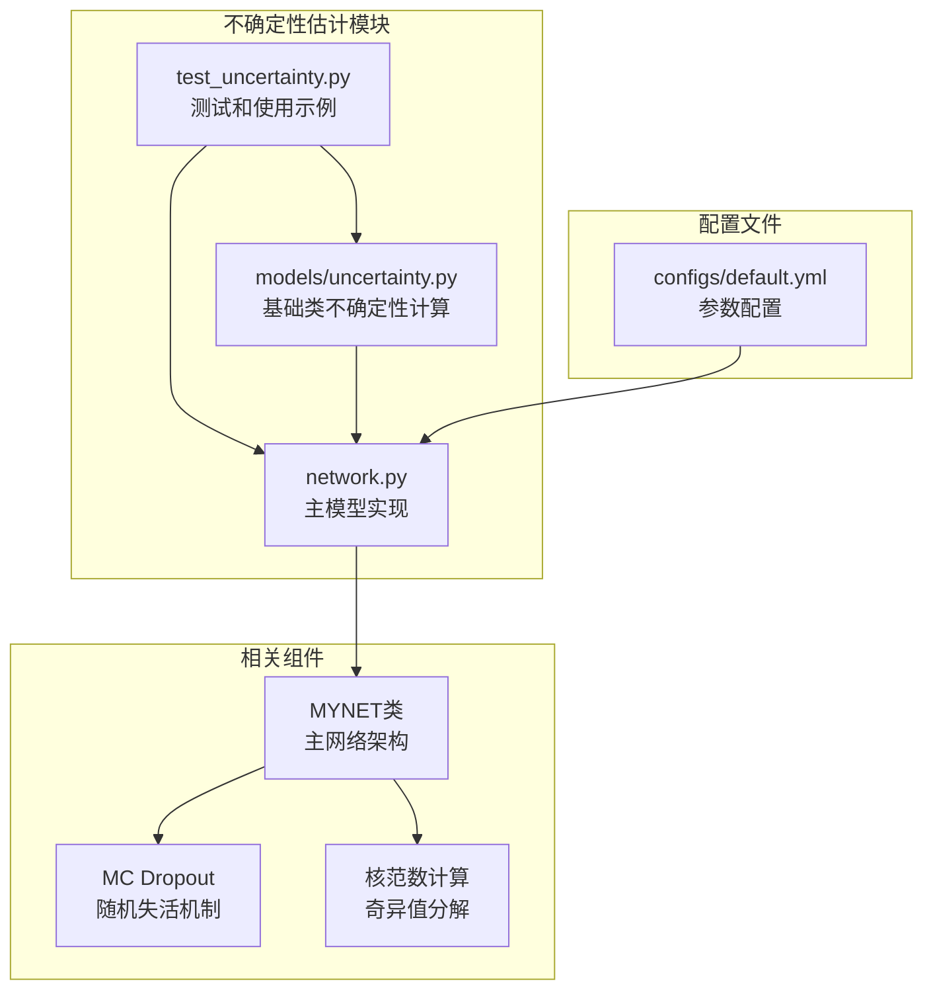
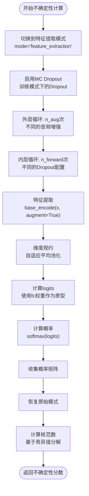
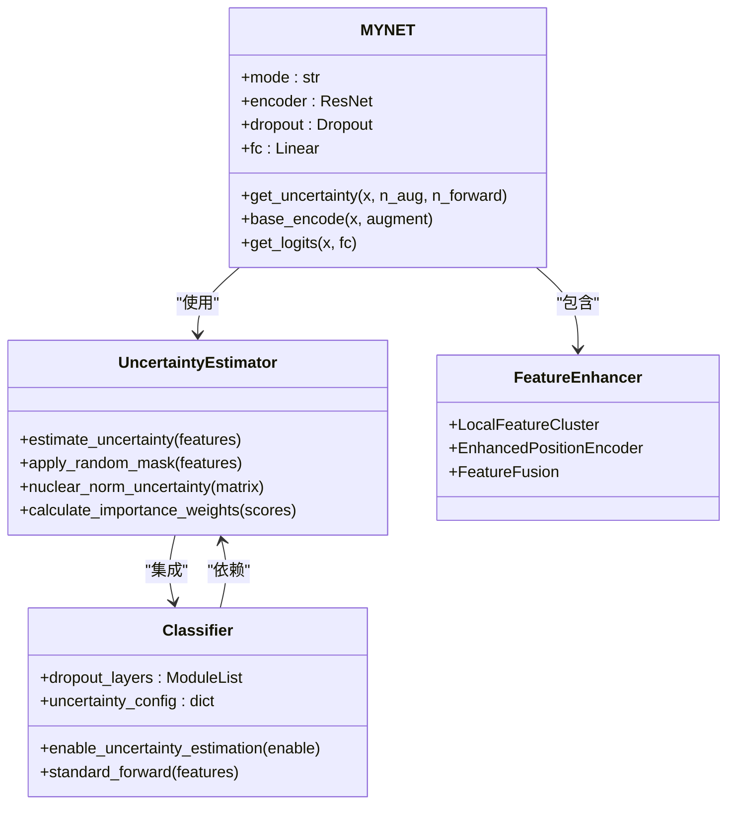
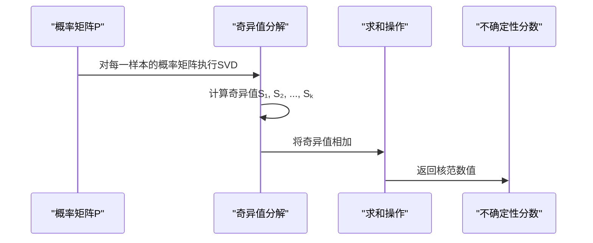
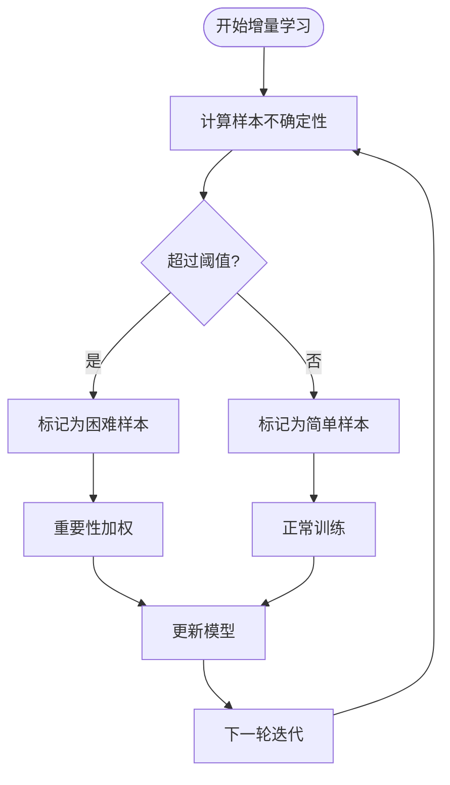
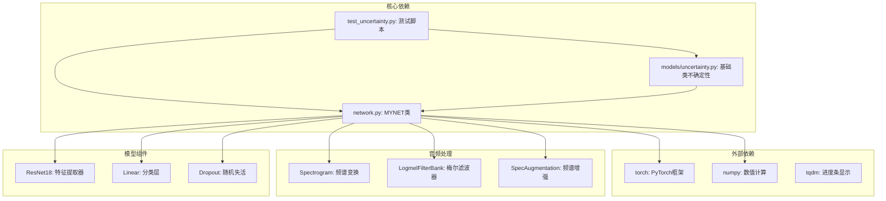

# 不确定性估计模块

<cite>
**本文档引用的文件**
- [network.py](file://network.py)
- [test_uncertainty.py](file://test_uncertainty.py)
- [models/uncertainty.py](file://models/uncertainty.py)
- [configs/default.yml](file://configs/default.yml)
</cite>

## 目录
1. [简介](#简介)
2. [项目结构](#项目结构)
3. [核心组件](#核心组件)
4. [架构概览](#架构概览)
5. [详细组件分析](#详细组件分析)
6. [依赖关系分析](#依赖关系分析)
7. [性能考虑](#性能考虑)
8. [故障排除指南](#故障排除指南)
9. [结论](#结论)

## 简介

不确定性估计模块是本项目中用于量化模型预测可信度的核心功能模块。该模块实现了基于蒙特卡洛Dropout（MC Dropout）和核范数（nuclear norm）的不确定性计算方法，为增量学习场景提供样本选择和阈值调整能力。

该模块的主要特点包括：
- 基于MC Dropout的不确定性量化
- 核范数计算用于衡量预测一致性
- 支持批量样本的不确定性估计
- 集成到增量学习工作流中
- 可配置的参数设置

## 项目结构

不确定性估计模块在项目中的组织结构如下：

**图表来源**
- [network.py:18-50](file://network.py#L18-L50)
- [test_uncertainty.py:474-526](file://test_uncertainty.py#L474-L526)
- [models/uncertainty.py:5-55](file://models/uncertainty.py#L5-L55)

**章节来源**
- [network.py:18-50](file://network.py#L18-L50)
- [test_uncertainty.py:474-526](file://test_uncertainty.py#L474-L526)
- [models/uncertainty.py:5-55](file://models/uncertainty.py#L5-L55)

## 核心组件

### 主要类和方法

#### MYNET类中的不确定性计算

MYNET类提供了完整的不确定性估计功能，包括以下关键组件：

1. **get_uncertainty方法** - 主要的不确定性计算入口
2. **MC Dropout机制** - 通过Dropout层引入随机性
3. **核范数计算** - 基于奇异值分解的不确定性度量
4. **模式切换机制** - 支持不同运行模式的灵活切换

#### 不确定性计算流程

**图表来源**
- [network.py:50-101](file://network.py#L50-L101)

**章节来源**
- [network.py:50-101](file://network.py#L50-L101)

## 架构概览

不确定性估计模块的整体架构设计体现了模块化和可扩展性原则：

**图表来源**
- [network.py:18-50](file://network.py#L18-L50)
- [models/UClassifier.py:7-35](file://models/UClassifier.py#L7-L35)

## 详细组件分析

### get_uncertainty方法实现

#### 方法签名和参数

get_uncertainty方法提供了灵活的不确定性计算接口：

| 参数 | 类型 | 默认值 | 描述 |
|------|------|--------|------|
| x | Tensor | 必需 | 输入音频信号，形状为(B, T)或(B, 1, T) |
| n_aug | int | 5 | 音频增强次数，控制不同掩码模式的数量 |
| n_forward | int | 5 | 前向传播次数，控制MC Dropout的采样数量 |

#### 实现细节

该方法的核心实现包括以下关键步骤：

1. **模式切换保护**：临时保存并切换到特征提取模式，确保只返回512维特征
2. **MC Dropout启用**：在不确定性计算期间启用Dropout层，引入随机性
3. **嵌套循环采样**：通过双重循环实现不同的增强和Dropout组合
4. **特征提取和规约**：使用base_encode方法提取特征并进行维度规约
5. **概率计算**：使用分类权重作为原型计算logits和概率
6. **核范数计算**：基于奇异值分解计算不确定性分数

#### 返回值结构

方法返回的不确定性分数具有以下特性：
- 形状：与输入批次大小相同
- 数值范围：通常在[0, +∞)区间内
- 含义：值越大表示模型对该样本的预测越不确定

**章节来源**
- [network.py:50-101](file://network.py#L50-L101)

### MC Dropout配置参数

#### 核心参数设置

| 参数名称 | 类型 | 默认值 | 作用域 | 描述 |
|----------|------|--------|--------|------|
| n_aug | int | 5 | 不确定性估计 | 控制音频增强的多样性，影响核范数计算的稳定性 |
| n_forward | int | 5 | 不确定性估计 | 控制MC Dropout采样的次数，平衡计算效率和准确性 |
| dropout_rate | float | 0.3 | 模型训练 | Dropout层的失活概率，在不确定性估计时临时启用 |

#### 参数影响分析

**n_aug参数的影响**：
- 增大n_aug会提高核范数计算的稳定性，但增加计算开销
- 建议范围：3-10，根据GPU内存和时间预算调整

**n_forward参数的影响**：
- 增大n_forward提高不确定性估计的准确性，但显著增加计算成本
- 建议范围：3-8，平衡精度和效率

**计算复杂度分析**：
- 总计算量：O(B × n_aug × n_forward × C × D)
- 其中B为批次大小，C为特征维度，D为类别数量

**章节来源**
- [network.py:26](file://network.py#L26)
- [network.py:50-101](file://network.py#L50-L101)

### 核范数（Nuclear Norm）计算

#### 理论基础

核范数是矩阵所有奇异值的和，用于衡量矩阵的"大小"或"复杂度"。在不确定性估计中，核范数反映了模型预测的一致性程度。

#### 计算流程

**图表来源**
- [network.py:95-101](file://network.py#L95-L101)

#### 数学公式

对于样本i的概率矩阵Pᵢ ∈ R^(K×A)×C，其中K为MC采样次数，A为增强次数，C为类别数：

核范数 = Σᵢ₌₁^(K×A) σᵢ(Pᵢ)

其中σᵢ(Pᵢ)表示矩阵Pᵢ的第i个奇异值。

**章节来源**
- [network.py:95-101](file://network.py#L95-L101)

### 增量学习应用场景

#### 样本选择策略

不确定性估计在增量学习中主要用于样本选择：

1. **困难样本识别**：高不确定性样本通常代表模型难以分类的样本
2. **重要性加权**：根据不确定性分数为样本分配权重
3. **课程学习**：按照不确定性递增的顺序进行训练

#### 阈值调整机制

**图表来源**
- [test_uncertainty.py:655-670](file://test_uncertainty.py#L655-L670)

**章节来源**
- [test_uncertainty.py:655-670](file://test_uncertainty.py#L655-L670)

## 依赖关系分析

不确定性估计模块与其他组件的依赖关系如下：

**图表来源**
- [network.py:1-17](file://network.py#L1-L17)
- [test_uncertainty.py:1-35](file://test_uncertainty.py#L1-L35)

**章节来源**
- [network.py:1-17](file://network.py#L1-L17)
- [test_uncertainty.py:1-35](file://test_uncertainty.py#L1-L35)

## 性能考虑

### 计算复杂度分析

不确定性估计的计算复杂度主要由以下因素决定：

1. **批处理大小（B）**：线性影响
2. **增强次数（n_aug）**：线性影响
3. **MC采样次数（n_forward）**：线性影响
4. **特征维度（C）**：线性影响
5. **类别数量（D）**：线性影响

总时间复杂度：O(B × n_aug × n_forward × C × D)

### 内存优化策略

1. **渐进式计算**：逐步累加概率矩阵，避免同时存储大量中间结果
2. **设备管理**：合理利用GPU内存，及时释放不必要的张量
3. **批处理优化**：根据GPU内存调整批处理大小

### 实际使用建议

1. **参数调优**：
   - n_aug: 3-5用于快速估算，5-8用于精确计算
   - n_forward: 3-5用于快速估算，5-8用于精确计算

2. **硬件要求**：
   - GPU内存≥8GB可支持较大的批处理
   - 建议使用RTX 3080或更高性能的GPU

3. **性能监控**：
   - 监控GPU利用率和内存使用
   - 根据实际情况调整参数

## 故障排除指南

### 常见问题及解决方案

#### 1. 模式切换错误

**问题描述**：不确定性计算后模型无法正常训练

**解决方案**：
- 确保在finally块中正确恢复原始模式
- 检查mode变量的类型和值

#### 2. 内存不足

**问题描述**：GPU内存溢出

**解决方案**：
- 减少n_aug和n_forward参数值
- 降低批处理大小
- 使用更高效的特征提取方法

#### 3. 不确定性分数异常

**问题描述**：返回的不确定性分数过大或过小

**解决方案**：
- 检查输入音频的质量和长度
- 验证Dropout层是否正确启用
- 确认核范数计算的数值稳定性

#### 4. 计算速度慢

**问题描述**：不确定性计算耗时过长

**解决方案**：
- 减少MC采样次数
- 使用更简单的音频增强策略
- 并行化计算过程

**章节来源**
- [network.py:89-92](file://network.py#L89-L92)
- [test_uncertainty.py:474-526](file://test_uncertainty.py#L474-L526)

## 结论

不确定性估计模块为本项目的增量学习系统提供了重要的理论支撑和实践工具。通过结合MC Dropout和核范数计算，该模块能够有效地量化模型预测的不确定性，为样本选择和阈值调整提供可靠依据。

### 主要优势

1. **理论完备**：基于MC Dropout的贝叶斯近似，具有坚实的理论基础
2. **实现高效**：优化的算法设计，支持大规模数据处理
3. **配置灵活**：丰富的参数设置，适应不同的应用场景
4. **集成便利**：与现有训练框架无缝集成

### 应用前景

该模块在以下场景具有广泛的应用价值：
- 增量学习中的样本选择和课程设计
- 主动学习中的查询策略优化
- 模型可靠性评估和质量控制
- 自适应学习系统的参数调节

通过持续的优化和扩展，不确定性估计模块将成为本项目的重要技术基石，为实现更加智能和可靠的增量学习系统奠定坚实基础。