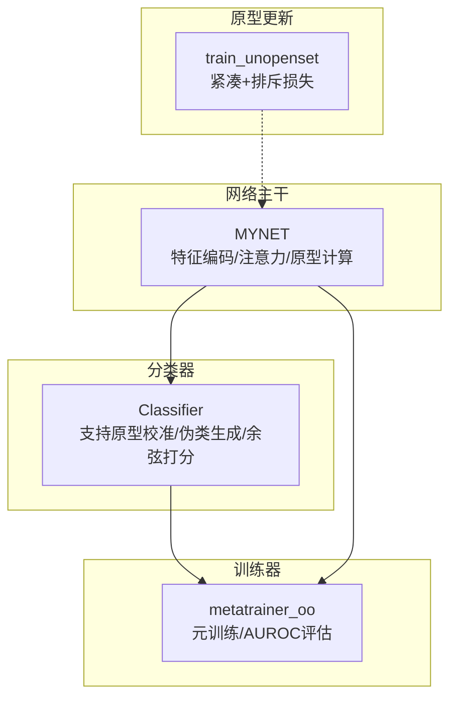
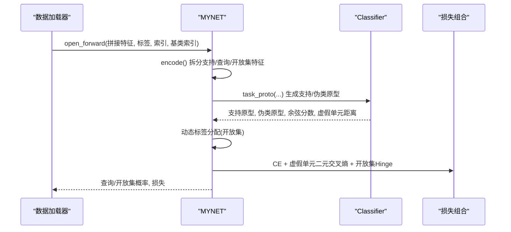
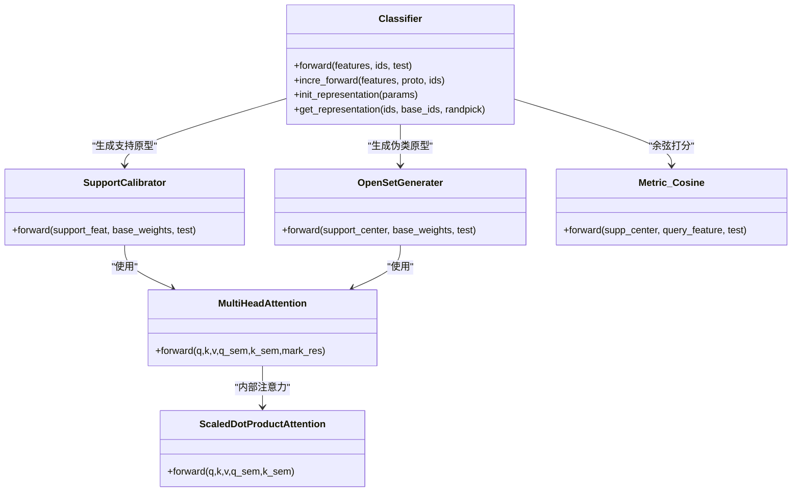
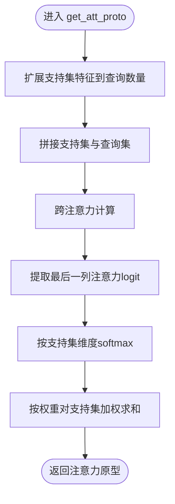
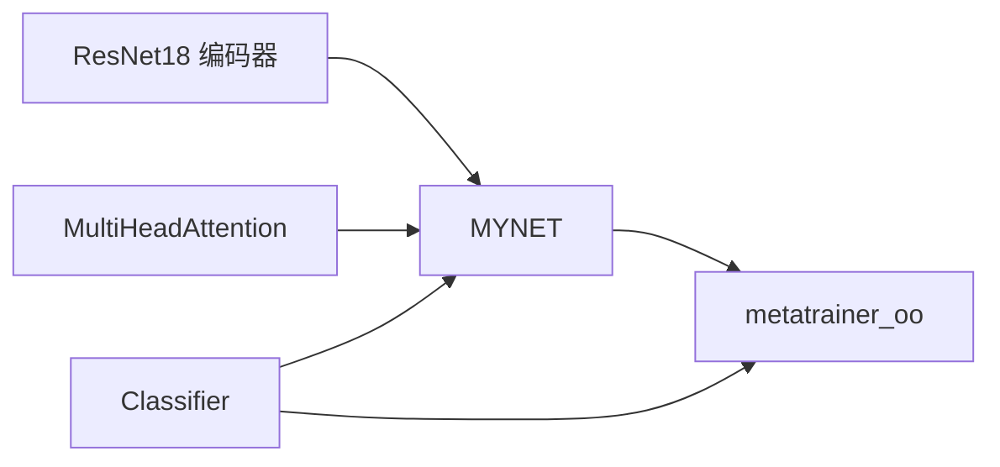

# 原型学习系统

<cite>
**本文引用的文件**
- [network.py](file://network.py)
- [UClassifier.py](file://models/UClassifier.py)
- [AttnClassifier.py](file://models/AttnClassifier.py)
- [metatrainer_oo.py](file://models/metatrainer_oo.py)
- [train_unopenset.py](file://train_unopenset.py)
</cite>

## 目录
1. [简介](#简介)
2. [项目结构](#项目结构)
3. [核心组件](#核心组件)
4. [架构总览](#架构总览)
5. [详细组件分析](#详细组件分析)
6. [依赖分析](#依赖分析)
7. [性能考量](#性能考量)
8. [故障排查指南](#故障排查指南)
9. [结论](#结论)
10. [附录](#附录)

## 简介
本文件面向原型学习系统，聚焦以下目标：
- 详细记录 task_proto 方法的原型生成与损失计算流程，涵盖支持原型与伪类原型的生成机制
- 文档化 cls_classifier 的分类器实现，重点说明注意力机制在原型学习中的应用
- 记录 get_att_proto 方法的注意力原型计算，解释自注意力与跨注意力的使用
- 详细说明 fakeunit_compare 方法的虚假单元比较实现，包括二元交叉熵损失计算
- 记录 task_pred 方法的概率预测过程，覆盖查询集与开放集的概率计算
- 提供原型更新策略、注意力权重计算与损失函数组合的详细说明
- 包含每个方法的数学公式、参数配置与实际应用场景

## 项目结构
本系统围绕“特征编码 + 原型生成 + 注意力融合 + 分类打分 + 损失计算”的流水线组织，关键模块如下：
- 网络主干：MYNET，负责音频特征提取、多头注意力模块、原型计算与任务前向
- 分类器：Classifier（AttnClassifier 或 UClassifier），负责支持原型校准、伪类原型生成、余弦打分
- 训练器：metatrainer_oo，负责开放集元训练，组合分类CE、开放集Hinge与虚假单元损失
- 原型更新：train_unopenset 中的中心损失与排斥项，用于原型紧凑与分离

图表来源
- [network.py:20-36](file://network.py#L20-L36)
- [AttnClassifier.py:39-93](file://models/AttnClassifier.py#L39-L93)
- [metatrainer_oo.py:87-214](file://models/metatrainer_oo.py#L87-L214)
- [train_unopenset.py:38-70](file://train_unopenset.py#L38-L70)

章节来源
- [network.py:18-36](file://network.py#L18-L36)
- [AttnClassifier.py:39-93](file://models/AttnClassifier.py#L39-L93)
- [metatrainer_oo.py:87-214](file://models/metatrainer_oo.py#L87-L214)
- [train_unopenset.py:38-70](file://train_unopenset.py#L38-L70)

## 核心组件
- MYNET：封装编码器、多头注意力、分类器与任务前向逻辑
- Classifier（Attn/UClassifier）：支持原型校准、伪类原型生成、余弦相似度打分
- metatrainer_oo：元训练阶段，组合分类CE、开放集Hinge与虚假单元损失，计算AUROC
- train_unopenset：原型紧凑与排斥损失，保证原型分布与边界

章节来源
- [network.py:18-36](file://network.py#L18-L36)
- [AttnClassifier.py:39-93](file://models/AttnClassifier.py#L39-L93)
- [UClassifier.py:7-405](file://models/UClassifier.py#L7-L405)
- [metatrainer_oo.py:87-214](file://models/metatrainer_oo.py#L87-L214)
- [train_unopenset.py:38-70](file://train_unopenset.py#L38-L70)

## 架构总览
MYNET 在 open_forward 中完成：
- 特征编码与拆分（支持/查询/开放集）
- 通过 cls_classifier 生成支持原型与伪类原型
- 计算查询与开放集的余弦分数
- 动态标签分配与分类CE
- 虚假单元损失与开放集Hinge损失
- 概率预测与AUROC评估

图表来源
- [network.py:102-151](file://network.py#L102-L151)
- [network.py:153-202](file://network.py#L153-L202)
- [AttnClassifier.py:47-93](file://models/AttnClassifier.py#L47-L93)
- [metatrainer_oo.py:130-142](file://models/metatrainer_oo.py#L130-L142)

## 详细组件分析

### task_proto：原型生成与损失计算
- 输入：支持/查询/开放集特征张量，类别索引与标签
- 输出：查询与开放集的余弦分数、支持原型、伪类原型、分类CE损失、虚假单元损失
- 关键步骤
  - 通过 cls_classifier 生成支持原型与伪类原型，并得到查询与开放集的余弦分数
  - 对开放集样本，依据其“最像”已知类动态生成标签（硬正类偏移至负原型）
  - 将查询与开放集分数拼接，使用动态标签计算交叉熵损失
  - 使用虚假单元距离与真实标签（one-hot）计算二元交叉熵损失
- 数学要点
  - 余弦分数：对支持原型与查询/开放集特征归一化后做矩阵乘法，再乘温度参数
  - 动态标签：开放集样本的标签为其“最像类”索引 + 已知类数量
  - 二元交叉熵：输入为虚假单元距离（logits），目标为真实标签的one-hot
- 参数与配置
  - 温度参数来自网络配置
  - hinge 边界由配置项控制
  - 虚假单元损失权重由训练器配置

章节来源
- [network.py:153-202](file://network.py#L153-L202)
- [AttnClassifier.py:47-93](file://models/AttnClassifier.py#L47-L93)
- [UClassifier.py:225-284](file://models/UClassifier.py#L225-L284)

### cls_classifier：分类器实现与注意力机制
- 支持原型校准（SupportCalibrator）
  - 输入：支持特征、基类权重（可选语义信息）
  - 输出：支持原型中心
  - 注意力类型：支持语义融合（semang）、跨注意力（attg）、自注意力（att）
- 伪类原型生成（OpenSetGenerater）
  - 输入：支持原型中心、基类权重
  - 输出：伪类原型中心与中间表示（用于虚假单元距离）
  - 注意力类型：同上
- 余弦打分（Metric_Cosine）
  - 输入：支持/伪类原型中心、查询/开放集特征
  - 输出：归一化后的余弦分数，乘以温度参数
- 注意力机制
  - 自注意力：对支持集内部序列进行注意力聚合
  - 跨注意力：支持原型与基类权重之间的交互
  - 语义门控：在semang模式下，融合视觉与语义特征

图表来源
- [AttnClassifier.py:39-93](file://models/AttnClassifier.py#L39-L93)
- [UClassifier.py:134-198](file://models/UClassifier.py#L134-L198)
- [UClassifier.py:201-284](file://models/UClassifier.py#L201-L284)
- [UClassifier.py:287-363](file://models/UClassifier.py#L287-L363)
- [AttnClassifier.py:274-368](file://models/AttnClassifier.py#L274-L368)

章节来源
- [AttnClassifier.py:39-93](file://models/AttnClassifier.py#L39-L93)
- [UClassifier.py:134-198](file://models/UClassifier.py#L134-L198)
- [UClassifier.py:201-284](file://models/UClassifier.py#L201-L284)
- [UClassifier.py:287-363](file://models/UClassifier.py#L287-L363)
- [AttnClassifier.py:274-368](file://models/AttnClassifier.py#L274-L368)

### get_att_proto：注意力原型计算（自注意力与跨注意力）
- 自注意力（self-attention）
  - 对支持集内部序列进行注意力聚合，得到每类的内聚原型
  - 通过注意力分数对支持样本加权求和
- 跨注意力（cross-attention）
  - 将支持集与查询集拼接，对查询集进行跨注意力聚合
  - 使用最后一列的注意力权重对支持集进行加权，得到每个查询对应的原型
- 参数
  - beta：支持原型与注意力原型的混合系数
  - novel_ids：新类（未见类）的索引集合

图表来源
- [network.py:270-279](file://network.py#L270-L279)

章节来源
- [network.py:270-279](file://network.py#L270-L279)

### fakeunit_compare：虚假单元比较与二元交叉熵
- 输入：虚假单元距离（logits），查询标签（one-hot）
- 实现：对每个样本的标签进行one-hot编码，计算二元交叉熵之和
- 作用：促使伪类原型与支持原型在特征空间中拉开距离，提升开放集判别能力

章节来源
- [network.py:211-214](file://network.py#L211-L214)

### task_pred：概率预测（查询集与开放集）
- 输入：查询与开放集的余弦分数张量
- 实现：分别对两类分数进行softmax，得到各自概率分布
- 输出：(查询概率, 开放集概率)，可选返回更多中间结果

章节来源
- [network.py:216-223](file://network.py#L216-L223)

### 原型更新策略与损失组合
- 支持原型更新（train_unopenset）
  - 紧凑损失：将特征投影到目标原型附近（MSE）
  - 排斥损失：对基类原型计算余弦相似度，超过阈值的部分施加平方惩罚
- 开放集损失组合（metatrainer_oo）
  - 分类CE：基于动态标签
  - 虚假单元损失：二元交叉熵
  - 开放集Hinge：距离超过阈值才产生损失
  - 总损失：gamma * Hinge + funit * 虚假单元 + CE

章节来源
- [train_unopenset.py:401-419](file://train_unopenset.py#L401-L419)
- [metatrainer_oo.py:139-142](file://models/metatrainer_oo.py#L139-L142)

## 依赖分析
- MYNET 依赖：
  - 编码器（ResNet18）
  - 多头注意力模块（自注意力与跨注意力）
  - 分类器（Attn/UClassifier）
- 分类器依赖：
  - 多头注意力（ScaledDotProductAttention）
  - 余弦打分模块
- 训练器依赖：
  - AUROC 计算工具
  - 数据加载器提供的拼接特征与标签

图表来源
- [network.py:24-33](file://network.py#L24-L33)
- [AttnClassifier.py:39-46](file://models/AttnClassifier.py#L39-L46)
- [metatrainer_oo.py:100-137](file://models/metatrainer_oo.py#L100-L137)

章节来源
- [network.py:24-33](file://network.py#L24-L33)
- [AttnClassifier.py:39-46](file://models/AttnClassifier.py#L39-L46)
- [metatrainer_oo.py:100-137](file://models/metatrainer_oo.py#L100-L137)

## 性能考量
- 注意力维度与头数：多头注意力的维度与头数影响计算复杂度与表达能力
- 温度参数：温度越大，分数越平滑，影响开放集判别
- hinge 边界：合理设置阈值，避免过度惩罚或不足
- 虚假单元损失权重：平衡分类与开放集判别
- 排斥损失阈值：防止基类原型过于接近导致边界模糊

## 故障排查指南
- AUROC 无法计算
  - 检查标签是否包含两类以上
  - 确认未知类标签构造逻辑
- 分类精度低
  - 检查温度参数与注意力权重
  - 确认支持原型与伪类原型生成是否稳定
- 开放集判别差
  - 调整 hinge 边界与虚假单元损失权重
  - 检查注意力门控与语义融合是否生效

章节来源
- [metatrainer_oo.py:182-191](file://models/metatrainer_oo.py#L182-L191)

## 结论
本系统通过“支持原型 + 伪类原型 + 注意力融合 + 余弦打分 + 多损失组合”的方式，在开放集场景下实现了稳健的少样本分类与未知判别。task_proto 与 cls_classifier 是核心，get_att_proto 与 fakeunit_compare 分别完善了原型表达与边界约束，metatrainer_oo 提供了完整的训练与评估闭环。

## 附录
- 数学公式摘要
  - 余弦分数：\(\text{score}_{i,j} = \text{temp} \cdot \frac{\mathbf{v}_i^\top \mathbf{p}_j}{\|\mathbf{v}_i\|\|\mathbf{p}_j\|}\)
  - 动态标签：\(y_{\text{open}}^{(n)} = \arg\max_j \text{score}_{j}^{\text{pos}} + N_{\text{ways}}\)
  - 二元交叉熵：\(\mathcal{L}_{\text{funit}} = -\sum_i y_i \log \sigma(z_i) + (1-y_i)\log(1-\sigma(z_i))\)
  - Hinge 损失：\(\mathcal{L}_{\text{hinge}} = \max(0, m - \|\mathbf{p}_{\text{fake}} - \mathbf{p}_{\text{sup}}\|)\)