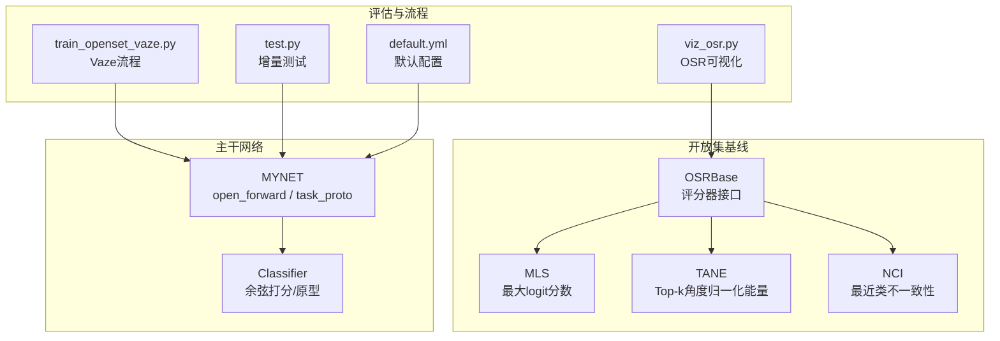
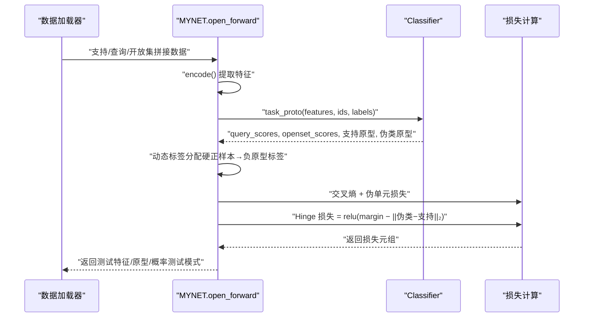
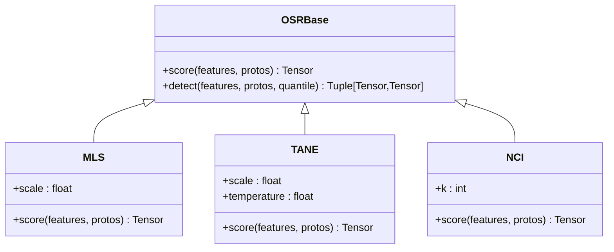
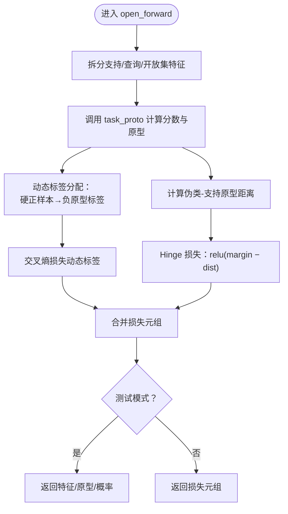
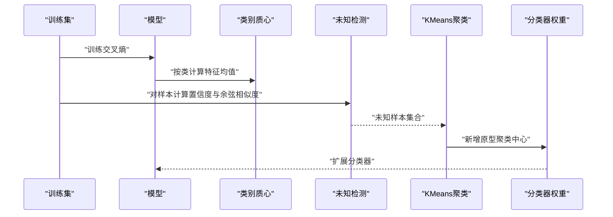
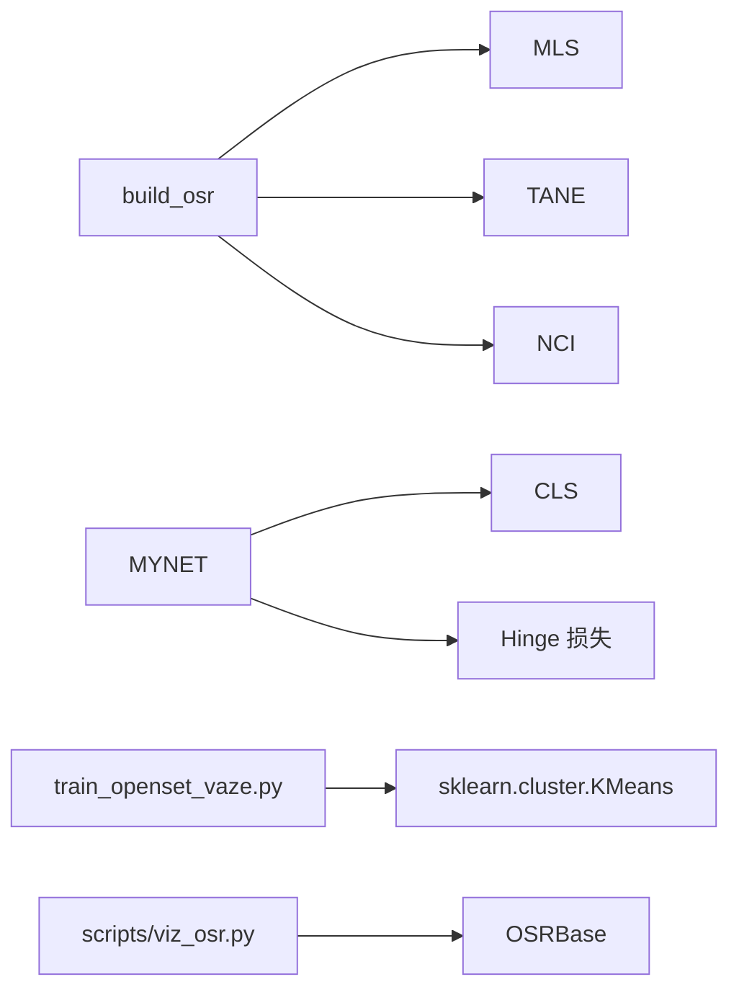

# 开放集识别实现

<cite>
**本文档引用的文件**
- [models/baselines/osr_methods/__init__.py](file://models/baselines/osr_methods/__init__.py)
- [models/baselines/osr_methods/mls.py](file://models/baselines/osr_methods/mls.py)
- [models/baselines/osr_methods/nci.py](file://models/baselines/osr_methods/nci.py)
- [models/baselines/osr_methods/tane.py](file://models/baselines/osr_methods/tane.py)
- [models/baselines/base.py](file://models/baselines/base.py)
- [network.py](file://network.py)
- [train_openset_vaze.py](file://train_openset_vaze.py)
- [test.py](file://test.py)
- [scripts/viz_osr.py](file://scripts/viz_osr.py)
- [configs/default.yml](file://configs/default.yml)
</cite>

## 目录
1. [简介](#简介)
2. [项目结构](#项目结构)
3. [核心组件](#核心组件)
4. [架构总览](#架构总览)
5. [详细组件分析](#详细组件分析)
6. [依赖分析](#依赖分析)
7. [性能考虑](#性能考虑)
8. [故障排查指南](#故障排查指南)
9. [结论](#结论)
10. [附录](#附录)

## 简介
本文件面向“开放集识别”（Open-Set Recognition, OSR）实现，围绕以下目标展开：
- 详细记录 open_forward 方法的开放集识别前向传播流程，涵盖支持集、查询集与开放集的特征处理。
- 文档化 Hinge 损失的实现，包括 margin 参数设置与距离约束机制。
- 记录动态标签分配策略：硬正样本选择与负原型标签生成。
- 说明开放集识别与已知类别识别的区别与联系。
- 记录测试模式下的特征返回机制与概率计算。
- 提供开放集阈值设置、性能评估指标与实际应用场景。
- 包含每个参数的作用、损失函数的数学公式与实验配置建议。

## 项目结构
该项目采用模块化组织，开放集识别相关代码主要分布在以下模块：
- OSR 基线评分器：models/baselines/osr_methods/*（MLS、TANE、NCI）
- 基类接口：models/baselines/base.py（OSRBase、通用原型构建与余弦打分）
- 主干网络与开放集前向：network.py（MYNET.open_forward、task_proto、Hinge 损失）
- 开放集评估脚本：scripts/viz_osr.py（OSR 评分直方图、ROC、混淆矩阵）
- Vaze 开放集增量流程：train_openset_vaze.py（闭集训练、未知检测、增量原型扩展）
- 测试与评估：test.py（增量测试、已知/未知准确率、F1）
- 默认配置：configs/default.yml（训练、数据加载、网络等）

**图表来源**
- [models/baselines/base.py:35-76](file://models/baselines/base.py#L35-L76)
- [models/baselines/osr_methods/mls.py:15-26](file://models/baselines/osr_methods/mls.py#L15-L26)
- [models/baselines/osr_methods/tane.py:15-29](file://models/baselines/osr_methods/tane.py#L15-L29)
- [models/baselines/osr_methods/nci.py:15-31](file://models/baselines/osr_methods/nci.py#L15-L31)
- [network.py:102-151](file://network.py#L102-L151)
- [scripts/viz_osr.py:24-99](file://scripts/viz_osr.py#L24-L99)
- [train_openset_vaze.py:420-481](file://train_openset_vaze.py#L420-L481)
- [test.py:740-758](file://test.py#L740-L758)
- [configs/default.yml:1-88](file://configs/default.yml#L1-L88)

**章节来源**
- [models/baselines/base.py:35-76](file://models/baselines/base.py#L35-L76)
- [network.py:102-151](file://network.py#L102-L151)
- [scripts/viz_osr.py:24-99](file://scripts/viz_osr.py#L24-L99)
- [train_openset_vaze.py:420-481](file://train_openset_vaze.py#L420-L481)
- [test.py:740-758](file://test.py#L740-L758)
- [configs/default.yml:1-88](file://configs/default.yml#L1-L88)

## 核心组件
- OSRBase 与评分器族
  - OSRBase 定义统一接口 score(features, protos)，返回越大越“似未知”的标量分数；提供基于分位数的 detect 接口。
  - MLS：最大余弦分数的负值，scale 控制尺度。
  - TANE：能量项减去最高分，scale 与 temperature 控制尺度与温度。
  - NCI：k 近邻距离比值，top1/mean(top2..k)，越接近 1 越不确定。
- MYNET.open_forward 与 task_proto
  - open_forward：合并支持/查询/开放集特征，拆分并调用 task_proto；在测试模式下返回特征、原型与概率；非测试模式下返回损失元组（分类、Hinge、伪单元）。
  - task_proto：调用 Classifier 得到支持/伪类原型与分数；对开放集样本执行动态标签分配（硬正样本选择 + 负原型标签）；计算交叉熵损失与伪单元损失。
  - Hinge 损失：pair_dist = ||伪类原型 − 支持原型||₂；loss = mean(max(0, margin − dist))，margin 可配置。
- Vaze 开放集增量流程
  - 闭集训练 → 计算类别质心 → 未知检测（置信度阈值 OR 特征与质心余弦阈值）→ 对未知样本聚类并增量扩展原型 → 评估增量准确率与已知/未知准确率。

**章节来源**
- [models/baselines/base.py:35-76](file://models/baselines/base.py#L35-L76)
- [models/baselines/osr_methods/mls.py:15-26](file://models/baselines/osr_methods/mls.py#L15-L26)
- [models/baselines/osr_methods/tane.py:15-29](file://models/baselines/osr_methods/tane.py#L15-L29)
- [models/baselines/osr_methods/nci.py:15-31](file://models/baselines/osr_methods/nci.py#L15-L31)
- [network.py:102-151](file://network.py#L102-L151)
- [train_openset_vaze.py:86-198](file://train_openset_vaze.py#L86-L198)

## 架构总览
下面的序列图展示了 open_forward 的端到端流程，以及与 Classifier 的交互、动态标签分配与 Hinge 损失计算。

**图表来源**
- [network.py:102-151](file://network.py#L102-L151)
- [network.py:153-200](file://network.py#L153-L200)

## 详细组件分析

### OSRBase 与评分器族
- OSRBase.score：统一接口，返回“越大越似未知”的分数；detect 使用分位数自适应阈值。
- 通用余弦打分：cosine_logits 对特征与原型做 L2 归一化后点积，可选温度缩放。
- 通用原型构建：build_prototype_from_support 按类 ID 计算均值原型。

**图表来源**
- [models/baselines/base.py:35-76](file://models/baselines/base.py#L35-L76)
- [models/baselines/osr_methods/mls.py:15-26](file://models/baselines/osr_methods/mls.py#L15-L26)
- [models/baselines/osr_methods/tane.py:15-29](file://models/baselines/osr_methods/tane.py#L15-L29)
- [models/baselines/osr_methods/nci.py:15-31](file://models/baselines/osr_methods/nci.py#L15-L31)

**章节来源**
- [models/baselines/base.py:35-76](file://models/baselines/base.py#L35-L76)
- [models/baselines/osr_methods/mls.py:15-26](file://models/baselines/osr_methods/mls.py#L15-L26)
- [models/baselines/osr_methods/tane.py:15-29](file://models/baselines/osr_methods/tane.py#L15-L29)
- [models/baselines/osr_methods/nci.py:15-31](file://models/baselines/osr_methods/nci.py#L15-L31)

### MYNET.open_forward 与 task_proto
- open_forward 数据准备：拼接支持/查询/开放集数据，分别编码并拆分；在测试模式返回特征、原型与概率。
- task_proto：
  - 调用 Classifier 得到 query 与 openset 的余弦分数，以及支持原型与伪类原型。
  - 动态标签分配：对每个开放集样本，取其前 n_ways 正类分数的最大者，得到“硬正样本”类别索引，将其映射到负原型标签（索引偏移 n_ways）。
  - 损失：交叉熵（使用动态标签）+ 伪单元损失；Hinge 损失：对每对伪类与支持原型计算欧氏距离，当距离小于 margin 时产生惩罚。
- Hinge 损失公式
  - loss = mean(max(0, margin − ||p_fake − p_supp||₂))

**图表来源**
- [network.py:102-151](file://network.py#L102-L151)
- [network.py:153-200](file://network.py#L153-L200)

**章节来源**
- [network.py:102-151](file://network.py#L102-L151)
- [network.py:153-200](file://network.py#L153-L200)

### Vaze 开放集增量流程
- 闭集训练：标准交叉熵训练分类器。
- 质心计算：在训练集上按类计算特征均值作为类别质心。
- 未知检测：对样本计算 softmax 最大值与特征与质心的余弦相似度，若任一小于阈值则判定为未知。
- 增量扩展：对未知样本聚类，新增原型至分类器权重。
- 评估：计算已知/未知准确率、F1、增量准确率与全集准确率。

**图表来源**
- [train_openset_vaze.py:86-198](file://train_openset_vaze.py#L86-L198)

**章节来源**
- [train_openset_vaze.py:86-198](file://train_openset_vaze.py#L86-L198)

### 测试模式下的特征返回与概率计算
- 测试模式：open_forward 返回 (support_feat, query_feat, openset_feat)、原型矩阵与分类概率张量，便于下游评估。
- 已知类别识别：test.py 中对增量测试使用余弦相似度计算 logits 并统计准确率；已知/未知场景分别计算准确率与宏平均 F1。

**章节来源**
- [network.py:129-131](file://network.py#L129-L131)
- [test.py:740-758](file://test.py#L740-L758)
- [test.py:761-778](file://test.py#L761-L778)

## 依赖分析
- OSR 基线注册表：通过 build_osr(name, args) 构建具体评分器实例。
- OSRBase 与评分器：统一接口，便于替换与扩展。
- MYNET 与 Classifier：MYNET.open_forward 依赖 Classifier 的余弦打分与原型生成；Hinge 损失依赖特征空间距离。
- Vaze 流程：依赖 sklearn KMeans 进行聚类，依赖 torch.nn.functional 进行归一化与损失计算。
- 可视化脚本：scripts/viz_osr.py 使用 OSRBase.score 与模型 fc 权重构造原型，绘制评分直方图、ROC 与已知类混淆矩阵。

**图表来源**
- [models/baselines/osr_methods/__init__.py:14-21](file://models/baselines/osr_methods/__init__.py#L14-L21)
- [network.py:134-146](file://network.py#L134-L146)
- [train_openset_vaze.py:173-198](file://train_openset_vaze.py#L173-L198)
- [scripts/viz_osr.py:59-96](file://scripts/viz_osr.py#L59-L96)

**章节来源**
- [models/baselines/osr_methods/__init__.py:14-21](file://models/baselines/osr_methods/__init__.py#L14-L21)
- [network.py:134-146](file://network.py#L134-L146)
- [train_openset_vaze.py:173-198](file://train_openset_vaze.py#L173-L198)
- [scripts/viz_osr.py:59-96](file://scripts/viz_osr.py#L59-L96)

## 性能考虑
- 计算复杂度
  - open_forward：特征编码 O(BND)，task_proto 余弦打分 O(BN·2N·C)，动态标签分配 O(BN·2N)。
  - Hinge 损失：O(BN) 距离计算。
  - Vaze 未知检测：对每个样本 O(C) 余弦相似度计算；聚类 O(N·k·I·d)。
- 内存占用
  - 特征与原型矩阵规模受 n_ways、n_shots、n_queries、特征维度影响。
  - KMeans 聚类的中心数与样本数决定内存峰值。
- 优化建议
  - 使用 GPU 加速；对大规模 C 或 N 时采用分批计算。
  - 对特征与原型进行 L2 归一化可提升稳定性并加速收敛。
  - 合理设置 margin 与阈值，避免过度惩罚或漏检。

## 故障排查指南
- 未知检测阈值设置
  - 若误报过多，提高置信度阈值或余弦阈值；若漏检过多，降低阈值。
  - 可使用 scripts/viz_osr.py 的 ROC 曲线辅助选择阈值。
- Hinge 损失不生效
  - 检查 margin 是否过大导致始终为 0；适当减小 margin。
  - 确认伪类与支持原型来自同一批次且未被梯度清零。
- 动态标签分配异常
  - 确认 openset_pos_scores 的前 n_ways 维度正确；检查 hard_pos_idx 的索引范围与映射关系。
- 增量原型扩展失败
  - 检查未知样本集合是否为空；聚类中心数不应超过样本数/5 的下界。
  - 确保新增原型维度与旧权重一致，必要时进行截断或补零。

**章节来源**
- [scripts/viz_osr.py:59-96](file://scripts/viz_osr.py#L59-L96)
- [network.py:134-146](file://network.py#L134-L146)
- [train_openset_vaze.py:173-198](file://train_openset_vaze.py#L173-L198)

## 结论
本实现将开放集识别分解为三个关键环节：（1）基于原型的余弦打分与动态标签分配；（2）Hinge 距离约束损失；（3）Vaze 增量学习流程。通过 OSRBase 统一接口与 MYNET.open_forward 的模块化设计，系统既支持端到端训练，又便于在测试阶段返回中间表示与概率，满足评估与部署需求。配合可视化脚本与增量评估流程，可有效衡量已知/未知识别性能与灾难性遗忘控制。

## 附录

### 参数与配置
- open_forward/Hinge 损失
  - hinge_margin：距离约束阈值，控制伪类原型与支持原型之间的最小距离。
- Vaze 流程
  - prob_thresh：softmax 最大概率阈值。
  - cos_thresh：特征与类别质心余弦阈值。
- 默认配置（示例字段）
  - n_ways、n_shots、n_queries： Few-Shot 场景的分类设置。
  - temperature：余弦打分温度缩放。
  - network.new_mode：分类器模式（如余弦分类）。
  - dataloader.*：数据加载器批大小与并行度。

**章节来源**
- [network.py:134-139](file://network.py#L134-L139)
- [train_openset_vaze.py:134-170](file://train_openset_vaze.py#L134-L170)
- [configs/default.yml:22-66](file://configs/default.yml#L22-L66)

### 损失函数与数学公式
- Hinge 损失
  - loss = mean(max(0, margin − ||p_fake − p_supp||₂))
- 交叉熵损失
  - 使用动态标签（硬正样本对应的负原型标签）计算分类损失。
- 能量与Top-k归一化（TANE）
  - energy = −T · logsumexp(logits / T)，最终评分 = energy − top1。

**章节来源**
- [network.py:134-146](file://network.py#L134-L146)
- [models/baselines/osr_methods/tane.py:21-29](file://models/baselines/osr_methods/tane.py#L21-L29)

### 实验与评估建议
- 评估指标
  - 已知/未知准确率、F1 分数、增量准确率、全集准确率。
  - ROC 曲线下面积（AUC）与阈值选择。
- 应用场景
  - 语音/音频领域增量学习与未知类别检测。
  - 需要持续学习与鲁棒性保障的任务。

**章节来源**
- [test.py:740-758](file://test.py#L740-L758)
- [test.py:761-778](file://test.py#L761-L778)
- [scripts/viz_osr.py:59-96](file://scripts/viz_osr.py#L59-L96)