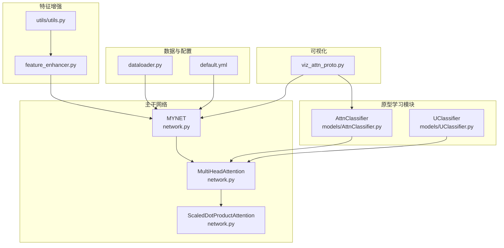
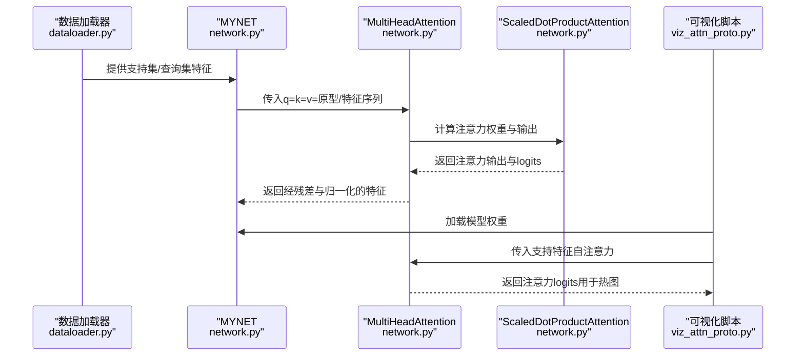
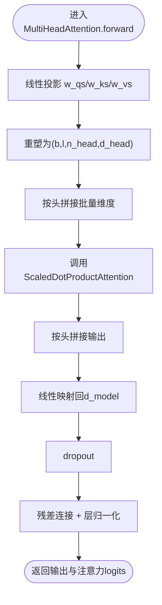
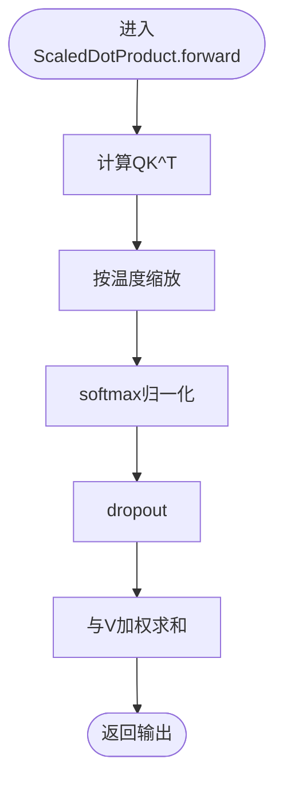
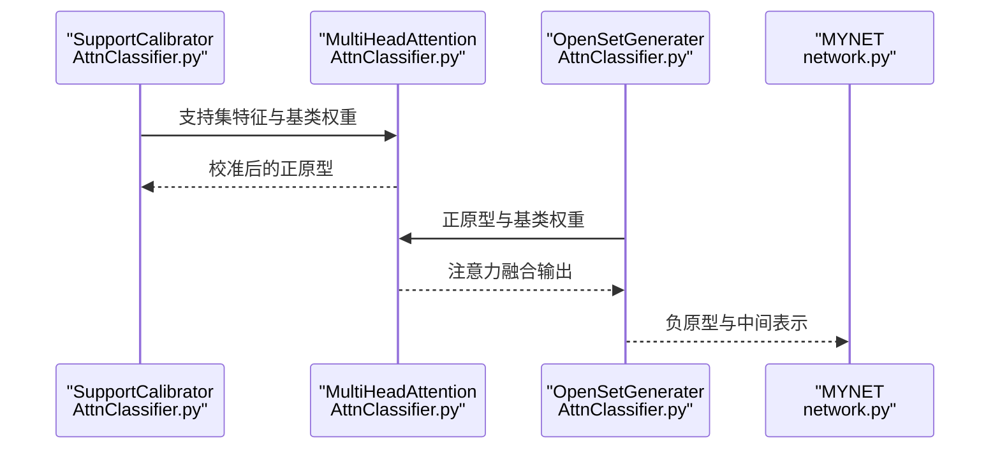
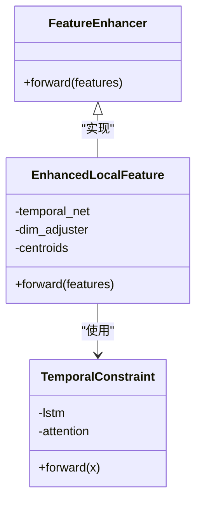
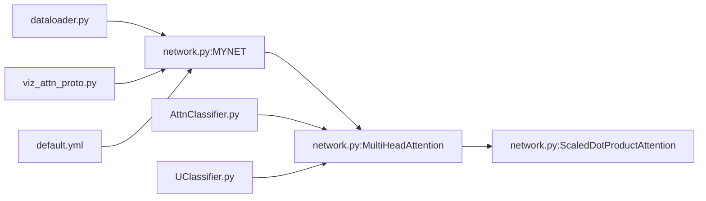

# 注意力机制实现

<cite>
**本文档引用的文件**
- [network.py](file://network.py)
- [AttnClassifier.py](file://models/AttnClassifier.py)
- [UClassifier.py](file://models/UClassifier.py)
- [viz_attn_proto.py](file://scripts/viz_attn_proto.py)
- [default.yml](file://configs/default.yml)
- [dataloader.py](file://data/dataloader.py)
- [feature_enhancer.py](file://models/feature_enhancer.py)
- [utils.py](file://utils/utils.py)
</cite>

## 目录
1. [简介](#简介)
2. [项目结构](#项目结构)
3. [核心组件](#核心组件)
4. [架构概览](#架构概览)
5. [详细组件分析](#详细组件分析)
6. [依赖关系分析](#依赖关系分析)
7. [性能考虑](#性能考虑)
8. [故障排除指南](#故障排除指南)
9. [结论](#结论)
10. [附录](#附录)

## 简介
本文件系统性地记录了代码库中的注意力机制实现，重点覆盖以下内容：
- MultiHeadAttention类的多头注意力实现细节
- ScaledDotProductAttention的缩放点积注意力计算流程
- 数学原理：查询、键、值的线性变换与注意力权重计算
- 注意力头数量与维度设置对模型性能的影响
- 注意力输出的维度变换与残差连接实现
- 注意力机制在原型学习与特征融合中的具体应用
- 注意力权重的可视化方法、计算复杂度分析与参数调优建议
- 方法输入输出格式、注意力权重解释与实际应用场景

## 项目结构
注意力机制相关的核心代码分布在以下模块：
- 主干网络与注意力模块：network.py
- 原型学习与语义融合中的注意力：models/AttnClassifier.py、models/UClassifier.py
- 注意力权重可视化：scripts/viz_attn_proto.py
- 数据加载与元学习场景：data/dataloader.py
- 特征增强与注意力融合：models/feature_enhancer.py、utils/utils.py
- 配置参数：configs/default.yml

**图表来源**
- [network.py:31-32](file://network.py#L31-L32)
- [network.py:538-584](file://network.py#L538-L584)
- [AttnClassifier.py:274-326](file://models/AttnClassifier.py#L274-L326)
- [UClassifier.py:287-339](file://models/UClassifier.py#L287-L339)
- [viz_attn_proto.py:96-103](file://scripts/viz_attn_proto.py#L96-L103)

**章节来源**
- [network.py:18-50](file://network.py#L18-L50)
- [AttnClassifier.py:121-185](file://models/AttnClassifier.py#L121-L185)
- [UClassifier.py:134-198](file://models/UClassifier.py#L134-L198)

## 核心组件
本节聚焦MultiHeadAttention与ScaledDotProductAttention两个核心组件，梳理其构造函数参数、前向传播逻辑、维度变换与残差连接。

- MultiHeadAttention
  - 参数
    - n_head：注意力头数量
    - d_model：输入特征维度
    - d_k、d_v：每头的键/值维度与值维度
    - dropout：丢弃率
  - 前向传播要点
    - 线性投影：将输入q/k/v分别映射到多头空间
    - 重塑与拼接：按头数重排并拼接批量维度
    - 调用ScaledDotProductAttention计算注意力输出与logits
    - 头拼接与线性变换：将各头输出拼接并通过线性层映射回d_model
    - 残差连接与层归一化
  - 返回值
    - 输出张量与注意力logits（用于可视化）

- ScaledDotProductAttention
  - 参数
    - temperature：缩放因子，通常为sqrt(d_k)
    - attn_dropout：注意力权重丢弃率
  - 前向传播要点
    - 计算QK^T，按温度缩放
    - softmax得到注意力权重
    - 与V相乘得到加权求和输出
  - 返回值
    - 输出张量（与MultiHeadAttention一致）

**章节来源**
- [network.py:538-584](file://network.py#L538-L584)
- [network.py:519-535](file://network.py#L519-L535)

## 架构概览
注意力机制在系统中的位置与交互如下：

**图表来源**
- [network.py:244-251](file://network.py#L244-L251)
- [network.py:561-584](file://network.py#L561-L584)
- [viz_attn_proto.py:96-113](file://scripts/viz_attn_proto.py#L96-L113)

## 详细组件分析

### MultiHeadAttention类分析
- 实现要点
  - 线性投影：w_qs/w_ks/w_vs分别对q/k/v做线性变换，输出为(n_head*d_k)或(n_head*d_v)
  - 多头重塑：将(b,l,d)重塑为(b,l,n_head,d_head)，再按头拼接批量维度
  - 注意力计算：调用ScaledDotProductAttention得到输出与注意力logits
  - 头拼接与映射：将各头输出按头拼接，通过线性层映射回d_model
  - 残差连接：输出与输入q相加，并进行层归一化
- 维度变换
  - 输入：q/k/v形状均为(b,l,d_model)
  - 投影后：(b,l,n_head,d_k)或(b,l,n_head,d_v)
  - 多头拼接：(n_head*b,l,d_head)
  - 输出：(b,l,d_model)
- 残差连接
  - 输出与输入q同形，可直接相加
  - 最终经dropout与线性层，再与q相加并层归一化

**图表来源**
- [network.py:561-584](file://network.py#L561-L584)

**章节来源**
- [network.py:538-584](file://network.py#L538-L584)

### ScaledDotProductAttention类分析
- 实现要点
  - 计算注意力分数：QK^T
  - 温度缩放：除以sqrt(d_k)
  - softmax归一化得到注意力权重
  - 权重与V相乘得到输出
- 返回值
  - 输出张量
  - 注意力logits与log_softmax结果（用于可视化）

**图表来源**
- [network.py:528-535](file://network.py#L528-L535)

**章节来源**
- [network.py:519-535](file://network.py#L519-L535)

### 在原型学习中的应用
- 支持集原型校准
  - SupportCalibrator使用MultiHeadAttention对支持集特征与基类权重进行注意力融合，得到校准后的正原型
  - 支持语义与视觉特征的门控融合（在特定模式下）
- 负原型生成
  - OpenSetGenerater使用MultiHeadAttention将正原型与基类权重进行注意力交互，生成负原型（伪类）
  - 支持多种生成策略（如语义引导、注意力引导等）
- 特征级注意力
  - MYNET在任务推理阶段对原型与查询特征进行自注意力，提升分类性能

**图表来源**
- [AttnClassifier.py:121-185](file://models/AttnClassifier.py#L121-L185)
- [AttnClassifier.py:188-271](file://models/AttnClassifier.py#L188-L271)
- [network.py:244-251](file://network.py#L244-L251)

**章节来源**
- [AttnClassifier.py:121-271](file://models/AttnClassifier.py#L121-L271)
- [network.py:244-251](file://network.py#L244-L251)

### 在特征融合中的应用
- 时序约束与注意力融合
  - EnhancedLocalFeature结合LSTM与时序注意力，对局部特征进行动态加权聚合
  - TemporalConstraint使用注意力权重对LSTM输出进行加权求和
- 语义-视觉融合
  - AttnClassifier与UClassifier在特定模式下，通过门控机制融合语义特征与视觉特征，再进行注意力交互

**图表来源**
- [feature_enhancer.py:27-93](file://models/feature_enhancer.py#L27-L93)
- [utils/utils.py:86-116](file://utils/utils.py#L86-L116)

**章节来源**
- [feature_enhancer.py:27-93](file://models/feature_enhancer.py#L27-L93)
- [utils/utils.py:86-116](file://utils/utils.py#L86-L116)

## 依赖关系分析
- 组件耦合
  - MYNET依赖MultiHeadAttention进行原型与查询的注意力融合
  - AttnClassifier/UClassifier中的SupportCalibrator/OpenSetGenerater依赖MultiHeadAttention进行原型校准与负原型生成
  - 可视化脚本依赖模型中的注意力模块提取注意力logits
- 外部依赖
  - 数据加载器提供支持/查询批次，驱动注意力模块的输入
  - 配置文件提供超参数（如温度、头数、维度等）

**图表来源**
- [network.py:31-32](file://network.py#L31-L32)
- [AttnClassifier.py:128-181](file://models/AttnClassifier.py#L128-L181)
- [UClassifier.py:141-194](file://models/UClassifier.py#L141-L194)
- [viz_attn_proto.py:96-103](file://scripts/viz_attn_proto.py#L96-L103)

**章节来源**
- [network.py:31-32](file://network.py#L31-L32)
- [dataloader.py:48-81](file://data/dataloader.py#L48-L81)

## 性能考虑
- 计算复杂度
  - 单头注意力：对每个序列长度l，QK^T的计算复杂度约为O(l^2*d_k)，其中d_k为键维度
  - 多头注意力：总复杂度约为O(n_head*l^2*d_k + n_head*l*d_v)，注意头数n_head与d_k/d_v的选择对性能影响显著
- 内存占用
  - 注意力权重矩阵大小为(b*l*l)，在长序列情况下内存开销较大
  - 多头拼接与线性映射带来额外的显存消耗
- 超参数调优建议
  - d_k与d_v：通常取d_model/n_head，使每头维度适中；过小降低表达能力，过大增加计算负担
  - n_head：增大头数可提升并行表达能力，但需平衡计算与内存
  - dropout：适度的dropout有助于防止过拟合，建议在0.1~0.3之间
  - temperature：控制softmax的平滑程度，影响注意力分布的锐利度

## 故障排除指南
- 注意力权重可视化失败
  - 确认模型中存在可调用的注意力模块（如attn或multihead_attn属性）
  - 检查输入张量维度与类型，确保为可执行的张量
  - 若出现异常，脚本会打印错误信息，便于定位问题
- 注意力输出与输入维度不匹配
  - 确认MultiHeadAttention的输入形状为(b,l,d_model)，输出形状也为(b,l,d_model)
  - 检查残差连接处的维度一致性
- 训练不稳定或收敛缓慢
  - 调整dropout与temperature参数
  - 检查学习率与优化器设置

**章节来源**
- [viz_attn_proto.py:96-115](file://scripts/viz_attn_proto.py#L96-L115)
- [network.py:561-584](file://network.py#L561-L584)

## 结论
本代码库中的注意力机制以MultiHeadAttention为核心，结合ScaledDotProductAttention实现了高效的多头特征交互。其在原型学习与特征融合场景中发挥关键作用，既可用于支持集原型的校准与负原型生成，也可用于时序与语义特征的融合。通过合理的超参数设置与可视化手段，能够有效提升模型在少样本开放集场景下的表现。

## 附录

### API定义与输入输出规范
- MultiHeadAttention.forward
  - 输入
    - q: [b, lq, d_model]
    - k: [b, lk, d_model]
    - v: [b, lv, d_model]
  - 输出
    - output: [b, lq, d_model]
    - attn_logit: [b, lq, lk]（用于可视化）
- ScaledDotProductAttention.forward
  - 输入
    - q: [n_head*b, lq, d_k]
    - k: [n_head*b, lk, d_k]
    - v: [n_head*b, lv, d_v]
  - 输出
    - output: [n_head*b, lq, d_v]
    - attn_logit: [n_head*b, lq, lk]
    - log_attn: [n_head*b, lq, lk]

**章节来源**
- [network.py:561-584](file://network.py#L561-L584)
- [network.py:528-535](file://network.py#L528-L535)

### 注意力权重解释与可视化
- 注意力权重解释
  - attn_logit的每一行对应一个查询位置对所有键位置的未归一化注意力分数
  - softmax后的权重表示查询对该键位置的关注程度
- 可视化方法
  - 使用脚本viz_attn_proto.py对支持集特征的自注意力权重进行热图可视化
  - 可视化输出保存在指定目录，便于分析注意力分布

**章节来源**
- [viz_attn_proto.py:92-113](file://scripts/viz_attn_proto.py#L92-L113)

### 参数调优建议
- 头数与维度
  - n_head与d_model需满足d_model % n_head == 0
  - 常见设置：n_head=8, d_model=512
- 温度与丢弃
  - temperature建议在1左右，避免softmax过于尖锐或平滑
  - dropout建议在0.1~0.3之间
- 数据与配置
  - 参考配置文件中的温度、批次大小与学习率设置，结合任务规模调整

**章节来源**
- [default.yml:42-45](file://configs/default.yml#L42-L45)
- [network.py:541-560](file://network.py#L541-L560)