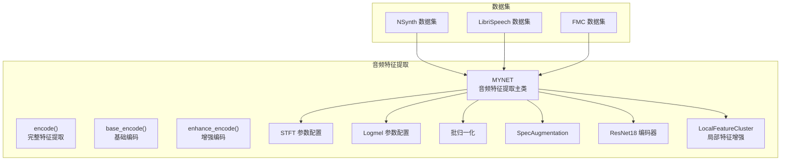
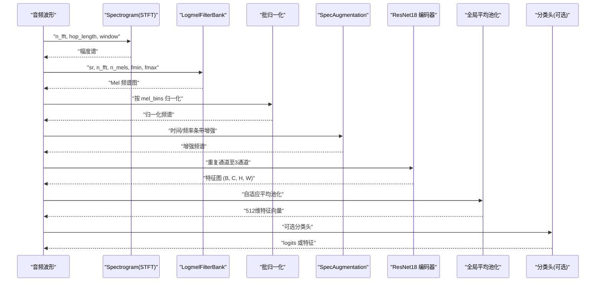
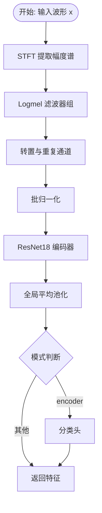
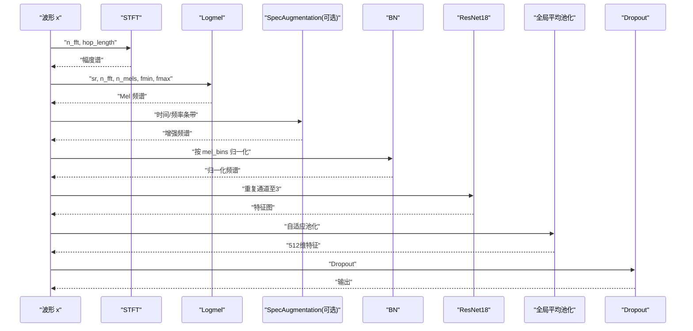
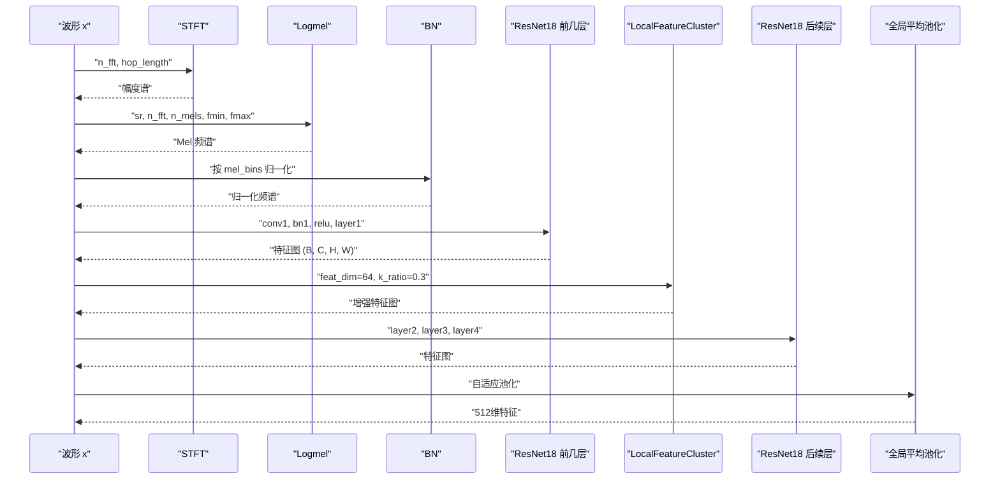
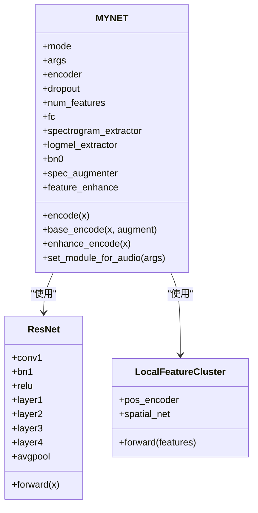

# 音频特征提取模块

<cite>
**本文引用的文件**
- [network.py](file://network.py)
- [resnet18_encoder.py](file://models/resnet18_encoder.py)
- [resnet_enhancer.py](file://models/resnet_enhancer.py)
- [feature_enhancer.py](file://models/feature_enhancer.py)
- [nsynth.py](file://data/nsynth.py)
- [librispeech.py](file://data/librispeech.py)
- [FMC.py](file://data/FMC.py)
- [viz_feature_space.py](file://scripts/viz_feature_space.py)
</cite>

## 目录
1. [简介](#简介)
2. [项目结构](#项目结构)
3. [核心组件](#核心组件)
4. [架构总览](#架构总览)
5. [详细组件分析](#详细组件分析)
6. [依赖关系分析](#依赖关系分析)
7. [性能考量](#性能考量)
8. [故障排查指南](#故障排查指南)
9. [结论](#结论)
10. [附录](#附录)

## 简介
本文件面向“音频特征提取模块”的API与实现细节，聚焦 MYNET 类中的音频特征提取相关方法，包括：
- encode 方法的完整特征提取流程
- base_encode 方法的基础编码过程
- enhance_encode 方法的增强编码实现
并系统化文档化 STFT 与 Logmel 变换的参数配置（窗口大小、hop 长度、mel_bins 等），音频预处理步骤（批归一化、频谱增强、ResNet18 编码器），以及针对不同音频数据类型（NSynth、LibriSpeech、FMC）的特征提取差异。同时提供特征维度转换、数据增强技术与性能优化建议，并给出每个方法的输入输出格式、参数类型与使用示例。

## 项目结构
音频特征提取模块主要由以下部分组成：
- 网络与特征提取：MYNET 类及其音频特征提取方法（encode、base_encode、enhance_encode）
- 编码器：ResNet18 编码器（预训练权重加载、残差块结构）
- 特征增强：局部特征聚类与时空增强（LocalFeatureCluster、EnhancedLocalFeature）
- 数据集与参数：NSynth、LibriSpeech、FMC 数据集的音频加载与特征提取参数
- 可视化：特征空间可视化脚本对编码器输出进行可视化

**图表来源**
- [network.py:326-353](file://network.py#L326-L353)
- [resnet18_encoder.py:240-334](file://models/resnet18_encoder.py#L240-L334)
- [resnet_enhancer.py:51-160](file://models/resnet_enhancer.py#L51-L160)
- [nsynth.py:124-158](file://data/nsynth.py#L124-L158)
- [librispeech.py:116-150](file://data/librispeech.py#L116-L150)
- [FMC.py:116-150](file://data/FMC.py#L116-L150)

**章节来源**
- [network.py:18-518](file://network.py#L18-L518)
- [resnet18_encoder.py:1-471](file://models/resnet18_encoder.py#L1-L471)
- [resnet_enhancer.py:1-172](file://models/resnet_enhancer.py#L1-L172)
- [feature_enhancer.py:1-93](file://models/feature_enhancer.py#L1-L93)
- [nsynth.py:1-287](file://data/nsynth.py#L1-L287)
- [librispeech.py:1-278](file://data/librispeech.py#L1-L278)
- [FMC.py:1-367](file://data/FMC.py#L1-L367)

## 核心组件
- MYNET：音频特征提取主类，封装 STFT、Logmel、批归一化、SpecAugmentation、ResNet18 编码器与特征增强模块，并提供 encode、base_encode、enhance_encode 等方法。
- ResNet18 编码器：提供预训练权重加载与残差网络结构，作为特征提取骨干。
- 特征增强模块：LocalFeatureCluster 与 EnhancedLocalFeature 提供时空增强与聚类增强。
- 数据集模块：NSynth、LibriSpeech、FMC 提供音频加载与特征提取参数配置。

**章节来源**
- [network.py:18-518](file://network.py#L18-L518)
- [resnet18_encoder.py:240-334](file://models/resnet18_encoder.py#L240-L334)
- [resnet_enhancer.py:51-160](file://models/resnet_enhancer.py#L51-L160)
- [feature_enhancer.py:27-93](file://models/feature_enhancer.py#L27-L93)
- [nsynth.py:124-158](file://data/nsynth.py#L124-L158)
- [librispeech.py:116-150](file://data/librispeech.py#L116-L150)
- [FMC.py:116-150](file://data/FMC.py#L116-L150)

## 架构总览
MYNET 的音频特征提取流程如下：
- 输入音频波形经 STFT 生成幅度谱，再经 Logmel 滤波器组生成 Mel 频谱图
- Mel 频谱图通过批归一化与 SpecAugmentation 进行预处理与增强
- 重复通道维度以适配图像输入，送入 ResNet18 编码器提取空间特征
- 可选地在 layer1 之后插入 LocalFeatureCluster 实现局部特征增强
- 全局平均池化后得到 512 维特征向量，可选择进入分类头

**图表来源**
- [network.py:471-518](file://network.py#L471-L518)
- [network.py:326-353](file://network.py#L326-L353)

**章节来源**
- [network.py:471-518](file://network.py#L471-L518)
- [network.py:326-353](file://network.py#L326-L353)

## 详细组件分析

### MYNET 类与音频特征提取方法

#### 方法：encode
- 功能：完整的音频特征提取流程，适用于端到端训练与推理
- 输入
  - x：形状为 (B, 1, T) 的单声道波形张量
- 处理流程
  - STFT → Logmel → 通道重复 → 批归一化 → ResNet18 编码器 → 全局平均池化 → 可选分类头
- 输出
  - 若模式为 encoder：返回分类 logits
  - 否则：返回 512 维特征向量
- 关键参数
  - STFT：n_fft、hop_length、window、center、pad_mode
  - Logmel：sr、n_fft、n_mels、fmin、fmax、ref、amin、top_db
  - 批归一化：按 mel_bins 维度进行
  - ResNet18：预训练权重加载
- 使用示例
  - 训练阶段：model.mode='encoder'，传入音频波形，得到分类 logits
  - 推理阶段：model.mode='feature_extraction'，得到 512 维特征

**图表来源**
- [network.py:471-485](file://network.py#L471-L485)
- [network.py:326-353](file://network.py#L326-L353)

**章节来源**
- [network.py:471-485](file://network.py#L471-L485)
- [network.py:326-353](file://network.py#L326-L353)

#### 方法：base_encode
- 功能：基础编码流程，支持可选的 SpecAugmentation 增强
- 输入
  - x：(B, 1, T) 单声道波形
  - augment：是否启用 SpecAugmentation
- 处理流程
  - STFT → Logmel → 可选 SpecAugmentation → 批归一化 → 通道重复 → ResNet18 → 全局平均池化 → Dropout → 可选分类头
- 输出
  - 512 维特征向量（或 logits，取决于模式）
- 关键参数
  - 与 encode 相同，但可选 SpecAugmentation
- 使用示例
  - 不启用增强：base_encode(x, augment=False)
  - 启用增强：base_encode(x, augment=True)

**图表来源**
- [network.py:486-503](file://network.py#L486-L503)
- [network.py:326-353](file://network.py#L326-L353)

**章节来源**
- [network.py:486-503](file://network.py#L486-L503)
- [network.py:326-353](file://network.py#L326-L353)

#### 方法：enhance_encode
- 功能：在 base_encode 基础上，在 layer1 之后插入 LocalFeatureCluster 实现局部特征增强
- 输入
  - x：(B, 1, T) 单声道波形
- 处理流程
  - STFT → Logmel → 批归一化 → 通道重复 → ResNet18 前几层 → LocalFeatureCluster → 后续层 → 全局平均池化 → 可选分类头
- 输出
  - 512 维特征向量（或 logits，取决于模式）
- 关键参数
  - LocalFeatureCluster：feat_dim、k_ratio
- 使用示例
  - enhance_encode(x)

**图表来源**
- [network.py:290-311](file://network.py#L290-L311)
- [network.py:36-36](file://network.py#L36-L36)

**章节来源**
- [network.py:290-311](file://network.py#L290-L311)
- [network.py:36-36](file://network.py#L36-L36)

### STFT 与 Logmel 参数配置
- STFT（Spectrogram）
  - n_fft：FFT 窗口大小
  - hop_length：帧移（hop 长度）
  - win_length：窗长（通常等于 n_fft）
  - window：窗函数（如 hann）
  - center：是否中心对齐
  - pad_mode：填充模式
  - freeze_parameters：冻结参数
- Logmel（LogmelFilterBank）
  - sr：采样率
  - n_fft：FFT 窗口大小
  - n_mels：Mel 滤波器数量（mel_bins）
  - fmin、fmax：最低与最高频率
  - ref、amin、top_db：参考值、最小幅度、动态范围
  - freeze_parameters：冻结参数
- 批归一化
  - 按 mel_bins 维度进行二维批归一化
- SpecAugmentation
  - time_drop_width、time_stripes_num、freq_drop_width、freq_stripes_num

**章节来源**
- [network.py:326-353](file://network.py#L326-L353)
- [network.py:342-344](file://network.py#L342-L344)
- [network.py:354-402](file://network.py#L354-L402)

### 音频预处理步骤
- 波形预处理
  - 中心化：减去均值
  - 重采样：根据数据集需求（NSynth 默认 16kHz，FMC 默认 44.1kHz）
- STFT 与 Logmel
  - 生成 Mel 频谱图
- 批归一化
  - 按 mel_bins 维度进行二维批归一化
- 频谱增强
  - SpecAugmentation：时间/频率条带遮蔽
- ResNet18 编码器
  - 图像化输入（重复通道至3通道）
  - 预训练 ResNet18 作为特征提取骨干

**章节来源**
- [nsynth.py:147-158](file://data/nsynth.py#L147-L158)
- [librispeech.py:139-150](file://data/librispeech.py#L139-L150)
- [FMC.py:139-150](file://data/FMC.py#L139-L150)
- [network.py:326-353](file://network.py#L326-L353)

### 不同音频数据类型的处理差异
- NSynth
  - 采样率：16kHz
  - 窗口大小：2048
  - hop 长度：1024
  - mel_bins：128
  - fmax：8000Hz
- LibriSpeech
  - 采样率：16kHz
  - 窗口大小：400
  - hop 长度：160
  - mel_bins：128
  - fmax：8000Hz
- FMC
  - 采样率：44.1kHz
  - 窗口大小：2048
  - hop 长度：1024
  - mel_bins：128
  - fmax：22050Hz

**章节来源**
- [nsynth.py:124-158](file://data/nsynth.py#L124-L158)
- [librispeech.py:116-150](file://data/librispeech.py#L116-L150)
- [FMC.py:116-150](file://data/FMC.py#L116-L150)
- [network.py:376-402](file://network.py#L376-L402)

### 特征维度转换与数据增强
- 维度转换
  - 将 (B, 1, T, M) 转换为 (B, 3, T, M) 以适配图像输入
  - 全局平均池化将 (B, C, H, W) 转换为 (B, C)
- 数据增强
  - SpecAugmentation：时间/频率条带遮蔽
  - Dropout：在 base_encode 与 hgnn_encode 中使用
- 局部特征增强
  - LocalFeatureCluster：在 layer1 之后插入，利用 KMeans 聚类与位置编码增强局部细节

**章节来源**
- [network.py:486-503](file://network.py#L486-L503)
- [network.py:290-311](file://network.py#L290-L311)
- [resnet_enhancer.py:51-160](file://models/resnet_enhancer.py#L51-L160)

### 性能优化建议
- 参数冻结
  - STFT 与 Logmel 设置 freeze_parameters=True，减少梯度计算开销
- 预训练编码器
  - 使用预训练 ResNet18 减少训练时间
- 批归一化
  - 在 Mel 频谱上按 mel_bins 维度进行批归一化，提升稳定性
- SpecAugmentation
  - 在 base_encode 中按需启用，提高泛化能力
- 局部特征增强
  - LocalFeatureCluster 在 layer1 之后插入，平衡计算与效果

**章节来源**
- [network.py:333-340](file://network.py#L333-L340)
- [network.py:342-344](file://network.py#L342-L344)
- [resnet18_encoder.py:337-346](file://models/resnet18_encoder.py#L337-L346)
- [resnet_enhancer.py:51-160](file://models/resnet_enhancer.py#L51-L160)

## 依赖关系分析

**图表来源**
- [network.py:18-518](file://network.py#L18-L518)
- [resnet18_encoder.py:240-334](file://models/resnet18_encoder.py#L240-L334)
- [resnet_enhancer.py:51-160](file://models/resnet_enhancer.py#L51-L160)

**章节来源**
- [network.py:18-518](file://network.py#L18-L518)
- [resnet18_encoder.py:240-334](file://models/resnet18_encoder.py#L240-L334)
- [resnet_enhancer.py:51-160](file://models/resnet_enhancer.py#L51-L160)

## 性能考量
- 计算复杂度
  - STFT/Logmel：O(B·T·F·log F)，其中 F 为频率分辨率
  - ResNet18：O(B·C·H·W·K)，K 为卷积核大小
  - LocalFeatureCluster：O(B·HW·k·C)，k 为聚类数
- 内存占用
  - Mel 频谱图 (B, 1, T, M) 与增强后的特征图 (B, C, H, W) 需注意显存
- 优化策略
  - 冻结 STFT/Logmel 参数
  - 使用预训练编码器
  - 合理设置 mel_bins 与 hop_length 平衡分辨率与速度

[本节为通用性能讨论，无需具体文件分析]

## 故障排查指南
- 形状不匹配
  - 确保输入波形为 (B, 1, T)，Mel 频谱经转置与重复通道后为 (B, 3, T, M)
  - LocalFeatureCluster 的 feat_dim 与输入通道数一致
- 设备一致性
  - LocalFeatureCluster 在 forward 中检查并同步设备
- 参数未冻结
  - 若需微调 STFT/Logmel，取消 freeze_parameters=True
- 增强无效
  - 确认 SpecAugmentation 的 time_stripes_num/freq_stripes_num 合理设置

**章节来源**
- [resnet_enhancer.py:168-172](file://models/resnet_enhancer.py#L168-L172)
- [network.py:333-340](file://network.py#L333-L340)

## 结论
本模块通过 STFT、Logmel、批归一化与 SpecAugmentation 构建稳健的音频特征提取流水线，并结合 ResNet18 编码器与局部特征增强模块，实现对 NSynth、LibriSpeech、FMC 等数据集的有效特征提取。MYNET 的 encode、base_encode、enhance_encode 方法分别覆盖从完整到基础再到增强的不同场景，满足训练与推理的多样化需求。通过参数冻结、预训练编码器与合理的数据增强策略，可在保证性能的同时显著降低训练成本。

[本节为总结性内容，无需具体文件分析]

## 附录

### API 参考

- MYNET.encode(x)
  - 输入：x (B, 1, T)
  - 输出：logits 或 (B, 512)
  - 关键参数：n_fft、hop_length、n_mels、fmin、fmax、freeze_parameters、bn0
  - 使用示例：model.mode='encoder'; logits = model.encode(x)

- MYNET.base_encode(x, augment=False)
  - 输入：x (B, 1, T), augment (bool)
  - 输出：(B, 512)
  - 关键参数：SpecAugmentation 参数
  - 使用示例：feat = model.base_encode(x, augment=True)

- MYNET.enhance_encode(x)
  - 输入：x (B, 1, T)
  - 输出：(B, 512)
  - 关键参数：LocalFeatureCluster feat_dim=64, k_ratio=0.3
  - 使用示例：feat = model.enhance_encode(x)

- 数据集参数
  - NSynth：sr=16000, n_fft=2048, hop=1024, mel=128, fmax=8000
  - LibriSpeech：sr=16000, n_fft=400, hop=160, mel=128, fmax=8000
  - FMC：sr=44100, n_fft=2048, hop=1024, mel=128, fmax=22050

**章节来源**
- [network.py:471-518](file://network.py#L471-L518)
- [network.py:486-503](file://network.py#L486-L503)
- [network.py:290-311](file://network.py#L290-L311)
- [nsynth.py:124-158](file://data/nsynth.py#L124-L158)
- [librispeech.py:116-150](file://data/librispeech.py#L116-L150)
- [FMC.py:116-150](file://data/FMC.py#L116-L150)