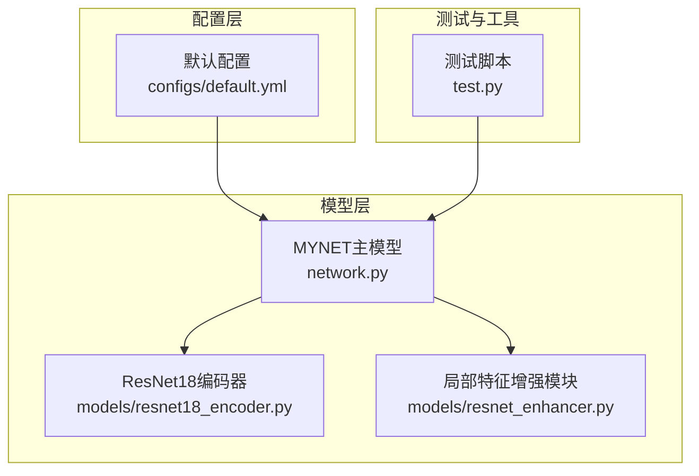
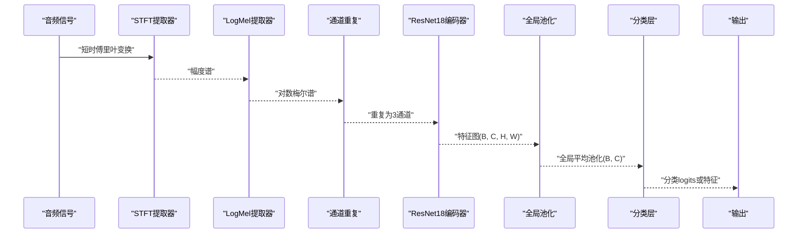
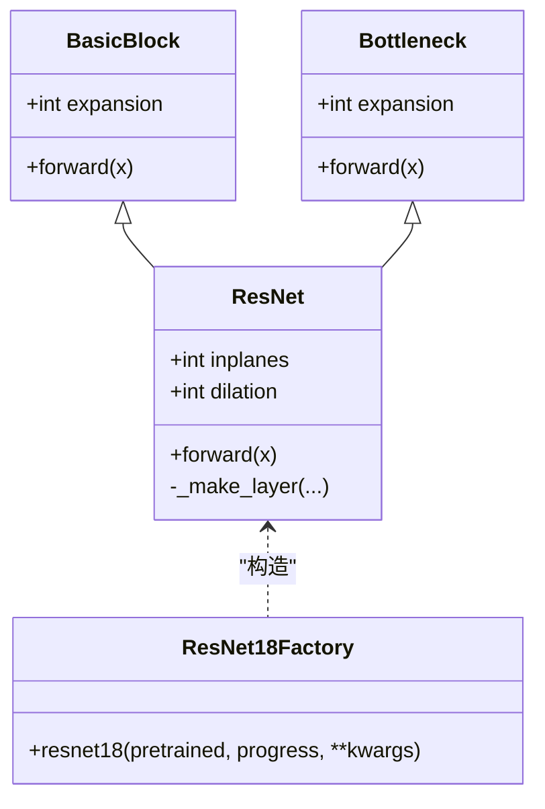
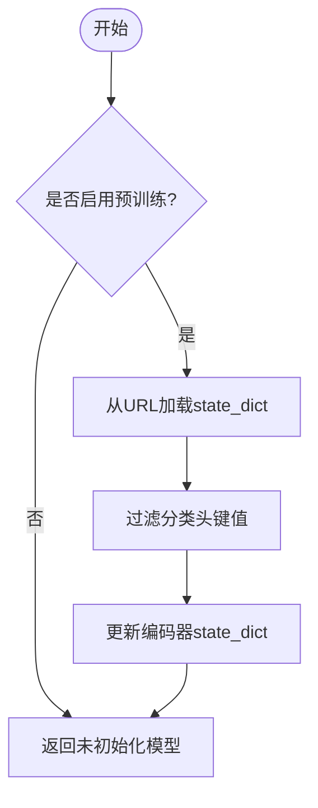
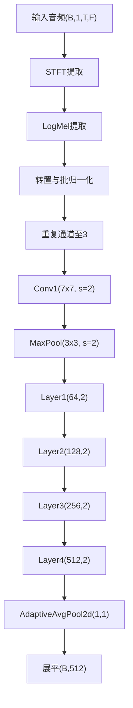
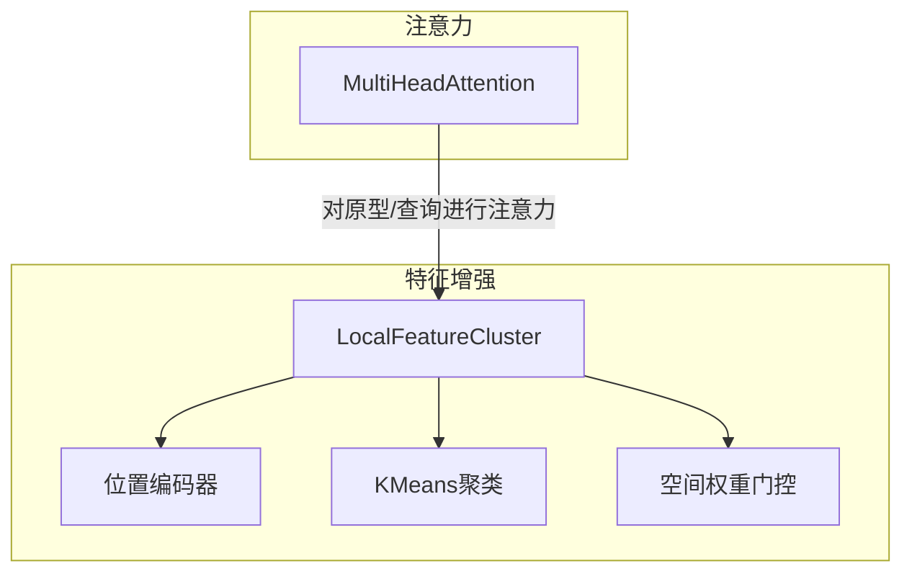
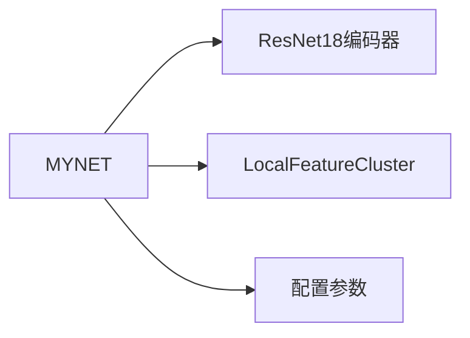

# ResNet18编码器

<cite>
**本文档引用的文件**
- [resnet18_encoder.py](file://models/resnet18_encoder.py)
- [network.py](file://network.py)
- [resnet_enhancer.py](file://models/resnet_enhancer.py)
- [default.yml](file://configs/default.yml)
- [test.py](file://test.py)
</cite>

## 目录
1. [简介](#简介)
2. [项目结构](#项目结构)
3. [核心组件](#核心组件)
4. [架构总览](#架构总览)
5. [详细组件分析](#详细组件分析)
6. [依赖分析](#依赖分析)
7. [性能考虑](#性能考虑)
8. [故障排除指南](#故障排除指南)
9. [结论](#结论)
10. [附录](#附录)

## 简介
本文件为ResNet18编码器的详细API文档，聚焦于以下方面：
- 网络结构与残差连接实现
- 特征提取流程与音频特征图尺寸变化
- 预训练权重加载机制与迁移学习
- 编码器在不同模式下的行为差异（特征提取与分类）
- 参数配置选项（预训练开关、冻结策略、自定义深度）
- 性能基准与推理优化建议
- 与注意力机制的集成与特征融合策略

## 项目结构
ResNet18编码器位于models目录下，配合音频前端、注意力模块与增强模块共同构成完整的音频特征提取与分类系统。

图表来源
- [resnet18_encoder.py:1-471](file://models/resnet18_encoder.py#L1-L471)
- [network.py:1-724](file://network.py#L1-L724)
- [resnet_enhancer.py:1-172](file://models/resnet_enhancer.py#L1-L172)
- [default.yml:1-88](file://configs/default.yml#L1-L88)
- [test.py:1-200](file://test.py#L1-L200)

章节来源
- [resnet18_encoder.py:1-471](file://models/resnet18_encoder.py#L1-L471)
- [network.py:1-724](file://network.py#L1-L724)
- [resnet_enhancer.py:1-172](file://models/resnet_enhancer.py#L1-L172)
- [default.yml:1-88](file://configs/default.yml#L1-L88)
- [test.py:1-200](file://test.py#L1-L200)

## 核心组件
- ResNet18编码器：提供基础卷积与残差块堆叠，支持预训练权重加载与自定义深度
- 局部特征增强模块：对中间层特征进行位置编码、聚类与空间加权融合
- MYNET主模型：封装音频前端（STFT/LogMel）、ResNet18编码器、注意力模块与分类器，并管理多种运行模式

章节来源
- [resnet18_encoder.py:157-334](file://models/resnet18_encoder.py#L157-L334)
- [resnet_enhancer.py:51-172](file://models/resnet_enhancer.py#L51-L172)
- [network.py:18-518](file://network.py#L18-L518)

## 架构总览
ResNet18编码器在MYNET中的集成路径如下：音频输入经STFT与LogMel提取，重复通道至3通道后送入ResNet18编码器，输出特征可继续通过注意力模块或直接进入分类器。

图表来源
- [network.py:471-518](file://network.py#L471-L518)
- [resnet18_encoder.py:240-334](file://models/resnet18_encoder.py#L240-L334)

## 详细组件分析

### ResNet18编码器类结构
- BasicBlock：标准两层卷积+BN+ReLU，支持步幅与下采样
- Bottleneck：三路卷积（1×1→3×3→1×1），用于更深网络
- ResNet：构建网络骨架，包含初始卷积、最大池化、四层残差块与全局池化
- 工厂函数：resnet18、resnet34等，支持预训练权重加载

图表来源
- [resnet18_encoder.py:157-358](file://models/resnet18_encoder.py#L157-L358)

章节来源
- [resnet18_encoder.py:157-358](file://models/resnet18_encoder.py#L157-L358)

### 预训练权重加载机制
- 支持从PyTorch官方URL下载并缓存权重
- 加载时自动过滤分类头参数，仅更新编码器部分
- 通过哈希校验保证文件完整性

图表来源
- [resnet18_encoder.py:18-117](file://models/resnet18_encoder.py#L18-L117)
- [resnet18_encoder.py:337-346](file://models/resnet18_encoder.py#L337-L346)

章节来源
- [resnet18_encoder.py:18-117](file://models/resnet18_encoder.py#L18-L117)
- [resnet18_encoder.py:337-346](file://models/resnet18_encoder.py#L337-L346)

### 特征提取流程与尺寸变化
- 输入：单通道音频波形
- 音频前端：STFT→LogMel→通道重复至3通道
- 编码器：7×7卷积→MaxPool→四层残差块→全局平均池化
- 输出：(B, 512, 1, 1) 或展平为(B, 512)

图表来源
- [network.py:471-518](file://network.py#L471-L518)
- [resnet18_encoder.py:261-273](file://models/resnet18_encoder.py#L261-L273)

章节来源
- [network.py:471-518](file://network.py#L471-L518)
- [resnet18_encoder.py:261-273](file://models/resnet18_encoder.py#L261-L273)

### 编码器模式行为差异
- 模式设置：MYNET.mode 控制编码器行为
  - 'encoder'：返回分类logits（含全连接层）
  - 'openmeta'：执行开放集元学习前向
  - 默认：执行少样本分类前向
- 特殊模式：
  - 'extract_feature'：在训练中临时提取512维特征（绕过分类头）
  - 'feature_extraction'：用于不确定性估计的特征提取模式

章节来源
- [network.py:37-49](file://network.py#L37-L49)
- [network.py:98-101](file://network.py#L98-L101)
- [test.py:37-48](file://test.py#L37-L48)

### 参数配置选项
- 预训练开关：resnet18(pretrained=True/False)
- 自定义网络深度：通过传入不同block与layers参数（本仓库提供BasicBlock与[2,2,2,2]）
- 冻结策略：可通过冻结编码器参数实现冻结
- 其他相关配置：温度系数、分类器类型、批次大小、学习率等

章节来源
- [resnet18_encoder.py:349-358](file://models/resnet18_encoder.py#L349-L358)
- [network.py:20-34](file://network.py#L20-L34)
- [default.yml:22-45](file://configs/default.yml#L22-L45)

### 与注意力机制的集成与特征融合
- 局部特征增强：在layer3后插入LocalFeatureCluster，进行位置编码、聚类与空间加权融合
- 注意力模块：MultiHeadAttention用于原型与查询之间的注意力计算
- 特征融合策略：残差连接、空间权重门控、聚类中心加权融合

图表来源
- [resnet_enhancer.py:51-172](file://models/resnet_enhancer.py#L51-L172)
- [network.py:31-32](file://network.py#L31-L32)

章节来源
- [resnet_enhancer.py:51-172](file://models/resnet_enhancer.py#L51-L172)
- [network.py:31-32](file://network.py#L31-L32)

## 依赖分析
- MYNET依赖ResNet18编码器与音频前端模块
- LocalFeatureCluster作为可选增强模块插入到编码器中间层
- 配置文件提供超参数（学习率、批次、温度等）

图表来源
- [network.py:18-518](file://network.py#L18-L518)
- [resnet_enhancer.py:51-172](file://models/resnet_enhancer.py#L51-L172)
- [default.yml:1-88](file://configs/default.yml#L1-88)

章节来源
- [network.py:18-518](file://network.py#L18-L518)
- [resnet_enhancer.py:51-172](file://models/resnet_enhancer.py#L51-L172)
- [default.yml:1-88](file://configs/default.yml#L1-88)

## 性能考虑
- 推理速度优化建议
  - 使用半精度（AMP）与TensorRT/ONNX加速（需外部工具链）
  - 减少音频帧长度与Mel bins以降低计算量
  - 合理设置批次大小与多线程加载
  - 冻结编码器参数以减少训练开销
- 训练稳定性
  - 使用合适的温度系数与分类器类型（cosine/linear）
  - 合理的学习率调度与权重衰减
  - 在增量场景中逐步替换分类头参数

[本节为通用指导，无需特定文件来源]

## 故障排除指南
- 预训练权重下载失败
  - 检查网络连通性与代理设置
  - 清理缓存目录（默认TORCH_HOME/checkpoints）
- 模型尺寸不匹配
  - 确认输入通道数与预训练权重键名一致
  - 若自定义分类头，请确保不参与预训练权重加载
- 模式切换导致输出异常
  - 确保在提取特征时正确设置mode（如'extract_feature'）
  - 注意在不确定性估计中临时开启Dropout

章节来源
- [resnet18_encoder.py:18-117](file://models/resnet18_encoder.py#L18-L117)
- [network.py:98-101](file://network.py#L98-L101)
- [test.py:37-48](file://test.py#L37-L48)

## 结论
ResNet18编码器提供了简洁高效的特征提取能力，结合音频前端与注意力/增强模块，能够灵活适配少样本与开放集场景。通过合理的参数配置与模式切换，可在准确率与效率之间取得平衡。

[本节为总结，无需特定文件来源]

## 附录

### API参考（方法与参数）
- resnet18(pretrained=False, progress=True, **kwargs)
  - pretrained: 是否加载ImageNet预训练权重
  - progress: 是否显示下载进度
  - 返回: ResNet18编码器实例
- MYNET.__init__(args, mode=None)
  - args: 配置对象
  - mode: 运行模式（'encoder'/'openmeta'/默认）
  - 返回: MYNET实例
- MYNET.encode(x)
  - x: 音频波形
  - 返回: 特征向量或分类logits（取决于mode）
- MYNET.hgnn_encode(x, augment=False)
  - x: 音频波形
  - augment: 是否进行数据增强
  - 返回: 保留空间维度的特征图（B, C, H, W）

章节来源
- [resnet18_encoder.py:349-358](file://models/resnet18_encoder.py#L349-L358)
- [network.py:20-34](file://network.py#L20-L34)
- [network.py:471-518](file://network.py#L471-L518)