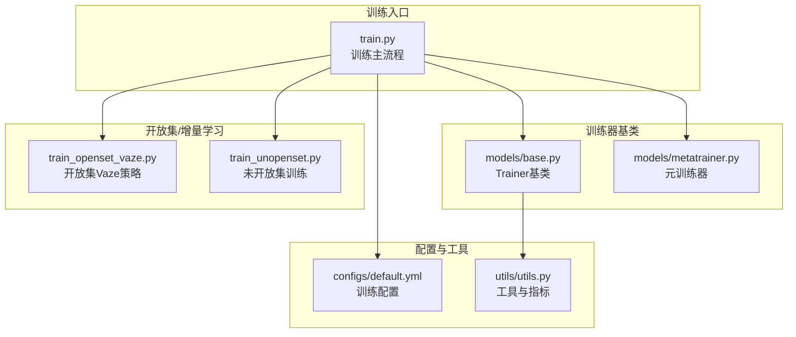
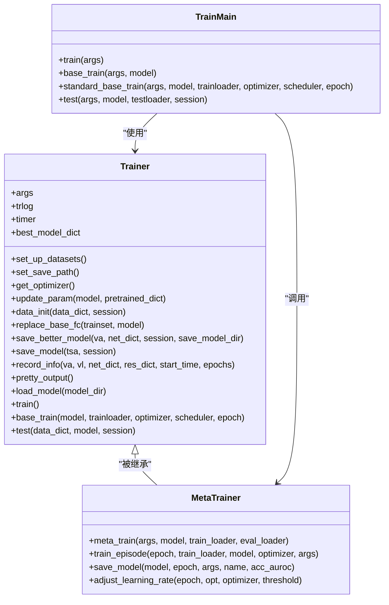
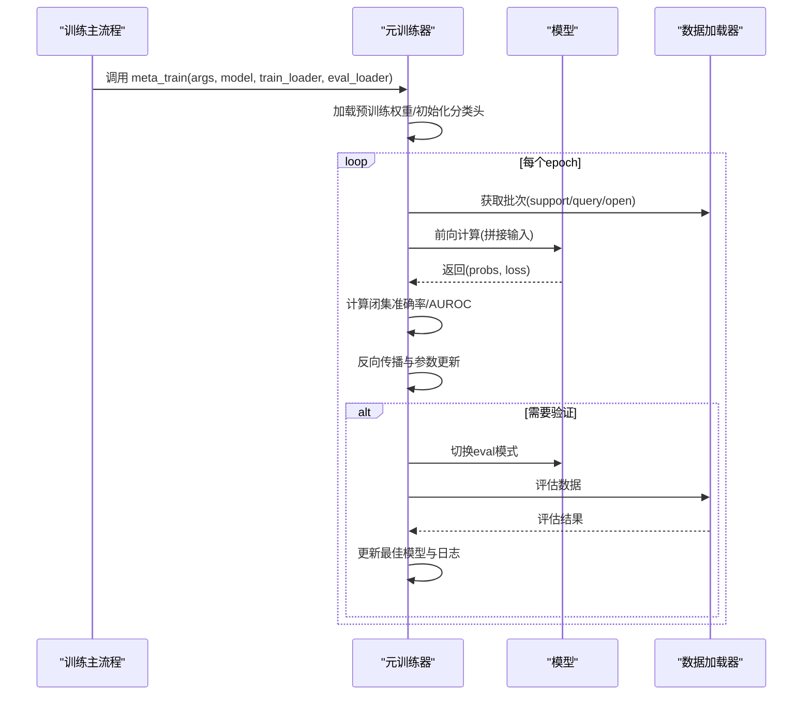
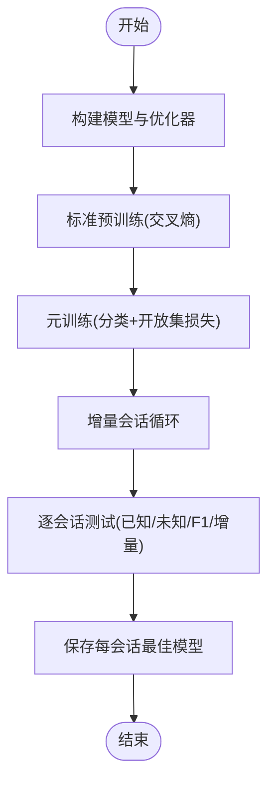
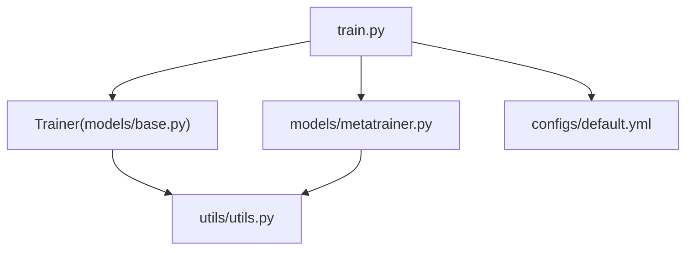

# Trainer基类

<cite>
**本文档引用的文件**
- [models/base.py](file://models/base.py)
- [models/metatrainer.py](file://models/metatrainer.py)
- [train.py](file://train.py)
- [configs/default.yml](file://configs/default.yml)
- [utils/utils.py](file://utils/utils.py)
- [models/baselines/base.py](file://models/baselines/base.py)
- [train_openset_vaze.py](file://train_openset_vaze.py)
- [train_unopenset.py](file://train_unopenset.py)
</cite>

## 目录
1. [简介](#简介)
2. [项目结构](#项目结构)
3. [核心组件](#核心组件)
4. [架构总览](#架构总览)
5. [详细组件分析](#详细组件分析)
6. [依赖分析](#依赖分析)
7. [性能考虑](#性能考虑)
8. [故障排查指南](#故障排查指南)
9. [结论](#结论)
10. [附录](#附录)

## 简介
本文件面向Trainer基类的使用者与维护者，系统化梳理其抽象方法、训练循环、验证与测试流程、模型保存与加载机制、训练配置参数、监控与调试手段以及异常处理与恢复策略。文档以代码为依据，结合训练脚本与元训练器实现，帮助读者快速理解并扩展该基类。

## 项目结构
Trainer基类位于models/base.py中，采用抽象基类设计，定义了训练生命周期中的通用接口与基础设施；训练主流程由train.py驱动，元训练逻辑由models/metatrainer.py提供；训练配置由configs/default.yml统一管理；工具函数与指标计算位于utils/utils.py；开放集与增量学习相关实现位于train_openset_vaze.py与train_unopenset.py等文件。

图表来源
- [train.py:1-1296](file://train.py#L1-L1296)
- [models/base.py:1-254](file://models/base.py#L1-L254)
- [models/metatrainer.py:1-201](file://models/metatrainer.py#L1-L201)
- [configs/default.yml:1-88](file://configs/default.yml#L1-L88)
- [utils/utils.py:1-566](file://utils/utils.py#L1-L566)
- [train_openset_vaze.py:1-200](file://train_openset_vaze.py#L1-L200)
- [train_unopenset.py:868-894](file://train_unopenset.py#L868-L894)

章节来源
- [models/base.py:1-254](file://models/base.py#L1-L254)
- [train.py:1-1296](file://train.py#L1-L1296)
- [configs/default.yml:1-88](file://configs/default.yml#L1-L88)

## 核心组件
- Trainer基类（抽象基类）：定义训练生命周期、数据集初始化、保存路径、优化器与学习率调度器构建、模型保存与加载、基础训练与测试接口占位等。
- 元训练器（meta-trainer）：封装元训练的完整循环，包括前向、损失计算、反向传播、参数更新、验证与AUROC评估、模型保存等。
- 训练主流程（train.py）：负责预训练、元训练、增量会话、测试与结果汇总、模型持久化。
- 工具与指标（utils/utils.py）：提供计数准确率、Averager、DAverageMeter、Timer、t-SNE可视化等辅助能力。
- 配置（configs/default.yml）：集中管理训练超参、优化器、调度器、数据加载器等配置项。

章节来源
- [models/base.py:27-254](file://models/base.py#L27-L254)
- [models/metatrainer.py:17-201](file://models/metatrainer.py#L17-L201)
- [train.py:799-1296](file://train.py#L799-L1296)
- [utils/utils.py:190-485](file://utils/utils.py#L190-L485)
- [configs/default.yml:1-88](file://configs/default.yml#L1-L88)

## 架构总览
Trainer基类提供统一的训练框架与接口约定，具体训练器（如元训练器）实现训练循环与验证流程；训练主流程协调数据准备、模型初始化、预训练、元训练与增量会话，并负责结果记录与模型保存。

图表来源
- [models/base.py:27-254](file://models/base.py#L27-L254)
- [models/metatrainer.py:17-201](file://models/metatrainer.py#L17-L201)
- [train.py:799-1296](file://train.py#L799-L1296)

## 详细组件分析

### Trainer基类（抽象基类）
- 初始化与环境准备
  - 设置数据集类型与导入路径
  - 生成保存目录结构，按配置拼接超参标识
  - 初始化计时器与统计容器（trlog）
- 优化器与学习率调度
  - 提供SGD优化器构建与多种调度策略（Step/MultiStep）
- 模型替换与初始化
  - 支持按需替换分类头（replace_base_fc），使用训练集平均嵌入初始化
  - 支持从外部权重迁移（update_param），并加载到模型
- 训练与验证记录
  - 记录训练/验证损失与准确率序列
  - 保存最佳模型（按验证准确率阈值）
- 模型保存与加载
  - 保存完整状态字典与优化器状态
  - 支持从指定路径加载权重并合并到当前模型
- 抽象接口
  - train、base_train、test为抽象方法，由子类实现具体逻辑

章节来源
- [models/base.py:27-254](file://models/base.py#L27-L254)

### 元训练器（meta-trainer）
- 训练入口
  - 加载预训练权重，初始化分类头表示
  - 构建优化器与学习率调度器（余弦退火或阶梯衰减）
  - 循环执行训练与验证，记录最大准确率与AUROC
- 训练步骤
  - 前向：将支持集、查询集、开放集等拼接后送入模型
  - 损失：组合分类损失、开放集铰链损失与功能单元损失
  - 评估：计算闭集准确率与开放集AUROC
  - 反向：清零梯度、反向传播、参数更新
  - 定期保存：按周期保存模型快照
- 学习率调整
  - 支持ReduceLROnPlateau与自定义阶梯衰减

图表来源
- [models/metatrainer.py:17-201](file://models/metatrainer.py#L17-L201)

章节来源
- [models/metatrainer.py:17-201](file://models/metatrainer.py#L17-L201)

### 训练主流程（train.py）
- 预训练阶段
  - 构建模型与优化器，执行标准分类训练
  - 使用交叉熵损失，按调度器更新学习率
  - 保存预训练权重
- 元训练阶段
  - 加载预训练权重，替换分类头表示
  - 调用元训练器执行训练与验证
- 增量会话与测试
  - 逐会话扩展已知类别集合，执行增量测试
  - 计算已知/未知准确率、F1分数与增量准确率
  - 持久化每会话最佳模型
- 可视化与特征分析
  - 提供t-SNE、相关性热图、特征分布等可视化工具

图表来源
- [train.py:799-1296](file://train.py#L799-L1296)

章节来源
- [train.py:799-1296](file://train.py#L799-L1296)

### 训练流程阶段详解
- 数据加载
  - 训练主流程中通过数据加载器获取批次，支持多数据源（训练/验证/测试/开放集）
- 前向传播
  - 元训练器将支持集、查询集、开放集拼接后送入模型，返回分类概率与损失
- 反向传播与参数更新
  - 清零梯度、反向传播、优化器步进
- 准确率与AUROC评估
  - 闭集准确率：对查询集预测与标签比较
  - 开放集AUROC：将查询与开放集概率拼接，二分类评估未知/已知
- 模型保存与加载
  - 保存完整状态字典与优化器状态；支持从外部路径加载权重并合并

章节来源
- [models/metatrainer.py:87-178](file://models/metatrainer.py#L87-L178)
- [models/base.py:153-175](file://models/base.py#L153-L175)
- [models/base.py:236-244](file://models/base.py#L236-L244)

### 验证与测试过程
- 验证
  - 元训练器在训练期间定期切换为eval模式，使用评估数据计算AUROC与准确率
  - 以最大准确率或AUROC作为保存条件
- 测试
  - 训练主流程中对每会话进行增量测试，计算已知/未知准确率、F1分数与增量准确率
  - 使用余弦相似度进行分类推理

章节来源
- [models/metatrainer.py:54-80](file://models/metatrainer.py#L54-L80)
- [train.py:763-780](file://train.py#L763-L780)

### 模型保存与加载机制
- 最佳模型选择
  - 以验证准确率阈值或AUROC阈值作为保存条件，记录最佳epoch
- 断点续训
  - 保存模型状态字典与优化器状态，便于后续恢复
- 权重迁移
  - 支持从外部权重文件加载并合并到当前模型，保证参数兼容性

章节来源
- [models/base.py:153-175](file://models/base.py#L153-L175)
- [models/base.py:236-244](file://models/base.py#L236-L244)

### 训练配置参数说明
- 任务与会话
  - way/shot/n_ways/n_shots/n_queries：任务设置
  - num_session/start_session/test_times：会话与测试轮次
- 训练轮数与学习率
  - epochs_std/epochs_meta/epochs_stdu_base/epochs_new：不同阶段训练轮数
  - lr_std/lr_stdu_base/lr_new：不同阶段学习率
  - lr_decay_rate/lr_decay_epochs/scheduler.schedule/milestones/gamma：学习率调度策略
- 优化器与正则化
  - optimizer.decay/momentum：权重衰减与动量
- 网络与模式
  - network.temperature/network.base_mode/network.new_mode：温度缩放与分类模式
- 数据加载
  - dataloader.num_workers/train_batch_size/test_batch_size：数据加载器参数

章节来源
- [configs/default.yml:1-88](file://configs/default.yml#L1-L88)

### 监控与调试方法
- 指标与日志
  - 训练/验证损失与准确率序列记录于trlog
  - 每轮输出学习率、损失与准确率
- 可视化
  - 提供t-SNE、相关性热图、特征分布等可视化工具
- 指标计算
  - 提供计数准确率、各类别准确率、混淆矩阵等

章节来源
- [models/base.py:177-191](file://models/base.py#L177-L191)
- [utils/utils.py:360-485](file://utils/utils.py#L360-L485)

### 异常处理与错误恢复
- 调度器兼容性
  - 在标准训练中，若调度器为None，则从优化器参数组直接获取学习率
- 可选验证
  - 元训练器允许传入None的评估加载器，跳过验证阶段
- 稳健的特征维度处理
  - 在开放集/增量学习中，对特征维度不匹配进行填充或截断处理

章节来源
- [train.py:1239-1244](file://train.py#L1239-L1244)
- [models/metatrainer.py:55-80](file://models/metatrainer.py#L55-L80)
- [train_openset_vaze.py:173-198](file://train_openset_vaze.py#L173-L198)

## 依赖分析
- Trainer基类依赖工具模块（utils/utils.py）中的计数准确率、Averager、DAverageMeter、Timer等
- 训练主流程依赖元训练器与配置文件
- 元训练器依赖sklearn的metrics进行AUROC计算

图表来源
- [models/base.py:14-24](file://models/base.py#L14-L24)
- [utils/utils.py:190-485](file://utils/utils.py#L190-L485)
- [models/metatrainer.py:12-14](file://models/metatrainer.py#L12-L14)
- [train.py:1-50](file://train.py#L1-L50)
- [configs/default.yml:1-30](file://configs/default.yml#L1-L30)

章节来源
- [models/base.py:14-24](file://models/base.py#L14-L24)
- [utils/utils.py:190-485](file://utils/utils.py#L190-L485)
- [models/metatrainer.py:12-14](file://models/metatrainer.py#L12-L14)
- [train.py:1-50](file://train.py#L1-L50)
- [configs/default.yml:1-30](file://configs/default.yml#L1-L30)

## 性能考虑
- 计算效率
  - 使用Averager与AverageMeter进行高效统计
  - 在元训练中对拼接输入进行批处理，减少重复开销
- 内存管理
  - 训练主流程中对特征进行no_grad推断，降低内存占用
- 可扩展性
  - Trainer基类提供抽象接口，便于扩展新的训练器
  - 元训练器支持多种学习率调度策略，适应不同场景

## 故障排查指南
- 学习率获取异常
  - 若调度器为None，需从优化器参数组获取学习率
- 模型维度不匹配
  - 在权重迁移或分类头扩展时，确保特征维度一致，必要时进行填充或截断
- 验证阶段缺失
  - 评估加载器可为None，跳过验证但仍可保存模型

章节来源
- [train.py:1239-1244](file://train.py#L1239-L1244)
- [train_openset_vaze.py:173-198](file://train_openset_vaze.py#L173-L198)
- [models/metatrainer.py:55-80](file://models/metatrainer.py#L55-L80)

## 结论
Trainer基类提供了统一的训练框架与接口规范，配合元训练器与训练主流程，实现了从预训练到增量学习的完整闭环。通过完善的模型保存/加载、指标记录与可视化工具，开发者能够高效地迭代与调试训练过程。建议在扩展新训练器时遵循Trainer的抽象接口，确保配置与日志的一致性。

## 附录
- 常用工具函数
  - 计数准确率：用于计算预测与标签的准确率
  - Averager/DAverageMeter：用于滚动统计与多指标聚合
  - Timer：用于估算剩余训练时间
- 可视化工具
  - t-SNE、相关性热图、特征分布等，辅助分析特征空间

章节来源
- [utils/utils.py:190-485](file://utils/utils.py#L190-L485)