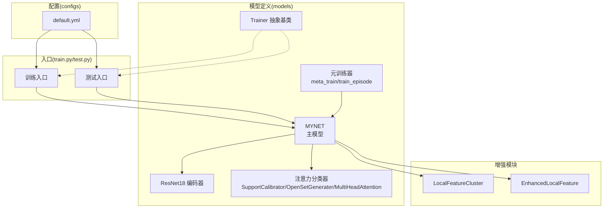
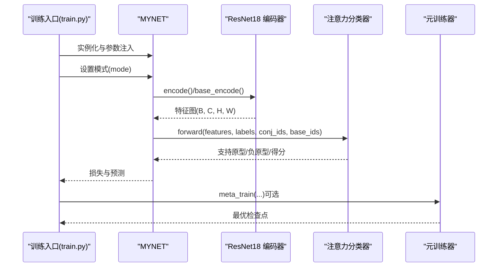
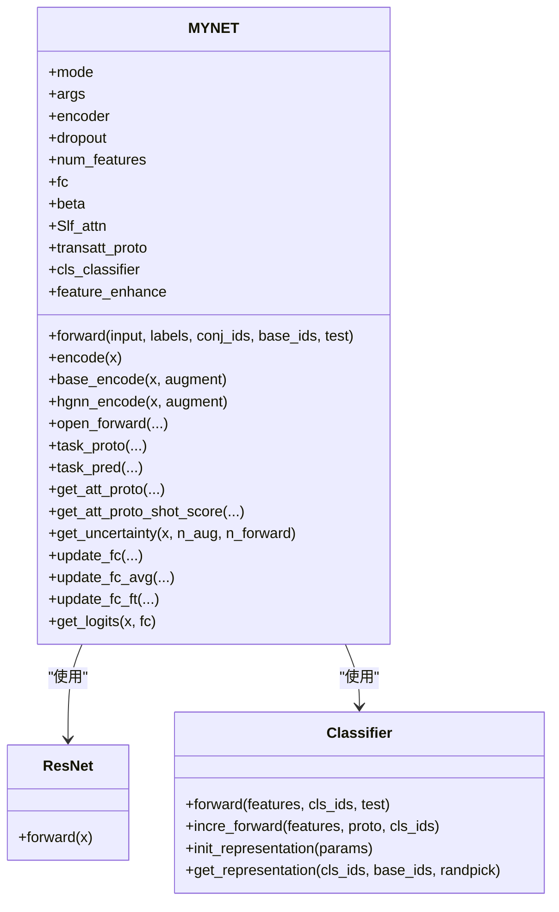
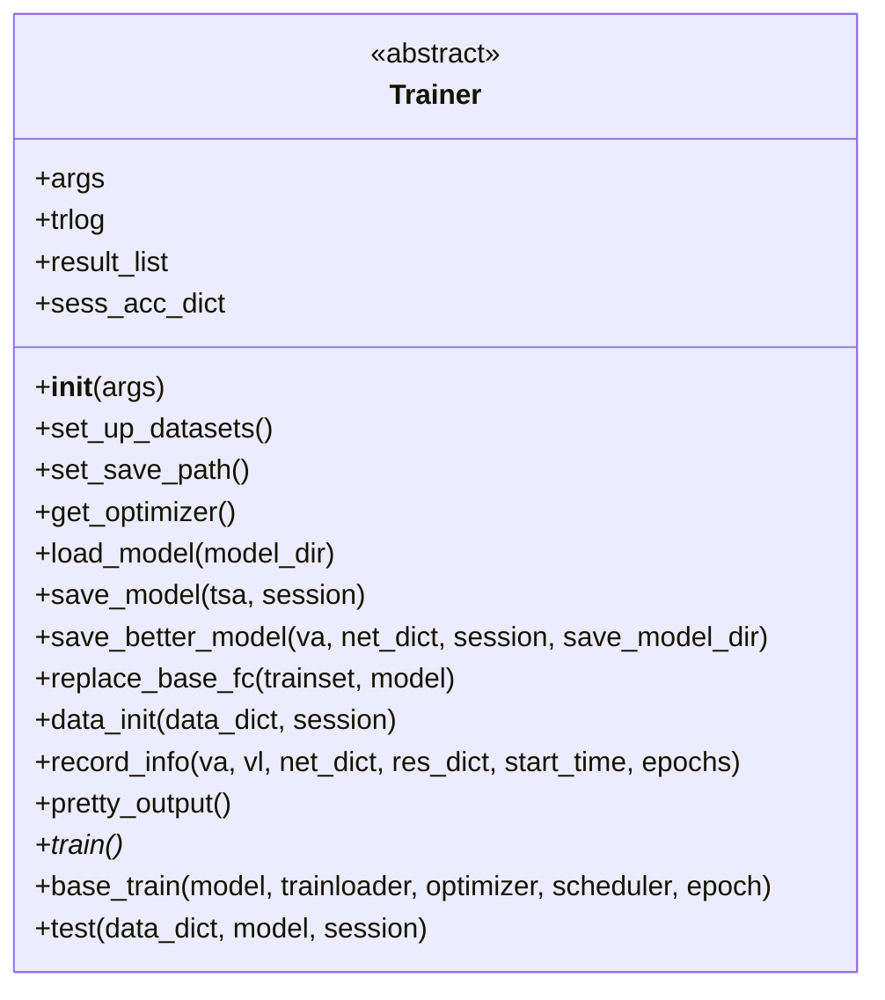
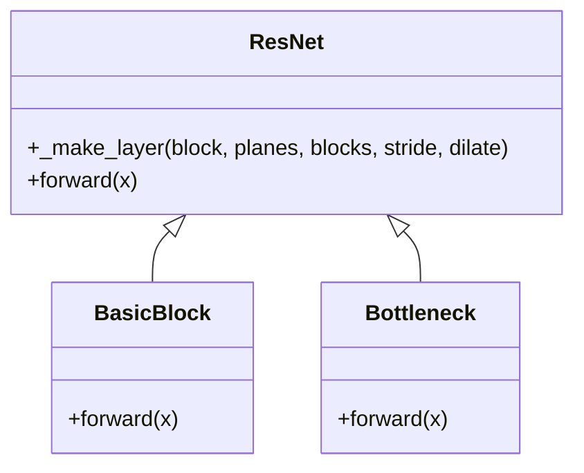
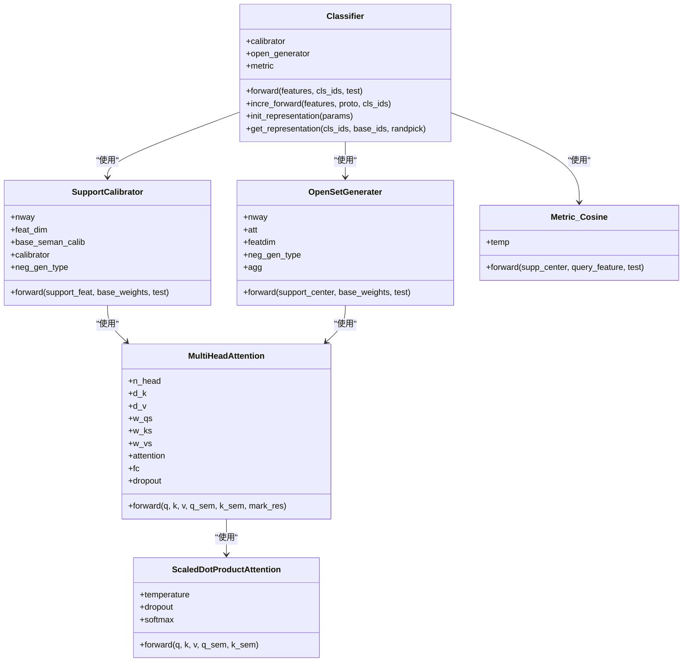
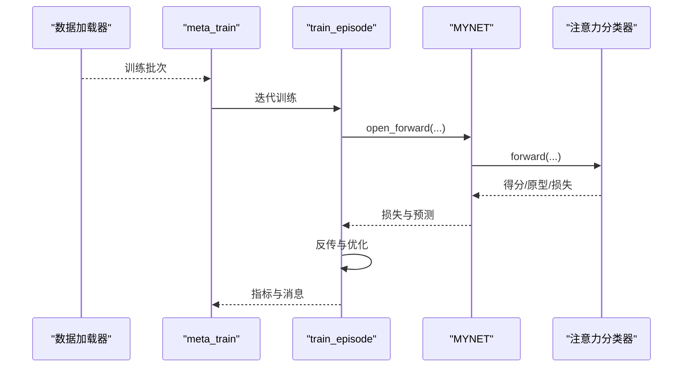
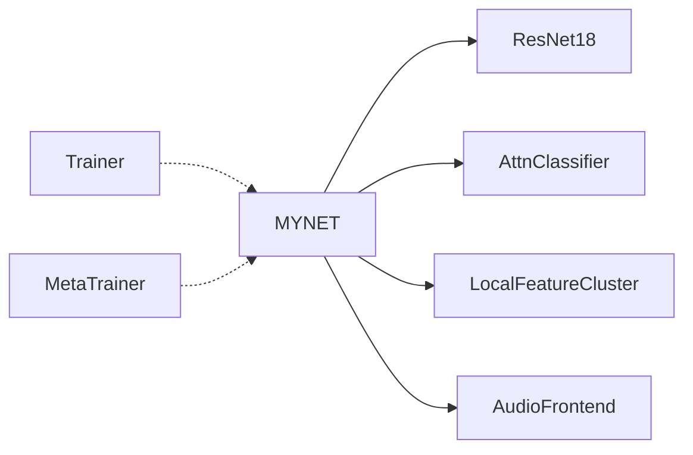

# 核心模型API

<cite>
**本文引用的文件**
- [network.py](file://network.py)
- [base.py](file://models/base.py)
- [resnet18_encoder.py](file://models/resnet18_encoder.py)
- [AttnClassifier.py](file://models/AttnClassifier.py)
- [metatrainer.py](file://models/metatrainer.py)
- [default.yml](file://configs/default.yml)
- [train.py](file://train.py)
- [test.py](file://test.py)
- [resnet_enhancer.py](file://models/resnet_enhancer.py)
- [feature_enhancer.py](file://models/feature_enhancer.py)
</cite>

## 目录
1. [简介](#简介)
2. [项目结构](#项目结构)
3. [核心组件](#核心组件)
4. [架构总览](#架构总览)
5. [详细组件分析](#详细组件分析)
6. [依赖分析](#依赖分析)
7. [性能考虑](#性能考虑)
8. [故障排查指南](#故障排查指南)
9. [结论](#结论)
10. [附录](#附录)

## 简介
本文件系统化梳理并文档化以下核心API与组件：
- MYNET主模型类：初始化参数、前向传播、特征提取、分类与增量更新流程
- Trainer基类：抽象训练接口、训练循环、验证与模型保存机制
- ResNet18编码器：接口规范、输入输出格式、特征维度与权重加载
- 注意力分类器：注意力权重计算、原型生成与预测流程
- 配置项与超参数：来自配置文件的关键参数与建议
- 使用示例与最佳实践：结合训练脚本与测试脚本给出调用路径与注意事项

## 项目结构
本项目围绕音频流形的少样本开放世界分类任务构建，核心模块如下：
- models：模型定义与工具（MYNET、Trainer基类、ResNet18编码器、注意力分类器、元训练器等）
- configs：训练配置（默认参数与超参）
- data：数据加载与采样
- utils：通用工具与评估指标
- scripts：可视化与基准运行脚本
- save/save_result：中间结果与日志保存
- train.py/test.py：训练与测试入口

图表来源
- [network.py:18-518](file://network.py#L18-L518)
- [base.py:27-254](file://models/base.py#L27-L254)
- [resnet18_encoder.py:240-471](file://models/resnet18_encoder.py#L240-L471)
- [AttnClassifier.py:38-369](file://models/AttnClassifier.py#L38-L369)
- [metatrainer.py:17-201](file://models/metatrainer.py#L17-L201)
- [default.yml:1-88](file://configs/default.yml#L1-L88)
- [train.py:173-200](file://train.py#L173-L200)
- [test.py:1-200](file://test.py#L1-L200)

章节来源
- [network.py:18-518](file://network.py#L18-L518)
- [base.py:27-254](file://models/base.py#L27-L254)
- [resnet18_encoder.py:240-471](file://models/resnet18_encoder.py#L240-L471)
- [AttnClassifier.py:38-369](file://models/AttnClassifier.py#L38-L369)
- [metatrainer.py:17-201](file://models/metatrainer.py#L17-L201)
- [default.yml:1-88](file://configs/default.yml#L1-L88)
- [train.py:173-200](file://train.py#L173-L200)
- [test.py:1-200](file://test.py#L1-L200)

## 核心组件
本节聚焦四大核心API与组件的职责、参数、返回值、异常处理与使用要点。

- MYNET主模型类
  - 职责：音频特征提取、少样本分类、开放集元训练、增量学习、不确定性估计
  - 关键属性：mode、args、encoder、dropout、num_features、fc、beta、Slf_attn、transatt_proto、cls_classifier、feature_enhance
  - 关键方法：forward、encode、base_encode、hgnn_encode、open_forward、task_proto、task_pred、get_att_proto、get_att_proto_shot_score、get_uncertainty、update_fc、update_fc_avg、update_fc_ft、get_logits
  - 异常处理：对模式切换与设备一致性进行保护；在不确定性估计中恢复原始模式
  - 使用示例：参考训练脚本中的实例化与调用路径

- Trainer基类
  - 职责：统一训练/验证/保存流程，抽象训练接口
  - 关键方法：train（抽象）、base_train、test、get_optimizer、load_model、save_model、save_better_model、record_info、pretty_output、replace_base_fc、data_init
  - 异常处理：加载模型时对None路径进行提示；记录训练统计并导出Excel

- ResNet18编码器
  - 职责：图像域ResNet骨干，适配音频特征图输入
  - 接口：resnet18(pretrained, progress, **kwargs)；forward返回特征图（B, C, H, W）
  - 权重加载：支持从URL下载并缓存预训练权重，过滤fc层参数

- 注意力分类器
  - 职责：支持集原型校准、负原型生成、余弦相似度打分、开放集预测
  - 组件：SupportCalibrator、OpenSetGenerater、MultiHeadAttention、ScaledDotProductAttention、Metric_Cosine
  - 关键方法：Classifier.forward、incre_forward、init_representation、get_representation；SupportCalibrator.forward；OpenSetGenerater.forward；MultiHeadAttention.forward；Metric_Cosine.forward

章节来源
- [network.py:18-518](file://network.py#L18-L518)
- [base.py:27-254](file://models/base.py#L27-L254)
- [resnet18_encoder.py:349-359](file://models/resnet18_encoder.py#L349-L359)
- [AttnClassifier.py:38-369](file://models/AttnClassifier.py#L38-L369)

## 架构总览
MYNET作为主控制器，负责：
- 将音频波形经谱图与Mel滤波器转为三通道特征图，送入ResNet18编码器
- 通过分类器模块生成支持集原型与负原型，计算余弦相似度得分
- 在开放集场景下，动态标签分配与边界拉远损失，提升泛化能力
- 支持增量学习与不确定性估计

图表来源
- [network.py:37-151](file://network.py#L37-L151)
- [resnet18_encoder.py:317-334](file://models/resnet18_encoder.py#L317-L334)
- [AttnClassifier.py:47-93](file://models/AttnClassifier.py#L47-L93)
- [metatrainer.py:17-85](file://models/metatrainer.py#L17-L85)

## 详细组件分析

### MYNET 主模型类 API
- 初始化参数
  - 参数：args（包含数据集、网络、策略、提取器等配置）、mode（可选）
  - 行为：装配ResNet18编码器、Dropout、线性分类器、多头注意力、分类器模块、局部特征增强
  - 复杂度：O(1)初始化，参数量主要由编码器与分类器决定
- 前向传播
  - 模式选择：'encoder'仅编码；'openmeta'执行开放集元训练前向；否则走少样本前向
  - 返回：编码结果或(支持/查询/开放集)特征与原型、预测概率、损失
- 特征提取
  - encode/base_encode/hgnn_encode：统一音频到特征图再到全局特征的管线
  - 增强：可选SpecAugment与时序约束、局部聚类增强
- 分类与增量
  - task_proto：原型生成与动态标签分配、交叉熵与边界损失
  - task_pred：将分数转为概率
  - update_fc/update_fc_avg/update_fc_ft：增量学习与微调
- 不确定性估计
  - get_uncertainty：MC Dropout + 核范数，返回样本不确定性

章节来源
- [network.py:18-518](file://network.py#L18-L518)

#### MYNET 类图

图表来源
- [network.py:18-518](file://network.py#L18-L518)
- [resnet18_encoder.py:240-334](file://models/resnet18_encoder.py#L240-L334)
- [AttnClassifier.py:38-118](file://models/AttnClassifier.py#L38-L118)

### Trainer 基类 API
- 抽象方法
  - train()：需由具体实现类覆盖，定义训练循环
- 关键方法
  - get_optimizer：构造优化器与调度器
  - load_model/save_model/save_better_model：模型加载与保存
  - replace_base_fc/data_init：基础类替换与数据初始化
  - record_info/pretty_output：训练统计记录与汇总导出
- 异常处理
  - 加载模型时对None路径进行提示，避免崩溃
  - 训练统计字典trlog维护训练/验证/测试指标

章节来源
- [base.py:27-254](file://models/base.py#L27-L254)

#### Trainer 类图

图表来源
- [base.py:27-254](file://models/base.py#L27-L254)

### ResNet18 编码器 API
- 接口规范
  - resnet18(pretrained=False, progress=True, **kwargs)：返回ResNet实例
  - forward(x)：输入(B, 3, H, W)，输出(B, 512, H', W')（未全局池化）
- 输入输出格式
  - 输入：三通道特征图（由音频转谱图与Mel滤波器生成）
  - 输出：特征图（B, C, H, W），典型C=512
- 特征维度
  - num_features=512（ResNet18输出通道数）
- 权重加载
  - 支持从官方URL下载预训练权重，缓存至本地；加载时过滤fc层参数

章节来源
- [resnet18_encoder.py:349-359](file://models/resnet18_encoder.py#L349-L359)
- [resnet18_encoder.py:337-346](file://models/resnet18_encoder.py#L337-L346)
- [resnet18_encoder.py:317-334](file://models/resnet18_encoder.py#L317-L334)

#### ResNet18 类图

图表来源
- [resnet18_encoder.py:240-334](file://models/resnet18_encoder.py#L240-L334)
- [resnet18_encoder.py:157-194](file://models/resnet18_encoder.py#L157-L194)
- [resnet18_encoder.py:197-237](file://models/resnet18_encoder.py#L197-L237)

### 注意力分类器 API
- 组件与职责
  - SupportCalibrator：支持集特征与语义信息融合，生成支持原型
  - OpenSetGenerater：基于支持原型与基类权重生成负原型（伪类）
  - MultiHeadAttention/ScaledDotProductAttention：多头注意力与缩放点积注意力
  - Metric_Cosine：余弦相似度打分，支持温度参数
- 关键流程
  - forward：支持集均值、噪声注入、原型生成、负原型生成、打分与距离计算
  - incre_forward：增量场景下的原型预测
  - init_representation/get_representation：初始化与获取基类权重表示

章节来源
- [AttnClassifier.py:38-369](file://models/AttnClassifier.py#L38-L369)

#### 注意力分类器类图

图表来源
- [AttnClassifier.py:38-369](file://models/AttnClassifier.py#L38-L369)

### 元训练器 API
- 元训练入口
  - meta_train：加载预训练分类器参数，冻结特征提取器，训练分类器参数
  - 训练循环：train_episode，封装批次数据、前向、损失计算、反传与指标统计
- 关键流程
  - 数据打包：支持集、查询集、开放集拼接为单张量
  - 损失：分类CE + 边界Hinge + 距离对比损失
  - 评估：AUROC与准确率，定期保存最优检查点

章节来源
- [metatrainer.py:17-201](file://models/metatrainer.py#L17-L201)

#### 元训练序列图

图表来源
- [metatrainer.py:87-178](file://models/metatrainer.py#L87-L178)
- [network.py:102-151](file://network.py#L102-L151)
- [AttnClassifier.py:47-93](file://models/AttnClassifier.py#L47-L93)

## 依赖分析
- MYNET依赖
  - ResNet18编码器：提供特征提取
  - 注意力分类器：提供原型生成与打分
  - 局部特征增强：LocalFeatureCluster
  - 音频前端：Spectrogram/Logmel/SpecAugment/BatchNorm
- Trainer基类被具体训练脚本继承，统一训练/验证/保存流程
- 元训练器独立于Trainer基类，直接驱动MYNET进行开放集元训练

图表来源
- [network.py:18-518](file://network.py#L18-L518)
- [resnet18_encoder.py:240-334](file://models/resnet18_encoder.py#L240-L334)
- [AttnClassifier.py:38-369](file://models/AttnClassifier.py#L38-L369)
- [resnet_enhancer.py:51-172](file://models/resnet_enhancer.py#L51-L172)
- [base.py:27-254](file://models/base.py#L27-L254)
- [metatrainer.py:17-201](file://models/metatrainer.py#L17-L201)

章节来源
- [network.py:18-518](file://network.py#L18-L518)
- [base.py:27-254](file://models/base.py#L27-L254)
- [resnet18_encoder.py:240-334](file://models/resnet18_encoder.py#L240-L334)
- [AttnClassifier.py:38-369](file://models/AttnClassifier.py#L38-L369)
- [resnet_enhancer.py:51-172](file://models/resnet_enhancer.py#L51-L172)
- [metatrainer.py:17-201](file://models/metatrainer.py#L17-L201)

## 性能考虑
- 训练效率
  - 使用预训练ResNet18加速收敛；冻结特征提取器仅训练分类器参数
  - 采用步长或里程碑调度策略，降低学习率以稳定收敛
- 推理效率
  - 通过模式切换避免不必要的分类头计算（如'encoder'模式）
  - 使用自注意力与多头注意力时注意显存占用，合理设置n_head与d_k/d_v
- 不确定性估计
  - MC Dropout + 核范数方法在推理时需多次前向，建议批内并行与设备迁移优化
- 数据增强
  - SpecAugment在训练时启用，推理时关闭，避免引入额外噪声

## 故障排查指南
- 模式切换错误
  - 症状：推理阶段出现意外的分类头输出
  - 处理：确保在不确定性估计等特殊流程后恢复原始mode
- 设备不一致
  - 症状：聚类或位置编码报错
  - 处理：确保LocalFeatureCluster等模块与输入在同一设备
- 损失NaN或不稳定
  - 症状：Hinge损失或交叉熵异常
  - 处理：检查温度参数、margin阈值与标签分配；确认支持/负原型维度匹配
- 模型保存/加载
  - 症状：加载检查点时报错
  - 处理：确认保存路径与键名一致；加载前打印可用键

章节来源
- [network.py:50-101](file://network.py#L50-L101)
- [resnet_enhancer.py:168-172](file://models/resnet_enhancer.py#L168-L172)
- [base.py:236-244](file://models/base.py#L236-L244)

## 结论
本文系统梳理了MYNET主模型、Trainer基类、ResNet18编码器与注意力分类器的API与实现细节，给出了架构图、流程图与依赖关系，并提供了配置项、超参数与性能优化建议。结合训练与测试脚本的使用路径，用户可快速集成与扩展本框架以支持音频少样本开放世界分类任务。

## 附录
- 配置项与超参数
  - 训练与数据集：way、shot、n_ways、n_shots、n_queries、num_workers、train_batch_size、test_batch_size
  - 学习率与调度：lr_std、lr_decay_rate、lr_decay_epochs、scheduler、optimizer.decay、momentum
  - 网络与策略：temperature、base_mode、new_mode、strategy.data_init、episode参数
  - 提取器：sample_rate、window_size、hop_size、mel_bins、fmin、fmax、window
- 使用示例路径
  - 训练入口：train.py中的参数解析与训练循环
  - 测试入口：test.py中的不确定性估计与可视化脚本
  - 元训练：metatrainer.meta_train与train_episode

章节来源
- [default.yml:1-88](file://configs/default.yml#L1-L88)
- [train.py:173-200](file://train.py#L173-L200)
- [test.py:1-200](file://test.py#L1-L200)
- [metatrainer.py:17-201](file://models/metatrainer.py#L17-L201)