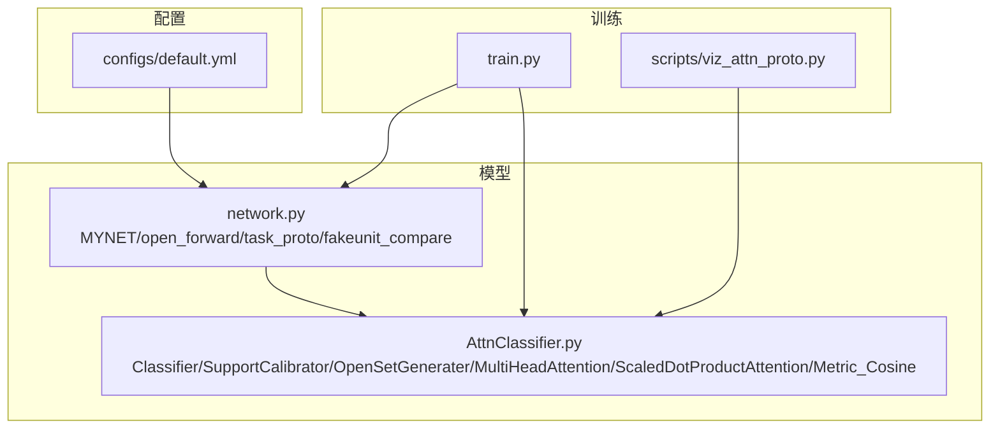
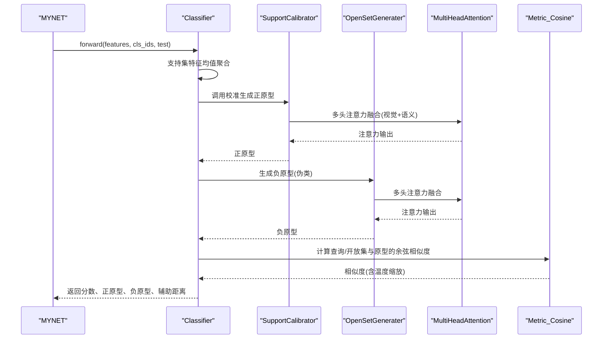
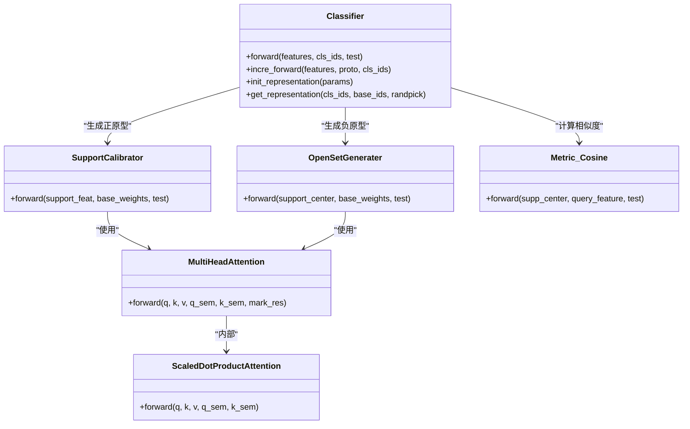
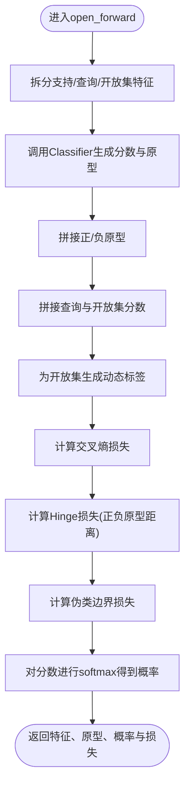
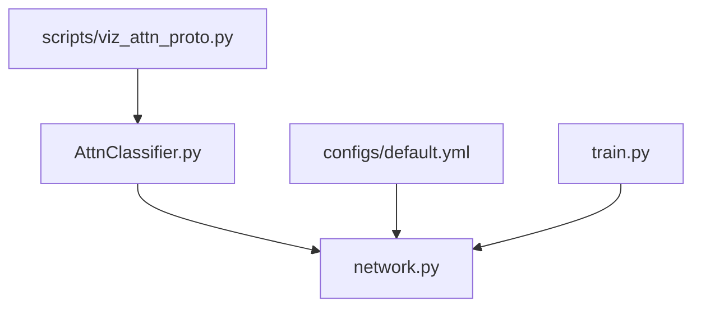

# 注意力分类器

<cite>
**本文档引用的文件**
- [AttnClassifier.py](file://models/AttnClassifier.py)
- [network.py](file://network.py)
- [default.yml](file://configs/default.yml)
- [train.py](file://train.py)
- [viz_attn_proto.py](file://scripts/viz_attn_proto.py)
</cite>

## 目录
1. [简介](#简介)
2. [项目结构](#项目结构)
3. [核心组件](#核心组件)
4. [架构总览](#架构总览)
5. [详细组件分析](#详细组件分析)
6. [依赖关系分析](#依赖关系分析)
7. [性能考量](#性能考量)
8. [故障排查指南](#故障排查指南)
9. [结论](#结论)
10. [附录](#附录)

## 简介
本文件面向“注意力分类器”的API与实现细节，系统化梳理Classifier类的原型生成、注意力融合与分类决策流程，并明确其输入格式、原型构建机制、注意力策略、分类决策与损失函数设计，以及参数配置、训练策略与性能评估方法。该分类器基于支持集特征与基础语义信息，通过多头注意力融合视觉与语义特征，生成正原型与负原型（伪类），并以余弦相似度与温度缩放进行分类决策，结合交叉熵与Hinge损失实现开放集学习。

## 项目结构
注意力分类器位于模型目录下，配合主干网络MYNET在openmeta模式下完成端到端的元学习与开放集推理。配置文件提供超参，训练脚本提供训练策略与优化器调度。

**图表来源**
- [AttnClassifier.py:38-101](file://models/AttnClassifier.py#L38-L101)
- [network.py:18-34](file://network.py#L18-L34)
- [default.yml:1-88](file://configs/default.yml#L1-L88)
- [train.py:17-19](file://train.py#L17-L19)
- [viz_attn_proto.py:73-90](file://scripts/viz_attn_proto.py#L73-L90)

**章节来源**
- [AttnClassifier.py:38-101](file://models/AttnClassifier.py#L38-L101)
- [network.py:18-34](file://network.py#L18-L34)
- [default.yml:1-88](file://configs/default.yml#L1-L88)
- [train.py:17-19](file://train.py#L17-L19)
- [viz_attn_proto.py:73-90](file://scripts/viz_attn_proto.py#L73-L90)

## 核心组件
- Classifier：主分类器，负责支持集特征的均值聚合、噪声注入、正原型校准、负原型生成、原型拼接与分类打分。
- SupportCalibrator：支持集原型校准模块，融合视觉与语义特征，生成正原型。
- OpenSetGenerater：开放集负原型生成模块，基于注意力融合生成伪类原型。
- MultiHeadAttention：多头注意力模块，支持跨模态语义融合与自注意力。
- ScaledDotProductAttention：缩放点积注意力，计算注意力权重与加权聚合。
- Metric_Cosine：余弦相似度度量，支持温度缩放与训练/测试不同的维度排列。

**章节来源**
- [AttnClassifier.py:38-101](file://models/AttnClassifier.py#L38-L101)
- [AttnClassifier.py:121-185](file://models/AttnClassifier.py#L121-L185)
- [AttnClassifier.py:188-271](file://models/AttnClassifier.py#L188-L271)
- [AttnClassifier.py:274-326](file://models/AttnClassifier.py#L274-L326)
- [AttnClassifier.py:331-349](file://models/AttnClassifier.py#L331-L349)
- [AttnClassifier.py:352-368](file://models/AttnClassifier.py#L352-L368)

## 架构总览
注意力分类器在MYNET的open_forward中被调用，输入为支持集、查询集与开放集特征，输出为查询与开放集的余弦分数、正原型、负原型以及损失。Classifier内部通过SupportCalibrator与OpenSetGenerater分别生成正原型与负原型，随后由Metric_Cosine计算相似度并乘以温度参数，最后由MYNET进行分类决策与损失计算。

**图表来源**
- [network.py:102-151](file://network.py#L102-L151)
- [AttnClassifier.py:47-93](file://models/AttnClassifier.py#L47-L93)
- [AttnClassifier.py:140-185](file://models/AttnClassifier.py#L140-L185)
- [AttnClassifier.py:212-271](file://models/AttnClassifier.py#L212-L271)
- [AttnClassifier.py:352-368](file://models/AttnClassifier.py#L352-L368)

## 详细组件分析

### Classifier类
- 输入格式
  - features：三元组，包含支持集特征、查询集特征、开放集特征。支持集特征形状通常为[B, n_way, n_shot, D]，经均值聚合后为[B, n_way, D]；查询与开放集为[B, n_query, D]或[B, n_open, D]。
  - cls_ids：二元组，包含支持集类别索引与基础类别索引。
  - test：布尔标志，控制训练/测试分支的维度排列与噪声注入策略。
- 原型生成
  - 支持集特征按类别维度求均值，得到每个类别的原型。
  - 训练时对支持集原型添加噪声，以缓解中心损失导致的特征坍缩。
  - 使用SupportCalibrator进行语义与视觉融合，生成正原型。
  - 使用OpenSetGenerater基于正原型与基础权重生成负原型（伪类）。
- 注意力融合
  - SupportCalibrator与OpenSetGenerater均使用MultiHeadAttention进行跨模态融合（视觉+语义）。
  - 支持多种融合类型：semang（语义+视觉）、attg（仅注意力）、att（自注意力）等。
- 分类决策
  - 使用Metric_Cosine计算查询/开放集与原型的余弦相似度，并乘以温度参数。
  - 测试时维度排列与训练不同，以适配不同批处理结构。
- 输出
  - 返回查询与开放集的分数、正原型、负原型以及辅助的距离信息。

**图表来源**
- [AttnClassifier.py:38-118](file://models/AttnClassifier.py#L38-L118)
- [AttnClassifier.py:121-185](file://models/AttnClassifier.py#L121-L185)
- [AttnClassifier.py:188-271](file://models/AttnClassifier.py#L188-L271)
- [AttnClassifier.py:274-349](file://models/AttnClassifier.py#L274-L349)
- [AttnClassifier.py:352-368](file://models/AttnClassifier.py#L352-L368)

**章节来源**
- [AttnClassifier.py:38-118](file://models/AttnClassifier.py#L38-L118)
- [AttnClassifier.py:121-185](file://models/AttnClassifier.py#L121-L185)
- [AttnClassifier.py:188-271](file://models/AttnClassifier.py#L188-L271)
- [AttnClassifier.py:274-349](file://models/AttnClassifier.py#L274-L349)
- [AttnClassifier.py:352-368](file://models/AttnClassifier.py#L352-L368)

### SupportCalibrator（支持集原型校准）
- 功能：将支持集特征与基础权重进行语义与视觉融合，生成正原型。
- 融合策略：
  - semang：同时融合视觉与语义，通过门控调整权重。
  - attg：仅使用注意力机制，基础权重扩展后参与融合。
  - att：使用支持集特征作为Q/K/V进行自注意力。
- 输出：正原型张量，形状为[B, n_way, D]。

**章节来源**
- [AttnClassifier.py:121-185](file://models/AttnClassifier.py#L121-L185)

### OpenSetGenerater（开放集负原型生成）
- 功能：基于正原型与基础权重生成负原型（伪类），并可选择聚合方式（平均或MLP）。
- 融合策略：与SupportCalibrator一致，支持semang、attg、att等。
- 输出：负原型与注意力输出，形状为[B, n_way, D]。

**章节来源**
- [AttnClassifier.py:188-271](file://models/AttnClassifier.py#L188-L271)

### MultiHeadAttention与ScaledDotProductAttention
- MultiHeadAttention：实现多头注意力，支持跨模态融合与残差连接。
- ScaledDotProductAttention：计算缩放点积注意力权重并加权聚合。

**章节来源**
- [AttnClassifier.py:274-326](file://models/AttnClassifier.py#L274-L326)
- [AttnClassifier.py:331-349](file://models/AttnClassifier.py#L331-L349)

### Metric_Cosine（余弦相似度度量）
- 功能：对原型与查询/开放集特征进行归一化，计算余弦相似度，并乘以可学习温度参数。
- 训练/测试差异：维度排列在训练与测试时不同，以适配批处理结构。

**章节来源**
- [AttnClassifier.py:352-368](file://models/AttnClassifier.py#L352-L368)

### MYNET中的集成与损失
- open_forward：整合支持/查询/开放集特征，调用Classifier生成分数与原型，拼接后进行分类决策。
- task_proto：根据查询与开放集分数与动态标签计算交叉熵损失；使用fakeunit_compare计算伪类边界损失；计算Hinge损失以拉开正负原型距离。
- task_pred：对查询与开放集分数进行softmax，输出概率分布。

**图表来源**
- [network.py:102-151](file://network.py#L102-L151)
- [network.py:153-202](file://network.py#L153-L202)
- [network.py:211-214](file://network.py#L211-L214)

**章节来源**
- [network.py:102-151](file://network.py#L102-L151)
- [network.py:153-202](file://network.py#L153-L202)
- [network.py:211-214](file://network.py#L211-L214)

## 依赖关系分析
- Classifier依赖SupportCalibrator与OpenSetGenerater，二者共同依赖MultiHeadAttention与ScaledDotProductAttention。
- MYNET在open_forward中调用Classifier，并在其任务函数中计算损失与概率输出。
- 配置文件default.yml提供训练超参，如温度、学习率、调度策略等。

**图表来源**
- [AttnClassifier.py:38-101](file://models/AttnClassifier.py#L38-L101)
- [network.py:18-34](file://network.py#L18-L34)
- [default.yml:1-88](file://configs/default.yml#L1-L88)
- [train.py:17-19](file://train.py#L17-L19)
- [viz_attn_proto.py:73-90](file://scripts/viz_attn_proto.py#L73-L90)

**章节来源**
- [AttnClassifier.py:38-101](file://models/AttnClassifier.py#L38-L101)
- [network.py:18-34](file://network.py#L18-L34)
- [default.yml:1-88](file://configs/default.yml#L1-L88)
- [train.py:17-19](file://train.py#L17-L19)
- [viz_attn_proto.py:73-90](file://scripts/viz_attn_proto.py#L73-L90)

## 性能考量
- 温度参数：Metric_Cosine中的温度参数可调节相似度分布的锐利程度，影响softmax输出的置信度。
- 注意力头数与投影维度：MultiHeadAttention的头数与d_k/d_v影响特征融合能力与计算开销。
- 聚合策略：OpenSetGenerater支持avg与mlp两种聚合，mlp可引入非线性增强表达能力。
- 噪声注入：训练时对支持集原型与生成器输入添加噪声，有助于缓解特征坍缩并提升边界学习。

[本节为通用指导，无需特定文件来源]

## 故障排查指南
- 余弦相似度异常
  - 检查特征是否归一化，确认Metric_Cosine的温度参数设置合理。
  - 确认训练/测试分支的维度排列一致。
- 负原型距离过近
  - 调整Hinge损失的margin阈值，确保正负原型被有效拉开。
  - 检查OpenSetGenerater的聚合策略与注意力融合类型。
- 语义融合无效
  - 确认SupportCalibrator与OpenSetGenerater的语义通道是否启用，以及门控权重是否合理。
- 可视化原型
  - 使用脚本可视化正/负原型热力图，检查原型分布与边界。

**章节来源**
- [AttnClassifier.py:352-368](file://models/AttnClassifier.py#L352-L368)
- [network.py:133-146](file://network.py#L133-L146)
- [viz_attn_proto.py:73-90](file://scripts/viz_attn_proto.py#L73-L90)

## 结论
注意力分类器通过多头注意力融合视觉与语义特征，实现了支持集正原型与开放集负原型的有效生成，并以余弦相似度与温度缩放进行分类决策。结合交叉熵与Hinge损失，系统在开放集场景下具备良好的边界学习与泛化能力。通过合理的参数配置与训练策略，可在不同数据集上取得稳定性能。

[本节为总结，无需特定文件来源]

## 附录

### 参数配置与训练策略
- 温度参数：在Metric_Cosine中定义，影响相似度分布。
- 融合类型：支持semang、attg、att等，可通过命令行参数指定。
- 聚合策略：OpenSetGenerater支持avg与mlp两种聚合方式。
- 优化器与调度：支持Step与Milestone两种调度策略，学习率与动量可配置。

**章节来源**
- [default.yml:42-46](file://configs/default.yml#L42-L46)
- [train.py:192-193](file://train.py#L192-L193)
- [network.py:586-608](file://network.py#L586-L608)

### 性能评估方法
- 查询与开放集概率输出：通过task_pred对分数进行softmax，得到各类别概率。
- 指标汇总：可参考基类Trainer的指标统计与输出逻辑，进行会话级准确率与综合指标计算。

**章节来源**
- [network.py:216-223](file://network.py#L216-L223)
- [base.py:192-233](file://models/base.py#L192-L233)