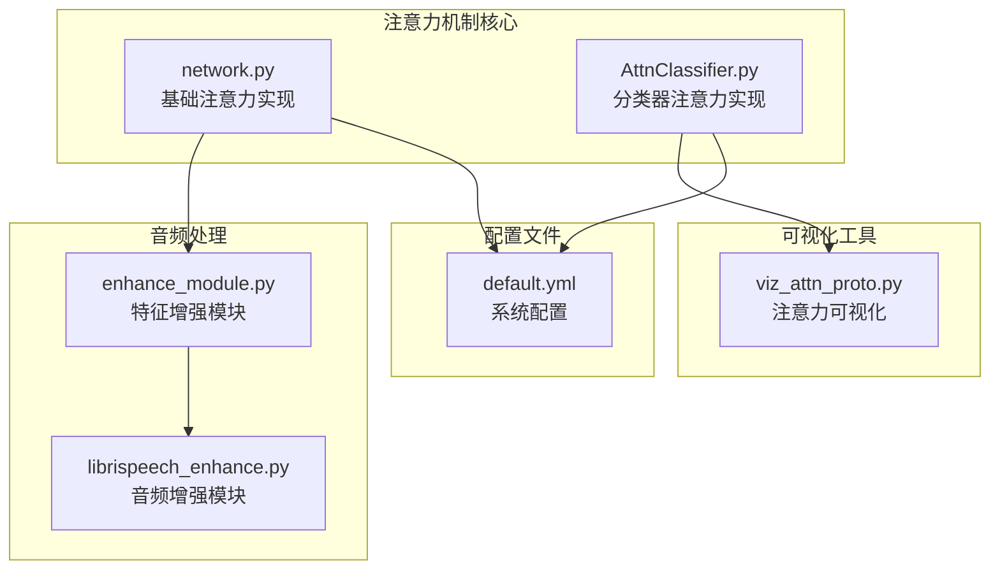
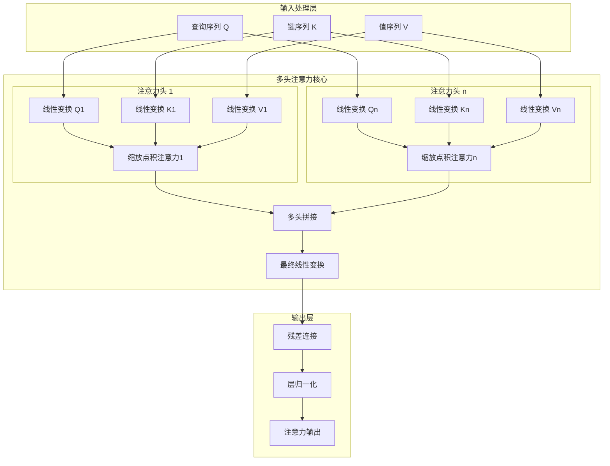
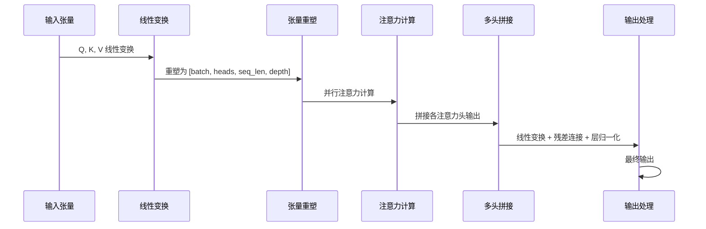
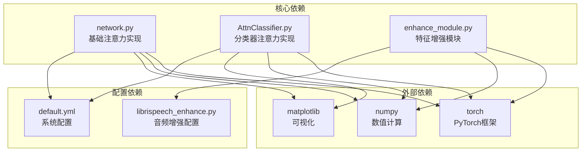

# 注意力机制模块

<cite>
**本文档引用的文件**
- [network.py](file://network.py)
- [AttnClassifier.py](file://models/AttnClassifier.py)
- [viz_attn_proto.py](file://scripts/viz_attn_proto.py)
- [enhance_module.py](file://enhance_module.py)
- [default.yml](file://configs/default.yml)
- [librispeech_enhance.py](file://librispeech_enhance.py)
</cite>

## 目录
1. [简介](#简介)
2. [项目结构](#项目结构)
3. [核心组件](#核心组件)
4. [架构概览](#架构概览)
5. [详细组件分析](#详细组件分析)
6. [依赖关系分析](#依赖关系分析)
7. [性能考虑](#性能考虑)
8. [故障排除指南](#故障排除指南)
9. [结论](#结论)

## 简介

本文件档详细记录了项目中的注意力机制模块，包括多头注意力和缩放点积注意力的完整实现。该模块在音频特征处理中发挥重要作用，支持自注意力和交叉注意力的使用场景，并提供了丰富的可视化和调试功能。

注意力机制模块主要包含以下核心功能：
- 多头注意力机制的完整实现
- 缩放点积注意力的数学原理和实现
- 音频特征处理中的注意力应用
- 注意力权重的可视化和调试工具
- 参数配置和性能优化策略

## 项目结构

注意力机制模块在项目中的组织结构如下：



**图表来源**
- [network.py:519-584](file://network.py#L519-L584)
- [AttnClassifier.py:274-350](file://models/AttnClassifier.py#L274-L350)

**章节来源**
- [network.py:18-50](file://network.py#L18-L50)
- [AttnClassifier.py:1-50](file://models/AttnClassifier.py#L1-L50)

## 核心组件

### MultiHeadAttention 类

MultiHeadAttention 是多头注意力机制的核心实现，支持并行的多个注意力头，每个头独立计算注意力权重。

#### 主要特性
- **多头并行处理**：支持 n_head 个独立的注意力头
- **线性变换**：对 Q、K、V 矩阵分别进行线性变换
- **温度缩放**：使用 d_k 的平方根作为温度参数
- **残差连接**：支持残差连接以改善梯度流动
- **层归一化**：提供层归一化以稳定训练

#### 关键参数
- `n_head`：注意力头的数量
- `d_model`：模型的隐藏维度
- `d_k`：每个注意力头的维度
- `d_v`：值向量的维度
- `dropout`：dropout 概率

**章节来源**
- [network.py:538-584](file://network.py#L538-L584)
- [AttnClassifier.py:274-326](file://models/AttnClassifier.py#L274-L326)

### ScaledDotProductAttention 类

ScaledDotProductAttention 实现了缩放点积注意力机制，这是注意力计算的核心组件。

#### 数学原理
注意力分数计算公式：
```
Attention(Q, K, V) = softmax((QK^T) / sqrt(d_k))V
```

其中：
- Q：查询矩阵
- K：键矩阵  
- V：值矩阵
- d_k：键向量的维度

#### 关键特性
- **温度缩放**：除以 sqrt(d_k) 防止点积过大
- **softmax 归一化**：确保注意力权重和为1
- **dropout 正则化**：防止过拟合
- **日志softmax**：提供数值稳定性

**章节来源**
- [network.py:519-535](file://network.py#L519-L535)
- [AttnClassifier.py:331-349](file://models/AttnClassifier.py#L331-L349)

## 架构概览

注意力机制模块的整体架构设计如下：



**图表来源**
- [network.py:561-584](file://network.py#L561-L584)
- [AttnClassifier.py:299-326](file://models/AttnClassifier.py#L299-L326)

## 详细组件分析

### MultiHeadAttention 类详细分析

#### 参数初始化过程

MultiHeadAttention 的初始化包含以下关键步骤：

1. **线性变换层初始化**
   - 查询投影：`w_qs = Linear(d_model, n_head * d_k)`
   - 键投影：`w_ks = Linear(d_model, n_head * d_k)`  
   - 值投影：`w_vs = Linear(d_model, n_head * d_v)`

2. **权重初始化策略**
   - 查询、键、值权重使用正态分布初始化
   - 权重标准差：`std = sqrt(2.0 / (d_model + d_k))` 或 `sqrt(2.0 / (d_model + d_v))`

3. **注意力模块构建**
   - 创建缩放点积注意力模块
   - 温度参数：`temperature = sqrt(d_k)`

#### 前向传播流程



**图表来源**
- [network.py:561-584](file://network.py#L561-L584)

#### 注意力权重计算过程

注意力权重的计算包含以下步骤：

1. **线性变换**
   ```
   Q' = Q × W^Q
   K' = K × W^K  
   V' = V × W^V
   ```

2. **张量重塑**
   ```
   Q'' = reshape(Q', [batch, heads, seq_len, depth])
   K'' = reshape(K', [batch, heads, seq_len, depth])
   V'' = reshape(V', [batch, heads, seq_len, depth])
   ```

3. **多头并行计算**
   ```
   for head in range(heads):
       Attn_head = Attention(Q''[head], K''[head], V''[head])
   ```

4. **多头输出拼接**
   ```
   Output = concat(Attn_1, Attn_2, ..., Attn_n)
   ```

**章节来源**
- [network.py:567-582](file://network.py#L567-L582)
- [AttnClassifier.py:306-324](file://models/AttnClassifier.py#L306-L324)

### ScaledDotProductAttention 类详细分析

#### 缩放点积注意力实现

缩放点积注意力的核心实现包含以下关键步骤：

1. **注意力分数计算**
   ```
   attn_score = Q × K^T
   ```

2. **温度缩放**
   ```
   attn_scaled = attn_score / sqrt(d_k)
   ```

3. **softmax 归一化**
   ```
   attn_weights = softmax(attn_scaled)
   ```

4. **dropout 应用**
   ```
   attn_dropout = dropout(attn_weights)
   ```

5. **加权求和**
   ```
   output = attn_dropout × V
   ```

#### 数学原理详解

注意力机制的数学基础：

**注意力分数计算**：
```
score(i,j) = Q_i · K_j
```

**归一化注意力权重**：
```
α_ij = exp(score(i,j)) / Σ_k exp(score(i,k))
```

**加权输出**：
```
Output_i = Σ_j α_ij V_j
```

**章节来源**
- [network.py:528-535](file://network.py#L528-L535)
- [AttnClassifier.py:340-349](file://models/AttnClassifier.py#L340-L349)

### 音频特征处理中的应用

#### 自注意力机制

在音频特征处理中，自注意力机制主要用于：

1. **时序特征建模**
   - 处理音频信号的时间依赖性
   - 捕捉语音的时序模式

2. **特征重要性评估**
   - 识别音频帧的重要程度
   - 自适应地关注关键信息

3. **跨时间步的信息融合**
   - 结合历史信息
   - 改善语音识别性能

#### 交叉注意力机制

交叉注意力在音频-文本对齐中发挥作用：

1. **音频-文本对齐**
   - 将音频特征与文本表示对齐
   - 支持语音翻译任务

2. **语义特征融合**
   - 融合音频的声学特征和语义特征
   - 改善多模态任务性能

**章节来源**
- [network.py:31-32](file://network.py#L31-L32)
- [AttnClassifier.py:121-185](file://models/AttnClassifier.py#L121-L185)

## 依赖关系分析

注意力机制模块与其他组件的依赖关系如下：



**图表来源**
- [network.py:1-17](file://network.py#L1-L17)
- [AttnClassifier.py:1-5](file://models/AttnClassifier.py#L1-L5)

**章节来源**
- [network.py:1-17](file://network.py#L1-L17)
- [AttnClassifier.py:1-5](file://models/AttnClassifier.py#L1-L5)

## 性能考虑

### 内存管理策略

1. **张量重塑优化**
   - 使用 `contiguous()` 确保张量内存连续
   - 避免不必要的张量复制

2. **批量处理优化**
   - 合理设置 batch size
   - 利用 GPU 内存并行处理

3. **梯度检查点**
   - 在内存受限时启用梯度检查点
   - 减少前向传播的内存占用

### 计算效率优化

1. **矩阵乘法优化**
   - 使用高效的 BLAS 库
   - 避免显式的循环操作

2. **注意力计算优化**
   - 使用 `bmm` 进行批量矩阵乘法
   - 合理利用广播机制

3. **内存访问模式**
   - 优化张量布局
   - 减少内存碎片

### 参数配置建议

基于配置文件的最佳实践：

1. **温度参数调整**
   ```yaml
   network:
     temperature: 1.0
   ```

2. **dropout 概率设置**
   - 训练时：0.1-0.3
   - 推理时：0.0

3. **注意力头数量**
   - 建议：8-16 头
   - 取决于 d_model 和计算资源

**章节来源**
- [default.yml:42-45](file://configs/default.yml#L42-L45)
- [network.py:554](file://network.py#L554)

## 故障排除指南

### 常见问题及解决方案

#### 注意力权重异常

**问题**：注意力权重出现 NaN 或 Inf

**原因分析**：
1. 温度参数设置不当
2. 梯度爆炸
3. 数值精度问题

**解决方案**：
```python
# 检查温度参数
temperature = np.power(d_k, 0.5)

# 添加梯度裁剪
torch.nn.utils.clip_grad_norm_(parameters, max_norm=1.0)

# 使用数值稳定的 softmax
attn = F.log_softmax(attn_scaled, dim=-1).exp()
```

#### 内存溢出问题

**问题**：GPU 内存不足导致训练中断

**解决方案**：
1. **减小 batch size**
2. **降低序列长度**
3. **减少注意力头数量**
4. **启用梯度检查点**

#### 收敛性问题

**问题**：注意力机制训练不稳定

**解决方案**：
1. **调整学习率**
2. **使用梯度归一化**
3. **添加权重衰减**
4. **使用学习率调度**

### 调试技巧

#### 注意力权重可视化

使用提供的可视化工具检查注意力权重：

```python
# 运行注意力可视化
python scripts/viz_attn_proto.py \
    --config configs/default.yml \
    --ckpt save/model_checkpoint.pth \
    --session 1 \
    --out_dir save/figures
```

#### 日志监控

```python
# 添加注意力权重统计
def log_attention_stats(attn_weights):
    stats = {
        'mean': attn_weights.mean().item(),
        'std': attn_weights.std().item(),
        'min': attn_weights.min().item(),
        'max': attn_weights.max().item()
    }
    return stats
```

#### 梯度检查

```python
# 检查梯度范数
def check_gradients(model):
    total_norm = 0
    for p in model.parameters():
        if p.grad is not None:
            param_norm = p.grad.data.norm(2)
            total_norm += param_norm.item() ** 2
    total_norm = total_norm ** (1.0 / 2)
    return total_norm
```

**章节来源**
- [viz_attn_proto.py:92-119](file://scripts/viz_attn_proto.py#L92-L119)

## 结论

注意力机制模块在本项目中实现了完整的多头注意力和缩放点积注意力功能，具有以下特点：

1. **理论完备性**：严格遵循注意力机制的数学原理
2. **实现完整性**：包含所有必要的组件和功能
3. **应用广泛性**：支持音频特征处理的多种场景
4. **工具完善性**：提供可视化和调试工具
5. **性能优化性**：包含内存管理和计算优化策略

该模块为音频特征处理提供了强大的注意力机制支持，能够有效捕捉音频信号的时序依赖性和跨时间步的信息融合能力。通过合理的参数配置和优化策略，可以在保证性能的同时获得稳定的训练效果。