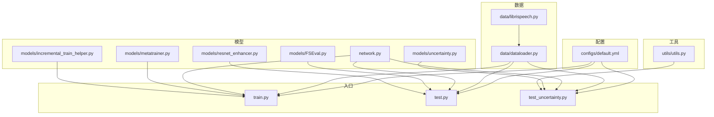
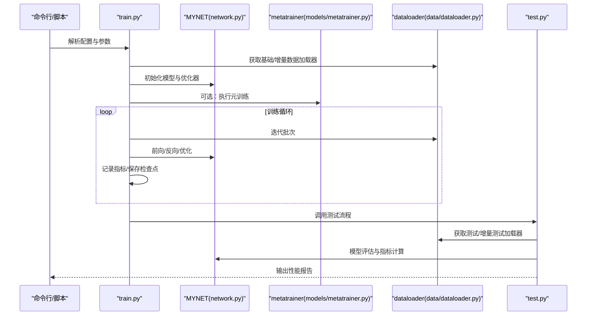
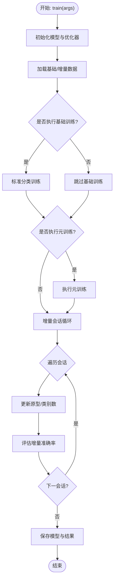
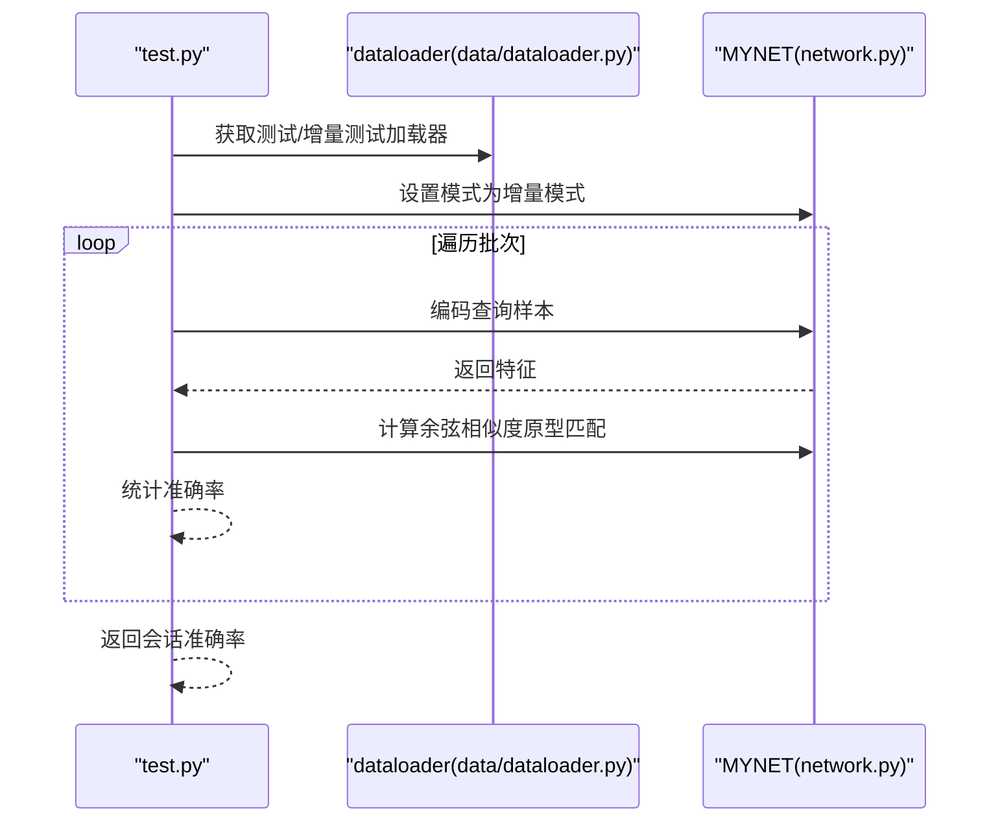
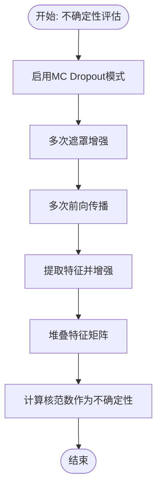
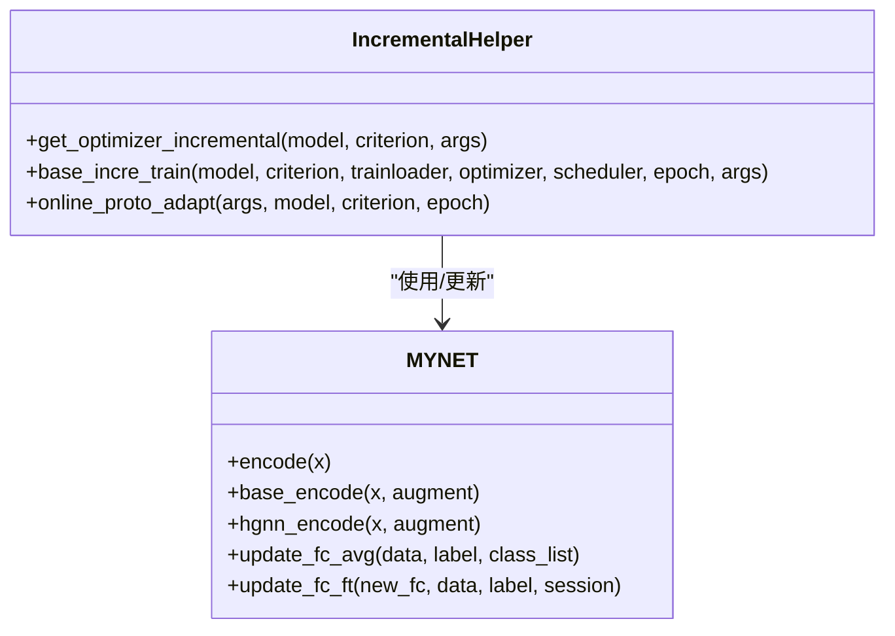
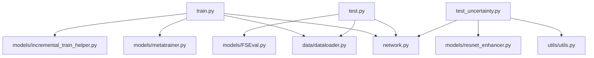

# 训练测试API

<cite>
**本文档引用的文件**
- [train.py](file://train.py)
- [test.py](file://test.py)
- [test_uncertainty.py](file://test_uncertainty.py)
- [configs/default.yml](file://configs/default.yml)
- [models/metatrainer.py](file://models/metatrainer.py)
- [models/incremental_train_helper.py](file://models/incremental_train_helper.py)
- [models/uncertainty.py](file://models/uncertainty.py)
- [network.py](file://network.py)
- [data/dataloader.py](file://data/dataloader.py)
- [utils/utils.py](file://utils/utils.py)
- [models/FSEval.py](file://models/FSEval.py)
- [models/resnet_enhancer.py](file://models/resnet_enhancer.py)
</cite>

## 目录
1. [简介](#简介)
2. [项目结构](#项目结构)
3. [核心组件](#核心组件)
4. [架构总览](#架构总览)
5. [详细组件分析](#详细组件分析)
6. [依赖分析](#依赖分析)
7. [性能考虑](#性能考虑)
8. [故障排除指南](#故障排除指南)
9. [结论](#结论)
10. [附录](#附录)

## 简介
本文件面向训练与测试流程的API参考，覆盖以下主题：
- 训练入口函数接口规范：参数配置、训练循环控制、进度监控
- 测试函数API：模型评估、性能指标计算、结果保存
- 增量学习训练的特殊接口：会话切换、模型更新、性能跟踪
- 不确定性测试API：置信度计算、阈值调整、预测稳定性评估
- 训练配置参数、优化器设置与学习率调度接口
- 训练过程中的日志记录、模型检查点与中断恢复接口
- 测试阶段的混淆矩阵、ROC曲线与性能报告生成接口

## 项目结构
该项目采用分层组织方式，核心目录与职责如下：
- configs：训练配置文件（YAML）
- data：数据加载与采样器
- models：模型定义、元训练、增量训练辅助、不确定性评估等
- utils：通用工具函数（含不确定度计算）
- scripts：实验分析与可视化脚本
- save/save_result：模型与结果存储路径

**图表来源**
- [configs/default.yml:1-88](file://configs/default.yml#L1-L88)
- [data/dataloader.py:1-200](file://data/dataloader.py#L1-L200)
- [data/librispeech.py:1-200](file://data/librispeech.py#L1-L200)
- [network.py:1-724](file://network.py#L1-L724)
- [models/metatrainer.py:1-201](file://models/metatrainer.py#L1-L201)
- [models/incremental_train_helper.py:1-156](file://models/incremental_train_helper.py#L1-L156)
- [models/uncertainty.py:1-55](file://models/uncertainty.py#L1-L55)
- [models/FSEval.py:1-125](file://models/FSEval.py#L1-L125)
- [models/resnet_enhancer.py:1-172](file://models/resnet_enhancer.py#L1-L172)
- [utils/utils.py:1-200](file://utils/utils.py#L1-L200)
- [train.py:1-1296](file://train.py#L1-L1296)
- [test.py:1-1314](file://test.py#L1-L1314)
- [test_uncertainty.py:1-893](file://test_uncertainty.py#L1-L893)

**章节来源**
- [configs/default.yml:1-88](file://configs/default.yml#L1-L88)
- [data/dataloader.py:1-200](file://data/dataloader.py#L1-L200)
- [network.py:1-724](file://network.py#L1-L724)

## 核心组件
- 训练入口与主循环：负责基础会话训练、增量会话训练、元训练集成与评估
- 测试入口与评估：负责增量测试、已知类测试、未知类聚类与指标汇总
- 不确定性评估：提供MC Dropout与特征掩码的不确定性计算，支持课程难度排序与困难样本加权
- 数据加载与采样：支持基础会话、增量会话、测试与开放集评估的数据流
- 模型与分类器：包含特征编码器、原型分类器、注意力模块与温度缩放

**章节来源**
- [train.py:780-1296](file://train.py#L780-L1296)
- [test.py:280-1314](file://test.py#L280-L1314)
- [test_uncertainty.py:280-893](file://test_uncertainty.py#L280-L893)
- [models/metatrainer.py:17-201](file://models/metatrainer.py#L17-L201)
- [models/incremental_train_helper.py:11-156](file://models/incremental_train_helper.py#L11-L156)
- [models/uncertainty.py:1-55](file://models/uncertainty.py#L1-L55)
- [data/dataloader.py:1-200](file://data/dataloader.py#L1-L200)
- [network.py:18-724](file://network.py#L18-L724)

## 架构总览
训练与测试流程围绕MYNET模型展开，结合数据加载器、元训练器与增量训练辅助模块，形成完整的FSCIL（ Few-Shot Class-Incremental Learning）闭环。

**图表来源**
- [train.py:780-1296](file://train.py#L780-L1296)
- [models/metatrainer.py:17-201](file://models/metatrainer.py#L17-L201)
- [data/dataloader.py:1-200](file://data/dataloader.py#L1-L200)
- [network.py:18-724](file://network.py#L18-L724)
- [test.py:280-1314](file://test.py#L280-L1314)

## 详细组件分析

### 训练入口API（train.py）
- 入口函数：train(args: dict)
  - 功能：完成基础会话训练、可选的元训练、增量会话训练与评估
  - 参数：
    - args：包含训练配置（如way、shot、num_session、num_base、num_novel、epochs、lr、scheduler、optimizer等）
  - 控制流：
    - 基础会话训练：构建MYNET，设置数据加载器，执行标准分类训练
    - 可选元训练：加载预训练参数，初始化分类头，执行元训练并保存最佳模型
    - 增量会话训练：逐会话加载新类数据，更新原型，评估增量准确率
  - 进度监控：使用Averager记录损失与准确率，tqdm显示迭代进度
  - 检查点与恢复：保存最佳模型与定期模型，支持从检查点继续训练

**图表来源**
- [train.py:780-1296](file://train.py#L780-L1296)
- [models/metatrainer.py:17-201](file://models/metatrainer.py#L17-L201)
- [models/incremental_train_helper.py:28-156](file://models/incremental_train_helper.py#L28-L156)
- [data/dataloader.py:1-200](file://data/dataloader.py#L1-L200)

**章节来源**
- [train.py:780-1296](file://train.py#L780-L1296)
- [models/metatrainer.py:17-201](file://models/metatrainer.py#L17-L201)
- [models/incremental_train_helper.py:28-156](file://models/incremental_train_helper.py#L28-L156)
- [data/dataloader.py:1-200](file://data/dataloader.py#L1-L200)

### 测试函数API（test.py）
- 测试函数：test(args, model, testloader, session)
  - 功能：在给定会话下对已遇到类别进行增量测试
  - 参数：
    - args：训练配置
    - model：MYNET实例
    - testloader：测试数据加载器
    - session：当前会话编号
  - 行为：设置模型模式为增量模式，计算余弦相似度得分，统计准确率
- 已知类测试：known_test(model, data, label)
  - 功能：对已知类样本进行评估，返回准确率与宏平均F1
- 聚类与原型更新：debug_cluster(args, model, data, labels, session)
  - 功能：对未知类样本进行聚类，计算聚类准确率，更新模型原型权重

**图表来源**
- [test.py:740-780](file://test.py#L740-L780)
- [data/dataloader.py:57-106](file://data/dataloader.py#L57-L106)
- [network.py:471-518](file://network.py#L471-L518)

**章节来源**
- [test.py:740-780](file://test.py#L740-L780)
- [data/dataloader.py:57-106](file://data/dataloader.py#L57-L106)
- [network.py:471-518](file://network.py#L471-L518)

### 不确定性测试API（test_uncertainty.py）
- 不确定性计算：calculate_uncertainty_unlabeled(model, enhancer, sample, n_aug, n_forward)
  - 功能：基于MC Dropout与特征掩码计算样本不确定性（核范数）
  - 参数：
    - model：MYNET实例
    - enhancer：特征增强模块（如LocalFeatureCluster）
    - sample：单一样本
    - n_aug/n_forward：遮罩与前向次数
- 课程难度评估：
  - get_class_difficulty(args, model, full_loader)：基于类级不确定度排序
  - get_initial_difficulty(args, model, full_loader)：零样本难度排序（特征紧凑度）
- 基础训练（困难感知）：base_train(args, model)
  - 功能：快速课程阶段 + 困难样本加权全量训练，保存模型

**图表来源**
- [test_uncertainty.py:48-85](file://test_uncertainty.py#L48-L85)
- [models/uncertainty.py:5-55](file://models/uncertainty.py#L5-L55)
- [models/resnet_enhancer.py:51-172](file://models/resnet_enhancer.py#L51-L172)

**章节来源**
- [test_uncertainty.py:48-85](file://test_uncertainty.py#L48-L85)
- [models/uncertainty.py:5-55](file://models/uncertainty.py#L5-L55)
- [models/resnet_enhancer.py:51-172](file://models/resnet_enhancer.py#L51-L172)

### 增量学习训练特殊接口
- 优化器与调度器：get_optimizer_incremental(model, criterion, args)
  - 功能：为增量训练设置不同模块的学习率与权重衰减
- 基础增量训练：base_incre_train(model, criterion, trainloader, optimizer, scheduler, epoch, args)
  - 功能：支持基础类与新类的联合训练，原型与PQA模块的使用
- 在线原型自适应：online_proto_adapt(args, model, criterion, epoch)
  - 功能：基于距离度量更新分类头权重，提升增量稳定性

**图表来源**
- [models/incremental_train_helper.py:11-156](file://models/incremental_train_helper.py#L11-L156)
- [network.py:405-461](file://network.py#L405-L461)

**章节来源**
- [models/incremental_train_helper.py:11-156](file://models/incremental_train_helper.py#L11-L156)
- [network.py:405-461](file://network.py#L405-L461)

### 训练配置参数、优化器与学习率调度
- 配置文件：configs/default.yml
  - 训练参数：way、shot、num_session、num_base、num_novel、start_session、test_times
  - 训练轮次：epochs_std、epochs_meta、epochs_stdu_base、epochs_new
  - 学习率：lr_std、lr_stdu_base、lrg、lr_new、lr_decay_rate、lr_decay_epochs
  - 调度策略：schedule（Step/Milestone）、milestones、step、gamma
  - 优化器：decay、momentum
  - 网络：temperature、base_mode、new_mode
  - 数据加载：num_workers、train_batch_size、test_batch_size
- 优化器设置：get_optimizer_standard(model, args, criterion)、get_optimizer(model, args)
  - 功能：根据配置选择Step或MultiStep调度器，设置动量与权重衰减

**章节来源**
- [configs/default.yml:1-88](file://configs/default.yml#L1-L88)
- [network.py:586-608](file://network.py#L586-L608)

### 日志记录、模型检查点与中断恢复
- 日志与指标：Averager类用于滑动平均损失与准确率
- 检查点保存：保存最佳模型与定期模型（epoch级）
- 中断恢复：支持从指定epoch继续训练（需在调用处配置）

**章节来源**
- [utils/utils.py:190-200](file://utils/utils.py#L190-L200)
- [models/metatrainer.py:180-191](file://models/metatrainer.py#L180-L191)
- [network.py:610-638](file://network.py#L610-L638)

### 测试阶段混淆矩阵、ROC曲线与性能报告
- ROC/AUC：FSEval.run_test_fsl计算AUROC与置信区间
- 性能报告：test_uncertainty.py中对各会话的准确率、F1、增量准确率与平均准确率进行统计与输出

**章节来源**
- [models/FSEval.py:17-125](file://models/FSEval.py#L17-L125)
- [test_uncertainty.py:307-473](file://test_uncertainty.py#L307-L473)

## 依赖分析
- 训练入口依赖：
  - 数据加载：dataloader.py
  - 模型：network.py
  - 元训练：models/metatrainer.py
  - 增量训练辅助：models/incremental_train_helper.py
- 测试入口依赖：
  - 数据加载：dataloader.py
  - 模型：network.py
  - 开放集评估：models/FSEval.py
- 不确定性评估依赖：
  - 模型：network.py（get_uncertainty）
  - 工具：utils/utils.py（MC Dropout相关）
  - 增强模块：models/resnet_enhancer.py

**图表来源**
- [train.py:1-1296](file://train.py#L1-L1296)
- [test.py:1-1314](file://test.py#L1-L1314)
- [test_uncertainty.py:1-893](file://test_uncertainty.py#L1-L893)
- [data/dataloader.py:1-200](file://data/dataloader.py#L1-L200)
- [network.py:1-724](file://network.py#L1-L724)
- [models/metatrainer.py:1-201](file://models/metatrainer.py#L1-L201)
- [models/incremental_train_helper.py:1-156](file://models/incremental_train_helper.py#L1-L156)
- [models/FSEval.py:1-125](file://models/FSEval.py#L1-L125)
- [utils/utils.py:1-200](file://utils/utils.py#L1-L200)
- [models/resnet_enhancer.py:1-172](file://models/resnet_enhancer.py#L1-L172)

**章节来源**
- [train.py:1-1296](file://train.py#L1-L1296)
- [test.py:1-1314](file://test.py#L1-L1314)
- [test_uncertainty.py:1-893](file://test_uncertainty.py#L1-L893)
- [data/dataloader.py:1-200](file://data/dataloader.py#L1-L200)
- [network.py:1-724](file://network.py#L1-L724)
- [models/metatrainer.py:1-201](file://models/metatrainer.py#L1-L201)
- [models/incremental_train_helper.py:1-156](file://models/incremental_train_helper.py#L1-L156)
- [models/FSEval.py:1-125](file://models/FSEval.py#L1-L125)
- [utils/utils.py:1-200](file://utils/utils.py#L1-L200)
- [models/resnet_enhancer.py:1-172](file://models/resnet_enhancer.py#L1-L172)

## 性能考虑
- 训练效率：
  - 使用tqdm与Averager降低I/O开销，提高迭代速度
  - 采用Step/MultiStep学习率调度，平衡收敛速度与稳定性
- 增量学习稳定性：
  - 在线原型自适应与动量更新，缓解灾难性遗忘
  - 增强模块（LocalFeatureCluster）提升特征判别能力
- 不确定性评估：
  - 通过MC Dropout与特征掩码计算不确定性，指导课程排序与困难样本加权

## 故障排除指南
- 随机性与可重复性：
  - set_seed与check_randomness可用于验证随机种子设置
- 设备一致性：
  - LocalFeatureCluster与增强模块在forward中自动同步设备，避免设备不一致导致的错误
- 模型模式切换：
  - get_uncertainty内部临时切换模式，结束后恢复原始模式，防止后续训练异常

**章节来源**
- [train.py:114-141](file://train.py#L114-L141)
- [test.py:233-257](file://test.py#L233-L257)
- [test_uncertainty.py:87-111](file://test_uncertainty.py#L87-L111)
- [utils/utils.py:118-131](file://utils/utils.py#L118-L131)
- [models/resnet_enhancer.py:168-172](file://models/resnet_enhancer.py#L168-L172)

## 结论
本文档系统梳理了训练与测试流程的API，明确了参数配置、训练循环控制、进度监控、增量学习接口、不确定性评估以及测试阶段的指标与报告生成。通过配置文件与模块化设计，项目实现了灵活的FSCIL训练与评估框架，便于扩展与维护。

## 附录
- 关键函数与文件映射：
  - 训练入口：train.py::train(args)
  - 测试入口：test.py::test(args, model, testloader, session)、known_test(model, data, label)
  - 不确定性评估：test_uncertainty.py::calculate_uncertainty_unlabeled(...)、get_class_difficulty(...)、get_initial_difficulty(...)
  - 增量训练：models/incremental_train_helper.py::get_optimizer_incremental(...)、base_incre_train(...)、online_proto_adapt(...)
  - 配置：configs/default.yml
  - 数据加载：data/dataloader.py
  - 模型：network.py
  - 开放集评估：models/FSEval.py
  - 增强模块：models/resnet_enhancer.py
  - 工具：utils/utils.py