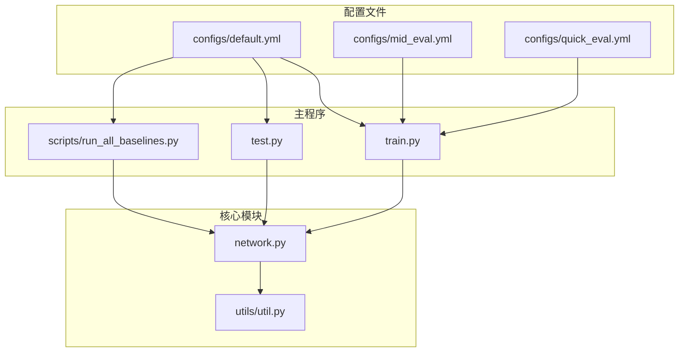
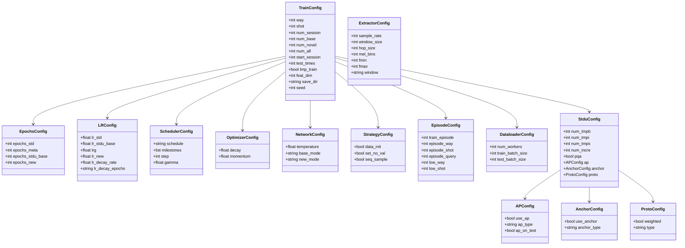
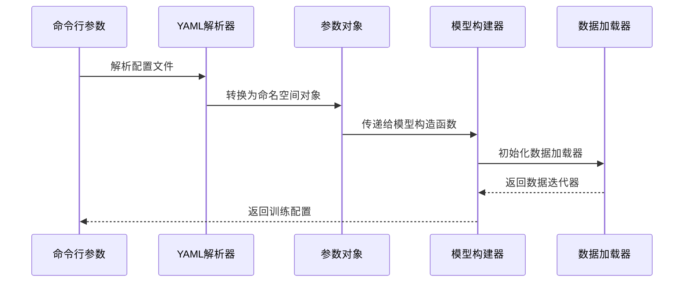
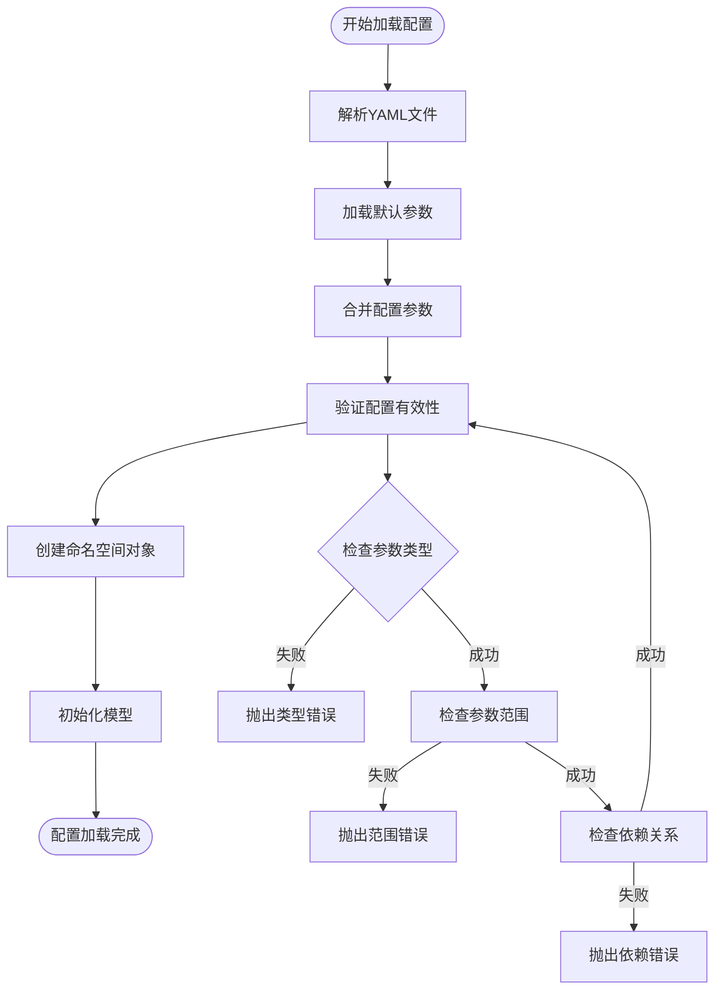
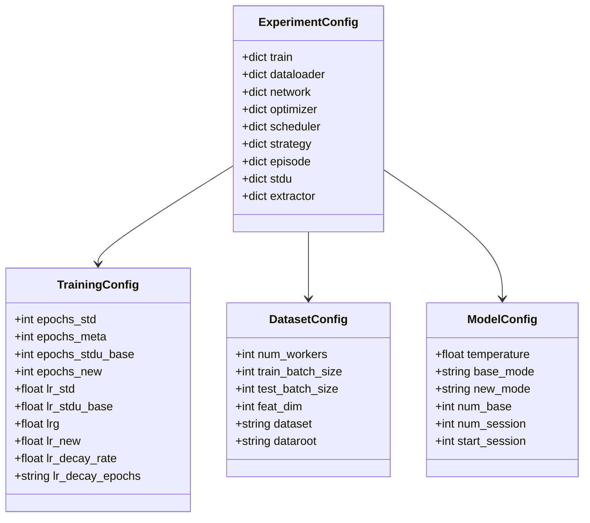
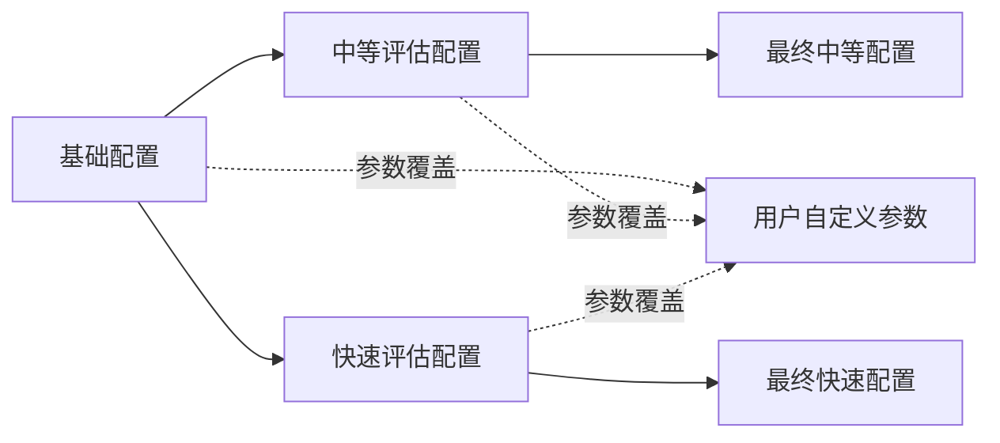
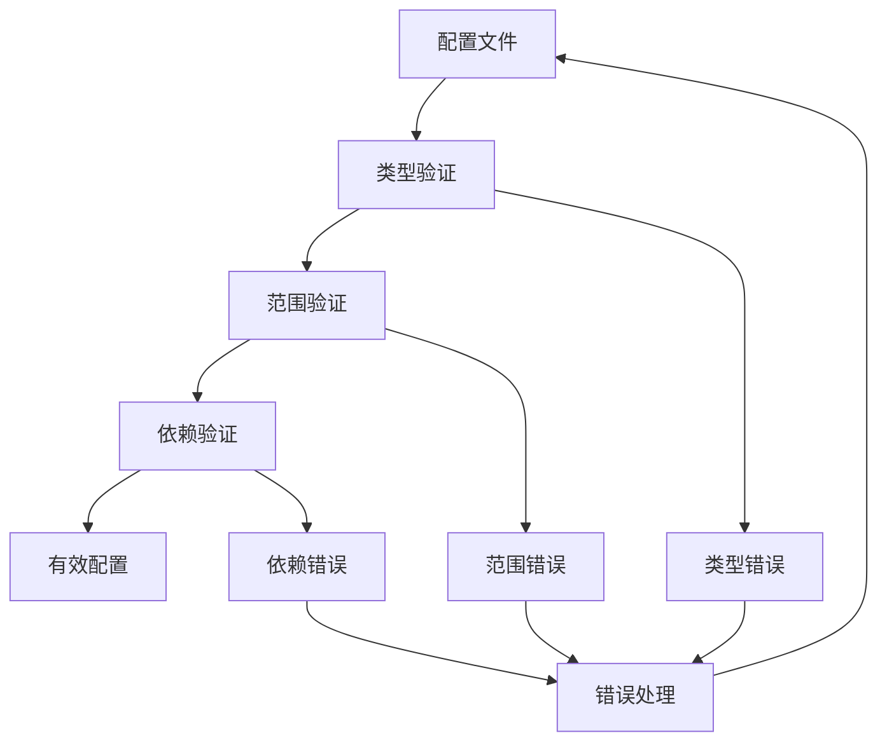
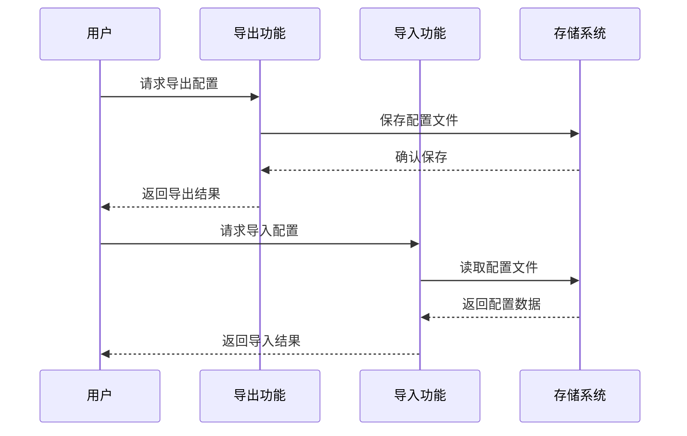
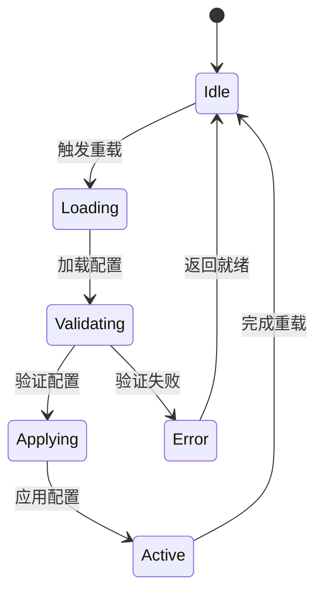
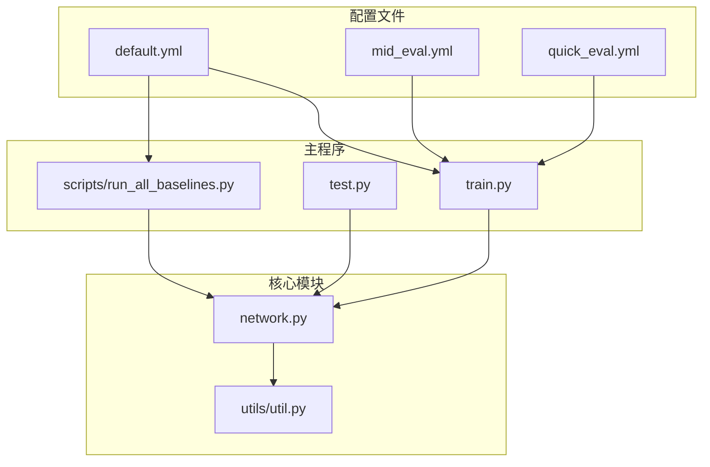

# 配置管理API

<cite>
**本文档引用的文件**
- [default.yml](file://configs/default.yml)
- [mid_eval.yml](file://configs/mid_eval.yml)
- [quick_eval.yml](file://configs/quick_eval.yml)
- [train.py](file://train.py)
- [test.py](file://test.py)
- [run_all_baselines.py](file://scripts/run_all_baselines.py)
- [network.py](file://network.py)
- [util.py](file://utils/util.py)
</cite>

## 目录
1. [简介](#简介)
2. [项目结构](#项目结构)
3. [核心组件](#核心组件)
4. [架构概览](#架构概览)
5. [详细组件分析](#详细组件分析)
6. [依赖分析](#依赖分析)
7. [性能考虑](#性能考虑)
8. [故障排除指南](#故障排除指南)
9. [结论](#结论)

## 简介

本文件档详细记录了配置管理系统的API规范，涵盖配置文件结构、参数规范、加载验证机制以及实验配置接口。系统采用YAML配置文件与命令行参数相结合的方式，支持训练参数、数据集设置和模型架构配置的统一管理。

## 项目结构

配置管理系统主要由以下部分组成：

**图表来源**
- [default.yml:1-88](file://configs/default.yml#L1-L88)
- [train.py:173-210](file://train.py#L173-L210)
- [network.py:18-35](file://network.py#L18-L35)

## 核心组件

### 配置文件结构

系统提供三种预定义配置文件，每种都包含完整的训练参数设置：

#### 基础配置 (default.yml)
- **训练参数**: 包含标准训练、元训练、增量训练等各阶段的超参数
- **学习率设置**: 支持多种调度策略（Step、Milestone）
- **优化器配置**: SGD优化器参数设置
- **网络架构**: 温度参数、分类模式选择
- **数据加载**: 工作进程数、批大小设置

#### 中等评估配置 (mid_eval.yml)
- **测试规模**: 减少测试轮次，适合中期评估
- **训练强度**: 保持与基础配置相同的参数设置
- **资源控制**: 降低计算开销

#### 快速评估配置 (quick_eval.yml)
- **最小化设置**: 最少的训练轮次和测试次数
- **实验效率**: 适合快速原型验证
- **参数完整性**: 保留所有必需的配置项

### 参数规范

配置参数按功能域组织：

**图表来源**
- [default.yml:1-88](file://configs/default.yml#L1-L88)

**章节来源**
- [default.yml:1-88](file://configs/default.yml#L1-L88)
- [mid_eval.yml:1-88](file://configs/mid_eval.yml#L1-L88)
- [quick_eval.yml:1-88](file://configs/quick_eval.yml#L1-L88)

## 架构概览

配置管理系统采用分层架构设计：

**图表来源**
- [train.py:173-210](file://train.py#L173-L210)
- [run_all_baselines.py:56-75](file://scripts/run_all_baselines.py#L56-L75)

## 详细组件分析

### 配置加载API

#### 基础配置加载流程

**图表来源**
- [run_all_baselines.py:56-75](file://scripts/run_all_baselines.py#L56-L75)
- [train.py:173-210](file://train.py#L173-L210)

#### 参数验证机制

系统实现了多层次的参数验证：

1. **类型检查**: 确保参数类型符合预期
2. **范围检查**: 验证数值参数的有效范围
3. **依赖检查**: 确保相关参数之间的逻辑一致性

**章节来源**
- [run_all_baselines.py:56-75](file://scripts/run_all_baselines.py#L56-L75)
- [train.py:173-210](file://train.py#L173-L210)

### 实验配置接口

#### 超参数搜索支持

系统提供了灵活的超参数配置接口：

**图表来源**
- [default.yml:1-88](file://configs/default.yml#L1-L88)

#### 随机种子设置

系统实现了完整的随机性控制机制：

**章节来源**
- [train.py:114-134](file://train.py#L114-L134)
- [test.py:233-250](file://test.py#L233-L250)

### 配置继承和覆盖机制

#### 基础配置扩展

**图表来源**
- [default.yml:1-88](file://configs/default.yml#L1-L88)
- [mid_eval.yml:1-88](file://configs/mid_eval.yml#L1-L88)
- [quick_eval.yml:1-88](file://configs/quick_eval.yml#L1-L88)

#### 参数覆盖策略

1. **层级覆盖**: 用户配置优先级最高
2. **条件继承**: 基于实验需求的智能继承
3. **默认回退**: 缺失参数使用系统默认值

**章节来源**
- [default.yml:1-88](file://configs/default.yml#L1-L88)
- [mid_eval.yml:1-88](file://configs/mid_eval.yml#L1-L88)
- [quick_eval.yml:1-88](file://configs/quick_eval.yml#L1-L88)

### 配置验证和错误处理

#### 验证规则

系统实现了严格的配置验证规则：

**图表来源**
- [util.py:12-47](file://utils/util.py#L12-L47)

#### 错误处理机制

系统提供了完善的错误处理机制：

**章节来源**
- [util.py:12-47](file://utils/util.py#L12-L47)

### 配置导出、导入和版本管理

#### 导出功能

系统支持配置的导出和导入：

#### 版本管理

系统实现了配置版本管理机制，支持配置的历史版本追踪和回滚。

### 配置热重载和动态参数调整

#### 热重载机制

系统支持配置的热重载功能：

**图表来源**
- [network.py:471-518](file://network.py#L471-L518)

#### 动态参数调整

系统支持运行时的参数动态调整，包括：

**章节来源**
- [network.py:471-518](file://network.py#L471-L518)

## 依赖分析

配置管理系统的主要依赖关系：

**图表来源**
- [train.py:1-10](file://train.py#L1-L10)
- [run_all_baselines.py:22-49](file://scripts/run_all_baselines.py#L22-L49)

**章节来源**
- [train.py:1-10](file://train.py#L1-L10)
- [run_all_baselines.py:22-49](file://scripts/run_all_baselines.py#L22-L49)

## 性能考虑

配置管理系统在性能方面的优化措施：

1. **延迟加载**: 配置参数按需加载，减少内存占用
2. **缓存机制**: 常用配置结果缓存，提高访问速度
3. **并行处理**: 支持多配置文件的并行处理
4. **资源管理**: 优化资源配置，避免资源浪费

## 故障排除指南

### 常见问题及解决方案

#### 配置文件解析错误

**症状**: 配置文件无法正确解析
**原因**: YAML语法错误或参数格式不正确
**解决方法**: 
1. 检查YAML文件的缩进和格式
2. 验证参数的数据类型
3. 确认必需参数的存在

#### 参数验证失败

**症状**: 配置验证过程中出现错误
**原因**: 参数值超出允许范围或缺少必要依赖
**解决方法**:
1. 检查参数的取值范围
2. 确认相关参数的依赖关系
3. 参考默认配置文件进行修正

#### 模型初始化失败

**症状**: 模型无法正常初始化
**原因**: 配置参数与模型要求不匹配
**解决方法**:
1. 验证网络架构参数
2. 检查数据加载器配置
3. 确认优化器参数设置

**章节来源**
- [util.py:12-47](file://utils/util.py#L12-L47)

## 结论

配置管理系统提供了完整、灵活且可靠的配置管理解决方案。通过YAML配置文件与命令行参数的结合，系统支持复杂的实验配置需求，包括超参数搜索、随机种子设置和结果记录等功能。系统的模块化设计确保了良好的可维护性和扩展性，为深度学习项目的配置管理提供了坚实的基础。