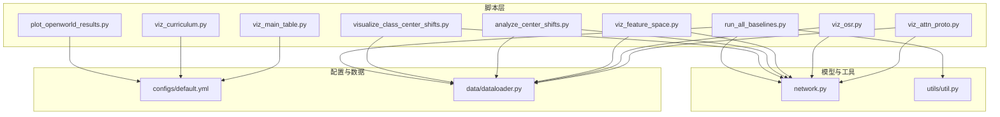
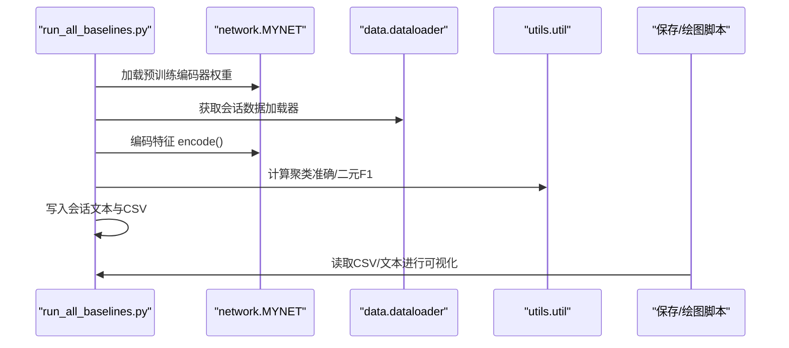
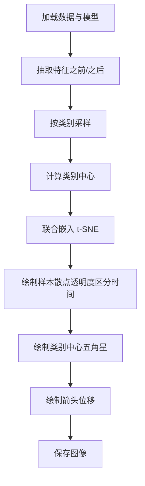
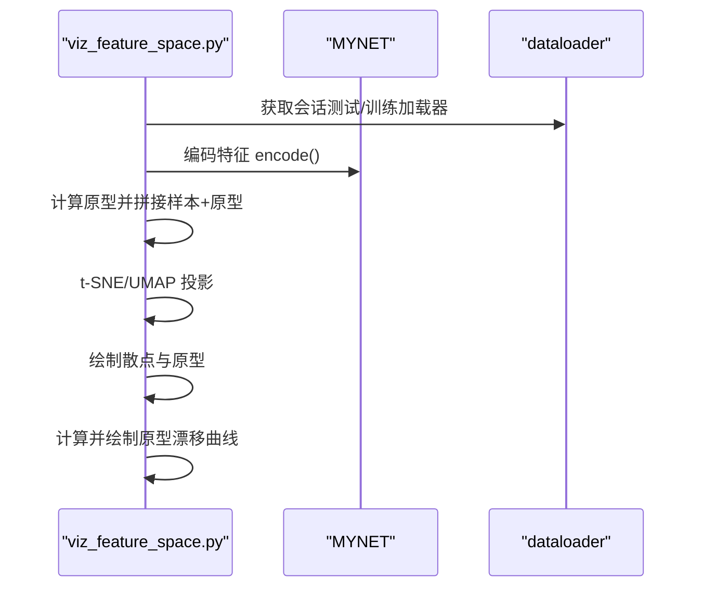
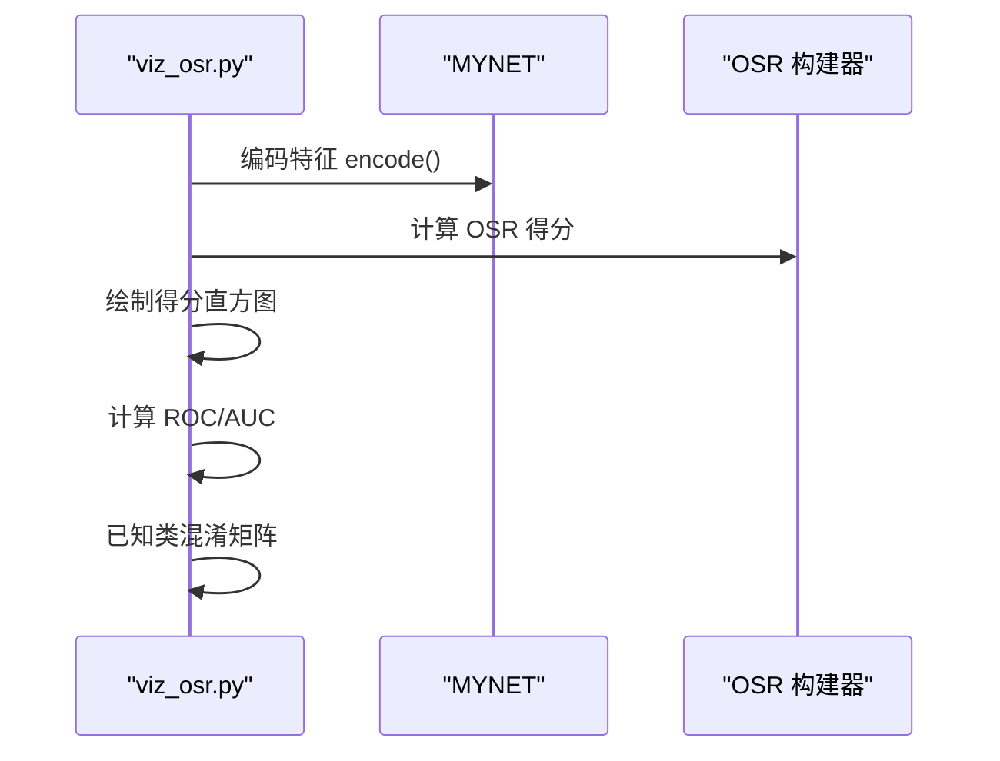
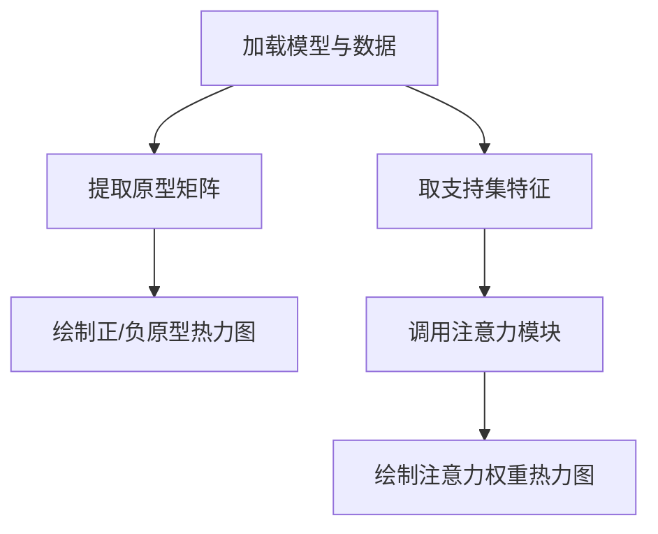
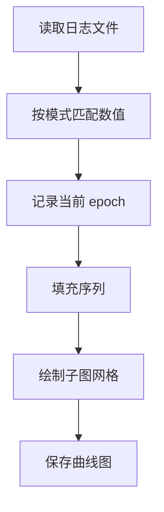
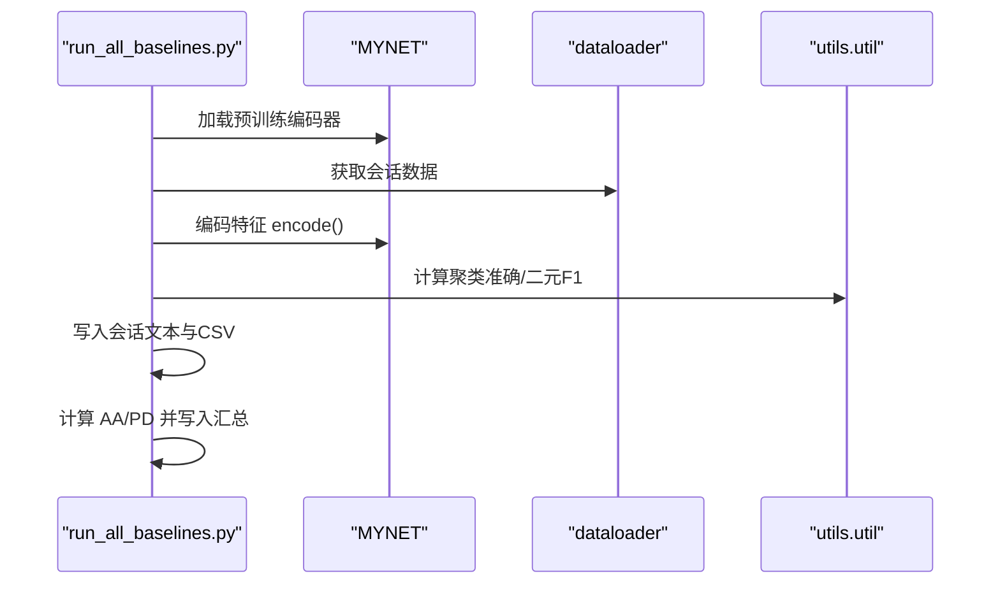
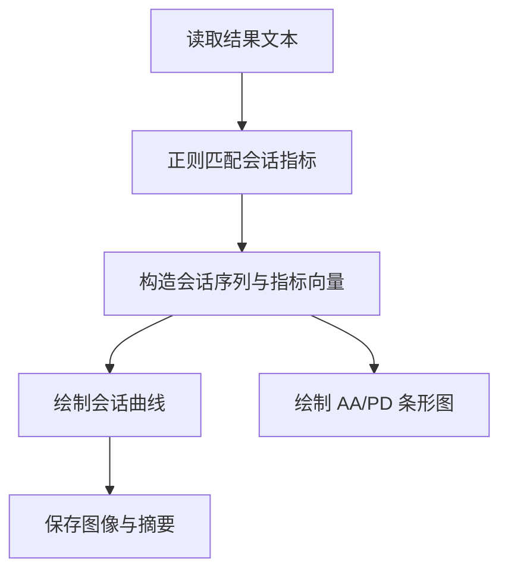
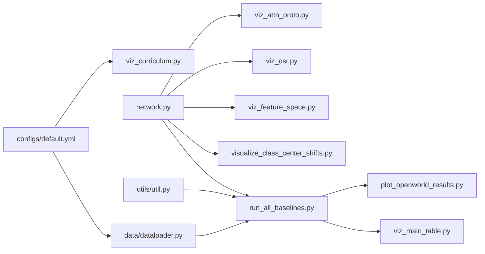

# 可视化和分析工具

<cite>
**本文引用的文件**
- [visualize_class_center_shifts.py](file://scripts/visualize_class_center_shifts.py)
- [analyze_center_shifts.py](file://scripts/analyze_center_shifts.py)
- [plot_openworld_results.py](file://scripts/plot_openworld_results.py)
- [viz_feature_space.py](file://scripts/viz_feature_space.py)
- [viz_osr.py](file://scripts/viz_osr.py)
- [viz_attn_proto.py](file://scripts/viz_attn_proto.py)
- [viz_curriculum.py](file://scripts/viz_curriculum.py)
- [viz_main_table.py](file://scripts/viz_main_table.py)
- [run_all_baselines.py](file://scripts/run_all_baselines.py)
- [network.py](file://network.py)
- [default.yml](file://configs/default.yml)
- [dataloader.py](file://data/dataloader.py)
- [util.py](file://utils/util.py)
</cite>

## 目录
1. [简介](#简介)
2. [项目结构](#项目结构)
3. [核心组件](#核心组件)
4. [架构总览](#架构总览)
5. [详细组件分析](#详细组件分析)
6. [依赖关系分析](#依赖关系分析)
7. [性能与指标](#性能与指标)
8. [故障排查指南](#故障排查指南)
9. [结论](#结论)
10. [附录](#附录)

## 简介
本文件系统性梳理 VAZE 项目的可视化与分析工具，覆盖以下主题：
- 结果可视化：t-SNE 图、混淆矩阵、ROC 曲线、特征分布直方图、原型热力图与注意力权重图
- 类中心变化：双面板 t-SNE 展示“之前/之后”的类别中心与箭头位移
- 性能指标：已知类准确率、未知类聚类准确率、F1 分数、增量准确率、全类准确率，以及 AA/PD 聚合指标
- 实验对比：9 种 CIL×OSR 组合的会话曲线与主表聚合图
- 趋势与收敛：课程学习/不确定性训练曲线解析
- 自定义扩展：如何基于现有脚本开发新的可视化与分析流程

## 项目结构
本项目围绕 scripts 目录下的多个可视化与分析脚本展开，配合 configs、data、models、network 等模块完成数据加载、模型推理与评估。

**图表来源**
- [visualize_class_center_shifts.py:1-291](file://scripts/visualize_class_center_shifts.py#L1-L291)
- [analyze_center_shifts.py:1-261](file://scripts/analyze_center_shifts.py#L1-L261)
- [plot_openworld_results.py:1-128](file://scripts/plot_openworld_results.py#L1-L128)
- [viz_feature_space.py:1-133](file://scripts/viz_feature_space.py#L1-L133)
- [viz_osr.py:1-100](file://scripts/viz_osr.py#L1-L100)
- [viz_attn_proto.py:1-120](file://scripts/viz_attn_proto.py#L1-L120)
- [viz_curriculum.py:1-88](file://scripts/viz_curriculum.py#L1-L88)
- [viz_main_table.py:1-83](file://scripts/viz_main_table.py#L1-L83)
- [run_all_baselines.py:1-282](file://scripts/run_all_baselines.py#L1-L282)
- [network.py:1-200](file://network.py#L1-L200)
- [default.yml:1-88](file://configs/default.yml#L1-L88)
- [dataloader.py:1-200](file://data/dataloader.py#L1-L200)

**章节来源**
- [visualize_class_center_shifts.py:1-291](file://scripts/visualize_class_center_shifts.py#L1-L291)
- [analyze_center_shifts.py:1-261](file://scripts/analyze_center_shifts.py#L1-L261)
- [plot_openworld_results.py:1-128](file://scripts/plot_openworld_results.py#L1-L128)
- [viz_feature_space.py:1-133](file://scripts/viz_feature_space.py#L1-L133)
- [viz_osr.py:1-100](file://scripts/viz_osr.py#L1-L100)
- [viz_attn_proto.py:1-120](file://scripts/viz_attn_proto.py#L1-L120)
- [viz_curriculum.py:1-88](file://scripts/viz_curriculum.py#L1-L88)
- [viz_main_table.py:1-83](file://scripts/viz_main_table.py#L1-L83)
- [run_all_baselines.py:1-282](file://scripts/run_all_baselines.py#L1-L282)
- [network.py:1-200](file://network.py#L1-L200)
- [default.yml:1-88](file://configs/default.yml#L1-L88)
- [dataloader.py:1-200](file://data/dataloader.py#L1-L200)

## 核心组件
- 类中心变化可视化：双面板 t-SNE，标注类别中心与位移箭头，支持从两个检查点抽取特征并计算中心变化。
- 特征空间可视化：t-SNE/UMAP 投影，展示样本与原型分布，并绘制基础类原型漂移曲线。
- 开放集识别分析：OSR 得分直方图、ROC/AUC 曲线、已知类混淆矩阵。
- 原型与注意力：正/负原型热力图，支持集上的自注意力权重热力图。
- 课程学习曲线：从日志解析中心损失、分类损失、困难权重、MC 不确定性方差等序列。
- 基线对比：统一驱动 9 种 CIL×OSR 组合，输出会话级指标与汇总 CSV，配套主表折线/柱状图。
- 指标采集：从日志文本中提取关键指标，生成汇总 CSV，便于横向对比。

**章节来源**
- [visualize_class_center_shifts.py:147-201](file://scripts/visualize_class_center_shifts.py#L147-L201)
- [viz_feature_space.py:44-128](file://scripts/viz_feature_space.py#L44-L128)
- [viz_osr.py:55-96](file://scripts/viz_osr.py#L55-L96)
- [viz_attn_proto.py:27-116](file://scripts/viz_attn_proto.py#L27-L116)
- [viz_curriculum.py:27-83](file://scripts/viz_curriculum.py#L27-L83)
- [run_all_baselines.py:103-171](file://scripts/run_all_baselines.py#L103-L171)
- [collect_metrics_from_logs.py:1-67](file://scripts/collect_metrics_from_logs.py#L1-L67)

## 架构总览
下图展示从“基线运行”到“结果可视化”的端到端流程，以及各脚本之间的职责分工。

**图表来源**
- [run_all_baselines.py:103-171](file://scripts/run_all_baselines.py#L103-L171)
- [network.py:1-200](file://network.py#L1-L200)
- [dataloader.py:1-200](file://data/dataloader.py#L1-L200)
- [util.py:1-75](file://utils/util.py#L1-L75)

## 详细组件分析

### 类中心变化可视化（双面板 t-SNE）
- 功能要点
  - 从两个检查点加载编码器，抽取完整数据集特征
  - 按类别采样固定数量样本，计算“之前/之后”类别中心
  - t-SNE 投影到二维，左右面板分别显示“之前/之后”样本分布
  - 在两图上绘制类别中心（五角星）与箭头（位移方向），标注类别 ID
- 关键流程

**图表来源**
- [visualize_class_center_shifts.py:101-201](file://scripts/visualize_class_center_shifts.py#L101-L201)
- [analyze_center_shifts.py:85-134](file://scripts/analyze_center_shifts.py#L85-L134)

**章节来源**
- [visualize_class_center_shifts.py:147-201](file://scripts/visualize_class_center_shifts.py#L147-L201)
- [analyze_center_shifts.py:136-203](file://scripts/analyze_center_shifts.py#L136-L203)

### 特征空间与原型漂移（t-SNE/UMAP + 原型轨迹）
- 功能要点
  - 对每个会话：抽取特征与原型，联合 t-SNE/UMAP 投影
  - 显示样本点与原型点（大号叉），颜色表示类别
  - 绘制基础类原型随会话的平均欧氏漂移曲线
- 关键流程

**图表来源**
- [viz_feature_space.py:59-128](file://scripts/viz_feature_space.py#L59-L128)

**章节来源**
- [viz_feature_space.py:44-128](file://scripts/viz_feature_space.py#L44-L128)

### 开放集识别分析（OSR 得分、ROC、混淆矩阵）
- 功能要点
  - 支持多种 OSR 方法（如 mls/tane/nci），输出得分直方图
  - 构造二分类标签（已知/未知），绘制 ROC 并计算 AUC
  - 已知类子集上计算混淆矩阵（闭集）
- 关键流程

**图表来源**
- [viz_osr.py:24-96](file://scripts/viz_osr.py#L24-L96)

**章节来源**
- [viz_osr.py:55-96](file://scripts/viz_osr.py#L55-L96)

### 原型与注意力可视化（热力图 + 注意力权重）
- 功能要点
  - 可视化正/负原型（或模型全原型）热力图
  - 对支持集特征调用注意力模块，输出自注意力权重热力图
- 关键流程

**图表来源**
- [viz_attn_proto.py:34-116](file://scripts/viz_attn_proto.py#L34-L116)

**章节来源**
- [viz_attn_proto.py:27-116](file://scripts/viz_attn_proto.py#L27-L116)

### 课程学习与不确定性曲线（从日志解析）
- 功能要点
  - 解析训练日志中的关键序列（如 center_loss、cls_loss、hard_weight、mc_var、curriculum_ratio、train_acc）
  - 多子图按行/列布局绘制，自动过滤空值
- 关键流程

**图表来源**
- [viz_curriculum.py:27-83](file://scripts/viz_curriculum.py#L27-L83)

**章节来源**
- [viz_curriculum.py:17-83](file://scripts/viz_curriculum.py#L17-L83)

### 基线对比与主表（9 方法 × 会话曲线 + 聚合柱状）
- 功能要点
  - 统一驱动 9 种 CIL×OSR 组合，输出每会话 all/inc/known/unknown/f1 指标
  - 生成汇总 CSV，绘制“每会话 all-acc 折线”和“AA/PD 聚合柱状”
- 关键流程

**图表来源**
- [run_all_baselines.py:103-171](file://scripts/run_all_baselines.py#L103-L171)
- [viz_main_table.py:30-78](file://scripts/viz_main_table.py#L30-L78)

**章节来源**
- [run_all_baselines.py:193-225](file://scripts/run_all_baselines.py#L193-L225)
- [viz_main_table.py:30-78](file://scripts/viz_main_table.py#L30-L78)

### 开放世界会话曲线与聚合指标
- 功能要点
  - 从单次实验结果文本中解析“会话、已知/未知/全类/增量/F1”等指标
  - 绘制会话曲线与 AA/PD 聚合条形图，并输出摘要文本
- 关键流程

**图表来源**
- [plot_openworld_results.py:8-59](file://scripts/plot_openworld_results.py#L8-L59)

**章节来源**
- [plot_openworld_results.py:62-124](file://scripts/plot_openworld_results.py#L62-L124)

## 依赖关系分析
- 数据加载与配置
  - dataloader 提供会话数据加载器（训练/测试/增量测试），默认配置来自 default.yml
- 模型与特征
  - network.MYNET 提供编码器模式与分类器，用于特征抽取与原型计算
- 评估与指标
  - utils.util 提供聚类准确与二元 F1 计算，支撑基线对比流程
- 可视化脚本
  - 各脚本通过命令行参数指定配置、检查点、会话与输出目录，统一遵循“先编码特征，再绘图”的范式

**图表来源**
- [default.yml:1-88](file://configs/default.yml#L1-L88)
- [dataloader.py:1-200](file://data/dataloader.py#L1-L200)
- [run_all_baselines.py:1-282](file://scripts/run_all_baselines.py#L1-L282)
- [network.py:1-200](file://network.py#L1-L200)
- [util.py:1-75](file://utils/util.py#L1-L75)
- [viz_main_table.py:1-83](file://scripts/viz_main_table.py#L1-L83)
- [plot_openworld_results.py:1-128](file://scripts/plot_openworld_results.py#L1-L128)
- [visualize_class_center_shifts.py:1-291](file://scripts/visualize_class_center_shifts.py#L1-L291)
- [viz_feature_space.py:1-133](file://scripts/viz_feature_space.py#L1-L133)
- [viz_osr.py:1-100](file://scripts/viz_osr.py#L1-L100)
- [viz_attn_proto.py:1-120](file://scripts/viz_attn_proto.py#L1-L120)
- [viz_curriculum.py:1-88](file://scripts/viz_curriculum.py#L1-L88)

**章节来源**
- [default.yml:1-88](file://configs/default.yml#L1-L88)
- [dataloader.py:1-200](file://data/dataloader.py#L1-L200)
- [run_all_baselines.py:1-282](file://scripts/run_all_baselines.py#L1-L282)
- [network.py:1-200](file://network.py#L1-L200)
- [util.py:1-75](file://utils/util.py#L1-L75)

## 性能与指标
- 会话级指标
  - 已知类准确率（Known Acc）、未知类聚类准确率（Unknown Acc）、F1 分数、增量准确率（Incremental Acc）、全类准确率（All Acc）
- 聚合指标
  - AA（Average Across Sessions）：对各会话指标取均值
  - PD（Progression Difference）：Session1 准确率减去最后会话准确率
- 计算与解析
  - run_all_baselines 输出文本格式，viz_main_table 与 plot_openworld_results 从文本解析并绘图
  - collect_metrics_from_logs 从日志文件批量提取关键指标，生成汇总 CSV

**章节来源**
- [run_all_baselines.py:103-171](file://scripts/run_all_baselines.py#L103-L171)
- [viz_main_table.py:30-78](file://scripts/viz_main_table.py#L30-L78)
- [plot_openworld_results.py:8-59](file://scripts/plot_openworld_results.py#L8-L59)
- [collect_metrics_from_logs.py:1-67](file://scripts/collect_metrics_from_logs.py#L1-L67)

## 故障排查指南
- 检查点加载失败
  - 确认 ckpt 路径存在，必要时尝试过滤 state_dict 键名以兼容不同版本
  - 参考：[visualize_class_center_shifts.py:84-98](file://scripts/visualize_class_center_shifts.py#L84-L98)、[analyze_center_shifts.py:69-82](file://scripts/analyze_center_shifts.py#L69-L82)
- t-SNE/UMAP 报错
  - 若缺少 umap，回退到 t-SNE；确保安装对应依赖
  - 参考：[viz_feature_space.py:36-42](file://scripts/viz_feature_space.py#L36-L42)、[analyze_center_shifts.py:124-134](file://scripts/analyze_center_shifts.py#L124-L134)
- 日志解析为空
  - 确认日志路径正确，且包含 epoch 标记与目标字段
  - 参考：[viz_curriculum.py:27-47](file://scripts/viz_curriculum.py#L27-L47)
- CSV/图像未生成
  - 检查输出目录可写权限，确认参数传入正确
  - 参考：[plot_openworld_results.py:62-124](file://scripts/plot_openworld_results.py#L62-L124)、[viz_main_table.py:30-78](file://scripts/viz_main_table.py#L30-L78)

**章节来源**
- [visualize_class_center_shifts.py:84-98](file://scripts/visualize_class_center_shifts.py#L84-L98)
- [analyze_center_shifts.py:69-82](file://scripts/analyze_center_shifts.py#L69-L82)
- [viz_feature_space.py:36-42](file://scripts/viz_feature_space.py#L36-L42)
- [viz_curriculum.py:27-47](file://scripts/viz_curriculum.py#L27-L47)
- [plot_openworld_results.py:62-124](file://scripts/plot_openworld_results.py#L62-L124)
- [viz_main_table.py:30-78](file://scripts/viz_main_table.py#L30-L78)

## 结论
本项目提供了从特征编码、基线评估到多维度可视化的完整分析流水线。通过统一的脚本接口与配置体系，研究者可以快速比较不同 CIL/OSR 组合的增量学习表现，深入理解类别中心漂移、原型演化与不确定性变化趋势，并据此优化模型与策略。

## 附录

### 自定义可视化脚本开发指南
- 基本步骤
  - 读取配置与数据加载器：参考 [run_all_baselines.py:56-76](file://scripts/run_all_baselines.py#L56-L76)、[dataloader.py:108-132](file://data/dataloader.py#L108-L132)
  - 加载模型与替换分类器：参考 [run_all_baselines.py:196-201](file://scripts/run_all_baselines.py#L196-L201)、[network.py:1-200](file://network.py#L1-L200)
  - 编码特征：参考 [run_all_baselines.py:83-96](file://scripts/run_all_baselines.py#L83-L96)
  - 计算指标/统计：参考 [util.py:12-57](file://utils/util.py#L12-L57)
  - 绘图：使用 matplotlib/seaborn，注意保存 DPI 与布局
- 推荐命名与参数
  - 输入：--config/--ckpt/--session/--out_dir/--gpu
  - 输出：图像与 CSV，按任务分类存放于 save/figures 下
- 最佳实践
  - 优先使用 encode_loader 统一特征抽取
  - 对缺失依赖（如 umap）做降级处理（t-SNE）
  - 对日志解析使用正则表达式并保留容错逻辑

**章节来源**
- [run_all_baselines.py:56-96](file://scripts/run_all_baselines.py#L56-L96)
- [dataloader.py:108-132](file://data/dataloader.py#L108-L132)
- [network.py:1-200](file://network.py#L1-L200)
- [util.py:12-57](file://utils/util.py#L12-L57)