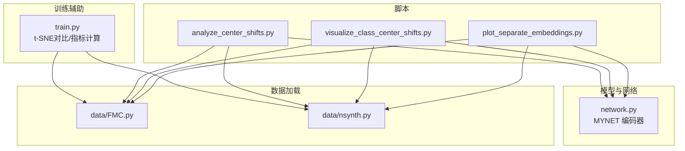
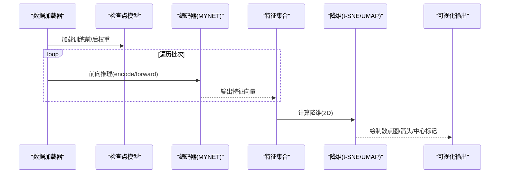
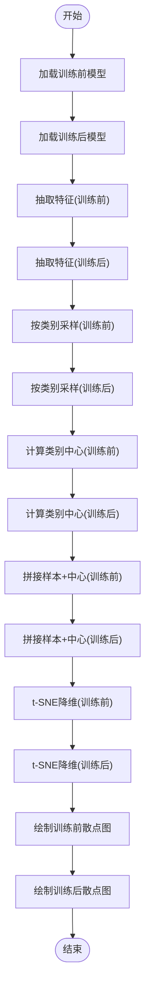
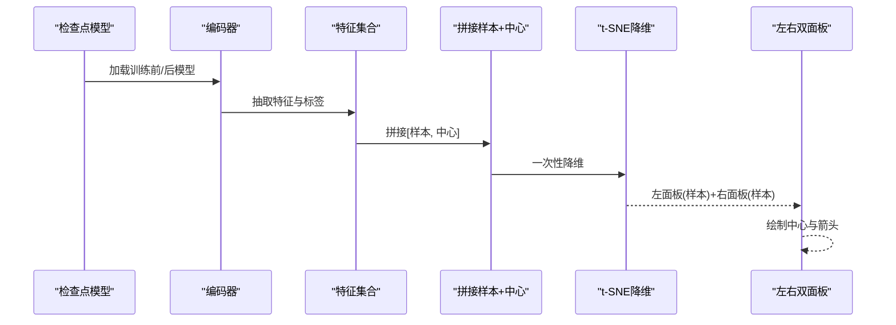
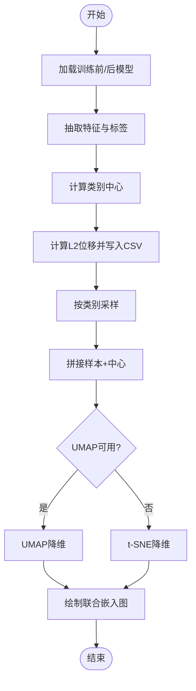
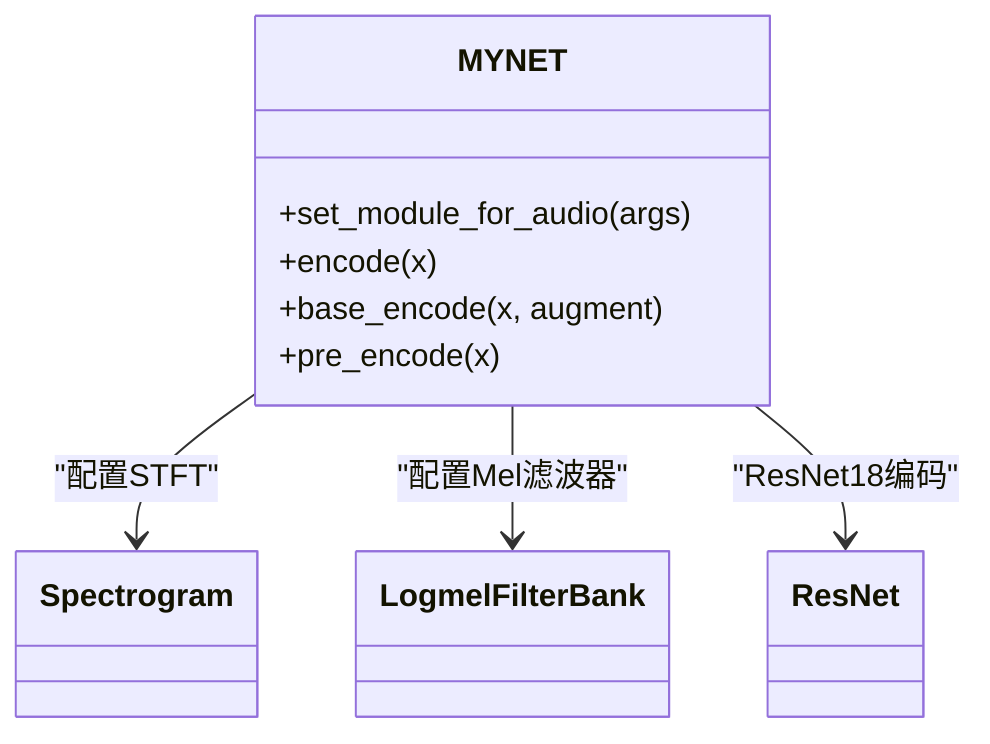
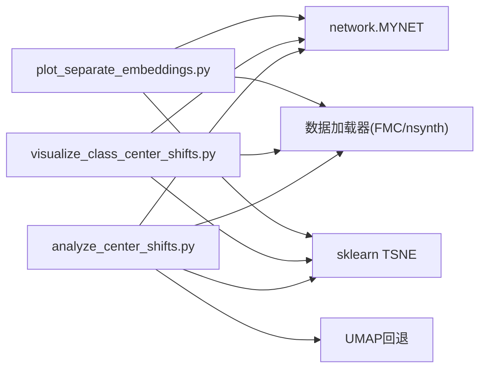

# 嵌入空间可视化

<cite>
**本文引用的文件**
- [plot_separate_embeddings.py](file://scripts/plot_separate_embeddings.py)
- [visualize_class_center_shifts.py](file://scripts/visualize_class_center_shifts.py)
- [analyze_center_shifts.py](file://scripts/analyze_center_shifts.py)
- [network.py](file://network.py)
- [train.py](file://train.py)
- [FMC.py](file://data/FMC.py)
- [nsynth.py](file://data/nsynth.py)
</cite>

## 目录
1. [简介](#简介)
2. [项目结构](#项目结构)
3. [核心组件](#核心组件)
4. [架构总览](#架构总览)
5. [详细组件分析](#详细组件分析)
6. [依赖关系分析](#依赖关系分析)
7. [性能考量](#性能考量)
8. [故障排查指南](#故障排查指南)
9. [结论](#结论)
10. [附录](#附录)

## 简介
本文件围绕嵌入空间可视化展开，重点解释以下脚本的功能与使用场景：
- plot_separate_embeddings.py：分别对“训练前”和“训练后”的模型在相同数据集上抽取的音频特征嵌入进行 t-SNE 降维，并绘制两类独立散点图，便于对比模型学习前后类别分布的变化。
- visualize_class_center_shifts.py：在同一张图中同时展示“训练前/后”的样本分布与类别中心（原型）位置，并用箭头指示类别中心的移动方向，直观反映模型学习过程中的语义漂移。
- analyze_center_shifts.py：计算每个类别的中心 L2 位移并导出 CSV，同时提供 UMAP 或 t-SNE 的联合嵌入可视化，作为更稳健的降维替代方案。

这些脚本共同服务于音频特征嵌入的可视化与分析，帮助理解模型在不同阶段的类别边界变化、聚类效果与语义稳定性。

## 项目结构
与嵌入空间可视化直接相关的文件主要位于 scripts/ 目录，配合网络模型定义与数据加载模块，形成完整的特征抽取与可视化流程。

图表来源
- [plot_separate_embeddings.py:150-199](file://scripts/plot_separate_embeddings.py#L150-L199)
- [visualize_class_center_shifts.py:203-291](file://scripts/visualize_class_center_shifts.py#L203-L291)
- [analyze_center_shifts.py:136-261](file://scripts/analyze_center_shifts.py#L136-L261)
- [network.py:18-50](file://network.py#L18-L50)
- [FMC.py:92-137](file://data/FMC.py#L92-L137)
- [nsynth.py:97-136](file://data/nsynth.py#L97-L136)
- [train.py:238-437](file://train.py#L238-L437)

章节来源
- [plot_separate_embeddings.py:1-199](file://scripts/plot_separate_embeddings.py#L1-L199)
- [visualize_class_center_shifts.py:1-291](file://scripts/visualize_class_center_shifts.py#L1-L291)
- [analyze_center_shifts.py:1-261](file://scripts/analyze_center_shifts.py#L1-L261)
- [network.py:18-50](file://network.py#L18-L50)
- [FMC.py:92-137](file://data/FMC.py#L92-L137)
- [nsynth.py:97-136](file://data/nsynth.py#L97-L136)
- [train.py:238-437](file://train.py#L238-L437)

## 核心组件
- 模型编码器（MYNET）：负责将音频波形转换为固定维度的特征向量，供 t-SNE/UMAP 降维与可视化。
- 数据加载器：提供统一的数据接口，支持 LibriSpeech、NSynth 等数据集，保证特征抽取的一致性。
- 可视化脚本：
  - plot_separate_embeddings.py：分别绘制“训练前/后”的嵌入图，突出类别中心（原型）位置。
  - visualize_class_center_shifts.py：在同一图中展示样本分布与类别中心移动箭头，强调学习过程中的语义变化。
  - analyze_center_shifts.py：计算类别中心 L2 位移并导出 CSV，同时提供 UMAP/t-SNE 联合嵌入图，作为稳健降维的备选方案。

章节来源
- [network.py:471-503](file://network.py#L471-L503)
- [FMC.py:92-137](file://data/FMC.py#L92-L137)
- [nsynth.py:97-136](file://data/nsynth.py#L97-L136)
- [plot_separate_embeddings.py:126-149](file://scripts/plot_separate_embeddings.py#L126-L149)
- [visualize_class_center_shifts.py:147-201](file://scripts/visualize_class_center_shifts.py#L147-L201)
- [analyze_center_shifts.py:124-134](file://scripts/analyze_center_shifts.py#L124-L134)

## 架构总览
下图展示了从数据加载到特征抽取再到降维可视化的完整流程，以及三个脚本之间的差异与共性。

图表来源
- [plot_separate_embeddings.py:82-124](file://scripts/plot_separate_embeddings.py#L82-L124)
- [visualize_class_center_shifts.py:101-126](file://scripts/visualize_class_center_shifts.py#L101-L126)
- [analyze_center_shifts.py:85-110](file://scripts/analyze_center_shifts.py#L85-L110)
- [network.py:471-503](file://network.py#L471-L503)

## 详细组件分析

### 组件A：plot_separate_embeddings.py
- 功能概述
  - 分别加载“训练前/后”两个检查点的模型，抽取全量数据的特征向量。
  - 对每个类别随机采样固定数量样本，计算类别中心（原型），并将样本与中心拼接后进行 t-SNE 降维。
  - 生成两张独立的散点图，分别对应“训练前/后”，便于对比学习前后类别分布与中心位置变化。
- 关键实现要点
  - 模型加载与兼容：支持从多种权重字典结构中恢复状态，若键名不完全一致则进行过滤匹配。
  - 特征抽取：统一将多维特征平均池化至一维，确保维度一致；随后按类别采样并计算中心。
  - t-SNE 参数：固定 n_components=2、init='pca'、perplexity=30、random_state=0，保证可重复性。
  - 可视化细节：样本点采用半透明小点，类别中心用带边框的特殊标记显示，并标注类别标签。
- 应用场景
  - 观察模型在元训练/增量训练过程中，类别中心是否稳定、边界是否清晰。
  - 识别异常类别（中心漂移过大或内部离散度增加）。
- 使用示例
  - python scripts/plot_separate_embeddings.py --ckpt_before save/base_train_for_meta.pth --ckpt_after save/epoch_25.pth --out_before before_tsne.png --out_after after_tsne.png --n_classes 10 --samples_per_class 150

图表来源
- [plot_separate_embeddings.py:150-199](file://scripts/plot_separate_embeddings.py#L150-L199)
- [plot_separate_embeddings.py:82-124](file://scripts/plot_separate_embeddings.py#L82-L124)
- [plot_separate_embeddings.py:126-149](file://scripts/plot_separate_embeddings.py#L126-L149)

章节来源
- [plot_separate_embeddings.py:1-199](file://scripts/plot_separate_embeddings.py#L1-L199)

### 组件B：visualize_class_center_shifts.py
- 功能概述
  - 同时抽取“训练前/后”的特征与类别中心，将样本与中心拼接后进行 t-SNE 降维。
  - 左右双面板分别展示“训练前/后”的样本分布；在左图中绘制从“训练前中心”到“训练后中心”的箭头，直观体现类别中心移动。
- 关键实现要点
  - 统一嵌入：将“样本+中心”拼接后一次性降维，确保中心在嵌入空间中的坐标准确。
  - 箭头绘制：使用红色箭头连接前后中心，便于观察类别语义漂移。
  - 参数控制：支持 perplexity、PCA 初始化、透明度、箭头缩放等参数，便于微调可视化效果。
- 应用场景
  - 分析模型在不同阶段的类别边界变化与原型稳定性。
  - 识别某些类别的显著漂移，辅助进一步的训练策略调整。

图表来源
- [visualize_class_center_shifts.py:147-201](file://scripts/visualize_class_center_shifts.py#L147-L201)
- [visualize_class_center_shifts.py:101-126](file://scripts/visualize_class_center_shifts.py#L101-L126)

章节来源
- [visualize_class_center_shifts.py:1-291](file://scripts/visualize_class_center_shifts.py#L1-L291)

### 组件C：analyze_center_shifts.py
- 功能概述
  - 计算每个类别的中心 L2 位移并写入 CSV 文件，便于量化分析类别中心变化。
  - 提供 UMAP 作为 t-SNE 的稳健降维替代方案：若 UMAP 可用则优先使用，否则回退到 t-SNE。
  - 绘制联合嵌入图，展示样本与中心，箭头表示位移方向。
- 关键实现要点
  - 降维回退：try_umap 函数尝试 UMAP，失败则回退 t-SNE，保证可视化可用性。
  - 采样策略：按类别随机采样，控制绘图可读性。
  - 输出格式：CSV 包含类别、训练前中心范数、训练后中心范数与 L2 位移，便于后续统计分析。
- 应用场景
  - 结合数值指标与可视化，系统评估模型学习过程中的类别稳定性。
  - 作为批量分析工具，快速比较多个检查点的类别中心变化。

图表来源
- [analyze_center_shifts.py:124-134](file://scripts/analyze_center_shifts.py#L124-L134)
- [analyze_center_shifts.py:136-261](file://scripts/analyze_center_shifts.py#L136-L261)

章节来源
- [analyze_center_shifts.py:1-261](file://scripts/analyze_center_shifts.py#L1-L261)

### 组件D：网络与特征抽取（MYNET）
- 编码器路径
  - set_module_for_audio：配置 STFT 与 Mel 滤波器，确保音频特征一致性。
  - encode/base_encode：将音频转换为 Mel 频谱，经 ResNet 编码，全局平均池化得到特征向量。
- 与可视化的关系
  - 可视化脚本通过模型的 encode 接口抽取特征，保证与训练时一致的特征空间。
  - 若模型提供 fc 层，可在编码器模式下直接输出特征，便于降维与聚类。

图表来源
- [network.py:326-353](file://network.py#L326-L353)
- [network.py:471-503](file://network.py#L471-L503)

章节来源
- [network.py:18-50](file://network.py#L18-L50)
- [network.py:326-353](file://network.py#L326-L353)
- [network.py:471-503](file://network.py#L471-L503)

### 组件E：数据加载与音频特征
- FMC.py/nsynth.py：提供音频数据读取与基础特征提取接口，保证与网络模块一致的音频预处理流程。
- 与可视化的关系
  - 可视化脚本通过训练数据加载器获取统一的标签与音频，确保类别划分一致。

章节来源
- [FMC.py:92-137](file://data/FMC.py#L92-L137)
- [nsynth.py:97-136](file://data/nsynth.py#L97-L136)

### 组件F：t-SNE对比与聚类指标（train.py）
- plot_tsne_comparison：对原始与增强特征分别进行 t-SNE 降维，统一坐标轴，便于直观对比。
- calculate_metrics：计算轮廓系数与类内/类间距离比等聚类指标，辅助评估嵌入质量。
- 与可视化的关系
  - 作为补充分析，提供数值指标与可视化结合的综合评估。

章节来源
- [train.py:238-437](file://train.py#L238-L437)

## 依赖关系分析
- 脚本依赖
  - plot_separate_embeddings.py/visualize_class_center_shifts.py/analyze_center_shifts.py 共同依赖 network.MYNET 的编码器接口与训练数据加载器。
  - 三者均使用 sklearn.manifold.TSNE 进行降维；analyze_center_shifts.py 提供 UMAP 回退方案。
- 模块耦合
  - 可视化脚本与网络模块通过 encode 接口耦合，保证特征抽取一致性。
  - 数据加载器与脚本通过统一的标签与数据接口耦合，确保类别划分一致。

图表来源
- [plot_separate_embeddings.py:150-199](file://scripts/plot_separate_embeddings.py#L150-L199)
- [visualize_class_center_shifts.py:203-291](file://scripts/visualize_class_center_shifts.py#L203-L291)
- [analyze_center_shifts.py:124-134](file://scripts/analyze_center_shifts.py#L124-L134)
- [network.py:471-503](file://network.py#L471-L503)
- [FMC.py:92-137](file://data/FMC.py#L92-L137)
- [nsynth.py:97-136](file://data/nsynth.py#L97-L136)

章节来源
- [plot_separate_embeddings.py:1-199](file://scripts/plot_separate_embeddings.py#L1-L199)
- [visualize_class_center_shifts.py:1-291](file://scripts/visualize_class_center_shifts.py#L1-L291)
- [analyze_center_shifts.py:1-261](file://scripts/analyze_center_shifts.py#L1-L261)
- [network.py:471-503](file://network.py#L471-L503)
- [FMC.py:92-137](file://data/FMC.py#L92-L137)
- [nsynth.py:97-136](file://data/nsynth.py#L97-L136)

## 性能考量
- 采样策略
  - 通过按类别随机采样控制样本数量，平衡可视化可读性与计算开销。
- 降维参数
  - t-SNE 的 perplexity 与初始化方式影响聚类密度与边界清晰度；建议在 5–50 范围内调整。
  - UMAP 在大规模数据上通常更快且更稳定，可作为首选降维方案。
- 内存与显存
  - 大批量特征抽取与降维可能占用较多内存；可通过减少采样数量或分批处理缓解。
- 可重复性
  - 固定随机种子与初始化方式有助于复现结果，便于对比不同阶段的可视化。

## 故障排查指南
- 检查点加载失败
  - 现象：找不到指定权重文件或加载时报错。
  - 处理：确认路径正确；若键名不一致，脚本会尝试过滤匹配；必要时手动检查权重字典结构。
- 特征维度不一致
  - 现象：降维报错或可视化异常。
  - 处理：确保编码器输出维度一致；若模型包含空间维度，需进行全局平均池化。
- UMAP 不可用
  - 现象：UMAP 导入失败。
  - 处理：脚本会自动回退到 t-SNE；也可手动安装 UMAP 以获得更稳定的降维效果。
- 样本不足
  - 现象：某些类别样本过少导致无法采样或中心计算异常。
  - 处理：降低 n_classes 或 samples_per_class，或更换数据集。

章节来源
- [plot_separate_embeddings.py:67-80](file://scripts/plot_separate_embeddings.py#L67-L80)
- [visualize_class_center_shifts.py:84-98](file://scripts/visualize_class_center_shifts.py#L84-L98)
- [analyze_center_shifts.py:124-134](file://scripts/analyze_center_shifts.py#L124-L134)

## 结论
- plot_separate_embeddings.py 适合对比模型学习前后类别分布的整体变化。
- visualize_class_center_shifts.py 更关注类别中心的移动与边界变化，箭头直观表达语义漂移。
- analyze_center_shifts.py 提供数值化指标与稳健降维方案，便于系统评估与批量分析。
- 结合网络模块的统一特征抽取与数据加载器的标签一致性，三者形成完整的嵌入空间可视化与分析闭环。

## 附录
- 实际使用示例
  - 训练前/后对比：python scripts/plot_separate_embeddings.py --ckpt_before save/base_train_for_meta.pth --ckpt_after save/epoch_25.pth --n_classes 10 --samples_per_class 150
  - 中心移动箭头：python scripts/visualize_class_center_shifts.py --ckpt_before save/base_train_for_meta.pth --ckpt_after save/epoch_25.pth --out class_center_shifts.png
  - 数值化分析与稳健降维：python scripts/analyze_center_shifts.py --ckpt_before save/base_train_for_meta.pth --ckpt_after save/epoch_25.pth --out_csv center_shifts.csv --out_plot center_shifts_umap.png
- 结果解读要点
  - 样本聚类紧密度：类别内部点越密集，类别分离度越高。
  - 中心移动幅度：箭头长度越大，类别语义变化越明显。
  - 数值指标：L2 位移越大，类别中心漂移越显著；可结合 CSV 进行统计分析。