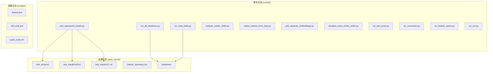
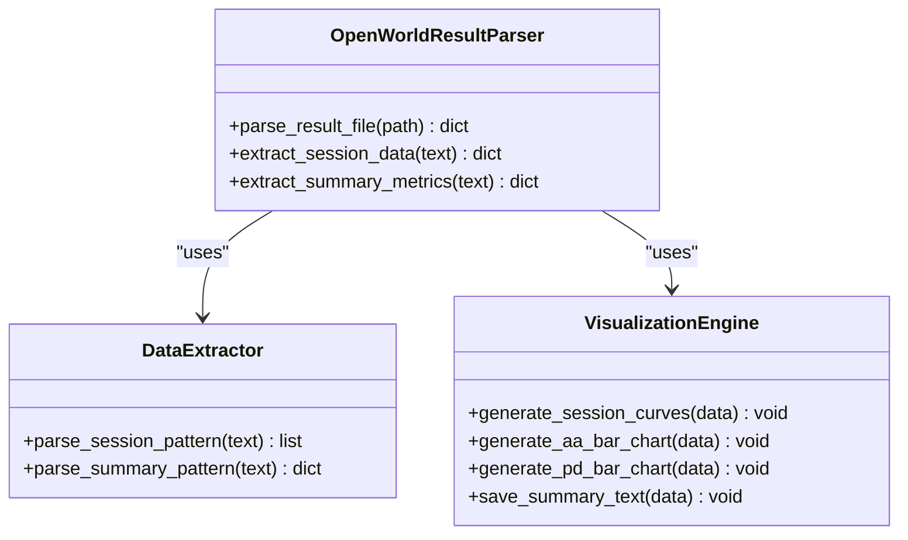
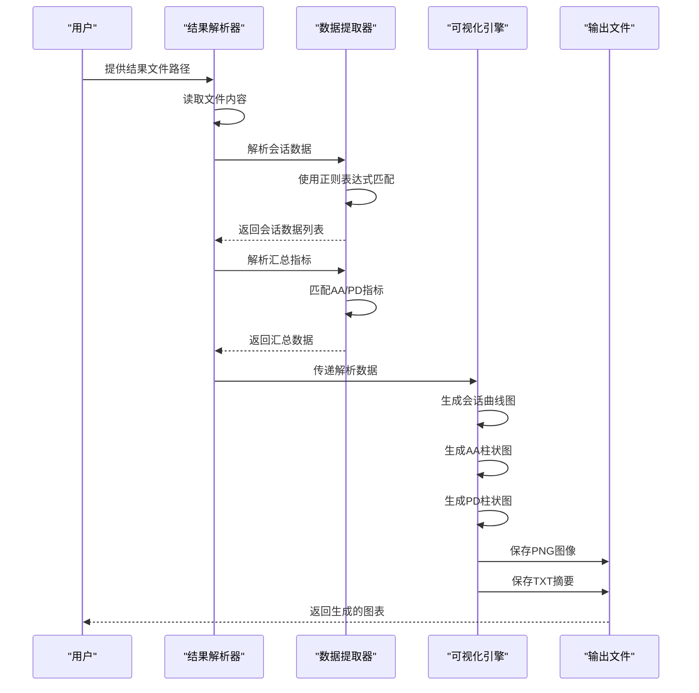
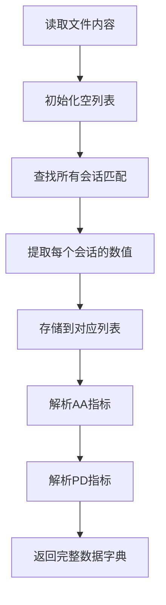
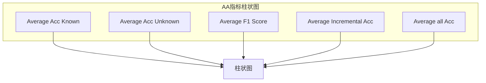
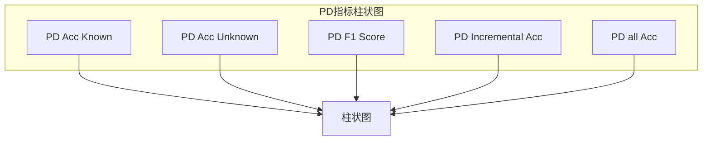
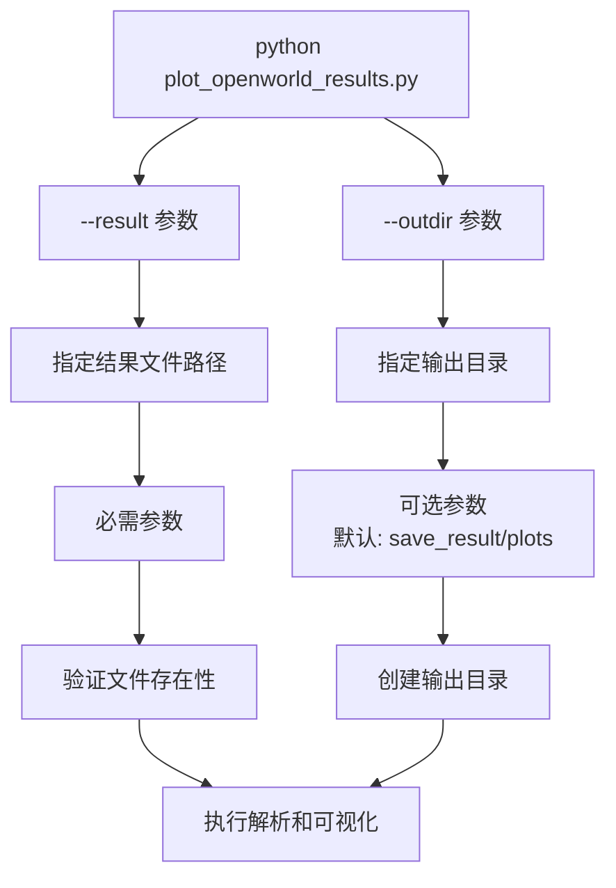
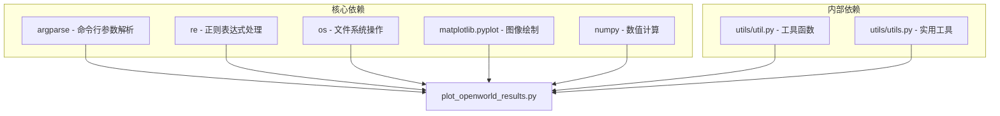
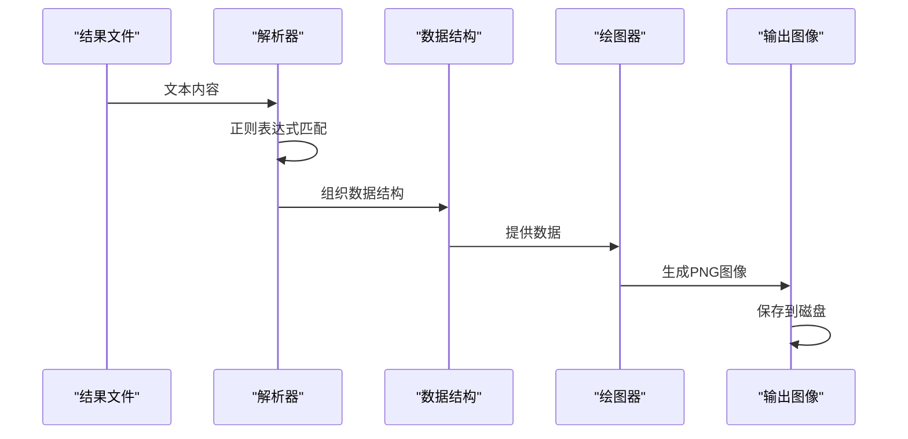

# 开放世界结果可视化

<cite>
**本文档引用的文件**
- [plot_openworld_results.py](file://scripts/plot_openworld_results.py)
- [test_result.txt](file://save_result/test_result.txt)
- [test_result0108.txt](file://save_result/test_result0108.txt)
- [test_result1127.txt](file://save_result/test_result1127.txt)
- [run_all_baselines.py](file://scripts/run_all_baselines.py)
- [viz_main_table.py](file://scripts/viz_main_table.py)
</cite>

## 目录
1. [简介](#简介)
2. [项目结构](#项目结构)
3. [核心组件](#核心组件)
4. [架构概览](#架构概览)
5. [详细组件分析](#详细组件分析)
6. [依赖关系分析](#依赖关系分析)
7. [性能考虑](#性能考虑)
8. [故障排除指南](#故障排除指南)
9. [结论](#结论)

## 简介

开放世界结果可视化工具是一个专门用于分析和展示开放世界少样本分类（Open-World Few-Shot Classification）实验结果的Python脚本。该工具能够解析实验结果文件，提取会话数据，并生成多种图表来直观展示模型在增量学习过程中的性能表现。

该工具主要关注以下关键指标：
- 已知类别准确率（Known Acc）
- 未知类别准确率（Unknown Acc）  
- F1分数（F1 Score）
- 增量准确率（Incremental Acc）
- 整体准确率（All Acc）

同时支持AA（Average Accuracy）和PD（Performance Degradation）指标的计算和可视化。

## 项目结构

该项目采用模块化设计，主要包含以下关键目录和文件：



**图表来源**
- [plot_openworld_results.py:1-128](file://scripts/plot_openworld_results.py#L1-L128)
- [run_all_baselines.py:1-282](file://scripts/run_all_baselines.py#L1-L282)

**章节来源**
- [plot_openworld_results.py:1-128](file://scripts/plot_openworld_results.py#L1-L128)
- [run_all_baselines.py:1-282](file://scripts/run_all_baselines.py#L1-L282)

## 核心组件

### 主要功能模块

该工具包含三个核心功能模块：

1. **结果解析模块**：使用正则表达式解析实验结果文件
2. **数据提取模块**：从解析的数据中提取会话相关指标
3. **可视化模块**：生成会话曲线图、AA指标柱状图和PD指标柱状图

### 数据结构设计

工具使用字典结构来组织解析后的数据：



**图表来源**
- [plot_openworld_results.py:8-59](file://scripts/plot_openworld_results.py#L8-L59)

**章节来源**
- [plot_openworld_results.py:8-59](file://scripts/plot_openworld_results.py#L8-L59)

## 架构概览

该工具采用分层架构设计，从底层的数据解析到上层的可视化呈现：



**图表来源**
- [plot_openworld_results.py:62-124](file://scripts/plot_openworld_results.py#L62-L124)

## 详细组件分析

### 结果解析器组件

#### 正则表达式模式设计

解析器使用精心设计的正则表达式来匹配不同类型的实验结果：

```mermaid
flowchart TD
A["输入文本"] --> B["会话数据模式"]
A --> C["AA指标模式"]
A --> D["PD指标模式"]
B --> E["session: \\d+"]
B --> F["total aac known: \\d+.\\d+"]
B --> G["total acc unknown: \\d+.\\d+"]
B --> H["total f1 score: \\d+.\\d+"]
B --> I["total incremental acc: \\d+.\\d+"]
B --> J["total all acc: \\d+.\\d+"]
C --> K["Average Acc Known: \\d+.\\d+"]
C --> L["Average Acc Unknown: \\d+.\\d+"]
C --> M["Average F1 Score: \\d+.\\d+"]
C --> N["Average Incremental Acc: \\d+.\\d+"]
C --> O["Average all Acc: \\d+.\\d+"]
D --> P["PD Acc Known: \\d+.\\d+"]
D --> Q["PD Acc Unknown: \\d+.\\d+"]
D --> R["PD F1 Score: \\d+.\\d+"]
D --> S["PD Incremental Acc: \\d+.\\d+"]
D --> T["PD all Acc: \\d+.\\d+"]
```



**图表来源**
- [plot_openworld_results.py:12-47](file://scripts/plot_openworld_results.py#L12-L47)

#### 数据提取算法

解析器采用迭代匹配的方式处理多行结果数据：



**图表来源**
- [plot_openworld_results.py:27-49](file://scripts/plot_openworld_results.py#L27-L49)

**章节来源**
- [plot_openworld_results.py:8-59](file://scripts/plot_openworld_results.py#L8-L59)

### 可视化引擎组件

#### 会话曲线图生成

会话曲线图展示了模型在增量学习过程中的性能变化趋势：

```mermaid
graph LR
subgraph "会话曲线图"
A[X轴: Session Number]
B[Y轴: Score (0-1.05)]
C[已知类别准确率 (圆形标记)]
D[未知类别准确率 (方形标记)]
E[F1分数 (三角形标记)]
F[增量准确率 (菱形标记)]
G[整体准确率 (星形标记)]
end
A --> C
A --> D
A --> E
A --> F
A --> G
```

**图表来源**
- [plot_openworld_results.py:75-90](file://scripts/plot_openworld_results.py#L75-L90)

#### AA指标柱状图

AA（Average Accuracy）指标展示了各指标的平均性能：



**图表来源**
- [plot_openworld_results.py:92-102](file://scripts/plot_openworld_results.py#L92-L102)

#### PD指标柱状图

PD（Performance Degradation）指标显示了从第一个会话到最后一个会话的性能变化：



**图表来源**
- [plot_openworld_results.py:104-113](file://scripts/plot_openworld_results.py#L104-L113)

**章节来源**
- [plot_openworld_results.py:75-124](file://scripts/plot_openworld_results.py#L75-L124)

### 命令行接口设计

工具提供了简洁的命令行接口：



**图表来源**
- [plot_openworld_results.py:63-66](file://scripts/plot_openworld_results.py#L63-L66)

**章节来源**
- [plot_openworld_results.py:62-66](file://scripts/plot_openworld_results.py#L62-L66)

## 依赖关系分析

### 外部依赖库

该工具依赖于以下Python库：



**图表来源**
- [plot_openworld_results.py:1-6](file://scripts/plot_openworld_results.py#L1-L6)

### 数据流依赖



**图表来源**
- [plot_openworld_results.py:69-124](file://scripts/plot_openworld_results.py#L69-L124)

**章节来源**
- [plot_openworld_results.py:1-128](file://scripts/plot_openworld_results.py#L1-L128)

## 性能考虑

### 内存使用优化

- **流式文件读取**：使用单次读取整个文件内容，避免逐行处理的开销
- **正则表达式缓存**：正则表达式编译后重复使用，减少编译开销
- **数据结构选择**：使用列表存储数值数据，内存效率高

### 处理效率

- **单次解析**：通过一次正则表达式遍历获取所有数据
- **批量数据处理**：将相同类型的数据批量提取和存储
- **零拷贝操作**：直接使用原始字符串进行数值转换

### 输出优化

- **统一图像质量**：固定DPI设置确保输出一致性
- **紧凑布局**：使用tight_layout减少空白区域
- **批量保存**：一次性生成多个图表避免重复初始化

## 故障排除指南

### 常见问题及解决方案

#### 1. 结果文件格式错误

**问题症状**：
- 运行时报错"No session summary rows found"
- 生成的图表为空白

**解决方法**：
- 检查结果文件是否包含正确的会话数据格式
- 验证文件编码是否为UTF-8
- 确认文件中包含"session:"标识符

#### 2. 正则表达式匹配失败

**问题症状**：
- 解析的数据为空列表
- AA/PD指标为NaN

**解决方法**：
- 检查结果文件中的数据格式是否与正则表达式匹配
- 验证数值格式是否包含小数点
- 确认文件中包含AA和PD相关的统计信息

#### 3. 输出目录权限问题

**问题症状**：
- 无法保存PNG图像文件
- 抛出IOError异常

**解决方法**：
- 检查输出目录是否存在
- 确认对输出目录有写入权限
- 使用绝对路径避免相对路径问题

#### 4. Matplotlib后端问题

**问题症状**：
- 图像无法正确渲染
- 显示空白图表

**解决方法**：
- 确保安装了合适的Matplotlib后端
- 在无GUI环境中使用Agg后端
- 检查X11显示服务器连接

**章节来源**
- [plot_openworld_results.py:72-73](file://scripts/plot_openworld_results.py#L72-L73)

### 调试技巧

1. **启用详细日志**：添加print语句输出中间结果
2. **验证数据完整性**：检查解析后的数据结构
3. **逐步调试**：分别测试解析和绘图功能
4. **边界条件测试**：测试空文件、格式错误等异常情况

## 结论

开放世界结果可视化工具为分析增量学习实验提供了强大而灵活的解决方案。该工具的主要优势包括：

### 技术优势

- **精确的数据解析**：使用正则表达式确保数据提取的准确性
- **多样化的可视化**：提供会话曲线图、AA指标图和PD指标图
- **用户友好**：简洁的命令行接口和清晰的输出结构
- **可扩展性**：模块化设计便于功能扩展和定制

### 应用价值

- **研究分析**：帮助研究人员深入理解模型在增量学习过程中的表现
- **性能监控**：实时监控模型性能变化趋势
- **结果展示**：为论文和报告提供高质量的可视化图表
- **对比分析**：支持不同实验设置和方法的性能对比

### 发展建议

1. **增强错误处理**：添加更详细的错误信息和恢复机制
2. **支持更多图表类型**：扩展到箱线图、散点图等高级可视化
3. **交互式可视化**：集成Plotly等库实现交互式图表
4. **批量处理**：支持同时处理多个结果文件
5. **导出格式多样化**：支持PDF、SVG等矢量格式导出

该工具为开放世界少样本分类领域的研究和开发提供了重要的可视化支持，有助于推动该领域的发展和应用。