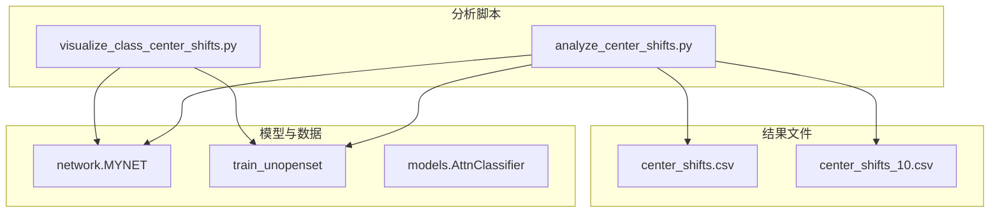
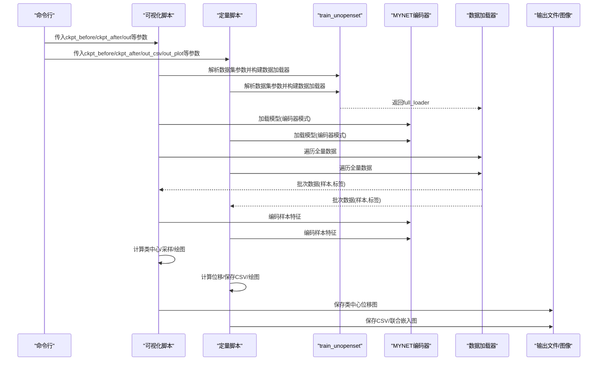
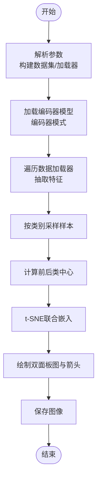
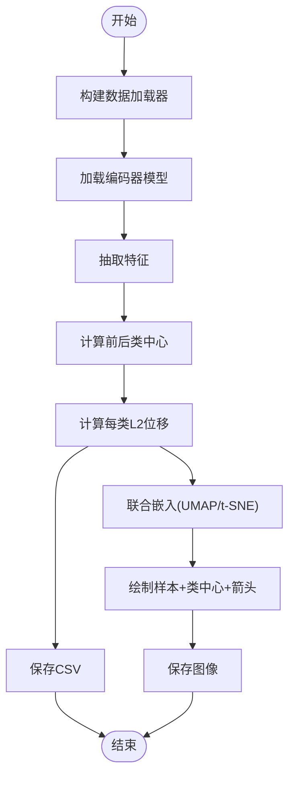
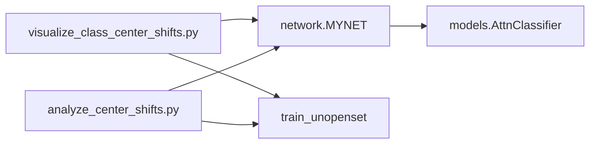

# 类中心变化分析

<cite>
**本文档引用的文件**
- [visualize_class_center_shifts.py](file://scripts/visualize_class_center_shifts.py)
- [analyze_center_shifts.py](file://scripts/analyze_center_shifts.py)
- [center_shifts.csv](file://center_shifts.csv)
- [center_shifts_10.csv](file://center_shifts_10.csv)
- [network.py](file://network.py)
- [train_unopenset.py](file://train_unopenset.py)
- [AttnClassifier.py](file://models/AttnClassifier.py)
</cite>

## 目录
1. [简介](#简介)
2. [项目结构](#项目结构)
3. [核心组件](#核心组件)
4. [架构总览](#架构总览)
5. [详细组件分析](#详细组件分析)
6. [依赖关系分析](#依赖关系分析)
7. [性能考量](#性能考量)
8. [故障排查指南](#故障排查指南)
9. [结论](#结论)
10. [附录](#附录)

## 简介
本文件围绕类中心变化分析展开，系统阐述两个脚本的功能与协作关系：`visualize_class_center_shifts.py`（可视化类中心位移）与`analyze_center_shifts.py`（定量分析类中心位移）。文档解释类中心的概念及其在增量学习中的重要性，详述类中心的计算与更新机制，给出变化轨迹图与幅度分析的可视化方法，并提供变化率、稳定性评估与异常检测的定量分析流程。最后结合实际分析案例与结果解释指南，帮助读者通过类中心变化深入理解模型的学习过程与遗忘现象。

## 项目结构
本项目采用脚本驱动的分析工作流，核心分析脚本位于`scripts/`目录，配套CSV结果文件位于仓库根目录，模型与数据加载逻辑由其他模块提供支撑。

图表来源
- [visualize_class_center_shifts.py:203-291](file://scripts/visualize_class_center_shifts.py#L203-L291)
- [analyze_center_shifts.py:136-261](file://scripts/analyze_center_shifts.py#L136-L261)
- [network.py:18-50](file://network.py#L18-L50)
- [train_unopenset.py:162-200](file://train_unopenset.py#L162-L200)
- [AttnClassifier.py:38-93](file://models/AttnClassifier.py#L38-L93)

章节来源
- [visualize_class_center_shifts.py:1-291](file://scripts/visualize_class_center_shifts.py#L1-L291)
- [analyze_center_shifts.py:1-261](file://scripts/analyze_center_shifts.py#L1-L261)

## 核心组件
- 类中心计算与更新
  - 类中心：对同一类别样本在特征空间的均值向量，反映该类的“原型”位置。
  - 计算方式：按类别聚合样本特征，取均值。
  - 更新机制：在增量学习中，可通过动量更新、原型蒸馏或中心损失等策略调整类中心，缓解灾难性遗忘。
- 可视化组件
  - 可视化脚本负责抽取特征、采样样本、计算前后类中心、绘制t-SNE/UMAP联合嵌入与箭头位移图。
- 定量分析组件
  - 定量脚本计算每类L2位移、保存CSV，并生成联合嵌入图，便于统计分析与异常检测。

章节来源
- [visualize_class_center_shifts.py:129-144](file://scripts/visualize_class_center_shifts.py#L129-L144)
- [visualize_class_center_shifts.py:273-280](file://scripts/visualize_class_center_shifts.py#L273-L280)
- [analyze_center_shifts.py:113-121](file://scripts/analyze_center_shifts.py#L113-L121)
- [analyze_center_shifts.py:190-201](file://scripts/analyze_center_shifts.py#L190-L201)

## 架构总览
两个脚本共享相同的特征抽取与数据加载路径，分别侧重“可视化展示”和“定量统计”。它们都通过`network.MYNET`的编码器模式提取特征，并借助`train_unopenset`的数据加载器构建统一的样本集合。

图表来源
- [visualize_class_center_shifts.py:203-291](file://scripts/visualize_class_center_shifts.py#L203-L291)
- [analyze_center_shifts.py:136-261](file://scripts/analyze_center_shifts.py#L136-L261)
- [network.py:37-49](file://network.py#L37-L49)
- [train_unopenset.py:162-200](file://train_unopenset.py#L162-L200)

## 详细组件分析

### 可视化类中心位移脚本（visualize_class_center_shifts.py）
- 功能概述
  - 从两个检查点加载编码器，抽取全量数据特征，按类别采样样本，计算前后类中心，使用t-SNE降维并在双面板图中展示样本聚类与类中心箭头位移。
- 关键流程
  - 参数解析与数据集准备：通过`train_unopenset`的参数解析器构建数据加载器。
  - 模型加载：以编码器模式加载`network.MYNET`，兼容不同检查点键名。
  - 特征抽取：遍历数据加载器，调用编码器或前向接口提取特征，必要时做全局平均池化。
  - 类中心计算：按类别取均值，得到前后类中心矩阵。
  - 可视化：联合嵌入样本与类中心，绘制左右对比面板与箭头位移图。
- 可视化细节
  - 左右面板分别显示“之前”和“之后”的样本分布与类中心。
  - 箭头从“之前类中心”指向“之后类中心”，长度表示位移幅度。
  - 类别标记与颜色映射保证跨面板一致性。

图表来源
- [visualize_class_center_shifts.py:203-291](file://scripts/visualize_class_center_shifts.py#L203-L291)
- [visualize_class_center_shifts.py:101-126](file://scripts/visualize_class_center_shifts.py#L101-L126)
- [visualize_class_center_shifts.py:129-144](file://scripts/visualize_class_center_shifts.py#L129-L144)
- [visualize_class_center_shifts.py:147-201](file://scripts/visualize_class_center_shifts.py#L147-L201)

章节来源
- [visualize_class_center_shifts.py:1-291](file://scripts/visualize_class_center_shifts.py#L1-L291)

### 定量分析类中心位移脚本（analyze_center_shifts.py）
- 功能概述
  - 计算每类L2位移并保存CSV，同时生成样本与类中心的联合嵌入图（优先UMAP，失败回退t-SNE）。
- 关键流程
  - 数据加载与模型准备：同上，通过`train_unopenset`构建数据加载器。
  - 特征抽取：遍历数据加载器抽取特征。
  - 类中心计算：按类别取均值，得到前后类中心。
  - 位移计算：逐类计算L2范数差，形成CSV记录（含类号、之前范数、之后范数、位移）。
  - 可视化：对样本进行子采样，联合嵌入样本与类中心，绘制箭头位移图。
- 结果文件
  - CSV包含每类的范数与位移信息，便于后续统计分析与异常检测。

图表来源
- [analyze_center_shifts.py:136-261](file://scripts/analyze_center_shifts.py#L136-L261)
- [analyze_center_shifts.py:85-110](file://scripts/analyze_center_shifts.py#L85-L110)
- [analyze_center_shifts.py:113-121](file://scripts/analyze_center_shifts.py#L113-L121)
- [analyze_center_shifts.py:190-201](file://scripts/analyze_center_shifts.py#L190-L201)

章节来源
- [analyze_center_shifts.py:1-261](file://scripts/analyze_center_shifts.py#L1-L261)

### 类中心概念与在增量学习中的重要性
- 概念
  - 类中心是某类别样本在特征空间的均值向量，代表该类的“原型”位置。
- 重要性
  - 反映模型对类别的表征稳定性与迁移程度。
  - 在增量学习中，类中心的显著位移常指示“灾难性遗忘”或“知识漂移”。
- 计算与更新
  - 计算：按类别聚合特征后取均值。
  - 更新：可通过动量更新、原型蒸馏、中心损失等方式稳定或引导类中心移动。

章节来源
- [visualize_class_center_shifts.py:273-280](file://scripts/visualize_class_center_shifts.py#L273-L280)
- [analyze_center_shifts.py:113-121](file://scripts/analyze_center_shifts.py#L113-L121)

### 类中心变化的可视化方法
- 双面板样本聚类图
  - 左侧显示“之前”类中心与样本分布，右侧显示“之后”类中心与样本分布。
- 箭头位移图
  - 从“之前类中心”指向“之后类中心”，箭头长度表示位移幅度。
- 联合嵌入图
  - 使用t-SNE或UMAP对样本与类中心进行联合降维，提升可分性与可读性。

章节来源
- [visualize_class_center_shifts.py:147-201](file://scripts/visualize_class_center_shifts.py#L147-L201)
- [analyze_center_shifts.py:204-256](file://scripts/analyze_center_shifts.py#L204-L256)

### 类中心变化的定量分析方法
- 位移指标
  - L2位移：逐类计算前后类中心的L2范数差。
  - 范数变化：记录“之前范数”与“之后范数”，观察整体能量变化趋势。
- 稳定性评估
  - 全局统计：计算位移均值、方差、分位数，识别异常类别。
  - 类别分布：绘制位移直方图或箱线图，观察分布形态。
- 异常检测
  - 基于阈值：设定高位移阈值，标记异常类别。
  - 基于统计：使用Z-score或IQR方法识别离群类别。
- CSV导出
  - 保存每类的类号、范数与位移，便于二次分析与报告生成。

章节来源
- [analyze_center_shifts.py:190-201](file://scripts/analyze_center_shifts.py#L190-L201)
- [center_shifts.csv:1-22](file://center_shifts.csv#L1-L22)
- [center_shifts_10.csv:1-12](file://center_shifts_10.csv#L1-L12)

### 通过类中心变化理解模型学习与遗忘
- 学习过程解读
  - 位移较小：类别表征稳定，模型在增量过程中保持原有知识。
  - 位移较大：类别表征发生显著变化，可能因新任务学习导致旧知识迁移。
- 遗忘现象识别
  - 某些类中心显著远离，箭头方向明确，且范数变化明显，提示该类知识被覆盖或遗忘。
- 动量与中心损失的作用
  - 动量更新：在增量阶段采用更高动量，有助于稳定类中心。
  - 中心损失：通过显式约束类中心与样本的距离，抑制特征坍缩，提升稳定性。

章节来源
- [train_unopenset.py:38-72](file://train_unopenset.py#L38-L72)
- [train_unopenset.py:942-1006](file://train_unopenset.py#L942-L1006)
- [AttnClassifier.py:56-78](file://models/AttnClassifier.py#L56-L78)

## 依赖关系分析
- 脚本依赖
  - 可视化脚本与定量脚本共同依赖`network.MYNET`的编码器模式与`train_unopenset`的数据加载器。
- 模型与分类器
  - `network.MYNET`提供编码器接口，支持`encode`或前向调用。
  - `models.AttnClassifier`在原型生成与噪声注入方面影响类中心稳定性。
- 数据与参数
  - 两类脚本通过`train_unopenset`的参数解析器构建一致的数据加载环境，确保前后对比的公平性。

图表来源
- [visualize_class_center_shifts.py:49-98](file://scripts/visualize_class_center_shifts.py#L49-L98)
- [visualize_class_center_shifts.py:220-251](file://scripts/visualize_class_center_shifts.py#L220-L251)
- [analyze_center_shifts.py:53-82](file://scripts/analyze_center_shifts.py#L53-L82)
- [analyze_center_shifts.py:146-171](file://scripts/analyze_center_shifts.py#L146-L171)
- [network.py:37-49](file://network.py#L37-L49)
- [AttnClassifier.py:38-93](file://models/AttnClassifier.py#L38-L93)

章节来源
- [visualize_class_center_shifts.py:1-291](file://scripts/visualize_class_center_shifts.py#L1-L291)
- [analyze_center_shifts.py:1-261](file://scripts/analyze_center_shifts.py#L1-L261)
- [network.py:18-50](file://network.py#L18-L50)
- [train_unopenset.py:162-200](file://train_unopenset.py#L162-L200)
- [AttnClassifier.py:38-93](file://models/AttnClassifier.py#L38-L93)

## 性能考量
- 计算复杂度
  - 特征抽取：遍历全量数据，时间复杂度近似O(N×D)，N为样本数，D为特征维度。
  - 类中心计算：按类别均值，时间复杂度O(N×D)。
  - t-SNE/UMAP：降维复杂度约为O(NlogN)或O(N^2)，建议对样本进行子采样以提升速度。
- 内存占用
  - 特征与标签缓存需一次性加载至内存，注意批量大小与设备显存限制。
- 并行化
  - 可通过增大批大小与启用GPU加速减少运行时间；对t-SNE/UMAP可考虑并行降维策略。

## 故障排查指南
- 检查点加载失败
  - 现象：找不到检查点或键名不匹配。
  - 处理：确认检查点路径存在；脚本会尝试从`state_dict`或`params`键加载权重。
- 数据加载问题
  - 现象：无法构建数据加载器或批次格式不匹配。
  - 处理：确保`train_unopenset`可用；检查数据集参数与路径。
- 特征维度不匹配
  - 现象：编码器输出维度与期望不符。
  - 处理：脚本会在高维特征时执行全局平均池化，确保输出为向量。
- 可视化缺失或异常
  - 现象：图像空白或类别标记错乱。
  - 处理：检查类别数量与采样数量；确认颜色映射与标签顺序一致。

章节来源
- [visualize_class_center_shifts.py:84-97](file://scripts/visualize_class_center_shifts.py#L84-L97)
- [visualize_class_center_shifts.py:101-126](file://scripts/visualize_class_center_shifts.py#L101-L126)
- [analyze_center_shifts.py:69-82](file://scripts/analyze_center_shifts.py#L69-L82)
- [analyze_center_shifts.py:85-110](file://scripts/analyze_center_shifts.py#L85-L110)

## 结论
类中心变化分析为理解增量学习中的知识迁移与遗忘提供了直观而有效的手段。通过可视化脚本与定量脚本的协同工作，研究者可以快速定位显著变化的类别、评估整体稳定性，并制定相应的缓解策略（如动量更新与中心损失）。CSV结果与联合嵌入图便于进一步统计分析与报告生成，为模型优化与实验复现提供坚实基础。

## 附录
- 实际分析案例与结果解释指南
  - 案例1：基线模型与增量模型对比
    - 步骤：分别运行两个脚本，比较“之前”与“之后”的类中心位移图与CSV。
    - 解释：若多数类位移较小且箭头长度适中，表明模型稳定；若某些类位移显著增大，需关注该类的增量策略。
  - 案例2：不同采样策略的影响
    - 步骤：调整`--samples_per_class`参数，观察联合嵌入图清晰度与位移统计波动。
    - 解释：适度采样可平衡可视化质量与统计稳健性。
  - 案例3：异常类检测
    - 步骤：基于CSV的L2位移列计算阈值，筛选异常类别。
    - 解释：异常类可能需要特殊增量策略或正则化。

章节来源
- [center_shifts.csv:1-22](file://center_shifts.csv#L1-L22)
- [center_shifts_10.csv:1-12](file://center_shifts_10.csv#L1-L12)