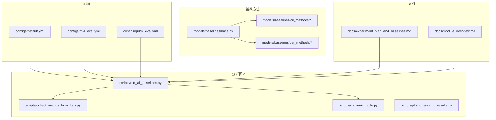
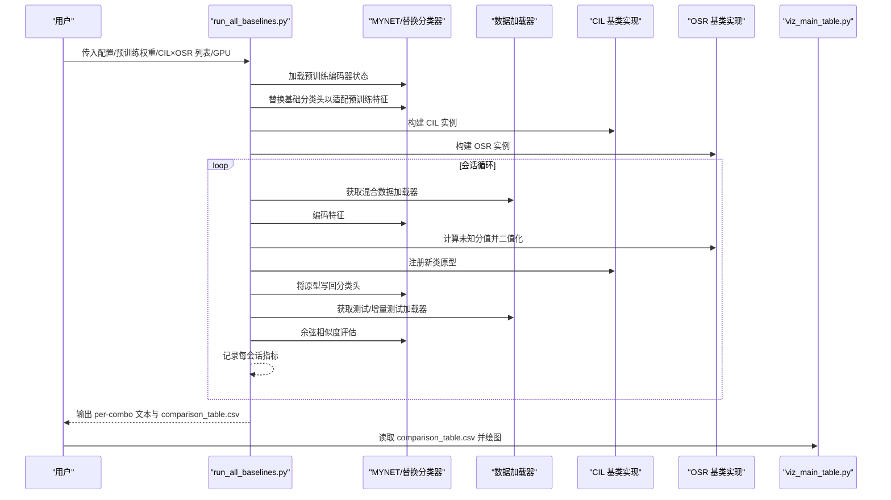
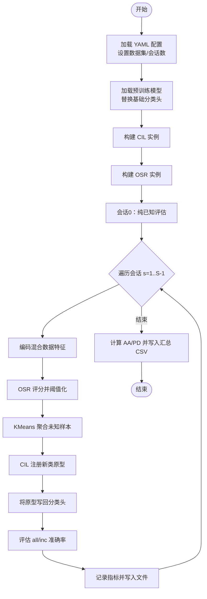
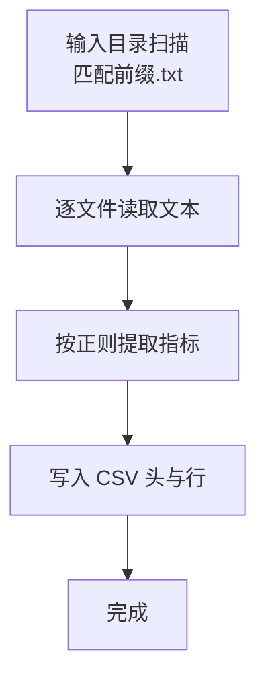
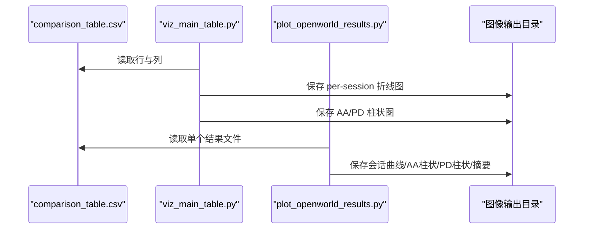
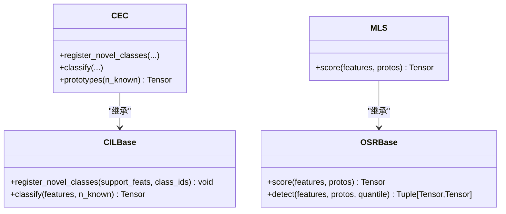
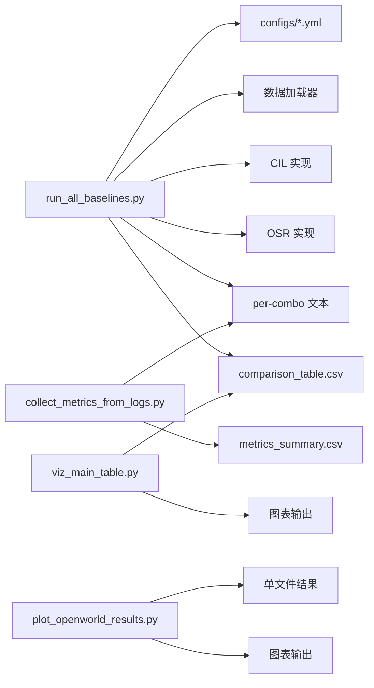

# 综合分析工具

<cite>
**本文引用的文件**
- [scripts/run_all_baselines.py](file://scripts/run_all_baselines.py)
- [scripts/collect_metrics_from_logs.py](file://scripts/collect_metrics_from_logs.py)
- [scripts/viz_main_table.py](file://scripts/viz_main_table.py)
- [scripts/plot_openworld_results.py](file://scripts/plot_openworld_results.py)
- [configs/default.yml](file://configs/default.yml)
- [configs/mid_eval.yml](file://configs/mid_eval.yml)
- [configs/quick_eval.yml](file://configs/quick_eval.yml)
- [models/baselines/__init__.py](file://models/baselines/__init__.py)
- [models/baselines/base.py](file://models/baselines/base.py)
- [models/baselines/cil_methods/__init__.py](file://models/baselines/cil_methods/__init__.py)
- [models/baselines/cil_methods/cec.py](file://models/baselines/cil_methods/cec.py)
- [models/baselines/osr_methods/__init__.py](file://models/baselines/osr_methods/__init__.py)
- [models/baselines/osr_methods/mls.py](file://models/baselines/osr_methods/mls.py)
- [docs/experiment_plan_and_baselines.md](file://docs/experiment_plan_and_baselines.md)
- [docs/module_overview.md](file://docs/module_overview.md)
- [train_unopenset.py](file://train_unopenset.py)
</cite>

## 目录
1. [引言](#引言)
2. [项目结构](#项目结构)
3. [核心组件](#核心组件)
4. [架构总览](#架构总览)
5. [详细组件分析](#详细组件分析)
6. [依赖分析](#依赖分析)
7. [性能考虑](#性能考虑)
8. [故障排查指南](#故障排查指南)
9. [结论](#结论)
10. [附录](#附录)

## 引言
本文件系统化梳理并说明综合分析工具的脚本与模块，重点覆盖以下目标：
- 解释批量运行基线方法的流程与参数配置，涵盖不同 CIL/OSR 算法组合的自动化执行。
- 解释日志收集与指标提取方法，从实验日志中自动抽取性能指标与统计量。
- 提供实验结果汇总与对比分析的工具链，包括多算法性能比较与统计显著性检验思路。
- 构建从数据收集到结果展示的全流程自动化分析流水线，并给出实际使用场景与最佳实践。

## 项目结构
该仓库围绕“开放世界少样本持续学习（Open-World Few-Shot Continual Learning）”任务组织，核心由以下部分构成：
- 配置文件：统一管理训练/评估超参数与数据集协议。
- 基线方法：CIL（类增量学习）与 OSR（开放集识别）两大类方法的注册与实现。
- 分析脚本：批量运行、日志解析、结果可视化与汇总。
- 文档：实验计划与模块概览，指导公平对比与指标输出。

图表来源
- [configs/default.yml:1-88](file://configs/default.yml#L1-L88)
- [configs/mid_eval.yml:1-88](file://configs/mid_eval.yml#L1-L88)
- [configs/quick_eval.yml:1-88](file://configs/quick_eval.yml#L1-L88)
- [models/baselines/base.py:1-76](file://models/baselines/base.py#L1-L76)
- [models/baselines/cil_methods/__init__.py:1-22](file://models/baselines/cil_methods/__init__.py#L1-L22)
- [models/baselines/osr_methods/__init__.py:1-22](file://models/baselines/osr_methods/__init__.py#L1-L22)
- [scripts/run_all_baselines.py:1-282](file://scripts/run_all_baselines.py#L1-L282)
- [scripts/collect_metrics_from_logs.py:1-67](file://scripts/collect_metrics_from_logs.py#L1-L67)
- [scripts/viz_main_table.py:1-83](file://scripts/viz_main_table.py#L1-L83)
- [scripts/plot_openworld_results.py:1-128](file://scripts/plot_openworld_results.py#L1-L128)
- [docs/experiment_plan_and_baselines.md:1-30](file://docs/experiment_plan_and_baselines.md#L1-L30)
- [docs/module_overview.md:1-51](file://docs/module_overview.md#L1-L51)

章节来源
- [configs/default.yml:1-88](file://configs/default.yml#L1-L88)
- [configs/mid_eval.yml:1-88](file://configs/mid_eval.yml#L1-L88)
- [configs/quick_eval.yml:1-88](file://configs/quick_eval.yml#L1-L88)
- [models/baselines/__init__.py:1-16](file://models/baselines/__init__.py#L1-L16)
- [models/baselines/base.py:1-76](file://models/baselines/base.py#L1-L76)
- [models/baselines/cil_methods/__init__.py:1-22](file://models/baselines/cil_methods/__init__.py#L1-L22)
- [models/baselines/osr_methods/__init__.py:1-22](file://models/baselines/osr_methods/__init__.py#L1-L22)
- [scripts/run_all_baselines.py:1-282](file://scripts/run_all_baselines.py#L1-L282)
- [scripts/collect_metrics_from_logs.py:1-67](file://scripts/collect_metrics_from_logs.py#L1-L67)
- [scripts/viz_main_table.py:1-83](file://scripts/viz_main_table.py#L1-L83)
- [scripts/plot_openworld_results.py:1-128](file://scripts/plot_openworld_results.py#L1-L128)
- [docs/experiment_plan_and_baselines.md:1-30](file://docs/experiment_plan_and_baselines.md#L1-L30)
- [docs/module_overview.md:1-51](file://docs/module_overview.md#L1-L51)

## 核心组件
- 批量运行脚本：统一驱动 CIL×OSR 组合的全会话增量流程，输出每会话指标与汇总 CSV。
- 日志收集脚本：从指定目录匹配前缀文本文件，按固定模式抽取关键指标。
- 可视化脚本：读取汇总 CSV 或会话结果文件，绘制趋势曲线与聚合柱状图。
- 基线接口与实现：CIL/OSR 基类与具体方法注册，支撑统一的特征编码、评分与原型更新流程。
- 配置系统：以 YAML 描述训练/评估参数，驱动数据集与会话规划。

章节来源
- [scripts/run_all_baselines.py:1-282](file://scripts/run_all_baselines.py#L1-L282)
- [scripts/collect_metrics_from_logs.py:1-67](file://scripts/collect_metrics_from_logs.py#L1-L67)
- [scripts/viz_main_table.py:1-83](file://scripts/viz_main_table.py#L1-L83)
- [scripts/plot_openworld_results.py:1-128](file://scripts/plot_openworld_results.py#L1-L128)
- [models/baselines/base.py:1-76](file://models/baselines/base.py#L1-L76)
- [models/baselines/cil_methods/__init__.py:1-22](file://models/baselines/cil_methods/__init__.py#L1-L22)
- [models/baselines/osr_methods/__init__.py:1-22](file://models/baselines/osr_methods/__init__.py#L1-L22)
- [configs/default.yml:1-88](file://configs/default.yml#L1-L88)

## 架构总览
下图展示了从“批量运行基线”到“结果可视化”的端到端流程，以及关键模块间的依赖关系。

图表来源
- [scripts/run_all_baselines.py:103-225](file://scripts/run_all_baselines.py#L103-L225)
- [models/baselines/base.py:11-55](file://models/baselines/base.py#L11-L55)
- [models/baselines/cil_methods/cec.py:41-83](file://models/baselines/cil_methods/cec.py#L41-L83)
- [models/baselines/osr_methods/mls.py:15-26](file://models/baselines/osr_methods/mls.py#L15-L26)
- [scripts/viz_main_table.py:30-78](file://scripts/viz_main_table.py#L30-L78)

## 详细组件分析

### 批量运行基线方法（run_all_baselines.py）
- 功能概述
  - 自动遍历给定的 CIL 与 OSR 方法列表，执行完整的会话增量流程。
  - 每个组合输出独立文本文件与汇总 CSV，包含会话级指标与聚合统计。
- 关键流程
  - 预处理：加载配置、设置 GPU、准备数据集信息。
  - 初始化：加载预训练编码器，替换基础分类头，构建 CIL/OSR 实例。
  - 会话循环：编码混合数据、OSR 评分与未知/已知分割、KMeans 聚合伪标签、CIL 注册新原型、更新分类头、评估 all/inc 准确率。
  - 指标计算：记录 known/unknown/f1/inc/all，计算 AA 与 PD。
  - 结果落盘：逐组合写入文本文件；汇总 CSV 包含 AA_all、AA_inc、PD_all 与各会话 inc/all。
- 参数与配置
  - --config：选择 configs/default.yml、mid_eval.yml 或 quick_eval.yml。
  - --pretrained：预训练检查点路径。
  - --cil/--osr：方法名列表，默认使用内置集合。
  - --out_dir：输出目录。
  - --gpu：GPU 设备号。
- 使用示例（命令行）
  - python -m scripts.run_all_baselines --config configs/default.yml --pretrained save/base_train_for_meta_ls.pth --cil cec amfo pan --osr mls tane nci

图表来源
- [scripts/run_all_baselines.py:193-277](file://scripts/run_all_baselines.py#L193-L277)

章节来源
- [scripts/run_all_baselines.py:1-282](file://scripts/run_all_baselines.py#L1-L282)
- [configs/default.yml:1-88](file://configs/default.yml#L1-L88)
- [configs/mid_eval.yml:1-88](file://configs/mid_eval.yml#L1-L88)
- [configs/quick_eval.yml:1-88](file://configs/quick_eval.yml#L1-L88)

### 日志收集与指标提取（collect_metrics_from_logs.py）
- 功能概述
  - 从 save_result 目录中筛选以指定前缀命名的文本文件，使用正则提取关键指标。
- 支持指标
  - 会话0准确率、已知/未知/整体/增量准确率、F1、以及对应的性能下降（PD）指标。
- 输出
  - 生成 metrics_summary.csv，包含文件名与上述指标列。
- 使用示例（命令行）
  - python -m scripts.collect_metrics_from_logs --input_dir save_result --prefix test_result --output_csv save_result/metrics_summary.csv

图表来源
- [scripts/collect_metrics_from_logs.py:27-62](file://scripts/collect_metrics_from_logs.py#L27-L62)

章节来源
- [scripts/collect_metrics_from_logs.py:1-67](file://scripts/collect_metrics_from_logs.py#L1-L67)

### 结果可视化（viz_main_table.py 与 plot_openworld_results.py）
- viz_main_table.py
  - 读取 comparison_table.csv，绘制两类图：
    - 每会话 all-class 准确率折线图（按 CIL-OSR 分组）。
    - AA_all、AA_inc、PD_all 的分组柱状图。
  - 可选叠加自定义“Ours”行，便于对比。
- plot_openworld_results.py
  - 从单个结果文本解析会话曲线与 AA/PD 指标，生成折线图与柱状图，并输出摘要文本。

图表来源
- [scripts/viz_main_table.py:21-78](file://scripts/viz_main_table.py#L21-L78)
- [scripts/plot_openworld_results.py:8-124](file://scripts/plot_openworld_results.py#L8-L124)

章节来源
- [scripts/viz_main_table.py:1-83](file://scripts/viz_main_table.py#L1-L83)
- [scripts/plot_openworld_results.py:1-128](file://scripts/plot_openworld_results.py#L1-L128)

### 基线接口与实现（CIL/OSR）
- 接口设计
  - CILBase：要求实现 register_novel_classes 与 classify，统一原型银行与余弦相似度打分。
  - OSRBase：要求实现 score，返回越大越可能未知；提供 detect 基于分位数阈值的二值化。
- 典型实现
  - CEC：基于多头自注意力的原型演化，冻结编码器，仅更新原型。
  - MLS：最大 logit 得分的 OSR 方案，未知得分越高越可能未知。

图表来源
- [models/baselines/base.py:11-55](file://models/baselines/base.py#L11-L55)
- [models/baselines/cil_methods/cec.py:41-83](file://models/baselines/cil_methods/cec.py#L41-L83)
- [models/baselines/osr_methods/mls.py:15-26](file://models/baselines/osr_methods/mls.py#L15-L26)

章节来源
- [models/baselines/base.py:1-76](file://models/baselines/base.py#L1-L76)
- [models/baselines/cil_methods/cec.py:1-83](file://models/baselines/cil_methods/cec.py#L1-L83)
- [models/baselines/osr_methods/mls.py:1-26](file://models/baselines/osr_methods/mls.py#L1-L26)

### 配置系统（YAML）
- default.yml/mid_eval.yml/quick_eval.yml
  - 统一描述 way、shot、num_session、num_base、num_novel、num_all、学习率/优化器/调度器、数据加载器参数等。
  - 通过最小 YAML 解析函数转换为命名空间，供 run_all_baselines 使用。

章节来源
- [configs/default.yml:1-88](file://configs/default.yml#L1-L88)
- [configs/mid_eval.yml:1-88](file://configs/mid_eval.yml#L1-L88)
- [configs/quick_eval.yml:1-88](file://configs/quick_eval.yml#L1-L88)
- [scripts/run_all_baselines.py:56-76](file://scripts/run_all_baselines.py#L56-L76)

## 依赖分析
- 组件耦合
  - run_all_baselines 依赖配置系统、数据加载器、CIL/OSR 实现与评估工具。
  - collect_metrics_from_logs 与 viz_main_table 依赖固定文件命名与字段格式。
- 外部依赖
  - PyTorch、sklearn、matplotlib、pandas/numpy（在可视化脚本中使用）。
- 潜在风险
  - 文件命名/字段变更可能导致日志解析失败。
  - GPU/CPU 设备切换需确保张量设备一致。

图表来源
- [scripts/run_all_baselines.py:228-277](file://scripts/run_all_baselines.py#L228-L277)
- [scripts/collect_metrics_from_logs.py:36-62](file://scripts/collect_metrics_from_logs.py#L36-L62)
- [scripts/viz_main_table.py:30-78](file://scripts/viz_main_table.py#L30-L78)
- [scripts/plot_openworld_results.py:62-124](file://scripts/plot_openworld_results.py#L62-L124)

章节来源
- [scripts/run_all_baselines.py:1-282](file://scripts/run_all_baselines.py#L1-L282)
- [scripts/collect_metrics_from_logs.py:1-67](file://scripts/collect_metrics_from_logs.py#L1-L67)
- [scripts/viz_main_table.py:1-83](file://scripts/viz_main_table.py#L1-L83)
- [scripts/plot_openworld_results.py:1-128](file://scripts/plot_openworld_results.py#L1-L128)

## 性能考虑
- 批量运行
  - 合理设置 --gpu 与 CUDA_VISIBLE_DEVICES，避免多进程争抢显存。
  - 使用 quick_eval.yml 进行快速回归或调试，default.yml/mid_eval.yml 用于标准评估。
- 特征编码与评分
  - encode_loader 与 _plain_cosine_eval 使用 eval 模式与 no_grad，减少内存与计算开销。
- 聚类与原型更新
  - KMeans 初始化次数与标签对齐策略影响稳定性，必要时调整 n_init 与聚类数量。
- 可视化
  - 大量方法组合时，matplotlib 图像保存可能占用磁盘，建议控制输出分辨率与目录清理。

## 故障排查指南
- 无法找到预训练权重
  - 确认 --pretrained 路径存在且包含 params 键或权重字典。
- GPU 内存不足
  - 降低 --batch_size（若直接使用训练脚本）、切换 quick_eval.yml、或减少 num_session。
- 会话指标为空
  - 检查 save_result 下是否存在 per-combo 文本文件，确认 run_all_baselines 正常写入。
- 日志解析失败
  - 确认 save_result 下文件以 --prefix 前缀命名且包含预期指标关键字。
- 可视化报错
  - 确保 comparison_table.csv 字段与 viz_main_table 期望一致；plot_openworld_results 需要单文件中的会话曲线与 AA/PD 段落。

章节来源
- [scripts/run_all_baselines.py:228-277](file://scripts/run_all_baselines.py#L228-L277)
- [scripts/collect_metrics_from_logs.py:36-62](file://scripts/collect_metrics_from_logs.py#L36-L62)
- [scripts/viz_main_table.py:30-78](file://scripts/viz_main_table.py#L30-L78)
- [scripts/plot_openworld_results.py:62-124](file://scripts/plot_openworld_results.py#L62-L124)

## 结论
本工具链提供了从“批量基线运行—日志收集—结果汇总—可视化展示”的完整闭环。通过统一的配置与接口抽象，能够高效地比较不同 CIL/OSR 组合在开放世界持续学习任务上的表现，并以图形化方式呈现趋势与聚合指标。结合实验计划文档，可在公平设置下进行消融与泛化分析。

## 附录
- 实际使用场景与最佳实践
  - 快速回归：使用 quick_eval.yml，缩短 num_session 与 test_times，验证流水线正确性。
  - 标准评估：使用 default.yml，确保 80+20、5 会话与足够 test_times，得到稳健的 AA/PD。
  - 多方法对比：在 --cil/--osr 中列出目标方法，一次性跑完所有组合，随后用 viz_main_table 与 plot_openworld_results 进行对比。
  - 结果归档：将 per-combo 文本与 comparison_table.csv、metrics_summary.csv 一并归档，便于后续统计显著性检验与论文复现。
- 统计显著性检验思路
  - 建议在相同随机种子与数据划分下重复多次实验，计算均值与置信区间，再进行非参数检验（如 Wilcoxon）比较不同方法的 AA/PD 差异是否显著。

章节来源
- [docs/experiment_plan_and_baselines.md:1-30](file://docs/experiment_plan_and_baselines.md#L1-L30)
- [docs/module_overview.md:1-51](file://docs/module_overview.md#L1-L51)
- [configs/default.yml:1-88](file://configs/default.yml#L1-L88)
- [configs/quick_eval.yml:1-88](file://configs/quick_eval.yml#L1-L88)