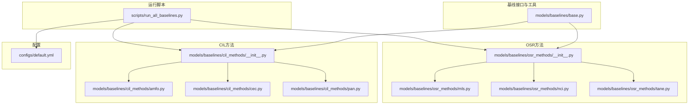
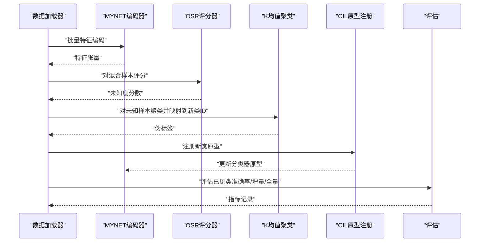
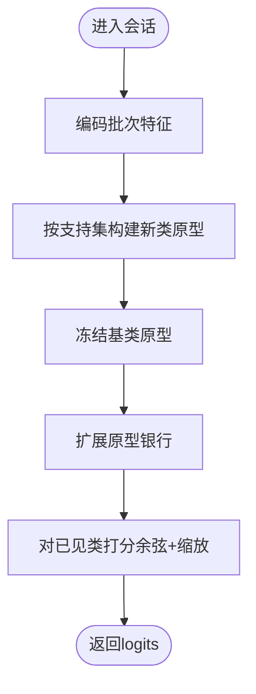
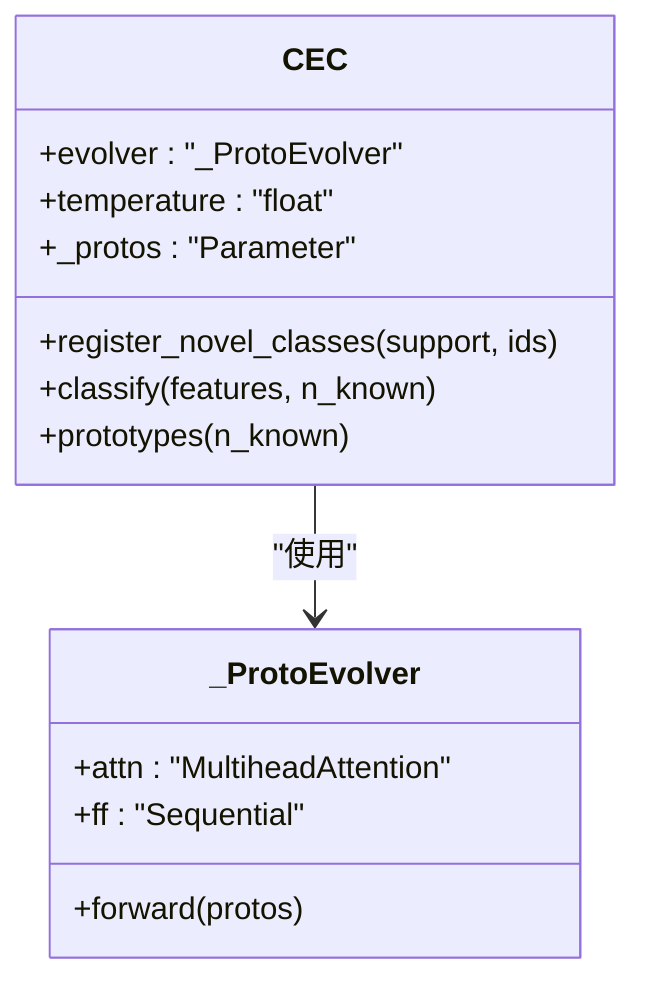
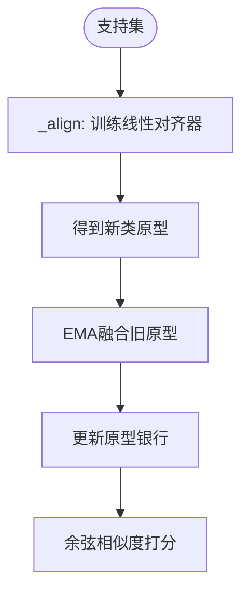
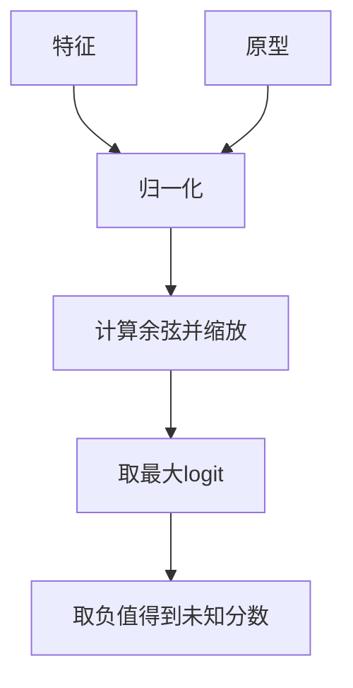
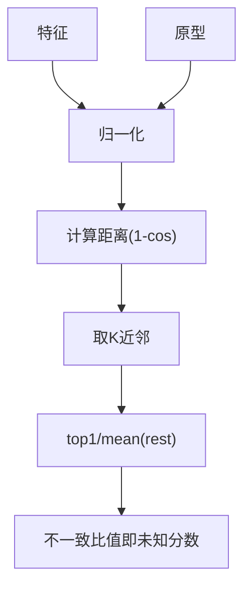
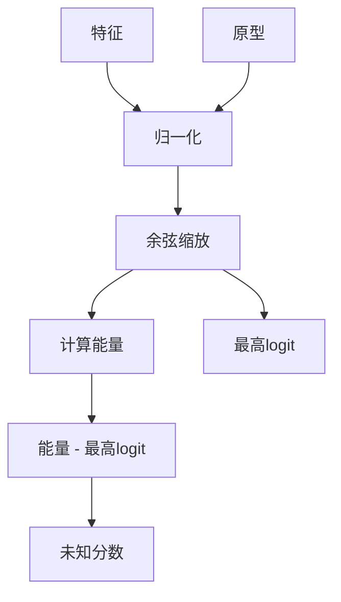
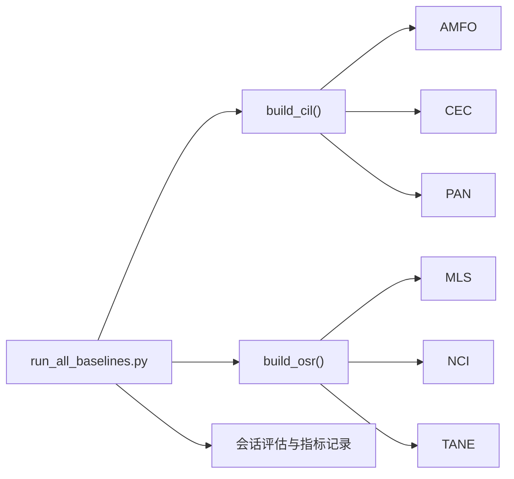

# 基线方法和算法

<cite>
**本文引用的文件**
- [models/baselines/base.py](file://models/baselines/base.py)
- [models/baselines/cil_methods/__init__.py](file://models/baselines/cil_methods/__init__.py)
- [models/baselines/cil_methods/amfo.py](file://models/baselines/cil_methods/amfo.py)
- [models/baselines/cil_methods/cec.py](file://models/baselines/cil_methods/cec.py)
- [models/baselines/cil_methods/pan.py](file://models/baselines/cil_methods/pan.py)
- [models/baselines/osr_methods/__init__.py](file://models/baselines/osr_methods/__init__.py)
- [models/baselines/osr_methods/mls.py](file://models/baselines/osr_methods/mls.py)
- [models/baselines/osr_methods/nci.py](file://models/baselines/osr_methods/nci.py)
- [models/baselines/osr_methods/tane.py](file://models/baselines/osr_methods/tane.py)
- [scripts/run_all_baselines.py](file://scripts/run_all_baselines.py)
- [configs/default.yml](file://configs/default.yml)
- [docs/experiment_plan_and_baselines.md](file://docs/experiment_plan_and_baselines.md)
</cite>

## 目录
1. [引言](#引言)
2. [项目结构](#项目结构)
3. [核心组件](#核心组件)
4. [架构总览](#架构总览)
5. [详细组件分析](#详细组件分析)
6. [依赖关系分析](#依赖关系分析)
7. [性能考量](#性能考量)
8. [故障排查指南](#故障排查指南)
9. [结论](#结论)
10. [附录](#附录)

## 引言
本文件面向VAZE项目中的“基线方法与算法”，聚焦两类主流范式：
- 类增量学习（Class-Incremental Learning, CIL）：AMFO、CEC、PAN
- 开放集识别（Open-Set Recognition, OSR）：MLS、NCI、TANE

内容涵盖：
- 数学原理与算法流程
- 参数配置与使用要点
- 性能对比与适用性分析
- 算法集成与组合使用建议
- 代码示例路径与实践模式

## 项目结构
本节聚焦与基线方法直接相关的目录与文件：
- models/baselines/base.py：CIL/OSR统一接口与通用工具
- models/baselines/cil_methods/*：CIL方法实现与注册
- models/baselines/osr_methods/*：OSR方法实现与注册
- scripts/run_all_baselines.py：端到端的CIL×OSR组合评估脚本
- configs/default.yml：默认训练/评估配置
- docs/experiment_plan_and_baselines.md：实验计划与对比基线说明

**图表来源**
- [models/baselines/base.py:1-76](file://models/baselines/base.py#L1-L76)
- [models/baselines/cil_methods/__init__.py:1-22](file://models/baselines/cil_methods/__init__.py#L1-L22)
- [models/baselines/osr_methods/__init__.py:1-22](file://models/baselines/osr_methods/__init__.py#L1-L22)
- [scripts/run_all_baselines.py:1-282](file://scripts/run_all_baselines.py#L1-L282)
- [configs/default.yml:1-88](file://configs/default.yml#L1-L88)

**章节来源**
- [models/baselines/base.py:1-76](file://models/baselines/base.py#L1-L76)
- [models/baselines/cil_methods/__init__.py:1-22](file://models/baselines/cil_methods/__init__.py#L1-L22)
- [models/baselines/osr_methods/__init__.py:1-22](file://models/baselines/osr_methods/__init__.py#L1-L22)
- [scripts/run_all_baselines.py:1-282](file://scripts/run_all_baselines.py#L1-L282)
- [configs/default.yml:1-88](file://configs/default.yml#L1-L88)

## 核心组件
- CILBase：定义CIL方法必须实现的接口：注册新类原型与推理打分
- OSRBase：定义OSR方法的评分接口与阈值检测
- cosine_logits：余弦相似度打分的标准化实现
- build_prototype_from_support：从支持集构建原型
- CIL注册表：CEC/AMFO/PAN
- OSR注册表：MLS/NCI/TANE

关键职责与交互：
- CIL方法在增量会话中仅更新“新类原型”，保持已见类稳定
- OSR方法对混合（已知+未知）样本进行打分，输出“更可能未知”的分数
- 两者通过统一的评估流水线在每个会话中协作：先OSR分出未知，再用K均值伪标签，最后CIL注册新原型

**章节来源**
- [models/baselines/base.py:11-76](file://models/baselines/base.py#L11-L76)
- [models/baselines/cil_methods/__init__.py:7-18](file://models/baselines/cil_methods/__init__.py#L7-L18)
- [models/baselines/osr_methods/__init__.py:7-18](file://models/baselines/osr_methods/__init__.py#L7-L18)

## 架构总览
下图展示了CIL×OSR组合在增量会话中的端到端流程。

**图表来源**
- [scripts/run_all_baselines.py:103-171](file://scripts/run_all_baselines.py#L103-L171)
- [models/baselines/osr_methods/mls.py:20-26](file://models/baselines/osr_methods/mls.py#L20-L26)
- [models/baselines/osr_methods/nci.py:20-31](file://models/baselines/osr_methods/nci.py#L20-L31)
- [models/baselines/osr_methods/tane.py:21-29](file://models/baselines/osr_methods/tane.py#L21-L29)
- [models/baselines/cil_methods/cec.py:52-83](file://models/baselines/cil_methods/cec.py#L52-L83)
- [models/baselines/cil_methods/amfo.py:30-65](file://models/baselines/cil_methods/amfo.py#L30-L65)
- [models/baselines/cil_methods/pan.py:77-109](file://models/baselines/cil_methods/pan.py#L77-L109)

## 详细组件分析

### CIL方法：AMFO（Angular Margin Few-shot Optimization）
- 核心思想
  - 在余弦logits上施加“加性角边距”；训练时对真类通道加入角度偏移，推理时直接缩放余弦相似度
  - 基类原型在预训练后冻结，仅扩展新类原型
- 数学要点
  - 推理：logits = scale × cos(θ)
  - 训练：对真类通道添加margin，logits = scale × cos(θ + margin)
- 实现要点
  - register_novel_classes：按类ID扩展原型银行，并对新类原型做归一化
  - classify：仅对当前“已见类”原型打分
- 参数
  - amfo_margin：角边距大小
  - amfo_scale：温度缩放
  - base_class：基类数量（用于区分基类/新类）

**图表来源**
- [models/baselines/cil_methods/amfo.py:30-65](file://models/baselines/cil_methods/amfo.py#L30-L65)

**章节来源**
- [models/baselines/cil_methods/amfo.py:1-65](file://models/baselines/cil_methods/amfo.py#L1-L65)

### CIL方法：CEC（Continually Evolved Classifiers）
- 核心思想
  - 使用轻量多头自注意力作为“原型演化器”，在每个会话中让所有原型相互作用以刷新
  - 编码器冻结，仅原型演化
- 数学要点
  - 余弦相似度打分：logits = temperature × cos(f, p)
  - 原型经自注意力聚合得到“演化后原型”
- 实现要点
  - _ProtoEvolver：单层多头自注意力 + FFN + LayerNorm
  - register_novel_classes：扩展原型银行并经演化器刷新
  - classify：对已见类原型打分
- 参数
  - cec_heads：注意力头数
  - cec_temperature：打分温度
  - base_classifier权重来自预训练模型

**图表来源**
- [models/baselines/cil_methods/cec.py:19-83](file://models/baselines/cil_methods/cec.py#L19-L83)

**章节来源**
- [models/baselines/cil_methods/cec.py:1-83](file://models/baselines/cil_methods/cec.py#L1-L83)

### CIL方法：PAN（Prototype Alignment Network）
- 核心思想
  - 新类原型通过“对比学习+EMA”对齐到当前流形：一边用支持集训练线性对齐器，使同类靠近、异类分离；一边对旧原型做指数滑动融合
- 数学要点
  - 对齐目标：最小化对比损失，使同类原型靠近、不同原型拉开
  - EMA融合：new = ema × old + (1-ema) × new_proto
- 实现要点
  - _align：在支持集上训练线性对齐器，得到“精炼的新类原型”
  - register_novel_classes：合并旧/新原型并冻结
  - classify：余弦相似度打分
- 参数
  - pan_ema：EMA系数
  - pan_align_steps：对齐优化步数
  - pan_align_lr：对齐学习率
  - pan_temperature：打分温度

**图表来源**
- [models/baselines/cil_methods/pan.py:38-109](file://models/baselines/cil_methods/pan.py#L38-L109)

**章节来源**
- [models/baselines/cil_methods/pan.py:1-109](file://models/baselines/cil_methods/pan.py#L1-L109)

### OSR方法：MLS（Maximum Logit Score）
- 核心思想
  - 未知分数 = -max_c(scale × cos(f, proto_c))
  - 分数越高越可能未知
- 参数
  - mls_scale：缩放因子

**图表来源**
- [models/baselines/osr_methods/mls.py:20-26](file://models/baselines/osr_methods/mls.py#L20-L26)

**章节来源**
- [models/baselines/osr_methods/mls.py:1-26](file://models/baselines/osr_methods/mls.py#L1-L26)

### OSR方法：NCI（Nearest-Class Inconsistency）
- 核心思想
  - 对每个样本取其K近邻类别，定义不一致性 = dist(top1)/mean(dist[top2..K])
  - 比值接近1表示歧义大（未知），否则为已知
- 参数
  - nci_topk：K值

**图表来源**
- [models/baselines/osr_methods/nci.py:20-31](file://models/baselines/osr_methods/nci.py#L20-L31)

**章节来源**
- [models/baselines/osr_methods/nci.py:1-31](file://models/baselines/osr_methods/nci.py#L1-L31)

### OSR方法：TANE（Top-k Angle Normalized Energy）
- 核心思想
  - 能量 = -T × logsumexp(logits/T)，并减去最高logit，强调最佳与次佳之间的差距
  - 分数越高越可能未知
- 参数
  - tane_scale：缩放因子
  - tane_temperature：能量温度

**图表来源**
- [models/baselines/osr_methods/tane.py:21-29](file://models/baselines/osr_methods/tane.py#L21-L29)

**章节来源**
- [models/baselines/osr_methods/tane.py:1-29](file://models/baselines/osr_methods/tane.py#L1-L29)

## 依赖关系分析
- CIL方法依赖CILBase接口，共享cosine_logits与原型构建工具
- OSR方法依赖OSRBase接口，提供统一的detect阈值策略
- 运行脚本run_all_baselines.py负责：
  - 加载预训练模型与替换分类头
  - 逐会话编码特征、OSR评分、K均值伪标签、CIL注册、评估指标
  - 输出文本日志与汇总CSV

**图表来源**
- [scripts/run_all_baselines.py:193-225](file://scripts/run_all_baselines.py#L193-L225)
- [models/baselines/cil_methods/__init__.py:14-18](file://models/baselines/cil_methods/__init__.py#L14-L18)
- [models/baselines/osr_methods/__init__.py:14-18](file://models/baselines/osr_methods/__init__.py#L14-L18)

**章节来源**
- [scripts/run_all_baselines.py:193-225](file://scripts/run_all_baselines.py#L193-L225)
- [models/baselines/cil_methods/__init__.py:14-18](file://models/baselines/cil_methods/__init__.py#L14-L18)
- [models/baselines/osr_methods/__init__.py:14-18](file://models/baselines/osr_methods/__init__.py#L14-L18)

## 性能考量
- 计算复杂度
  - CIL：主要为余弦相似度矩阵乘，O(B×C×D)，其中B为批大小，C为类别数，D为特征维
  - OSR：打分O(B×C)，K均值聚类O(N×K×I×D)，I为迭代次数
- 训练稳定性
  - AMFO：通过冻结基类原型与角边距，降低灾难性遗忘风险
  - CEC：自注意力演化需注意过拟合，建议控制heads与temperature
  - PAN：EMA融合与对比对齐双管齐下，适合小样本增量
- 未知识别
  - MLS：简单稳健，适合快速部署
  - NCI：对K敏感，K过大易误判，K过小易漏判
  - TANE：能量项强调类别边界，适合类别间边界清晰的数据

[本节为通用性能讨论，无需具体文件来源]

## 故障排查指南
- 常见问题与定位
  - 原型形状不匹配：register_novel_classes会扩展原型银行，若class_ids越界或维度不一致会导致报错
  - 设备不一致：特征与原型需在同一设备上，注意CUDA/CPU切换
  - K均值无效聚类：当未知样本数少于聚类数或标签映射为空时，需检查OSR阈值与伪标签映射
- 建议步骤
  - 打印特征/原型形状与设备信息
  - 检查OSR评分分布与阈值分位数
  - 校验novel_ids与映射字典
  - 确认CIL原型写回model.fc.weight的尺寸扩展逻辑

**章节来源**
- [scripts/run_all_baselines.py:103-171](file://scripts/run_all_baselines.py#L103-L171)

## 结论
- AMFO：简单高效，适合小样本增量且需稳定基类表现的场景
- CEC：利用原型间交互演化，适合类别关系复杂、需动态刷新原型的场景
- PAN：纯推理对齐+EMA融合，适合资源受限或无法额外标注的增量场景
- OSR三兄弟：MLS稳健、NCI灵活、TANE强调边界，可根据数据特性选择
- 组合策略：以OSR先行筛选未知，再以K均值伪标签驱动CIL注册，形成闭环

[本节为总结性内容，无需具体文件来源]

## 附录

### 参数配置与使用要点
- 默认配置（示例字段）
  - 训练：way/shot/session/num_base/num_novel/num_all/epochs/lr/scheduler/optimizer
  - 数据：num_workers/train_batch_size/test_batch_size
  - 提取器：sample_rate/window_size/hop_size/mel_bins/fmin/fmax/window
- CIL参数
  - AMFO：amfo_margin、amfo_scale、base_class
  - CEC：cec_heads、cec_temperature
  - PAN：pan_ema、pan_align_steps、pan_align_lr、pan_temperature
- OSR参数
  - MLS：mls_scale
  - NCI：nci_topk
  - TANE：tane_scale、tane_temperature

**章节来源**
- [configs/default.yml:1-88](file://configs/default.yml#L1-L88)

### 代码示例与使用模式
- 运行CIL×OSR组合评估
  - 示例命令（来自脚本注释）：python -m scripts.run_all_baselines --config configs/default.yml --pretrained save/base_train_for_meta_ls.pth --cil cec amfo pan --osr mls tane nci
  - 关键流程路径：
    - 加载预训练权重与替换分类头：[scripts/run_all_baselines.py:196-204](file://scripts/run_all_baselines.py#L196-L204)
    - 逐会话编码与OSR评分：[scripts/run_all_baselines.py:103-120](file://scripts/run_all_baselines.py#L103-L120)
    - K均值伪标签与CIL注册：[scripts/run_all_baselines.py:120-152](file://scripts/run_all_baselines.py#L120-L152)
    - 已见类/增量/全量评估：[scripts/run_all_baselines.py:153-187](file://scripts/run_all_baselines.py#L153-L187)
- 单独使用CIL
  - 构建CIL实例：[models/baselines/cil_methods/__init__.py:14-18](file://models/baselines/cil_methods/__init__.py#L14-L18)
  - 注册新类原型：[models/baselines/cil_methods/cec.py:52-74](file://models/baselines/cil_methods/cec.py#L52-L74)、[models/baselines/cil_methods/amfo.py:30-49](file://models/baselines/cil_methods/amfo.py#L30-L49)、[models/baselines/cil_methods/pan.py:77-103](file://models/baselines/cil_methods/pan.py#L77-L103)
  - 推理打分：[models/baselines/cil_methods/cec.py:77-83](file://models/baselines/cil_methods/cec.py#L77-L83)、[models/baselines/cil_methods/amfo.py:52-65](file://models/baselines/cil_methods/amfo.py#L52-L65)、[models/baselines/cil_methods/pan.py:106-109](file://models/baselines/cil_methods/pan.py#L106-L109)
- 单独使用OSR
  - 构建OSR实例：[models/baselines/osr_methods/__init__.py:14-18](file://models/baselines/osr_methods/__init__.py#L14-L18)
  - 评分与检测：[models/baselines/osr_methods/mls.py:20-26](file://models/baselines/osr_methods/mls.py#L20-L26)、[models/baselines/osr_methods/nci.py:20-31](file://models/baselines/osr_methods/nci.py#L20-L31)、[models/baselines/osr_methods/tane.py:21-29](file://models/baselines/osr_methods/tane.py#L21-L29)

**章节来源**
- [scripts/run_all_baselines.py:14-282](file://scripts/run_all_baselines.py#L14-L282)
- [models/baselines/cil_methods/__init__.py:14-18](file://models/baselines/cil_methods/__init__.py#L14-L18)
- [models/baselines/osr_methods/__init__.py:14-18](file://models/baselines/osr_methods/__init__.py#L14-L18)
- [models/baselines/cil_methods/cec.py:52-109](file://models/baselines/cil_methods/cec.py#L52-L109)
- [models/baselines/cil_methods/amfo.py:30-65](file://models/baselines/cil_methods/amfo.py#L30-L65)
- [models/baselines/cil_methods/pan.py:77-109](file://models/baselines/cil_methods/pan.py#L77-L109)
- [models/baselines/osr_methods/mls.py:20-26](file://models/baselines/osr_methods/mls.py#L20-L26)
- [models/baselines/osr_methods/nci.py:20-31](file://models/baselines/osr_methods/nci.py#L20-L31)
- [models/baselines/osr_methods/tane.py:21-29](file://models/baselines/osr_methods/tane.py#L21-L29)

### 算法性能对比与适用性分析
- 实验计划与基线说明（摘自文档）
  - 任务分组：FSCIL-only、OSR-only、Open-world continual、Ours-Base、Ours-Full
  - 公平设置：统一backbone、统一数据协议、统一seed、统一评测轮数
  - 关键结论：Ours-Full在AA Unknown与AA F1上优于FSCIL-only；在PD Known上优于OSR-only；不确定性策略有效
- 本仓库内对比
  - 通过run_all_baselines.py可输出“Session 0”、“Known/Unknown/F1/Incremental/All”等指标，便于横向比较
  - 建议关注：基类保持（Session 0到末尾的下降幅度PD）、增量学习能力（Incremental）、全量学习能力（All）

**章节来源**
- [docs/experiment_plan_and_baselines.md:1-30](file://docs/experiment_plan_and_baselines.md#L1-L30)
- [scripts/run_all_baselines.py:210-225](file://scripts/run_all_baselines.py#L210-L225)

### 算法集成与组合使用指导
- 推荐流程
  - 会话0：仅CIL评估（无OSR）
  - 会话s≥1：特征编码 → OSR评分 → 阈值分割 → K均值伪标签 → CIL注册新类 → 更新模型分类头 → 评估
- 组合策略
  - OSR选择：数据类别边界清晰选TANE；追求稳健选MLS；需捕捉歧义选NCI
  - CIL选择：小样本稳定优先选AMFO；需动态演化选CEC；资源受限选PAN
  - 伪标签映射：确保K均值聚类数与新增类别数一致，映射到“新类ID”区间

**章节来源**
- [scripts/run_all_baselines.py:103-171](file://scripts/run_all_baselines.py#L103-L171)