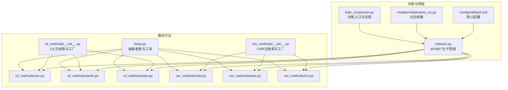
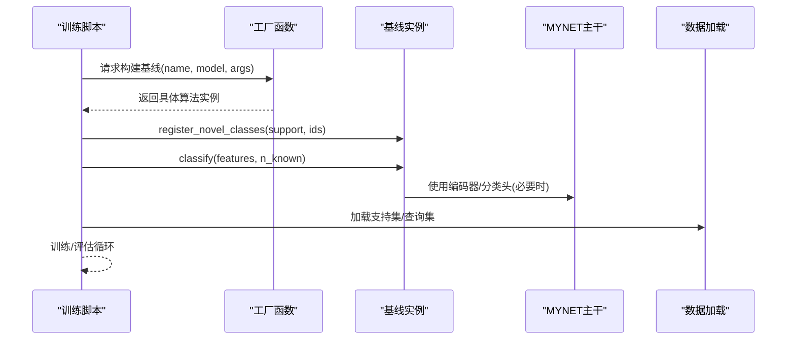
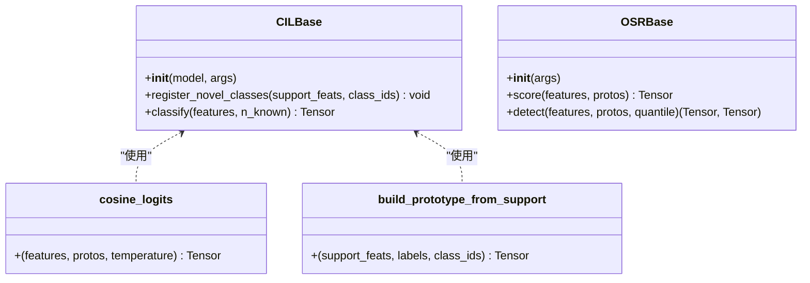
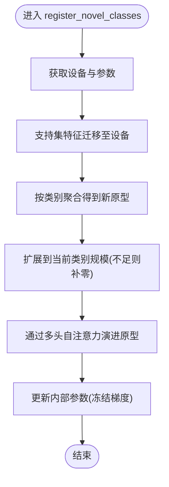
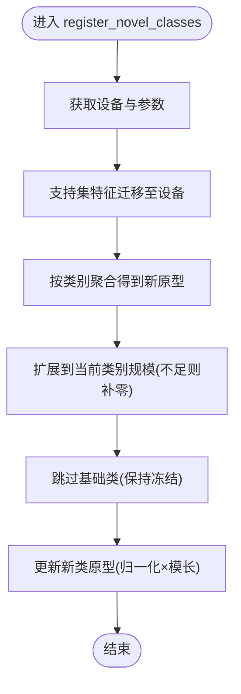
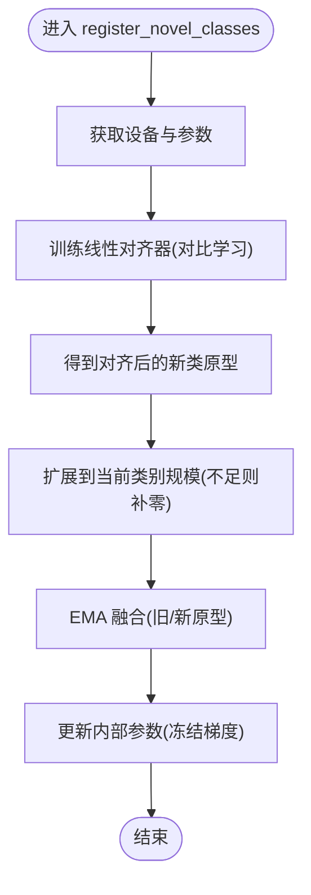
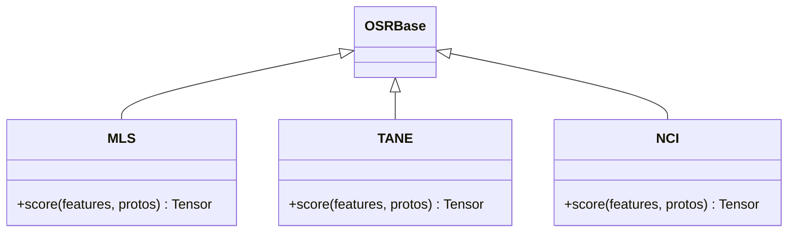
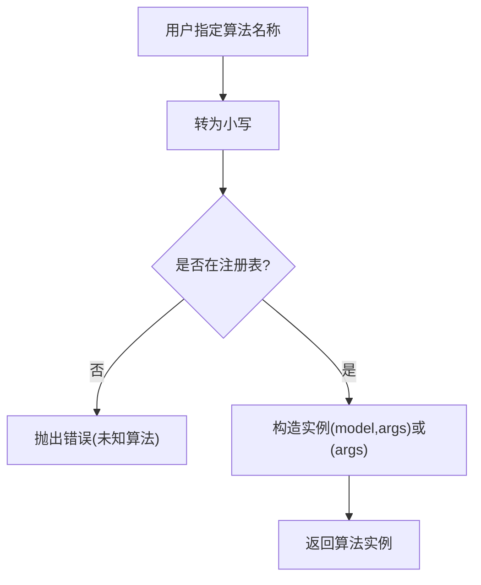
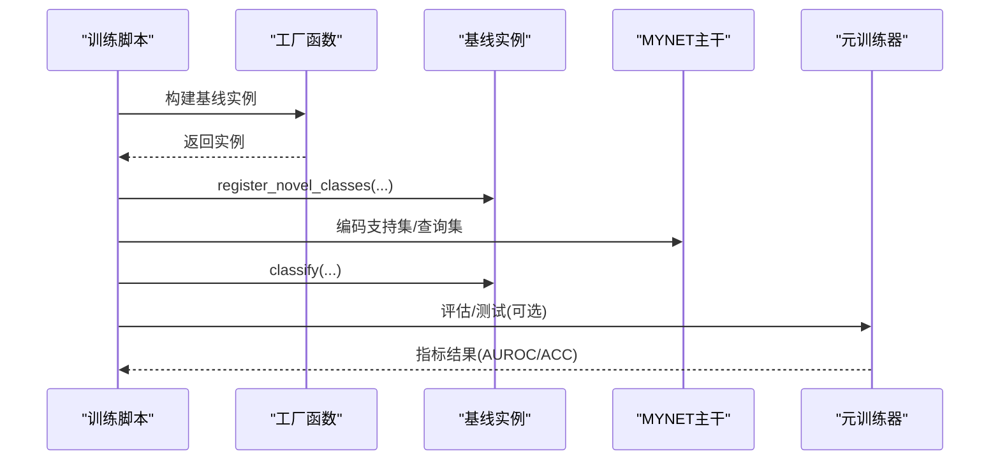
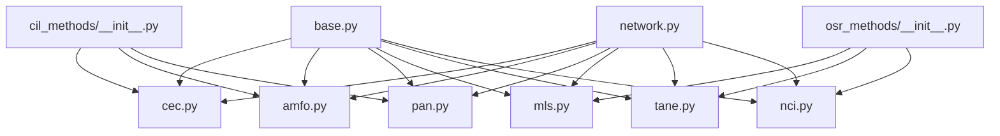

# 基线方法基础框架

<cite>
**本文引用的文件**
- [models/baselines/base.py](file://models/baselines/base.py)
- [models/baselines/__init__.py](file://models/baselines/__init__.py)
- [models/baselines/cil_methods/__init__.py](file://models/baselines/cil_methods/__init__.py)
- [models/baselines/osr_methods/__init__.py](file://models/baselines/osr_methods/__init__.py)
- [models/baselines/cil_methods/cec.py](file://models/baselines/cil_methods/cec.py)
- [models/baselines/cil_methods/amfo.py](file://models/baselines/cil_methods/amfo.py)
- [models/baselines/cil_methods/pan.py](file://models/baselines/cil_methods/pan.py)
- [models/baselines/osr_methods/mls.py](file://models/baselines/osr_methods/mls.py)
- [models/baselines/osr_methods/tane.py](file://models/baselines/osr_methods/tane.py)
- [models/baselines/osr_methods/nci.py](file://models/baselines/osr_methods/nci.py)
- [configs/default.yml](file://configs/default.yml)
- [network.py](file://network.py)
- [train_unopenset.py](file://train_unopenset.py)
- [models/metatrainer_oo.py](file://models/metatrainer_oo.py)
</cite>

## 目录
1. [简介](#简介)
2. [项目结构](#项目结构)
3. [核心组件](#核心组件)
4. [架构总览](#架构总览)
5. [详细组件分析](#详细组件分析)
6. [依赖分析](#依赖分析)
7. [性能考虑](#性能考虑)
8. [故障排查指南](#故障排查指南)
9. [结论](#结论)
10. [附录](#附录)

## 简介
本文件面向 VAZE 项目中的“基线方法基础框架”，系统阐述以下内容：
- 统一接口设计与抽象基类实现
- 通用接口规范、参数配置机制与生命周期管理
- 基线方法与主训练框架的集成方式与调用关系
- 扩展开发指南（新算法接入步骤与最佳实践）
- 注册机制、工厂模式实现与动态加载策略

VAZE 项目围绕增量类学习（Class-Incremental Learning, CIL）与开放集识别（Open-Set Recognition, OSR）两类任务，提供可插拔的基线方法模块，统一由抽象基类定义接口，通过注册表与工厂函数完成动态实例化，并与主训练流程（如元训练、标准训练）协同工作。

## 项目结构
基线方法位于 models/baselines 下，按任务类型划分为 cil_methods 与 osr_methods 两个子包，各自维护注册表与工厂函数。公共接口与工具函数集中在 base.py 中。配置文件 configs/default.yml 提供训练与网络相关参数，network.py 定义主干网络 MYNET，train_unopenset.py 与 models/metatrainer_oo.py 提供训练与评估流程。

图表来源
- [models/baselines/base.py:11-76](file://models/baselines/base.py#L11-L76)
- [models/baselines/cil_methods/__init__.py:7-18](file://models/baselines/cil_methods/__init__.py#L7-L18)
- [models/baselines/osr_methods/__init__.py:7-18](file://models/baselines/osr_methods/__init__.py#L7-L18)
- [network.py:18-49](file://network.py#L18-L49)
- [train_unopenset.py:179-200](file://train_unopenset.py#L179-L200)
- [models/metatrainer_oo.py:17-84](file://models/metatrainer_oo.py#L17-L84)
- [configs/default.yml:1-88](file://configs/default.yml#L1-L88)

章节来源
- [models/baselines/__init__.py:1-16](file://models/baselines/__init__.py#L1-L16)
- [configs/default.yml:1-88](file://configs/default.yml#L1-L88)

## 核心组件
本节聚焦于基线方法的统一接口与抽象基类，以及通用工具函数。

- 抽象基类
  - CILBase：定义增量类学习方法的统一接口，要求实现“新增类别注册”与“分类打分”两个核心方法。
  - OSRBase：定义开放集评分器的统一接口，要求实现“评分函数”，并提供基于分位数的简单自适应阈值检测。
- 通用工具
  - 余弦相似打分函数：对特征与原型进行归一化后计算缩放余弦分数。
  - 支持集原型构建：根据支持集特征与标签聚合得到每类原型。

这些抽象与工具为具体算法（如 CEC、AMFO、PAN、MLS、TANE、NCI）提供了统一的契约与共享能力，保证不同方法在相同接口下被工厂函数动态实例化与调用。

章节来源
- [models/baselines/base.py:11-76](file://models/baselines/base.py#L11-L76)

## 架构总览
基线方法的运行时架构如下：
- 工厂与注册：cil_methods/__init__.py 与 osr_methods/__init__.py 维护注册表与工厂函数，依据名称动态构造具体算法实例。
- 抽象契约：具体算法继承自 CILBase 或 OSRBase，实现 register_novel_classes/classify 或 score/detect。
- 主干网络：MYNET 提供特征提取与分类头，部分基线方法在训练阶段冻结主干，仅更新原型或轻量模块。
- 训练集成：训练脚本通过工厂函数注入基线方法，结合数据加载、优化器与调度器完成训练与评估。

图表来源
- [models/baselines/cil_methods/__init__.py:14-18](file://models/baselines/cil_methods/__init__.py#L14-L18)
- [models/baselines/osr_methods/__init__.py:14-18](file://models/baselines/osr_methods/__init__.py#L14-L18)
- [models/baselines/base.py:21-32](file://models/baselines/base.py#L21-L32)
- [network.py:37-49](file://network.py#L37-L49)

## 详细组件分析

### 抽象基类与工具函数
- CILBase
  - 关键职责：封装增量学习方法的统一接口，包括“新增类别注册”和“分类打分”。
  - 生命周期：在基础训练完成后，冻结主干权重，仅更新或演进原型。
- OSRBase
  - 关键职责：提供开放集评分接口与简单阈值检测。
  - 参数：支持通过 args 注入缩放因子等超参。
- 工具函数
  - 余弦打分：对特征与原型进行 L2 归一化后计算缩放余弦分数。
  - 原型构建：按类别聚合支持集特征，得到每类原型。

图表来源
- [models/baselines/base.py:11-76](file://models/baselines/base.py#L11-L76)

章节来源
- [models/baselines/base.py:11-76](file://models/baselines/base.py#L11-L76)

### CEC（Continually Evolved Classifiers）
- 方法要点
  - 使用多头自注意力对原型进行交互式刷新，形成“图演进”的原型集合。
  - 冻结编码器，仅更新原型参数，推理时使用余弦打分。
- 接口实现
  - register_novel_classes：计算新类原型并经注意力模块演进，更新内部参数。
  - classify：对已见类原型计算余弦打分。
- 参数配置
  - 通过 args 注入注意力头数与温度等超参。

图表来源
- [models/baselines/cil_methods/cec.py:52-74](file://models/baselines/cil_methods/cec.py#L52-L74)

章节来源
- [models/baselines/cil_methods/cec.py:41-83](file://models/baselines/cil_methods/cec.py#L41-L83)

### AMFO（Angular Margin Few-shot Optimization）
- 方法要点
  - 在推理时对余弦分数施加角度边界（添加角度余弦项），训练时对真值通道应用角度边界。
  - 冻结基础类原型，仅更新新类原型。
- 接口实现
  - register_novel_classes：对新类原型进行归一化与幅值恢复，仅更新新类索引。
  - classify：推理时直接缩放余弦；训练时对真值列施加角度边界。
- 参数配置
  - 通过 args 注入角度边界与缩放因子。

图表来源
- [models/baselines/cil_methods/amfo.py:30-49](file://models/baselines/cil_methods/amfo.py#L30-L49)

章节来源
- [models/baselines/cil_methods/amfo.py:19-65](file://models/baselines/cil_methods/amfo.py#L19-L65)

### PAN（Prototype Alignment Network）
- 方法要点
  - 在每次增量会话中，使用对比学习对新类原型进行对齐，同时采用指数滑动融合（EMA）合并旧/新原型。
  - 无需额外标签即可在支持集上进行对齐。
- 接口实现
  - _align：训练线性对齐器，最小化对比损失，得到对齐后的新类原型。
  - register_novel_classes：对齐新类原型并进行 EMA 融合，更新内部参数。
  - classify：对已见类原型计算余弦打分。
- 参数配置
  - 通过 args 注入对齐步数、学习率、EMA 系数与温度等。

图表来源
- [models/baselines/cil_methods/pan.py:77-103](file://models/baselines/cil_methods/pan.py#L77-L103)

章节来源
- [models/baselines/cil_methods/pan.py:24-109](file://models/baselines/cil_methods/pan.py#L24-L109)

### OSR 方法（MLS/TANE/NCI）
- 方法要点
  - MLS：基于最大余弦分数的负值作为未知分数。
  - TANE：能量评分减去最大单分数，强调置信度差距。
  - NCI：基于 k 近邻原型的距离比值衡量歧义程度。
- 接口实现
  - score：返回每样本的未知分数。
  - detect：基于分位数阈值返回未知掩码与分数。
- 参数配置
  - 通过 args 注入缩放因子、温度与 k 值等。

图表来源
- [models/baselines/osr_methods/mls.py:15-26](file://models/baselines/osr_methods/mls.py#L15-L26)
- [models/baselines/osr_methods/tane.py:15-29](file://models/baselines/osr_methods/tane.py#L15-L29)
- [models/baselines/osr_methods/nci.py:15-31](file://models/baselines/osr_methods/nci.py#L15-L31)

章节来源
- [models/baselines/osr_methods/mls.py:15-26](file://models/baselines/osr_methods/mls.py#L15-L26)
- [models/baselines/osr_methods/tane.py:15-29](file://models/baselines/osr_methods/tane.py#L15-L29)
- [models/baselines/osr_methods/nci.py:15-31](file://models/baselines/osr_methods/nci.py#L15-L31)

### 工厂与注册机制
- CIL 工厂
  - 注册表：包含 cec、amfo、pan。
  - 工厂函数：根据名称查找并实例化对应算法，大小写不敏感。
- OSR 工厂
  - 注册表：包含 mls、tane、nci。
  - 工厂函数：根据名称查找并实例化对应评分器，大小写不敏感。
- 动态加载策略
  - 通过模块导入与类名映射实现动态实例化，便于扩展新算法。

图表来源
- [models/baselines/cil_methods/__init__.py:14-18](file://models/baselines/cil_methods/__init__.py#L14-L18)
- [models/baselines/osr_methods/__init__.py:14-18](file://models/baselines/osr_methods/__init__.py#L14-L18)

章节来源
- [models/baselines/cil_methods/__init__.py:7-22](file://models/baselines/cil_methods/__init__.py#L7-L22)
- [models/baselines/osr_methods/__init__.py:7-22](file://models/baselines/osr_methods/__init__.py#L7-L22)

### 与主训练框架的集成
- 训练入口
  - 训练脚本负责解析配置、准备数据、构建优化器与调度器，并驱动训练循环。
- 基线注入
  - 通过工厂函数将具体基线方法注入到训练流程中，基线方法在训练过程中负责原型更新与分类打分。
- 主干网络 MYNET
  - 提供编码器与分类头，部分基线方法在增量阶段冻结编码器，仅更新原型或轻量模块。
- 元训练与评估
  - 元训练器负责在开放集场景下的任务级训练与评估，基线方法通过统一接口参与推理与决策。

图表来源
- [train_unopenset.py:179-200](file://train_unopenset.py#L179-L200)
- [models/metatrainer_oo.py:17-84](file://models/metatrainer_oo.py#L17-L84)
- [network.py:37-49](file://network.py#L37-L49)

章节来源
- [train_unopenset.py:179-200](file://train_unopenset.py#L179-L200)
- [models/metatrainer_oo.py:17-84](file://models/metatrainer_oo.py#L17-L84)
- [network.py:18-49](file://network.py#L18-L49)

## 依赖分析
- 组件耦合
  - 基线方法依赖抽象基类提供的统一接口与工具函数，降低与具体实现细节的耦合。
  - 工厂与注册表实现低耦合的动态加载，便于扩展新算法。
- 外部依赖
  - PyTorch 作为深度学习框架，提供张量运算与神经网络模块。
  - 配置文件提供训练超参，影响基线方法的温度、缩放因子等。

图表来源
- [models/baselines/base.py:11-76](file://models/baselines/base.py#L11-L76)
- [models/baselines/cil_methods/__init__.py:7-18](file://models/baselines/cil_methods/__init__.py#L7-L18)
- [models/baselines/osr_methods/__init__.py:7-18](file://models/baselines/osr_methods/__init__.py#L7-L18)
- [network.py:18-49](file://network.py#L18-L49)

章节来源
- [models/baselines/base.py:11-76](file://models/baselines/base.py#L11-L76)
- [models/baselines/cil_methods/__init__.py:7-22](file://models/baselines/cil_methods/__init__.py#L7-L22)
- [models/baselines/osr_methods/__init__.py:7-22](file://models/baselines/osr_methods/__init__.py#L7-L22)
- [network.py:18-49](file://network.py#L18-L49)

## 性能考虑
- 原型更新策略
  - CEC 使用注意力演进，适合类别间交互较强的情形；AMFO 与 PAN 在冻结主干的前提下，仅更新原型或对齐器，减少训练开销。
- 温度与缩放
  - 余弦打分与能量评分中的温度/缩放因子直接影响判别性与未知样本识别效果，需结合数据集与任务进行调优。
- 训练稳定性
  - 冻结主干与渐进式原型更新有助于提升训练稳定性，避免灾难性遗忘。

## 故障排查指南
- 未知算法名称
  - 现象：工厂函数抛出 KeyError。
  - 排查：确认名称大小写与注册表一致，检查可用列表。
- 原型维度不匹配
  - 现象：新增类别索引超出当前原型规模。
  - 排查：确保 register_novel_classes 输入的类别 ID 与支持集聚合方式一致。
- 设备不一致
  - 现象：特征与原型所在设备不同导致报错。
  - 排查：在 register_novel_classes 中显式将支持集迁移到原型所在设备。
- 未冻结参数
  - 现象：增量阶段参数更新过多导致不稳定。
  - 排查：确认基线方法在增量阶段仅更新原型或轻量模块，主干参数冻结。

章节来源
- [models/baselines/cil_methods/__init__.py:16-17](file://models/baselines/cil_methods/__init__.py#L16-L17)
- [models/baselines/osr_methods/__init__.py:16-17](file://models/baselines/osr_methods/__init__.py#L16-L17)
- [models/baselines/cil_methods/cec.py:52-74](file://models/baselines/cil_methods/cec.py#L52-L74)
- [models/baselines/cil_methods/amfo.py:30-49](file://models/baselines/cil_methods/amfo.py#L30-L49)
- [models/baselines/cil_methods/pan.py:77-103](file://models/baselines/cil_methods/pan.py#L77-L103)

## 结论
VAZE 的基线方法基础框架通过抽象基类与工厂注册机制，实现了增量类学习与开放集识别方法的统一接口与可插拔扩展。配合 MYNET 主干网络与训练脚本，基线方法能够在冻结主干的前提下高效更新原型或轻量模块，满足增量场景下的稳定性与可扩展性需求。建议在扩展新算法时遵循统一接口、合理选择冻结/更新策略，并通过配置文件与 args 注入参数，确保与主训练框架无缝集成。

## 附录
- 参数配置参考
  - 训练与网络相关参数位于 configs/default.yml，涵盖训练轮次、学习率、温度、模式等。
- 训练入口参考
  - 训练脚本负责解析配置、准备数据与优化器，并驱动训练循环。
- 元训练参考
  - 元训练器负责在开放集场景下的任务级训练与评估，基线方法通过统一接口参与推理与决策。

章节来源
- [configs/default.yml:1-88](file://configs/default.yml#L1-L88)
- [train_unopenset.py:179-200](file://train_unopenset.py#L179-L200)
- [models/metatrainer_oo.py:17-84](file://models/metatrainer_oo.py#L17-L84)