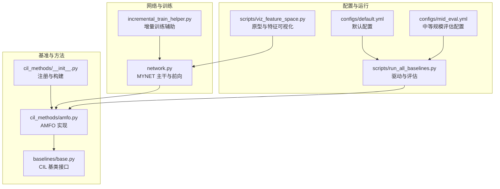
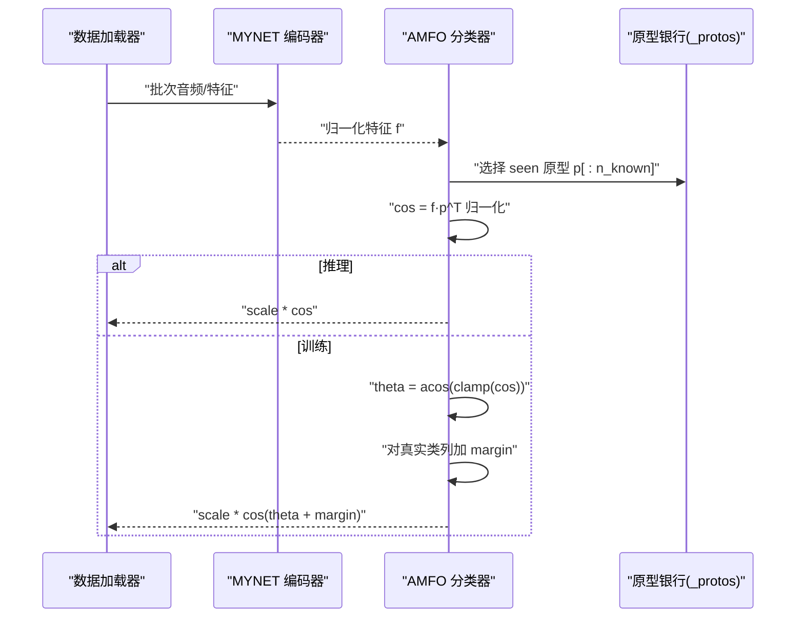
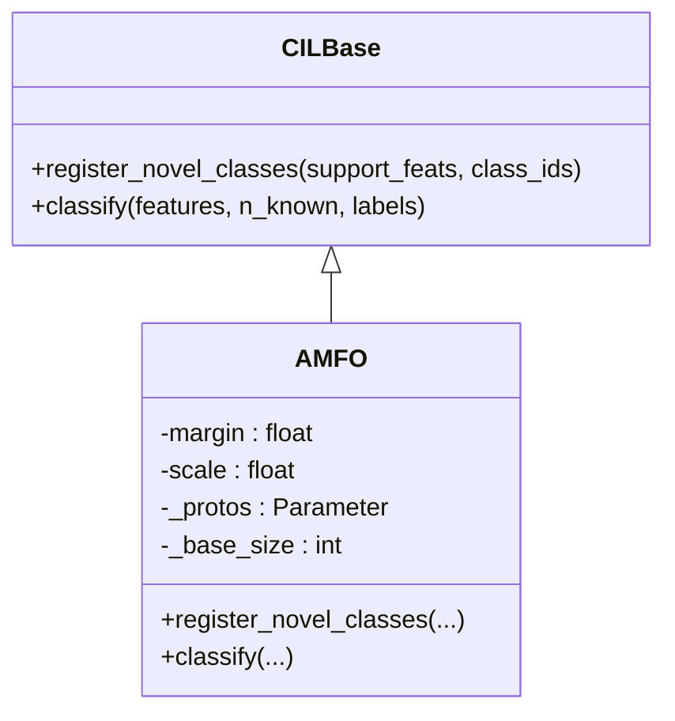
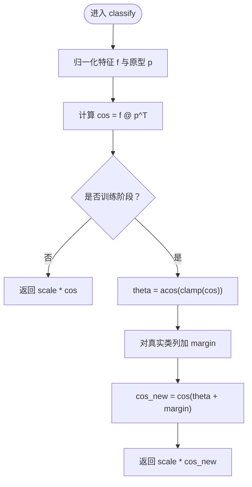
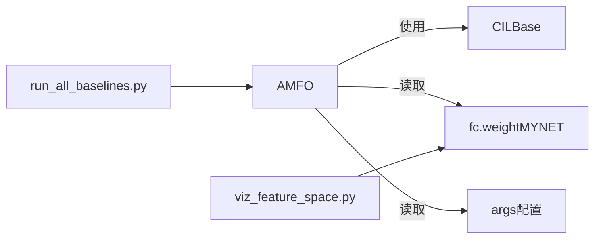

# AMFO：Angular Margin Few-shot Optimization

<cite>
**本文引用的文件**
- [amfo.py](file://models/baselines/cil_methods/amfo.py)
- [base.py](file://models/baselines/base.py)
- [__init__.py（cil_methods）](file://models/baselines/cil_methods/__init__.py)
- [default.yml](file://configs/default.yml)
- [mid_eval.yml](file://configs/mid_eval.yml)
- [network.py](file://network.py)
- [incremental_train_helper.py](file://models/incremental_train_helper.py)
- [run_all_baselines.py](file://scripts/run_all_baselines.py)
- [viz_feature_space.py](file://scripts/viz_feature_space.py)
</cite>

## 目录
1. [简介](#简介)
2. [项目结构](#项目结构)
3. [核心组件](#核心组件)
4. [架构总览](#架构总览)
5. [详细组件分析](#详细组件分析)
6. [依赖分析](#依赖分析)
7. [性能考量](#性能考量)
8. [故障排查指南](#故障排查指南)
9. [结论](#结论)
10. [附录](#附录)

## 简介
本文件系统化阐述 AMFO（Angular Margin Few-shot Optimization）在增量学习与少样本分类中的实现与使用方法。其核心思想是在余弦相似度（cosine logits）基础上引入“加性角度边界”，对真实类别的角度进行平滑的几何约束，同时冻结基础类别原型，仅在每个增量会话中动态添加新类原型，从而在保持旧知识稳定的同时高效适应新类别。

- 数学要点
  - 分类决策基于归一化特征与归一化原型的点积（即余弦相似度），再乘以可学习标度因子。
  - 训练阶段对“真实类对应的列”施加加性角度边界，使该类原型与对应样本的角度更接近零，提升判别力。
  - 推理阶段直接使用缩放后的余弦相似度作为预测 logits。

- 参数与配置
  - 关键超参：amfo_margin、amfo_scale、base_class。
  - 默认值与典型取值来自配置文件，用于标准与增量训练场景。

- 使用场景
  - 少样本增量学习（Class-Incremental Learning, CIL）：在固定基础类别集合后，逐会话加入少量样本的新类别，要求维持旧类性能并快速适应新类。
  - 音频分类等高维特征空间：AMFO 通过角度边界与原型归一化，有效缓解高维稀疏性带来的判别困难。

## 项目结构
AMFO 位于“cil_methods”子包中，作为 CIL 方法之一被统一构建与评估。其与网络主干（MYNET）、增量训练辅助工具、可视化脚本以及配置文件协同工作。

图示来源
- [__init__.py（cil_methods）:1-22](file://models/baselines/cil_methods/__init__.py#L1-L22)
- [amfo.py:1-65](file://models/baselines/cil_methods/amfo.py#L1-L65)
- [base.py:11-32](file://models/baselines/base.py#L11-L32)
- [network.py:1-200](file://network.py#L1-L200)
- [incremental_train_helper.py:1-156](file://models/incremental_train_helper.py#L1-L156)
- [default.yml:1-88](file://configs/default.yml#L1-L88)
- [mid_eval.yml:1-88](file://configs/mid_eval.yml#L1-L88)
- [run_all_baselines.py:189-225](file://scripts/run_all_baselines.py#L189-L225)
- [viz_feature_space.py:77-95](file://scripts/viz_feature_space.py#L77-L95)

章节来源
- [__init__.py（cil_methods）:1-22](file://models/baselines/cil_methods/__init__.py#L1-L22)
- [amfo.py:1-65](file://models/baselines/cil_methods/amfo.py#L1-L65)
- [base.py:11-32](file://models/baselines/base.py#L11-L32)
- [network.py:1-200](file://network.py#L1-L200)
- [incremental_train_helper.py:1-156](file://models/incremental_train_helper.py#L1-L156)
- [default.yml:1-88](file://configs/default.yml#L1-L88)
- [mid_eval.yml:1-88](file://configs/mid_eval.yml#L1-L88)
- [run_all_baselines.py:189-225](file://scripts/run_all_baselines.py#L189-L225)
- [viz_feature_space.py:77-95](file://scripts/viz_feature_space.py#L77-L95)

## 核心组件
- AMFO（类）
  - 负责在推理与训练阶段对余弦 logits 应用加性角度边界，并维护“冻结的基础原型 + 动态新增的新类原型”的原型银行。
  - 关键属性与行为
    - margin：角度边界大小（训练时对真实类列施加）。
    - scale：对余弦相似度进行标度，控制分布锐利程度。
    - _protos：原型银行（基础类原型冻结，新类原型在增量中更新）。
    - _base_size：基础类别数量阈值，用于区分基础类与新类。
    - register_novel_classes：在增量会话中为新类计算并写入原型，同时跳过基础类。
    - classify：推理时返回缩放余弦；训练时对真实类列应用加性角度边界后再缩放。

- CILBase（抽象基类）
  - 规定 CIL 方法必须实现的接口：register_novel_classes 与 classify。

- 构建与注册
  - 通过 build_cil(name, model, args) 按名称创建具体方法实例（如 amfo）。

章节来源
- [amfo.py:19-65](file://models/baselines/cil_methods/amfo.py#L19-L65)
- [base.py:11-32](file://models/baselines/base.py#L11-L32)
- [__init__.py（cil_methods）:7-21](file://models/baselines/cil_methods/__init__.py#L7-L21)

## 架构总览
AMFO 与 MYNET 主干配合，在推理阶段直接使用 fc 层权重作为原型银行；在增量阶段通过 register_novel_classes 更新新类原型，保持基础类原型不变。

图示来源
- [amfo.py:52-64](file://models/baselines/cil_methods/amfo.py#L52-L64)
- [network.py:1-200](file://network.py#L1-L200)

章节来源
- [amfo.py:52-64](file://models/baselines/cil_methods/amfo.py#L52-L64)
- [network.py:1-200](file://network.py#L1-L200)

## 详细组件分析

### AMFO 类设计与方法
- 初始化
  - 读取 amfo_margin、amfo_scale、base_class。
  - 复制并冻结初始 fc 权重作为基础原型银行。
- 注册新类原型（register_novel_classes）
  - 输入：支持集特征（可三维聚合为每类均值）与新类 ID 序列。
  - 行为：若 ID 小于基础阈值则跳过；否则计算新原型并写回原型银行（保持归一化与范数）。
- 分类（classify）
  - 推理：返回 scale * cos。
  - 训练：先计算角度 theta，再对真实类列加 margin，最后缩放。

图示来源
- [base.py:11-32](file://models/baselines/base.py#L11-L32)
- [amfo.py:19-65](file://models/baselines/cil_methods/amfo.py#L19-L65)

章节来源
- [amfo.py:19-65](file://models/baselines/cil_methods/amfo.py#L19-L65)
- [base.py:11-32](file://models/baselines/base.py#L11-L32)

### 数学原理与公式
- 余弦相似度与标度
  - 决策 logits = scale × (normalize(features) · normalize(prototypes)^T)
- 加性角度边界（训练）
  - 计算角度：theta = arccos(clamp(cos, -1+ε, 1-ε))
  - 对真实类列增加 margin：cos(theta + margin)
  - 最终 logits = scale × cos(theta + margin)
- 原型冻结与动态添加
  - 基础类原型在初始化后冻结（requires_grad=False）。
  - 新类原型仅在增量会话中根据支持集均值得到并写入原型银行。

图示来源
- [amfo.py:52-64](file://models/baselines/cil_methods/amfo.py#L52-L64)

章节来源
- [amfo.py:52-64](file://models/baselines/cil_methods/amfo.py#L52-L64)

### 参数配置与使用
- 关键超参
  - amfo_margin：训练时对真实类列施加的角度边界大小。
  - amfo_scale：对余弦相似度进行标度，影响决策分布的锐利程度。
  - base_class：基础类别数量阈值，用于区分基础类与新类。
- 配置文件
  - default.yml 与 mid_eval.yml 提供默认训练/评估参数，包含 way、shot、num_session、num_base 等。
- 构建与运行
  - 通过 build_cil("amfo", model, args) 创建实例。
  - 评估脚本 run_all_baselines.py 中按会话驱动评估与记录。

章节来源
- [amfo.py:20-27](file://models/baselines/cil_methods/amfo.py#L20-L27)
- [default.yml:1-88](file://configs/default.yml#L1-L88)
- [mid_eval.yml:1-88](file://configs/mid_eval.yml#L1-L88)
- [__init__.py（cil_methods）:14-18](file://models/baselines/cil_methods/__init__.py#L14-L18)
- [run_all_baselines.py:189-225](file://scripts/run_all_baselines.py#L189-L225)

### 增量训练与原型更新
- 增量阶段流程
  - 使用支持集计算新类原型均值，调用 register_novel_classes 写入原型银行。
  - 基础类原型保持冻结，避免灾难性遗忘。
- 训练辅助
  - incremental_train_helper 提供增量训练循环、损失计算与优化器配置，便于在会话间更新原型与模型。

章节来源
- [amfo.py:30-49](file://models/baselines/cil_methods/amfo.py#L30-L49)
- [incremental_train_helper.py:28-111](file://models/incremental_train_helper.py#L28-L111)

### 可视化与原型演进
- 特征空间可视化
  - 通过 encode_loader 提取特征，结合 fc 权重前 num_labeled_classes 行作为当前 seen 原型，绘制 t-SNE 投影观察原型与样本分布。
- 原型历史追踪
  - 随会话递增更新 seen 范围（num_base + 会话×way），观察原型移动轨迹。

章节来源
- [viz_feature_space.py:77-95](file://scripts/viz_feature_space.py#L77-L95)

## 依赖分析
- 组件耦合
  - AMFO 依赖 CILBase 接口约定，确保与评估框架一致。
  - AMFO 依赖 MYNET 的编码器与分类器权重（fc.weight）作为原型银行。
- 外部依赖
  - 配置文件提供超参默认值与训练策略。
  - 评估脚本负责驱动多会话实验与结果记录。

图示来源
- [amfo.py:19-65](file://models/baselines/cil_methods/amfo.py#L19-L65)
- [base.py:11-32](file://models/baselines/base.py#L11-L32)
- [run_all_baselines.py:189-225](file://scripts/run_all_baselines.py#L189-L225)
- [viz_feature_space.py:77-95](file://scripts/viz_feature_space.py#L77-L95)

章节来源
- [amfo.py:19-65](file://models/baselines/cil_methods/amfo.py#L19-L65)
- [base.py:11-32](file://models/baselines/base.py#L11-L32)
- [run_all_baselines.py:189-225](file://scripts/run_all_baselines.py#L189-L225)
- [viz_feature_space.py:77-95](file://scripts/viz_feature_space.py#L77-L95)

## 性能考量
- 计算复杂度
  - classify 的主要开销为矩阵乘法 f @ p[:n_known]^T，复杂度 O(B × D × C_seen)。
  - 训练阶段额外包含角度计算与掩码操作，整体仍以线性为主。
- 数值稳定性
  - arccos 的输入经 clamp 防止数值问题；cos 与 sin 的组合保证角度边界平滑。
- 训练稳定性
  - 原型冻结减少旧类参数漂移；新类原型仅在支持集上更新，降低过拟合风险。
- 标度与边界
  - amfo_scale 控制决策分布锐利度；amfo_margin 控制对真实类的几何约束强度，需与 scale 协同调优。

## 故障排查指南
- 基础类性能下降（灾难性遗忘）
  - 检查 register_novel_classes 是否对基础类 ID 做了跳过处理。
  - 确认 _protos.requires_grad=False 是否生效。
- 新类识别效果差
  - 检查支持集特征聚合方式（是否按类求均值）。
  - 确认新类原型写回原型银行的索引范围与设备一致性。
- 训练不稳定或发散
  - 调整 amfo_scale 与 amfo_margin 的组合；适当降低学习率。
  - 确保特征与原型均已归一化，cos 输入在 [-1,1] 区间内。
- 评估指标异常
  - 核对 num_labeled_classes 与 n_known 的更新逻辑，确保 seen 原型范围正确。

章节来源
- [amfo.py:30-64](file://models/baselines/cil_methods/amfo.py#L30-L64)

## 结论
AMFO 通过在余弦 logits 上施加加性角度边界，并冻结基础原型、仅在增量会话中添加新类原型，实现了稳健的少样本增量学习。其简单高效的实现与良好的工程适配性，使其适用于多种增量学习场景，尤其在高维特征空间中表现稳定。建议在不同数据集与任务中联合调优 amfo_scale 与 amfo_margin，并结合可视化手段持续监控原型演化与分类边界变化。

## 附录
- 关键实现路径参考
  - 初始化与原型冻结：[amfo.py:20-27](file://models/baselines/cil_methods/amfo.py#L20-L27)
  - 新类原型注册：[amfo.py:30-49](file://models/baselines/cil_methods/amfo.py#L30-L49)
  - 分类与训练逻辑：[amfo.py:52-64](file://models/baselines/cil_methods/amfo.py#L52-L64)
  - 构建与注册：[__init__.py（cil_methods）:14-18](file://models/baselines/cil_methods/__init__.py#L14-L18)
  - 评估驱动：[run_all_baselines.py:189-225](file://scripts/run_all_baselines.py#L189-L225)
  - 增量训练辅助：[incremental_train_helper.py:28-111](file://models/incremental_train_helper.py#L28-L111)
  - 配置项参考：[default.yml:1-88](file://configs/default.yml#L1-L88)、[mid_eval.yml:1-88](file://configs/mid_eval.yml#L1-L88)
  - 特征与原型可视化：[viz_feature_space.py:77-95](file://scripts/viz_feature_space.py#L77-L95)