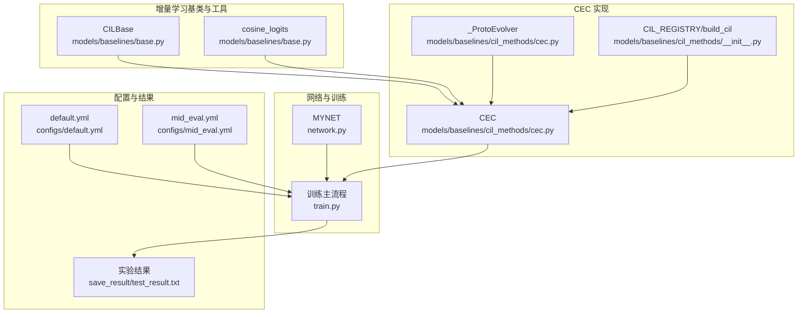
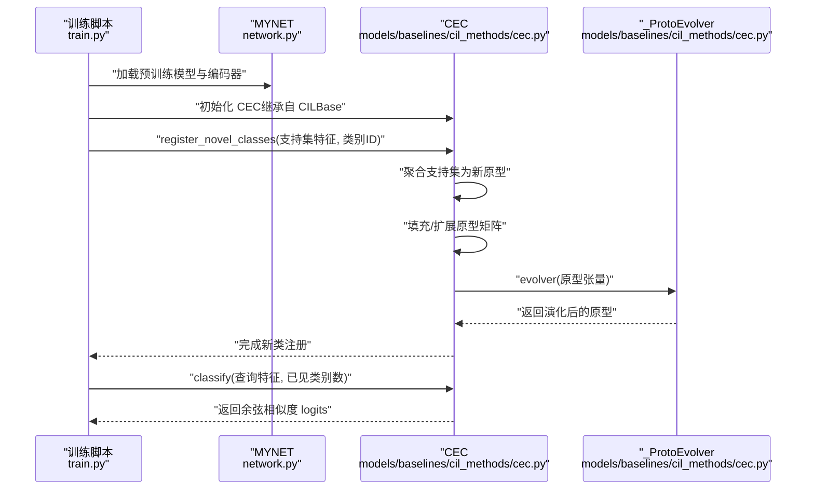
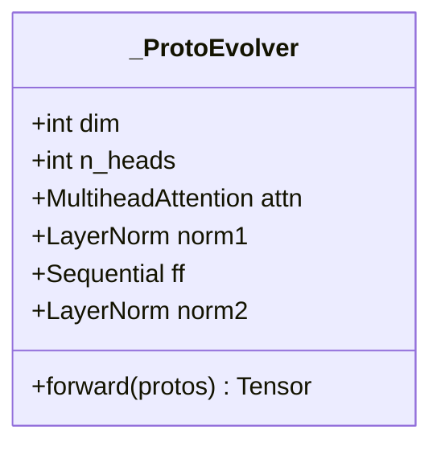
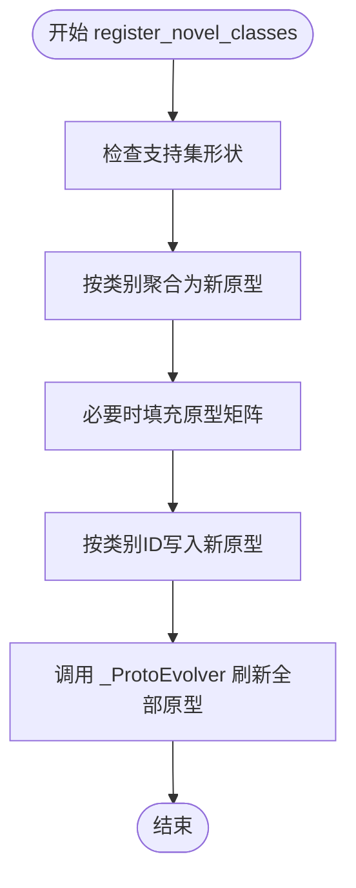
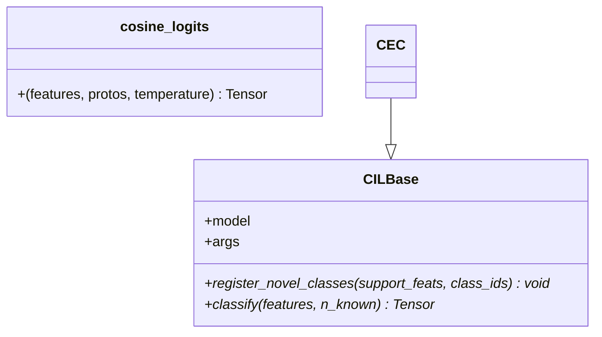
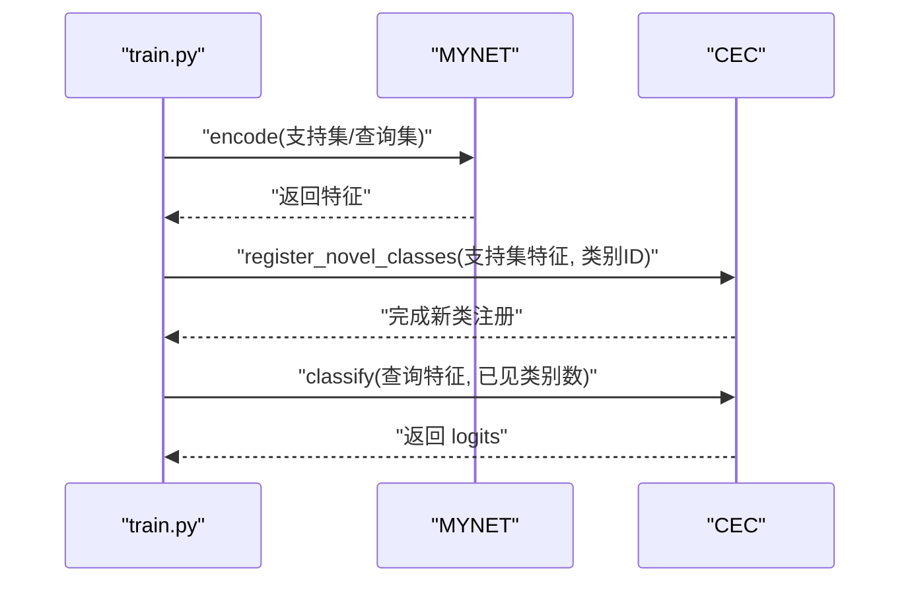
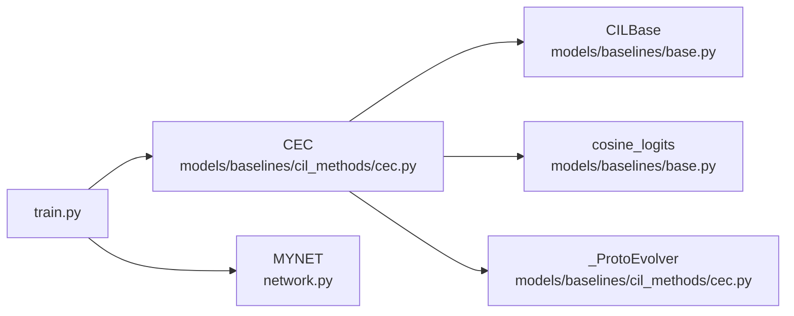

# CEC：Continually Evolved Classifiers

<cite>
**本文引用的文件**
- [models/baselines/cil_methods/cec.py](file://models/baselines/cil_methods/cec.py)
- [models/baselines/base.py](file://models/baselines/base.py)
- [models/baselines/cil_methods/__init__.py](file://models/baselines/cil_methods/__init__.py)
- [network.py](file://network.py)
- [train.py](file://train.py)
- [configs/default.yml](file://configs/default.yml)
- [configs/mid_eval.yml](file://configs/mid_eval.yml)
- [save_result/test_result.txt](file://save_result/test_result.txt)
</cite>

## 目录
1. [简介](#简介)
2. [项目结构](#项目结构)
3. [核心组件](#核心组件)
4. [架构总览](#架构总览)
5. [详细组件分析](#详细组件分析)
6. [依赖分析](#依赖分析)
7. [性能考量](#性能考量)
8. [故障排查指南](#故障排查指南)
9. [结论](#结论)
10. [附录](#附录)

## 简介
CEC（Continually Evolved Classifiers）是一种持续演化的增量分类器方法，其核心思想是在每个增量会话中通过图注意力机制对类别原型进行“演化刷新”，从而在不改变基础编码器的前提下，动态提升分类器对新类别的适应能力。CEC采用轻量级多头自注意力作为“图注意力演化器”，使各类别原型在会话间通过相互作用进行刷新，并在推理时使用余弦相似度进行分类。

本仓库中的实现遵循以下关键设计原则：
- 编码器冻结：仅演化分类器的原型参数，不更新编码器。
- 图注意力演化：使用多头自注意力对全部原型进行交互式刷新。
- 余弦分类：在推理阶段使用余弦相似度与温度缩放进行分类。

## 项目结构
围绕 CEC 的代码主要分布在以下模块：
- 基类与工具：提供增量学习接口与通用余弦分类函数。
- CEC 实现：包含原型演化器与 CEC 主类。
- 网络与训练：提供音频编码器、分类头与训练流程。
- 配置与实验：提供默认与中等规模评估配置，以及实验结果汇总。

图表来源
- [models/baselines/base.py:11-76](file://models/baselines/base.py#L11-L76)
- [models/baselines/cil_methods/cec.py:19-82](file://models/baselines/cil_methods/cec.py#L19-L82)
- [models/baselines/cil_methods/__init__.py:7-18](file://models/baselines/cil_methods/__init__.py#L7-L18)
- [network.py:18-50](file://network.py#L18-L50)
- [train.py:800-898](file://train.py#L800-L898)
- [configs/default.yml:1-88](file://configs/default.yml#L1-L88)
- [configs/mid_eval.yml:1-88](file://configs/mid_eval.yml#L1-L88)

章节来源
- [models/baselines/base.py:11-76](file://models/baselines/base.py#L11-L76)
- [models/baselines/cil_methods/cec.py:19-82](file://models/baselines/cil_methods/cec.py#L19-L82)
- [models/baselines/cil_methods/__init__.py:7-18](file://models/baselines/cil_methods/__init__.py#L7-L18)
- [network.py:18-50](file://network.py#L18-L50)
- [train.py:800-898](file://train.py#L800-L898)
- [configs/default.yml:1-88](file://configs/default.yml#L1-L88)
- [configs/mid_eval.yml:1-88](file://configs/mid_eval.yml#L1-L88)

## 核心组件
- 原型演化器（_ProtoEvolver）
  - 采用单层多头自注意力对全部类别原型进行交互式刷新，随后通过残差与前馈网络进一步更新。
  - 输入形状为 [1, C, D]，输出为同维度的演化原型集合。
- CEC 主类（CEC）
  - 继承自 CILBase，持有演化器与温度参数。
  - 提供注册新类（register_novel_classes）与分类（classify）接口。
  - 注册新类时，先将支持集特征聚合为新原型，填充至现有原型矩阵，再通过演化器进行刷新。
  - 分类时使用余弦相似度与温度缩放得到 logits。
- 增量学习基类（CILBase）
  - 规定了增量学习方法必须实现的接口：register_novel_classes 与 classify。
  - 提供通用余弦分类函数 cosine_logits，便于不同方法统一使用余弦相似度。

章节来源
- [models/baselines/cil_methods/cec.py:19-82](file://models/baselines/cil_methods/cec.py#L19-L82)
- [models/baselines/base.py:11-76](file://models/baselines/base.py#L11-L76)

## 架构总览
CEC 的整体工作流如下：
- 基础训练阶段：使用预训练编码器与线性分类头（fc）进行基础分类任务。
- 增量会话阶段：
  - 采集新会话的支持集特征，计算新类原型。
  - 将新原型写入现有原型矩阵对应位置。
  - 使用 _ProtoEvolver 对全部原型进行注意力交互刷新。
  - 推理时使用余弦相似度与温度参数进行分类。

图表来源
- [train.py:851-870](file://train.py#L851-L870)
- [models/baselines/cil_methods/cec.py:52-82](file://models/baselines/cil_methods/cec.py#L52-L82)
- [network.py:471-485](file://network.py#L471-L485)

## 详细组件分析

### 原型演化器（_ProtoEvolver）
- 结构要点
  - 多头自注意力：对原型进行交互式刷新。
  - LayerNorm + 前馈网络：对注意力输出进行残差与非线性变换。
- 输入输出
  - 输入：[1, C, D]，其中 C 为类别数，D 为特征维度。
  - 输出：同形状的演化原型张量。
- 复杂度
  - 自注意力复杂度约为 O(C^2·D)，C 通常受类别数限制，整体开销可控。

图表来源
- [models/baselines/cil_methods/cec.py:19-38](file://models/baselines/cil_methods/cec.py#L19-L38)

章节来源
- [models/baselines/cil_methods/cec.py:19-38](file://models/baselines/cil_methods/cec.py#L19-L38)

### CEC 主类（CEC）
- 初始化
  - 从基础模型的分类头权重复制初始原型，冻结梯度。
  - 设置演化器与温度参数。
- 注册新类（register_novel_classes）
  - 将支持集特征聚合为新原型，按类别 ID 写入原型矩阵。
  - 若类别数超过当前容量，进行零填充。
  - 使用 _ProtoEvolver 对全部原型进行刷新，得到演化后的原型。
- 分类（classify）
  - 使用余弦相似度与温度缩放计算 logits，仅对已见类别进行分类。
- 原型导出（prototypes）
  - 返回当前已见类别的原型副本，便于可视化或分析。

图表来源
- [models/baselines/cil_methods/cec.py:52-74](file://models/baselines/cil_methods/cec.py#L52-L74)

章节来源
- [models/baselines/cil_methods/cec.py:41-82](file://models/baselines/cil_methods/cec.py#L41-L82)

### 增量学习基类（CILBase）与余弦分类
- CILBase
  - 规范化接口：register_novel_classes 与 classify。
  - 作为 CEC 的父类，提供统一的增量学习框架。
- cosine_logits
  - 对特征与原型分别做 L2 归一化后计算余弦相似度，并乘以温度参数。
  - 便于不同方法共享分类逻辑。

图表来源
- [models/baselines/base.py:11-76](file://models/baselines/base.py#L11-L76)
- [models/baselines/cil_methods/cec.py:77-82](file://models/baselines/cil_methods/cec.py#L77-L82)

章节来源
- [models/baselines/base.py:11-76](file://models/baselines/base.py#L11-L76)
- [models/baselines/cil_methods/cec.py:77-82](file://models/baselines/cil_methods/cec.py#L77-L82)

### 与基础模型的交互
- MYNET（网络）
  - 包含音频编码器与分类头（fc），在增量阶段以“编码器冻结 + 仅更新原型”的方式与 CEC 协作。
  - 提供 encode 方法用于特征提取，供 CEC 注册新类与分类使用。
- 训练主流程（train.py）
  - 在每个增量会话中，调用 CEC.register_novel_classes 更新原型。
  - 使用余弦相似度进行增量测试与评估。

图表来源
- [network.py:471-485](file://network.py#L471-L485)
- [train.py:851-870](file://train.py#L851-L870)
- [models/baselines/cil_methods/cec.py:52-82](file://models/baselines/cil_methods/cec.py#L52-L82)

章节来源
- [network.py:471-485](file://network.py#L471-L485)
- [train.py:851-870](file://train.py#L851-L870)
- [models/baselines/cil_methods/cec.py:52-82](file://models/baselines/cil_methods/cec.py#L52-L82)

## 依赖分析
- 组件耦合
  - CEC 依赖 CILBase 的接口规范与 cosine_logits 工具。
  - _ProtoEvolver 依赖 PyTorch 多头注意力与 LayerNorm。
  - 训练流程依赖 MYNET 的特征提取能力。
- 外部依赖
  - PyTorch（神经网络与张量操作）。
  - 配置系统（YAML）用于控制训练与增量参数。
- 潜在循环依赖
  - 未发现直接循环依赖；模块职责清晰，接口明确。

图表来源
- [models/baselines/cil_methods/cec.py:19-82](file://models/baselines/cil_methods/cec.py#L19-L82)
- [models/baselines/base.py:11-76](file://models/baselines/base.py#L11-L76)
- [train.py:800-898](file://train.py#L800-L898)
- [network.py:18-50](file://network.py#L18-L50)

章节来源
- [models/baselines/cil_methods/cec.py:19-82](file://models/baselines/cil_methods/cec.py#L19-L82)
- [models/baselines/base.py:11-76](file://models/baselines/base.py#L11-L76)
- [train.py:800-898](file://train.py#L800-L898)
- [network.py:18-50](file://network.py#L18-L50)

## 性能考量
- 计算复杂度
  - 原型演化：O(C^2·D)，其中 C 为类别数，D 为特征维度。在增量会话中 C 增长较慢，整体开销可控。
  - 分类：O(B·C·D)，B 为批量大小，C 为类别数，D 为特征维度。
- 内存占用
  - 仅维护原型矩阵与少量中间变量，内存开销与类别数线性相关。
- 温度参数与稳定性
  - 温度缩放影响分类分布的锐利程度，需结合数据集与增量阶段进行调优。
- 训练策略
  - 编码器冻结可显著降低训练成本，但需确保基础模型具备良好的泛化特征表示。

## 故障排查指南
- 新类注册后分类性能下降
  - 检查支持集特征聚合是否正确（按类别均值）。
  - 确认类别 ID 与原型矩阵索引一致，避免越界或覆盖错误类别。
  - 调整温度参数与演化器头数，观察对分类分布的影响。
- 演化器未生效
  - 确认 _ProtoEvolver 的输入形状为 [1, C, D]，且输出维度一致。
  - 检查是否在 register_novel_classes 后正确更新了 self._protos。
- 训练/增量流程异常
  - 确认 MYNET 的 encode 方法返回的特征维度与 num_features 一致。
  - 检查训练脚本中是否在每个会话调用了 CEC.register_novel_classes。

章节来源
- [models/baselines/cil_methods/cec.py:52-82](file://models/baselines/cil_methods/cec.py#L52-L82)
- [network.py:471-485](file://network.py#L471-L485)
- [train.py:851-870](file://train.py#L851-L870)

## 结论
CEC 通过“冻结编码器 + 原型演化”的设计，在增量学习场景下实现了高效的类别扩展与持续适应。其核心优势在于：
- 无需更新编码器，显著降低增量阶段的训练成本。
- 通过图注意力对全部原型进行交互刷新，有助于缓解灾难性遗忘并提升新类识别能力。
- 与余弦分类配合，便于在不同增量阶段进行稳定推理。

在实际应用中，建议结合数据集特性与增量节奏，合理设置温度参数与演化器头数，并在每个会话后对原型进行可视化与分析，以进一步优化性能。

## 附录

### 算法参数说明
- cec_heads：原型演化器的多头注意力头数，默认值来自配置文件。
- cec_temperature：分类时的温度缩放参数，默认值来自配置文件。
- 其他通用参数（来自配置文件）
  - way/shot：每会话类别数与每类样本数。
  - num_session：总增量会话数。
  - num_base/num_novel：基础类别数与每会话新增类别数。
  - epochs.lr：学习率与调度策略。
  - network.temperature/new_mode：分类头模式与温度参数。

章节来源
- [models/baselines/cil_methods/cec.py:44-46](file://models/baselines/cil_methods/cec.py#L44-L46)
- [configs/default.yml:22-45](file://configs/default.yml#L22-L45)
- [configs/mid_eval.yml:22-45](file://configs/mid_eval.yml#L22-L45)

### 与其他CIL方法的对比（简要）
- AMFO（Angular Margin Few-shot Optimization）
  - 在余弦分类基础上引入角度边界，冻结基础原型，仅在增量阶段添加新原型。
  - 与 CEC 的区别：AMFO 侧重于角度边界优化，CEC 侧重于原型间的交互演化。
- PAN（Progressive Adaptor Networks）
  - 通过适配器模块逐步扩展网络容量，适合更复杂的模型扩展场景。
  - 与 CEC 的区别：PAN 更关注模型结构扩展，CEC 更关注原型演化。

章节来源
- [models/baselines/cil_methods/amfo.py:19-65](file://models/baselines/cil_methods/amfo.py#L19-L65)
- [models/baselines/cil_methods/__init__.py:7-11](file://models/baselines/cil_methods/__init__.py#L7-L11)

### 实验结果与适用场景
- 实验结果（示例）
  - 仓库提供了多轮测试的增量学习结果，包含已见类准确率、未知类准确率、F1 分数与增量准确率等指标。
  - 适用于语音/音频领域的小样本增量分类任务，尤其在类别逐步扩展且需保持旧类性能的场景。

章节来源
- [save_result/test_result.txt:1-62](file://save_result/test_result.txt#L1-L62)