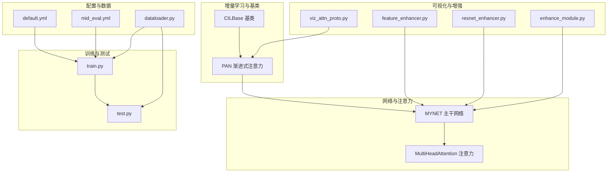
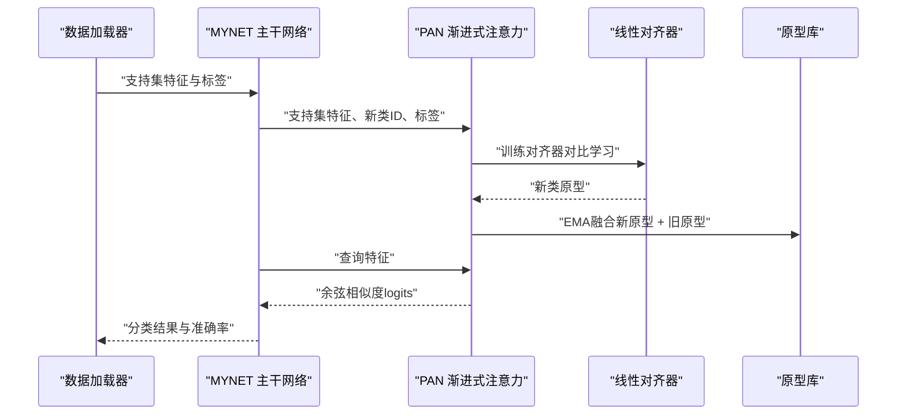
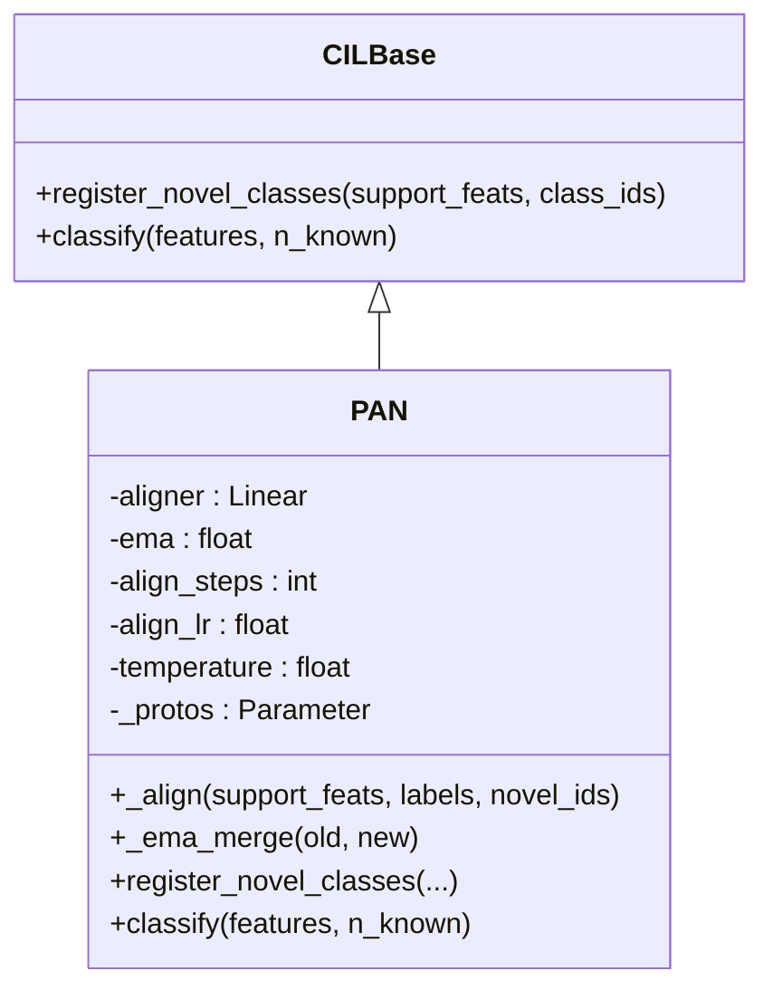
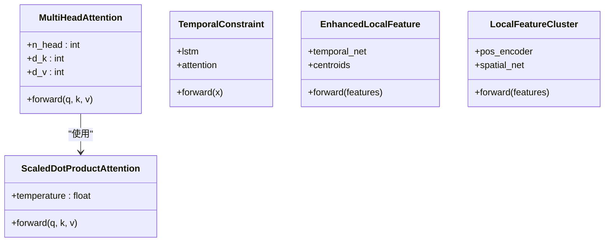
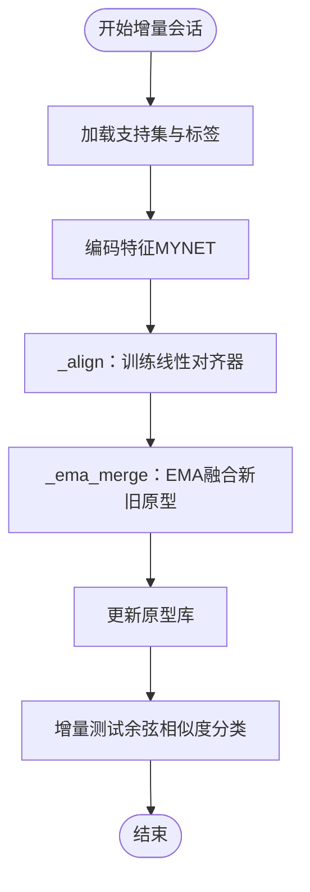
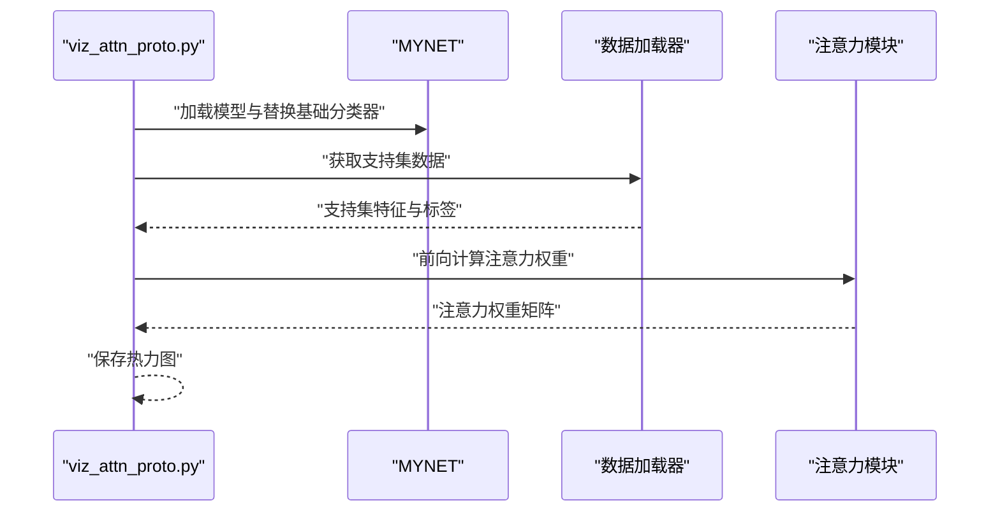
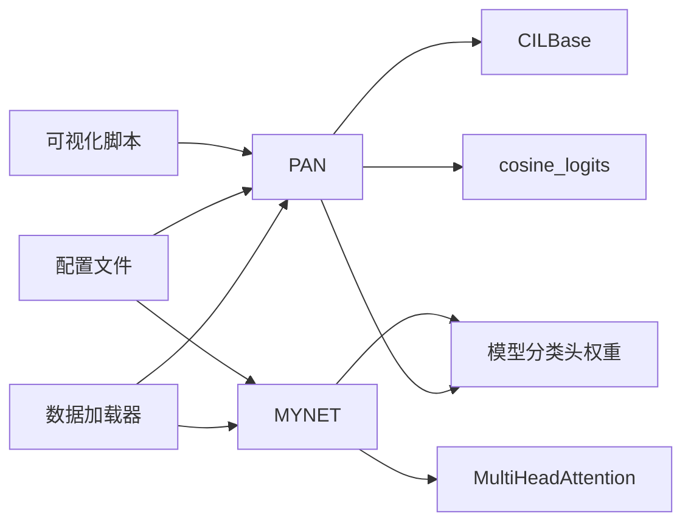

# PAN：Progressive Attention Networks

<cite>
**本文引用的文件**
- [models/baselines/cil_methods/pan.py](file://models/baselines/cil_methods/pan.py)
- [models/baselines/base.py](file://models/baselines/base.py)
- [network.py](file://network.py)
- [configs/default.yml](file://configs/default.yml)
- [configs/mid_eval.yml](file://configs/mid_eval.yml)
- [data/dataloader.py](file://data/dataloader.py)
- [scripts/viz_attn_proto.py](file://scripts/viz_attn_proto.py)
- [models/feature_enhancer.py](file://models/feature_enhancer.py)
- [models/resnet_enhancer.py](file://models/resnet_enhancer.py)
- [enhance_module.py](file://enhance_module.py)
- [train.py](file://train.py)
- [test.py](file://test.py)
</cite>

## 目录
1. [简介](#简介)
2. [项目结构](#项目结构)
3. [核心组件](#核心组件)
4. [架构总览](#架构总览)
5. [详细组件分析](#详细组件分析)
6. [依赖分析](#依赖分析)
7. [性能考量](#性能考量)
8. [故障排查指南](#故障排查指南)
9. [结论](#结论)
10. [附录](#附录)

## 简介
本文件系统化阐述PAN（Progressive Attention Networks，渐进式注意力网络）在增量学习中的应用。PAN通过“渐进式注意力”机制，在每次增量会话中对新类原型进行对齐与融合，既保持对旧类别的记忆，又提升对新类别的判别能力。其核心思想包括：
- 在支持集上训练轻量线性对齐器，使新类特征在对比学习目标下靠近各自原型、远离不同原型；
- 使用指数滑动平均（EMA）将新原型与旧原型流形对齐，形成稳定的原型库；
- 采用余弦相似分类器进行推理，温度参数控制决策锐度；
- 结合注意力模块与特征增强策略，提升特征表达与判别力。

本文件将从算法原理、实现细节、训练与测试流程、注意力可视化与性能优化等方面进行全面说明，并给出参数配置与实践建议。

## 项目结构
该项目围绕增量学习与开放集识别任务组织，PAN位于增量学习基类之上，配合网络主干、注意力模块与特征增强模块共同工作。关键目录与文件如下：
- models/baselines/cil_methods/pan.py：PAN增量学习实现
- models/baselines/base.py：增量学习基类与通用工具
- network.py：主干网络MYNET及其注意力模块
- configs/default.yml、configs/mid_eval.yml：训练与评估配置
- data/dataloader.py：数据加载器与采样器
- scripts/viz_attn_proto.py：注意力与原型热力图可视化脚本
- models/feature_enhancer.py、models/resnet_enhancer.py、enhance_module.py：特征增强与融合模块
- train.py、test.py：训练与测试入口

**图表来源**
- [models/baselines/cil_methods/pan.py:24-109](file://models/baselines/cil_methods/pan.py#L24-L109)
- [models/baselines/base.py:11-76](file://models/baselines/base.py#L11-L76)
- [network.py:18-36](file://network.py#L18-L36)
- [configs/default.yml:1-88](file://configs/default.yml#L1-L88)
- [configs/mid_eval.yml:1-88](file://configs/mid_eval.yml#L1-L88)
- [data/dataloader.py:48-106](file://data/dataloader.py#L48-L106)
- [scripts/viz_attn_proto.py:34-120](file://scripts/viz_attn_proto.py#L34-L120)
- [models/feature_enhancer.py:1-93](file://models/feature_enhancer.py#L1-L93)
- [models/resnet_enhancer.py:1-172](file://models/resnet_enhancer.py#L1-L172)
- [enhance_module.py:70-160](file://enhance_module.py#L70-L160)
- [train.py:825-850](file://train.py#L825-L850)
- [test.py:740-758](file://test.py#L740-L758)

**章节来源**
- [models/baselines/cil_methods/pan.py:1-109](file://models/baselines/cil_methods/pan.py#L1-L109)
- [models/baselines/base.py:1-76](file://models/baselines/base.py#L1-L76)
- [network.py:18-36](file://network.py#L18-L36)
- [configs/default.yml:1-88](file://configs/default.yml#L1-L88)
- [configs/mid_eval.yml:1-88](file://configs/mid_eval.yml#L1-L88)
- [data/dataloader.py:48-106](file://data/dataloader.py#L48-L106)
- [scripts/viz_attn_proto.py:34-120](file://scripts/viz_attn_proto.py#L34-L120)
- [models/feature_enhancer.py:1-93](file://models/feature_enhancer.py#L1-L93)
- [models/resnet_enhancer.py:1-172](file://models/resnet_enhancer.py#L1-L172)
- [enhance_module.py:70-160](file://enhance_module.py#L70-L160)
- [train.py:825-850](file://train.py#L825-L850)
- [test.py:740-758](file://test.py#L740-L758)

## 核心组件
- 增量学习基类与工具
  - CILBase：定义注册新类原型与推理接口，提供余弦logits与原型构造工具。
  - cosine_logits：余弦相似度分类器，支持温度缩放。
- PAN渐进式注意力
  - 线性对齐器：轻量全连接层，初始化为单位矩阵，用于将支持集特征对齐到原型流形。
  - 对齐训练：在支持集上迭代优化，最小化对比学习损失，促使同类别靠近、异类别分离。
  - EMA融合：将新类原型与旧原型按指数滑动平均合并，稳定原型流形。
  - 推理：使用当前原型库与余弦相似度进行分类，温度参数控制决策锐度。
- 网络与注意力
  - MYNET：主干网络，集成注意力模块与分类器，支持编码模式与增量模式。
  - MultiHeadAttention：多头注意力模块，用于特征对齐与上下文建模。
- 数据与配置
  - 数据加载器：支持基础会话与增量会话的数据划分与采样。
  - 配置文件：包含训练轮次、学习率、温度、批次大小等关键超参。
- 可视化与增强
  - 可视化脚本：输出双原型热力图与注意力权重热力图。
  - 特征增强模块：时序约束、聚类与空间/时间位置编码，提升特征表达。

**章节来源**
- [models/baselines/base.py:11-76](file://models/baselines/base.py#L11-L76)
- [models/baselines/cil_methods/pan.py:24-109](file://models/baselines/cil_methods/pan.py#L24-L109)
- [network.py:18-36](file://network.py#L18-L36)
- [configs/default.yml:22-45](file://configs/default.yml#L22-L45)
- [configs/mid_eval.yml:22-45](file://configs/mid_eval.yml#L22-L45)
- [data/dataloader.py:48-106](file://data/dataloader.py#L48-L106)
- [scripts/viz_attn_proto.py:34-120](file://scripts/viz_attn_proto.py#L34-L120)
- [models/feature_enhancer.py:1-93](file://models/feature_enhancer.py#L1-L93)
- [models/resnet_enhancer.py:1-172](file://models/resnet_enhancer.py#L1-L172)
- [enhance_module.py:70-160](file://enhance_module.py#L70-L160)

## 架构总览
PAN在增量学习框架中扮演“原型对齐与融合”的角色，其与网络主干、注意力模块、数据加载器协同工作，形成如下闭环：
- 增量会话开始：读取支持集特征与标签，准备新类ID。
- 原型对齐：在线训练线性对齐器，得到新类原型。
- EMA融合：将新原型与旧原型按权重合并，更新原型库。
- 推理分类：使用余弦相似度与温度参数进行分类。
- 可视化与评估：输出注意力权重与原型热力图，评估增量准确率。

**图表来源**
- [models/baselines/cil_methods/pan.py:37-109](file://models/baselines/cil_methods/pan.py#L37-L109)
- [network.py:18-36](file://network.py#L18-L36)
- [data/dataloader.py:48-106](file://data/dataloader.py#L48-L106)

## 详细组件分析

### PAN 渐进式注意力组件
- 线性对齐器
  - 初始化为单位矩阵，保证初始对齐。
  - 在支持集上进行若干步SGD优化，目标是最小化对比学习交叉熵损失。
- 原型对齐与EMA融合
  - 支持集形状兼容：支持[n_way, n_shot, D]或扁平[B, D]两种输入。
  - 对齐后按新类ID收集原型，若旧原型存在则按EMA合并，否则直接写入。
- 推理
  - 使用当前原型库与余弦相似度进行分类，温度参数可调节决策锐度。

**图表来源**
- [models/baselines/base.py:11-33](file://models/baselines/base.py#L11-L33)
- [models/baselines/cil_methods/pan.py:24-109](file://models/baselines/cil_methods/pan.py#L24-L109)

**章节来源**
- [models/baselines/cil_methods/pan.py:24-109](file://models/baselines/cil_methods/pan.py#L24-L109)
- [models/baselines/base.py:11-33](file://models/baselines/base.py#L11-L33)

### 注意力与特征增强
- 注意力模块
  - MultiHeadAttention：多头缩放点积注意力，支持残差与层归一化。
  - ScaledDotProductAttention：缩放点积注意力，softmax归一化。
- 特征增强模块
  - TemporalConstraint：基于LSTM与时序注意力的时序约束模块。
  - EnhancedLocalFeature：时序LSTM+原型聚类+动态权重聚合的空间特征增强。
  - LocalFeatureCluster（resnet_enhancer）：位置编码+空间权重+聚类+融合。
  - enhance_module.LocalFeatureCluster：位置编码+时序相似度加权聚类+空间权重融合。

**图表来源**
- [network.py:538-586](file://network.py#L538-L586)
- [models/feature_enhancer.py:5-26](file://models/feature_enhancer.py#L5-L26)
- [models/feature_enhancer.py:27-93](file://models/feature_enhancer.py#L27-L93)
- [models/resnet_enhancer.py:51-172](file://models/resnet_enhancer.py#L51-L172)
- [enhance_module.py:70-160](file://enhance_module.py#L70-L160)

**章节来源**
- [network.py:538-586](file://network.py#L538-L586)
- [models/feature_enhancer.py:1-93](file://models/feature_enhancer.py#L1-L93)
- [models/resnet_enhancer.py:1-172](file://models/resnet_enhancer.py#L1-L172)
- [enhance_module.py:70-160](file://enhance_module.py#L70-L160)

### 数据加载与训练/测试流程
- 数据加载
  - 支持基础会话与增量会话的数据划分，测试集覆盖已遇到的所有类别。
- 训练流程
  - 基础会话训练完成后，进入增量会话：读取支持集，调用PAN注册新类原型，随后进行增量训练或直接测试。
- 测试流程
  - 使用当前原型库与余弦相似度进行增量测试，支持已知类与增量类的准确率统计。

**图表来源**
- [data/dataloader.py:48-106](file://data/dataloader.py#L48-L106)
- [models/baselines/cil_methods/pan.py:77-109](file://models/baselines/cil_methods/pan.py#L77-L109)
- [test.py:740-758](file://test.py#L740-L758)

**章节来源**
- [data/dataloader.py:48-106](file://data/dataloader.py#L48-L106)
- [train.py:825-850](file://train.py#L825-L850)
- [test.py:740-758](file://test.py#L740-L758)

### 注意力可视化与分析
- 双原型热力图
  - 可视化正/负原型或分类器中的原型矩阵，辅助理解原型分布。
- 注意力权重热力图
  - 对支持集特征输入注意力模块，输出自注意力权重，观察关注区域与对齐效果。

**图表来源**
- [scripts/viz_attn_proto.py:34-120](file://scripts/viz_attn_proto.py#L34-L120)

**章节来源**
- [scripts/viz_attn_proto.py:34-120](file://scripts/viz_attn_proto.py#L34-L120)

## 依赖分析
- 组件耦合
  - PAN依赖CILBase接口与余弦分类工具，依赖模型的分类头权重作为原型库。
  - MYNET集成注意力模块，注意模块依赖网络维度与温度参数。
  - 数据加载器提供支持集与测试集，影响增量流程的输入与评估。
- 外部依赖
  - 配置文件提供超参，如温度、学习率、批次大小、会话数等。
  - 可视化脚本依赖matplotlib与numpy进行热力图绘制。

**图表来源**
- [models/baselines/cil_methods/pan.py:21-35](file://models/baselines/cil_methods/pan.py#L21-L35)
- [models/baselines/base.py:61-76](file://models/baselines/base.py#L61-L76)
- [network.py:18-36](file://network.py#L18-L36)
- [configs/default.yml:22-45](file://configs/default.yml#L22-L45)
- [configs/mid_eval.yml:22-45](file://configs/mid_eval.yml#L22-L45)
- [data/dataloader.py:48-106](file://data/dataloader.py#L48-L106)
- [scripts/viz_attn_proto.py:34-120](file://scripts/viz_attn_proto.py#L34-L120)

**章节来源**
- [models/baselines/cil_methods/pan.py:21-35](file://models/baselines/cil_methods/pan.py#L21-L35)
- [models/baselines/base.py:61-76](file://models/baselines/base.py#L61-L76)
- [network.py:18-36](file://network.py#L18-L36)
- [configs/default.yml:22-45](file://configs/default.yml#L22-L45)
- [configs/mid_eval.yml:22-45](file://configs/mid_eval.yml#L22-L45)
- [data/dataloader.py:48-106](file://data/dataloader.py#L48-L106)
- [scripts/viz_attn_proto.py:34-120](file://scripts/viz_attn_proto.py#L34-L120)

## 性能考量
- 计算复杂度
  - 对齐训练：每会话对支持集进行若干步优化，复杂度与支持集规模线性相关。
  - 推理：余弦相似度分类，复杂度与类别数线性相关。
- 内存占用
  - 原型库参数为不可训练参数，内存开销与类别数线性相关。
  - 注意力模块与特征增强模块在推理阶段可按需启用，避免不必要的显存占用。
- 超参敏感性
  - 温度参数影响决策锐度，过高导致过拟合，过低导致欠判别。
  - EMA权重平衡新旧原型，过大易遗忘旧知识，过小不稳定。
  - 对齐学习率与步数影响收敛速度与稳定性。
- 实践建议
  - 在增量会话初期降低EMA权重，逐步增大以稳定原型流形。
  - 使用较小的对齐学习率与适中的对齐步数，避免过拟合。
  - 在推理阶段统一温度参数，必要时结合验证集选择最优温度。

[本节为通用指导，无需特定文件来源]

## 故障排查指南
- 增量会话报错“缺少每样本标签”
  - PAN要求支持集提供每样本标签，若传入扁平特征需显式提供标签。
  - 参考：[models/baselines/cil_methods/pan.py:91-92](file://models/baselines/cil_methods/pan.py#L91-L92)
- 原型维度不匹配
  - 确认模型特征维度与对齐器维度一致，初始化为单位矩阵。
  - 参考：[models/baselines/cil_methods/pan.py:27-29](file://models/baselines/cil_methods/pan.py#L27-L29)
- 温度过高导致不稳定
  - 适当降低温度参数，提高分类稳定性。
  - 参考：[configs/default.yml](file://configs/default.yml#L43)
- 注意力可视化无输出
  - 确认模型中存在注意力模块属性，且支持集批大小合理。
  - 参考：[scripts/viz_attn_proto.py:92-116](file://scripts/viz_attn_proto.py#L92-L116)

**章节来源**
- [models/baselines/cil_methods/pan.py:91-92](file://models/baselines/cil_methods/pan.py#L91-L92)
- [models/baselines/cil_methods/pan.py:27-29](file://models/baselines/cil_methods/pan.py#L27-L29)
- [configs/default.yml](file://configs/default.yml#L43)
- [scripts/viz_attn_proto.py:92-116](file://scripts/viz_attn_proto.py#L92-L116)

## 结论
PAN通过“渐进式注意力”在增量学习中实现了新类原型的对齐与融合，既保持对旧类别的记忆，又提升对新类别的判别能力。其核心在于：
- 在支持集上训练轻量线性对齐器，使特征在对比学习目标下对齐到原型；
- 使用EMA融合新旧原型，形成稳定的原型库；
- 采用余弦相似度与温度参数进行推理，兼顾判别力与稳定性；
- 结合注意力与特征增强模块，进一步提升特征表达与判别力。

在实践中，建议根据数据特性与任务需求调整温度、EMA权重、对齐学习率与步数，并结合可视化工具分析注意力权重与原型分布，以持续优化性能。

[本节为总结性内容，无需特定文件来源]

## 附录

### 算法配置参数清单
- 温度参数
  - 默认温度：见配置文件中的network.temperature字段。
  - 参考：[configs/default.yml](file://configs/default.yml#L43)
- EMA融合权重
  - 参数名：pan_ema，默认值见PAN初始化。
  - 参考：[models/baselines/cil_methods/pan.py](file://models/baselines/cil_methods/pan.py#L30)
- 对齐训练步数与学习率
  - 参数名：pan_align_steps、pan_align_lr，默认值见PAN初始化。
  - 参考：[models/baselines/cil_methods/pan.py:31-32](file://models/baselines/cil_methods/pan.py#L31-L32)
- 数据与训练配置
  - way、shot、num_session、num_base、num_novel、num_all、epochs、lr等。
  - 参考：[configs/default.yml:2-26](file://configs/default.yml#L2-L26)、[configs/mid_eval.yml:2-26](file://configs/mid_eval.yml#L2-L26)

**章节来源**
- [configs/default.yml:2-26](file://configs/default.yml#L2-L26)
- [configs/mid_eval.yml:2-26](file://configs/mid_eval.yml#L2-L26)
- [models/baselines/cil_methods/pan.py:30-32](file://models/baselines/cil_methods/pan.py#L30-L32)

### 训练与测试方法
- 训练流程要点
  - 基础会话训练完成后，进入增量会话：读取支持集，调用PAN注册新类原型，随后进行增量训练或直接测试。
  - 参考：[train.py:825-850](file://train.py#L825-L850)
- 测试流程要点
  - 使用当前原型库与余弦相似度进行增量测试，支持已知类与增量类的准确率统计。
  - 参考：[test.py:740-758](file://test.py#L740-L758)

**章节来源**
- [train.py:825-850](file://train.py#L825-L850)
- [test.py:740-758](file://test.py#L740-L758)

### 注意力可视化方法
- 双原型热力图
  - 可视化正/负原型或分类器中的原型矩阵。
  - 参考：[scripts/viz_attn_proto.py:73-90](file://scripts/viz_attn_proto.py#L73-L90)
- 注意力权重热力图
  - 对支持集特征输入注意力模块，输出自注意力权重。
  - 参考：[scripts/viz_attn_proto.py:92-116](file://scripts/viz_attn_proto.py#L92-L116)

**章节来源**
- [scripts/viz_attn_proto.py:73-90](file://scripts/viz_attn_proto.py#L73-L90)
- [scripts/viz_attn_proto.py:92-116](file://scripts/viz_attn_proto.py#L92-L116)