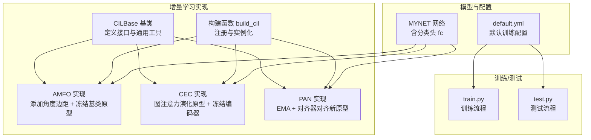
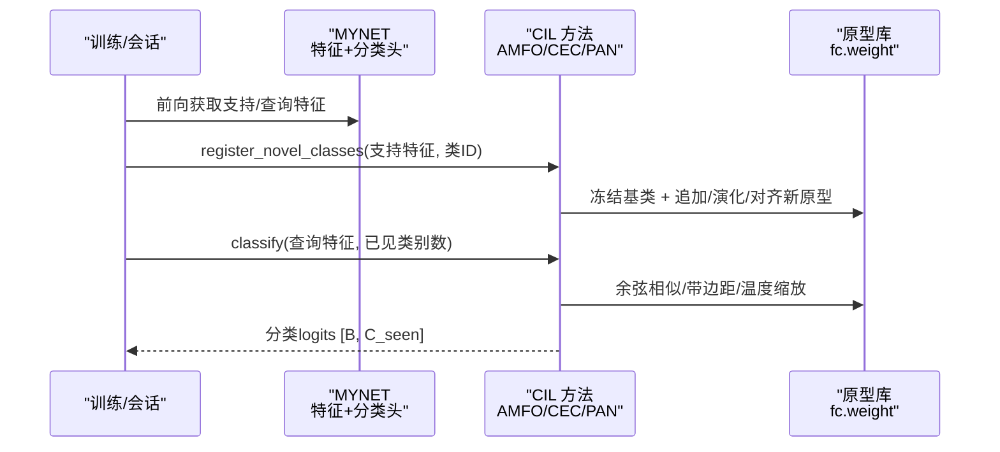
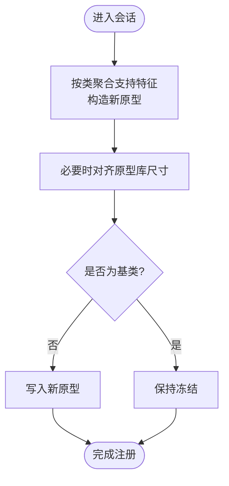
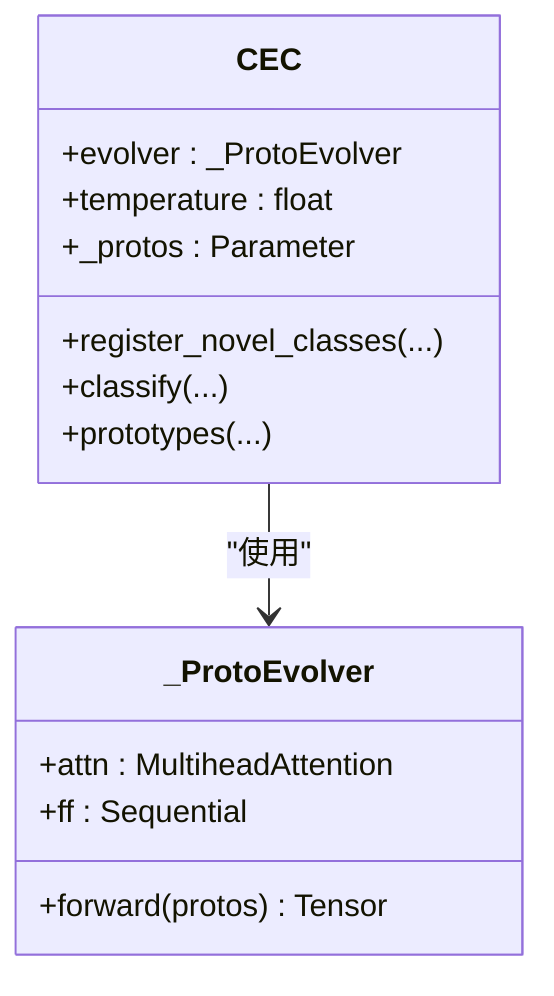
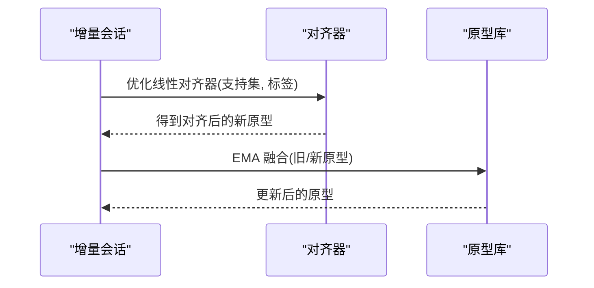
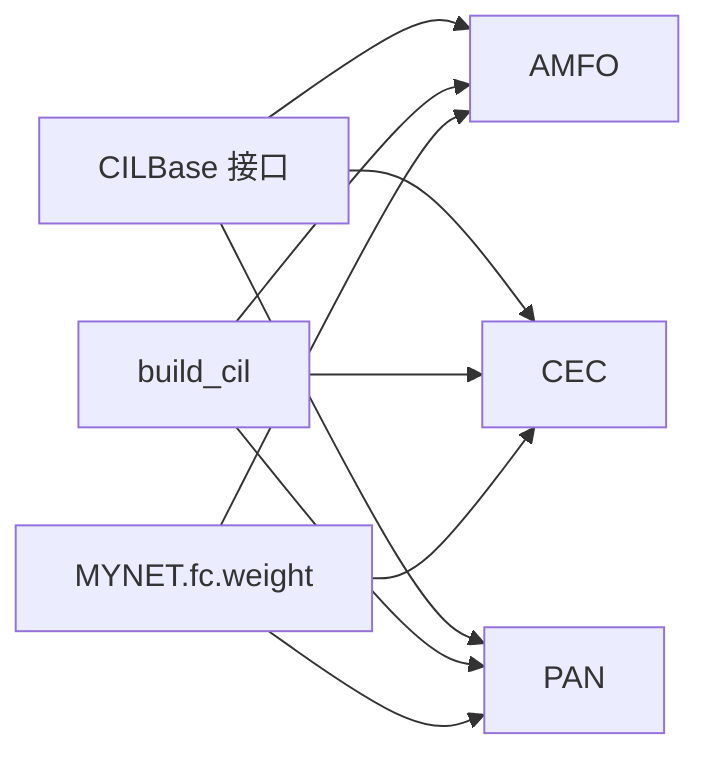

# 增量学习方法（CIL）

<cite>
**本文引用的文件**
- [models/baselines/cil_methods/amfo.py](file://models/baselines/cil_methods/amfo.py)
- [models/baselines/cil_methods/cec.py](file://models/baselines/cil_methods/cec.py)
- [models/baselines/cil_methods/pan.py](file://models/baselines/cil_methods/pan.py)
- [models/baselines/cil_methods/__init__.py](file://models/baselines/cil_methods/__init__.py)
- [models/baselines/base.py](file://models/baselines/base.py)
- [configs/default.yml](file://configs/default.yml)
- [network.py](file://network.py)
- [train.py](file://train.py)
- [test.py](file://test.py)
</cite>

## 目录
1. [简介](#简介)
2. [项目结构](#项目结构)
3. [核心组件](#核心组件)
4. [架构总览](#架构总览)
5. [详细组件分析](#详细组件分析)
6. [依赖关系分析](#依赖关系分析)
7. [性能考量](#性能考量)
8. [故障排查指南](#故障排查指南)
9. [结论](#结论)
10. [附录](#附录)

## 简介
本文件面向 VAZE 项目中的类增量学习（Class-Incremental Learning, CIL）方法，系统梳理并解析三类代表性算法：AMFO（Angular Margin Few-shot Optimization）、CEC（Continually Evolved Classifiers）、PAN（Progressive Attention Networks）。文档从理论基础、数学原理、实现细节、参数配置、使用示例与性能对比等方面展开，并给出算法选择与应用场景建议。

## 项目结构
围绕增量学习方法的关键代码位于 models/baselines/cil_methods 目录，采用“基类 + 多实现”的分层设计，便于统一接口与扩展。训练与测试入口分别在 train.py 与 test.py 中，配置文件 default.yml 提供默认超参。

**图表来源**
- [models/baselines/cil_methods/__init__.py:1-22](file://models/baselines/cil_methods/__init__.py#L1-L22)
- [models/baselines/base.py:11-33](file://models/baselines/base.py#L11-L33)
- [models/baselines/cil_methods/amfo.py:19-65](file://models/baselines/cil_methods/amfo.py#L19-L65)
- [models/baselines/cil_methods/cec.py:41-83](file://models/baselines/cil_methods/cec.py#L41-L83)
- [models/baselines/cil_methods/pan.py:24-109](file://models/baselines/cil_methods/pan.py#L24-L109)
- [network.py:18-36](file://network.py#L18-L36)
- [configs/default.yml:1-88](file://configs/default.yml#L1-L88)
- [train.py:173-200](file://train.py#L173-L200)
- [test.py:1-200](file://test.py#L1-L200)

**章节来源**
- [models/baselines/cil_methods/__init__.py:1-22](file://models/baselines/cil_methods/__init__.py#L1-L22)
- [models/baselines/base.py:11-33](file://models/baselines/base.py#L11-L33)
- [configs/default.yml:1-88](file://configs/default.yml#L1-L88)

## 核心组件
- CILBase 抽象基类：定义 register_novel_classes 与 classify 接口，以及 cosine_logits 辅助函数与从支持集构建原型的工具。
- AMFO：在推理阶段使用缩放余弦 logits，在训练阶段对真实类增加角度边距，冻结基类原型，仅新增类原型参与更新。
- CEC：冻结编码器，仅演化原型；使用多头自注意力对原型进行交互刷新，随后用余弦相似做分类。
- PAN：在每次会话中对新类原型进行对齐（线性变换 + 对比目标），并以指数滑动平均融合旧/新原型。

**章节来源**
- [models/baselines/base.py:11-33](file://models/baselines/base.py#L11-L33)
- [models/baselines/base.py:61-76](file://models/baselines/base.py#L61-L76)
- [models/baselines/cil_methods/amfo.py:19-65](file://models/baselines/cil_methods/amfo.py#L19-L65)
- [models/baselines/cil_methods/cec.py:41-83](file://models/baselines/cil_methods/cec.py#L41-L83)
- [models/baselines/cil_methods/pan.py:24-109](file://models/baselines/cil_methods/pan.py#L24-L109)

## 架构总览
下图展示增量学习方法在 VAZE 中的整体交互：MYNET 提供特征与分类头（fc 权重即初始原型），CIL 方法在每个增量会话中注册新类原型并执行分类。

**图表来源**
- [models/baselines/cil_methods/amfo.py:30-65](file://models/baselines/cil_methods/amfo.py#L30-L65)
- [models/baselines/cil_methods/cec.py:52-83](file://models/baselines/cil_methods/cec.py#L52-L83)
- [models/baselines/cil_methods/pan.py:77-109](file://models/baselines/cil_methods/pan.py#L77-L109)
- [models/baselines/base.py:61-65](file://models/baselines/base.py#L61-L65)
- [network.py:18-36](file://network.py#L18-L36)

## 详细组件分析

### AMFO（Angular Margin Few-shot Optimization）
- 理论基础
  - 在余弦相似基础上增加角度边距，使真实类的决策边界更清晰；推理时直接缩放余弦，训练时对真类加边距。
  - 通过冻结基类原型，避免灾难性遗忘，仅新增类原型参与更新。
- 数学要点
  - 推理：logits = scale × cos(θ)
  - 训练：logits = scale × cos(θ + margin_y)，其中 θ = arccos(cos)，margin_y 仅在真实类位置添加。
- 关键实现
  - register_novel_classes：按类聚合支持特征，构造新原型并写入原型库，基类位置保持冻结。
  - classify：推理用缩放余弦；训练用带边距的余弦。
- 参数
  - amfo_margin：角度边距大小
  - amfo_scale：余弦缩放因子
  - base_class：基类数量（冻结范围）
- 优势与特点
  - 简洁高效，适合小样本场景；通过冻结基类原型缓解灾难性遗忘。
- 使用示例路径
  - [AMFO.register_novel_classes:30-49](file://models/baselines/cil_methods/amfo.py#L30-L49)
  - [AMFO.classify:52-65](file://models/baselines/cil_methods/amfo.py#L52-L65)

**图表来源**
- [models/baselines/cil_methods/amfo.py:30-49](file://models/baselines/cil_methods/amfo.py#L30-L49)

**章节来源**
- [models/baselines/cil_methods/amfo.py:1-65](file://models/baselines/cil_methods/amfo.py#L1-L65)

### CEC（Continually Evolved Classifiers）
- 理论基础
  - 原型图演化：利用轻量多头自注意力让原型之间相互“刷新”，在新会话中提升稳定性与判别力。
  - 编码器冻结，仅原型可学习，降低存储与计算开销。
- 数学要点
  - 原型刷新：P' = LN(MultiHeadAttn(P) + P) + P
  - 分类：logits = temperature × normalize(f) @ normalize(P)^T
- 关键实现
  - _ProtoEvolver：单层多头自注意力 + FFN + LayerNorm
  - register_novel_classes：追加新原型后经注意力演化
  - classify：余弦相似 + 温度缩放
- 参数
  - cec_heads：注意力头数
  - cec_temperature：分类温度
- 优势与特点
  - 图式交互提升原型质量；适合类别增长且需保持稳定性的场景。
- 使用示例路径
  - [CEC._ProtoEvolver.forward:33-38](file://models/baselines/cil_methods/cec.py#L33-L38)
  - [CEC.register_novel_classes:52-74](file://models/baselines/cil_methods/cec.py#L52-L74)
  - [CEC.classify:77-79](file://models/baselines/cil_methods/cec.py#L77-L79)

**图表来源**
- [models/baselines/cil_methods/cec.py:19-38](file://models/baselines/cil_methods/cec.py#L19-L38)
- [models/baselines/cil_methods/cec.py:41-83](file://models/baselines/cil_methods/cec.py#L41-L83)

**章节来源**
- [models/baselines/cil_methods/cec.py:1-83](file://models/baselines/cil_methods/cec.py#L1-L83)

### PAN（Progressive Attention Networks）
- 理论基础
  - 在每次会话中，先用线性对齐器在支持集上进行对比学习，使新原型对齐到当前流形；再以指数滑动平均融合旧/新原型，兼顾稳定性与适应性。
- 数学要点
  - 对齐：最小化 cosine_logits(A(support) || protos(y)) 关于线性对齐器的损失
  - 融合：new_proto = ema × old_proto + (1-ema) × aligned_proto
- 关键实现
  - _align：优化线性对齐器，得到对齐后的原型
  - _ema_merge：指数滑动平均
  - register_novel_classes：对齐 + 融合 + 写入
  - classify：余弦相似 + 温度缩放
- 参数
  - pan_ema：EMA 平滑系数
  - pan_align_steps：对齐迭代步数
  - pan_align_lr：对齐学习率
  - pan_temperature：分类温度
- 优势与特点
  - 纯推理时在线对齐，无需额外标签；EMA 平滑保证连续性。
- 使用示例路径
  - [PAN._align:38-70](file://models/baselines/cil_methods/pan.py#L38-L70)
  - [PAN.register_novel_classes:77-103](file://models/baselines/cil_methods/pan.py#L77-L103)
  - [PAN.classify:106-109](file://models/baselines/cil_methods/pan.py#L106-L109)

**图表来源**
- [models/baselines/cil_methods/pan.py:38-103](file://models/baselines/cil_methods/pan.py#L38-L103)

**章节来源**
- [models/baselines/cil_methods/pan.py:1-109](file://models/baselines/cil_methods/pan.py#L1-L109)

## 依赖关系分析
- 统一接口：三者均继承 CILBase，遵循相同的 register_novel_classes 与 classify 约定。
- 共享工具：cosine_logits 与 build_prototype_from_support 提供一致的余弦分类与原型构建能力。
- 模型耦合：MYNET 的分类头 fc.weight 即初始原型库，三者均直接/间接读写该权重。
- 构建入口：cil_methods/__init__.py 提供 build_cil，按名称返回对应实现。

**图表来源**
- [models/baselines/base.py:11-33](file://models/baselines/base.py#L11-L33)
- [models/baselines/cil_methods/__init__.py:14-18](file://models/baselines/cil_methods/__init__.py#L14-L18)
- [network.py:18-36](file://network.py#L18-L36)

**章节来源**
- [models/baselines/base.py:61-76](file://models/baselines/base.py#L61-L76)
- [models/baselines/cil_methods/__init__.py:1-22](file://models/baselines/cil_methods/__init__.py#L1-L22)
- [network.py:18-36](file://network.py#L18-L36)

## 性能考量
- 计算复杂度
  - AMFO：每次分类为 O(B×C_seen)，训练时额外包含角度计算与掩码构造。
  - CEC：原型演化为 O(C^2×D)（注意力），分类仍为 O(B×C_seen)。
  - PAN：对齐阶段为 O(K×steps×D)，K 为新类数，steps 为对齐步数。
- 内存占用
  - 三者均以参数形式维护原型库，C 增长导致内存线性增长；CEC 与 PAN 在演化/对齐过程中有中间张量。
- 收敛与稳定性
  - AMFO 通过冻结基类原型与边距提升收敛鲁棒性。
  - CEC 的注意力演化有助于原型去偏。
  - PAN 的 EMA 融合在新旧知识间取得平衡。
- 超参敏感性
  - 温度、边距、EMA 系数、对齐步数等显著影响性能，需结合数据集与任务微调。

## 故障排查指南
- 常见问题
  - 原型库尺寸不匹配：register_novel_classes 会按需填充，若类ID越界或未对齐，可能导致维度错误。
  - 训练/推理不一致：AMFO 训练与推理使用不同分支（带边距 vs 缩放余弦），需确保调用路径正确。
  - CEC 注意力输入形状：要求 [1, C, D]，若传入错误需检查维度。
  - PAN 对齐标签缺失：当支持特征非聚合格式时需提供标签，否则断言失败。
- 定位建议
  - 检查 args 中对应参数名（如 amfo_margin、cec_temperature、pan_ema 等）是否正确传入。
  - 在 register_novel_classes 前打印 class_ids 与 support_feats 形状，确认类数与维度。
  - 在 classify 前检查 n_known 是否与 seen 类数一致。

**章节来源**
- [models/baselines/cil_methods/amfo.py:30-65](file://models/baselines/cil_methods/amfo.py#L30-L65)
- [models/baselines/cil_methods/cec.py:52-83](file://models/baselines/cil_methods/cec.py#L52-L83)
- [models/baselines/cil_methods/pan.py:77-109](file://models/baselines/cil_methods/pan.py#L77-L109)

## 结论
- AMFO 适合小样本、需快速增量且强调稳定性的场景；通过边距与冻结策略提升鲁棒性。
- CEC 适合类别增长且希望原型持续演化的场景；图注意力带来更强的原型交互能力。
- PAN 适合需要在线对齐与平滑融合的场景；纯推理时对齐避免额外标注成本。
- 三者共享统一接口，易于在 VAZE 中切换与组合使用。

## 附录

### 参数配置指南（来自 default.yml 与各方法）
- AMFO
  - amfo_margin：角度边距
  - amfo_scale：余弦缩放
  - base_class：基类数量
- CEC
  - cec_heads：注意力头数
  - cec_temperature：分类温度
- PAN
  - pan_ema：EMA 平滑系数
  - pan_align_steps：对齐迭代步数
  - pan_align_lr：对齐学习率
  - pan_temperature：分类温度

**章节来源**
- [configs/default.yml:1-88](file://configs/default.yml#L1-L88)
- [models/baselines/cil_methods/amfo.py:20-27](file://models/baselines/cil_methods/amfo.py#L20-L27)
- [models/baselines/cil_methods/cec.py:42-46](file://models/baselines/cil_methods/cec.py#L42-L46)
- [models/baselines/cil_methods/pan.py:25-33](file://models/baselines/cil_methods/pan.py#L25-L33)

### 使用示例（路径指引）
- 构建 CIL 方法
  - [build_cil:14-18](file://models/baselines/cil_methods/__init__.py#L14-L18)
- 注册新类
  - [AMFO.register_novel_classes:30-49](file://models/baselines/cil_methods/amfo.py#L30-L49)
  - [CEC.register_novel_classes:52-74](file://models/baselines/cil_methods/cec.py#L52-L74)
  - [PAN.register_novel_classes:77-103](file://models/baselines/cil_methods/pan.py#L77-L103)
- 分类
  - [AMFO.classify:52-65](file://models/baselines/cil_methods/amfo.py#L52-L65)
  - [CEC.classify:77-79](file://models/baselines/cil_methods/cec.py#L77-L79)
  - [PAN.classify:106-109](file://models/baselines/cil_methods/pan.py#L106-L109)

### 算法选择指导
- 若追求简单稳健、小样本效果好：优先 AMFO
- 若追求原型演化与类别增长稳定性：优先 CEC
- 若追求在线对齐与平滑融合：优先 PAN

### 实际应用场景建议
- 语音/音频增量识别：AMFO/CEC/PAN 均可；若类别增长快选 CEC 或 PAN。
- 开放世界/持续学习：PAN 的在线对齐与 EMA 更贴合长期演化需求。
- 计算受限环境：AMFO 最轻量；CEC 次之；PAN 需权衡对齐步数与内存。