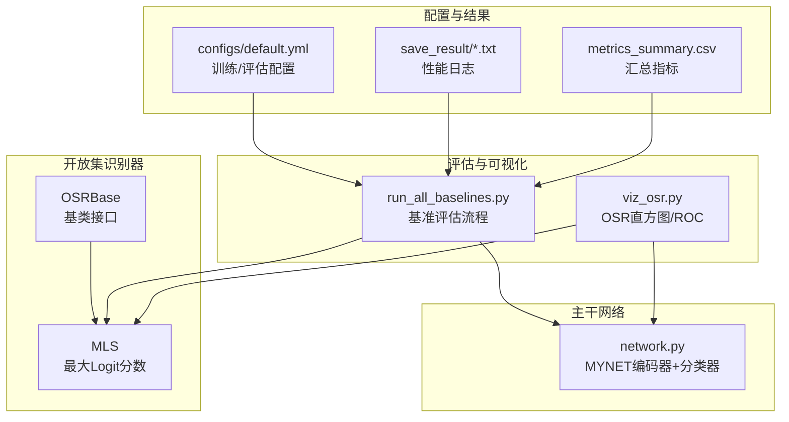
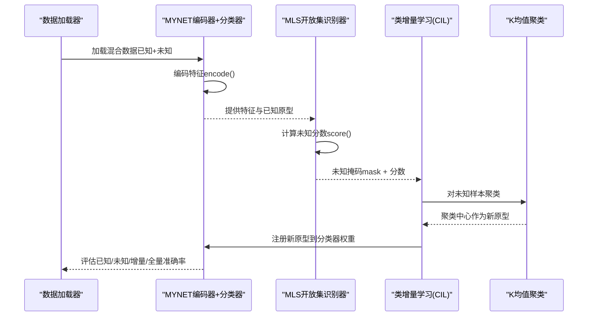
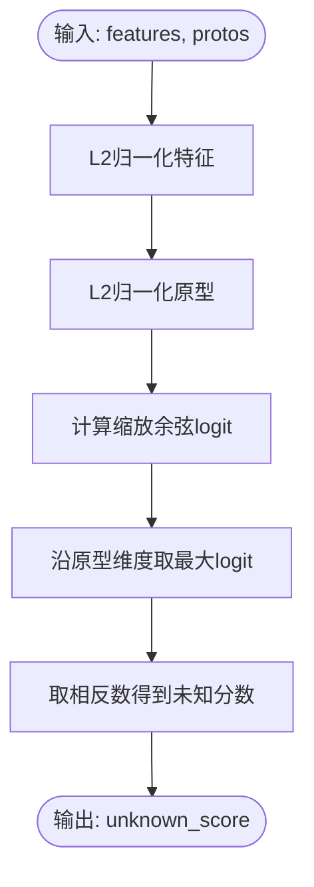
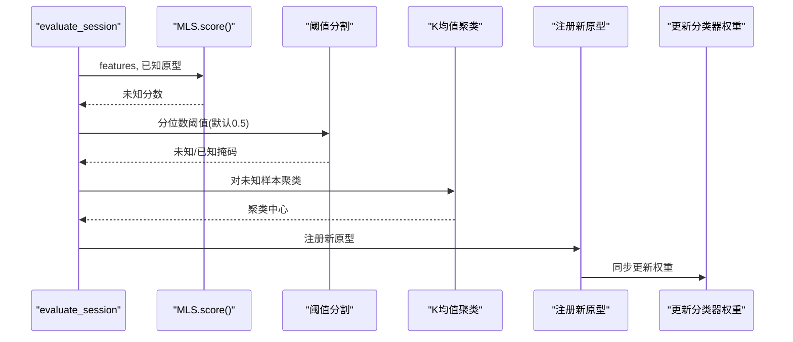
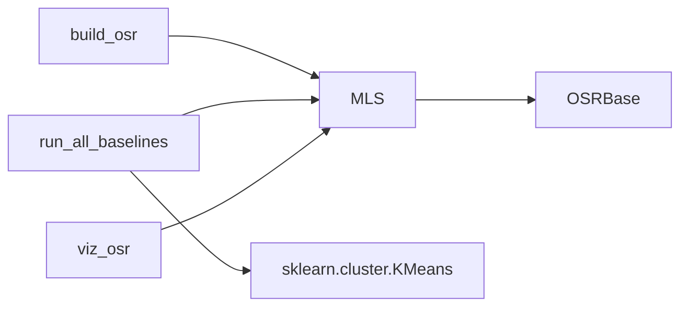

# MLS方法（最大Logit分数）

<cite>
**本文档引用的文件**
- [models/baselines/osr_methods/mls.py](file://models/baselines/osr_methods/mls.py)
- [models/baselines/base.py](file://models/baselines/base.py)
- [models/baselines/osr_methods/__init__.py](file://models/baselines/osr_methods/__init__.py)
- [scripts/run_all_baselines.py](file://scripts/run_all_baselines.py)
- [scripts/viz_osr.py](file://scripts/viz_osr.py)
- [network.py](file://network.py)
- [configs/default.yml](file://configs/default.yml)
- [save_result/test_result0520LS.txt](file://save_result/test_result0520LS.txt)
- [save_result/test_resultLSbase_all.txt](file://save_result/test_resultLSbase_all.txt)
- [save_result/metrics_summary.csv](file://save_result/metrics_summary.csv)
</cite>

## 目录
1. [简介](#简介)
2. [项目结构](#项目结构)
3. [核心组件](#核心组件)
4. [架构概览](#架构概览)
5. [详细组件分析](#详细组件分析)
6. [依赖关系分析](#依赖关系分析)
7. [性能考量](#性能考量)
8. [故障排除指南](#故障排除指南)
9. [结论](#结论)
10. [附录](#附录)

## 简介
本文件针对VAZE项目中的MLS（Maximum Logit Score，最大Logit分数）开放集识别方法进行全面技术文档化。MLS由Vaze等人在ICLR 2022提出，其核心思想是通过最大化特征与原型之间的标准化余弦相似度（即logit分数），来衡量样本属于“未知类别”的可能性。在VAZE框架中，MLS作为开放集识别器之一，与类增量学习（CIL）方法结合，形成端到端的增量语音分类系统。

- 理论基础：对特征向量和原型向量进行L2归一化后，计算缩放后的点积（logit），取每样本与所有已知原型的最大logit值，并取相反数作为“未知分数”。分数越高表示越可能是未知样本。
- 实现要点：MLP分类器权重矩阵的前若干行即为已知类原型；未知分数用于二值化阈值分割，高分视为未知，低分视为已知；随后对未知样本聚类并注册新原型，供后续增量阶段使用。
- 参数配置：可通过配置项设置缩放因子（mls_scale），默认值为16.0；阈值策略采用按批次自适应的分位数阈值（quantile=0.5）。

## 项目结构
与MLS方法直接相关的代码主要分布在以下模块：
- 模型基类与开放集识别器：models/baselines/base.py、models/baselines/osr_methods/mls.py、models/baselines/osr_methods/__init__.py
- 评估与可视化：scripts/run_all_baselines.py、scripts/viz_osr.py
- 主干网络与分类器：network.py
- 配置文件：configs/default.yml
- 性能结果：save_result/*.txt、save_result/metrics_summary.csv

**图表来源**
- [models/baselines/base.py:35-54](file://models/baselines/base.py#L35-L54)
- [models/baselines/osr_methods/mls.py:15-25](file://models/baselines/osr_methods/mls.py#L15-L25)
- [scripts/run_all_baselines.py:103-171](file://scripts/run_all_baselines.py#L103-L171)
- [scripts/viz_osr.py:24-72](file://scripts/viz_osr.py#L24-L72)
- [network.py:18-49](file://network.py#L18-L49)
- [configs/default.yml:1-88](file://configs/default.yml#L1-L88)

**章节来源**
- [models/baselines/base.py:35-54](file://models/baselines/base.py#L35-L54)
- [models/baselines/osr_methods/mls.py:15-25](file://models/baselines/osr_methods/mls.py#L15-L25)
- [scripts/run_all_baselines.py:103-171](file://scripts/run_all_baselines.py#L103-L171)
- [scripts/viz_osr.py:24-72](file://scripts/viz_osr.py#L24-L72)
- [network.py:18-49](file://network.py#L18-L49)
- [configs/default.yml:1-88](file://configs/default.yml#L1-L88)

## 核心组件
- OSRBase（开放集识别器基类）
  - 规定统一接口：score(features, protos)返回每样本的未知分数，数值越大越可能为未知。
  - 提供detect(features, protos, quantile)：基于分位数阈值自动分割未知/已知。
- MLS（最大Logit分数）
  - 初始化：读取args中的mls_scale（默认16.0），作为cosine相似度的缩放因子。
  - score实现：对特征和原型分别做L2归一化，计算缩放后的点积（logit），沿原型维度取最大值，再取相反数得到未知分数。
- build_osr注册表
  - 将字符串名称映射到具体OSR实现，便于统一构建。

**章节来源**
- [models/baselines/base.py:35-54](file://models/baselines/base.py#L35-L54)
- [models/baselines/osr_methods/mls.py:15-25](file://models/baselines/osr_methods/mls.py#L15-L25)
- [models/baselines/osr_methods/__init__.py:7-18](file://models/baselines/osr_methods/__init__.py#L7-L18)

## 架构概览
下图展示了VAZE中MLS在增量评估流程中的关键交互：

**图表来源**
- [scripts/run_all_baselines.py:103-171](file://scripts/run_all_baselines.py#L103-L171)
- [models/baselines/osr_methods/mls.py:20-25](file://models/baselines/osr_methods/mls.py#L20-L25)
- [network.py:225-255](file://network.py#L225-L255)

## 详细组件分析

### MLS类实现与数学原理
- 数学公式
  - 特征归一化：f̂ = normalize(f) ∈ R^d
  - 原型归一化：p̂_c = normalize(prototype_c) ∈ R^d
  - 缩放余弦logit：logit_{c} = scale × ⟨f̂, p̂_c⟩
  - 最大logit：max_c logit_c
  - 未知分数：unknown_score = -max_c logit_c
- 决策规则
  - higher score → more likely unknown
  - 通过阈值（默认quantile=0.5）将样本分为未知/已知两类
- 实现细节
  - 归一化在特征和原型两个维度同时进行，保证余弦相似度的稳定性
  - 缩放因子scale控制决策边界倾斜程度；scale越大，已知/未知的区分越敏感
  - 返回的未知分数张量形状与样本数一致，便于后续阈值分割和聚类

**图表来源**
- [models/baselines/osr_methods/mls.py:20-25](file://models/baselines/osr_methods/mls.py#L20-L25)

**章节来源**
- [models/baselines/osr_methods/mls.py:15-25](file://models/baselines/osr_methods/mls.py#L15-L25)
- [models/baselines/base.py:49-54](file://models/baselines/base.py#L49-L54)

### 评分与检测流程（detect）
- score：计算未知分数
- detect：基于分位数阈值自动选择分割点，返回未知掩码与对应分数
- 默认阈值：quantile=0.5（中位数），可按需调整

**章节来源**
- [models/baselines/base.py:49-54](file://models/baselines/base.py#L49-L54)

### 与CIL的集成与聚类注册
- 在增量评估中，先用MLS对混合数据打分并分割未知/已知
- 对未知样本执行K均值聚类，得到伪标签
- 将聚类中心作为新原型注册到CIL原型库，并同步更新模型分类器权重
- 最终评估已知/未知/F1/增量/全量准确率

**图表来源**
- [scripts/run_all_baselines.py:103-171](file://scripts/run_all_baselines.py#L103-L171)

**章节来源**
- [scripts/run_all_baselines.py:103-171](file://scripts/run_all_baselines.py#L103-L171)

### 可视化与ROC分析
- 支持对多个OSR方法（含MLS）绘制分数直方图与ROC曲线
- 通过build_osr动态构建实例，调用score得到分数，再计算ROC并绘图

**章节来源**
- [scripts/viz_osr.py:24-72](file://scripts/viz_osr.py#L24-L72)
- [models/baselines/osr_methods/__init__.py:7-18](file://models/baselines/osr_methods/__init__.py#L7-L18)

## 依赖关系分析
- 组件耦合
  - MLS依赖OSRBase接口，确保与CIL流程的解耦
  - run_all_baselines通过build_osr统一构建OSR实例，降低外部依赖
- 外部依赖
  - PyTorch用于张量运算与归一化
  - scikit-learn的KMeans用于未知样本聚类
  - matplotlib/seaborn用于ROC可视化（viz_osr.py中使用）

**图表来源**
- [models/baselines/osr_methods/mls.py:15-25](file://models/baselines/osr_methods/mls.py#L15-L25)
- [models/baselines/osr_methods/__init__.py:7-18](file://models/baselines/osr_methods/__init__.py#L7-L18)
- [scripts/run_all_baselines.py:120-141](file://scripts/run_all_baselines.py#L120-L141)
- [scripts/viz_osr.py:24-72](file://scripts/viz_osr.py#L24-L72)

**章节来源**
- [models/baselines/osr_methods/mls.py:15-25](file://models/baselines/osr_methods/mls.py#L15-L25)
- [models/baselines/osr_methods/__init__.py:7-18](file://models/baselines/osr_methods/__init__.py#L7-L18)
- [scripts/run_all_baselines.py:120-141](file://scripts/run_all_baselines.py#L120-L141)
- [scripts/viz_osr.py:24-72](file://scripts/viz_osr.py#L24-L72)

## 性能考量
- 训练与评估配置
  - 训练方式：支持/查询采样、温度参数、优化器等
  - 评估：多会话增量评估，记录已知/未知/F1/增量/全量准确率
- 结果解读
  - test_result0520LS.txt：展示各会话的已知/未知准确率与F1，以及平均趋势
  - test_resultLSbase_all.txt：展示基础版本（仅已知类）的评估结果
  - metrics_summary.csv：汇总不同实验的多项指标（如AA_known、AA_unknown、AA_f1等）
- 参数调优建议
  - mls_scale：增大可提高对未知样本的敏感度，但可能导致更多误判为未知；减小则更保守
  - 阈值策略：默认quantile=0.5，可根据数据分布调整（如更高阈值提升精确率，更低阈值提升召回率）
  - 聚类数量：与未标注类别数量一致，确保未知样本被充分聚类
- 数据集与场景
  - VAZE项目中的增量语音分类任务，已知类与未知类在时间序列上逐步扩展
  - 适用于在线/流式增量学习场景，需要快速适应新类别且保持旧类性能

**章节来源**
- [configs/default.yml:1-88](file://configs/default.yml#L1-L88)
- [save_result/test_result0520LS.txt:1-208](file://save_result/test_result0520LS.txt#L1-L208)
- [save_result/test_resultLSbase_all.txt:1-208](file://save_result/test_resultLSbase_all.txt#L1-L208)
- [save_result/metrics_summary.csv:1-84](file://save_result/metrics_summary.csv#L1-L84)

## 故障排除指南
- 未知分数异常
  - 检查特征是否正确归一化；确认模型编码器输出维度与原型维度一致
  - 调整mls_scale，避免过小导致区分度不足或过大导致过度敏感
- 阈值选择问题
  - 若误报过多，提高阈值（quantile>0.5）；若漏报过多，降低阈值（quantile<0.5）
  - 可参考viz_osr.py绘制的ROC曲线，选择最优阈值
- 聚类效果差
  - 确认未知样本数量足够进行稳定聚类
  - 检查聚类数量与未标注类别数量是否一致
- 性能下降
  - 关注会话间退化（Performance Decay）现象，结合增量评估日志定位问题
  - 参考metrics_summary.csv中的趋势变化，调整训练策略或参数

**章节来源**
- [models/baselines/osr_methods/mls.py:18-25](file://models/baselines/osr_methods/mls.py#L18-L25)
- [models/baselines/base.py:49-54](file://models/baselines/base.py#L49-L54)
- [scripts/viz_osr.py:60-72](file://scripts/viz_osr.py#L60-L72)
- [scripts/run_all_baselines.py:120-141](file://scripts/run_all_baselines.py#L120-L141)

## 结论
MLS方法以简洁高效的“最大logit分数”为核心，实现了对未知样本的快速识别与阈值分割。在VAZE框架中，它与CIL方法协同工作，完成增量场景下的持续学习与性能维护。通过合理设置mls_scale与阈值，并结合K均值聚类注册新原型，MLS能够在多会话增量评估中取得稳定的已知/未知识别效果。建议在实际部署中根据数据分布与业务需求动态调整阈值与缩放参数，以达到最佳平衡。

## 附录

### 参数与配置速查
- mls_scale：缩放因子，默认16.0
- detect阈值：默认quantile=0.5（可调）
- 聚类数量：与未标注类别数量一致
- 温度参数：来自configs/default.yml中的network.temperature

**章节来源**
- [models/baselines/osr_methods/mls.py:18](file://models/baselines/osr_methods/mls.py#L18)
- [models/baselines/base.py:50-54](file://models/baselines/base.py#L50-L54)
- [configs/default.yml:42-45](file://configs/default.yml#L42-L45)