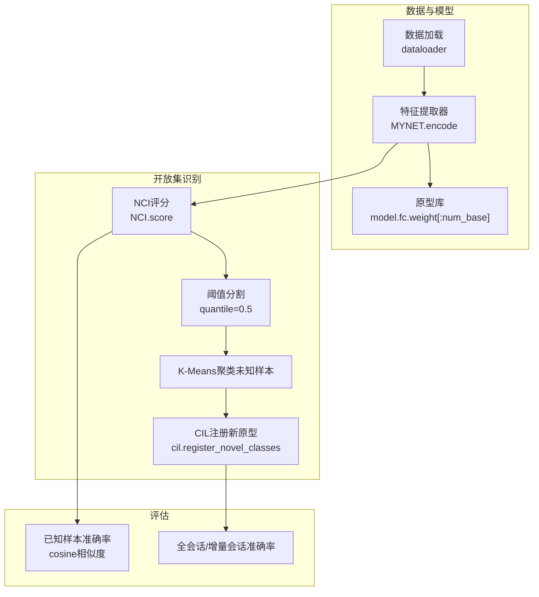
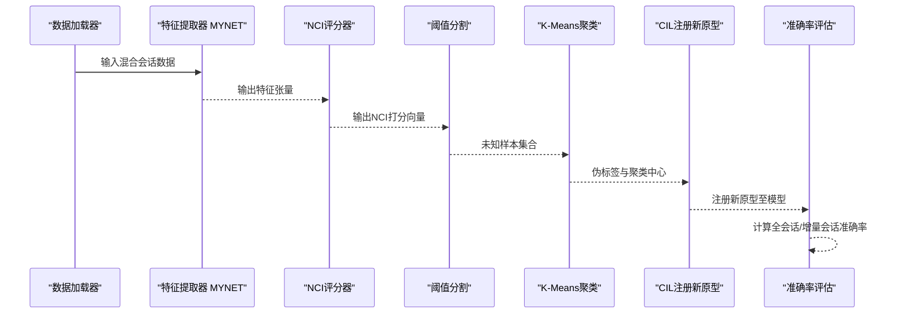
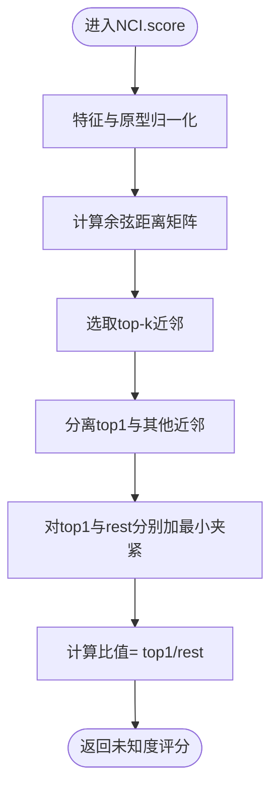
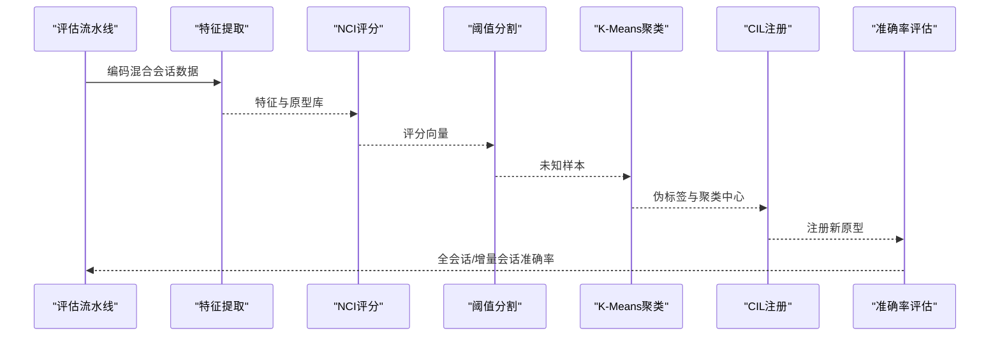
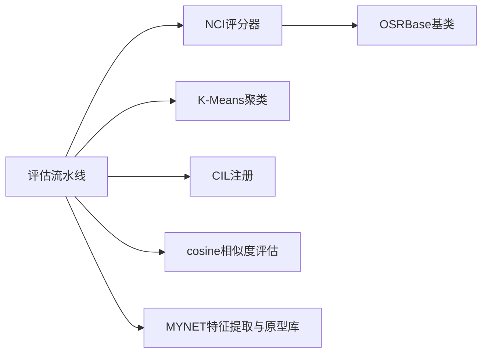

# NCI方法（Neural Causal Inference）

<cite>
**本文引用的文件**
- [models/baselines/osr_methods/nci.py](file://models/baselines/osr_methods/nci.py)
- [models/baselines/base.py](file://models/baselines/base.py)
- [models/baselines/osr_methods/__init__.py](file://models/baselines/osr_methods/__init__.py)
- [scripts/run_all_baselines.py](file://scripts/run_all_baselines.py)
- [scripts/viz_osr.py](file://scripts/viz_osr.py)
- [network.py](file://network.py)
- [configs/default.yml](file://configs/default.yml)
</cite>

## 目录
1. [简介](#简介)
2. [项目结构](#项目结构)
3. [核心组件](#核心组件)
4. [架构总览](#架构总览)
5. [详细组件分析](#详细组件分析)
6. [依赖关系分析](#依赖关系分析)
7. [性能考量](#性能考量)
8. [故障排查指南](#故障排查指南)
9. [结论](#结论)
10. [附录](#附录)

## 简介
本文件面向VAZE项目中的NCI（Neural Causal Inference，神经因果推断）开放集识别方法，系统阐述其理论基础、神经网络实现机制与在音频分类任务中的应用流程。NCI通过“最近类不一致性”思想，利用样本到已知类原型的距离分布来量化未知类识别的不确定性：当样本到最近类原型的距离与其余近邻平均距离之比接近1时，表明样本与多个类等距，从而判定为未知类；反之，若比值显著小于1，则更倾向于已知类。该方法无需显式建模潜在变量或复杂因果图，而是以原型空间几何关系作为“因果推断”的代理，实现高效且可解释的开放集检测。

## 项目结构
NCI方法位于开放集识别基线模块中，与MLS、TANE等方法并列注册，统一由构建器按名称实例化。整体流程在VAZE框架下完成：先对混合（已知+未知）会话数据进行特征提取，再对特征进行NCI打分，依据分位阈值划分未知/已知样本，随后对未知样本聚类并以CIL方式注册新原型，最终在全会话与增量会话上评估准确率。

**图表来源**
- [scripts/run_all_baselines.py:103-171](file://scripts/run_all_baselines.py#L103-L171)
- [models/baselines/osr_methods/nci.py:20-30](file://models/baselines/osr_methods/nci.py#L20-L30)
- [network.py:37-49](file://network.py#L37-L49)

**章节来源**
- [scripts/run_all_baselines.py:103-171](file://scripts/run_all_baselines.py#L103-L171)
- [models/baselines/osr_methods/nci.py:15-30](file://models/baselines/osr_methods/nci.py#L15-L30)
- [network.py:37-49](file://network.py#L37-L49)

## 核心组件
- NCI评分器：继承自OSRBase，实现基于原型空间的最近类不一致性打分。
- OSRBase基类：定义开放集评分接口与阈值自适应检测逻辑。
- 构建器：根据名称注册并实例化NCI等开放集方法。
- 评估流水线：封装特征提取、NCI评分、阈值分割、聚类与CIL注册、最终准确率评估的完整流程。

**章节来源**
- [models/baselines/osr_methods/nci.py:15-30](file://models/baselines/osr_methods/nci.py#L15-L30)
- [models/baselines/base.py:35-55](file://models/baselines/base.py#L35-L55)
- [models/baselines/osr_methods/__init__.py:7-18](file://models/baselines/osr_methods/__init__.py#L7-L18)
- [scripts/run_all_baselines.py:103-171](file://scripts/run_all_baselines.py#L103-L171)

## 架构总览
NCI方法在VAZE框架中的端到端流程如下：数据加载得到混合会话数据，特征提取器输出样本特征，NCI对特征与原型库进行打分，采用分位阈值将样本划分为未知/已知两类；对未知样本执行K-Means聚类，得到伪标签并以CIL方式注册新原型；最后在全会话与增量会话上评估准确率。

**图表来源**
- [scripts/run_all_baselines.py:103-171](file://scripts/run_all_baselines.py#L103-L171)
- [models/baselines/osr_methods/nci.py:20-30](file://models/baselines/osr_methods/nci.py#L20-L30)

## 详细组件分析

### NCI评分器（Neural Causal Inference）
- 理论基础：对每个样本，计算其到已知类原型的余弦距离，选取top-k近邻；不一致性定义为“最近距离/其余近邻平均距离”。当该比值接近1时，样本与多个类等距，视为未知；越小则越倾向已知类。
- 实现要点：
  - 特征与原型归一化，使用余弦距离（1 - 余弦相似）。
  - 选择k（默认5）个最近原型，避免极端异常值影响。
  - 对top1与其余近邻求平均，分别加最小夹紧以避免数值不稳定。
  - 返回比值作为“未知度”评分，越大越可能是未知样本。

**图表来源**
- [models/baselines/osr_methods/nci.py:20-30](file://models/baselines/osr_methods/nci.py#L20-L30)

**章节来源**
- [models/baselines/osr_methods/nci.py:15-30](file://models/baselines/osr_methods/nci.py#L15-L30)

### OSRBase基类与阈值自适应检测
- 接口职责：定义score(features, protos)抽象方法；提供detect(features, protos, quantile)实现，基于批量自适应分位阈值将样本标记为未知/已知。
- 在VAZE中，NCI.score返回的评分越大表示越可能是未知样本；detect默认使用0.5分位阈值。

**章节来源**
- [models/baselines/base.py:35-55](file://models/baselines/base.py#L35-L55)

### 方法注册与构建器
- OSR注册表包含NCI、MLS、TANE；通过build_osr(name, args)按名称实例化对应方法。
- NCI构造时读取参数nci_topk，默认为5。

**章节来源**
- [models/baselines/osr_methods/__init__.py:7-18](file://models/baselines/osr_methods/__init__.py#L7-L18)
- [models/baselines/osr_methods/nci.py:16-18](file://models/baselines/osr_methods/nci.py#L16-L18)

### 评估流水线（run_all_baselines）
- 特征提取：对混合会话数据进行编码，得到特征与标签。
- NCI评分：使用模型的原型库（前num_base类）对特征打分。
- 阈值分割：使用0.5分位阈值划分未知/已知。
- 聚类与注册：对未知样本聚类，结合真实标签计算聚类准确率；将聚类结果映射到目标类并注册新原型。
- 准确率评估：在全会话与增量会话上计算准确率，并汇总F1等指标。

**图表来源**
- [scripts/run_all_baselines.py:103-171](file://scripts/run_all_baselines.py#L103-L171)

**章节来源**
- [scripts/run_all_baselines.py:103-171](file://scripts/run_all_baselines.py#L103-L171)

### 可视化与ROC曲线（viz_osr）
- 通过脚本对多种OSR方法（含NCI）在同一会话下绘制评分直方图与ROC曲线，便于比较不同方法的判别能力。

**章节来源**
- [scripts/viz_osr.py:24-72](file://scripts/viz_osr.py#L24-L72)

## 依赖关系分析
- NCI依赖OSRBase接口，实现score方法；detect由基类提供。
- 评估流水线依赖NCI评分器、K-Means聚类、CIL注册模块与cosine相似度评估。
- 网络结构MYNET提供特征提取与原型库（model.fc.weight），用于NCI评分与后续评估。

**图表来源**
- [models/baselines/osr_methods/nci.py:15-30](file://models/baselines/osr_methods/nci.py#L15-L30)
- [models/baselines/base.py:35-55](file://models/baselines/base.py#L35-L55)
- [scripts/run_all_baselines.py:103-171](file://scripts/run_all_baselines.py#L103-L171)
- [network.py:37-49](file://network.py#L37-L49)

**章节来源**
- [models/baselines/osr_methods/nci.py:15-30](file://models/baselines/osr_methods/nci.py#L15-L30)
- [models/baselines/base.py:35-55](file://models/baselines/base.py#L35-L55)
- [scripts/run_all_baselines.py:103-171](file://scripts/run_all_baselines.py#L103-L171)
- [network.py:37-49](file://network.py#L37-L49)

## 性能考量
- 计算复杂度：NCI评分对每个样本计算与原型库的距离并排序，主要瓶颈在top-k选择与矩阵乘法；整体复杂度约为O(B·C)，其中B为批大小，C为已知类数。
- 数值稳定性：对距离与平均值进行最小夹紧，避免除零与极端波动。
- 参数敏感性：k值影响不一致性的鲁棒性；过大可能包含噪声，过小易受异常值影响。默认k=5在多数场景表现稳健。
- 阈值策略：默认使用0.5分位阈值，可根据未知比例调整；在不平衡场景下可考虑动态阈值或基于ROC的最优阈值。

[本节为通用性能讨论，不直接分析具体文件]

## 故障排查指南
- 评分异常为NaN/Inf：检查特征与原型是否归一化，确认夹紧参数有效。
- 未知比例过高：尝试降低阈值或增大k；检查聚类质量与标签映射。
- 准确率偏低：确认原型库是否与预训练特征对齐；检查CIL注册是否成功写入model.fc.weight。
- GPU内存不足：减小批大小或使用更小的k；在评估脚本中适当降低数据加载批大小。

**章节来源**
- [models/baselines/osr_methods/nci.py:20-30](file://models/baselines/osr_methods/nci.py#L20-L30)
- [scripts/run_all_baselines.py:103-171](file://scripts/run_all_baselines.py#L103-L171)

## 结论
NCI方法以原型空间几何关系为核心，通过“最近类不一致性”实现开放集识别，具有实现简洁、可解释性强、计算高效的特点。在VAZE框架下，NCI与K-Means聚类、CIL注册相结合，形成完整的增量学习与开放集检测闭环。相比需显式建模因果图的传统OSR方法，NCI更侧重于原型空间的几何不一致性，适合在大规模已知类与未知样本并存的场景中快速部署与评估。

[本节为总结性内容，不直接分析具体文件]

## 附录

### 参数配置建议
- nci_topk：控制参与不一致度计算的近邻数量，默认5；可根据数据分布与类别密度调整。
- 阈值策略：默认0.5分位阈值；在未知样本比例较高时可下调阈值，或采用ROC最优阈值。
- 聚类参数：未知样本聚类数应与预期新增类别数一致；K-Means初始化次数可适当增加以提升稳定性。

**章节来源**
- [models/baselines/osr_methods/nci.py:16-18](file://models/baselines/osr_methods/nci.py#L16-L18)
- [scripts/run_all_baselines.py:103-171](file://scripts/run_all_baselines.py#L103-L171)

### 性能评估方法
- 已知/未知准确率：对已知与未知样本分别计算准确率，评估NCI的判别能力。
- 全会话/增量会话准确率：衡量CIL注册后在扩展类别上的泛化能力。
- F1指标：综合考虑查准率与召回率，评估整体性能。

**章节来源**
- [scripts/run_all_baselines.py:167-170](file://scripts/run_all_baselines.py#L167-L170)

### 与传统OSR方法的区别
- 传统OSR方法常依赖显式因果图或潜在变量建模，强调因果关系的结构性假设；NCI则以原型空间的几何不一致性作为“因果推断”的代理，无需显式因果结构，实现更轻量、更易部署。
- 在音频分类任务中，NCI通过cosine相似度与原型库即可快速获得稳定的开放集判别信号，适合与K-Means聚类、CIL注册等模块无缝集成。

[本节为概念性对比，不直接分析具体文件]