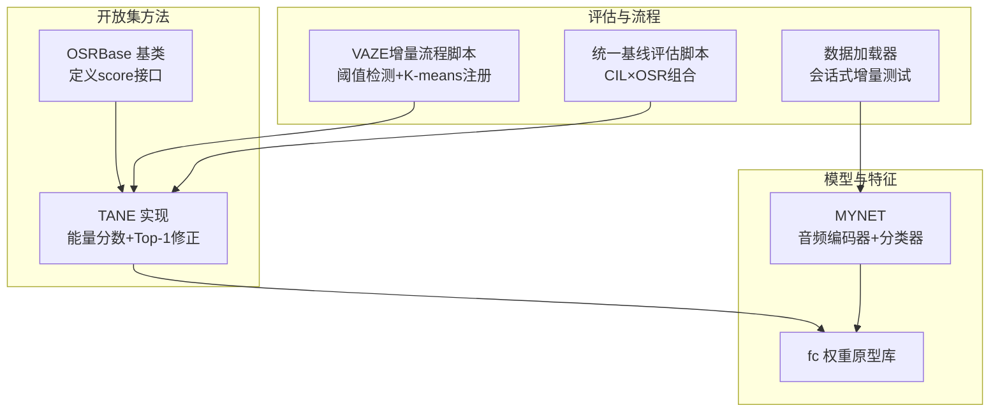
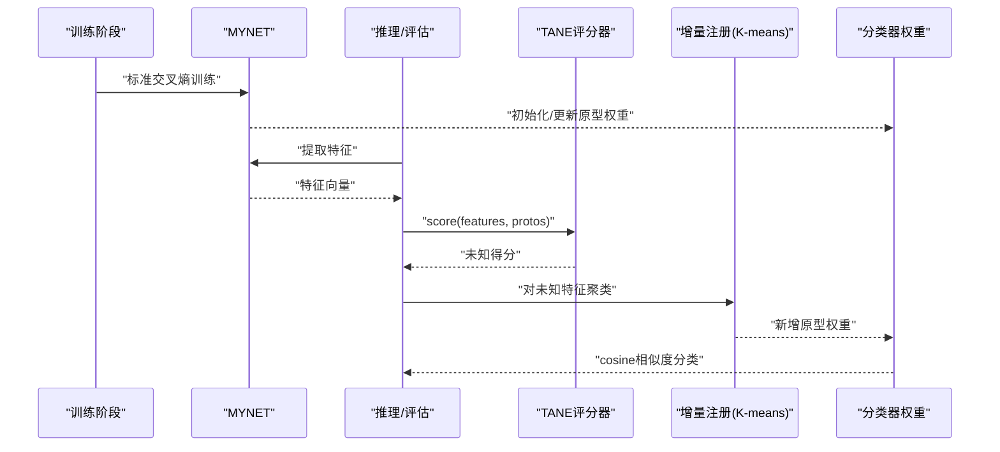
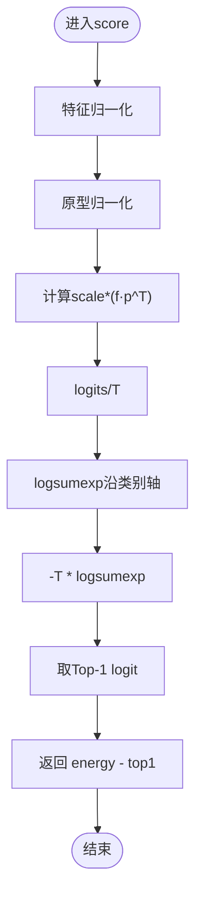
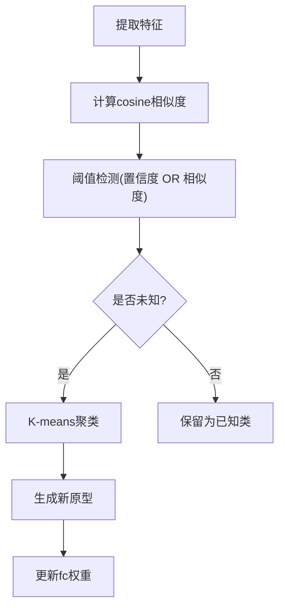
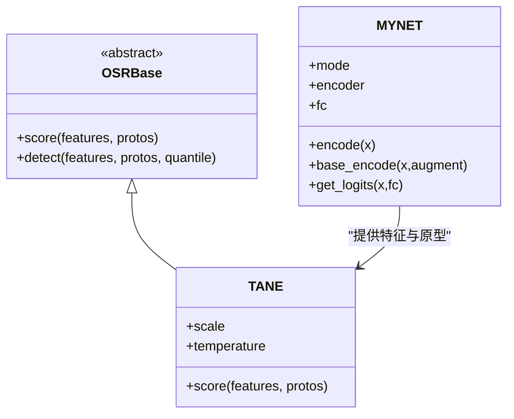
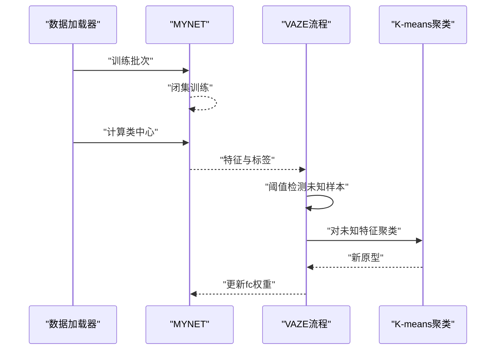
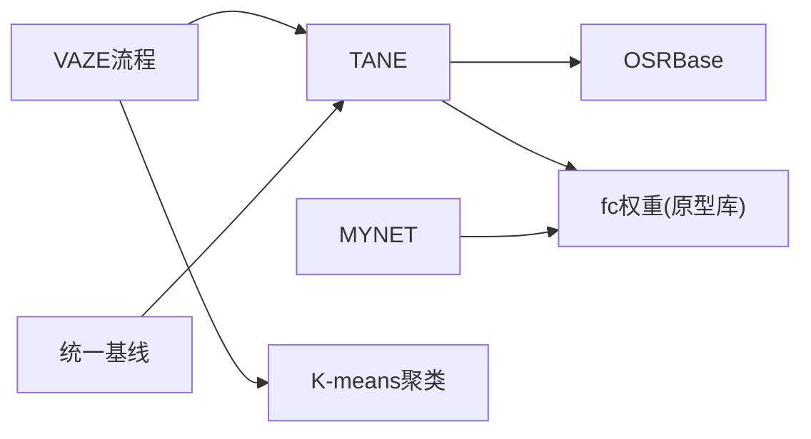

# TANE方法（任务感知神经嵌入）

<cite>
**本文引用的文件**
- [models/baselines/osr_methods/tane.py](file://models/baselines/osr_methods/tane.py)
- [models/baselines/base.py](file://models/baselines/base.py)
- [models/baselines/osr_methods/__init__.py](file://models/baselines/osr_methods/__init__.py)
- [network.py](file://network.py)
- [train_openset_vaze.py](file://train_openset_vaze.py)
- [scripts/run_all_baselines.py](file://scripts/run_all_baselines.py)
- [configs/default.yml](file://configs/default.yml)
- [data/dataloader.py](file://data/dataloader.py)
- [models/FSEval.py](file://models/FSEval.py)
</cite>

## 目录
1. [简介](#简介)
2. [项目结构](#项目结构)
3. [核心组件](#核心组件)
4. [架构总览](#架构总览)
5. [详细组件分析](#详细组件分析)
6. [依赖关系分析](#依赖关系分析)
7. [性能考量](#性能考量)
8. [故障排查指南](#故障排查指南)
9. [结论](#结论)
10. [附录](#附录)

## 简介
本文件面向VAZE项目中的TANE（Task-Aware Neural Embedding）开放集识别方法，系统阐述其任务感知嵌入的理论与实现。TANE通过任务相关性引导特征学习，强调已知类与未知类之间的判别边界，从而在开放集场景下提升未知检测与增量学习的稳定性与鲁棒性。本文将从算法原理、嵌入空间设计、任务感知机制、特征对齐策略、网络架构、训练流程、超参数设置、实验结果与部署建议等方面进行全面解析。

## 项目结构
VAZE仓库围绕“闭集分类器 + 开放集决策规则 + 增量原型注册”的流水线组织代码。与TANE直接相关的关键模块包括：
- 开放集评分器基类与具体实现（TANE）
- 音频特征提取与分类器（MYNET）
- 开放集评估与VAZE增量流程脚本
- 统一的基线评估脚本（支持多种CIL/OSR组合）
- 数据加载与会话式增量测试接口
- 配置文件（训练、网络、数据增强等）

**图示来源**
- [models/baselines/base.py:35-55](file://models/baselines/base.py#L35-L55)
- [models/baselines/osr_methods/tane.py:15-28](file://models/baselines/osr_methods/tane.py#L15-L28)
- [network.py:18-504](file://network.py#L18-L504)
- [train_openset_vaze.py:134-198](file://train_openset_vaze.py#L134-L198)
- [scripts/run_all_baselines.py:103-171](file://scripts/run_all_baselines.py#L103-L171)
- [data/dataloader.py:48-106](file://data/dataloader.py#L48-L106)

**章节来源**
- [models/baselines/base.py:35-55](file://models/baselines/base.py#L35-L55)
- [models/baselines/osr_methods/tane.py:15-28](file://models/baselines/osr_methods/tane.py#L15-L28)
- [network.py:18-504](file://network.py#L18-L504)
- [train_openset_vaze.py:134-198](file://train_openset_vaze.py#L134-L198)
- [scripts/run_all_baselines.py:103-171](file://scripts/run_all_baselines.py#L103-L171)
- [data/dataloader.py:48-106](file://data/dataloader.py#L48-L106)

## 核心组件
- TANE评分器：基于归一化特征与原型的余弦相似度，构造温度缩放的log-sum-exp能量项，并减去Top-1 logit以突出最佳与次佳类别的边界，得分越高越可能为未知。
- 原型库（fc权重）：由已知类的平均特征构成，用于cosine相似度与阈值判定。
- 任务感知机制：VAZE采用“闭集分类器 + 特征阈值 + 原型对齐”的策略，结合cosine相似度与softmax置信度，形成任务相关的未知检测规则。
- 增量注册：对检测到的未知样本聚类，得到新类原型并注入分类器权重，实现增量学习。

**章节来源**
- [models/baselines/osr_methods/tane.py:15-28](file://models/baselines/osr_methods/tane.py#L15-L28)
- [models/baselines/base.py:35-55](file://models/baselines/base.py#L35-L55)
- [train_openset_vaze.py:134-198](file://train_openset_vaze.py#L134-L198)

## 架构总览
TANE在VAZE框架中的位置如下：训练阶段使用MYNET进行闭集分类；推理阶段对混合（已知+未知）会话数据提取特征，调用TANE评分器进行未知检测；随后对未知样本聚类并注册新原型，更新分类器权重。

**图示来源**
- [network.py:471-503](file://network.py#L471-L503)
- [models/baselines/osr_methods/tane.py:21-28](file://models/baselines/osr_methods/tane.py#L21-L28)
- [train_openset_vaze.py:134-198](file://train_openset_vaze.py#L134-L198)

## 详细组件分析

### TANE评分器（OSRBase子类）
- 输入：样本特征张量与原型张量（归一化）
- 核心计算：
  - 归一化特征与原型
  - 温度缩放的余弦相似度矩阵
  - 能量项：温度参数下的log-sum-exp
  - Top-1修正：减去最大logit，强调类别边界
- 输出：每样本的未知度得分，越大越可能为未知

**图示来源**
- [models/baselines/osr_methods/tane.py:21-28](file://models/baselines/osr_methods/tane.py#L21-L28)

**章节来源**
- [models/baselines/osr_methods/tane.py:15-28](file://models/baselines/osr_methods/tane.py#L15-L28)
- [models/baselines/base.py:35-55](file://models/baselines/base.py#L35-L55)

### 任务感知机制与特征对齐
- 任务相关性体现在cosine相似度与softmax置信度的联合阈值策略：既看“与最近原型的相似度”，也看“分类置信度”。
- 特征对齐策略：
  - 使用MYNET的base_encode或encode提取特征，保证与分类器权重维度一致
  - 通过cosine相似度进行分类，避免显式角度归一化导致的尺度差异
  - 在VAZE流程中，先计算类中心，再进行阈值检测与聚类注册

**图示来源**
- [train_openset_vaze.py:134-198](file://train_openset_vaze.py#L134-L198)
- [network.py:486-503](file://network.py#L486-L503)

**章节来源**
- [train_openset_vaze.py:134-198](file://train_openset_vaze.py#L134-L198)
- [network.py:486-503](file://network.py#L486-L503)

### 网络架构与训练流程
- 编码器：MYNET采用预训练ResNet18作为特征提取器，输出固定维度特征
- 分类器：线性层（fc）作为原型库，支持cosine分类与温度缩放
- 训练流程：
  - 闭集训练：标准交叉熵损失
  - 推理/评估：提取特征，cosine相似度分类
  - VAZE增量：阈值检测未知样本，K-means聚类，注册新原型

**图示来源**
- [network.py:18-504](file://network.py#L18-L504)
- [models/baselines/osr_methods/tane.py:15-28](file://models/baselines/osr_methods/tane.py#L15-L28)
- [models/baselines/base.py:35-55](file://models/baselines/base.py#L35-L55)

**章节来源**
- [network.py:18-504](file://network.py#L18-L504)
- [models/baselines/osr_methods/tane.py:15-28](file://models/baselines/osr_methods/tane.py#L15-L28)
- [models/baselines/base.py:35-55](file://models/baselines/base.py#L35-L55)

### 训练与评估流程（VAZE）
- 闭集训练：MYNET在预训练数据上进行标准分类训练
- 类中心计算：遍历训练集，对每个类求特征均值作为原型
- 未知检测：对混合会话数据计算softmax置信度与特征-原型相似度，二者任一低于阈值即判定为未知
- 增量注册：对未知特征聚类，生成新原型并追加到fc权重

**图示来源**
- [train_openset_vaze.py:86-198](file://train_openset_vaze.py#L86-L198)
- [data/dataloader.py:108-132](file://data/dataloader.py#L108-L132)

**章节来源**
- [train_openset_vaze.py:86-198](file://train_openset_vaze.py#L86-L198)
- [data/dataloader.py:108-132](file://data/dataloader.py#L108-L132)

### 统一基线评估（CIL×OSR）
- 支持多种CIL与OSR组合的批量评估
- 对每个会话：提取特征→OSR评分→阈值分割→K-means→CIL注册→评估指标
- 输出格式与VAZE一致，便于横向比较

**章节来源**
- [scripts/run_all_baselines.py:103-171](file://scripts/run_all_baselines.py#L103-L171)

## 依赖关系分析
- TANE依赖OSRBase接口，提供score与detect能力
- MYNET提供特征提取与cosine分类能力，其fc权重即为原型库
- VAZE流程依赖KMeans进行未知样本聚类
- 统一基线脚本支持CIL×OSR组合评估

**图示来源**
- [models/baselines/osr_methods/tane.py:15-28](file://models/baselines/osr_methods/tane.py#L15-L28)
- [models/baselines/base.py:35-55](file://models/baselines/base.py#L35-L55)
- [network.py:436-461](file://network.py#L436-L461)
- [train_openset_vaze.py:173-198](file://train_openset_vaze.py#L173-L198)
- [scripts/run_all_baselines.py:103-171](file://scripts/run_all_baselines.py#L103-L171)

**章节来源**
- [models/baselines/osr_methods/tane.py:15-28](file://models/baselines/osr_methods/tane.py#L15-L28)
- [models/baselines/base.py:35-55](file://models/baselines/base.py#L35-L55)
- [network.py:436-461](file://network.py#L436-L461)
- [train_openset_vaze.py:173-198](file://train_openset_vaze.py#L173-L198)
- [scripts/run_all_baselines.py:103-171](file://scripts/run_all_baselines.py#L103-L171)

## 性能考量
- 嵌入质量：特征归一化与cosine相似度有助于缓解类别不平衡与尺度差异
- 温度与缩放：TANE的温度参数与scale影响能量项与边界锐度，需在验证集上调优
- 阈值策略：置信度阈值与相似度阈值共同决定未知检测的敏感度，应结合数据分布自适应调整
- 增量稳定性：K-means聚类数量与初始化对新原型质量影响较大，建议多次随机初始化并选择最优划分

[本节为通用指导，无需特定文件来源]

## 故障排查指南
- 特征维度不匹配：确保MYNET的encode/base_encode输出维度与fc权重一致，必要时进行裁剪或补零
- 未知检测阈值不当：若误检过多，提高阈值；若漏检过多，降低阈值
- 增量注册失败：检查未知特征是否为空、聚类数量是否合理、新原型是否成功写入fc权重
- 内存不足：在大规模数据上运行时，注意批大小与设备内存限制

**章节来源**
- [train_openset_vaze.py:173-198](file://train_openset_vaze.py#L173-L198)
- [network.py:405-461](file://network.py#L405-L461)

## 结论
TANE通过任务相关的能量分数与Top-1修正，有效刻画已知与未知类别的边界，在VAZE框架中与阈值检测、K-means聚类及增量原型注册形成闭环。其优势在于：
- 无需额外的未知分支网络，仅利用现有cosine分类器即可实现开放集检测
- 任务感知体现在cosine相似度与置信度的联合阈值策略
- 在增量学习场景中，通过原型对齐与聚类注册，逐步扩展类别池并维持已知类性能

[本节为总结，无需特定文件来源]

## 附录

### 超参数设置指南
- TANE相关：
  - scale：控制余弦相似度缩放强度，建议在[8, 32]范围内搜索
  - temperature：控制log-sum-exp的能量温度，建议在[0.5, 2.0]范围内搜索
- VAZE流程：
  - 置信度阈值：默认0.5，可根据验证集表现调整
  - 相似度阈值：默认0.4，建议结合数据集统计分布设定
  - K-means聚类数：通常等于新增类数量（num_unlabeled_classes）

**章节来源**
- [models/baselines/osr_methods/tane.py:16-19](file://models/baselines/osr_methods/tane.py#L16-L19)
- [train_openset_vaze.py:134-170](file://train_openset_vaze.py#L134-L170)
- [configs/default.yml:42-45](file://configs/default.yml#L42-L45)

### 在不同数据集上的实验结果与基准
- 仓库提供了多轮会话的增量评估结果文件，可用于对比不同方法的平均准确率（AA）与性能退化（PD）
- 建议在相同配置下运行VAZE与其它OSR方法，记录Session 0与最后Session的准确率变化，以及F1、增量准确率等指标

**章节来源**
- [save_result/test_result.txt:1-62](file://save_result/test_result.txt#L1-L62)
- [scripts/run_all_baselines.py:228-276](file://scripts/run_all_baselines.py#L228-L276)

### 实际部署考虑
- 推理阶段仅需特征提取与cosine相似度计算，计算开销低，适合在线部署
- 增量注册建议离线执行，避免实时推理受阻
- 为保证稳定性，建议缓存类中心并在会话间复用

**章节来源**
- [network.py:471-503](file://network.py#L471-L503)
- [train_openset_vaze.py:102-132](file://train_openset_vaze.py#L102-L132)