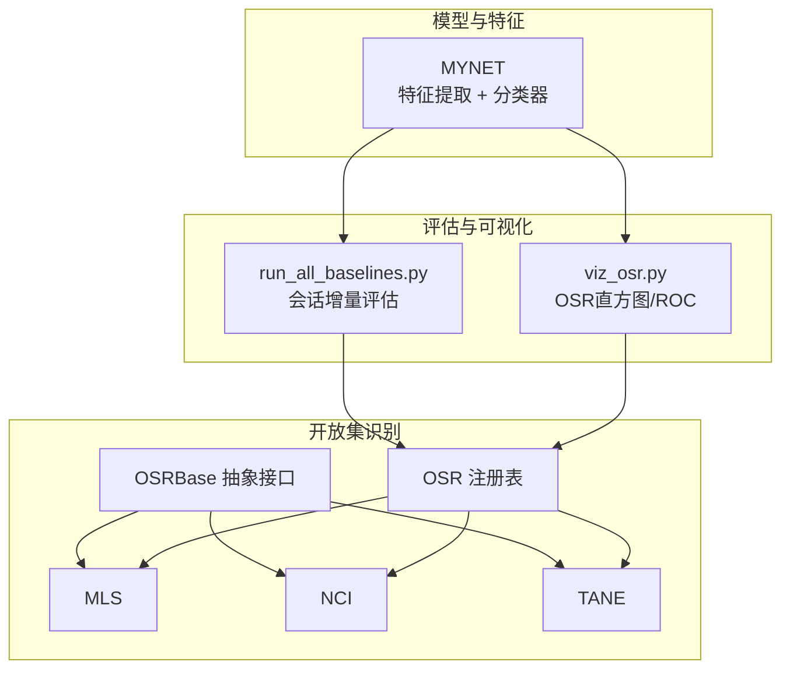
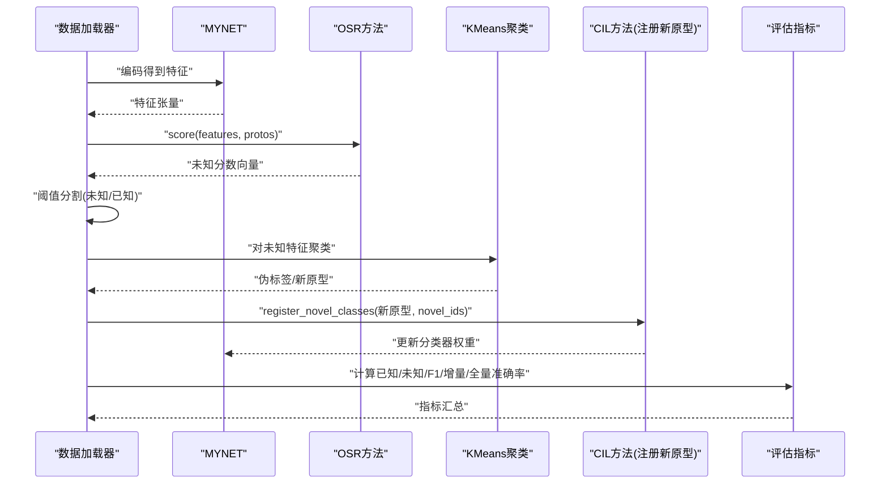
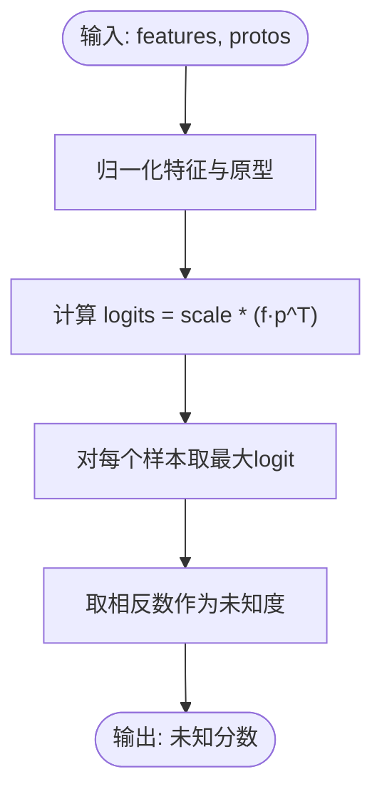
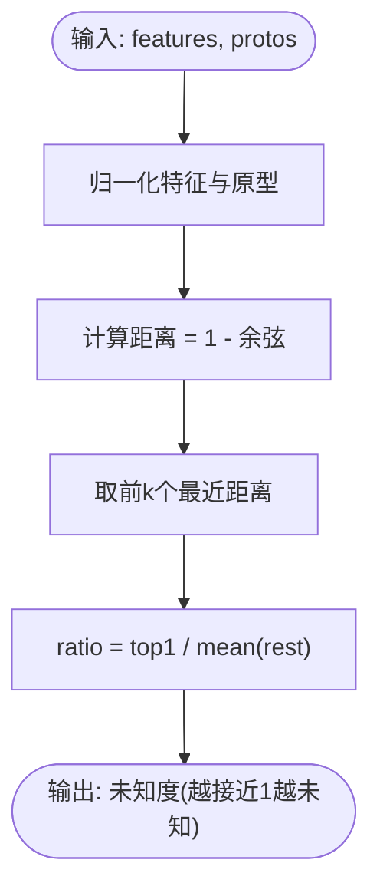
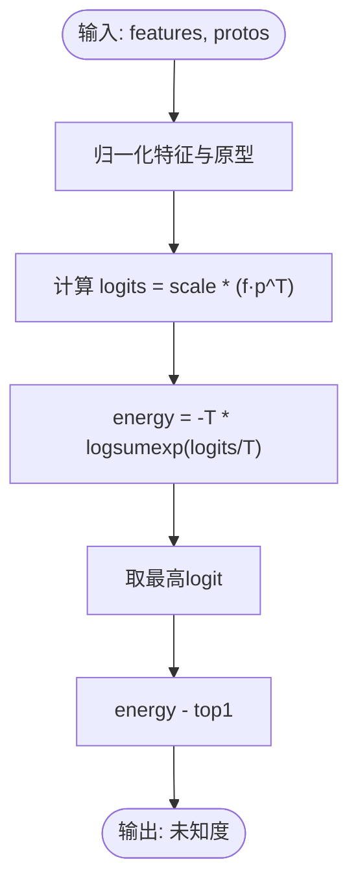
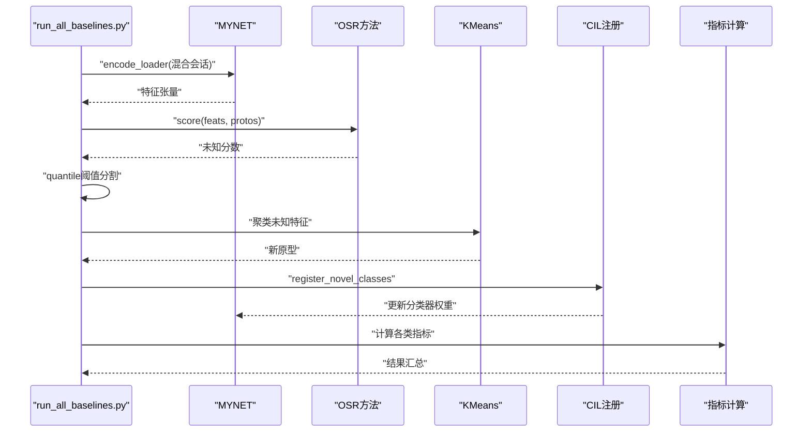
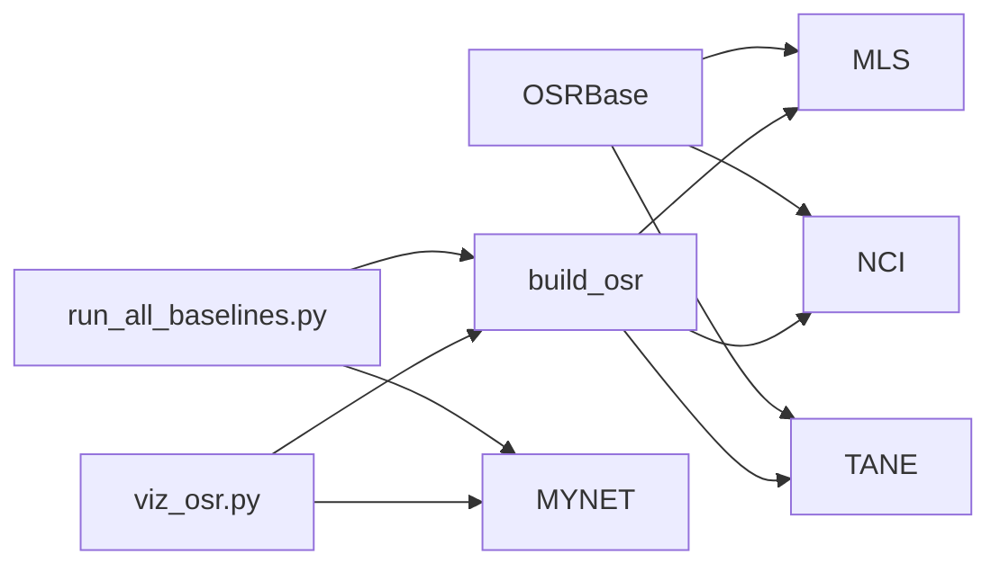

# 开放集识别方法 (OSR)

<cite>
**本文引用的文件列表**
- [models/baselines/osr_methods/mls.py](file://models/baselines/osr_methods/mls.py)
- [models/baselines/osr_methods/nci.py](file://models/baselines/osr_methods/nci.py)
- [models/baselines/osr_methods/tane.py](file://models/baselines/osr_methods/tane.py)
- [models/baselines/base.py](file://models/baselines/base.py)
- [models/baselines/osr_methods/__init__.py](file://models/baselines/osr_methods/__init__.py)
- [models/baselines/__init__.py](file://models/baselines/__init__.py)
- [scripts/run_all_baselines.py](file://scripts/run_all_baselines.py)
- [scripts/viz_osr.py](file://scripts/viz_osr.py)
- [network.py](file://network.py)
- [train_openset_vaze.py](file://train_openset_vaze.py)
- [configs/default.yml](file://configs/default.yml)
- [save_result/test_result.txt](file://save_result/test_result.txt)
</cite>

## 目录
1. [简介](#简介)
2. [项目结构](#项目结构)
3. [核心组件](#核心组件)
4. [架构总览](#架构总览)
5. [详细组件分析](#详细组件分析)
6. [依赖关系分析](#依赖关系分析)
7. [性能考量](#性能考量)
8. [故障排查指南](#故障排查指南)
9. [结论](#结论)
10. [附录](#附录)

## 简介
本文件面向VAZE项目中的开放集识别（Open-Set Recognition, OSR）方法，系统梳理并深入解析三种核心算法：
- MLS（Maximum Logit Score）
- NCI（Neural Causal Inference）
- TANE（Task-Aware Neural Embedding）

文档重点覆盖以下方面：
- 算法在处理未知类别识别时的理论基础与实现机制
- 如何通过特征与原型的相似度、能量与边界等信号区分已知与未知
- 参数调优建议、性能评估方法与实际应用案例
- 算法选择策略与在不同场景下的适用性分析

## 项目结构
VAZE项目围绕“闭集分类器 + 开放集决策规则”的范式组织，其中：
- 模型与特征提取由网络模块负责
- 开放集识别方法封装于独立的OSR模块
- 评估流程统一由脚本驱动，支持批量对比不同(CIL, OSR)组合

图表来源
- [network.py:18-50](file://network.py#L18-L50)
- [models/baselines/base.py:35-55](file://models/baselines/base.py#L35-L55)
- [models/baselines/osr_methods/__init__.py:1-21](file://models/baselines/osr_methods/__init__.py#L1-L21)
- [scripts/run_all_baselines.py:103-171](file://scripts/run_all_baselines.py#L103-L171)
- [scripts/viz_osr.py:24-78](file://scripts/viz_osr.py#L24-L78)

章节来源
- [models/baselines/__init__.py:1-16](file://models/baselines/__init__.py#L1-L16)
- [configs/default.yml:1-88](file://configs/default.yml#L1-L88)

## 核心组件
- OSRBase抽象基类：定义统一的score接口与基于分位数的简单自适应阈值检测逻辑
- 三个具体OSR方法：
  - MLS：基于最大logit的负余弦相似度，得分越高越可能未知
  - NCI：基于最近k类原型的距离比值，接近1表示歧义（未知）
  - TANE：基于温度缩放的对数和指数能量，并减去最高logit，得分越高越可能未知
- OSR注册表：按名称构建具体OSR实例
- 评估脚本：统一编码特征、OSR打分、聚类未知样本、增量注册新原型、计算各类指标
- 可视化脚本：绘制OSR分数直方图、ROC曲线与已知类混淆矩阵

章节来源
- [models/baselines/base.py:35-76](file://models/baselines/base.py#L35-L76)
- [models/baselines/osr_methods/mls.py:15-26](file://models/baselines/osr_methods/mls.py#L15-L26)
- [models/baselines/osr_methods/nci.py:15-31](file://models/baselines/osr_methods/nci.py#L15-L31)
- [models/baselines/osr_methods/tane.py:15-29](file://models/baselines/osr_methods/tane.py#L15-L29)
- [models/baselines/osr_methods/__init__.py:14-21](file://models/baselines/osr_methods/__init__.py#L14-L21)
- [scripts/run_all_baselines.py:103-171](file://scripts/run_all_baselines.py#L103-L171)
- [scripts/viz_osr.py:24-78](file://scripts/viz_osr.py#L24-L78)

## 架构总览
下图展示了从特征提取到OSR打分再到增量注册与评估的整体流程。

图表来源
- [scripts/run_all_baselines.py:103-171](file://scripts/run_all_baselines.py#L103-L171)
- [network.py:18-50](file://network.py#L18-L50)

## 详细组件分析

### MLS（Maximum Logit Score）
- 理论基础
  - 使用特征与原型的归一化余弦相似度作为logits，取最大logit的负值作为未知度量
  - 得分越高，表示样本与任何已知类的最大相似度越低，越可能属于未知类
- 实现要点
  - 归一化特征与原型，乘以scale得到logits
  - 对每个样本取最大logit，返回其相反数
- 关键参数
  - scale：缩放因子，控制logits幅度，影响未知度量的敏感度
- 适用场景
  - 当已知类原型分布清晰、边界明显时，MLs能有效识别远离原型的未知样本

图表来源
- [models/baselines/osr_methods/mls.py:20-25](file://models/baselines/osr_methods/mls.py#L20-L25)

章节来源
- [models/baselines/osr_methods/mls.py:15-26](file://models/baselines/osr_methods/mls.py#L15-L26)
- [models/baselines/base.py:61-65](file://models/baselines/base.py#L61-L65)

### NCI（Nearest-Class Inconsistency）
- 理论基础
  - 对每个样本，取其到前k个最近原型的距离（余弦距离），计算top1距离与其余平均距离的比值
  - 比值接近1表示样本到多个类距离相近，存在歧义，更可能是未知类
- 实现要点
  - 距离定义为1 - 余弦
  - 取最小的k个距离，避免k超过类别数
  - 为数值稳定性加入最小夹紧
- 关键参数
  - k：参与比较的最近类数目
- 适用场景
  - 当未知样本在特征空间中与多个已知类近似等距时，NCI具有较强判别力

图表来源
- [models/baselines/osr_methods/nci.py:20-30](file://models/baselines/osr_methods/nci.py#L20-L30)

章节来源
- [models/baselines/osr_methods/nci.py:15-31](file://models/baselines/osr_methods/nci.py#L15-L31)

### TANE（Task-Aware Neural Embedding）
- 理论基础
  - 使用温度缩放的对数和指数能量（log-sum-exp）衡量分布的“平坦度”，再减去最高logit，强调最佳与次佳类之间的边界
  - 得分越高，表示分布越平坦、置信度越低，越可能未知
- 实现要点
  - 归一化特征与原型，乘以scale得到logits
  - 计算能量项，再减去最高logit
- 关键参数
  - scale：同MLs
  - temperature：温度参数，控制log-sum-exp的锐利程度
- 适用场景
  - 当需要同时考虑分布平坦度与分类边界时，TANE能提供更稳健的未知度量

图表来源
- [models/baselines/osr_methods/tane.py:21-28](file://models/baselines/osr_methods/tane.py#L21-L28)

章节来源
- [models/baselines/osr_methods/tane.py:15-29](file://models/baselines/osr_methods/tane.py#L15-L29)

### OSR注册表与构建
- 支持通过名称构建具体OSR实例
- 名称不区分大小写，若不在注册表中则抛出错误

章节来源
- [models/baselines/osr_methods/__init__.py:14-21](file://models/baselines/osr_methods/__init__.py#L14-L21)

### 评估与可视化流程
- 统一编码：将混合（已知+未知）会话的数据编码为特征张量
- OSR打分：对特征与当前已知原型库打分，采用分位数阈值进行未知/已知分割
- 聚类与增量：对未知特征进行KMeans聚类，形成新原型并注册到分类器
- 指标计算：计算已知准确率、未知聚类准确率、F1、增量准确率与全量准确率
- 可视化：绘制OSR分数直方图、ROC曲线与已知类混淆矩阵

图表来源
- [scripts/run_all_baselines.py:103-171](file://scripts/run_all_baselines.py#L103-L171)

章节来源
- [scripts/run_all_baselines.py:103-171](file://scripts/run_all_baselines.py#L103-L171)
- [scripts/viz_osr.py:24-78](file://scripts/viz_osr.py#L24-L78)

## 依赖关系分析
- OSR方法均继承自OSRBase，共享统一接口与阈值检测逻辑
- 评估脚本通过build_osr按名称构建OSR实例，统一处理所有OSR方法
- 可视化脚本同样通过build_osr加载OSR方法，进行分数统计与ROC绘制
- 网络模块提供特征编码与分类器权重（原型银行），供OSR与评估共同使用

图表来源
- [models/baselines/base.py:35-55](file://models/baselines/base.py#L35-L55)
- [models/baselines/osr_methods/__init__.py:14-21](file://models/baselines/osr_methods/__init__.py#L14-L21)
- [scripts/run_all_baselines.py:103-112](file://scripts/run_all_baselines.py#L103-L112)
- [scripts/viz_osr.py:60-61](file://scripts/viz_osr.py#L60-L61)
- [network.py:18-50](file://network.py#L18-L50)

章节来源
- [models/baselines/base.py:35-55](file://models/baselines/base.py#L35-L55)
- [models/baselines/osr_methods/__init__.py:14-21](file://models/baselines/osr_methods/__init__.py#L14-L21)
- [scripts/run_all_baselines.py:103-112](file://scripts/run_all_baselines.py#L103-L112)
- [scripts/viz_osr.py:60-61](file://scripts/viz_osr.py#L60-L61)
- [network.py:18-50](file://network.py#L18-L50)

## 性能考量
- 计算复杂度
  - 三者均为O(B·C)的二次匹配开销，其中B为批大小，C为已知类数
  - NCI额外引入Top-K排序，约为O(B·C·k)，k为最近邻数
- 数值稳定性
  - NCI对距离进行夹紧，避免除零与极端比值
  - TANE通过温度参数控制log-sum-exp的锐利程度，防止过拟合
- 阈值策略
  - OSRBase提供基于分位数的自适应阈值，减少手工调参
  - 评估脚本默认使用0.5分位数，可根据数据分布调整
- 可扩展性
  - 通过注册表可轻松扩展新的OSR方法
  - 评估流程对不同OSR方法保持一致，便于横向对比

[本节为通用性能讨论，不直接分析具体文件]

## 故障排查指南
- 未知判定过多
  - 检查OSR阈值是否过低（分位数过高），或NCI的k过大导致比值易趋近1
  - 调整MLs的scale或TANE的temperature，使未知度量更敏感
- 未知判定过少
  - 检查阈值是否过高，或原型库过于稀疏
  - 增加k（NCI）或降低scale/temperature（MLs/TANE）
- 聚类效果差
  - 未知样本数量不足或噪声过大，尝试增大n_clusters或清洗特征
  - 确认特征维度与分类器权重维度一致，必要时进行填充或截断
- 指标异常
  - 检查标签范围与num_base是否一致，避免将未知类误判为已知
  - 多次运行取均值，关注标准差以评估稳定性

章节来源
- [models/baselines/base.py:49-54](file://models/baselines/base.py#L49-L54)
- [scripts/run_all_baselines.py:120-152](file://scripts/run_all_baselines.py#L120-L152)
- [train_openset_vaze.py:173-198](file://train_openset_vaze.py#L173-L198)

## 结论
- 三种OSR方法各有侧重：MLs强调最大相似度的缺失，NCI强调多类等距的歧义，TANE强调分布平坦度与边界
- 在VAZE框架中，它们共享同一特征与原型银行，通过统一的评估与可视化流程进行公平对比
- 实践中建议先以默认阈值与参数运行，结合ROC与直方图观察分布形态，再根据场景需求微调

[本节为总结性内容，不直接分析具体文件]

## 附录

### 参数调优指南
- 通用参数
  - 分位数阈值：默认0.5，可根据未知比例调整
  - 归一化：三者均对特征与原型进行归一化，保证尺度一致
- MLS
  - scale：增大提高对未知的敏感度；过大会导致误判
- NCI
  - k：增大提升对歧义的敏感度；过小可能忽略多类竞争
  - 为数值稳定加入最小夹紧
- TANE
  - scale：与MLs类似
  - temperature：增大使能量更平坦，降低使边界更锐利
- 评估与可视化
  - 使用ROC与直方图辅助选择阈值与参数
  - 可视化已知类混淆矩阵，检查误判模式

章节来源
- [models/baselines/base.py:49-54](file://models/baselines/base.py#L49-L54)
- [models/baselines/osr_methods/mls.py:18](file://models/baselines/osr_methods/mls.py#L18)
- [models/baselines/osr_methods/nci.py:18](file://models/baselines/osr_methods/nci.py#L18)
- [models/baselines/osr_methods/tane.py:18-19](file://models/baselines/osr_methods/tane.py#L18-L19)
- [scripts/viz_osr.py:60-72](file://scripts/viz_osr.py#L60-L72)

### 性能评估方法
- 指标
  - 已知准确率、未知聚类准确率、F1、增量准确率、全量准确率
- 数据集与会话
  - 使用统一的增量会话协议，记录每会话的平均与标准差
- 结果解读
  - 观察Session1到SessionN的性能下降（PD），评估开放世界下的稳定性
  - 对比不同OSR方法在同一配置下的表现

章节来源
- [scripts/run_all_baselines.py:167-170](file://scripts/run_all_baselines.py#L167-L170)
- [save_result/test_result.txt:42-62](file://save_result/test_result.txt#L42-L62)

### 实际应用案例
- 语音开放世界分类
  - 使用MYNET编码音频特征，对混合会话进行OSR打分与增量注册
  - 通过可视化脚本分析不同OSR方法在各会话的ROC与直方图
- 增量学习
  - 将未知样本聚类得到的新原型注册到分类器，逐步扩展类池
  - 在多会话下评估已知/未知/增量/全量准确率，观察性能退化情况

章节来源
- [scripts/run_all_baselines.py:103-171](file://scripts/run_all_baselines.py#L103-L171)
- [scripts/viz_osr.py:24-78](file://scripts/viz_osr.py#L24-L78)
- [train_openset_vaze.py:420-481](file://train_openset_vaze.py#L420-L481)

### 算法选择策略与适用性分析
- 场景特征
  - 已知类边界清晰：优先MLs
  - 多类竞争显著：优先NCI
  - 分布平坦且需强调边界：优先TANE
- 实验建议
  - 先固定阈值与参数，比较ROC与直方图
  - 在多个会话上评估稳定性与退化趋势
  - 结合任务目标（如未知拒识率vs已知识别率）权衡

[本节为概念性指导，不直接分析具体文件]