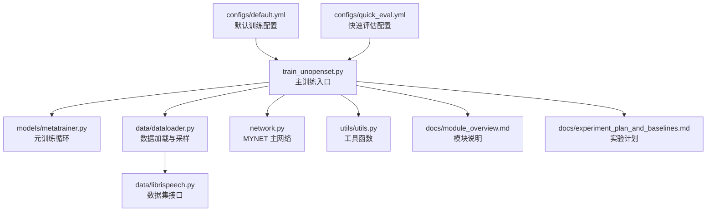
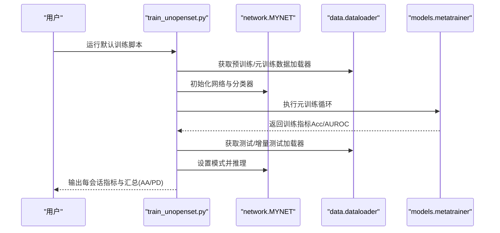
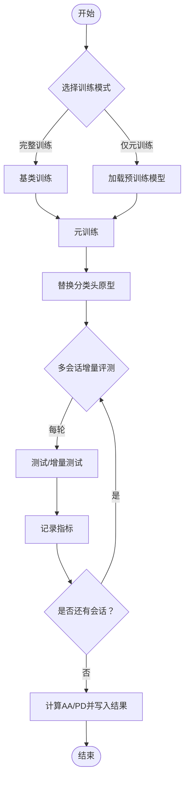
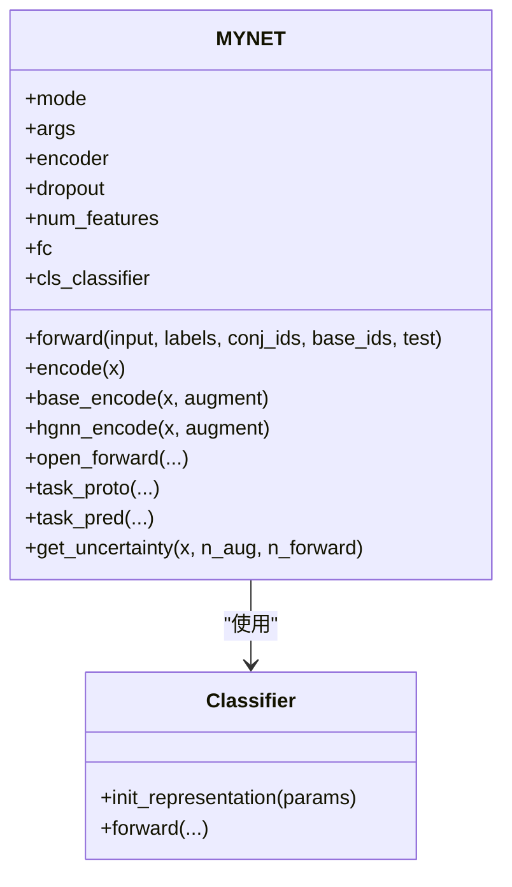
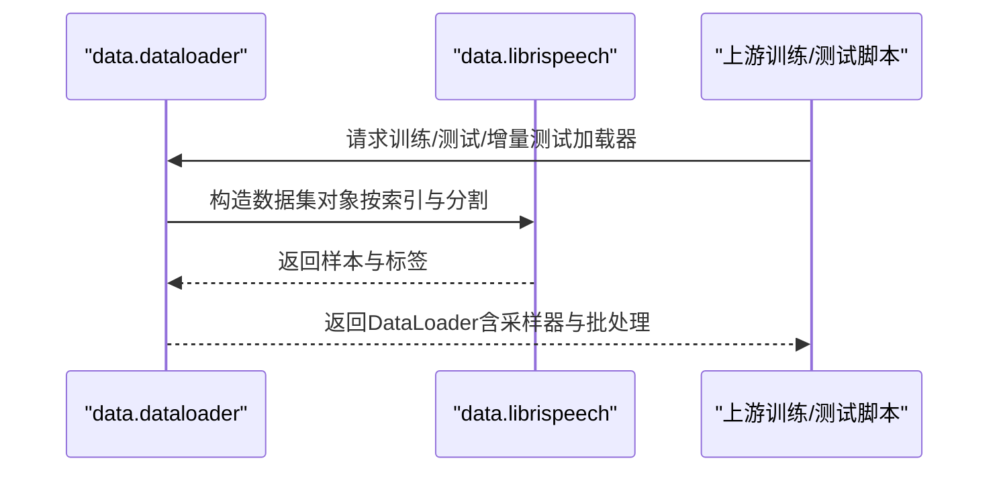
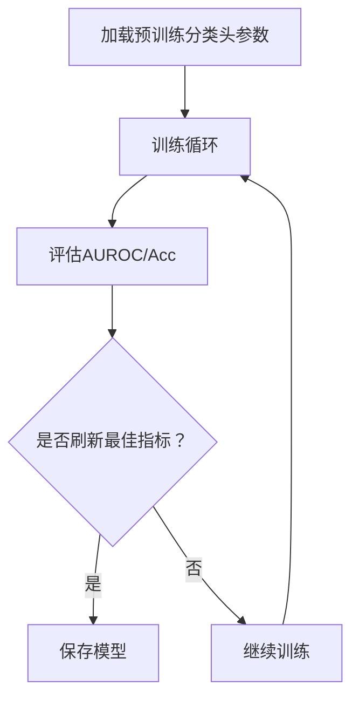
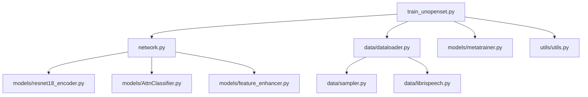

# 快速开始

<cite>
**本文引用的文件**
- [configs/default.yml](file://configs/default.yml)
- [configs/quick_eval.yml](file://configs/quick_eval.yml)
- [train_unopenset.py](file://train_unopenset.py)
- [train.py](file://train.py)
- [test.py](file://test.py)
- [network.py](file://network.py)
- [data/dataloader.py](file://data/dataloader.py)
- [data/librispeech.py](file://data/librispeech.py)
- [models/metatrainer.py](file://models/metatrainer.py)
- [docs/experiment_plan_and_baselines.md](file://docs/experiment_plan_and_baselines.md)
- [docs/module_overview.md](file://docs/module_overview.md)
</cite>

## 目录
1. [简介](#简介)
2. [项目结构](#项目结构)
3. [核心组件](#核心组件)
4. [架构总览](#架构总览)
5. [详细组件分析](#详细组件分析)
6. [依赖关系分析](#依赖关系分析)
7. [性能考虑](#性能考虑)
8. [故障排除指南](#故障排除指南)
9. [结论](#结论)
10. [附录](#附录)

## 简介
本指南面向首次接触 VAZE 项目的用户，帮助你在本地完成环境准备、数据准备、默认配置下的第一次实验全流程（从训练到测试），并提供常用命令行参数说明、配置文件修改方法以及常见问题排查建议。VAZE 是一个面向开放世界持续学习（Open-World Continual Learning）的音频场景基准，支持 LibriSpeech、NSynth、FMC 等数据集，采用对偶原型元训练与不确定性课程等方法。

## 项目结构
仓库采用按功能分层的组织方式：
- configs：训练配置文件（默认与快速评估）
- data：数据集接口与采样器
- models：网络与训练器模块
- utils：通用工具与评估函数
- scripts：结果分析与可视化脚本
- save/save_result：模型与结果输出目录
- docs：实验计划与模块概览文档

图表来源
- [configs/default.yml:1-88](file://configs/default.yml#L1-L88)
- [configs/quick_eval.yml:1-88](file://configs/quick_eval.yml#L1-L88)
- [train_unopenset.py:180-246](file://train_unopenset.py#L180-L246)
- [models/metatrainer.py:17-85](file://models/metatrainer.py#L17-L85)
- [data/dataloader.py:1-351](file://data/dataloader.py#L1-L351)
- [data/librispeech.py:21-278](file://data/librispeech.py#L21-L278)
- [network.py:18-724](file://network.py#L18-L724)
- [docs/module_overview.md:1-51](file://docs/module_overview.md#L1-L51)
- [docs/experiment_plan_and_baselines.md:1-30](file://docs/experiment_plan_and_baselines.md#L1-L30)

章节来源
- [configs/default.yml:1-88](file://configs/default.yml#L1-L88)
- [configs/quick_eval.yml:1-88](file://configs/quick_eval.yml#L1-L88)
- [docs/module_overview.md:1-51](file://docs/module_overview.md#L1-L51)
- [docs/experiment_plan_and_baselines.md:1-30](file://docs/experiment_plan_and_baselines.md#L1-L30)

## 核心组件
- 训练入口
  - train_unopenset.py：完整流程入口，负责基类训练、元训练、增量会话评测与指标汇总（AA/PD）。
  - train.py：历史主流程版本，可用于对照。
  - test.py：推理与评估脚本（部分功能可与主流程配合使用）。
- 网络与方法
  - network.py：MYNET 主网络，包含音频前端（STFT/LogMel）、ResNet18 编码器、分类头与对偶原型元训练模块。
  - models/metatrainer.py：元训练主循环，统计闭集准确率与开放集 AUROC。
- 数据与采样
  - data/dataloader.py：提供预训练/元训练/测试各阶段的数据加载器与 episode 采样。
  - data/librispeech.py：LibriSpeech 数据集接口与开放世界测试集采样。
- 配置
  - configs/default.yml：默认训练配置（训练轮次、学习率、优化器、数据增强、网络结构等）。
  - configs/quick_eval.yml：快速评估配置（减少训练轮次，便于快速验证）。

章节来源
- [train_unopenset.py:449-675](file://train_unopenset.py#L449-L675)
- [train.py:799-1296](file://train.py#L799-L1296)
- [test.py:780-1314](file://test.py#L780-L1314)
- [network.py:18-724](file://network.py#L18-L724)
- [models/metatrainer.py:17-201](file://models/metatrainer.py#L17-L201)
- [data/dataloader.py:1-351](file://data/dataloader.py#L1-L351)
- [data/librispeech.py:21-278](file://data/librispeech.py#L21-L278)
- [configs/default.yml:1-88](file://configs/default.yml#L1-L88)
- [configs/quick_eval.yml:1-88](file://configs/quick_eval.yml#L1-L88)

## 架构总览
VAZE 的训练与测试流程如下：

图表来源
- [train_unopenset.py:449-675](file://train_unopenset.py#L449-L675)
- [models/metatrainer.py:17-201](file://models/metatrainer.py#L17-L201)
- [data/dataloader.py:1-351](file://data/dataloader.py#L1-L351)
- [network.py:18-724](file://network.py#L18-L724)

## 详细组件分析

### 训练入口与流程（train_unopenset.py）
- 功能要点
  - 支持两种模式：完整训练（基类训练 + 元训练）与仅元训练（跳过基类训练，直接加载预训练模型）。
  - 自动替换分类头原型，随后进入多会话增量评测，输出已知/未知/增量/全部准确率与 F1。
  - 计算 AA（四次会话平均）与 PD（首末会话差距）。
- 关键流程
  - 模型初始化与数据集注册
  - 基类训练或加载预训练模型
  - 元训练（分类损失 + 开放集铰链损失 + 不确定性相关损失）
  - 替换分类头原型
  - 多轮次测试与增量评测
  - 结果写入指定目录

图表来源
- [train_unopenset.py:449-675](file://train_unopenset.py#L449-L675)

章节来源
- [train_unopenset.py:449-675](file://train_unopenset.py#L449-L675)

### 网络与方法（network.py）
- MYNET 主要组成
  - 音频前端：STFT 与 LogMel 提取，SpecAugment 数据增强。
  - 编码器：ResNet18（可替换为其他骨干）。
  - 分类头：支持余弦分类器与线性分类器。
  - 对偶原型元训练：支持集原型校准、伪未知原型生成与动态标签分配。
  - 不确定性估计：MC Dropout + 特征掩码核范数。
- 关键函数
  - encode/base_encode/hgnn_encode：不同模式下的特征提取。
  - open_forward/task_proto/task_pred：元训练前向与损失计算。
  - get_uncertainty：不确定性估计。

图表来源
- [network.py:18-724](file://network.py#L18-L724)

章节来源
- [network.py:18-724](file://network.py#L18-L724)

### 数据加载与采样（data/dataloader.py 与 data/librispeech.py）
- 数据集接口
  - Openlbrs/Openfs 等：支持开放世界测试集的 episode 采样（支持/查询/开放集混合）。
  - LBRS/LBRS/OpenLBRS：按类别划分训练/验证/测试集。
- 采样策略
  - TrueIncreTrainCategoriesSampler/Sampler：支持增量场景的 episode 采样。
  - CurriculumMetaDataset：课程式元训练数据集（Easy/Medium/Hard 三段）。

图表来源
- [data/dataloader.py:1-351](file://data/dataloader.py#L1-L351)
- [data/librispeech.py:21-278](file://data/librispeech.py#L21-L278)

章节来源
- [data/dataloader.py:1-351](file://data/dataloader.py#L1-L351)
- [data/librispeech.py:21-278](file://data/librispeech.py#L21-L278)

### 元训练循环（models/metatrainer.py）
- 训练循环
  - 加载预训练分类头参数，冻结特征提取器，仅优化分类器。
  - 训练时同时统计闭集准确率与开放集 AUROC。
  - 支持余弦退火或阶梯式学习率调度。
- 指标输出
  - 最佳 Acc/AUROC 记录与保存。

图表来源
- [models/metatrainer.py:17-201](file://models/metatrainer.py#L17-L201)

章节来源
- [models/metatrainer.py:17-201](file://models/metatrainer.py#L17-L201)

## 依赖关系分析
- 训练入口依赖
  - train_unopenset.py 依赖 network.py（MYNET）、data/dataloader.py（数据加载）、models/metatrainer.py（元训练）、utils/utils.py（工具）。
- 网络依赖
  - network.py 依赖 models/resnet18_encoder.py（骨干网络）、models/AttnClassifier.py（分类器）、models/feature_enhancer.py（特征增强）等。
- 数据依赖
  - data/dataloader.py 依赖 data/sampler.py（采样器）、data/librispeech.py（数据集接口）等。

图表来源
- [train_unopenset.py:1-246](file://train_unopenset.py#L1-L246)
- [network.py:1-724](file://network.py#L1-L724)
- [data/dataloader.py:1-351](file://data/dataloader.py#L1-L351)
- [data/librispeech.py:21-278](file://data/librispeech.py#L21-L278)

章节来源
- [train_unopenset.py:1-246](file://train_unopenset.py#L1-L246)
- [network.py:1-724](file://network.py#L1-L724)
- [data/dataloader.py:1-351](file://data/dataloader.py#L1-L351)
- [data/librispeech.py:21-278](file://data/librispeech.py#L21-L278)

## 性能考虑
- 确保 CUDA 可用与显存充足，合理设置 batch size 与 num_workers。
- 使用合适的温度参数与余弦分类器以提升原型判别能力。
- 元训练阶段建议使用阶梯式学习率调度，结合 AUROC 监控早停。
- 课程式元训练（Easy/Medium/Hard）有助于稳定增量学习过程。

## 故障排除指南
- 环境与依赖
  - 确认 Python 版本满足项目需求（建议使用 Python 3.8+）。
  - 安装 PyTorch 与 TorchAudio（版本需与 CUDA 版本兼容）。
  - 安装 scikit-learn、torchaudio、pandas、matplotlib、seaborn 等常用库。
- 数据路径
  - 修改 train_unopenset.py 中的 --dataroot 参数指向你的数据根目录。
  - 确认 LibriSpeech 数据集 CSV 文件存在且路径正确。
- 训练与测试
  - 若提示找不到预训练模型，请先运行完整训练流程或手动放置 base 训练模型。
  - 如显存不足，降低 batch size 或 num_workers。
  - 若出现维度不匹配，检查音频采样率、窗长、步长与 mel-bin 设置是否与配置一致。
- 结果输出
  - 结果文件默认写入 save_result/opt_v5（可通过 --opt_version 指定）。

章节来源
- [train_unopenset.py:180-246](file://train_unopenset.py#L180-L246)
- [data/librispeech.py:31-54](file://data/librispeech.py#L31-L54)

## 结论
通过本快速开始指南，你可以在本地完成 VAZE 项目的环境准备、数据准备与默认配置下的第一次实验全流程。建议先使用 quick_eval.yml 快速验证流程，再切换到 default.yml 进行完整训练与评测。遇到问题时，优先检查数据路径、CUDA 环境与 batch size 设置。

## 附录

### 常用命令行参数说明
- -config：指定配置文件路径（默认使用 default.yml）
- -dataset：数据集名称（支持 FMC、nsynth-100/200/300/400、librispeech、f2n/f2l/n2f/n2l/l2f/l2n）
- --dataroot：数据根目录
- --num_unlabeled_classes：未知类数量
- --num_labeled_classes：已知类数量
- --checkpoint/--load_base：控制是否加载预训练模型
- --pretrained_model_path：预训练模型路径
- --opt_version：结果输出子目录（如 opt_v5）
- --run_tag：结果文件后缀标签
- --curriculum_ratio/--center_loss_weight/--hinge_margin 等：课程学习与原型约束相关超参

章节来源
- [train_unopenset.py:180-246](file://train_unopenset.py#L180-L246)
- [configs/default.yml:1-88](file://configs/default.yml#L1-L88)
- [configs/quick_eval.yml:1-88](file://configs/quick_eval.yml#L1-L88)

### 配置文件修改方法
- default.yml：包含训练轮次、学习率、优化器、调度器、网络结构、数据增强、采样器等关键参数。
- quick_eval.yml：用于快速评估，减少训练轮次与会话数，便于快速验证。

章节来源
- [configs/default.yml:1-88](file://configs/default.yml#L1-L88)
- [configs/quick_eval.yml:1-88](file://configs/quick_eval.yml#L1-L88)

### 第一次实验完整流程（默认配置）
- 步骤
  - 准备数据：下载并解压 LibriSpeech 数据集，确保 CSV 文件存在。
  - 修改 --dataroot 指向数据根目录。
  - 运行 train_unopenset.py（默认使用 default.yml）。
  - 查看 save_result/opt_v5/test_result.txt 中的每会话指标与 AA/PD。
- 参考入口
  - train_unopenset.py：主训练入口与评测循环
  - models/metatrainer.py：元训练循环
  - data/dataloader.py：数据加载与采样
  - data/librispeech.py：数据集接口

章节来源
- [train_unopenset.py:449-675](file://train_unopenset.py#L449-L675)
- [models/metatrainer.py:17-201](file://models/metatrainer.py#L17-L201)
- [data/dataloader.py:1-351](file://data/dataloader.py#L1-L351)
- [data/librispeech.py:21-278](file://data/librispeech.py#L21-L278)