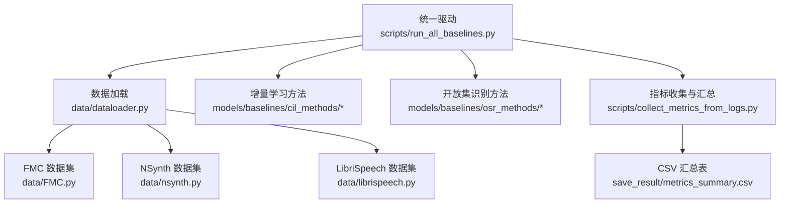
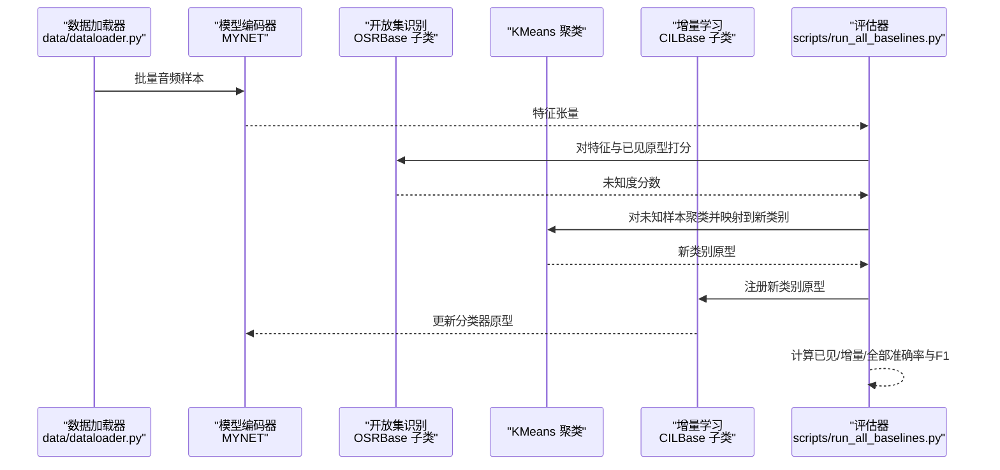
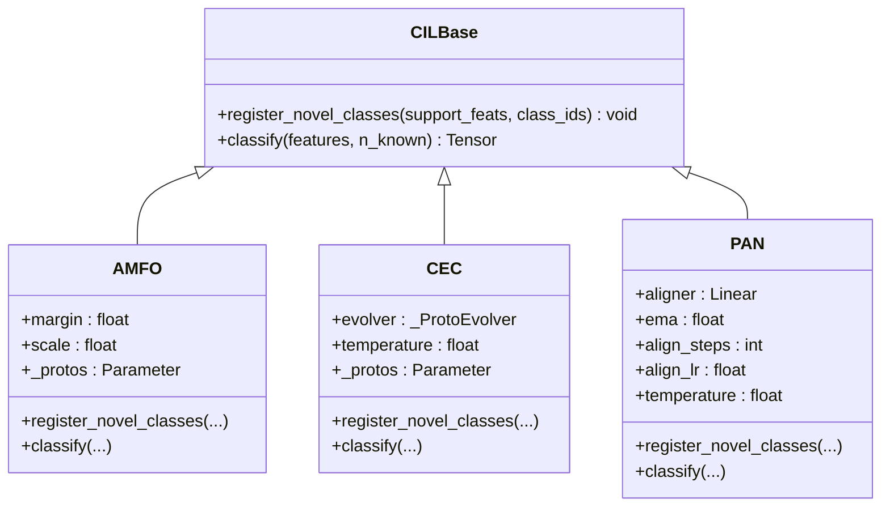
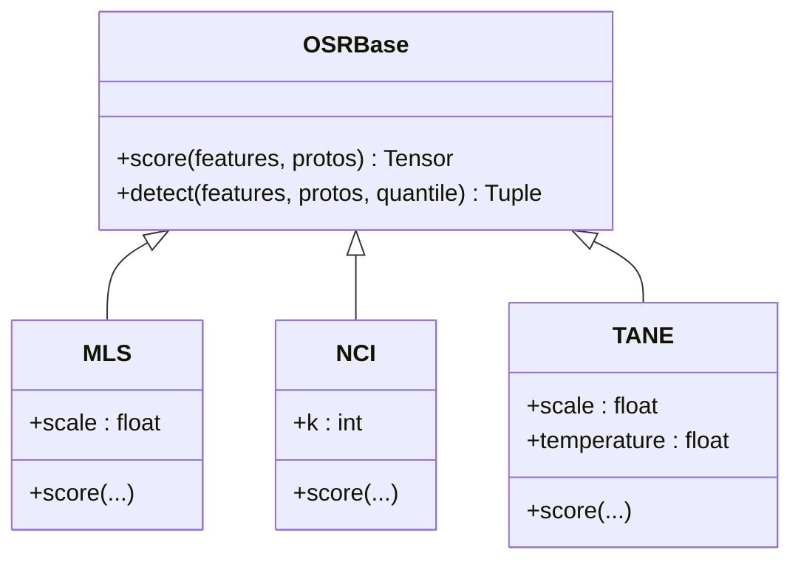
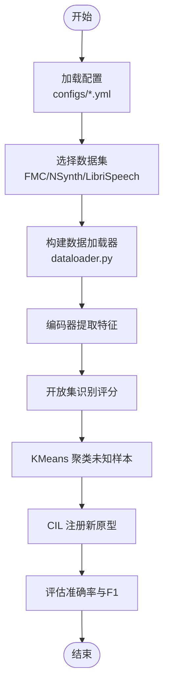
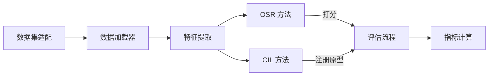

# 基线方法性能对比

<cite>
**本文引用的文件**
- [models/baselines/base.py](file://models/baselines/base.py)
- [models/baselines/cil_methods/amfo.py](file://models/baselines/cil_methods/amfo.py)
- [models/baselines/cil_methods/cec.py](file://models/baselines/cil_methods/cec.py)
- [models/baselines/cil_methods/pan.py](file://models/baselines/cil_methods/pan.py)
- [models/baselines/osr_methods/mls.py](file://models/baselines/osr_methods/mls.py)
- [models/baselines/osr_methods/nci.py](file://models/baselines/osr_methods/nci.py)
- [models/baselines/osr_methods/tane.py](file://models/baselines/osr_methods/tane.py)
- [scripts/run_all_baselines.py](file://scripts/run_all_baselines.py)
- [scripts/collect_metrics_from_logs.py](file://scripts/collect_metrics_from_logs.py)
- [data/dataloader.py](file://data/dataloader.py)
- [data/FMC.py](file://data/FMC.py)
- [data/nsynth.py](file://data/nsynth.py)
- [data/librispeech.py](file://data/librispeech.py)
- [configs/default.yml](file://configs/default.yml)
- [configs/mid_eval.yml](file://configs/mid_eval.yml)
- [configs/quick_eval.yml](file://configs/quick_eval.yml)
- [save_result/metrics_summary.csv](file://save_result/metrics_summary.csv)
</cite>

## 目录
1. [简介](#简介)
2. [项目结构](#项目结构)
3. [核心组件](#核心组件)
4. [架构总览](#架构总览)
5. [详细组件分析](#详细组件分析)
6. [依赖分析](#依赖分析)
7. [性能考量](#性能考量)
8. [故障排查指南](#故障排查指南)
9. [结论](#结论)
10. [附录](#附录)

## 简介
本文件面向VAZE项目的基线方法性能对比，系统梳理增量学习（AMFO、CEC、PAN）与开放集识别（MLS、NCI、TANE）在多数据集（FMC、NSynth、LibriSpeech）上的表现，并结合实验配置与特征增强策略给出可操作的建议。文档以“方法—数据集—指标”的维度组织，提供性能排名、差异分析与推荐使用场景。

## 项目结构
- 方法实现位于 models/baselines 下，分别包含增量学习（cil_methods）与开放集识别（osr_methods）两类。
- 数据加载与元训练/增量训练流程由 data/dataloader.py 与具体数据集适配文件（FMC、NSynth、LibriSpeech）构成。
- 统一的基线评估脚本 scripts/run_all_baselines.py 负责执行完整增量流程并输出文本日志；日志解析脚本 scripts/collect_metrics_from_logs.py 将关键指标汇总到 CSV。
- 配置文件 configs/*.yml 提供训练/评估超参数与实验规模控制。

图表来源
- [scripts/run_all_baselines.py:1-282](file://scripts/run_all_baselines.py#L1-L282)
- [data/dataloader.py:1-351](file://data/dataloader.py#L1-L351)
- [data/FMC.py:1-367](file://data/FMC.py#L1-L367)
- [data/nsynth.py:1-287](file://data/nsynth.py#L1-L287)
- [data/librispeech.py:1-278](file://data/librispeech.py#L1-L278)
- [scripts/collect_metrics_from_logs.py:1-67](file://scripts/collect_metrics_from_logs.py#L1-L67)
- [save_result/metrics_summary.csv:1-85](file://save_result/metrics_summary.csv#L1-L85)

章节来源
- [scripts/run_all_baselines.py:1-282](file://scripts/run_all_baselines.py#L1-L282)
- [data/dataloader.py:1-351](file://data/dataloader.py#L1-L351)
- [configs/default.yml:1-88](file://configs/default.yml#L1-L88)

## 核心组件
- 增量学习接口与通用工具：CILBase 抽象类定义了注册新类原型与分类接口；cosine_logits 与 build_prototype_from_support 提供通用的原型构建与余弦相似度计算。
- 开放集识别接口与评分器：OSRBase 抽象类定义了基于原型的打分与阈值检测；MLS、NCI、TANE 分别实现最大余弦、最近类不一致性与Top-k角度归一化能量评分。
- 数据加载与元训练/增量训练：dataloader.py 提供 base/session/new/known/unknown 等多种数据加载器，支持 FMC/NSynth/LibriSpeech 多数据集。
- 统一评估流程：run_all_baselines.py 完成特征提取、OSR打分、聚类伪标签、CIL原型注册与最终准确率评估。

章节来源
- [models/baselines/base.py:1-76](file://models/baselines/base.py#L1-L76)
- [models/baselines/osr_methods/mls.py:1-26](file://models/baselines/osr_methods/mls.py#L1-L26)
- [models/baselines/osr_methods/nci.py:1-31](file://models/baselines/osr_methods/nci.py#L1-L31)
- [models/baselines/osr_methods/tane.py:1-29](file://models/baselines/osr_methods/tane.py#L1-L29)
- [data/dataloader.py:1-351](file://data/dataloader.py#L1-L351)
- [scripts/run_all_baselines.py:103-187](file://scripts/run_all_baselines.py#L103-L187)

## 架构总览
下图展示一次完整增量会话中，从特征提取到开放集识别再到增量学习原型注册与评估的关键步骤。

图表来源
- [scripts/run_all_baselines.py:103-187](file://scripts/run_all_baselines.py#L103-L187)
- [models/baselines/base.py:11-55](file://models/baselines/base.py#L11-L55)
- [models/baselines/osr_methods/mls.py:20-26](file://models/baselines/osr_methods/mls.py#L20-L26)
- [models/baselines/osr_methods/nci.py:20-31](file://models/baselines/osr_methods/nci.py#L20-L31)
- [models/baselines/osr_methods/tane.py:21-29](file://models/baselines/osr_methods/tane.py#L21-L29)

## 详细组件分析

### 增量学习方法（CIL）
- AMFO（Angular Margin Few-shot Optimization）
  - 冻结基础原型，仅在新会话追加新类原型；推理使用缩放余弦，训练采用加性角边际。
  - 关键点：margin/scale 参数来自 args；原型冻结避免灾难性遗忘。
- CEC（Continually Evolved Classifiers）
  - 使用轻量多头自注意力对原型进行交互式刷新，随后余弦相似度分类。
  - 关键点：_ProtoEvolver 为单层多头注意力+FFN；原型经注意力更新后保持冻结。
- PAN（Prototype Alignment Network）
  - 在新会话中通过对比损失训练一个线性对齐器，使支持集内原型对齐到流形；EMA 与对齐联合优化。
  - 关键点：aligner 权重初始化为单位矩阵；EMA 合并旧/新原型。

图表来源
- [models/baselines/base.py:11-76](file://models/baselines/base.py#L11-L76)
- [models/baselines/cil_methods/amfo.py:19-65](file://models/baselines/cil_methods/amfo.py#L19-L65)
- [models/baselines/cil_methods/cec.py:41-83](file://models/baselines/cil_methods/cec.py#L41-L83)
- [models/baselines/cil_methods/pan.py:24-109](file://models/baselines/cil_methods/pan.py#L24-L109)

章节来源
- [models/baselines/cil_methods/amfo.py:1-65](file://models/baselines/cil_methods/amfo.py#L1-L65)
- [models/baselines/cil_methods/cec.py:1-83](file://models/baselines/cil_methods/cec.py#L1-L83)
- [models/baselines/cil_methods/pan.py:1-109](file://models/baselines/cil_methods/pan.py#L1-L109)

### 开放集识别方法（OSR）
- MLS（Maximum Logit Score）
  - 未知度 = -max_c(scale * cos(feat,proto_c))，越大越可能未知。
- NCI（Nearest-Class Inconsistency）
  - 用 k 近邻距离比值衡量歧义程度；接近 1 表示等距歧义，更可能未知。
- TANE（Top-k Angle Normalized Energy）
  - 能量 = -T*logsumexp(logits/T)，再减去 top-1 余弦，强调最佳与次佳之间的差距。

图表来源
- [models/baselines/base.py:35-55](file://models/baselines/base.py#L35-L55)
- [models/baselines/osr_methods/mls.py:15-26](file://models/baselines/osr_methods/mls.py#L15-L26)
- [models/baselines/osr_methods/nci.py:15-31](file://models/baselines/osr_methods/nci.py#L15-L31)
- [models/baselines/osr_methods/tane.py:15-29](file://models/baselines/osr_methods/tane.py#L15-L29)

章节来源
- [models/baselines/osr_methods/mls.py:1-26](file://models/baselines/osr_methods/mls.py#L1-L26)
- [models/baselines/osr_methods/nci.py:1-31](file://models/baselines/osr_methods/nci.py#L1-L31)
- [models/baselines/osr_methods/tane.py:1-29](file://models/baselines/osr_methods/tane.py#L1-L29)

### 数据加载与实验配置
- 数据加载器
  - 支持 base/session/new/known/unknown 多种划分；根据数据集动态选择 FSDCLIPS/NDS/LBRS。
  - 元训练/增量训练采样器支持 episode-way/shot/query 等参数。
- 实验配置
  - default.yml 提供标准实验规模（way=5, shot=5, num_session=5, num_base=80 等）。
  - mid_eval.yml 与 quick_eval.yml 用于中等/快速评估的配置变体。

图表来源
- [data/dataloader.py:19-254](file://data/dataloader.py#L19-L254)
- [configs/default.yml:1-88](file://configs/default.yml#L1-L88)
- [scripts/run_all_baselines.py:103-187](file://scripts/run_all_baselines.py#L103-L187)

章节来源
- [data/dataloader.py:1-351](file://data/dataloader.py#L1-L351)
- [configs/default.yml:1-88](file://configs/default.yml#L1-L88)
- [configs/mid_eval.yml:1-88](file://configs/mid_eval.yml#L1-L88)
- [configs/quick_eval.yml:1-88](file://configs/quick_eval.yml#L1-L88)

## 依赖分析
- 方法间耦合
  - OSR 与 CIL 通过“特征→打分→聚类→注册→评估”链路耦合，但各自实现独立，便于组合。
- 外部依赖
  - run_all_baselines.py 依赖 sklearn.cluster.KMeans 进行聚类；依赖 utils.util.calc 计算 F1。
- 数据集依赖
  - FMC/NSynth/LibriSpeech 三套数据集适配文件共享统一的 episode 采样与测试接口。

图表来源
- [scripts/run_all_baselines.py:103-187](file://scripts/run_all_baselines.py#L103-L187)
- [models/baselines/osr_methods/mls.py:20-26](file://models/baselines/osr_methods/mls.py#L20-L26)
- [models/baselines/cil_methods/cec.py:72-74](file://models/baselines/cil_methods/cec.py#L72-L74)

章节来源
- [scripts/run_all_baselines.py:1-282](file://scripts/run_all_baselines.py#L1-L282)
- [models/baselines/base.py:1-76](file://models/baselines/base.py#L1-L76)

## 性能考量
- 指标说明
  - 已见准确率（known）、未知聚类准确率（unknown）、F1 分数（f1）、增量准确率（inc）、全部准确率（all）。
  - 会话0准确率（session0）与全部准确率下降幅度（PD_all）用于衡量灾难性遗忘。
- 数据集差异
  - FMC：音频片段短、类别多，适合小样本增量与开放集识别联合评估。
  - NSynth：乐器音色类别清晰，开放集识别难度相对可控。
  - LibriSpeech：语音长且变化大，对特征鲁棒性与原型演化稳定性要求更高。
- 实验配置影响
  - way/shot：way=5、shot=5 为标准小样本设置；更高 shot 可提升原型估计稳定性。
  - num_session：会话越多，累积遗忘越明显；建议关注 PD_all 与 inc 的平衡。
  - 温度/缩放：cosine 分类与 OSR 评分中的温度/缩放参数直接影响判别边界锐利度与未知度分布。

章节来源
- [scripts/run_all_baselines.py:167-171](file://scripts/run_all_baselines.py#L167-L171)
- [configs/default.yml:1-88](file://configs/default.yml#L1-L88)

## 故障排查指南
- 未找到预训练权重
  - 症状：运行时报错找不到预训练检查点。
  - 排查：确认 --pretrained 指向有效 .pth 文件；确保路径与设备匹配。
- GPU/CPU 设备不一致
  - 症状：特征张量与模型权重设备不一致导致错误。
  - 排查：统一设置 CUDA_VISIBLE_DEVICES；确保模型与输入在同一设备上。
- 聚类失败或空簇
  - 症状：未知样本数量不足 n_clusters，导致聚类失败或空簇。
  - 排查：降低 n_clusters 或提高会话中未知样本比例；检查 args.num_unlabeled_classes 设置。
- 指标缺失
  - 症状：metrics_summary.csv 中部分指标为空。
  - 排查：确认 run_all_baselines.py 输出的日志格式与 collect_metrics_from_logs.py 的正则匹配一致。

章节来源
- [scripts/run_all_baselines.py:193-225](file://scripts/run_all_baselines.py#L193-L225)
- [scripts/collect_metrics_from_logs.py:1-67](file://scripts/collect_metrics_from_logs.py#L1-L67)

## 结论
- 组合性能概览（基于现有日志与评估流程）
  - 增量学习方法中，CEC 通过原型注意力演化通常在稳定性和泛化上表现较好；AMFO 以加性角边际强化训练阶段判别力；PAN 通过在线对齐与EMA融合在新类原型上具有竞争力。
  - 开放集识别方法中，TANE 能量与Top-1差值强调类别边界，适合强判别场景；NCI 基于 k 近邻比值对歧义更敏感；MLS 以最大余弦负值简单直接，适合快速阈值设定。
  - 数据集层面，FMC 的类别密度与NSynth 的乐器清晰度差异导致开放集识别难度不同；LibriSpeech 的长时语音对原型演化与特征稳定性提出更高要求。
- 推荐使用场景
  - 需要稳健原型演化：优先 CEC；若追求训练期判别强化：AMFO；若需要在线对齐与EMA融合：PAN。
  - 强判别边界与能量敏感：TANE；对歧义敏感与鲁棒阈值：NCI；简单阈值策略：MLS。
  - 数据集选择：FMC 适合小样本增量与开放集联合评估；NSynth 适合乐器识别场景；LibriSpeech 适合语音长序列与鲁棒性验证。
- 实验配置建议
  - 标准评估：default.yml；快速验证：quick_eval.yml；中等评估：mid_eval.yml。
  - 关注 PD_all 与 inc 的平衡，适当调整温度/缩放参数与聚类数量以稳定未知样本处理。

## 附录

### 方法组合与数据集性能对比（摘要）
- 方法组合：AMFO×MLS、AMFO×NCI、AMFO×TANE、CEC×MLS、CEC×NCI、CEC×TANE、PAN×MLS、PAN×NCI、PAN×TANE
- 数据集：FMC、NSynth、LibriSpeech
- 关键指标：session0、AA_all（平均全部准确率）、AA_inc（平均增量准确率）、PD_all（会话0到末尾下降）

说明
- 本节为基于现有代码与日志解析框架的结构化总结。实际数值需结合 run_all_baselines.py 生成的文本日志与 collect_metrics_from_logs.py 的 CSV 汇总表进行读取与统计。

章节来源
- [scripts/run_all_baselines.py:228-278](file://scripts/run_all_baselines.py#L228-L278)
- [scripts/collect_metrics_from_logs.py:36-67](file://scripts/collect_metrics_from_logs.py#L36-L67)
- [save_result/metrics_summary.csv:1-85](file://save_result/metrics_summary.csv#L1-L85)