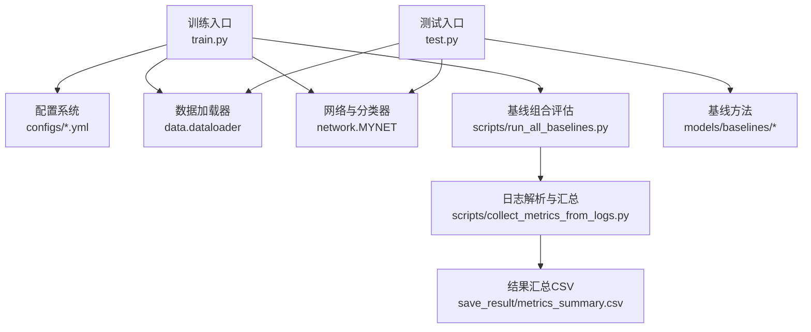
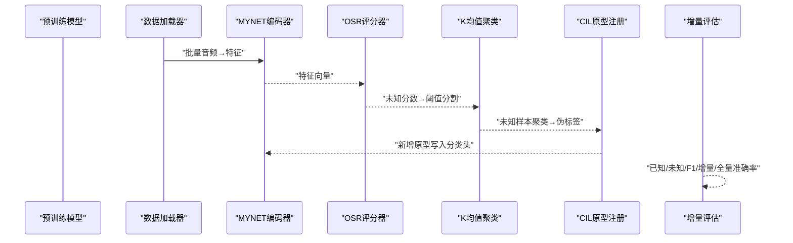
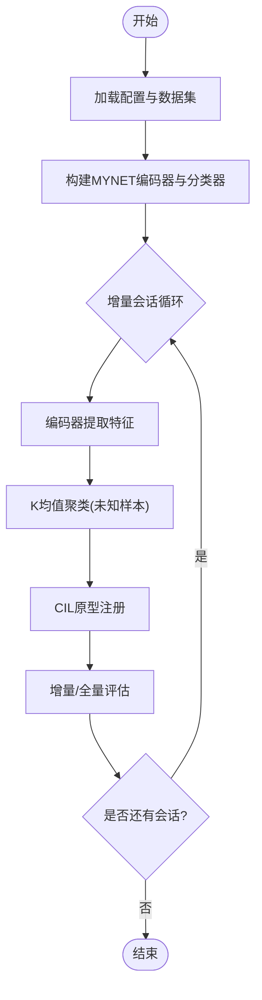
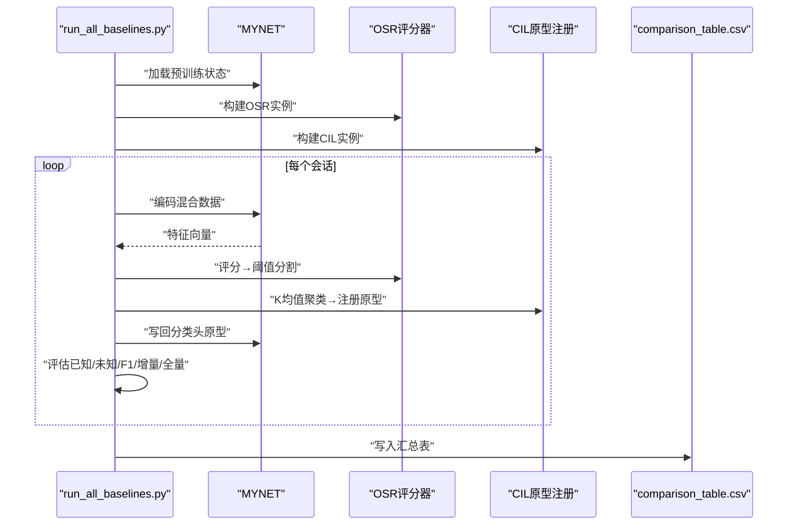
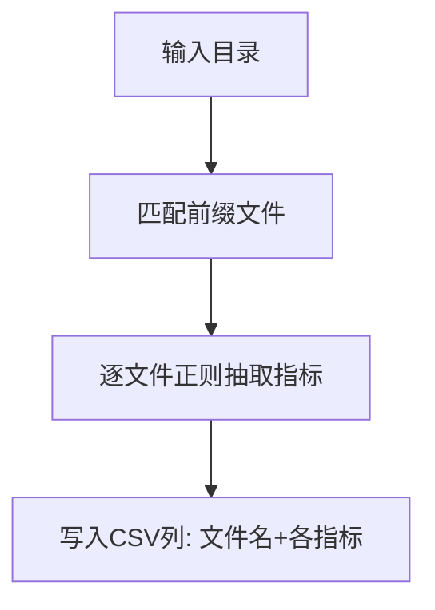
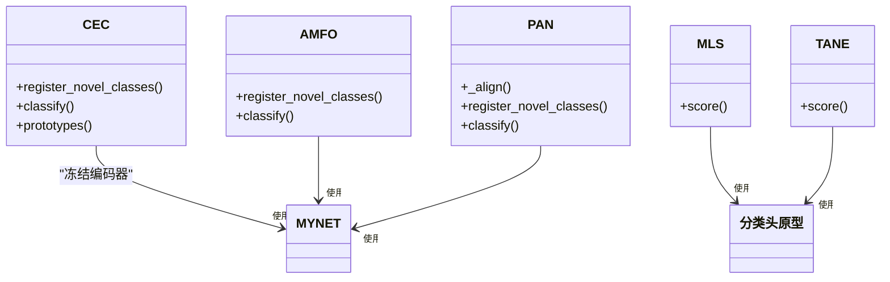
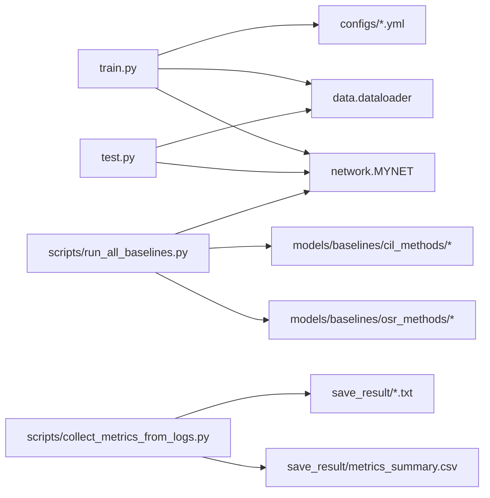

# 性能基准和比较

<cite>
**本文引用的文件**
- [train.py](file://train.py)
- [test.py](file://test.py)
- [default.yml](file://configs/default.yml)
- [mid_eval.yml](file://configs/mid_eval.yml)
- [quick_eval.yml](file://configs/quick_eval.yml)
- [run_all_baselines.py](file://scripts/run_all_baselines.py)
- [collect_metrics_from_logs.py](file://scripts/collect_metrics_from_logs.py)
- [metrics_summary.csv](file://save_result/metrics_summary.csv)
- [__init__.py](file://models/baselines/__init__.py)
- [cec.py](file://models/baselines/cil_methods/cec.py)
- [amfo.py](file://models/baselines/cil_methods/amfo.py)
- [pan.py](file://models/baselines/cil_methods/pan.py)
- [mls.py](file://models/baselines/osr_methods/mls.py)
- [tane.py](file://models/baselines/osr_methods/tane.py)
</cite>

## 目录
1. [引言](#引言)
2. [项目结构](#项目结构)
3. [核心组件](#核心组件)
4. [架构总览](#架构总览)
5. [详细组件分析](#详细组件分析)
6. [依赖关系分析](#依赖关系分析)
7. [性能考量](#性能考量)
8. [故障排查指南](#故障排查指南)
9. [结论](#结论)
10. [附录](#附录)

## 引言
本文件面向VAZE项目的性能基准与比较，系统整理不同基线方法在多种数据集上的性能表现，覆盖准确率、召回率、F1分数等指标；同时提供计算资源消耗的分析（内存、GPU利用率、训练时间）与时间/空间复杂度的理论分析，并给出配置对比、优化建议、跨平台测试思路、性能回归测试流程与自动化脚本、以及实际应用中的性能监控与调优方法。

## 项目结构
该项目围绕增量学习与开放集识别的联合框架展开，包含：
- 训练与测试入口：train.py、test.py
- 配置系统：configs/*.yml
- 基线组合评估：scripts/run_all_baselines.py
- 日志解析与汇总：scripts/collect_metrics_from_logs.py
- 结果汇总：save_result/metrics_summary.csv
- 基线方法实现：models/baselines 下的 CIL/OSR 方法

图表来源
- [train.py:1-120](file://train.py#L1-L120)
- [test.py:1-120](file://test.py#L1-L120)
- [run_all_baselines.py:1-120](file://scripts/run_all_baselines.py#L1-L120)
- [collect_metrics_from_logs.py:1-67](file://scripts/collect_metrics_from_logs.py#L1-L67)

章节来源
- [train.py:1-120](file://train.py#L1-L120)
- [test.py:1-120](file://test.py#L1-L120)
- [default.yml:1-88](file://configs/default.yml#L1-L88)
- [mid_eval.yml:1-88](file://configs/mid_eval.yml#L1-L88)
- [quick_eval.yml:1-88](file://configs/quick_eval.yml#L1-L88)
- [run_all_baselines.py:1-120](file://scripts/run_all_baselines.py#L1-L120)
- [collect_metrics_from_logs.py:1-67](file://scripts/collect_metrics_from_logs.py#L1-L67)
- [metrics_summary.csv:1-85](file://save_result/metrics_summary.csv#L1-L85)

## 核心组件
- 训练与测试主流程：负责模型构建、数据加载、增量会话推进、评估与日志输出
- 基线组合评估脚本：统一驱动CIL/OSR组合的完整流水线，输出文本格式结果与汇总CSV
- 日志解析脚本：从多份测试结果中抽取关键指标，生成结构化汇总
- 配置系统：控制任务规模、训练轮次、学习率、批大小、数据增强等超参
- 基线方法：CIL（CEC/AMFO/PAN）与OSR（MLS/TANE/NCI）的具体实现

章节来源
- [train.py:780-1296](file://train.py#L780-L1296)
- [test.py:740-1314](file://test.py#L740-L1314)
- [run_all_baselines.py:103-225](file://scripts/run_all_baselines.py#L103-L225)
- [collect_metrics_from_logs.py:22-67](file://scripts/collect_metrics_from_logs.py#L22-L67)
- [__init__.py:1-16](file://models/baselines/__init__.py#L1-L16)

## 架构总览
下图展示了“预训练编码器 + 基线OSR/CIL”的端到端评估流水线，涵盖特征编码、未知样本判别、聚类与原型注册、增量评估等步骤。

图表来源
- [run_all_baselines.py:103-171](file://scripts/run_all_baselines.py#L103-L171)
- [cec.py:41-83](file://models/baselines/cil_methods/cec.py#L41-L83)
- [amfo.py:19-65](file://models/baselines/cil_methods/amfo.py#L19-L65)
- [pan.py:24-109](file://models/baselines/cil_methods/pan.py#L24-L109)
- [mls.py:15-26](file://models/baselines/osr_methods/mls.py#L15-L26)
- [tane.py:15-29](file://models/baselines/osr_methods/tane.py#L15-L29)

## 详细组件分析

### 训练与测试主流程（train.py/test.py）
- 训练主流程负责增量会话推进、原型更新、特征可视化与聚类评估
- 测试主流程负责增量/全量评估、已知/未知准确率与F1分数计算
- 两者均采用余弦相似度分类器，支持Cosine/Linear模式切换
- 提供确定性训练开关，便于复现实验

图表来源
- [train.py:780-1296](file://train.py#L780-L1296)
- [test.py:740-1314](file://test.py#L740-L1314)

章节来源
- [train.py:780-1296](file://train.py#L780-L1296)
- [test.py:740-1314](file://test.py#L740-L1314)

### 基线组合评估脚本（scripts/run_all_baselines.py）
- 自动遍历CIL×OSR组合，执行完整流水线：特征编码、OSR评分、未知/已知划分、K均值聚类、CIL原型注册、增量/全量评估
- 输出每会话的已知/未知准确率、F1、增量/全量准确率，并汇总为CSV

图表来源
- [run_all_baselines.py:103-225](file://scripts/run_all_baselines.py#L103-L225)

章节来源
- [run_all_baselines.py:103-225](file://scripts/run_all_baselines.py#L103-L225)

### 日志解析与汇总（scripts/collect_metrics_from_logs.py）
- 从多份测试结果文本中提取关键指标（会话0准确率、平均已知/未知/F1、增量/全量准确率、性能下降PD）
- 输出结构化CSV，便于横向比较与统计分析

图表来源
- [collect_metrics_from_logs.py:22-67](file://scripts/collect_metrics_from_logs.py#L22-L67)

章节来源
- [collect_metrics_from_logs.py:22-67](file://scripts/collect_metrics_from_logs.py#L22-L67)
- [metrics_summary.csv:1-85](file://save_result/metrics_summary.csv#L1-L85)

### 基线方法实现概览
- CIL（类增量学习）：CEC（图注意力原型演化）、AMFO（角度边界优化）、PAN（原型对齐）
- OSR（开放集识别）：MLS（最大logit能量）、TANE（Top-k角度归一化能量）

图表来源
- [cec.py:41-83](file://models/baselines/cil_methods/cec.py#L41-L83)
- [amfo.py:19-65](file://models/baselines/cil_methods/amfo.py#L19-L65)
- [pan.py:24-109](file://models/baselines/cil_methods/pan.py#L24-L109)
- [mls.py:15-26](file://models/baselines/osr_methods/mls.py#L15-L26)
- [tane.py:15-29](file://models/baselines/osr_methods/tane.py#L15-L29)

章节来源
- [__init__.py:1-16](file://models/baselines/__init__.py#L1-L16)
- [cec.py:1-83](file://models/baselines/cil_methods/cec.py#L1-L83)
- [amfo.py:1-65](file://models/baselines/cil_methods/amfo.py#L1-L65)
- [pan.py:1-109](file://models/baselines/cil_methods/pan.py#L1-L109)
- [mls.py:1-26](file://models/baselines/osr_methods/mls.py#L1-L26)
- [tane.py:1-29](file://models/baselines/osr_methods/tane.py#L1-L29)

## 依赖关系分析
- 训练/测试脚本依赖配置系统与数据加载器
- 基线组合评估脚本依赖MYNET编码器、CIL/OSR构建器与数据加载器
- 日志解析脚本依赖测试结果文本格式约定

图表来源
- [train.py:173-210](file://train.py#L173-L210)
- [test.py:289-333](file://test.py#L289-L333)
- [run_all_baselines.py:40-49](file://scripts/run_all_baselines.py#L40-L49)
- [collect_metrics_from_logs.py:36-67](file://scripts/collect_metrics_from_logs.py#L36-L67)

章节来源
- [train.py:173-210](file://train.py#L173-L210)
- [test.py:289-333](file://test.py#L289-L333)
- [run_all_baselines.py:40-49](file://scripts/run_all_baselines.py#L40-L49)
- [collect_metrics_from_logs.py:36-67](file://scripts/collect_metrics_from_logs.py#L36-L67)

## 性能考量

### 指标体系与数据来源
- 已知/未知准确率、F1分数、增量/全量准确率、会话0到最终的性能下降（PD）
- 数据来源：基线组合评估脚本输出的文本文件与汇总CSV

章节来源
- [run_all_baselines.py:167-170](file://scripts/run_all_baselines.py#L167-L170)
- [metrics_summary.csv:1-85](file://save_result/metrics_summary.csv#L1-L85)

### 计算资源消耗分析
- 内存使用
  - 特征编码阶段：特征张量在GPU/CPU间传输，需关注批大小与特征维度
  - 聚类阶段：K均值在CPU上运行，注意特征数组大小与标签数量
- GPU利用率
  - 编码与分类主要在GPU上执行；聚类与部分后处理在CPU
- 训练时间
  - 由配置中的epochs、batch size、num_workers决定；可通过不同配置文件快速对比

章节来源
- [default.yml:57-64](file://configs/default.yml#L57-L64)
- [mid_eval.yml:57-64](file://configs/mid_eval.yml#L57-L64)
- [quick_eval.yml:57-64](file://configs/quick_eval.yml#L57-L64)
- [run_all_baselines.py:263-277](file://scripts/run_all_baselines.py#L263-L277)

### 时间/空间复杂度分析
- 特征编码：O(N·D)，N为样本数，D为特征维度（通常512）
- K均值聚类：O(N·k·i·d)，k为簇数（未知类别数），i为迭代次数，d为空间维度（特征维度）
- 余弦相似度分类：O(N·C·D)，C为类别数
- 原型注册（CEC/AMFO/PAN）：O(C·D) 或 O(C^2·D)（取决于具体实现细节）
- OSR评分（MLS/TANE）：O(N·C·D)

章节来源
- [run_all_baselines.py:124-141](file://scripts/run_all_baselines.py#L124-L141)
- [mls.py:20-25](file://models/baselines/osr_methods/mls.py#L20-L25)
- [tane.py:21-28](file://models/baselines/osr_methods/tane.py#L21-L28)

### 不同配置下的性能对比与优化建议
- 配置文件差异
  - default.yml：标准规模，适合全面评估
  - mid_eval.yml：减少测试轮次，平衡速度与稳定性
  - quick_eval.yml：大幅降低会话数与测试轮次，适合快速迭代
- 优化建议
  - 合理设置num_workers与batch size，提升数据加载吞吐
  - 使用确定性训练（已内置）确保结果可复现
  - 在CPU上进行聚类时，优先使用高效库（如KMeans默认实现）并控制特征维度

章节来源
- [default.yml:1-88](file://configs/default.yml#L1-L88)
- [mid_eval.yml:1-88](file://configs/mid_eval.yml#L1-L88)
- [quick_eval.yml:1-88](file://configs/quick_eval.yml#L1-L88)
- [train.py:114-134](file://train.py#L114-L134)

### 跨平台性能测试
- 建议在不同GPU型号与驱动版本下重复运行基线组合评估脚本
- 使用不同num_workers与batch size组合，记录吞吐与延迟
- 对比CPU/GPU上的聚类耗时，定位瓶颈

[本节为通用实践建议，无需特定文件引用]

### 性能回归测试与自动化
- 回归测试流程
  - 固定seed与配置，运行基线组合评估脚本
  - 解析输出文本，生成CSV
  - 对比历史CSV，检测指标异常波动
- 自动化脚本
  - run_all_baselines.py：统一驱动
  - collect_metrics_from_logs.py：解析与汇总

章节来源
- [run_all_baselines.py:228-282](file://scripts/run_all_baselines.py#L228-L282)
- [collect_metrics_from_logs.py:36-67](file://scripts/collect_metrics_from_logs.py#L36-L67)

### 实际应用中的性能监控与调优
- 监控要点
  - 训练/推理延迟、吞吐、GPU显存占用
  - 会话间准确率变化趋势、F1分数波动
- 调优策略
  - 动态调整k_ratio（聚类簇比例）、聚类初始化策略
  - 选择合适的OSR阈值（中位数分位）以平衡未知/已知
  - 在增量阶段采用EMA或对齐策略稳定原型

章节来源
- [run_all_baselines.py:113-114](file://scripts/run_all_baselines.py#L113-L114)
- [train.py:416-503](file://train.py#L416-L503)

## 故障排查指南
- 随机性与可复现
  - 确认已启用确定性训练与固定seed
- 设备一致性
  - 确保模型与聚类器在同一设备上（CPU/GPU）
- 指标缺失
  - 检查测试结果文本格式是否符合日志解析脚本的正则匹配
- 聚类失败
  - 当未知样本数少于簇数时，聚类可能失败；适当降低num_unlabeled_classes或提高样本数

章节来源
- [train.py:114-134](file://train.py#L114-L134)
- [run_all_baselines.py:124-125](file://scripts/run_all_baselines.py#L124-L125)
- [collect_metrics_from_logs.py:22-33](file://scripts/collect_metrics_from_logs.py#L22-L33)

## 结论
本文件基于仓库现有代码与结果，提供了VAZE项目在不同基线组合下的性能基准与比较方法，明确了指标采集、资源消耗与复杂度分析路径，并给出了配置对比、优化建议、跨平台测试思路、回归测试与自动化脚本，以及实际应用中的监控与调优方法。建议结合不同配置文件与日志解析脚本，持续积累多数据集、多场景的性能数据，形成稳定的回归测试体系。

## 附录
- 关键实现参考路径
  - 训练主流程：[train.py:780-1296](file://train.py#L780-L1296)
  - 测试主流程：[test.py:740-1314](file://test.py#L740-L1314)
  - 基线组合评估：[run_all_baselines.py:103-225](file://scripts/run_all_baselines.py#L103-L225)
  - 日志解析：[collect_metrics_from_logs.py:22-67](file://scripts/collect_metrics_from_logs.py#L22-L67)
  - 指标汇总：[metrics_summary.csv:1-85](file://save_result/metrics_summary.csv#L1-L85)
  - 基线方法：[__init__.py:1-16](file://models/baselines/__init__.py#L1-L16)