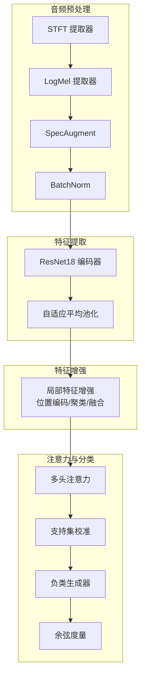
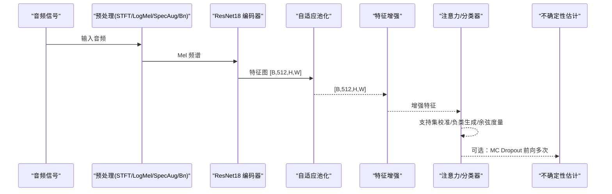
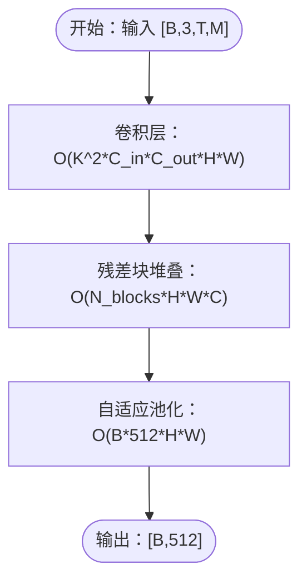
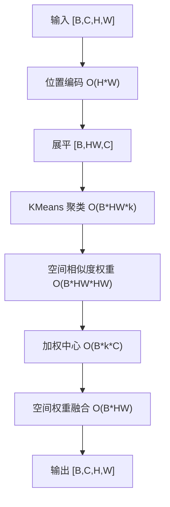
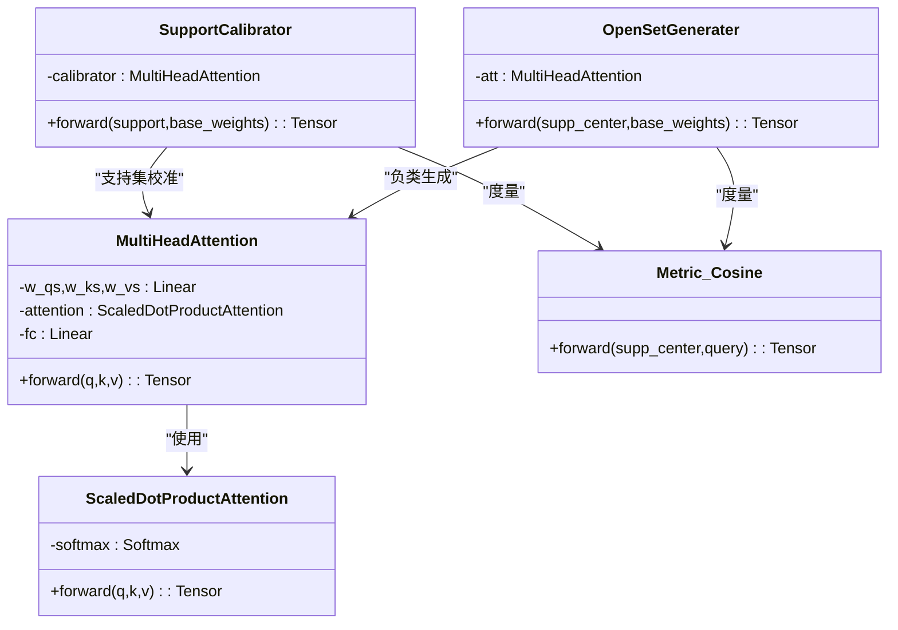
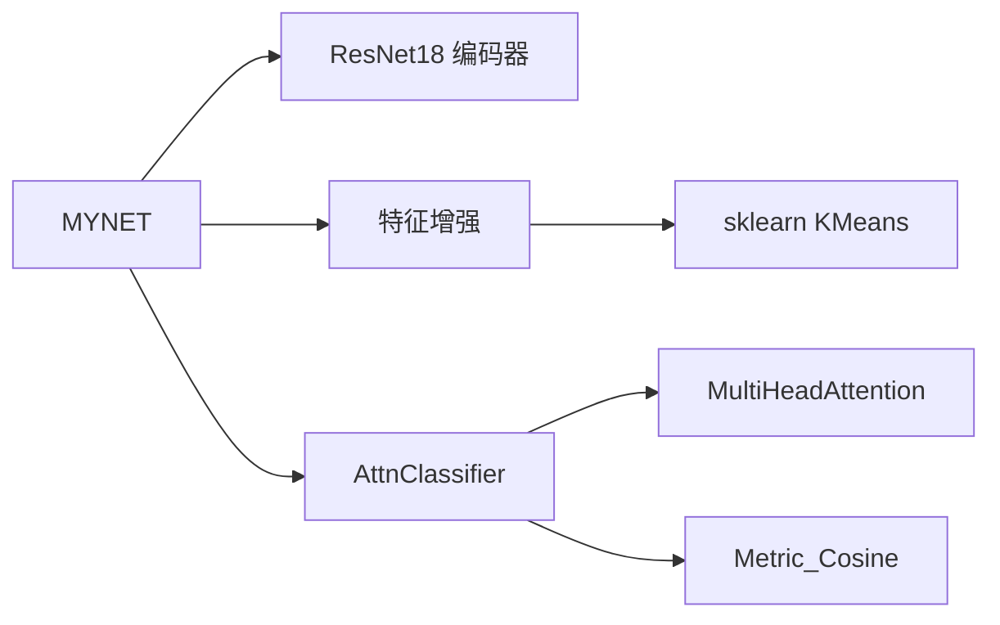

# 计算复杂度分析

<cite>
**本文引用的文件**
- [network.py](file://network.py)
- [models/resnet18_encoder.py](file://models/resnet18_encoder.py)
- [models/feature_enhancer.py](file://models/feature_enhancer.py)
- [models/resnet_enhancer.py](file://models/resnet_enhancer.py)
- [models/AttnClassifier.py](file://models/AttnClassifier.py)
- [configs/default.yml](file://configs/default.yml)
- [train.py](file://train.py)
- [test.py](file://test.py)
</cite>

## 目录
1. [简介](#简介)
2. [项目结构](#项目结构)
3. [核心组件](#核心组件)
4. [架构总览](#架构总览)
5. [详细组件分析](#详细组件分析)
6. [依赖分析](#依赖分析)
7. [性能考量](#性能考量)
8. [故障排查指南](#故障排查指南)
9. [结论](#结论)
10. [附录](#附录)

## 简介
本文件针对 VAZE 项目的计算复杂度进行系统性分析，覆盖前向传播、反向传播、注意力计算等关键路径，并重点评估 ResNet18 编码器与注意力机制的计算开销，以及特征增强模块的时间与空间复杂度。同时给出不同数据尺寸与批次大小对计算需求的影响，提出 GPU 加速与并行优化策略，并给出计算资源预算与硬件配置建议。

## 项目结构
VAZE 项目围绕音频特征提取、特征增强、元学习分类器与注意力模块构建，核心模块包括：
- 音频特征提取与预处理：STFT、LogMel、SpecAugment、BatchNorm
- ResNet18 编码器：图像风格卷积特征提取
- 特征增强模块：局部聚类、位置编码、时序约束、原型中心动态加权
- 注意力与分类器：多头注意力、原型校准与负类生成、余弦度量
- 训练与推理：标准分类、增量更新、不确定性估计

图表来源
- [network.py:326-353](file://network.py#L326-L353)
- [network.py:471-485](file://network.py#L471-L485)
- [models/resnet_enhancer.py:51-160](file://models/resnet_enhancer.py#L51-L160)
- [models/AttnClassifier.py:274-369](file://models/AttnClassifier.py#L274-L369)

章节来源
- [network.py:326-353](file://network.py#L326-L353)
- [network.py:471-485](file://network.py#L471-L485)
- [models/resnet_enhancer.py:51-160](file://models/resnet_enhancer.py#L51-L160)
- [models/AttnClassifier.py:274-369](file://models/AttnClassifier.py#L274-L369)

## 核心组件
- ResNet18 编码器：负责将 Mel 频谱映射为 512 维特征图，输出形状为 [B, 512, H, W]。
- 特征增强模块：对中间层特征进行位置编码、局部聚类与空间融合，降低冗余并提升判别性。
- 注意力与分类器：支持集校准（多头注意力）、负类生成（多头注意力）、余弦相似度度量。
- 不确定性估计：MC Dropout + 多次前向，计算核范数作为不确定性指标。

章节来源
- [models/resnet18_encoder.py:240-334](file://models/resnet18_encoder.py#L240-L334)
- [models/resnet_enhancer.py:51-160](file://models/resnet_enhancer.py#L51-L160)
- [models/AttnClassifier.py:39-93](file://models/AttnClassifier.py#L39-L93)
- [network.py:50-101](file://network.py#L50-L101)

## 架构总览
VAZE 的典型前向流程如下：
- 音频经 STFT/LogMel 转换，SpecAugment 数据增强，BN 归一化
- ResNet18 编码器提取特征图，自适应池化降维至 [B, 512]
- 可选：特征增强模块对中间层特征进行增强
- 注意力模块：支持集校准与负类生成，余弦度量计算分类得分
- 可选：不确定性估计（MC Dropout）

图表来源
- [network.py:471-485](file://network.py#L471-L485)
- [models/resnet_enhancer.py:51-160](file://models/resnet_enhancer.py#L51-L160)
- [models/AttnClassifier.py:47-93](file://models/AttnClassifier.py#L47-L93)
- [network.py:50-101](file://network.py#L50-L101)

## 详细组件分析

### ResNet18 编码器复杂度分析
- 结构要点
  - 输入通道：由 Mel 频谱重复三通道得到 [B, 3, T, M]
  - 卷积与残差块：包含四层残差块，每层包含若干 BasicBlock/Bottleneck
  - 输出：特征图 [B, 512, H, W]，随后自适应池化至 [B, 512]
- 时间复杂度
  - 卷积层：对单张特征图，卷积复杂度约为 O(K^2 × C_in × C_out × H × W)，其中 K 为卷积核大小，C 为通道数，H/W 为空间尺寸
  - 残差块：每块包含多个卷积与加法，整体近似 O(N_conv × H × W × C)
  - 整体前向：假设输入为 [B, 3, T, M]，ResNet18 的主要计算集中在卷积与池化，复杂度近似 O(B × T × M × Σ(卷积核参数))
- 空间复杂度
  - 中间特征图 [B, C, H, W]，峰值显存与通道数、空间分辨率相关
  - 自适应池化后 [B, 512]，线性层前向与反向的参数存储 O(512 × D)（D 为类别数）

图表来源
- [models/resnet18_encoder.py:240-334](file://models/resnet18_encoder.py#L240-L334)
- [network.py:471-485](file://network.py#L471-L485)

章节来源
- [models/resnet18_encoder.py:240-334](file://models/resnet18_encoder.py#L240-L334)
- [network.py:471-485](file://network.py#L471-L485)

### 特征增强模块复杂度分析
- LocalFeatureCluster（中间层增强）
  - 位置编码：Conv2d 时间/频率方向编码，线性复杂度 O(H×W)
  - 局部聚类：对每个样本执行 KMeans，聚类中心数 k≈H×W×k_ratio
    - CPU-GPU 交互：将展平特征转移至 CPU，聚类后回传
    - 向量化加权：基于空间相似度矩阵与掩码计算加权中心，复杂度 O(B×k×HW)
  - 空间融合：MLP 空间权重 O(B×HW)，最终融合 O(B×C×H×W)
- EnhancedLocalFeature（时序约束）
  - LSTM 时序特征提取：O(B×T×feat_dim)
  - 动态权重计算：O(B×HW×feat_dim)
  - 特征聚合与安全 reshape：O(B×k×C)

图表来源
- [models/resnet_enhancer.py:51-160](file://models/resnet_enhancer.py#L51-L160)
- [models/feature_enhancer.py:27-93](file://models/feature_enhancer.py#L27-L93)

章节来源
- [models/resnet_enhancer.py:51-160](file://models/resnet_enhancer.py#L51-L160)
- [models/feature_enhancer.py:27-93](file://models/feature_enhancer.py#L27-L93)

### 注意力与分类器复杂度分析
- MultiHeadAttention
  - Q/K/V 映射：O(D^2 × L)（L 为序列长度，D 为特征维度）
  - ScaledDotProductAttention：O(L^2 × D)（注意此处为批处理下的矩阵乘）
  - 多头拼接与线性变换：O(L × D^2)
  - 总体：O(B × L^2 × D)（按批处理展开）
- SupportCalibrator/OpenSetGenerater
  - 支持集校准：将支持集特征与基类权重经注意力融合，复杂度 O(B × N_way^2 × D)
  - 负类生成：对支持中心与基类权重做注意力，复杂度 O(B × N_way^2 × D)
- Metric_Cosine
  - 余弦度量：对查询与原型做批量矩阵乘，复杂度 O(B × (N_way+N_neg) × D)

图表来源
- [models/AttnClassifier.py:274-369](file://models/AttnClassifier.py#L274-L369)

章节来源
- [models/AttnClassifier.py:274-369](file://models/AttnClassifier.py#L274-L369)

### 不确定性估计复杂度分析
- MC Dropout：在推理阶段启用 Dropout，多次前向计算概率分布
- 核范数：对 P=[N_aug×N_forward, B, N_class] 计算核范数，复杂度 O(B×N_aug×N_forward×N_class)
- 实践建议：n_aug 与 n_forward 可按需降低以节省时间

章节来源
- [network.py:50-101](file://network.py#L50-L101)
- [test.py:48-85](file://test.py#L48-L85)

## 依赖分析
- 模块耦合
  - network.MYNET 依赖 ResNet18 编码器、特征增强模块、注意力分类器
  - AttnClassifier 依赖 MultiHeadAttention 与 Metric_Cosine
  - LocalFeatureCluster 依赖 sklearn KMeans，存在 CPU-GPU 交互
- 可能的环依赖
  - 未发现直接环依赖，但 LocalFeatureCluster 与 KMeans 的 CPU-GPU 交互可能成为瓶颈

图表来源
- [network.py:18-36](file://network.py#L18-L36)
- [models/AttnClassifier.py:39-93](file://models/AttnClassifier.py#L39-L93)
- [models/resnet_enhancer.py:51-160](file://models/resnet_enhancer.py#L51-L160)

章节来源
- [network.py:18-36](file://network.py#L18-L36)
- [models/AttnClassifier.py:39-93](file://models/AttnClassifier.py#L39-L93)
- [models/resnet_enhancer.py:51-160](file://models/resnet_enhancer.py#L51-L160)

## 性能考量
- 数据尺寸与批次大小影响
  - 时间复杂度与输入尺寸 T、M、批次 B 成正比；ResNet 主要受空间与通道影响
  - 注意力复杂度与序列长度 L 的平方相关，L≈N_way^2，因此 N_way 增长显著增加计算
  - 特征增强中的 KMeans 与空间相似度矩阵计算随 HW 增长呈平方增长
- GPU 加速与并行
  - 使用 CUDA 张量与卷积库（cuDNN）可显著加速卷积与注意力
  - 注意力实现采用批处理矩阵乘，适合 GPU 并行
  - 特征增强模块的 KMeans 与空间相似度计算可在 CPU 上进行，注意最小化 CPU-GPU 传输
- 内存优化
  - 自适应池化将空间维度降至常数，降低显存占用
  - 可在必要时关闭 Dropout 以减少前向额外计算
- 训练与推理差异
  - 训练阶段：启用 Dropout、SpecAugment、注意力训练
  - 推理阶段：可关闭 Dropout、减少注意力次数、使用不确定性估计

[本节为通用指导，无需具体文件引用]

## 故障排查指南
- 特征增强维度不匹配
  - 现象：维度转换失败或断言错误
  - 排查：确认输入特征通道数与模块期望一致，检查维度修正层
- 注意力维度异常
  - 现象：Q/K/V 维度不匹配导致报错
  - 排查：检查 MultiHeadAttention 的 d_model 与 n_head 设置
- 不确定性估计不稳定
  - 现象：核范数波动较大
  - 排查：降低 n_aug 与 n_forward，或在评估时关闭 MC Dropout

章节来源
- [models/resnet_enhancer.py:51-160](file://models/resnet_enhancer.py#L51-L160)
- [models/AttnClassifier.py:274-369](file://models/AttnClassifier.py#L274-L369)
- [network.py:50-101](file://network.py#L50-L101)

## 结论
- ResNet18 编码器是主要计算热点，其卷积与池化操作主导前向时间与显存
- 注意力模块在支持集与负类生成阶段引入二次复杂度，N_way 增长将显著增加成本
- 特征增强模块通过位置编码与聚类提升判别性，但带来 CPU-GPU 交互与空间相似度计算开销
- 建议优先优化注意力实现（如使用高效注意力库）、减少 N_way、在推理阶段关闭不必要的 Dropout 与增强

[本节为总结，无需具体文件引用]

## 附录

### 关键参数与默认配置
- 训练与任务配置（来自默认配置文件）
  - n_ways=5, n_shots=5, n_queries=15
  - batch_size=128（训练），test_batch_size=100
  - 温度参数 temperature=1
  - 提取器参数：sample_rate=16000, window_size=400, hop_size=160, mel_bins=128, fmin=0, fmax=8000

章节来源
- [configs/default.yml:1-88](file://configs/default.yml#L1-L88)

### 计算复杂度汇总（按模块）
- ResNet18 编码器
  - 时间：O(B × T × M × Σ(卷积核参数))
  - 空间：峰值显存 O(B × C × H × W)，线性层参数 O(512 × D)
- 特征增强（LocalFeatureCluster）
  - 时间：O(B × HW × (k + HW + 1))，k≈H×W×k_ratio
  - 空间：O(B × C × H × W)
- 注意力与分类器
  - 时间：O(B × N_way^2 × D)
  - 空间：O(B × N_way × D)
- 不确定性估计
  - 时间：O(B × N_aug × N_forward × N_class)
  - 空间：O(N_aug × N_forward × B × N_class)

章节来源
- [models/resnet18_encoder.py:240-334](file://models/resnet18_encoder.py#L240-L334)
- [models/resnet_enhancer.py:51-160](file://models/resnet_enhancer.py#L51-L160)
- [models/AttnClassifier.py:274-369](file://models/AttnClassifier.py#L274-L369)
- [network.py:50-101](file://network.py#L50-L101)