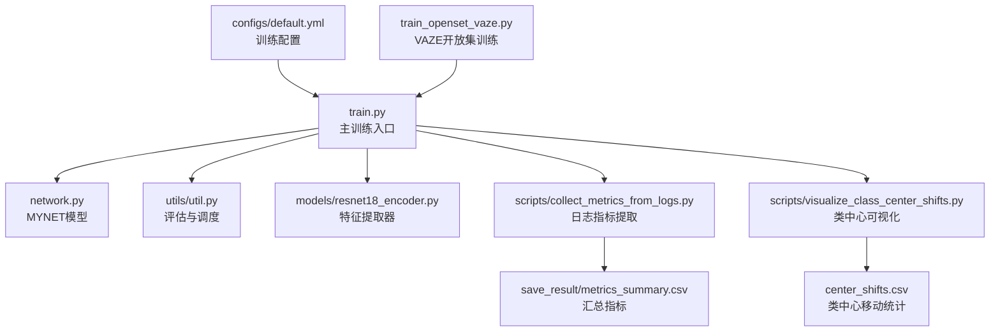
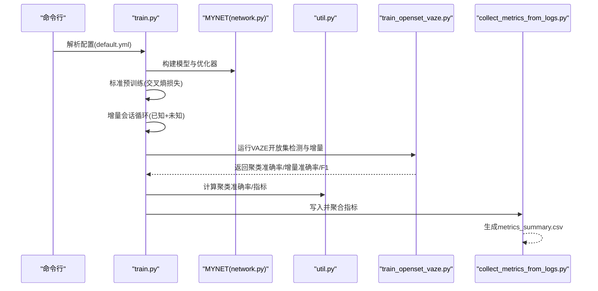
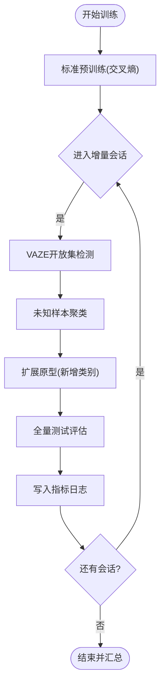
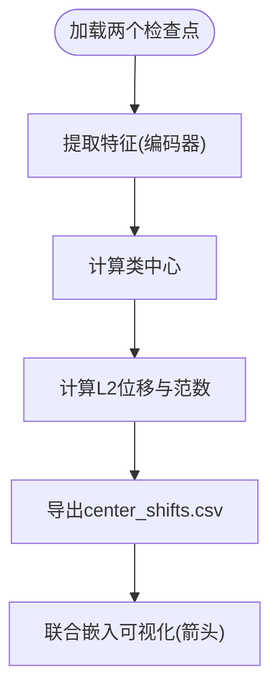
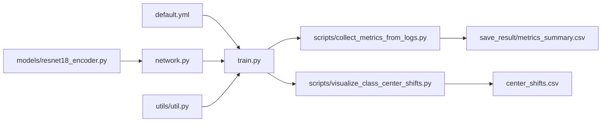

# 训练性能分析

<cite>
**本文引用的文件**   
- [train.py](file://train.py)
- [train_openset_vaze.py](file://train_openset_vaze.py)
- [default.yml](file://configs/default.yml)
- [analyze_center_shifts.py](file://scripts/analyze_center_shifts.py)
- [visualize_class_center_shifts.py](file://scripts/visualize_class_center_shifts.py)
- [collect_metrics_from_logs.py](file://scripts/collect_metrics_from_logs.py)
- [metrics_summary.csv](file://save_result/metrics_summary.csv)
- [center_shifts.csv](file://center_shifts.csv)
- [network.py](file://network.py)
- [util.py](file://utils/util.py)
- [resnet18_encoder.py](file://models/resnet18_encoder.py)
</cite>

## 目录
1. [简介](#简介)
2. [项目结构](#项目结构)
3. [核心组件](#核心组件)
4. [架构总览](#架构总览)
5. [详细组件分析](#详细组件分析)
6. [依赖分析](#依赖分析)
7. [性能考量](#性能考量)
8. [故障排查指南](#故障排查指南)
9. [结论](#结论)
10. [附录](#附录)

## 简介
本文件面向VAZE项目的训练性能分析，聚焦以下目标：
- 解析训练过程中的关键性能指标变化：损失函数收敛、准确率趋势、验证集波动
- 对比不同训练配置（学习率、批次大小、训练轮数）对最终性能的影响
- 分析类中心移动（class center shifts）对训练稳定性与泛化的影响
- 提供训练过程中的性能监控指标与异常检测方法
- 识别并处理过拟合与欠拟合现象
- 给出时间复杂度与内存使用的大致估算与优化建议

## 项目结构
VAZE项目围绕“增量 Few-Shot 开放集识别”展开，训练流程由主脚本驱动，结合VAZE开放集检测与增量原型扩展逻辑，并通过脚本收集与可视化各类性能指标。

图表来源
- [default.yml:1-88](file://configs/default.yml#L1-L88)
- [train.py:1-1296](file://train.py#L1-L1296)
- [network.py:1-200](file://network.py#L1-L200)
- [util.py:1-75](file://utils/util.py#L1-L75)
- [resnet18_encoder.py:1-200](file://models/resnet18_encoder.py#L1-L200)
- [collect_metrics_from_logs.py:1-67](file://scripts/collect_metrics_from_logs.py#L1-L67)
- [metrics_summary.csv:1-85](file://save_result/metrics_summary.csv#L1-L85)
- [visualize_class_center_shifts.py:1-291](file://scripts/visualize_class_center_shifts.py#L1-L291)
- [analyze_center_shifts.py:1-261](file://scripts/analyze_center_shifts.py#L1-L261)
- [center_shifts.csv:1-22](file://center_shifts.csv#L1-L22)
- [train_openset_vaze.py:1-481](file://train_openset_vaze.py#L1-L481)

章节来源
- [train.py:1-1296](file://train.py#L1-L1296)
- [default.yml:1-88](file://configs/default.yml#L1-L88)

## 核心组件
- 主训练脚本：负责标准预训练、增量会话训练、评估与结果写入，包含损失计算、准确率统计与日志聚合。
- VAZE开放集训练脚本：采用VAZE的闭集分类器+阈值检测+未知样本聚类扩展原型的增量流程。
- 网络模型：MYNET封装编码器、分类器、注意力模块等，支持多种模式（encoder/openmeta）。
- 工具与评估：提供聚类准确率、F1等指标计算，以及学习率调度。
- 中心移动分析脚本：提取两个检查点的类中心，计算L2位移并可视化。
- 指标收集脚本：从训练输出日志中抽取关键指标，生成汇总CSV。

章节来源
- [train.py:763-981](file://train.py#L763-L981)
- [train_openset_vaze.py:86-198](file://train_openset_vaze.py#L86-L198)
- [network.py:18-36](file://network.py#L18-L36)
- [util.py:12-75](file://utils/util.py#L12-L75)
- [analyze_center_shifts.py:136-261](file://scripts/analyze_center_shifts.py#L136-L261)
- [collect_metrics_from_logs.py:27-67](file://scripts/collect_metrics_from_logs.py#L27-L67)

## 架构总览
下图展示了VAZE训练流程的关键节点与数据流：标准预训练→增量会话→VAZE开放集检测→聚类扩展原型→评估与记录。

图表来源
- [train.py:799-981](file://train.py#L799-L981)
- [train_openset_vaze.py:248-417](file://train_openset_vaze.py#L248-L417)
- [network.py:18-36](file://network.py#L18-L36)
- [util.py:12-75](file://utils/util.py#L12-L75)
- [collect_metrics_from_logs.py:27-67](file://scripts/collect_metrics_from_logs.py#L27-L67)

## 详细组件分析

### 训练流程与损失收敛
- 标准预训练：使用交叉熵损失，按配置文件设置学习率、优化器与调度策略，训练过程中记录损失与准确率。
- 增量会话：每轮会话先进行VAZE开放集检测，再对未知样本聚类并扩展原型，随后在全量测试集上评估增量准确率。
- 指标记录：将每轮会话的“已知准确率、未知聚类准确率、F1、增量准确率、总体准确率”写入日志文件，并由脚本汇总为CSV。

图表来源
- [train.py:822-930](file://train.py#L822-L930)
- [train_openset_vaze.py:248-417](file://train_openset_vaze.py#L248-L417)

章节来源
- [train.py:948-981](file://train.py#L948-L981)
- [default.yml:22-41](file://configs/default.yml#L22-L41)

### 准确率与验证集波动
- 已知类准确率：在每轮会话的已知测试集上计算，反映模型对已学类的保持能力。
- 未知聚类准确率：对未知样本聚类后与真实标签映射，衡量增量发现未知类的能力。
- F1分数：二分类（已知/未知）的F1，反映检测未知样本的平衡性。
- 增量准确率：加入新原型后的整体分类准确率，体现增量学习效果。
- 总体准确率：包含已知与未知的综合评估。

章节来源
- [train.py:851-889](file://train.py#L851-L889)
- [util.py:49-57](file://utils/util.py#L49-L57)

### 类中心移动（Class Center Shifts）分析
- 数据提取：加载两个检查点，提取特征并计算类中心。
- 移动度量：计算每个类中心的L2范数变化与位移幅度，生成CSV。
- 可视化：t-SNE或UMAP联合样本与中心的嵌入图，箭头指示中心移动方向与幅度。

图表来源
- [analyze_center_shifts.py:136-261](file://scripts/analyze_center_shifts.py#L136-L261)
- [visualize_class_center_shifts.py:203-291](file://scripts/visualize_class_center_shifts.py#L203-L291)
- [center_shifts.csv:1-22](file://center_shifts.csv#L1-L22)

章节来源
- [analyze_center_shifts.py:113-134](file://scripts/analyze_center_shifts.py#L113-L134)
- [visualize_class_center_shifts.py:147-201](file://scripts/visualize_class_center_shifts.py#L147-L201)

### 不同训练配置的性能对比
- 学习率：配置文件提供标准学习率与调度策略，可通过调整学习率与调度步长观察收敛速度与稳定性。
- 批次大小：训练批大小影响显存占用与梯度稳定性，需结合GPU显存与收敛表现调优。
- 训练轮数：标准预训练轮数与增量会话轮数直接影响模型稳定性和增量效果。
- 评估次数：测试轮次决定统计指标的稳定性与置信区间。

章节来源
- [default.yml:22-60](file://configs/default.yml#L22-L60)
- [train.py:940-946](file://train.py#L940-L946)

### 时间复杂度与内存使用
- 时间复杂度
  - 标准预训练：单轮复杂度近似O(N·D·C)，其中N为样本数、D为特征维度、C为类别数；受批次大小与迭代次数影响。
  - VAZE开放集检测：对每个批次计算特征与类中心相似度，复杂度近似O(B·D·K)，B为批大小，K为类别数。
  - 聚类扩展原型：K-Means复杂度近似O(B·d·I·k)，d为特征维度，I为迭代次数，k为新增类别数。
- 内存使用
  - 显存主要消耗在特征提取与分类器权重存储；特征维度与批次大小是关键因素。
  - 可通过减小批次大小、降低特征维度或使用混合精度（若框架支持）缓解显存压力。

[本节为通用性能讨论，无需特定文件引用]

## 依赖分析
- 训练主流程依赖配置文件(default.yml)提供超参，依赖网络模型(network.py)与评估工具(util.py)。
- VAZE开放集流程独立于主训练脚本，但共享相同的评估与日志写入接口。
- 中心移动分析脚本依赖训练脚本提供的数据加载与模型接口，输出CSV与可视化图像。

图表来源
- [default.yml:1-88](file://configs/default.yml#L1-L88)
- [train.py:1-1296](file://train.py#L1-L1296)
- [network.py:1-200](file://network.py#L1-200)
- [util.py:1-75](file://utils/util.py#L1-L75)
- [resnet18_encoder.py:1-200](file://models/resnet18_encoder.py#L1-L200)
- [collect_metrics_from_logs.py:1-67](file://scripts/collect_metrics_from_logs.py#L1-L67)
- [metrics_summary.csv:1-85](file://save_result/metrics_summary.csv#L1-L85)
- [visualize_class_center_shifts.py:1-291](file://scripts/visualize_class_center_shifts.py#L1-L291)
- [center_shifts.csv:1-22](file://center_shifts.csv#L1-L22)

章节来源
- [train.py:1-1296](file://train.py#L1-L1296)
- [train_openset_vaze.py:1-481](file://train_openset_vaze.py#L1-L481)

## 性能考量
- 收敛与稳定性
  - 使用余弦相似度分类与温度缩放有助于稳定特征分布，减少灾难性遗忘。
  - 类中心移动过大可能意味着训练不稳定或学习率过高，需适当降低学习率或增加正则。
- 过拟合与欠拟合识别
  - 过拟合：已知准确率持续下降、未知聚类准确率显著上升且F1下降，或增量准确率停滞。
  - 欠拟合：已知/未知准确率均偏低，F1低，且中心移动较小。
- 配置调优建议
  - 学习率：若中心移动剧烈，尝试降低学习率；若收敛缓慢，适度提高。
  - 批次大小：在显存允许范围内尽量增大，以提升梯度稳定性。
  - 训练轮数：观察Session 0与Session 4的性能退化（PD）指标，避免过度训练。

[本节为通用指导，无需特定文件引用]

## 故障排查指南
- 日志指标缺失
  - 检查日志文件是否包含期望字段（如Session 0平均准确率、各Session增量准确率），若缺失，确认训练脚本是否正常写入。
- 中心移动异常
  - 若CSV为空或中心位移为零，确认检查点路径正确、特征提取通道维度一致。
- 可视化失败
  - 确认UMAP可用，否则脚本会回退至t-SNE；若仍失败，检查matplotlib环境与依赖安装。

章节来源
- [collect_metrics_from_logs.py:27-67](file://scripts/collect_metrics_from_logs.py#L27-L67)
- [analyze_center_shifts.py:124-134](file://scripts/analyze_center_shifts.py#L124-L134)

## 结论
- VAZE训练流程通过VAZE开放集检测与增量原型扩展，在增量Few-Shot场景下实现了对未知类的发现与稳定分类。
- 通过日志指标汇总与类中心移动分析，可以有效监控训练稳定性与性能退化趋势。
- 建议在配置层面关注学习率、批次大小与训练轮数的平衡，结合中心移动与指标变化进行动态调优，以获得更稳健的增量学习效果。

[本节为总结性内容，无需特定文件引用]

## 附录
- 指标定义与解读
  - Session 0平均准确率：基线已知类准确率，反映预训练质量。
  - 平均已知/未知准确率、F1、增量准确率、总体准确率：增量阶段的核心评估指标。
  - 性能退化（PD）：Session 1与Session 4之间的差值，用于衡量增量稳定性。

章节来源
- [metrics_summary.csv:1-85](file://save_result/metrics_summary.csv#L1-L85)