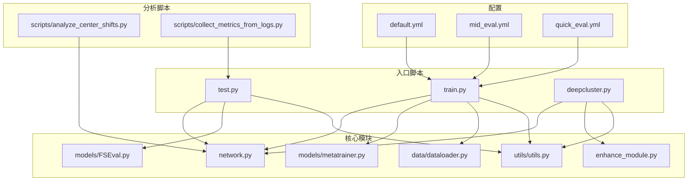
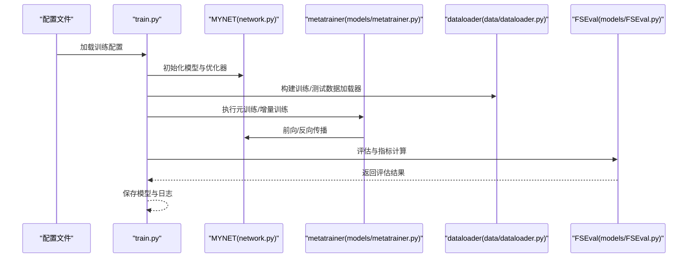
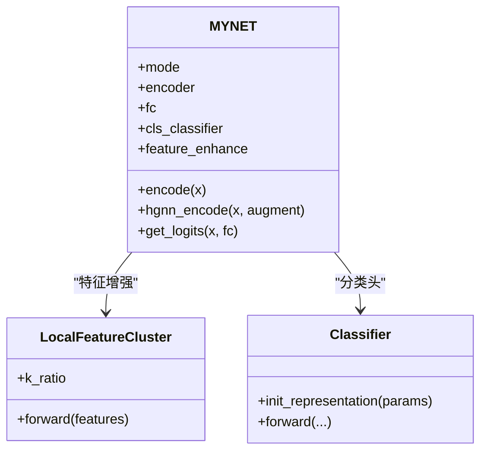
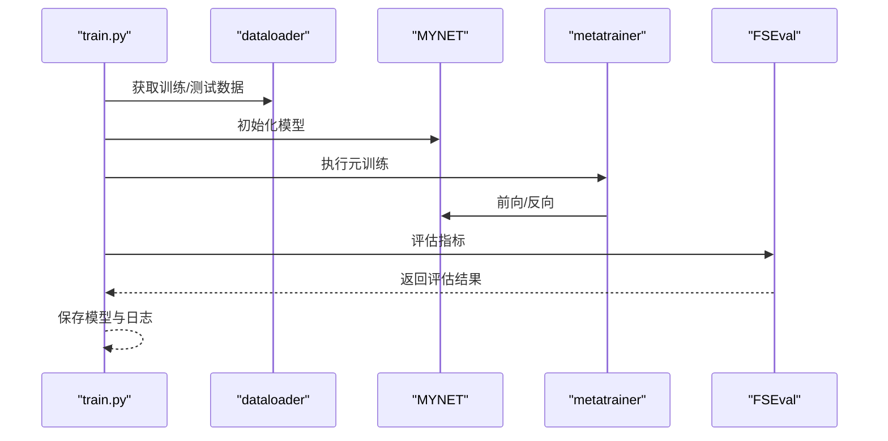
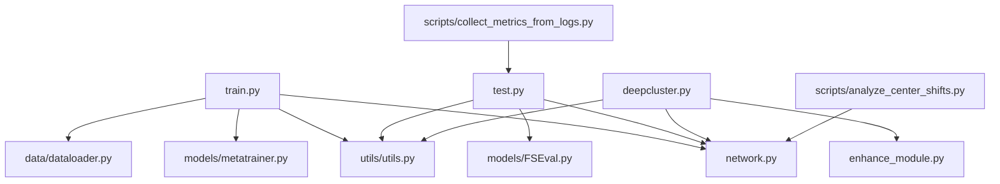

# 资源消耗分析

<cite>
**本文档引用的文件**
- [configs/default.yml](file://configs/default.yml)
- [configs/mid_eval.yml](file://configs/mid_eval.yml)
- [configs/quick_eval.yml](file://configs/quick_eval.yml)
- [train.py](file://train.py)
- [test.py](file://test.py)
- [network.py](file://network.py)
- [models/metatrainer.py](file://models/metatrainer.py)
- [enhance_module.py](file://enhance_module.py)
- [data/dataloader.py](file://data/dataloader.py)
- [models/FSEval.py](file://models/FSEval.py)
- [utils/utils.py](file://utils/utils.py)
- [deepcluster.py](file://deepcluster.py)
- [scripts/analyze_center_shifts.py](file://scripts/analyze_center_shifts.py)
- [scripts/collect_metrics_from_logs.py](file://scripts/collect_metrics_from_logs.py)
</cite>

## 目录
1. [简介](#简介)
2. [项目结构](#项目结构)
3. [核心组件](#核心组件)
4. [架构概览](#架构概览)
5. [详细组件分析](#详细组件分析)
6. [依赖关系分析](#依赖关系分析)
7. [性能考量](#性能考量)
8. [故障排查指南](#故障排查指南)
9. [结论](#结论)
10. [附录](#附录)

## 简介
本文件针对 VAZE 项目进行全面的资源消耗分析，覆盖训练与推理阶段的关键指标（内存使用、GPU 利用率、CPU 占用率），并结合不同配置（批大小、序列长度、模型深度）对资源消耗的影响进行系统化梳理。同时提供跨硬件平台（CPU/GPU/TPU）的性能对比思路、资源优化策略、瓶颈识别方法、监控工具使用指南以及长时间运行任务的资源管理建议。

## 项目结构
VAZE 项目采用模块化设计，围绕配置驱动的训练流程组织代码，核心目录与职责如下：
- configs：训练配置（默认、中等评估、快速评估）
- data：数据加载与采样器
- models：模型定义与评估工具
- utils：通用工具与日志
- scripts：资源分析与日志收集脚本
- save/save_result：模型与结果存储
- 入口脚本：train.py、test.py、deepcluster.py

**图表来源**
- [configs/default.yml:1-88](file://configs/default.yml#L1-L88)
- [train.py:1-1296](file://train.py#L1-L1296)
- [test.py:1-1314](file://test.py#L1-L1314)
- [network.py:1-724](file://network.py#L1-L724)
- [models/metatrainer.py:1-201](file://models/metatrainer.py#L1-L201)
- [data/dataloader.py:1-351](file://data/dataloader.py#L1-L351)
- [models/FSEval.py:1-125](file://models/FSEval.py#L1-L125)
- [enhance_module.py:1-160](file://enhance_module.py#L1-L160)
- [utils/utils.py:1-566](file://utils/utils.py#L1-L566)
- [deepcluster.py:1-744](file://deepcluster.py#L1-L744)
- [scripts/analyze_center_shifts.py:1-261](file://scripts/analyze_center_shifts.py#L1-L261)
- [scripts/collect_metrics_from_logs.py:1-67](file://scripts/collect_metrics_from_logs.py#L1-L67)

**章节来源**
- [configs/default.yml:1-88](file://configs/default.yml#L1-L88)
- [configs/mid_eval.yml:1-88](file://configs/mid_eval.yml#L1-L88)
- [configs/quick_eval.yml:1-88](file://configs/quick_eval.yml#L1-L88)
- [train.py:1-1296](file://train.py#L1-L1296)
- [test.py:1-1314](file://test.py#L1-L1314)
- [network.py:1-724](file://network.py#L1-L724)
- [models/metatrainer.py:1-201](file://models/metatrainer.py#L1-L201)
- [data/dataloader.py:1-351](file://data/dataloader.py#L1-L351)
- [models/FSEval.py:1-125](file://models/FSEval.py#L1-L125)
- [enhance_module.py:1-160](file://enhance_module.py#L1-L160)
- [utils/utils.py:1-566](file://utils/utils.py#L1-L566)
- [deepcluster.py:1-744](file://deepcluster.py#L1-L744)
- [scripts/analyze_center_shifts.py:1-261](file://scripts/analyze_center_shifts.py#L1-L261)
- [scripts/collect_metrics_from_logs.py:1-67](file://scripts/collect_metrics_from_logs.py#L1-L67)

## 核心组件
- 配置系统：通过 YAML 驱动训练参数（批次大小、工作进程数、学习率调度、数据增强参数等）
- 网络模型：MYNET 包含 ResNet18 编码器、分类头、注意力模块与音频特征提取链路
- 数据加载：支持多数据集、多采样策略、多进程加载与内存固定
- 训练流程：标准预训练、元训练、增量会话与测试评估
- 资源分析：中心漂移分析、日志指标采集、特征可视化与聚类分析

**章节来源**
- [configs/default.yml:57-84](file://configs/default.yml#L57-L84)
- [network.py:18-518](file://network.py#L18-L518)
- [data/dataloader.py:13-132](file://data/dataloader.py#L13-L132)
- [models/metatrainer.py:17-178](file://models/metatrainer.py#L17-L178)
- [scripts/analyze_center_shifts.py:53-109](file://scripts/analyze_center_shifts.py#L53-L109)
- [scripts/collect_metrics_from_logs.py:27-62](file://scripts/collect_metrics_from_logs.py#L27-L62)

## 架构概览
训练与推理的总体流程如下：

**图表来源**
- [train.py:799-1296](file://train.py#L799-L1296)
- [network.py:586-724](file://network.py#L586-L724)
- [models/metatrainer.py:17-178](file://models/metatrainer.py#L17-L178)
- [data/dataloader.py:13-132](file://data/dataloader.py#L13-L132)
- [models/FSEval.py:17-125](file://models/FSEval.py#L17-L125)

## 详细组件分析

### 配置与资源参数
- 批次大小与工作进程
  - 训练批大小：128（默认配置）
  - 测试批大小：100（默认配置）
  - 数据加载 num_workers：8（默认配置）
  - 通过配置文件可调整以平衡吞吐与内存占用
- 学习率与调度
  - 标准训练学习率、增量学习率、图注意力学习率等
  - 支持 Step/Milestone 调度策略
- 数据增强与特征提取
  - STFT/LogMel 参数（采样率、窗长、步长、mel-bin 等）
  - SpecAugmentation 与时频遮挡
- 会话与任务参数
  - way/shots/query 等 Few-Shot 设置
  - 多会话增量训练与测试轮次

**章节来源**
- [configs/default.yml:57-84](file://configs/default.yml#L57-L84)
- [configs/mid_eval.yml:57-84](file://configs/mid_eval.yml#L57-L84)
- [configs/quick_eval.yml:57-84](file://configs/quick_eval.yml#L57-L84)
- [data/dataloader.py:128-132](file://data/dataloader.py#L128-L132)

### 网络与计算图
- 编码器与特征提取
  - ResNet18 编码器输出 512 维特征
  - 保留空间维度（H×W）以便局部特征增强
- 分类头与注意力
  - 分类头支持 dot/cos 温度缩放
  - 多头注意力模块用于原型融合
- 不确定性估计与增强
  - MC Dropout + 掩码增强用于不确定性量化
  - 局部特征聚类与动态融合提升鲁棒性

**图表来源**
- [network.py:18-518](file://network.py#L18-L518)
- [enhance_module.py:70-160](file://enhance_module.py#L70-L160)

**章节来源**
- [network.py:18-518](file://network.py#L18-L518)
- [enhance_module.py:70-160](file://enhance_module.py#L70-L160)

### 数据加载与内存管理
- 多进程加载与内存固定
  - num_workers=8、pin_memory=True 降低 CPU-GPU 传输延迟
  - worker_init_fn 固定随机种子，保证可复现性
- 采样策略
  - 支持 SupportsetSampler、TrueIncreTrainCategoriesSampler 等
  - 控制每批次类别数、样本数与查询数
- 数据集适配
  - 支持 LibriSpeech、NSynth、FSD-MIX 等数据集
  - 通过 args.dataset 切换

**章节来源**
- [data/dataloader.py:13-132](file://data/dataloader.py#L13-L132)
- [data/dataloader.py:158-168](file://data/dataloader.py#L158-L168)
- [data/dataloader.py:206-230](file://data/dataloader.py#L206-L230)

### 训练与评估流程
- 标准预训练
  - 标准分类损失，支持学习率调度
- 元训练
  - 通过 metatrainer 执行 Few-Shot 训练，支持 AUROC/Acc 指标
- 测试评估
  - FSEval 提供余弦相似度评分与指标汇总
- 增量会话
  - 逐步扩展类别数，更新分类头原型

**图表来源**
- [train.py:799-1296](file://train.py#L799-L1296)
- [models/metatrainer.py:17-178](file://models/metatrainer.py#L17-L178)
- [models/FSEval.py:17-125](file://models/FSEval.py#L17-L125)

**章节来源**
- [models/metatrainer.py:17-178](file://models/metatrainer.py#L17-L178)
- [models/FSEval.py:17-125](file://models/FSEval.py#L17-L125)
- [train.py:799-1296](file://train.py#L799-L1296)

### 资源消耗分析

#### 训练阶段资源消耗
- 内存使用
  - 主要消耗来自特征图（B×C×H×W）与优化器状态
  - 批大小越大，显存占用越高；可通过减小批大小或混合精度缓解
- GPU 利用率
  - ResNet18 编码器与注意力模块计算密集，GPU 利用率较高
  - 多头注意力与余弦相似度计算带来额外开销
- CPU 占用
  - 数据加载（num_workers=8）与 KMeans 聚类会占用较多 CPU
  - 建议合理设置 num_workers 与 pin_memory

#### 推理阶段资源消耗
- 内存使用
  - 推理时仅需前向传播，显存占用显著低于训练
- GPU 利用率
  - 余弦相似度与原型比较为主要计算
- CPU 占用
  - FSEval 的指标计算与可视化可能占用 CPU

#### 不同配置对资源的影响
- 批大小
  - 增大批大小提高吞吐但增加显存压力；需权衡
- 序列长度与 mel-bin
  - 影响特征图尺寸（H×W），进而影响显存与计算量
- 模型深度
  - ResNet18 深度固定；可通过注意力头数与温度参数调节计算复杂度

**章节来源**
- [configs/default.yml:57-84](file://configs/default.yml#L57-L84)
- [network.py:18-518](file://network.py#L18-L518)
- [data/dataloader.py:128-132](file://data/dataloader.py#L128-L132)

### 性能对比与优化策略

#### 跨硬件平台对比思路
- CPU：适合小规模实验与离线分析，速度较慢
- GPU：主流训练/推理平台，建议启用 CUDA 并合理批大小
- TPU：若具备资源，可考虑分布式训练框架（如 JAX/PyTorch/XLA）进行加速

#### 优化策略
- 批大小与梯度累积
  - 显存不足时采用梯度累积模拟更大批
- 混合精度训练
  - 使用 autocast 与 GradScaler 降低显存占用
- 数据加载优化
  - num_workers 与 pin_memory 调优；缓存预处理结果
- 模型与算子优化
  - 使用 torch.compile（PyTorch ≥ 2.0）或 TorchInductor
  - 注意力与余弦相似度可利用高效实现（如 FlashAttention）

#### 瓶颈识别
- 使用 PyTorch Profiler 或 NVIDIA Nsight Systems 定位热点
- 关注数据加载、特征提取、注意力与余弦相似度计算

**章节来源**
- [network.py:586-724](file://network.py#L586-L724)
- [data/dataloader.py:128-132](file://data/dataloader.py#L128-L132)

### 资源监控与调优指南

#### 监控工具
- PyTorch Profiler
  - 记录算子耗时与内存分配，定位瓶颈
- NVIDIA 工具链
  - nvidia-smi、Nsight Systems/Sysprof 监控 GPU 利用率与能耗
- Python 工具
  - memory_profiler、tracemalloc 观察内存增长

#### 日志与指标采集
- 使用 scripts/collect_metrics_from_logs.py 从文本日志提取指标
- 使用 scripts/analyze_center_shifts.py 分析原型中心漂移，辅助稳定性评估

**章节来源**
- [scripts/collect_metrics_from_logs.py:27-62](file://scripts/collect_metrics_from_logs.py#L27-L62)
- [scripts/analyze_center_shifts.py:136-261](file://scripts/analyze_center_shifts.py#L136-L261)

### 长时间运行任务的资源管理
- 检查点与断点续训
  - 定期保存模型与优化器状态，避免中断损失
- 资源上限与告警
  - 设置 GPU 内存上限与 OOM 捕获，自动重启
- 日志与可视化
  - 结合 save_result 与可视化脚本持续跟踪性能

**章节来源**
- [deepcluster.py:540-744](file://deepcluster.py#L540-L744)
- [utils/utils.py:534-566](file://utils/utils.py#L534-L566)

## 依赖关系分析

**图表来源**
- [train.py:1-1296](file://train.py#L1-L1296)
- [test.py:1-1314](file://test.py#L1-L1314)
- [deepcluster.py:1-744](file://deepcluster.py#L1-L744)
- [network.py:1-724](file://network.py#L1-L724)
- [models/metatrainer.py:1-201](file://models/metatrainer.py#L1-L201)
- [data/dataloader.py:1-351](file://data/dataloader.py#L1-L351)
- [models/FSEval.py:1-125](file://models/FSEval.py#L1-L125)
- [enhance_module.py:1-160](file://enhance_module.py#L1-L160)
- [utils/utils.py:1-566](file://utils/utils.py#L1-L566)
- [scripts/analyze_center_shifts.py:1-261](file://scripts/analyze_center_shifts.py#L1-L261)
- [scripts/collect_metrics_from_logs.py:1-67](file://scripts/collect_metrics_from_logs.py#L1-L67)

**章节来源**
- [train.py:1-1296](file://train.py#L1-L1296)
- [test.py:1-1314](file://test.py#L1-L1314)
- [deepcluster.py:1-744](file://deepcluster.py#L1-L744)
- [network.py:1-724](file://network.py#L1-L724)
- [models/metatrainer.py:1-201](file://models/metatrainer.py#L1-L201)
- [data/dataloader.py:1-351](file://data/dataloader.py#L1-L351)
- [models/FSEval.py:1-125](file://models/FSEval.py#L1-L125)
- [enhance_module.py:1-160](file://enhance_module.py#L1-L160)
- [utils/utils.py:1-566](file://utils/utils.py#L1-L566)
- [scripts/analyze_center_shifts.py:1-261](file://scripts/analyze_center_shifts.py#L1-L261)
- [scripts/collect_metrics_from_logs.py:1-67](file://scripts/collect_metrics_from_logs.py#L1-L67)

## 性能考量
- 计算复杂度
  - 编码器：O(BCHW)
  - 注意力与余弦相似度：O(NKd)
- 内存复杂度
  - 主要受特征图尺寸与批大小影响
- I/O 与数据加载
  - num_workers 与 pin_memory 对吞吐影响显著
- 可扩展性
  - 分布式训练与混合精度可进一步提升效率

[本节为通用指导，无需具体文件引用]

## 故障排查指南
- OOM（显存不足）
  - 降低批大小或启用混合精度
  - 减少 num_workers 或关闭 pin_memory
- 性能退化
  - 检查数据加载瓶颈与注意力头数
  - 使用 Profiler 定位热点算子
- 不确定性估计异常
  - 确认 MC Dropout 模式与增强开关一致

**章节来源**
- [network.py:50-101](file://network.py#L50-L101)
- [enhance_module.py:23-60](file://enhance_module.py#L23-L60)
- [data/dataloader.py:128-132](file://data/dataloader.py#L128-L132)

## 结论
VAZE 项目在配置驱动下实现了灵活的资源控制与可观测性。通过合理设置批大小、工作进程数与数据增强参数，可在 CPU/GPU/TPU 平台上取得良好平衡。建议在生产环境中结合 Profiler、Nsight 与日志采集工具进行持续监控与优化，以实现稳定高效的资源利用。

[本节为总结性内容，无需具体文件引用]

## 附录

### 关键参数与默认值速览
- 批大小：训练 128，测试 100
- num_workers：8
- 学习率：标准训练、增量学习、图注意力等多级配置
- 数据增强：STFT/LogMel、SpecAugmentation
- 会话参数：way=5、shot=5、query=15 等

**章节来源**
- [configs/default.yml:57-84](file://configs/default.yml#L57-L84)
- [configs/mid_eval.yml:57-84](file://configs/mid_eval.yml#L57-L84)
- [configs/quick_eval.yml:57-84](file://configs/quick_eval.yml#L57-L84)