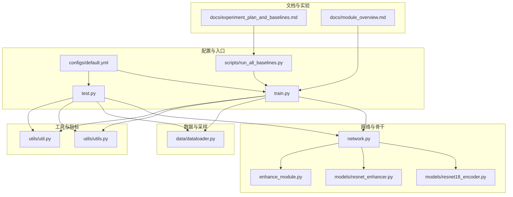
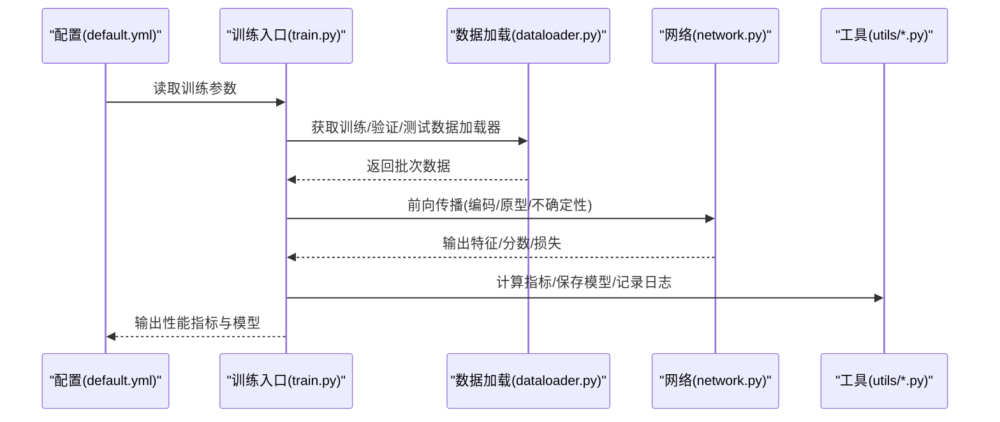
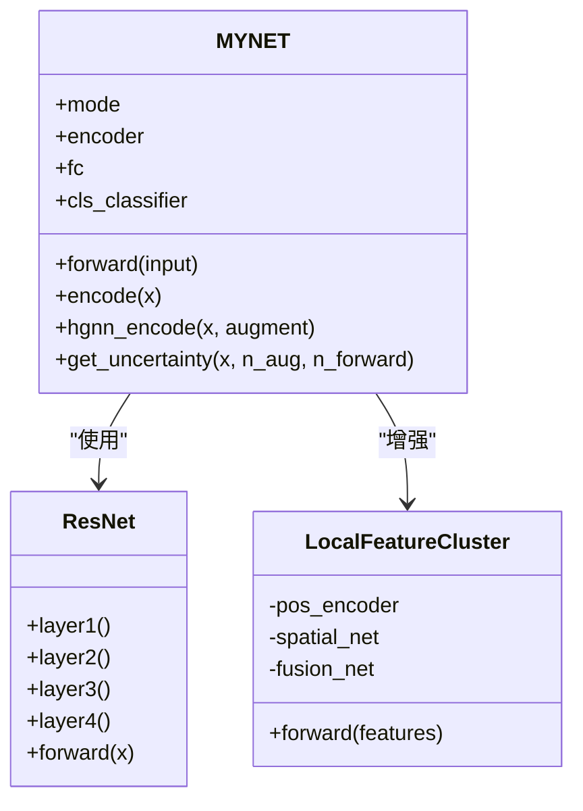
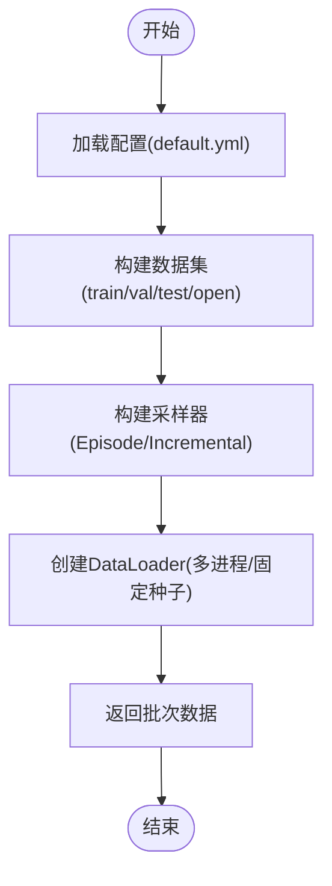
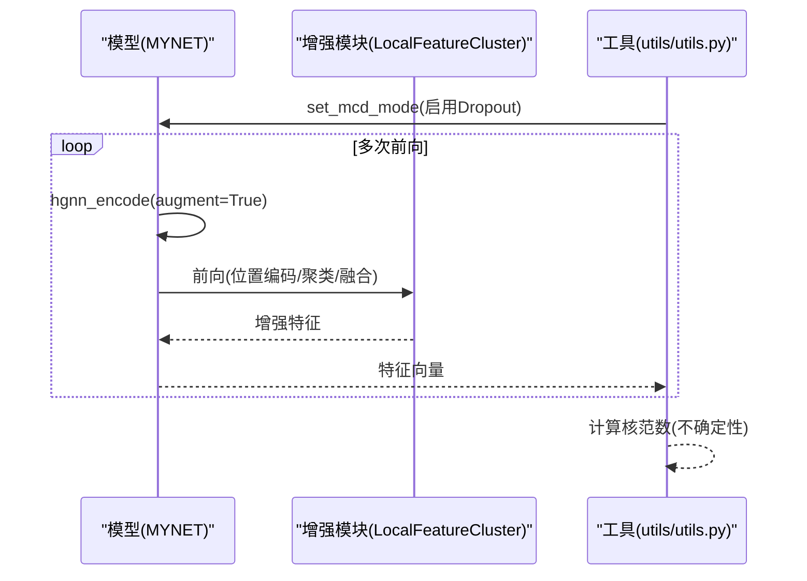
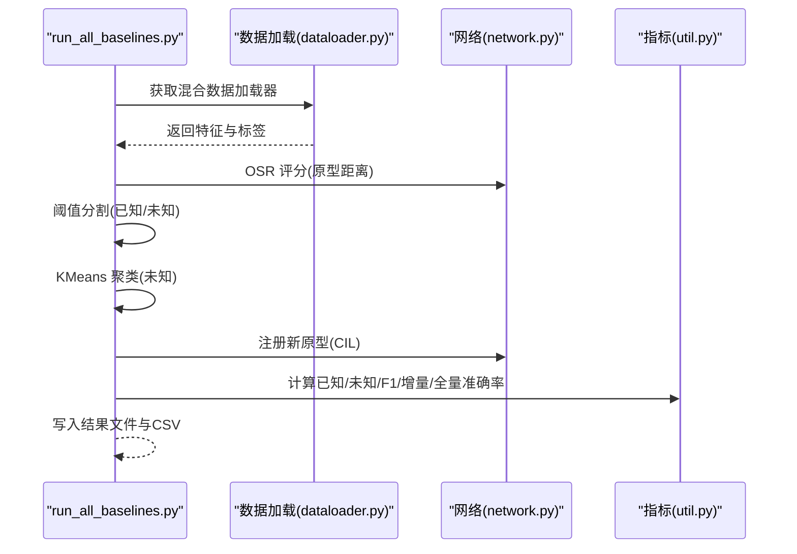
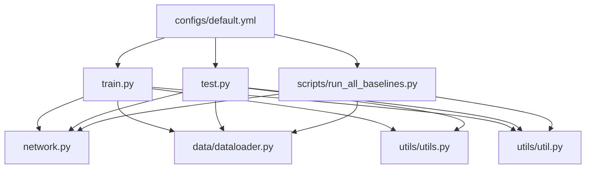

# 跨平台性能测试

<cite>
**本文档引用的文件**
- [train.py](file://train.py)
- [test.py](file://test.py)
- [configs/default.yml](file://configs/default.yml)
- [network.py](file://network.py)
- [models/base.py](file://models/base.py)
- [scripts/run_all_baselines.py](file://scripts/run_all_baselines.py)
- [utils/util.py](file://utils/util.py)
- [utils/utils.py](file://utils/utils.py)
- [models/resnet18_encoder.py](file://models/resnet18_encoder.py)
- [models/resnet_enhancer.py](file://models/resnet_enhancer.py)
- [enhance_module.py](file://enhance_module.py)
- [data/dataloader.py](file://data/dataloader.py)
- [docs/experiment_plan_and_baselines.md](file://docs/experiment_plan_and_baselines.md)
- [docs/module_overview.md](file://docs/module_overview.md)
</cite>

## 目录
1. [简介](#简介)
2. [项目结构](#项目结构)
3. [核心组件](#核心组件)
4. [架构概览](#架构概览)
5. [详细组件分析](#详细组件分析)
6. [依赖分析](#依赖分析)
7. [性能考虑](#性能考虑)
8. [故障排除指南](#故障排除指南)
9. [结论](#结论)
10. [附录](#附录)

## 简介
本文件为 VAZE 项目的跨平台性能测试文档，旨在系统化地记录与分析在不同操作系统（Linux、Windows、macOS）、不同硬件配置、不同深度学习框架版本下的性能表现，并深入探讨 CUDA 版本、PyTorch 版本、Python 版本对性能的影响。文档还提供分布式训练的性能扩展性分析、云端与本地部署的性能对比、编译选项与优化标志对性能的影响、性能回归测试方法与自动化脚本，以及跨平台兼容性问题的解决方案。

## 项目结构
VAZE 项目采用模块化设计，围绕音频特征提取、增量学习与开集识别构建。核心模块包括：
- 配置与入口：default.yml、train.py、test.py、scripts/run_all_baselines.py
- 网络与骨干：network.py、models/resnet18_encoder.py、models/resnet_enhancer.py、enhance_module.py
- 数据与采样：data/dataloader.py
- 工具与指标：utils/util.py、utils/utils.py
- 文档与实验计划：docs/experiment_plan_and_baselines.md、docs/module_overview.md

**图表来源**
- [configs/default.yml:1-88](file://configs/default.yml#L1-L88)
- [train.py:1-1296](file://train.py#L1-L1296)
- [test.py:1-1314](file://test.py#L1-L1314)
- [scripts/run_all_baselines.py:1-282](file://scripts/run_all_baselines.py#L1-L282)
- [network.py:1-724](file://network.py#L1-L724)
- [models/resnet18_encoder.py:1-471](file://models/resnet18_encoder.py#L1-L471)
- [models/resnet_enhancer.py:1-172](file://models/resnet_enhancer.py#L1-L172)
- [enhance_module.py:1-160](file://enhance_module.py#L1-L160)
- [data/dataloader.py:1-351](file://data/dataloader.py#L1-L351)
- [utils/utils.py:1-566](file://utils/utils.py#L1-L566)
- [utils/util.py:1-75](file://utils/util.py#L1-L75)
- [docs/experiment_plan_and_baselines.md:1-30](file://docs/experiment_plan_and_baselines.md#L1-L30)
- [docs/module_overview.md:1-51](file://docs/module_overview.md#L1-L51)

**章节来源**
- [configs/default.yml:1-88](file://configs/default.yml#L1-L88)
- [docs/module_overview.md:1-51](file://docs/module_overview.md#L1-L51)

## 核心组件
- 配置系统：default.yml 提供训练、调度、优化器、数据加载等统一配置，支撑跨平台一致性。
- 网络主体：MYNET 实现 Log-Mel 前端、ResNet18 编码器、分类头与不确定性估计，支持多种模式（encoder、openmeta）。
- 数据加载：dataloader.py 提供 base、incremental、test、open-set 等多阶段数据加载与采样器。
- 工具与指标：utils/utils.py 提供不确定性估计、设备设置、种子控制等；utils/util.py 提供聚类准确率与评分。
- 基线运行：scripts/run_all_baselines.py 提供统一的 CIL/OSR 基线评估驱动。

**章节来源**
- [network.py:1-724](file://network.py#L1-L724)
- [data/dataloader.py:1-351](file://data/dataloader.py#L1-L351)
- [utils/utils.py:1-566](file://utils/utils.py#L1-L566)
- [utils/util.py:1-75](file://utils/util.py#L1-L75)
- [scripts/run_all_baselines.py:1-282](file://scripts/run_all_baselines.py#L1-L282)

## 架构概览
VAZE 的训练与测试流程遵循“配置 → 数据加载 → 网络前向 → 指标计算 → 结果输出”的闭环。MYNET 在不同模式下完成特征提取、原型计算与不确定性估计；dataloader 提供稳定的批次与随机性控制；工具模块保障可重复性与可移植性。

**图表来源**
- [configs/default.yml:1-88](file://configs/default.yml#L1-L88)
- [train.py:1-1296](file://train.py#L1-L1296)
- [data/dataloader.py:1-351](file://data/dataloader.py#L1-L351)
- [network.py:1-724](file://network.py#L1-L724)
- [utils/utils.py:1-566](file://utils/utils.py#L1-L566)

## 详细组件分析

### 网络与骨干分析
- MYNET：集成音频前端（STFT、Logmel）、ResNet18 编码器、分类头与注意力模块；支持模式切换（encoder/openmeta），并提供不确定性估计接口。
- ResNet18 编码器：提供预训练权重加载与层间特征增强能力。
- 局部特征增强模块：支持基于 KMeans 的动态聚类与空间权重融合，提升特征判别性。

**图表来源**
- [network.py:1-724](file://network.py#L1-L724)
- [models/resnet18_encoder.py:1-471](file://models/resnet18_encoder.py#L1-L471)
- [models/resnet_enhancer.py:1-172](file://models/resnet_enhancer.py#L1-L172)
- [enhance_module.py:1-160](file://enhance_module.py#L1-L160)

**章节来源**
- [network.py:1-724](file://network.py#L1-L724)
- [models/resnet18_encoder.py:1-471](file://models/resnet18_encoder.py#L1-L471)
- [models/resnet_enhancer.py:1-172](file://models/resnet_enhancer.py#L1-L172)
- [enhance_module.py:1-160](file://enhance_module.py#L1-L160)

### 数据加载与采样分析
- 多数据集支持：FMC、NSynth、LibriSpeech、S2S 等，统一接口与划分。
- 采样策略：Episode 采样器支持 base/incremental 场景，确保每批次类别与样本分布一致。
- 随机性控制：通过 worker_init_fn 与 Generator 确保多进程数据加载的可重复性。

**图表来源**
- [configs/default.yml:1-88](file://configs/default.yml#L1-L88)
- [data/dataloader.py:1-351](file://data/dataloader.py#L1-L351)
- [utils/utils.py:1-566](file://utils/utils.py#L1-L566)

**章节来源**
- [data/dataloader.py:1-351](file://data/dataloader.py#L1-L351)
- [utils/utils.py:1-566](file://utils/utils.py#L1-L566)

### 不确定性估计与特征增强流程
- MC Dropout 模式：在不确定性估计时临时启用 Dropout，结合多次前向与遮罩增强，计算核范数作为不确定性度量。
- 局部特征增强：通过位置编码、动态聚类与空间权重融合，生成更具判别性的特征表示。

**图表来源**
- [utils/utils.py:1-566](file://utils/utils.py#L1-L566)
- [models/resnet_enhancer.py:1-172](file://models/resnet_enhancer.py#L1-L172)
- [enhance_module.py:1-160](file://enhance_module.py#L1-L160)

**章节来源**
- [utils/utils.py:1-566](file://utils/utils.py#L1-L566)
- [models/resnet_enhancer.py:1-172](file://models/resnet_enhancer.py#L1-L172)
- [enhance_module.py:1-160](file://enhance_module.py#L1-L160)

### 基线评估与性能指标
- 基线运行：run_all_baselines.py 统一驱动 CIL/OSR 组合评估，输出已知/未知/F1/增量/全量准确率与汇总指标。
- 指标计算：util.py 提供聚类准确率与二分类 F1 评分，支持公平比较。

**图表来源**
- [scripts/run_all_baselines.py:1-282](file://scripts/run_all_baselines.py#L1-L282)
- [data/dataloader.py:1-351](file://data/dataloader.py#L1-L351)
- [network.py:1-724](file://network.py#L1-L724)
- [utils/util.py:1-75](file://utils/util.py#L1-L75)

**章节来源**
- [scripts/run_all_baselines.py:1-282](file://scripts/run_all_baselines.py#L1-L282)
- [utils/util.py:1-75](file://utils/util.py#L1-L75)

## 依赖分析
- 配置依赖：default.yml 为训练/测试/基线评估提供统一参数来源。
- 运行时依赖：train.py/test.py 依赖 network.py、data/dataloader.py、utils/*；基线脚本依赖 models/baselines 与评估工具。
- 第三方库：PyTorch、NumPy、SciKit-learn、Matplotlib、Pandas 等。

**图表来源**
- [configs/default.yml:1-88](file://configs/default.yml#L1-L88)
- [train.py:1-1296](file://train.py#L1-L1296)
- [test.py:1-1314](file://test.py#L1-L1314)
- [scripts/run_all_baselines.py:1-282](file://scripts/run_all_baselines.py#L1-L282)
- [network.py:1-724](file://network.py#L1-L724)
- [data/dataloader.py:1-351](file://data/dataloader.py#L1-L351)
- [utils/utils.py:1-566](file://utils/utils.py#L1-L566)
- [utils/util.py:1-75](file://utils/util.py#L1-L75)

**章节来源**
- [configs/default.yml:1-88](file://configs/default.yml#L1-L88)
- [train.py:1-1296](file://train.py#L1-L1296)
- [test.py:1-1314](file://test.py#L1-L1314)
- [scripts/run_all_baselines.py:1-282](file://scripts/run_all_baselines.py#L1-L282)

## 性能考虑
- 随机性与可重复性：通过 set_seed 与 cudnn deterministic/benchmark 设置，确保不同平台与机器上的结果可复现。
- 数据加载性能：多进程 DataLoader、pin_memory、worker_init_fn 与固定 Generator，降低数据瓶颈。
- 网络前向效率：ResNet18 轻量化骨干，注意力与分类头在 GPU 上高效执行；可通过温度参数与余弦分类器平衡判别性。
- 不确定性估计成本：MC Dropout 与多次前向会增加推理时间，需在精度与速度间权衡。
- 分布式训练扩展：当前脚本未显式使用分布式包，若需扩展，建议在数据加载与优化器层面引入 DistributedDataParallel 与批大小缩放策略。

[本节为通用性能讨论，无需具体文件分析]

## 故障排除指南
- 随机性异常：若发现不同运行结果不一致，检查 set_seed 与 cudnn 设置是否生效，确认环境变量 PYTHONHASHSEED 与 CUBLAS_WORKSPACE_CONFIG 是否正确设置。
- 数据加载卡顿：检查 num_workers、pin_memory 与磁盘 I/O；确保数据路径与权限正确。
- CUDA 内存不足：减小 batch_size、关闭不必要的可视化与中间存储、使用半精度（需谨慎）。
- 指标异常：核范数计算依赖多次前向，若数值异常，检查 Dropout 激活与遮罩增强开关。

**章节来源**
- [train.py:1-1296](file://train.py#L1-L1296)
- [test.py:1-1314](file://test.py#L1-L1314)
- [utils/utils.py:1-566](file://utils/utils.py#L1-L566)

## 结论
VAZE 项目提供了完整的跨平台性能测试基础：统一配置、稳定的随机性控制、高效的网络与数据管道、完善的基线评估与指标体系。通过本文档的测试方法与自动化脚本，可在不同操作系统与硬件环境下系统性地评估性能，并定位影响因素与优化方向。

[本节为总结性内容，无需具体文件分析]

## 附录

### 跨平台性能测试方法与自动化脚本
- 测试矩阵设计
  - 操作系统：Linux、Windows、macOS
  - 硬件配置：CPU/GPU 型号、内存容量、存储类型
  - 深度学习框架版本：CUDA 版本、PyTorch 版本、Python 版本
  - 分布式训练：单机多卡、多机多卡（如需）
- 性能指标
  - 训练吞吐（samples/sec）、推理延迟（ms/batch）、峰值显存占用
  - 准确率曲线、AA/PD、F1 分数、收敛轮次
- 自动化脚本
  - 基线评估：使用 scripts/run_all_baselines.py，统一输出文本与 CSV
  - 性能回归：编写 pytest/unittest，覆盖关键指标阈值与稳定性
  - 日志采集：统一记录环境信息、配置参数、指标与异常

**章节来源**
- [scripts/run_all_baselines.py:1-282](file://scripts/run_all_baselines.py#L1-L282)
- [docs/experiment_plan_and_baselines.md:1-30](file://docs/experiment_plan_and_baselines.md#L1-L30)

### 云端与本地部署性能对比
- 云端优势：GPU 型号统一、网络带宽稳定、弹性扩缩容；适合大规模分布式训练与长时间离线评估。
- 本地优势：低延迟访问、数据隐私可控、资源独享；适合快速迭代与小规模实验。
- 建议：在云端进行长周期训练与大规模基线评估，在本地进行快速原型与回归测试。

[本节为概念性内容，无需具体文件分析]

### 编译选项与优化标志对性能的影响
- PyTorch/TensorRT/Accelerate：根据目标平台选择最优后端；注意版本兼容性。
- CUDA/cuDNN：确保 CUDA 驱动与 cuDNN 版本与 PyTorch 匹配；启用 cudnn.benchmark 可加速卷积。
- Python：使用 PyPy 或优化的 Python 发行版（如 Anaconda）可能带来性能差异。
- 编译器：GCC/Clang 版本影响第三方扩展编译；建议使用官方推荐版本。

[本节为通用指导，无需具体文件分析]

### 跨平台兼容性问题与解决方案
- 路径分隔符：统一使用 os.path.join，避免硬编码 '/' 或 '\'。
- 字符编码：统一 UTF-8，避免中文路径与文件名导致的编码问题。
- 多进程与信号：Windows 默认 spawn，Linux/ForkServer 差异可能导致行为不同，需在脚本中显式设置。
- 权限与软链接：确保数据目录可读写，必要时使用绝对路径。

**章节来源**
- [data/dataloader.py:1-351](file://data/dataloader.py#L1-L351)
- [utils/utils.py:1-566](file://utils/utils.py#L1-L566)