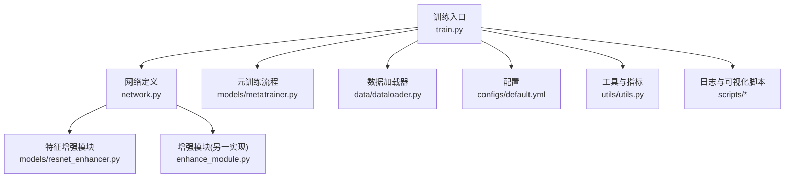
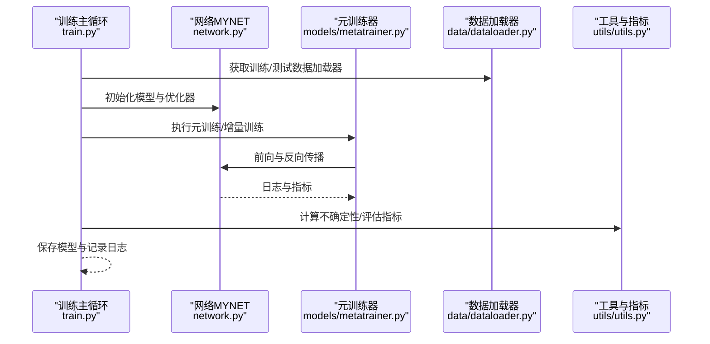
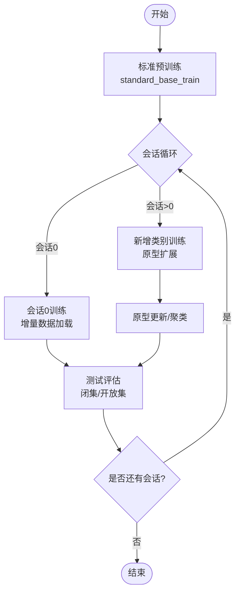
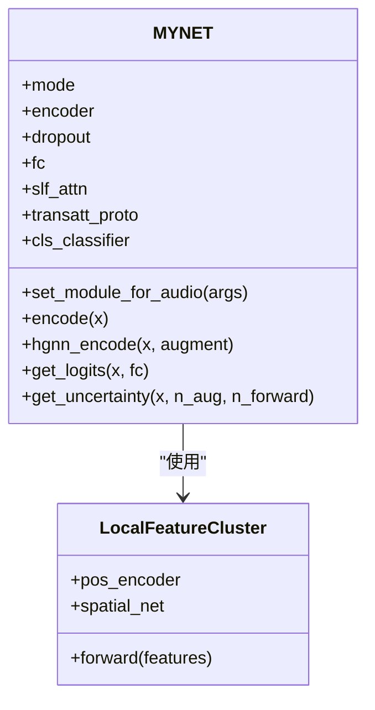
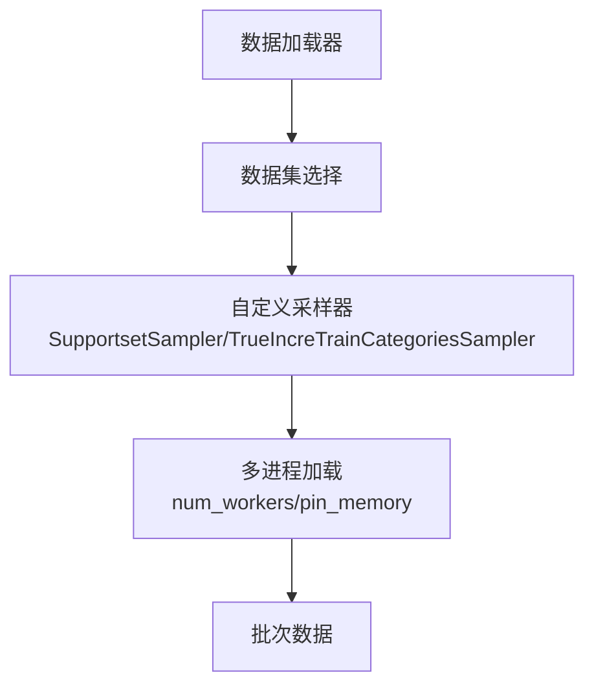
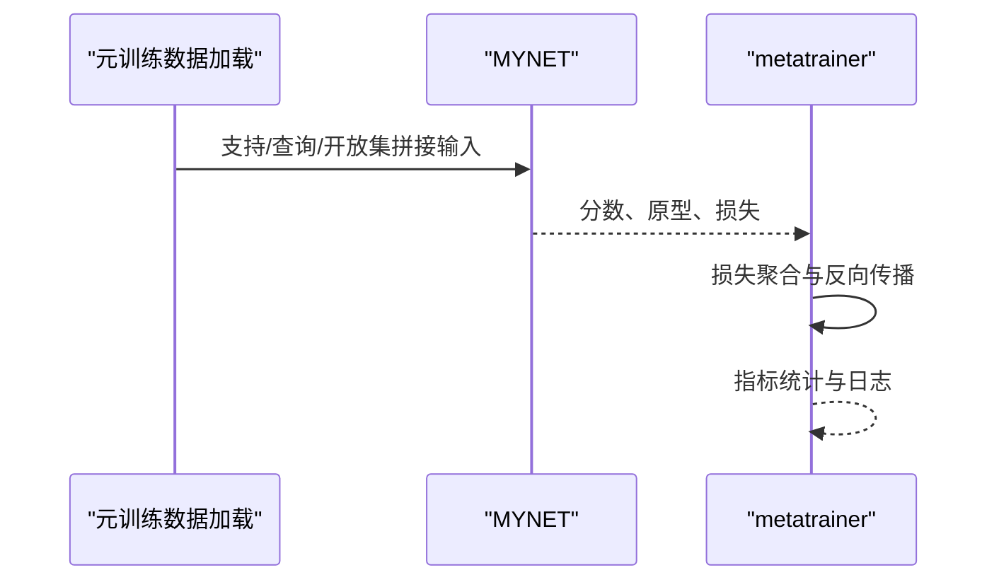
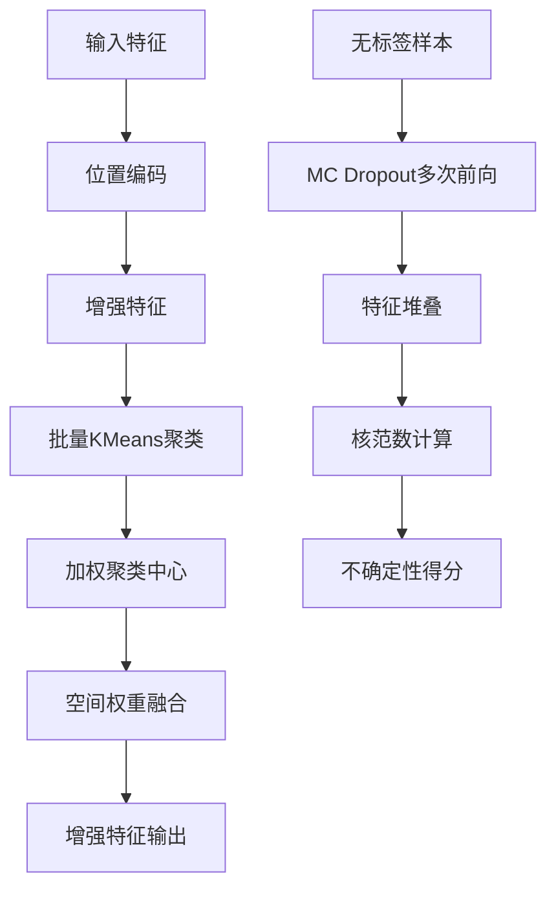
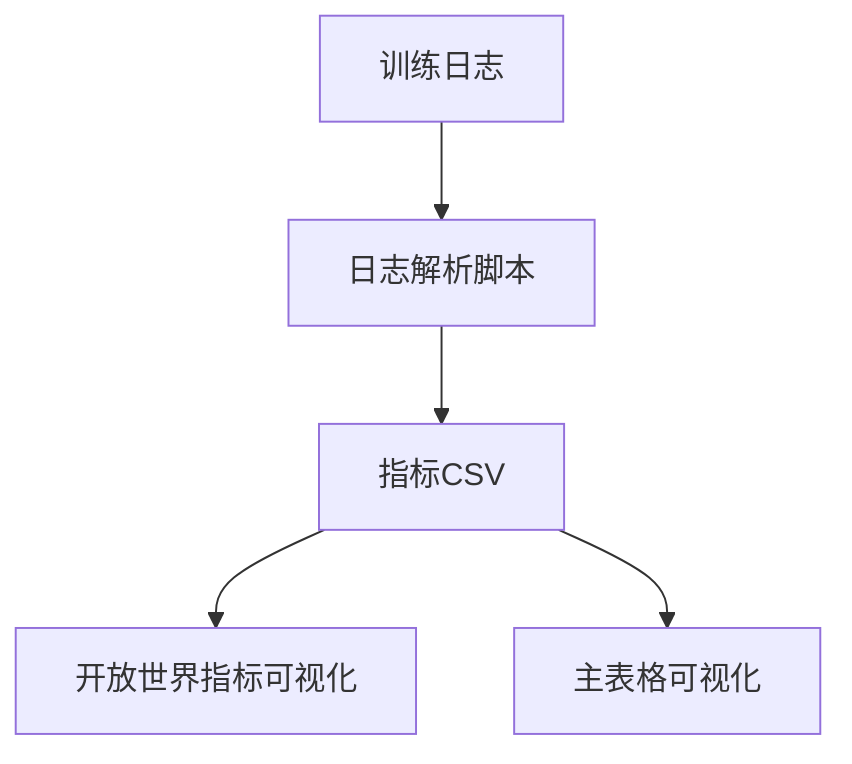
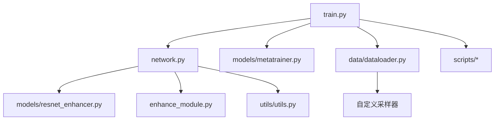

# 性能调优和优化

<cite>
**本文引用的文件**   
- [train.py](file://train.py)
- [network.py](file://network.py)
- [configs/default.yml](file://configs/default.yml)
- [models/metatrainer.py](file://models/metatrainer.py)
- [data/dataloader.py](file://data/dataloader.py)
- [models/resnet_enhancer.py](file://models/resnet_enhancer.py)
- [utils/util.py](file://utils/util.py)
- [utils/utils.py](file://utils/utils.py)
- [enhance_module.py](file://enhance_module.py)
- [scripts/collect_metrics_from_logs.py](file://scripts/collect_metrics_from_logs.py)
- [scripts/plot_openworld_results.py](file://scripts/plot_openworld_results.py)
- [scripts/viz_main_table.py](file://scripts/viz_main_table.py)
- [train_unopenset.py](file://train_unopenset.py)
- [test_uncertainty.py](file://test_uncertainty.py)
</cite>

## 目录
1. [简介](#简介)
2. [项目结构](#项目结构)
3. [核心组件](#核心组件)
4. [架构总览](#架构总览)
5. [详细组件分析](#详细组件分析)
6. [依赖分析](#依赖分析)
7. [性能考虑](#性能考虑)
8. [故障排查指南](#故障排查指南)
9. [结论](#结论)
10. [附录](#附录)

## 简介
本指南面向VAZE项目的性能调优与优化，聚焦训练过程中的性能瓶颈识别与系统性优化策略，覆盖内存使用优化、计算效率提升、并行化改进、不同硬件平台（GPU/CPU）的调优方法、性能监控与分析、超参数与学习率调度、批量大小优化，以及模型压缩、量化与蒸馏的实践建议。文档结合仓库现有实现，给出可操作的优化路径与可视化分析方法。

## 项目结构
- 训练入口与主流程：train.py
- 网络与模块：network.py、models/resnet_enhancer.py、enhance_module.py
- 数据加载与采样：data/dataloader.py
- 配置：configs/default.yml
- 元训练与评估：models/metatrainer.py
- 工具与指标：utils/util.py、utils/utils.py
- 结果收集与可视化：scripts/collect_metrics_from_logs.py、scripts/plot_openworld_results.py、scripts/viz_main_table.py
- 不确定性估计与课程学习：train_unopenset.py、test_uncertainty.py

**图表来源**
- [train.py:1-1296](file://train.py#L1-L1296)
- [network.py:1-724](file://network.py#L1-L724)
- [models/metatrainer.py:1-201](file://models/metatrainer.py#L1-L201)
- [data/dataloader.py:1-351](file://data/dataloader.py#L1-L351)
- [models/resnet_enhancer.py:1-172](file://models/resnet_enhancer.py#L1-L172)
- [enhance_module.py:1-160](file://enhance_module.py#L1-L160)
- [configs/default.yml:1-88](file://configs/default.yml#L1-L88)
- [utils/utils.py:1-566](file://utils/utils.py#L1-L566)
- [scripts/collect_metrics_from_logs.py:1-67](file://scripts/collect_metrics_from_logs.py#L1-L67)
- [scripts/plot_openworld_results.py:104-127](file://scripts/plot_openworld_results.py#L104-L127)
- [scripts/viz_main_table.py:46-82](file://scripts/viz_main_table.py#L46-L82)

**章节来源**
- [train.py:1-1296](file://train.py#L1-L1296)
- [network.py:1-724](file://network.py#L1-L724)
- [models/metatrainer.py:1-201](file://models/metatrainer.py#L1-L201)
- [data/dataloader.py:1-351](file://data/dataloader.py#L1-L351)
- [models/resnet_enhancer.py:1-172](file://models/resnet_enhancer.py#L1-L172)
- [enhance_module.py:1-160](file://enhance_module.py#L1-L160)
- [configs/default.yml:1-88](file://configs/default.yml#L1-L88)
- [utils/utils.py:1-566](file://utils/utils.py#L1-L566)
- [scripts/collect_metrics_from_logs.py:1-67](file://scripts/collect_metrics_from_logs.py#L1-L67)
- [scripts/plot_openworld_results.py:104-127](file://scripts/plot_openworld_results.py#L104-L127)
- [scripts/viz_main_table.py:46-82](file://scripts/viz_main_table.py#L46-L82)

## 核心组件
- 训练主循环与会话增量训练：负责标准预训练、增量会话训练、测试评估与原型更新。
- 网络MYNET：包含编码器、分类头、注意力模块、音频特征提取与增强模块。
- 数据加载器：支持多种数据集与采样策略，支持多进程与内存固定。
- 元训练器：封装元训练流程，包含损失、评估与学习率调度。
- 特征增强模块：局部聚类与空间感知增强，支持动态融合与权重计算。
- 不确定性估计：基于MC Dropout与特征掩码的不确定性度量。
- 性能监控与可视化：日志解析、指标汇总与可视化图表生成。

**章节来源**
- [train.py:799-1296](file://train.py#L799-L1296)
- [network.py:18-518](file://network.py#L18-L518)
- [models/metatrainer.py:17-178](file://models/metatrainer.py#L17-L178)
- [data/dataloader.py:19-254](file://data/dataloader.py#L19-L254)
- [models/resnet_enhancer.py:51-172](file://models/resnet_enhancer.py#L51-L172)
- [utils/utils.py:23-60](file://utils/utils.py#L23-L60)
- [scripts/collect_metrics_from_logs.py:1-67](file://scripts/collect_metrics_from_logs.py#L1-L67)

## 架构总览
VAZE采用“音频特征提取 → 编码器 → 分类头/原型 → 元训练/增量训练”的流水线。训练主循环驱动标准预训练与增量会话，数据加载器提供支持/查询与开放集样本，网络模块提供特征增强与不确定性估计能力，工具链负责性能监控与可视化。

**图表来源**
- [train.py:799-1296](file://train.py#L799-L1296)
- [network.py:18-518](file://network.py#L18-L518)
- [models/metatrainer.py:17-178](file://models/metatrainer.py#L17-L178)
- [data/dataloader.py:19-254](file://data/dataloader.py#L19-L254)
- [utils/utils.py:23-60](file://utils/utils.py#L23-L60)

## 详细组件分析

### 训练主循环与增量训练
- 标准预训练：固定编码器模式，执行交叉熵分类训练，支持早停与最佳模型保存。
- 增量会话训练：逐会话扩展类别，原型更新与分类头扩展，支持温度缩放与cosine相似度。
- 测试评估：支持闭集准确率与开放集AUROC等指标。
- 原型更新：基于聚类或均值更新，支持动量与阈值控制。

**图表来源**
- [network.py:610-637](file://network.py#L610-L637)
- [train.py:763-780](file://train.py#L763-L780)
- [train.py:212-227](file://train.py#L212-L227)

**章节来源**
- [train.py:763-780](file://train.py#L763-L780)
- [network.py:610-637](file://network.py#L610-L637)
- [train.py:212-227](file://train.py#L212-L227)

### 网络MYNET与音频特征提取
- 音频特征提取：STFT与Logmel提取，SpecAugment与时频遮挡，BN归一化。
- 编码器：ResNet18骨干，支持dropout（MC Dropout用于不确定性估计）。
- 分类头：支持dot/cosine分类与温度缩放。
- 注意力模块：多头注意力用于原型与特征融合。
- 增强模块：空间位置编码、局部聚类与动态融合。

**图表来源**
- [network.py:18-518](file://network.py#L18-L518)
- [models/resnet_enhancer.py:51-172](file://models/resnet_enhancer.py#L51-L172)

**章节来源**
- [network.py:18-518](file://network.py#L18-L518)
- [models/resnet_enhancer.py:51-172](file://models/resnet_enhancer.py#L51-L172)

### 数据加载器与并行化
- 多数据集适配：FMC、NSynth、LibriSpeech、S2S等。
- 自定义采样器：支持支持集/查询集与开放集采样。
- 多进程与内存固定：num_workers与pin_memory提升I/O吞吐。
- 课程学习数据子集：按难度排序选择简单类别优先训练。

**图表来源**
- [data/dataloader.py:19-254](file://data/dataloader.py#L19-L254)

**章节来源**
- [data/dataloader.py:19-254](file://data/dataloader.py#L19-L254)

### 元训练与评估
- 元训练：合并支持/查询/开放集样本，计算分类损失与Hinge损失，支持Plateau/LR调度。
- 评估：AUROC、Acc等指标，支持可视化与日志记录。

**图表来源**
- [models/metatrainer.py:17-178](file://models/metatrainer.py#L17-L178)

**章节来源**
- [models/metatrainer.py:17-178](file://models/metatrainer.py#L17-L178)

### 特征增强与不确定性估计
- 局部聚类增强：对空间特征进行KMeans聚类，构建加权中心，动态融合全局与局部特征。
- 不确定性估计：MC Dropout + 特征掩码，多次前向得到特征集合，计算核范数作为不确定性度量。

**图表来源**
- [models/resnet_enhancer.py:73-160](file://models/resnet_enhancer.py#L73-L160)
- [utils/utils.py:23-60](file://utils/utils.py#L23-L60)

**章节来源**
- [models/resnet_enhancer.py:73-160](file://models/resnet_enhancer.py#L73-L160)
- [utils/utils.py:23-60](file://utils/utils.py#L23-L60)
- [train_unopenset.py:98-121](file://train_unopenset.py#L98-L121)
- [test_uncertainty.py:62-85](file://test_uncertainty.py#L62-L85)

### 性能监控与可视化
- 日志解析：从训练日志提取关键指标（会话0准确率、增量准确率、PD等）。
- 指标汇总：CSV输出，便于后续可视化。
- 图表生成：折线图、柱状图展示方法对比与会话趋势。

**图表来源**
- [scripts/collect_metrics_from_logs.py:1-67](file://scripts/collect_metrics_from_logs.py#L1-L67)
- [scripts/plot_openworld_results.py:104-127](file://scripts/plot_openworld_results.py#L104-L127)
- [scripts/viz_main_table.py:46-82](file://scripts/viz_main_table.py#L46-L82)

**章节来源**
- [scripts/collect_metrics_from_logs.py:1-67](file://scripts/collect_metrics_from_logs.py#L1-L67)
- [scripts/plot_openworld_results.py:104-127](file://scripts/plot_openworld_results.py#L104-L127)
- [scripts/viz_main_table.py:46-82](file://scripts/viz_main_table.py#L46-L82)

## 依赖分析
- 训练主循环依赖网络、元训练器与数据加载器。
- 网络模块依赖增强模块与工具函数。
- 数据加载器依赖自定义采样器与数据集实现。
- 性能监控依赖日志解析与可视化脚本。

**图表来源**
- [train.py:1-1296](file://train.py#L1-L1296)
- [network.py:1-724](file://network.py#L1-L724)
- [models/metatrainer.py:1-201](file://models/metatrainer.py#L1-L201)
- [data/dataloader.py:1-351](file://data/dataloader.py#L1-L351)
- [models/resnet_enhancer.py:1-172](file://models/resnet_enhancer.py#L1-L172)
- [enhance_module.py:1-160](file://enhance_module.py#L1-L160)
- [utils/utils.py:1-566](file://utils/utils.py#L1-L566)

**章节来源**
- [train.py:1-1296](file://train.py#L1-L1296)
- [network.py:1-724](file://network.py#L1-L724)
- [models/metatrainer.py:1-201](file://models/metatrainer.py#L1-L201)
- [data/dataloader.py:1-351](file://data/dataloader.py#L1-L351)
- [models/resnet_enhancer.py:1-172](file://models/resnet_enhancer.py#L1-L172)
- [enhance_module.py:1-160](file://enhance_module.py#L1-L160)
- [utils/utils.py:1-566](file://utils/utils.py#L1-L566)

## 性能考虑
- 内存优化
  - 数据加载：启用pin_memory与合理num_workers，减少CPU到GPU拷贝阻塞。
  - 设备一致性：增强模块在forward中确保参数与输入在同一设备，避免频繁迁移。
  - 掩码与CPU-GPU交互：批量KMeans在CPU侧进行，减少GPU碎片化。
  - 早停与最佳模型保存：标准预训练中记录最高准确率模型，避免无效训练。

- 计算效率
  - 注意力与相似度计算：softmax与矩阵乘在大尺度特征上开销较高，注意批大小与温度缩放。
  - MC Dropout：多次前向计算带来额外开销，建议在评估或特定阶段启用。
  - cosine相似度与温度缩放：减少显存峰值，提高数值稳定性。

- 并行化
  - 多进程数据加载：num_workers与pin_memory配合，提升吞吐。
  - 课程学习：先训练简单类别，降低后续训练难度，缩短收敛时间。

- 硬件平台调优
  - GPU：启用确定性算法与合适的cudnn设置，避免benchmark导致的不稳定。
  - CPU：批量KMeans在CPU侧执行，减少GPU占用；合理设置workers与batch size。

- 超参数与学习率调度
  - 学习率：支持Step/MultiStep/Plateau等多种调度策略，结合任务难度动态调整。
  - 温度缩放：对cosine分类进行温度缩放，改善概率分布。
  - 批量大小：根据显存与吞吐平衡，过大导致显存不足，过小影响收敛稳定性。

- 模型压缩、量化与蒸馏
  - 压缩：通过原型聚类与动态融合减少冗余特征表达。
  - 量化：可在推理阶段对分类头或特征表示进行低比特化（需评估精度）。
  - 蒸馏：使用教师模型（预训练模型）指导学生模型（增量模型）学习，缓解灾难性遗忘。

[本节为通用性能指导，无需具体文件引用]

## 故障排查指南
- 随机种子与确定性
  - 设置随机种子与cudnn确定性，避免实验不可复现。
  - 代码中包含随机性检查函数，可用于验证种子设置效果。

- 设备一致性问题
  - 增强模块在forward中确保参数与输入在同一设备，避免Runtime错误。
  - 网络模块中对子模块进行设备迁移，确保子模块与主模块一致。

- 数据加载异常
  - 检查num_workers与pin_memory设置，避免死锁或内存不足。
  - 自定义采样器参数与数据集标签对齐，避免索引越界。

- 不确定性估计异常
  - 确保MC Dropout模式开启，多次前向得到稳定的不确定性估计。
  - 若核范数异常，检查特征维度与设备一致性。

**章节来源**
- [train.py:114-141](file://train.py#L114-L141)
- [models/resnet_enhancer.py:168-172](file://models/resnet_enhancer.py#L168-L172)
- [network.py:114-130](file://network.py#L114-L130)
- [utils/utils.py:23-60](file://utils/utils.py#L23-L60)

## 结论
VAZE项目在训练流程、特征增强与不确定性估计方面具备完善的实现基础。通过合理的数据加载并行、设备一致性管理、学习率调度与课程学习策略，可以在不同硬件平台上获得稳定且高效的训练表现。结合日志解析与可视化工具，能够持续监控性能指标并指导进一步优化。建议在生产环境中引入模型压缩与蒸馏策略，以进一步提升推理效率与泛化能力。

[本节为总结性内容，无需具体文件引用]

## 附录
- 关键实现路径参考
  - 训练主循环与增量训练：[train.py:799-1296](file://train.py#L799-L1296)
  - 网络MYNET与音频特征提取：[network.py:18-518](file://network.py#L18-L518)
  - 元训练流程：[models/metatrainer.py:17-178](file://models/metatrainer.py#L17-L178)
  - 数据加载器与采样器：[data/dataloader.py:19-254](file://data/dataloader.py#L19-L254)
  - 局部聚类增强模块：[models/resnet_enhancer.py:51-172](file://models/resnet_enhancer.py#L51-L172)
  - 不确定性估计实现：[utils/utils.py:23-60](file://utils/utils.py#L23-L60)
  - 日志解析与可视化：[scripts/collect_metrics_from_logs.py:1-67](file://scripts/collect_metrics_from_logs.py#L1-L67)、[scripts/plot_openworld_results.py:104-127](file://scripts/plot_openworld_results.py#L104-L127)、[scripts/viz_main_table.py:46-82](file://scripts/viz_main_table.py#L46-L82)

[本节为补充说明，无需具体文件引用]