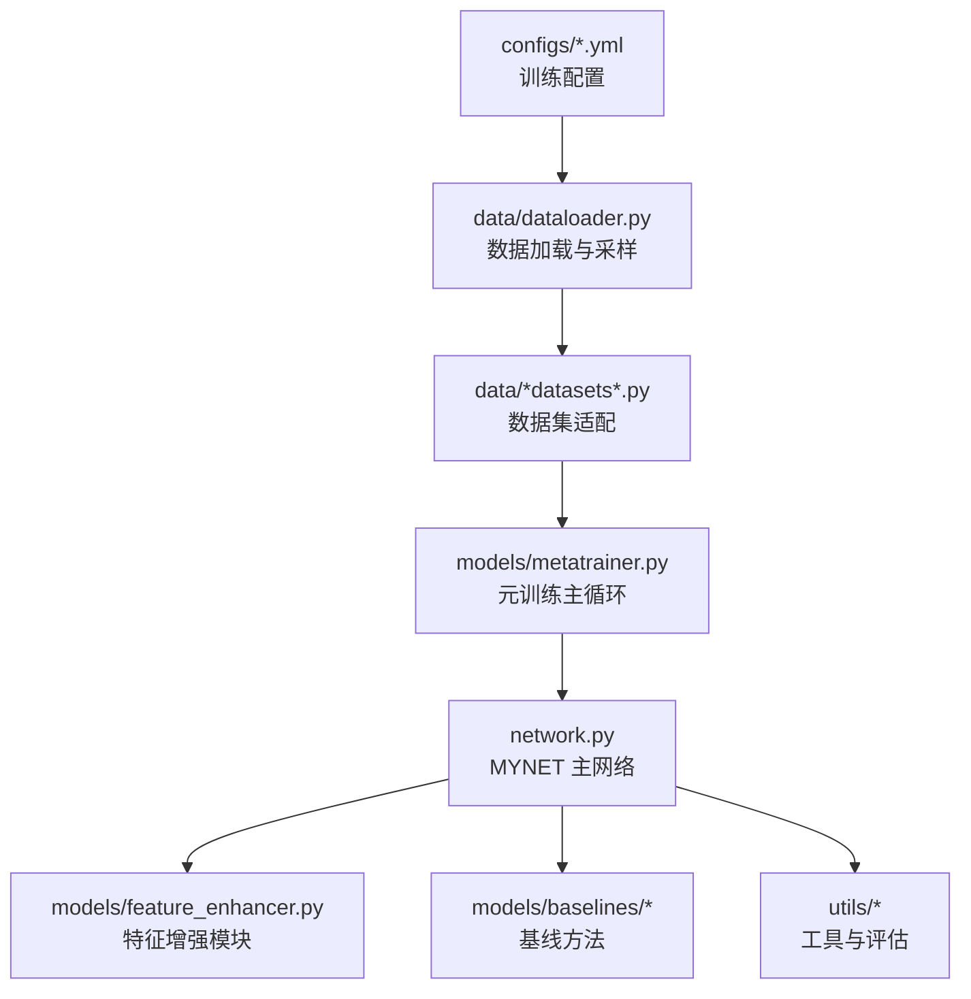
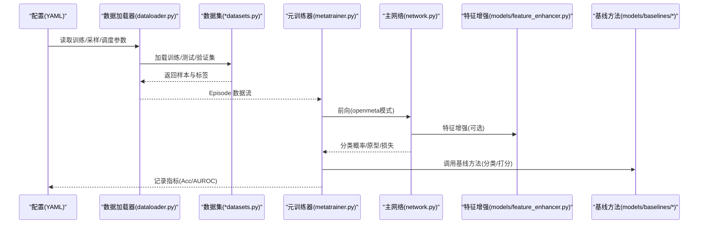
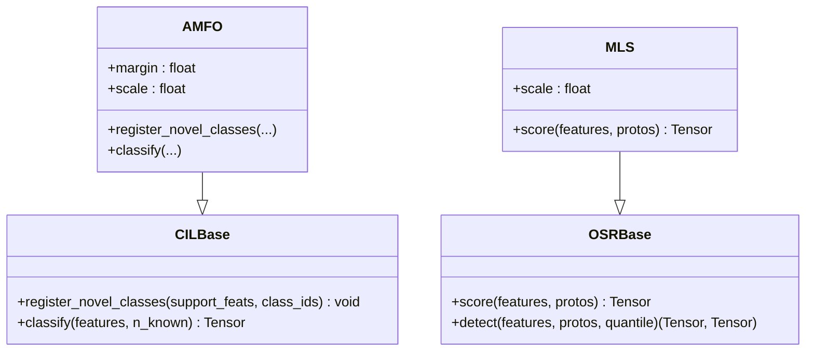
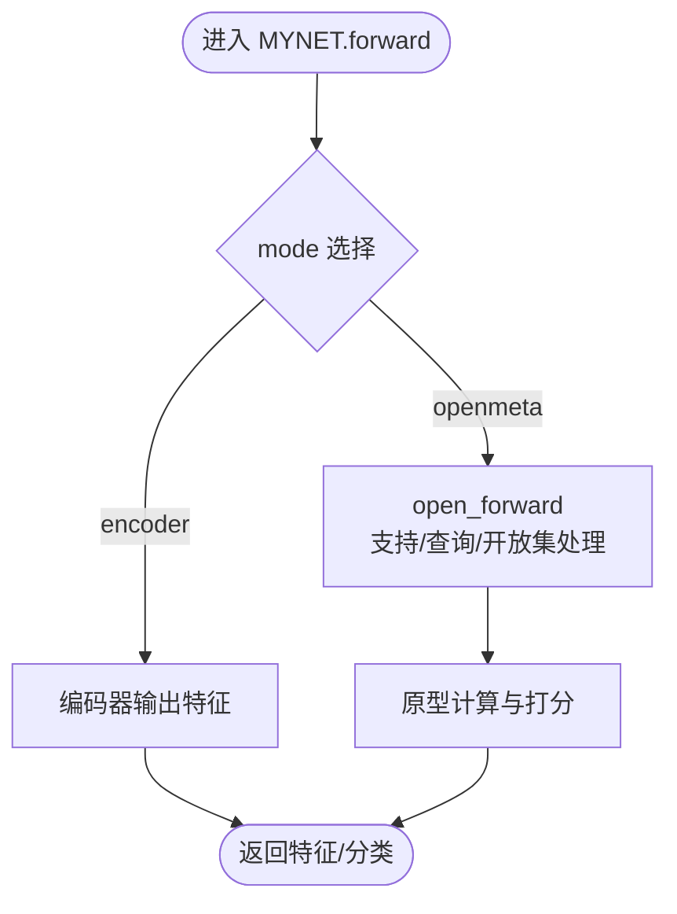
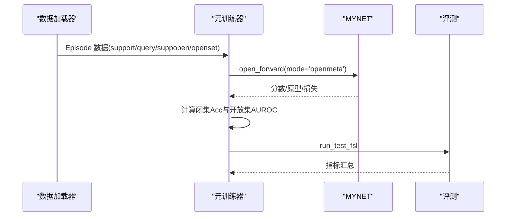
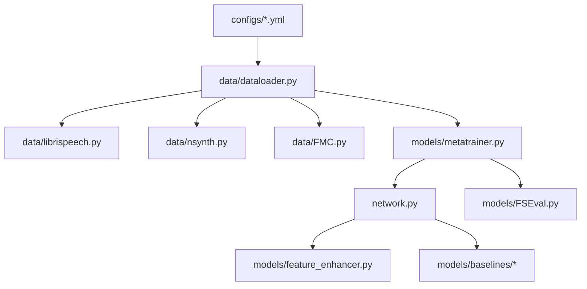

# 扩展和定制

<cite>
**本文引用的文件**   
- [configs/default.yml](file://configs/default.yml)
- [configs/quick_eval.yml](file://configs/quick_eval.yml)
- [models/base.py](file://models/base.py)
- [models/baselines/base.py](file://models/baselines/base.py)
- [models/baselines/cil_methods/amfo.py](file://models/baselines/cil_methods/amfo.py)
- [models/baselines/osr_methods/mls.py](file://models/baselines/osr_methods/mls.py)
- [data/dataloader.py](file://data/dataloader.py)
- [data/librispeech.py](file://data/librispeech.py)
- [network.py](file://network.py)
- [models/feature_enhancer.py](file://models/feature_enhancer.py)
- [models/metatrainer.py](file://models/metatrainer.py)
- [docs/module_overview.md](file://docs/module_overview.md)
- [docs/experiment_plan_and_baselines.md](file://docs/experiment_plan_and_baselines.md)
- [train.py](file://train.py)
</cite>

## 目录
1. [简介](#简介)
2. [项目结构](#项目结构)
3. [核心组件](#核心组件)
4. [架构总览](#架构总览)
5. [详细组件分析](#详细组件分析)
6. [依赖关系分析](#依赖关系分析)
7. [性能考虑](#性能考虑)
8. [故障排查指南](#故障排查指南)
9. [结论](#结论)
10. [附录](#附录)

## 简介
本指南面向希望在 VAZE 项目基础上进行扩展与定制的开发者，覆盖以下主题：
- 如何集成新的算法与方法（基线方法与自定义模型）
- 数据集扩展与适配（新音频数据集接入与预处理）
- 自定义配置项与参数校验机制
- 特征增强模块的扩展与优化
- 性能调优与内存优化建议
- 插件系统使用与最佳实践
- 代码贡献与版本发布流程

## 项目结构
VAZE 采用模块化设计，围绕“配置—数据—模型—训练/评测”主线组织代码。关键目录与职责如下：
- configs：训练配置（YAML），包含训练超参、调度器、优化器、特征提取器等
- data：数据加载与采样，包含 LibriSpeech、NSynth、FMC 等数据集适配
- models：模型与方法实现，含基线方法、特征增强、元训练器等
- utils：通用工具与评估指标
- scripts：实验分析与可视化脚本
- docs：模块说明与实验计划
- save/save_result：中间结果与日志输出目录
- train.py、network.py：训练入口与主干网络

图表来源
- [configs/default.yml:1-88](file://configs/default.yml#L1-L88)
- [data/dataloader.py:1-351](file://data/dataloader.py#L1-L351)
- [models/metatrainer.py:1-200](file://models/metatrainer.py#L1-L200)
- [network.py:1-724](file://network.py#L1-L724)
- [models/feature_enhancer.py:1-93](file://models/feature_enhancer.py#L1-L93)
- [models/baselines/base.py:1-76](file://models/baselines/base.py#L1-L76)

章节来源
- [docs/module_overview.md:1-51](file://docs/module_overview.md#L1-L51)
- [configs/default.yml:1-88](file://configs/default.yml#L1-L88)
- [data/dataloader.py:1-351](file://data/dataloader.py#L1-L351)
- [models/metatrainer.py:1-200](file://models/metatrainer.py#L1-L200)
- [network.py:1-724](file://network.py#L1-L724)
- [models/feature_enhancer.py:1-93](file://models/feature_enhancer.py#L1-L93)
- [models/baselines/base.py:1-76](file://models/baselines/base.py#L1-L76)

## 核心组件
- 配置系统：通过 YAML 文件集中管理训练超参、学习率调度、优化器、特征提取器参数等。新增配置项需在 YAML 中声明并在代码中读取与校验。
- 数据加载与采样：统一的数据接口支持多数据集，Episode 采样策略由 sampler 模块提供，支持增量场景下的支持/查询/开放集划分。
- 主干网络 MYNET：包含音频前端（STFT/Logmel）、ResNet18 编码器、分类头与注意力模块；支持多种模式（编码、openmeta 等）。
- 特征增强模块：提供时序约束与局部特征增强能力，便于在空间维度上提升判别力。
- 基线方法：抽象出 CILBase/OSRBase 接口，便于快速实现增量学习与开放集识别方法。
- 元训练器：封装开集元训练主循环，支持闭集准确率与开放集 AUROC 的联合评估。

章节来源
- [configs/default.yml:1-88](file://configs/default.yml#L1-L88)
- [data/dataloader.py:1-351](file://data/dataloader.py#L1-L351)
- [network.py:1-724](file://network.py#L1-L724)
- [models/feature_enhancer.py:1-93](file://models/feature_enhancer.py#L1-L93)
- [models/baselines/base.py:1-76](file://models/baselines/base.py#L1-L76)
- [models/metatrainer.py:1-200](file://models/metatrainer.py#L1-L200)

## 架构总览
下图展示了从配置到训练与评测的整体流程，以及关键模块间的交互关系。

图表来源
- [configs/default.yml:1-88](file://configs/default.yml#L1-L88)
- [data/dataloader.py:1-351](file://data/dataloader.py#L1-L351)
- [models/metatrainer.py:1-200](file://models/metatrainer.py#L1-L200)
- [network.py:1-724](file://network.py#L1-L724)
- [models/feature_enhancer.py:1-93](file://models/feature_enhancer.py#L1-L93)
- [models/baselines/base.py:1-76](file://models/baselines/base.py#L1-L76)

## 详细组件分析

### 配置系统与参数校验
- 配置文件位置与字段
  - 默认配置：configs/default.yml，包含训练轮次、学习率、调度器、优化器、网络模式、策略、Episode 参数、数据加载器参数、增量训练参数、特征提取器参数等。
  - 快速评估配置：configs/quick_eval.yml，用于缩短实验周期。
- 新增配置项建议
  - 在 YAML 中新增字段，随后在训练入口或模型/数据模块中读取并进行类型与范围校验。
  - 对于关键超参（如温度、学习率、批次大小），在读取后进行断言或默认值处理，避免运行期异常。
- 参数读取与命名空间转换
  - 训练入口可将字典转换为命名空间对象，便于模块间共享。

章节来源
- [configs/default.yml:1-88](file://configs/default.yml#L1-L88)
- [configs/quick_eval.yml:1-88](file://configs/quick_eval.yml#L1-L88)
- [train.py:148-154](file://train.py#L148-L154)

### 数据集扩展与预处理
- 多数据集适配
  - data/dataloader.py 根据 args.dataset 动态导入对应数据集模块，并构造训练/验证/测试集。
  - 示例：data/librispeech.py 定义了 LBRS/Openlbrs 数据集，支持训练/验证/测试 CSV 列表与路径拼接。
- 新音频数据集接入步骤
  1) 在 data/ 下新增数据集文件（如 data/mydataset.py），实现 Dataset 子类，提供 __len__/__getitem__ 与必要的元信息。
  2) 在 data/dataloader.py 的 set_up_datasets 或 get_*_loader 中添加分支，支持新数据集名称。
  3) 在 configs/*.yml 中设置对应的特征提取器参数（采样率、窗长、步长、Mel-bin 等）。
  4) 若需要增量/开放集划分，完善 Episode 采样与支持/查询/开放集组织逻辑。
- 预处理流程
  - 网络前端包含 STFT、Logmel、SpecAugmentation 等，可在 base_encode/hgnn_encode 中按需启用/禁用。

章节来源
- [data/dataloader.py:1-351](file://data/dataloader.py#L1-L351)
- [data/librispeech.py:1-200](file://data/librispeech.py#L1-L200)
- [network.py:486-518](file://network.py#L486-L518)

### 基线方法集成（CIL/OSR）
- 接口抽象
  - models/baselines/base.py 定义了 CILBase（增量学习）与 OSRBase（开放集评分）的公共接口，派生类需实现注册新类原型与分类/打分逻辑。
- 增量学习示例：AMFO
  - models/baselines/cil_methods/amfo.py 实现了带角度边距的少样本优化，冻结基础原型，仅在增量会话追加新类原型。
- 开放集示例：MLS
  - models/baselines/osr_methods/mls.py 实现最大余弦分数的未知分值，分数越高越可能未知。
- 集成步骤
  1) 在 models/baselines/ 下新建模块，继承相应基类并实现接口。
  2) 在训练/评测流程中注入新方法（如替换分类器或打分器）。
  3) 在 configs/*.yml 中新增相关超参（如角度边距、缩放因子等）。

图表来源
- [models/baselines/base.py:1-76](file://models/baselines/base.py#L1-L76)
- [models/baselines/cil_methods/amfo.py:1-65](file://models/baselines/cil_methods/amfo.py#L1-L65)
- [models/baselines/osr_methods/mls.py:1-26](file://models/baselines/osr_methods/mls.py#L1-L26)

章节来源
- [models/baselines/base.py:1-76](file://models/baselines/base.py#L1-L76)
- [models/baselines/cil_methods/amfo.py:1-65](file://models/baselines/cil_methods/amfo.py#L1-L65)
- [models/baselines/osr_methods/mls.py:1-26](file://models/baselines/osr_methods/mls.py#L1-L26)

### 自定义模型实现（基于 MYNET）
- 模式切换
  - network.py 中 MYNET 支持多种模式：'encoder'、'openmeta' 等，通过 mode 控制前向行为。
- 前端与编码
  - 音频前端（STFT/Logmel）与 ResNet18 编码器组合，支持 SpecAugmentation。
- 分类与原型
  - 分类头为可学习的 fc 权重，支持余弦/点积两种模式；支持增量会话中对新类原型的平均更新与微调。
- 特征增强集成
  - 可在 encode/enhance_encode 中插入 models/feature_enhancer.py 提供的增强模块，以提升空间维度上的判别能力。

图表来源
- [network.py:37-49](file://network.py#L37-L49)
- [network.py:102-151](file://network.py#L102-L151)

章节来源
- [network.py:1-724](file://network.py#L1-L724)
- [models/feature_enhancer.py:1-93](file://models/feature_enhancer.py#L1-L93)

### 特征增强模块扩展与优化
- 模块能力
  - models/feature_enhancer.py 提供时序约束与局部特征增强，支持 LSTM + 注意力的动态加权聚合。
- 扩展建议
  - 可引入更多时序建模（如 Transformer、TCN）或跨通道注意力，以捕捉更复杂的时频相关性。
  - 对于大分辨率特征图，注意内存占用与算子稳定性（softmax/clamp 等）。
- 与主干结合
  - 在 network.py 的 encode/enhance_encode 中按需插入增强模块，确保输入维度一致与设备一致性。

章节来源
- [models/feature_enhancer.py:1-93](file://models/feature_enhancer.py#L1-L93)
- [network.py:290-311](file://network.py#L290-L311)

### 元训练与评测流程
- 元训练主循环
  - models/metatrainer.py 负责加载预训练权重、初始化分类器表示、训练与评测（Acc/AUROC）。
- Episode 数据组织
  - data/dataloader.py 提供 CurriculumMetaDataset 与 get_curriculum_loader，支持已知/当前/未知三段式 Episode 组织。
- 动态标签与损失
  - network.py 在 task_proto 中实现动态开放集标签分配与联合损失计算。

图表来源
- [models/metatrainer.py:17-85](file://models/metatrainer.py#L17-L85)
- [data/dataloader.py:263-351](file://data/dataloader.py#L263-L351)
- [network.py:102-202](file://network.py#L102-L202)

章节来源
- [models/metatrainer.py:1-200](file://models/metatrainer.py#L1-L200)
- [data/dataloader.py:263-351](file://data/dataloader.py#L263-L351)
- [network.py:102-202](file://network.py#L102-L202)

### 增量训练与原型更新
- 基础阶段
  - models/base.py 提供基础训练框架（数据集选择、保存路径、优化器/调度器、模型保存/加载、原型替换等）。
- 增量阶段
  - network.py 支持在增量会话中对新类原型进行平均更新与微调，以适应新类别分布。
- 评估与记录
  - 训练过程中记录 Acc/AUROC、保存最佳模型与 Excel 输出。

章节来源
- [models/base.py:1-254](file://models/base.py#L1-L254)
- [network.py:405-461](file://network.py#L405-L461)

## 依赖关系分析
- 配置驱动：configs/*.yml 为训练提供统一参数源，贯穿数据、模型、训练与评测各环节。
- 数据依赖：data/dataloader.py 依赖具体数据集实现；数据集实现依赖音频处理库（torchaudio、librosa 等）。
- 模型依赖：network.py 依赖 models/feature_enhancer.py 与 models/baselines/*；元训练器依赖评测工具。
- 评测依赖：models/metatrainer.py 依赖 utils 与 FSEval。

图表来源
- [configs/default.yml:1-88](file://configs/default.yml#L1-L88)
- [data/dataloader.py:1-351](file://data/dataloader.py#L1-L351)
- [data/librispeech.py:1-200](file://data/librispeech.py#L1-L200)
- [models/metatrainer.py:1-200](file://models/metatrainer.py#L1-L200)
- [network.py:1-724](file://network.py#L1-L724)
- [models/feature_enhancer.py:1-93](file://models/feature_enhancer.py#L1-L93)
- [models/baselines/base.py:1-76](file://models/baselines/base.py#L1-L76)

章节来源
- [configs/default.yml:1-88](file://configs/default.yml#L1-L88)
- [data/dataloader.py:1-351](file://data/dataloader.py#L1-L351)
- [models/metatrainer.py:1-200](file://models/metatrainer.py#L1-L200)
- [network.py:1-724](file://network.py#L1-L724)

## 性能考虑
- 内存优化
  - 使用 pinned memory 与合理的 num_workers；在 DataLoader 中启用 pin_memory 并控制 batch_size。
  - 在特征增强与原型更新中避免不必要的张量复制，尽量就地操作。
  - 对大分辨率特征图，优先使用平均池化或降采样减少显存占用。
- 计算效率
  - 在 cosine 分类中使用归一化向量与矩阵乘法，减少逐元素计算。
  - 在元训练中合理设置 Episode 数与 n_ways/n_shots，平衡速度与稳定性。
- 随机性与可复现
  - 设置随机种子与确定性后端，保证实验可复现。

章节来源
- [data/dataloader.py:1-351](file://data/dataloader.py#L1-L351)
- [train.py:114-134](file://train.py#L114-L134)
- [network.py:436-441](file://network.py#L436-L441)

## 故障排查指南
- 数据加载异常
  - 检查 CSV 路径与标签映射；确认数据集根目录与文件名拼接逻辑。
  - 若出现维度不匹配，检查音频采样率与特征提取器参数是否一致。
- 模型保存/加载问题
  - 确认保存路径存在且权限可写；加载时注意 state_dict 键名与模型结构一致性。
- 训练不稳定
  - 调整学习率与温度；检查 SpecAugmentation 是否导致特征分布漂移。
  - 在增量阶段，逐步更新原型并启用动量更新，避免灾难性遗忘。

章节来源
- [data/librispeech.py:1-200](file://data/librispeech.py#L1-L200)
- [models/base.py:153-176](file://models/base.py#L153-L176)
- [network.py:639-670](file://network.py#L639-L670)

## 结论
VAZE 提供了清晰的扩展路径：通过配置驱动、模块化的数据加载、可插拔的特征增强与基线方法，以及完善的元训练与评测流程，开发者可以高效地添加新算法、接入新数据集并进行系统性的性能调优。建议在扩展时遵循“先配置、再数据、后模型”的顺序，并在关键路径加入参数校验与日志记录，以确保可维护性与可复现性。

## 附录
- 实验与模块说明参考文档
  - [module_overview.md:1-51](file://docs/module_overview.md#L1-L51)
  - [experiment_plan_and_baselines.md:1-30](file://docs/experiment_plan_and_baselines.md#L1-L30)