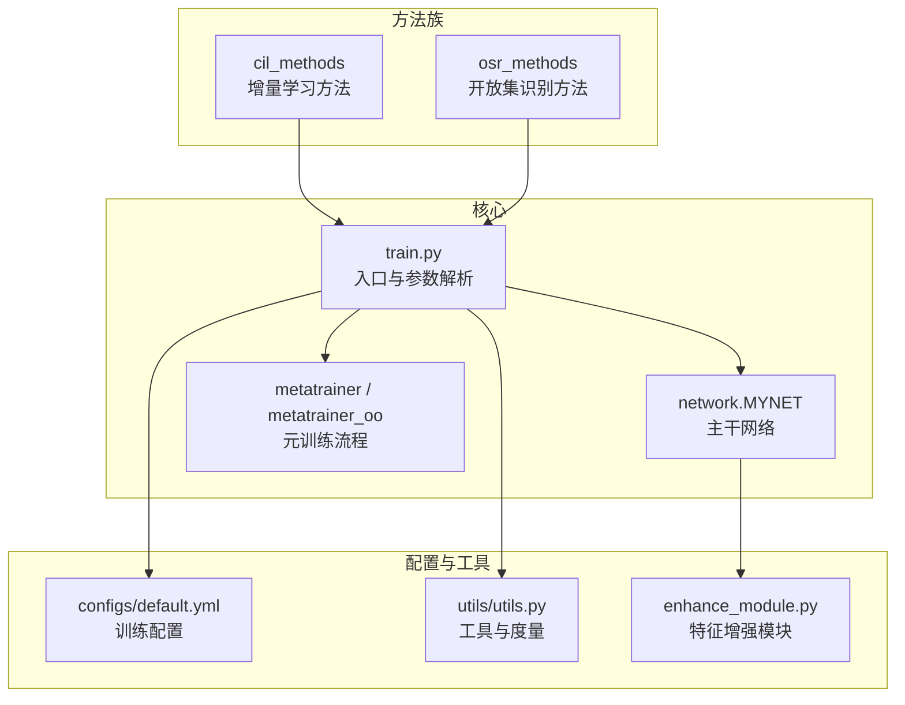
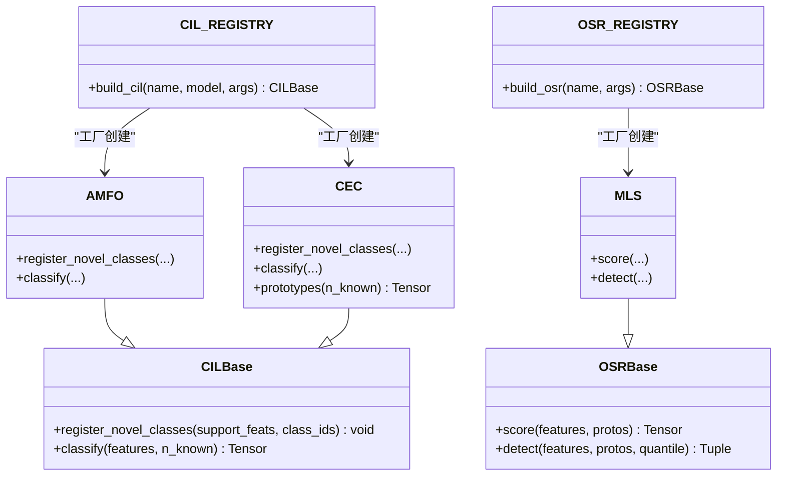
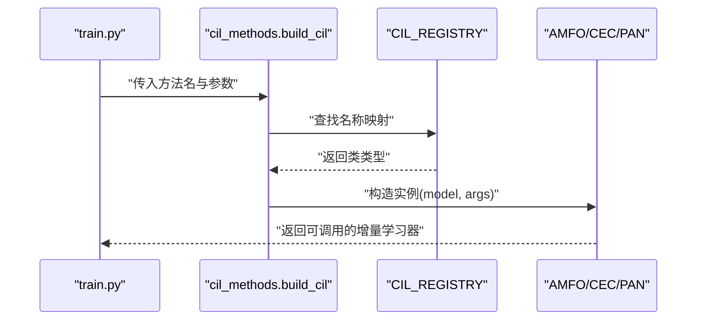
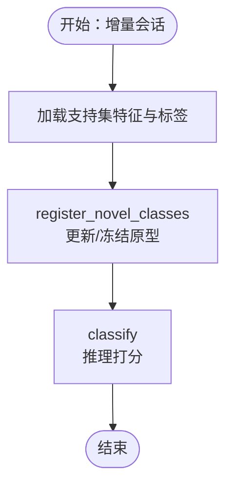
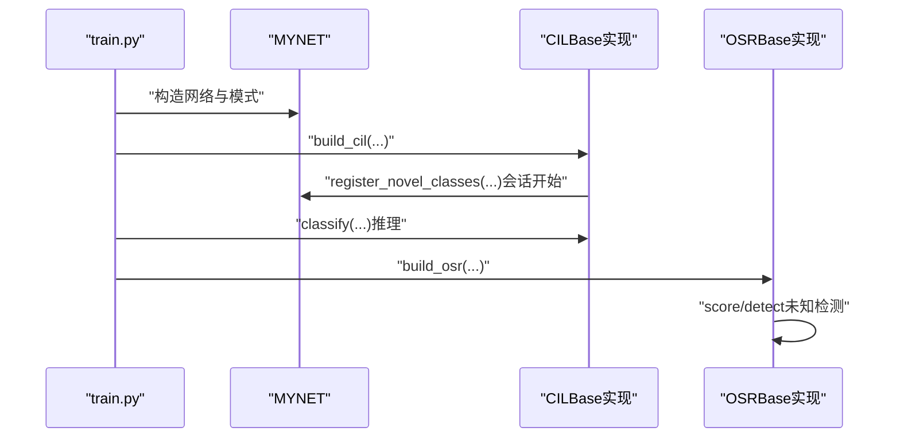
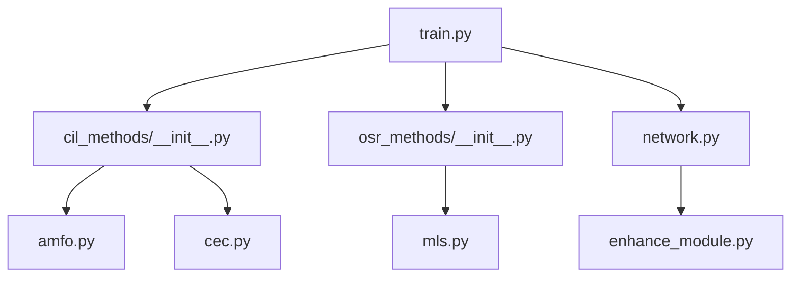

# 插件系统和扩展机制

<cite>
**本文档引用的文件**
- [models/baselines/base.py](file://models/baselines/base.py)
- [models/baselines/cil_methods/__init__.py](file://models/baselines/cil_methods/__init__.py)
- [models/baselines/cil_methods/amfo.py](file://models/baselines/cil_methods/amfo.py)
- [models/baselines/cil_methods/cec.py](file://models/baselines/cil_methods/cec.py)
- [models/baselines/osr_methods/__init__.py](file://models/baselines/osr_methods/__init__.py)
- [models/baselines/osr_methods/mls.py](file://models/baselines/osr_methods/mls.py)
- [network.py](file://network.py)
- [configs/default.yml](file://configs/default.yml)
- [train.py](file://train.py)
- [models/metatrainer.py](file://models/metatrainer.py)
- [models/metatrainer_oo.py](file://models/metatrainer_oo.py)
- [enhance_module.py](file://enhance_module.py)
- [utils/utils.py](file://utils/utils.py)
</cite>

## 目录
1. [简介](#简介)
2. [项目结构](#项目结构)
3. [核心组件](#核心组件)
4. [架构总览](#架构总览)
5. [详细组件分析](#详细组件分析)
6. [依赖分析](#依赖分析)
7. [性能考虑](#性能考虑)
8. [故障排查指南](#故障排查指南)
9. [结论](#结论)
10. [附录](#附录)

## 简介
本指南面向VAZE项目的插件系统与扩展机制，重点阐述模块化设计、工厂模式实现与动态加载机制，帮助开发者快速开发可插拔组件（如增量学习方法、开放集识别方法、特征增强模块等）。文档覆盖接口定义、依赖注入、生命周期管理、注册与发现流程、扩展点设计原则与向后兼容性保障，并提供最佳实践、测试策略与部署建议。

## 项目结构
VAZE采用“功能域+工厂注册”的模块化组织方式：
- 方法族模块：在models/baselines下按任务类型划分（如cil_methods、osr_methods），每个子包内定义具体算法实现并通过__init__.py暴露工厂构建函数与注册表。
- 核心网络与训练：network.py提供MYNET主干网络与音频特征流；train.py负责参数解析、数据集选择与训练入口；metatrainer/oo负责元训练流程。
- 配置与工具：configs/default.yml集中管理训练超参；utils/utils.py提供通用工具与度量。
- 扩展模块：enhance_module.py提供特征增强组件，可作为插件式模块接入网络。

**图表来源**
- [models/baselines/cil_methods/__init__.py:1-22](file://models/baselines/cil_methods/__init__.py#L1-L22)
- [models/baselines/osr_methods/__init__.py:1-22](file://models/baselines/osr_methods/__init__.py#L1-L22)
- [network.py:18-50](file://network.py#L18-L50)
- [models/metatrainer.py:17-85](file://models/metatrainer.py#L17-L85)
- [models/metatrainer_oo.py:17-85](file://models/metatrainer_oo.py#L17-L85)
- [configs/default.yml:1-88](file://configs/default.yml#L1-L88)
- [utils/utils.py:1-50](file://utils/utils.py#L1-L50)
- [enhance_module.py:1-30](file://enhance_module.py#L1-L30)

**章节来源**
- [models/baselines/cil_methods/__init__.py:1-22](file://models/baselines/cil_methods/__init__.py#L1-L22)
- [models/baselines/osr_methods/__init__.py:1-22](file://models/baselines/osr_methods/__init__.py#L1-L22)
- [network.py:18-50](file://network.py#L18-L50)
- [configs/default.yml:1-88](file://configs/default.yml#L1-L88)
- [train.py:173-210](file://train.py#L173-L210)

## 核心组件
- 工厂注册与动态加载
  - 增量学习方法族：cil_methods/__init__.py定义CIL_REGISTRY与build_cil，按名称从注册表构造具体算法实例。
  - 开放集识别方法族：osr_methods/__init__.py定义OSR_REGISTRY与build_osr，按名称从注册表构造评分器实例。
- 接口与基类
  - CILBase：定义增量学习方法的统一接口（注册新类、推理打分）。
  - OSRBase：定义开放集评分器接口（score、detect）。
- 主干网络与扩展
  - MYNET：封装编码器、分类头、音频特征流与多种模式（encoder/openmeta等），支持通过模块组合扩展。
  - LocalFeatureCluster/EnhancedPositionEncoder/FeatureFusion：作为可插拔增强模块接入网络。
- 训练与配置
  - train.py：参数解析、数据集选择、入口调度。
  - metatrainer/oo：元训练流程，负责分类头与特征提取器的协同训练。
  - configs/default.yml：集中配置训练超参、数据增强与网络结构参数。

**章节来源**
- [models/baselines/base.py:11-55](file://models/baselines/base.py#L11-L55)
- [models/baselines/cil_methods/__init__.py:7-18](file://models/baselines/cil_methods/__init__.py#L7-L18)
- [models/baselines/osr_methods/__init__.py:7-18](file://models/baselines/osr_methods/__init__.py#L7-L18)
- [network.py:18-50](file://network.py#L18-L50)
- [enhance_module.py:14-29](file://enhance_module.py#L14-L29)
- [models/metatrainer.py:17-85](file://models/metatrainer.py#L17-L85)
- [models/metatrainer_oo.py:17-85](file://models/metatrainer_oo.py#L17-L85)
- [configs/default.yml:1-88](file://configs/default.yml#L1-L88)

## 架构总览
VAZE的插件系统遵循“接口抽象 + 工厂注册 + 动态加载”的模式：
- 接口层：CILBase/OSRBase定义统一能力契约。
- 注册层：各方法族的__init__.py维护注册表与构建函数。
- 实现层：具体算法（如AMFO、CEC、MLS）实现接口。
- 集成层：训练入口通过配置与工厂函数动态装配组件。

**图表来源**
- [models/baselines/base.py:11-55](file://models/baselines/base.py#L11-L55)
- [models/baselines/cil_methods/amfo.py:19-65](file://models/baselines/cil_methods/amfo.py#L19-L65)
- [models/baselines/cil_methods/cec.py:41-83](file://models/baselines/cil_methods/cec.py#L41-L83)
- [models/baselines/osr_methods/mls.py:15-26](file://models/baselines/osr_methods/mls.py#L15-L26)
- [models/baselines/cil_methods/__init__.py:7-18](file://models/baselines/cil_methods/__init__.py#L7-L18)
- [models/baselines/osr_methods/__init__.py:7-18](file://models/baselines/osr_methods/__init__.py#L7-L18)

## 详细组件分析

### 工厂模式与动态加载
- 增量学习工厂
  - 通过CIL_REGISTRY字典维护名称到类的映射，build_cil(name, model, args)完成实例化。
  - 支持大小写不敏感查找，不存在时抛出KeyError，便于早期发现配置错误。
- 开放集工厂
  - 通过OSR_REGISTRY字典维护名称到类的映射，build_osr(name, args)完成实例化。
  - 与增量学习工厂一致，提供清晰的扩展点。

**图表来源**
- [models/baselines/cil_methods/__init__.py:7-18](file://models/baselines/cil_methods/__init__.py#L7-L18)
- [models/baselines/cil_methods/amfo.py:19-28](file://models/baselines/cil_methods/amfo.py#L19-L28)
- [models/baselines/cil_methods/cec.py:41-50](file://models/baselines/cil_methods/cec.py#L41-L50)

**章节来源**
- [models/baselines/cil_methods/__init__.py:7-18](file://models/baselines/cil_methods/__init__.py#L7-L18)
- [models/baselines/osr_methods/__init__.py:7-18](file://models/baselines/osr_methods/__init__.py#L7-L18)

### 接口定义与实现
- CILBase
  - 必须实现register_novel_classes与classify，前者用于将新类原型写入分类头，后者用于推理打分。
- AMFO
  - 冻结基础原型，仅在新会话添加新类原型；推理时对真实类应用加性角度边界，提升判别性。
- CEC
  - 使用多头自注意力对原型进行交互演化，随后以余弦logits分类；适合长序列/复杂场景的原型动态更新。
- OSRBase与MLS
  - OSRBase定义评分器通用接口；MLS以负的最大余弦logits作为未知分，阈值自适应（quantile）。

**图表来源**
- [models/baselines/base.py:27-33](file://models/baselines/base.py#L27-L33)
- [models/baselines/cil_methods/amfo.py:30-65](file://models/baselines/cil_methods/amfo.py#L30-L65)
- [models/baselines/cil_methods/cec.py:52-83](file://models/baselines/cil_methods/cec.py#L52-L83)

**章节来源**
- [models/baselines/base.py:11-55](file://models/baselines/base.py#L11-L55)
- [models/baselines/cil_methods/amfo.py:19-65](file://models/baselines/cil_methods/amfo.py#L19-L65)
- [models/baselines/cil_methods/cec.py:41-83](file://models/baselines/cil_methods/cec.py#L41-L83)
- [models/baselines/osr_methods/mls.py:15-26](file://models/baselines/osr_methods/mls.py#L15-L26)

### 依赖注入与生命周期管理
- 依赖注入
  - 工厂函数接收model与args，将网络主干与超参注入到具体实现，实现“零样板”扩展。
  - MYNET通过模块组合（如增强模块）实现可插拔扩展，无需修改核心逻辑。
- 生命周期
  - 训练入口在会话开始时调用register_novel_classes，在推理阶段调用classify，符合增量学习典型流程。
  - 元训练阶段（metatrainer/oo）负责分类头与特征提取器的协同优化，确保原型与特征表示的一致性。

**图表来源**
- [train.py:799-800](file://train.py#L799-L800)
- [network.py:18-50](file://network.py#L18-L50)
- [models/baselines/cil_methods/__init__.py:14-18](file://models/baselines/cil_methods/__init__.py#L14-L18)
- [models/baselines/osr_methods/__init__.py:14-18](file://models/baselines/osr_methods/__init__.py#L14-L18)

**章节来源**
- [train.py:799-800](file://train.py#L799-L800)
- [network.py:18-50](file://network.py#L18-L50)

### 扩展点设计原则与向后兼容性
- 设计原则
  - 单一职责：每个方法实现专注一种学习范式或评分策略。
  - 明确契约：通过CILBase/OSRBase约束实现行为，确保调用方无需关心内部细节。
  - 可替换性：通过工厂注册表实现无缝替换，配置驱动。
- 向后兼容
  - 保持接口稳定：新增方法只需实现现有接口，不影响既有调用。
  - 默认参数与配置文件：通过default.yml集中管理参数，新增项以默认值存在，避免破坏旧配置。

**章节来源**
- [models/baselines/base.py:11-55](file://models/baselines/base.py#L11-L55)
- [configs/default.yml:1-88](file://configs/default.yml#L1-L88)

### 插件开发最佳实践
- 接口实现
  - 严格遵循CILBase/OSRBase接口，确保register_novel_classes与classify/score的语义正确。
  - 在训练与推理模式下分别测试，关注数值稳定性与梯度流动。
- 工厂注册
  - 在对应__init__.py中更新注册表与构建函数，命名与配置文件保持一致。
  - 提供详尽的参数校验与异常提示，便于定位问题。
- 依赖注入
  - 通过args传递超参，避免硬编码；对设备与dtype进行显式管理，防止跨设备错误。
- 生命周期
  - 在会话开始时执行原型注册，在推理阶段执行分类；对未知检测使用自适应阈值。
- 可插拔模块
  - 将增强逻辑封装为独立模块（如LocalFeatureCluster），在MYNET中按需组合，减少耦合。

**章节来源**
- [models/baselines/cil_methods/__init__.py:7-18](file://models/baselines/cil_methods/__init__.py#L7-L18)
- [models/baselines/osr_methods/__init__.py:7-18](file://models/baselines/osr_methods/__init__.py#L7-L18)
- [enhance_module.py:70-148](file://enhance_module.py#L70-L148)
- [network.py:36-36](file://network.py#L36-L36)

### 测试策略
- 单元测试
  - 针对接口实现的关键函数（如register_novel_classes、classify、score）编写测试，覆盖不同输入规模与数值边界。
- 集成测试
  - 通过工厂函数构造完整流水线，验证从数据到推理的整体正确性。
- 性能回归
  - 在相同配置下对比不同方法的收敛速度与最终指标，确保新增方法不劣化整体表现。
- 兼容性测试
  - 更换方法名或参数后，验证配置文件与工厂函数的联动是否正常。

**章节来源**
- [models/baselines/base.py:27-33](file://models/baselines/base.py#L27-L33)
- [models/baselines/osr_methods/mls.py:20-26](file://models/baselines/osr_methods/mls.py#L20-L26)

### 部署指南
- 配置管理
  - 在configs/default.yml中设置方法名与相关超参，确保与工厂注册表一致。
- 训练入口
  - 使用train.py提供的参数解析与数据集选择逻辑，确保路径与数据集名称正确。
- 模块组合
  - 在MYNET中按需启用增强模块，注意设备一致性与内存占用。
- 结果输出
  - 利用utils/utils.py中的度量与可视化工具，定期评估与记录指标。

**章节来源**
- [configs/default.yml:1-88](file://configs/default.yml#L1-L88)
- [train.py:173-210](file://train.py#L173-L210)
- [utils/utils.py:360-488](file://utils/utils.py#L360-L488)

## 依赖分析
- 组件耦合
  - 工厂注册表与实现类松耦合，通过字符串名称绑定，降低编译期依赖。
  - MYNET与增强模块通过组合而非继承实现扩展，降低侵入性。
- 外部依赖
  - torch、sklearn、matplotlib等第三方库在工具与训练流程中广泛使用。
- 循环依赖
  - 当前结构未见循环导入；若新增模块，需避免在__init__.py中相互引用。

**图表来源**
- [models/baselines/cil_methods/__init__.py:1-22](file://models/baselines/cil_methods/__init__.py#L1-L22)
- [models/baselines/osr_methods/__init__.py:1-22](file://models/baselines/osr_methods/__init__.py#L1-L22)
- [models/baselines/cil_methods/amfo.py:1-65](file://models/baselines/cil_methods/amfo.py#L1-L65)
- [models/baselines/cil_methods/cec.py:1-83](file://models/baselines/cil_methods/cec.py#L1-L83)
- [models/baselines/osr_methods/mls.py:1-26](file://models/baselines/osr_methods/mls.py#L1-L26)
- [train.py:1-800](file://train.py#L1-L800)
- [network.py:1-724](file://network.py#L1-L724)
- [enhance_module.py:1-160](file://enhance_module.py#L1-L160)

**章节来源**
- [models/baselines/cil_methods/__init__.py:1-22](file://models/baselines/cil_methods/__init__.py#L1-L22)
- [models/baselines/osr_methods/__init__.py:1-22](file://models/baselines/osr_methods/__init__.py#L1-L22)
- [train.py:1-800](file://train.py#L1-L800)
- [network.py:1-724](file://network.py#L1-L724)
- [enhance_module.py:1-160](file://enhance_module.py#L1-L160)

## 性能考虑
- 计算效率
  - 增量学习中尽量冻结基础原型，减少优化参数规模；仅在新类上更新原型。
  - 使用余弦相似度与温度缩放平衡判别性与稳定性。
- 内存占用
  - 增强模块在GPU上运行时注意设备一致性，避免频繁迁移。
  - 元训练阶段合理设置批大小与学习率，防止显存溢出。
- 可扩展性
  - 工厂注册表支持快速扩展新方法，无需改动训练主循环。

[本节为通用指导，无需特定文件来源]

## 故障排查指南
- 常见问题
  - 方法名拼写错误：工厂函数会抛出KeyError，检查配置文件与注册表名称一致性。
  - 设备不匹配：增强模块与网络模块需在同一设备，确保forward路径中设备一致。
  - 参数缺失：在args中缺少必要字段会导致初始化失败，检查default.yml与调用处。
- 定位手段
  - 使用日志与断言确认关键张量维度与设备。
  - 逐步缩小问题范围：先验证工厂构建，再验证接口实现，最后验证训练流程。

**章节来源**
- [models/baselines/cil_methods/__init__.py:16-18](file://models/baselines/cil_methods/__init__.py#L16-L18)
- [utils/utils.py:118-131](file://utils/utils.py#L118-L131)

## 结论
VAZE的插件系统以清晰的接口契约、稳定的工厂注册与动态加载机制为核心，结合可插拔的增强模块与集中式配置，实现了高度模块化与可扩展的系统架构。遵循本文档的扩展点设计原则、最佳实践与测试策略，可在不破坏向后兼容性的前提下快速引入新的增量学习与开放集识别方法，并安全地集成特征增强模块。

## 附录
- 快速上手清单
  - 在对应方法族__init__.py中注册新类与构建函数。
  - 实现CILBase/OSRBase接口，确保register_novel_classes与classify/score正确。
  - 在configs/default.yml中设置方法名与参数。
  - 在train.py中验证工厂函数与配置联动。
  - 编写单元与集成测试，覆盖关键路径与边界条件。

[本节为概览性内容，无需特定文件来源]