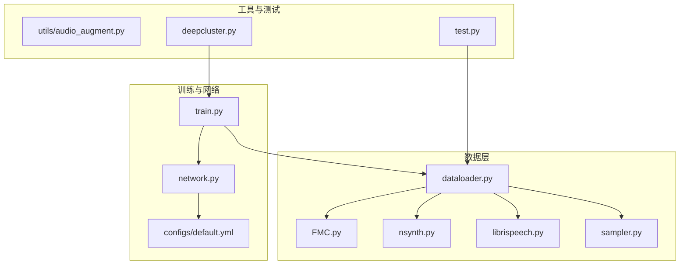
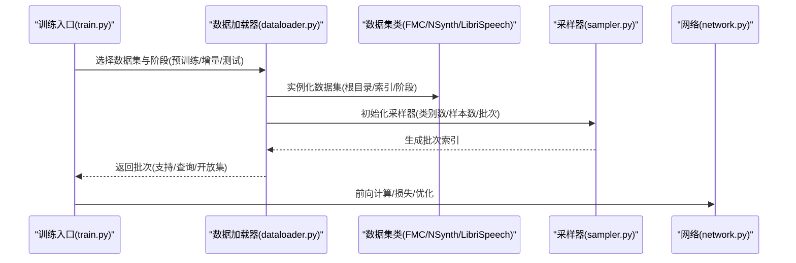
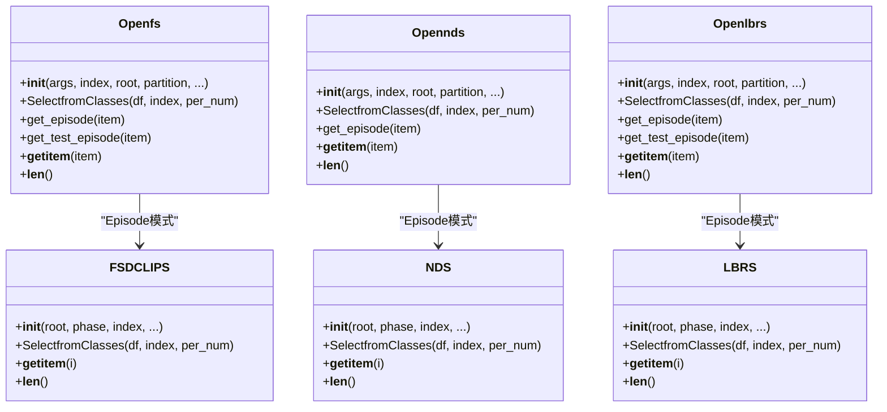
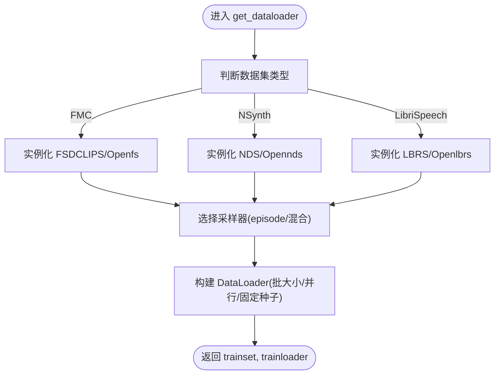
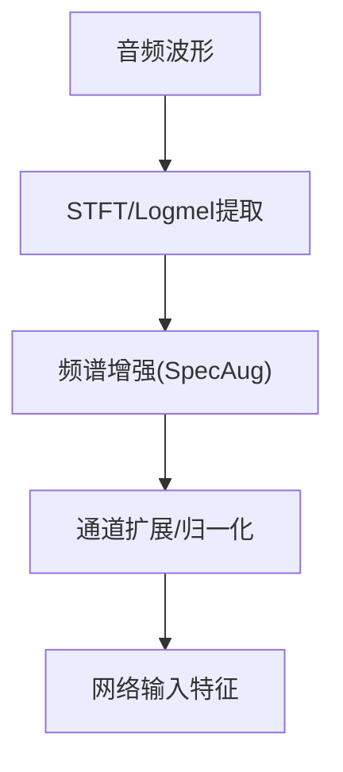
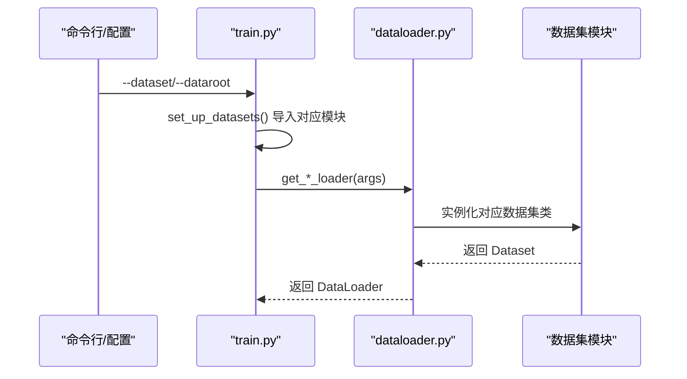
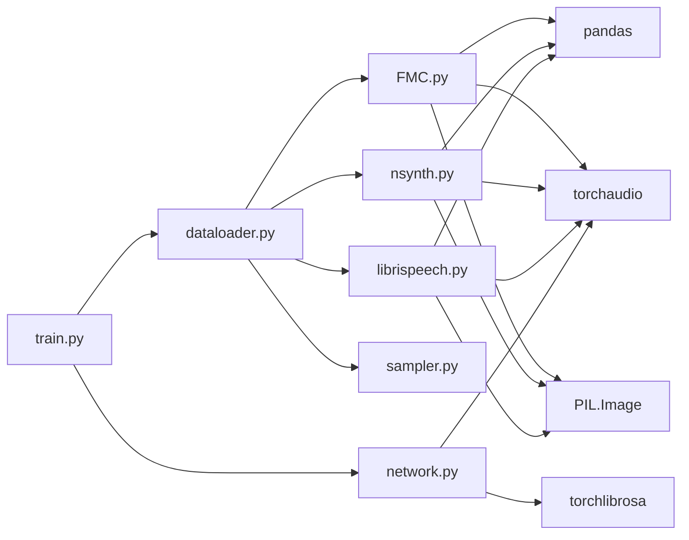

# 数据集扩展

<cite>
**本文引用的文件**
- [FMC.py](file://data/FMC.py)
- [nsynth.py](file://data/nsynth.py)
- [librispeech.py](file://data/librispeech.py)
- [dataloader.py](file://data/dataloader.py)
- [sampler.py](file://data/sampler.py)
- [default.yml](file://configs/default.yml)
- [train.py](file://train.py)
- [network.py](file://network.py)
- [audio_augment.py](file://utils/audio_augment.py)
- [test.py](file://test.py)
- [deepcluster.py](file://deepcluster.py)
</cite>

## 目录
1. [简介](#简介)
2. [项目结构](#项目结构)
3. [核心组件](#核心组件)
4. [架构总览](#架构总览)
5. [详细组件分析](#详细组件分析)
6. [依赖关系分析](#依赖关系分析)
7. [性能考量](#性能考量)
8. [故障排查指南](#故障排查指南)
9. [结论](#结论)
10. [附录](#附录)

## 简介
本指南面向希望向 VAZE 项目添加新音频数据集的开发者，系统讲解如何：
- 适配新的音频数据格式与元数据结构
- 实现数据加载器与采样器
- 设计多数据集支持的架构与配置方法
- 定制数据预处理、特征提取与采样策略
- 进行数据集验证、性能测试与兼容性检查

VAZE 已内置对 FMC、NSynth 和 LibriSpeech 的支持，本文将以这三个数据集为范式，给出可复用的实现模式与最佳实践。

## 项目结构
VAZE 的数据层位于 data/ 目录，包含三个核心数据集模块与统一的数据加载与采样逻辑；训练入口在 train.py，网络特征提取器在 network.py，配置在 configs/default.yml。

图表来源
- [dataloader.py:1-351](file://data/dataloader.py#L1-L351)
- [FMC.py:1-367](file://data/FMC.py#L1-L367)
- [nsynth.py:1-287](file://data/nsynth.py#L1-L287)
- [librispeech.py:1-278](file://data/librispeech.py#L1-L278)
- [sampler.py:1-201](file://data/sampler.py#L1-L201)
- [train.py:156-171](file://train.py#L156-L171)
- [network.py:337-388](file://network.py#L337-L388)
- [default.yml:1-88](file://configs/default.yml#L1-L88)
- [audio_augment.py:1-31](file://utils/audio_augment.py#L1-L31)
- [test.py:806-990](file://test.py#L806-L990)
- [deepcluster.py:116-131](file://deepcluster.py#L116-L131)

章节来源
- [dataloader.py:1-351](file://data/dataloader.py#L1-L351)
- [train.py:156-171](file://train.py#L156-L171)

## 核心组件
- 数据集类（Dataset）：封装数据路径、标签映射、采样与读取逻辑。FMC、NSynth、LibriSpeech 各自实现了两类数据集类，分别用于小样本训练（Episode）与标准训练/测试。
- 数据加载器（DataLoader）：根据任务类型（预训练、增量、测试等）选择对应数据集，并使用自定义采样器（Episode Sampler）组织批次。
- 采样器（Sampler）：支持基础/增量场景的类别与样本采样，以及课程学习（Curriculum）策略。
- 网络特征提取器：统一的梅尔频谱提取与增强接口，适配不同数据集的采样率、窗长、步长等参数。
- 配置系统：通过 YAML 配置控制训练超参、数据加载参数、特征提取参数等。

章节来源
- [FMC.py:21-101](file://data/FMC.py#L21-L101)
- [nsynth.py:21-109](file://data/nsynth.py#L21-L109)
- [librispeech.py:21-79](file://data/librispeech.py#L21-L79)
- [dataloader.py:13-132](file://data/dataloader.py#L13-L132)
- [sampler.py:6-201](file://data/sampler.py#L6-L201)
- [network.py:337-388](file://network.py#L337-L388)
- [default.yml:57-85](file://configs/default.yml#L57-L85)

## 架构总览
VAZE 的数据扩展遵循“数据集类 + 加载器 + 采样器 + 网络特征”的分层设计。训练入口动态导入目标数据集模块，加载器根据配置选择具体数据集类与采样策略，网络侧提供统一的特征提取与增强能力。

图表来源
- [train.py:156-171](file://train.py#L156-L171)
- [dataloader.py:13-132](file://data/dataloader.py#L13-L132)
- [sampler.py:6-201](file://data/sampler.py#L6-L201)
- [network.py:337-388](file://network.py#L337-L388)

## 详细组件分析

### 数据集类模式（FMC/NSynth/LibriSpeech）
三者均采用相同的类层次：
- 标准数据集类：负责读取 CSV 元数据、拼接音频路径、加载音频并返回张量与标签。
- Episode 数据集类：用于小样本训练，按 episode 组织支持集/查询集/开放集，返回多组张量与标签。

图表来源
- [FMC.py:21-351](file://data/FMC.py#L21-L351)
- [nsynth.py:21-272](file://data/nsynth.py#L21-L272)
- [librispeech.py:21-263](file://data/librispeech.py#L21-L263)

章节来源
- [FMC.py:21-101](file://data/FMC.py#L21-L101)
- [nsynth.py:21-109](file://data/nsynth.py#L21-L109)
- [librispeech.py:21-79](file://data/librispeech.py#L21-L79)

### 数据加载器与采样器
- 加载器根据任务类型选择数据集与阶段，构造 DataLoader 并设置 worker 初始化与随机种子。
- 采样器支持：
  - 基础/增量混合采样（TrueIncreTrainCategoriesSampler）
  - 小样本 episode 采样（SupportsetSampler）
  - 课程学习采样（CurriculumSampler）

图表来源
- [dataloader.py:19-46](file://data/dataloader.py#L19-L46)
- [dataloader.py:134-168](file://data/dataloader.py#L134-L168)
- [dataloader.py:206-230](file://data/dataloader.py#L206-L230)
- [sampler.py:38-93](file://data/sampler.py#L38-L93)
- [sampler.py:97-140](file://data/sampler.py#L97-L140)

章节来源
- [dataloader.py:13-132](file://data/dataloader.py#L13-L132)
- [sampler.py:6-201](file://data/sampler.py#L6-L201)

### 特征提取与增强
- 网络侧提供统一的 STFT 与梅尔滤波器接口，并支持频谱增强（SpecAugmentation）。
- 不同数据集可配置不同的采样率、窗长、步长、梅尔 bins 等参数，以适配各自特性。

图表来源
- [network.py:337-388](file://network.py#L337-L388)
- [default.yml:77-85](file://configs/default.yml#L77-L85)

章节来源
- [network.py:337-388](file://network.py#L337-L388)
- [default.yml:77-85](file://configs/default.yml#L77-L85)

### 多数据集支持与配置
- 训练入口动态导入目标数据集模块，并在配置中指定数据集名称与根目录。
- 加载器与测试脚本根据配置分支选择具体数据集类。

图表来源
- [train.py:156-171](file://train.py#L156-L171)
- [dataloader.py:65-81](file://data/dataloader.py#L65-L81)
- [dataloader.py:108-132](file://data/dataloader.py#L108-L132)
- [deepcluster.py:116-131](file://deepcluster.py#L116-L131)

章节来源
- [train.py:156-171](file://train.py#L156-L171)
- [dataloader.py:65-81](file://data/dataloader.py#L65-L81)
- [deepcluster.py:116-131](file://deepcluster.py#L116-L131)

## 依赖关系分析
- 数据集类依赖于 pandas、torchaudio、PIL 等库进行元数据解析与音频读取。
- 加载器依赖采样器与 torch.utils.data。
- 网络特征提取器依赖 torchlibrosa 与 torchaudio。
- 训练入口依赖配置文件与数据加载器。

图表来源
- [FMC.py:1-20](file://data/FMC.py#L1-L20)
- [nsynth.py:1-18](file://data/nsynth.py#L1-L18)
- [librispeech.py:1-18](file://data/librispeech.py#L1-L18)
- [dataloader.py:1-9](file://data/dataloader.py#L1-L9)
- [network.py:337-388](file://network.py#L337-L388)
- [train.py:1-20](file://train.py#L1-L20)

章节来源
- [FMC.py:1-20](file://data/FMC.py#L1-L20)
- [nsynth.py:1-18](file://data/nsynth.py#L1-L18)
- [librispeech.py:1-18](file://data/librispeech.py#L1-L18)
- [dataloader.py:1-9](file://data/dataloader.py#L1-L9)
- [network.py:337-388](file://network.py#L337-L388)
- [train.py:1-20](file://train.py#L1-L20)

## 性能考量
- 数据加载并行：DataLoader 使用多进程并行与 pin_memory，建议根据硬件调整 num_workers。
- 固定随机种子：通过 worker_init_fn 与 Generator 确保可复现实验。
- 特征提取参数：合理设置采样率、窗长、步长与梅尔 bins，平衡计算开销与表征质量。
- 课程学习：CurriculumSampler 可按难度递增更新活跃类别集合，提升训练稳定性。

章节来源
- [dataloader.py:11-12](file://data/dataloader.py#L11-L12)
- [dataloader.py:16-17](file://data/dataloader.py#L16-L17)
- [dataloader.py:30-31](file://data/dataloader.py#L30-L31)
- [network.py:337-388](file://network.py#L337-L388)
- [sampler.py:141-201](file://data/sampler.py#L141-L201)

## 故障排查指南
- 数据路径与元数据
  - 确认 CSV 元数据中的列名与路径拼接逻辑一致（如 filename、label、data_folder 等）。
  - 检查音频文件是否存在且可读。
- 标签映射
  - 对于需要词典映射的标签（如 NSynth 的 instrument -> 数字标签），确保 JSON 文件完整加载。
- Episode 组织
  - 若 episode 中出现类别不足或样本不足，检查 per_num 与数据分布，必要时允许重复采样。
- 随机性与可复现
  - 确保固定随机种子与 worker 初始化函数已启用。
- 测试与评估
  - 使用测试脚本输出各类指标（已知/未知/增量/总体准确率与 F1），并结合可视化脚本分析性能退化。

章节来源
- [FMC.py:32-34](file://data/FMC.py#L32-L34)
- [nsynth.py:34-35](file://data/nsynth.py#L34-L35)
- [librispeech.py:31-33](file://data/librispeech.py#L31-L33)
- [dataloader.py:11-12](file://data/dataloader.py#L11-L12)
- [test.py:806-990](file://test.py#L806-L990)

## 结论
VAZE 的数据层以清晰的模块化设计支持多数据集扩展：新增数据集只需实现标准数据集类与 Episode 数据集类，遵循统一的元数据与路径约定，并在训练入口与加载器中注册即可。通过采样器与特征提取器的统一抽象，可以灵活适配不同数据集的采样策略与特征参数，从而在多会话增量学习场景下稳定提升性能。

## 附录

### 新数据集接入步骤清单
- 准备元数据
  - 输出 CSV 文件，包含列：文件名、标签（数字或类别名）、数据来源目录等。
  - 如需类别映射，准备 JSON/VOCAB 文件。
- 实现数据集类
  - 标准类：实现 __init__、SelectfromClasses、__getitem__、__len__。
  - Episode 类：实现 get_episode/get_test_episode，组织支持/查询/开放集。
- 注册与配置
  - 在训练入口 set_up_datasets 中添加数据集导入分支。
  - 在加载器分支中添加对应数据集的实例化逻辑。
  - 在配置文件中设置 dataroot 与相关参数。
- 验证与测试
  - 使用 DataLoader 快速遍历验证数据读取与标签一致性。
  - 运行测试脚本观察指标变化，确认课程学习与增量策略正常工作。

章节来源
- [train.py:156-171](file://train.py#L156-L171)
- [dataloader.py:19-46](file://data/dataloader.py#L19-L46)
- [default.yml:57-85](file://configs/default.yml#L57-L85)