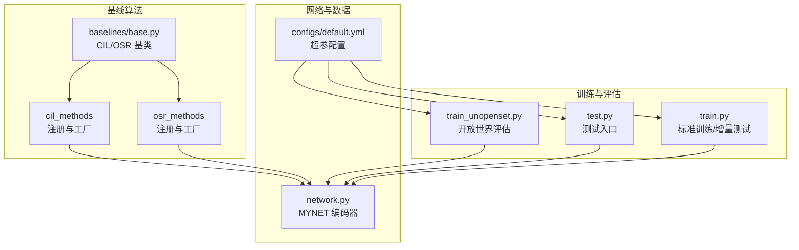
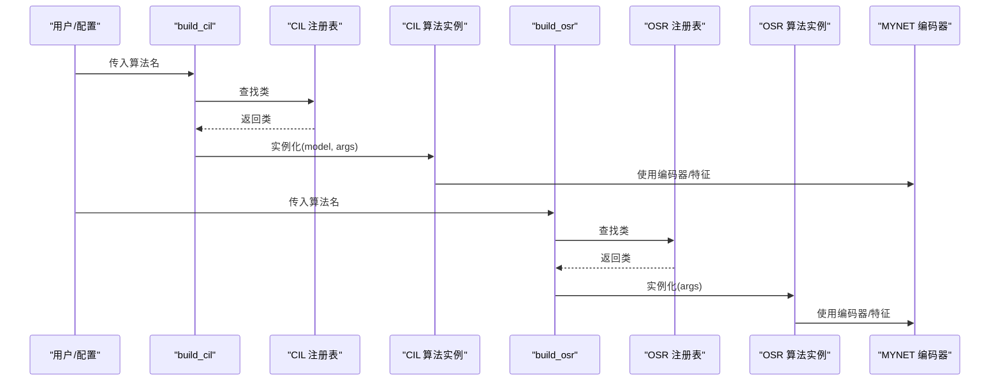
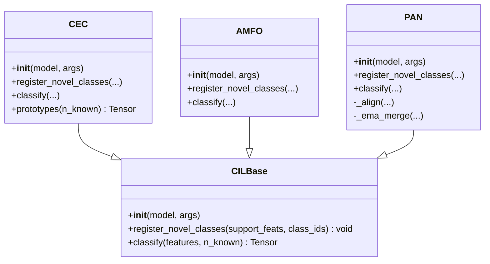
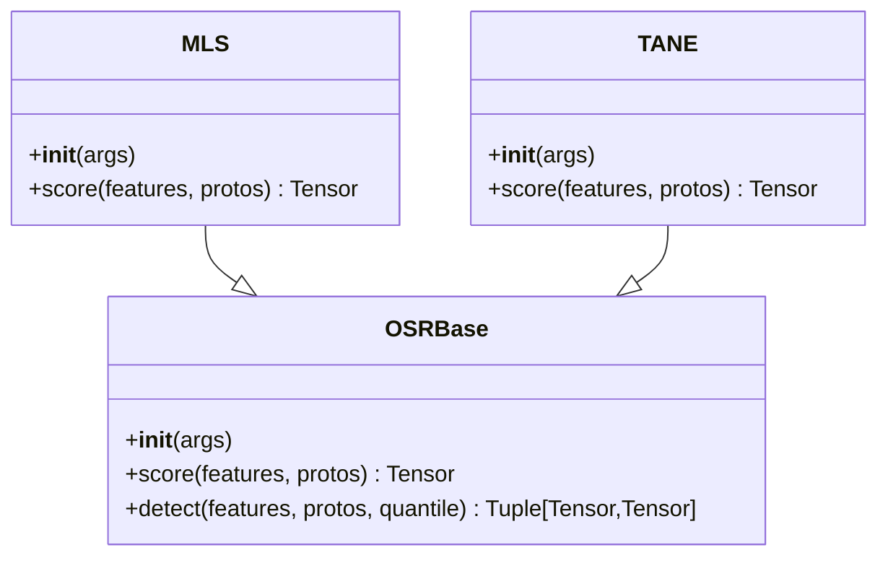
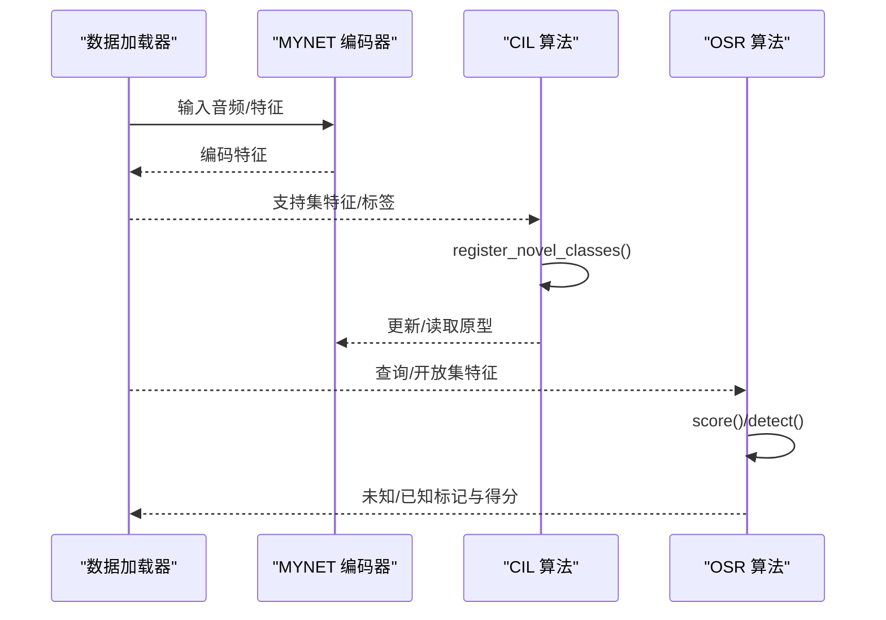
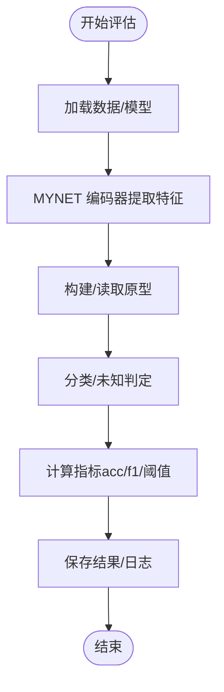
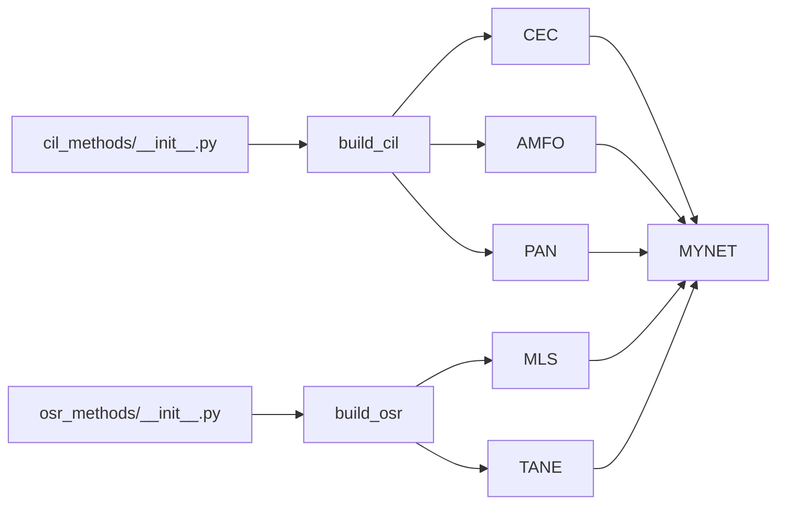

# 新算法集成

<cite>
**本文引用的文件**
- [models/baselines/__init__.py](file://models/baselines/__init__.py)
- [models/baselines/base.py](file://models/baselines/base.py)
- [models/baselines/cil_methods/__init__.py](file://models/baselines/cil_methods/__init__.py)
- [models/baselines/cil_methods/cec.py](file://models/baselines/cil_methods/cec.py)
- [models/baselines/cil_methods/amfo.py](file://models/baselines/cil_methods/amfo.py)
- [models/baselines/cil_methods/pan.py](file://models/baselines/cil_methods/pan.py)
- [models/baselines/osr_methods/__init__.py](file://models/baselines/osr_methods/__init__.py)
- [models/baselines/osr_methods/mls.py](file://models/baselines/osr_methods/mls.py)
- [models/baselines/osr_methods/tane.py](file://models/baselines/osr_methods/tane.py)
- [network.py](file://network.py)
- [configs/default.yml](file://configs/default.yml)
- [train_unopenset.py](file://train_unopenset.py)
- [test.py](file://test.py)
- [train.py](file://train.py)
</cite>

## 目录
1. [简介](#简介)
2. [项目结构](#项目结构)
3. [核心组件](#核心组件)
4. [架构总览](#架构总览)
5. [详细组件分析](#详细组件分析)
6. [依赖分析](#依赖分析)
7. [性能考虑](#性能考虑)
8. [故障排查指南](#故障排查指南)
9. [结论](#结论)
10. [附录](#附录)

## 简介
本指南面向希望在 VAZE 项目中集成新的增量学习（Class-Incremental Learning, CIL）与开放集识别（Open-Set Recognition, OSR）算法的开发者。文档系统性阐述以下内容：
- 算法注册机制与工厂模式（build 函数）
- CIL 与 OSR 基类接口与实现约定
- 如何实现新的基线方法（类继承、接口实现、参数配置）
- 算法与 MYNET 编码器的集成方式
- 评估流水线的适配与测试最佳实践

## 项目结构
VAZE 采用“分层 + 子包”的组织方式：
- models/baselines：集中存放 CIL/OSR 基线算法与公共接口
- models/baselines/cil_methods：CIL 方法注册与工厂
- models/baselines/osr_methods：OSR 方法注册与工厂
- models/baselines/base.py：CIL/OSR 基类与通用工具
- network.py：MYNET 编码器与前向流程
- configs/default.yml：默认超参配置
- train_unopenset.py / test.py / train.py：训练与评估入口

图表来源
- [models/baselines/cil_methods/__init__.py:1-22](file://models/baselines/cil_methods/__init__.py#L1-L22)
- [models/baselines/osr_methods/__init__.py:1-22](file://models/baselines/osr_methods/__init__.py#L1-L22)
- [models/baselines/base.py:1-76](file://models/baselines/base.py#L1-L76)
- [network.py:18-50](file://network.py#L18-L50)
- [configs/default.yml:1-88](file://configs/default.yml#L1-L88)
- [train_unopenset.py:1-200](file://train_unopenset.py#L1-L200)
- [test.py:806-832](file://test.py#L806-L832)
- [train.py:763-797](file://train.py#L763-L797)

章节来源
- [models/baselines/__init__.py:1-16](file://models/baselines/__init__.py#L1-L16)
- [models/baselines/base.py:1-76](file://models/baselines/base.py#L1-L76)
- [models/baselines/cil_methods/__init__.py:1-22](file://models/baselines/cil_methods/__init__.py#L1-L22)
- [models/baselines/osr_methods/__init__.py:1-22](file://models/baselines/osr_methods/__init__.py#L1-L22)
- [network.py:18-50](file://network.py#L18-L50)
- [configs/default.yml:1-88](file://configs/default.yml#L1-L88)
- [train_unopenset.py:1-200](file://train_unopenset.py#L1-L200)
- [test.py:806-832](file://test.py#L806-L832)
- [train.py:763-797](file://train.py#L763-L797)

## 核心组件
- CILBase 与 OSRBase：定义增量学习与开放集识别的统一接口，要求实现注册新类别原型与推理打分逻辑。
- 工厂函数 build_cil/build_osr：通过名称查找注册表实例化具体算法。
- MYNET 编码器：提供特征提取能力，支持多种模式（如 encoder/openmeta），并与评估流水线配合。

章节来源
- [models/baselines/base.py:11-55](file://models/baselines/base.py#L11-L55)
- [models/baselines/cil_methods/__init__.py:14-18](file://models/baselines/cil_methods/__init__.py#L14-L18)
- [models/baselines/osr_methods/__init__.py:14-18](file://models/baselines/osr_methods/__init__.py#L14-L18)
- [network.py:18-50](file://network.py#L18-L50)

## 架构总览
下图展示了算法注册、实例化与 MYNET 集成的关键交互：

图表来源
- [models/baselines/cil_methods/__init__.py:14-18](file://models/baselines/cil_methods/__init__.py#L14-L18)
- [models/baselines/osr_methods/__init__.py:14-18](file://models/baselines/osr_methods/__init__.py#L14-L18)
- [network.py:18-50](file://network.py#L18-L50)

## 详细组件分析

### CIL 算法注册与工厂
- 注册表：在 cil_methods/__init__.py 中维护 CIL_REGISTRY 映射名称到类。
- 工厂函数：build_cil(name, model, args) 将名称标准化后查表，实例化对应算法。
- 算法基类：CILBase 约定 register_novel_classes 与 classify 两个核心接口。

图表来源
- [models/baselines/base.py:11-33](file://models/baselines/base.py#L11-L33)
- [models/baselines/cil_methods/cec.py:41-83](file://models/baselines/cil_methods/cec.py#L41-L83)
- [models/baselines/cil_methods/amfo.py:19-65](file://models/baselines/cil_methods/amfo.py#L19-L65)
- [models/baselines/cil_methods/pan.py:24-109](file://models/baselines/cil_methods/pan.py#L24-L109)

章节来源
- [models/baselines/cil_methods/__init__.py:1-22](file://models/baselines/cil_methods/__init__.py#L1-L22)
- [models/baselines/base.py:11-33](file://models/baselines/base.py#L11-L33)
- [models/baselines/cil_methods/cec.py:1-83](file://models/baselines/cil_methods/cec.py#L1-L83)
- [models/baselines/cil_methods/amfo.py:1-65](file://models/baselines/cil_methods/amfo.py#L1-L65)
- [models/baselines/cil_methods/pan.py:1-109](file://models/baselines/cil_methods/pan.py#L1-L109)

### OSR 算法注册与工厂
- 注册表：osr_methods/__init__.py 中维护 OSR_REGISTRY 映射名称到类。
- 工厂函数：build_osr(name, args) 将名称标准化后查表，实例化对应算法。
- 算法基类：OSRBase 约定 score 与 detect 接口，detect 默认使用分位阈值进行自适应判定。

图表来源
- [models/baselines/base.py:35-55](file://models/baselines/base.py#L35-L55)
- [models/baselines/osr_methods/mls.py:15-26](file://models/baselines/osr_methods/mls.py#L15-L26)
- [models/baselines/osr_methods/tane.py:15-29](file://models/baselines/osr_methods/tane.py#L15-L29)

章节来源
- [models/baselines/osr_methods/__init__.py:1-22](file://models/baselines/osr_methods/__init__.py#L1-L22)
- [models/baselines/base.py:35-55](file://models/baselines/base.py#L35-L55)
- [models/baselines/osr_methods/mls.py:1-26](file://models/baselines/osr_methods/mls.py#L1-L26)
- [models/baselines/osr_methods/tane.py:1-29](file://models/baselines/osr_methods/tane.py#L1-L29)

### MYNET 编码器与算法集成
- MYNET 支持多种模式：encoder/openmeta 等，其中 encoder 模式仅返回特征，便于 CIL/OSR 算法使用。
- MYNET 提供 encode/base_encode/hgnn_encode 等特征提取路径，评估阶段常通过 model.encode 获取支持/查询特征。
- CIL 算法通过 register_novel_classes 将新类原型写入模型的分类权重（或参数张量），随后 classify 使用余弦相似或缩放余弦进行推理。
- OSR 算法通过 score 计算未知度量，detect 基于分位阈值进行未知/已知判定。

图表来源
- [network.py:471-518](file://network.py#L471-L518)
- [models/baselines/base.py:27-33](file://models/baselines/base.py#L27-L33)
- [models/baselines/base.py:46-54](file://models/baselines/base.py#L46-L54)

章节来源
- [network.py:18-50](file://network.py#L18-L50)
- [network.py:471-518](file://network.py#L471-L518)
- [models/baselines/base.py:27-33](file://models/baselines/base.py#L27-L33)
- [models/baselines/base.py:46-54](file://models/baselines/base.py#L46-L54)

### 评估流水线适配
- 开放世界评估：train_unopenset.py 中通过 model.encode 获取特征，使用模型分类权重构造原型，计算准确率等指标，并支持多次测试轮次统计。
- 增量测试：train.py/test.py 中对不同 session 使用 model.encode 获取查询特征，结合 model.fc.weight[:test_class] 进行余弦相似分类。

图表来源
- [train_unopenset.py:397-447](file://train_unopenset.py#L397-L447)
- [train.py:763-797](file://train.py#L763-L797)
- [test.py:806-832](file://test.py#L806-L832)

章节来源
- [train_unopenset.py:397-447](file://train_unopenset.py#L397-L447)
- [train.py:763-797](file://train.py#L763-L797)
- [test.py:806-832](file://test.py#L806-L832)

## 依赖分析
- 算法注册依赖：cil_methods/__init__.py 与 osr_methods/__init__.py 通过字典映射名称到类，工厂函数负责实例化。
- 算法实现依赖：各算法类继承 CILBase/OSRBase，复用 cosine_logits 与原型构建工具。
- 编码器依赖：MYNET 提供统一特征提取接口，贯穿训练与评估。

图表来源
- [models/baselines/cil_methods/__init__.py:1-22](file://models/baselines/cil_methods/__init__.py#L1-L22)
- [models/baselines/osr_methods/__init__.py:1-22](file://models/baselines/osr_methods/__init__.py#L1-L22)
- [network.py:18-50](file://network.py#L18-L50)

章节来源
- [models/baselines/cil_methods/__init__.py:1-22](file://models/baselines/cil_methods/__init__.py#L1-L22)
- [models/baselines/osr_methods/__init__.py:1-22](file://models/baselines/osr_methods/__init__.py#L1-L22)
- [network.py:18-50](file://network.py#L18-L50)

## 性能考虑
- 特征维度与温度：CIL/OSR 常使用余弦相似或缩放余弦，可通过 args 中的温度/缩放参数调节判别锐度。
- 原型更新策略：CIL 中的 EMA/注意力/对齐等策略会影响收敛速度与稳定性，需结合数据规模与类别分布调整步数与学习率。
- 推理效率：MYNET 在 encoder 模式下仅返回特征，避免不必要的分类前向开销。

## 故障排查指南
- 未知算法名：若传入 build_cil/build_osr 的名称不在注册表，将抛出 KeyError，检查名称大小写与拼写。
- 原型维度不匹配：register_novel_classes 需确保新增类别索引不超过当前原型矩阵行数，必要时进行零填充。
- 检测阈值异常：OSRBase.detect 使用分位阈值，若数据分布极端，建议调整 quantile 或采用更稳健的阈值估计方法。
- 评估指标为空：若测试数据为空或类别列表不一致，检测 known_test/test 的输入与模型权重范围。

章节来源
- [models/baselines/cil_methods/__init__.py:16-17](file://models/baselines/cil_methods/__init__.py#L16-L17)
- [models/baselines/osr_methods/__init__.py:16-17](file://models/baselines/osr_methods/__init__.py#L16-L17)
- [models/baselines/base.py:49-54](file://models/baselines/base.py#L49-L54)
- [train_unopenset.py:418-447](file://train_unopenset.py#L418-L447)
- [train.py:783-797](file://train.py#L783-L797)

## 结论
通过统一的基类接口、注册表与工厂模式，VAZE 为新增 CIL/OSR 算法提供了清晰的扩展路径。遵循以下步骤即可快速集成：
- 在对应子包中新增算法文件，继承 CILBase 或 OSRBase
- 在 __init__.py 中注册到 CIL_REGISTRY/OSR_REGISTRY
- 在工厂函数中支持名称到类的映射
- 使用 MYNET 编码器提取特征，按需更新/读取原型
- 在评估流水线中接入算法的 score/detect 或 classify

## 附录

### 新增 CIL 算法步骤示例（不含代码）
- 步骤 1：在 models/baselines/cil_methods 下新建 mycil.py，实现类 MyCIL 并继承 CILBase，完成 register_novel_classes 与 classify 的实现。
- 步骤 2：在 models/baselines/cil_methods/__init__.py 的 CIL_REGISTRY 中加入 "mycil": MyCIL。
- 步骤 3：在 models/baselines/__init__.py 中导出 build_cil（若未导出）。
- 步骤 4：在 configs/default.yml 中为算法新增必要的超参键（如 mycil_xxx）。
- 步骤 5：在训练/测试脚本中通过 build_cil("mycil", model, args) 获取实例，并在评估中使用 model.encode 提取特征进行分类。

章节来源
- [models/baselines/cil_methods/__init__.py:1-22](file://models/baselines/cil_methods/__init__.py#L1-L22)
- [models/baselines/base.py:11-33](file://models/baselines/base.py#L11-L33)
- [configs/default.yml:1-88](file://configs/default.yml#L1-L88)

### 新增 OSR 算法步骤示例（不含代码）
- 步骤 1：在 models/baselines/osr_methods 下新建 myosr.py，实现类 MyOSR 并继承 OSRBase，完成 score 的实现（detect 可沿用基类）。
- 步骤 2：在 models/baselines/osr_methods/__init__.py 的 OSR_REGISTRY 中加入 "myosr": MyOSR。
- 步骤 3：在 configs/default.yml 中为算法新增必要的超参键（如 myosr_xxx）。
- 步骤 4：在评估脚本中通过 build_osr("myosr", args) 获取实例，使用 model.encode 提取特征并调用 score/detect。

章节来源
- [models/baselines/osr_methods/__init__.py:1-22](file://models/baselines/osr_methods/__init__.py#L1-L22)
- [models/baselines/base.py:35-55](file://models/baselines/base.py#L35-L55)
- [configs/default.yml:1-88](file://configs/default.yml#L1-L88)