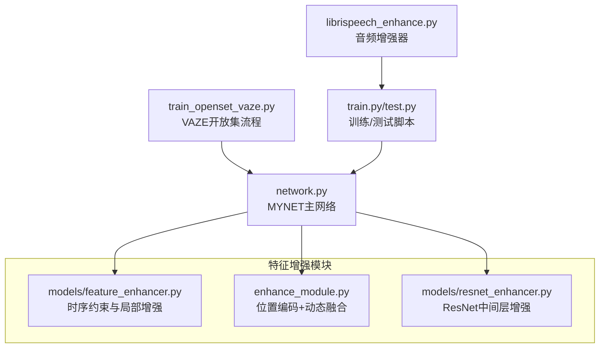
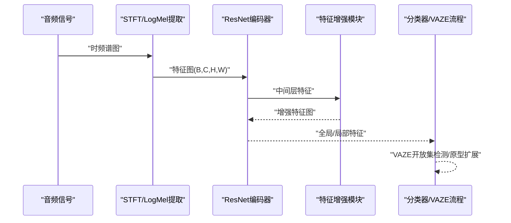
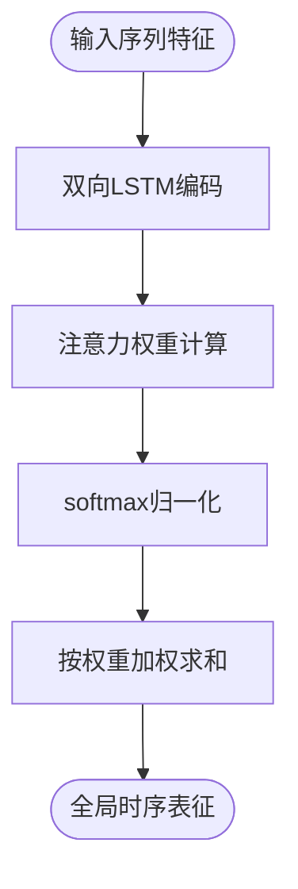
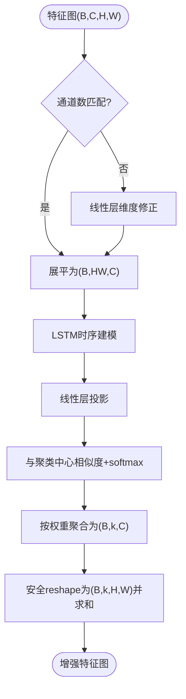
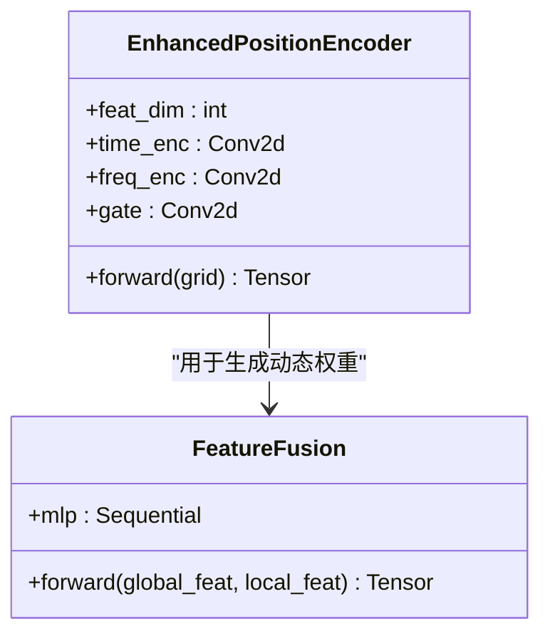
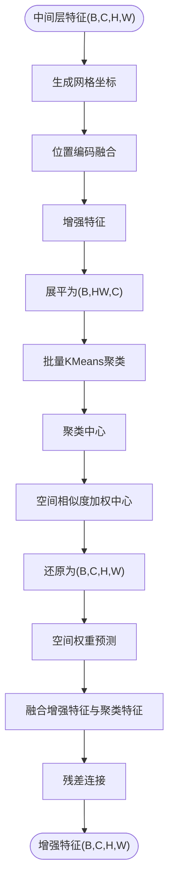
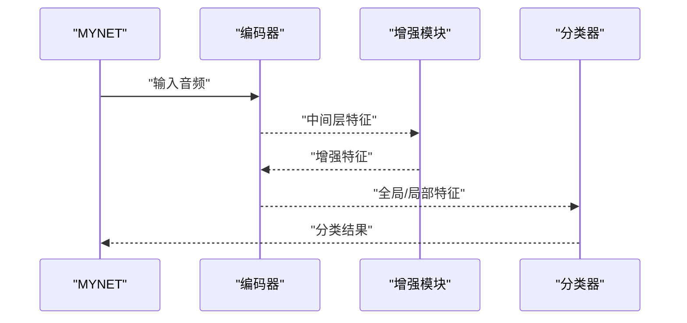
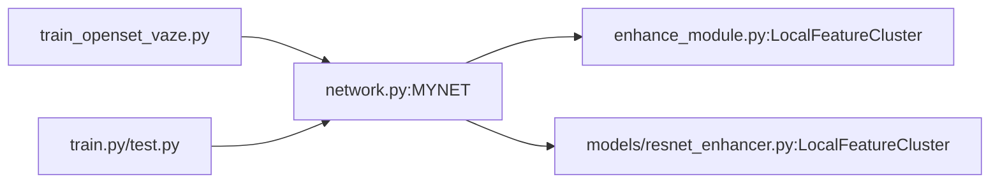

# 特征增强扩展

<cite>
**本文档引用的文件**
- [models/feature_enhancer.py](file://models/feature_enhancer.py)
- [enhance_module.py](file://enhance_module.py)
- [models/resnet_enhancer.py](file://models/resnet_enhancer.py)
- [network.py](file://network.py)
- [train_openset_vaze.py](file://train_openset_vaze.py)
- [librispeech_enhance.py](file://librispeech_enhance.py)
- [train.py](file://train.py)
- [test.py](file://test.py)
</cite>

## 目录
1. [简介](#简介)
2. [项目结构](#项目结构)
3. [核心组件](#核心组件)
4. [架构总览](#架构总览)
5. [详细组件分析](#详细组件分析)
6. [依赖关系分析](#依赖关系分析)
7. [性能考虑](#性能考虑)
8. [故障排查指南](#故障排查指南)
9. [结论](#结论)
10. [附录](#附录)

## 简介
本指南面向VAZE项目的特征增强扩展，系统阐述当前特征增强模块的架构与实现原理，涵盖全局特征与局部特征的融合策略，并提供新增增强方法的实现路径（注意力机制改进、聚类算法优化）。文档同时给出参数调优策略、增强效果可视化与性能评估方法，帮助读者在不改变现有训练框架的前提下，安全地扩展特征增强能力并提升模型在增量学习与开放集识别中的表现。

## 项目结构
VAZE项目围绕音频特征提取与分类展开，特征增强模块主要分布在以下位置：
- models/feature_enhancer.py：提供时序约束与增强的局部特征模块
- enhance_module.py：提供基于位置编码与动态融合的局部特征增强模块
- models/resnet_enhancer.py：提供针对ResNet中间层特征的空间位置增强与聚类融合模块
- network.py：主网络MYNET集成特征增强模块，定义音频特征提取与增强流程
- train_openset_vaze.py：VAZE开放集增量流程，结合特征增强进行未知样本检测与原型扩展
- librispeech_enhance.py：音频数据增强器，支持多视图生成与可视化
- train.py/test.py：训练与测试脚本，包含特征融合与聚类评估逻辑

**图表来源**
- [models/feature_enhancer.py:1-93](file://models/feature_enhancer.py#L1-L93)
- [enhance_module.py:1-160](file://enhance_module.py#L1-L160)
- [models/resnet_enhancer.py:1-172](file://models/resnet_enhancer.py#L1-L172)
- [network.py:18-518](file://network.py#L18-L518)
- [train_openset_vaze.py:1-481](file://train_openset_vaze.py#L1-L481)
- [librispeech_enhance.py:1-268](file://librispeech_enhance.py#L1-L268)
- [train.py:1-200](file://train.py#L1-L200)
- [test.py:1-200](file://test.py#L1-L200)

**章节来源**
- [network.py:18-518](file://network.py#L18-L518)
- [enhance_module.py:1-160](file://enhance_module.py#L1-L160)
- [models/resnet_enhancer.py:1-172](file://models/resnet_enhancer.py#L1-L172)
- [models/feature_enhancer.py:1-93](file://models/feature_enhancer.py#L1-L93)
- [train_openset_vaze.py:1-481](file://train_openset_vaze.py#L1-L481)
- [librispeech_enhance.py:1-268](file://librispeech_enhance.py#L1-L268)
- [train.py:1-200](file://train.py#L1-L200)
- [test.py:1-200](file://test.py#L1-L200)

## 核心组件
- 时序约束模块（TemporalConstraint）：对序列特征进行双向LSTM编码与注意力聚合，输出全局时序表征，用于稳定长序列特征的代表性。
- 局部增强模块（EnhancedLocalFeature）：对空间特征进行展平、LSTM时序建模、动态权重计算与聚类中心聚合，输出增强后的局部特征图。
- 位置编码与动态融合模块（EnhancedPositionEncoder + FeatureFusion）：分别对时间轴与频率轴进行编码并通过门控融合，预测动态权重实现全局与局部特征的自适应融合。
- ResNet中间层增强模块（LocalFeatureCluster）：在ResNet中间层（如layer3）输出特征上进行位置编码、批量KMeans聚类与空间权重融合，保留残差连接以稳定训练。
- 主网络集成（MYNET）：在编码器中间层插入增强模块，提供增强编码流程与多种注意力机制。

**章节来源**
- [models/feature_enhancer.py:5-25](file://models/feature_enhancer.py#L5-L25)
- [models/feature_enhancer.py:27-93](file://models/feature_enhancer.py#L27-L93)
- [enhance_module.py:14-29](file://enhance_module.py#L14-L29)
- [enhance_module.py:30-69](file://enhance_module.py#L30-L69)
- [models/resnet_enhancer.py:51-172](file://models/resnet_enhancer.py#L51-L172)
- [network.py:36-311](file://network.py#L36-L311)

## 架构总览
特征增强在VAZE中的整体流程如下：
- 音频经STFT与LogMel提取为频谱图，重复通道后进入ResNet编码器
- 在特定中间层（如layer3）插入增强模块，进行位置编码、聚类与融合
- 输出特征用于分类器或进一步的VAZE开放集检测与原型扩展

**图表来源**
- [network.py:290-311](file://network.py#L290-L311)
- [enhance_module.py:95-148](file://enhance_module.py#L95-L148)
- [models/resnet_enhancer.py:73-160](file://models/resnet_enhancer.py#L73-L160)
- [train_openset_vaze.py:134-170](file://train_openset_vaze.py#L134-L170)

## 详细组件分析

### 时序约束模块（TemporalConstraint）
- LSTM双向编码：对序列特征进行双向LSTM建模，捕获前后文依赖
- 注意力聚合：使用两层线性+Tanh+无偏置线性输出注意力权重，softmax归一化后对LSTM输出加权求和，得到全局时序表征
- 数值稳定性：显式将注意力输出转为浮点张量，避免数值溢出

**图表来源**
- [models/feature_enhancer.py:5-25](file://models/feature_enhancer.py#L5-L25)

**章节来源**
- [models/feature_enhancer.py:5-25](file://models/feature_enhancer.py#L5-L25)

### 局部增强模块（EnhancedLocalFeature）
- 维度修正：若输入通道与目标维度不一致，通过线性层进行维度对齐
- 时序建模：对展平后的空间特征进行LSTM时序建模，再通过线性层压缩回特征维度
- 动态权重：通过与聚类中心的矩阵乘法计算相似度，使用softmax得到权重
- 特征聚合：对空间特征按权重聚合，恢复为特征图并进行安全reshape

**图表来源**
- [models/feature_enhancer.py:27-93](file://models/feature_enhancer.py#L27-L93)

**章节来源**
- [models/feature_enhancer.py:27-93](file://models/feature_enhancer.py#L27-L93)

### 位置编码与动态融合模块（EnhancedPositionEncoder + FeatureFusion）
- 位置编码：分别对时间轴与频率轴进行卷积编码，得到独立的时间与频率嵌入
- 动态融合：将时间与频率嵌入拼接后通过门控网络生成融合权重，实现自适应融合
- 特征融合：预测全局与局部特征的动态权重，进行加权融合

**图表来源**
- [enhance_module.py:30-69](file://enhance_module.py#L30-L69)
- [enhance_module.py:14-29](file://enhance_module.py#L14-L29)

**章节来源**
- [enhance_module.py:30-69](file://enhance_module.py#L30-L69)
- [enhance_module.py:14-29](file://enhance_module.py#L14-L29)

### ResNet中间层增强模块（LocalFeatureCluster）
- 位置编码：生成网格坐标，分别对时间与频率维度进行编码并通过门控融合
- 批量聚类：对每个样本的展平特征执行KMeans聚类，使用空间相似度矩阵对聚类中心进行加权更新
- 空间权重融合：通过MLP预测空间权重，实现聚类特征与原增强特征的融合
- 残差连接：保留原特征，与融合结果相加，稳定训练

**图表来源**
- [models/resnet_enhancer.py:73-160](file://models/resnet_enhancer.py#L73-L160)

**章节来源**
- [models/resnet_enhancer.py:51-172](file://models/resnet_enhancer.py#L51-L172)

### 主网络集成（MYNET）
- 在编码器中间层插入增强模块，提供增强编码流程
- 支持多种模式：encoder、openmeta等，增强模块在相应前向路径中被调用
- 与VAZE流程结合：在开放集检测与原型扩展中使用增强特征

**图表来源**
- [network.py:290-311](file://network.py#L290-L311)
- [network.py:36-311](file://network.py#L36-L311)

**章节来源**
- [network.py:18-518](file://network.py#L18-L518)

## 依赖关系分析
- MYNET依赖增强模块：在中间层插入LocalFeatureCluster，实现特征增强
- VAZE流程依赖MYNET：通过base_encode/hgnn_encode获取特征，结合增强模块进行未知样本检测与原型扩展
- 训练/测试脚本依赖增强模块：在特征融合与聚类评估中使用增强模块

**图表来源**
- [network.py:36-311](file://network.py#L36-L311)
- [enhance_module.py:71-148](file://enhance_module.py#L71-L148)
- [models/resnet_enhancer.py:51-160](file://models/resnet_enhancer.py#L51-L160)
- [train_openset_vaze.py:134-170](file://train_openset_vaze.py#L134-L170)
- [train.py:1-200](file://train.py#L1-L200)
- [test.py:1-200](file://test.py#L1-L200)

**章节来源**
- [network.py:36-311](file://network.py#L36-L311)
- [enhance_module.py:71-148](file://enhance_module.py#L71-L148)
- [models/resnet_enhancer.py:51-160](file://models/resnet_enhancer.py#L51-L160)
- [train_openset_vaze.py:134-170](file://train_openset_vaze.py#L134-L170)
- [train.py:1-200](file://train.py#L1-L200)
- [test.py:1-200](file://test.py#L1-L200)

## 性能考虑
- 设备一致性：增强模块内部维护_current_device并在前向时确保子模块与输入在同一设备上，避免跨设备操作导致的性能下降
- 批量聚类优化：在ResNet增强模块中，将展平后的特征一次性迁移到CPU进行KMeans聚类，减少CPU-GPU交互次数
- 数值稳定性：注意力权重计算中显式转换为浮点类型，防止数值溢出
- 残差连接：在ResNet增强模块中保留原特征，有助于稳定训练与梯度流动

**章节来源**
- [models/resnet_enhancer.py:168-172](file://models/resnet_enhancer.py#L168-L172)
- [models/resnet_enhancer.py:100-110](file://models/resnet_enhancer.py#L100-L110)
- [models/feature_enhancer.py:24](file://models/feature_enhancer.py#L24)
- [models/resnet_enhancer.py:159](file://models/resnet_enhancer.py#L159)

## 故障排查指南
- 维度不匹配：EnhancedLocalFeature在输入通道与目标维度不一致时会通过线性层修正，若仍报错，请检查输入特征的通道数与目标维度
- 设备不一致：LocalFeatureCluster在forward中会确保子模块与输入在同一设备上，若出现设备错误，请检查输入设备与模块设备的一致性
- 聚类异常：批量KMeans聚类时会将特征迁移到CPU，若内存不足请降低k_ratio或减小批大小
- 数值溢出：注意力权重计算中已显式转换为浮点类型，若仍有溢出问题，请检查输入特征的范围与归一化

**章节来源**
- [models/feature_enhancer.py:42-54](file://models/feature_enhancer.py#L42-L54)
- [models/resnet_enhancer.py:168-172](file://models/resnet_enhancer.py#L168-L172)
- [models/resnet_enhancer.py:100-110](file://models/resnet_enhancer.py#L100-L110)
- [models/feature_enhancer.py:24](file://models/feature_enhancer.py#L24)

## 结论
VAZE项目的特征增强模块通过时序约束、位置编码与动态融合、以及ResNet中间层增强，实现了对全局与局部特征的有效融合。这些模块既可独立使用，也可与VAZE开放集流程无缝集成。通过合理的参数调优与可视化评估，可以显著提升模型在增量学习与未知样本检测中的性能。

## 附录

### 实现新的特征增强方法（步骤指南）
- 新增增强器的添加
  - 在network.py中选择合适的中间层插入增强模块，参考MYNET的增强编码流程
  - 若需自定义增强模块，建议遵循以下接口约定：
    - 输入：特征图(B, C, H, W)
    - 输出：增强后的特征图(B, C, H, W)
    - 设备一致性：在forward中确保子模块与输入在同一设备上
  - 参考实现路径：
    - [network.py:290-311](file://network.py#L290-L311)
    - [enhance_module.py:71-148](file://enhance_module.py#L71-L148)
    - [models/resnet_enhancer.py:73-160](file://models/resnet_enhancer.py#L73-L160)

- 现有增强器的修改
  - 时序约束模块：可调整LSTM隐藏维度与注意力结构，提高时序表征能力
    - 参考：[models/feature_enhancer.py:5-25](file://models/feature_enhancer.py#L5-L25)
  - 局部增强模块：可调整聚类中心数量、时序相似度权重与维度修正策略
    - 参考：[models/feature_enhancer.py:27-93](file://models/feature_enhancer.py#L27-L93)
  - 位置编码与融合模块：可调整卷积核大小、门控结构与融合策略
    - 参考：[enhance_module.py:30-69](file://enhance_module.py#L30-L69)
  - ResNet中间层增强模块：可调整k_ratio、temporal_scale与空间权重网络
    - 参考：[models/resnet_enhancer.py:51-172](file://models/resnet_enhancer.py#L51-L172)

- 注意力机制的改进
  - 可替换为多头注意力或Transformer风格的自注意力，提升对长序列的建模能力
  - 参考现有注意力实现：
    - [network.py:538-584](file://network.py#L538-L584)

- 聚类算法的优化
  - 使用MiniBatchKMeans或DBSCAN替代KMeans，提升大规模特征的聚类效率
  - 在ResNet增强模块中，批量聚类已在CPU上执行，注意内存与批大小的平衡
  - 参考：
    - [models/resnet_enhancer.py:100-110](file://models/resnet_enhancer.py#L100-L110)

### 参数调优策略
- k_ratio：控制聚类中心数量与空间分辨率的关系，建议从0.2~0.5范围内搜索
- temporal_scale：控制空间相似度矩阵的平滑程度，较小值更关注局部结构
- feat_dim：确保增强模块的通道数与下游网络一致，必要时通过线性层对齐
- dropout：在不确定度估计时启用MC Dropout，提升鲁棒性
  - 参考：[network.py:50-101](file://network.py#L50-L101)

### 增强效果的可视化与性能评估
- 可视化增强效果：使用librispeech_enhance.py中的可视化函数对比原始与增强音频的波形与频谱
  - 参考：[librispeech_enhance.py:218-268](file://librispeech_enhance.py#L218-L268)
- 性能评估：在VAZE流程中使用聚类准确率、F1分数与增量准确率等指标评估增强效果
  - 参考：[train_openset_vaze.py:248-417](file://train_openset_vaze.py#L248-L417)
- 不确定度估计：通过MC Dropout与特征掩码计算样本的不确定性，辅助未知样本检测
  - 参考：[test.py:37-85](file://test.py#L37-L85)