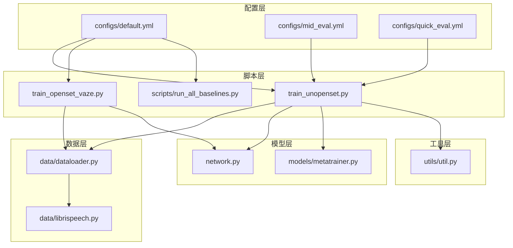
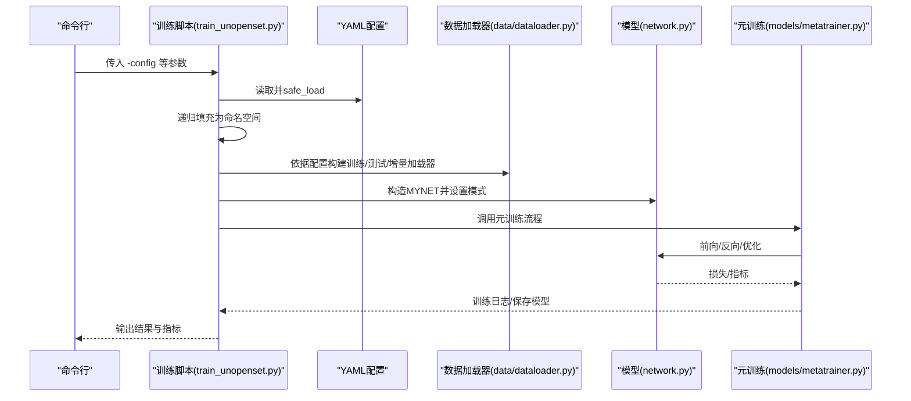
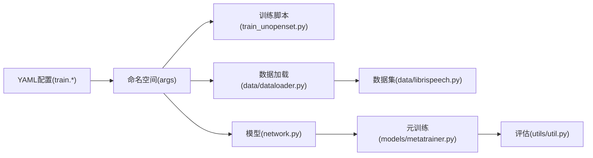

# 配置定制

<cite>
**本文引用的文件**
- [configs/default.yml](file://configs/default.yml)
- [configs/mid_eval.yml](file://configs/mid_eval.yml)
- [configs/quick_eval.yml](file://configs/quick_eval.yml)
- [scripts/run_all_baselines.py](file://scripts/run_all_baselines.py)
- [train_unopenset.py](file://train_unopenset.py)
- [train_openset_vaze.py](file://train_openset_vaze.py)
- [data/dataloader.py](file://data/dataloader.py)
- [network.py](file://network.py)
- [models/metatrainer.py](file://models/metatrainer.py)
- [data/librispeech.py](file://data/librispeech.py)
- [utils/util.py](file://utils/util.py)
</cite>

## 目录
1. [简介](#简介)
2. [项目结构](#项目结构)
3. [核心组件](#核心组件)
4. [架构总览](#架构总览)
5. [详细组件分析](#详细组件分析)
6. [依赖分析](#依赖分析)
7. [性能考虑](#性能考虑)
8. [故障排查指南](#故障排查指南)
9. [结论](#结论)
10. [附录](#附录)

## 简介
本指南面向VAZE项目的配置定制需求，围绕YAML配置文件的结构、参数语义、参数验证与默认值、层次结构与继承关系、类型检查与范围校验、依赖关系处理、实验场景定制与版本管理与迁移策略进行系统化说明。读者无需深入编程背景，也能据此完成配置的新增、调整与安全验证。

## 项目结构
VAZE项目采用“配置驱动 + 数据加载 + 模型训练”的分层组织方式：
- 配置层：位于configs目录，提供不同粒度的默认配置文件（如默认、中期评估、快速评估）。
- 脚本层：训练入口脚本（如train_unopenset.py、train_openset_vaze.py）负责解析CLI与YAML配置，组装命名空间参数。
- 数据层：data/dataloader.py根据args中的训练/测试批次大小、工作线程数、采样策略等参数构建数据加载器。
- 模型层：network.py定义MYNET模型及前向逻辑，metatrainer.py实现元训练流程。
- 工具层：utils/util.py提供评估与学习率调度等辅助函数。

图表来源
- [configs/default.yml:1-88](file://configs/default.yml#L1-L88)
- [configs/mid_eval.yml:1-88](file://configs/mid_eval.yml#L1-L88)
- [configs/quick_eval.yml:1-88](file://configs/quick_eval.yml#L1-L88)
- [train_unopenset.py:1104-1117](file://train_unopenset.py#L1104-L1117)
- [train_openset_vaze.py:420-481](file://train_openset_vaze.py#L420-L481)
- [scripts/run_all_baselines.py:56-75](file://scripts/run_all_baselines.py#L56-L75)
- [data/dataloader.py:1-200](file://data/dataloader.py#L1-L200)
- [data/librispeech.py:1-200](file://data/librispeech.py#L1-L200)
- [network.py:1-200](file://network.py#L1-L200)
- [models/metatrainer.py:1-200](file://models/metatrainer.py#L1-L200)
- [utils/util.py:1-75](file://utils/util.py#L1-L75)

章节来源
- [configs/default.yml:1-88](file://configs/default.yml#L1-L88)
- [configs/mid_eval.yml:1-88](file://configs/mid_eval.yml#L1-L88)
- [configs/quick_eval.yml:1-88](file://configs/quick_eval.yml#L1-L88)
- [train_unopenset.py:1104-1117](file://train_unopenset.py#L1104-L1117)
- [train_openset_vaze.py:420-481](file://train_openset_vaze.py#L420-L481)
- [scripts/run_all_baselines.py:56-75](file://scripts/run_all_baselines.py#L56-L75)
- [data/dataloader.py:1-200](file://data/dataloader.py#L1-L200)
- [data/librispeech.py:1-200](file://data/librispeech.py#L1-L200)
- [network.py:1-200](file://network.py#L1-L200)
- [models/metatrainer.py:1-200](file://models/metatrainer.py#L1-L200)
- [utils/util.py:1-75](file://utils/util.py#L1-L75)

## 核心组件
- 配置文件（YAML）：集中定义训练参数、数据集配置、实验设置、优化器与调度器、网络与策略、数据加载器、增量学习与音频特征提取等。
- 参数解析器：脚本通过yaml.safe_load读取YAML，再递归填充为命名空间对象，供训练流程使用。
- 数据加载器：根据配置中的batch_size、num_workers、采样策略等参数构建训练/测试/增量测试数据加载器。
- 模型与训练：MYNET根据配置选择模式（如encoder/openmeta），元训练流程按配置的epochs、lr、scheduler等执行。
- 评估与指标：工具函数提供聚类准确率、F1等指标计算，贯穿训练与增量阶段。

章节来源
- [configs/default.yml:1-88](file://configs/default.yml#L1-L88)
- [train_unopenset.py:1104-1117](file://train_unopenset.py#L1104-L1117)
- [data/dataloader.py:1-200](file://data/dataloader.py#L1-L200)
- [network.py:1-200](file://network.py#L1-L200)
- [models/metatrainer.py:1-200](file://models/metatrainer.py#L1-L200)
- [utils/util.py:1-75](file://utils/util.py#L1-L75)

## 架构总览
下图展示配置到训练主流程的关键交互：YAML配置经脚本解析为命名空间，随后驱动数据加载、模型构造与训练。

图表来源
- [train_unopenset.py:1104-1117](file://train_unopenset.py#L1104-L1117)
- [data/dataloader.py:1-200](file://data/dataloader.py#L1-L200)
- [network.py:1-200](file://network.py#L1-L200)
- [models/metatrainer.py:1-200](file://models/metatrainer.py#L1-L200)

## 详细组件分析

### YAML配置文件结构与参数语义
- 训练控制（train.*）
  - 基本元训练与增量设置：way、shot、num_session、num_base、num_novel、num_all、start_session、test_times、seq_sample、tmp_train、feat_dim、save_dir、seed等。
  - 训练轮次与学习率：epochs.epochs_std、epochs.epochs_meta、epochs.epochs_stdu_base、epochs_new；lr.lr_std、lr_stdu_base、lrg、lr_new、lr_decay_rate、lr_decay_epochs。
  - 调度器：scheduler.schedule（Step/Milestone）、milestones、step、gamma。
  - 优化器：optimizer.decay、optimizer.momentum。
  - 网络与策略：network.temperature、network.base_mode、network.new_mode；strategy.data_init、strategy.set_no_val、strategy.seq_sample。
  - Episode采样：episode.train_episode、episode.episode_way、episode.episode_shot、episode.episode_query、episode.low_way、episode.low_shot。
  - 数据加载器：dataloader.num_workers、dataloader.train_batch_size、dataloader.test_batch_size。
  - 增量学习与原型：stdu.num_tmpb、stdu.num_tmpi、stdu.num_tmps、stdu.num_incre、stdu.pqa、stdu.ap.*、stdu.anchor.*、stdu.proto.*。
  - 音频特征提取：extractor.sample_rate、window_size、hop_size、mel_bins、fmin、fmax、window。
- 文件差异
  - mid_eval.yml：将test_times降低为较小值，适合中期评估。
  - quick_eval.yml：大幅减少num_session与test_times，适合快速验证。

章节来源
- [configs/default.yml:1-88](file://configs/default.yml#L1-L88)
- [configs/mid_eval.yml:1-88](file://configs/mid_eval.yml#L1-L88)
- [configs/quick_eval.yml:1-88](file://configs/quick_eval.yml#L1-L88)

### 参数解析与默认值注入
- 脚本解析流程
  - 读取YAML并safe_load为字典。
  - 递归将嵌套字典转换为命名空间对象，便于点号访问。
  - CLI参数覆盖YAML中的同名字段。
- 默认值来源
  - 未在YAML中显式提供的字段，可在脚本内部通过SimpleNamespace或默认参数提供，确保运行时具备必要键值。
- 示例路径
  - [scripts/run_all_baselines.py:56-75](file://scripts/run_all_baselines.py#L56-L75)
  - [train_openset_vaze.py:420-481](file://train_openset_vaze.py#L420-L481)

章节来源
- [scripts/run_all_baselines.py:56-75](file://scripts/run_all_baselines.py#L56-L75)
- [train_openset_vaze.py:420-481](file://train_openset_vaze.py#L420-L481)

### 类型检查、范围验证与依赖关系
- 类型与范围建议
  - 数值型参数：对epochs、batch_size、num_workers、seed等进行类型断言（整数）与范围断言（非负、合理上限）。
  - 字符串枚举：对scheduler.schedule、network.base_mode、network.new_mode等进行白名单校验。
  - 列表/字符串：对lr_decay_epochs（字符串形式的空格分隔数字）进行解析与长度/数值合法性校验。
- 依赖关系建议
  - train_batch_size与num_workers需与硬件资源匹配，避免内存不足。
  - num_session与way/shot/query需满足增量步长与采样一致性。
  - network.new_mode影响模型前向分支，需与数据加载器的episode参数协同。
- 实践要点
  - 在脚本启动初期统一校验关键参数，失败即终止，避免中途报错。
  - 对可选字段提供显式默认值，避免None导致的运行时异常。

章节来源
- [configs/default.yml:1-88](file://configs/default.yml#L1-L88)
- [configs/mid_eval.yml:1-88](file://configs/mid_eval.yml#L1-L88)
- [configs/quick_eval.yml:1-88](file://configs/quick_eval.yml#L1-L88)
- [data/dataloader.py:1-200](file://data/dataloader.py#L1-L200)
- [network.py:1-200](file://network.py#L1-L200)

### 数据加载与配置联动
- 数据加载器参数
  - dataloader.train_batch_size、dataloader.test_batch_size、dataloader.num_workers直接影响吞吐与显存占用。
  - 采样器参数（如episode.train_episode、episode.episode_way、episode.episode_shot、episode.episode_query）来自配置并在采样器中使用。
- 会话与类别范围
  - 测试集与增量测试集的类别范围由num_base、num_session、way等决定，确保测试覆盖已遇到类别。
- 示例路径
  - [data/dataloader.py:1-200](file://data/dataloader.py#L1-L200)
  - [data/librispeech.py:1-200](file://data/librispeech.py#L1-L200)

章节来源
- [data/dataloader.py:1-200](file://data/dataloader.py#L1-L200)
- [data/librispeech.py:1-200](file://data/librispeech.py#L1-L200)

### 模型与训练流程中的配置使用
- 模型模式与温度
  - network.temperature与network.new_mode影响分类器与前向逻辑。
- 元训练与优化
  - epochs.epochs_meta、lr.lr_std、optimizer.decay、scheduler.*等参与元训练循环。
- 示例路径
  - [network.py:1-200](file://network.py#L1-L200)
  - [models/metatrainer.py:1-200](file://models/metatrainer.py#L1-L200)

章节来源
- [network.py:1-200](file://network.py#L1-L200)
- [models/metatrainer.py:1-200](file://models/metatrainer.py#L1-L200)

### 评估与指标计算
- 聚类准确率与F1
  - utils/util.py提供cluster_acc与calc，用于增量阶段的聚类准确率与二分类F1计算。
- 示例路径
  - [utils/util.py:1-75](file://utils/util.py#L1-L75)

章节来源
- [utils/util.py:1-75](file://utils/util.py#L1-L75)

## 依赖分析
- 配置到脚本：脚本读取YAML并填充命名空间，CLI参数覆盖YAML。
- 脚本到数据：数据加载器依赖dataloader.*与episode.*参数。
- 脚本到模型：模型依赖network.*、optimizer.*、scheduler.*等。
- 模块间耦合：数据加载器与模型之间通过张量形状与通道维度保持一致；评估函数独立于训练流程，仅依赖预测与标签。

图表来源
- [configs/default.yml:1-88](file://configs/default.yml#L1-L88)
- [train_unopenset.py:1104-1117](file://train_unopenset.py#L1104-L1117)
- [data/dataloader.py:1-200](file://data/dataloader.py#L1-L200)
- [data/librispeech.py:1-200](file://data/librispeech.py#L1-L200)
- [network.py:1-200](file://network.py#L1-L200)
- [models/metatrainer.py:1-200](file://models/metatrainer.py#L1-L200)
- [utils/util.py:1-75](file://utils/util.py#L1-L75)

章节来源
- [configs/default.yml:1-88](file://configs/default.yml#L1-L88)
- [train_unopenset.py:1104-1117](file://train_unopenset.py#L1104-L1117)
- [data/dataloader.py:1-200](file://data/dataloader.py#L1-L200)
- [data/librispeech.py:1-200](file://data/librispeech.py#L1-L200)
- [network.py:1-200](file://network.py#L1-L200)
- [models/metatrainer.py:1-200](file://models/metatrainer.py#L1-L200)
- [utils/util.py:1-75](file://utils/util.py#L1-L75)

## 性能考虑
- 并行与吞吐
  - num_workers与batch_size需平衡CPU/GPU利用率与内存占用。
  - 多进程worker的随机种子固定有助于可重复性与稳定性。
- 学习率与调度
  - cosine退火与阶梯衰减的选择会影响收敛速度与稳定性。
  - lr_decay_epochs的设置需与总epoch数匹配，避免无效衰减。
- 数据增强与特征提取
  - 音频特征提取器的窗口大小、hop、mel_bins等参数影响特征分辨率与计算开销。
- 增量学习步长
  - num_session、way、shot、query等参数共同决定每步增量规模，应结合数据集容量与资源限制设定。

## 故障排查指南
- 常见问题与定位
  - 参数缺失：若YAML中缺少某字段，脚本应提供默认值或在启动前进行断言。
  - 类型错误：对字符串/整数/浮点数进行显式类型转换与范围检查。
  - 设备不一致：确保模型与数据在同一设备上，避免张量设备不匹配。
  - 数据维度不匹配：检查batch_size、特征维度与网络期望一致。
- 建议流程
  - 启动前打印关键参数摘要，确认配置与预期一致。
  - 对关键路径（数据加载、前向、反向）增加断言与日志。
  - 使用最小化配置（如quick_eval.yml）快速验证流程通顺。

章节来源
- [utils/util.py:1-75](file://utils/util.py#L1-L75)
- [data/dataloader.py:1-200](file://data/dataloader.py#L1-L200)
- [network.py:1-200](file://network.py#L1-L200)

## 结论
VAZE项目的配置体系以YAML为中心，通过脚本解析与命名空间传递至数据加载、模型与训练流程。遵循本文的参数语义、类型与范围校验、依赖关系与默认值注入原则，可安全地扩展与定制配置，满足不同实验场景的需求。建议在团队内建立配置变更评审与回归测试流程，保障配置演进的稳定性与可追溯性。

## 附录

### 如何添加新的配置选项
- 步骤
  - 在YAML中新增键值，明确其作用域（如train.lr.new_lr）。
  - 在脚本中提供默认值或在解析后补充默认值，确保运行时存在。
  - 在使用处（数据加载、模型、训练）读取并应用该参数。
  - 编写单元/集成测试，验证新增参数在不同场景下的行为。
- 示例路径
  - [configs/default.yml:1-88](file://configs/default.yml#L1-L88)
  - [train_unopenset.py:1104-1117](file://train_unopenset.py#L1104-L1117)

章节来源
- [configs/default.yml:1-88](file://configs/default.yml#L1-L88)
- [train_unopenset.py:1104-1117](file://train_unopenset.py#L1104-L1117)

### 配置文件层次结构与继承
- 层次结构
  - configs目录下提供多个粒度的配置文件：default.yml（完整默认）、mid_eval.yml（中期评估）、quick_eval.yml（快速评估）。
- 继承关系
  - 通过CLI参数覆盖YAML中的同名字段，实现“局部覆盖”。
  - 脚本内部可通过SimpleNamespace为未提供的字段注入默认值，形成“全局默认”。
- 示例路径
  - [scripts/run_all_baselines.py:56-75](file://scripts/run_all_baselines.py#L56-L75)
  - [train_openset_vaze.py:420-481](file://train_openset_vaze.py#L420-L481)

章节来源
- [scripts/run_all_baselines.py:56-75](file://scripts/run_all_baselines.py#L56-L75)
- [train_openset_vaze.py:420-481](file://train_openset_vaze.py#L420-L481)

### 为不同实验场景定制配置
- 基准/快速验证：使用quick_eval.yml，缩短num_session与test_times。
- 中期评估：使用mid_eval.yml，适度减少评估次数。
- 完整训练：使用default.yml，按需微调学习率、批次大小与采样策略。
- 示例路径
  - [configs/quick_eval.yml:1-88](file://configs/quick_eval.yml#L1-L88)
  - [configs/mid_eval.yml:1-88](file://configs/mid_eval.yml#L1-L88)
  - [configs/default.yml:1-88](file://configs/default.yml#L1-L88)

章节来源
- [configs/quick_eval.yml:1-88](file://configs/quick_eval.yml#L1-L88)
- [configs/mid_eval.yml:1-88](file://configs/mid_eval.yml#L1-L88)
- [configs/default.yml:1-88](file://configs/default.yml#L1-L88)

### 配置版本管理与迁移策略
- 版本管理
  - 为重要配置文件添加注释说明版本号与变更摘要。
  - 在仓库中保留历史配置快照，便于回溯。
- 迁移策略
  - 新增字段时提供默认值，保证旧配置仍可运行。
  - 对废弃字段给出警告并在未来版本移除。
  - 在CI中加入配置解析与关键参数校验，防止引入不兼容变更。