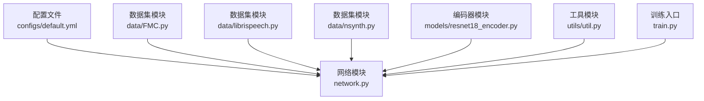
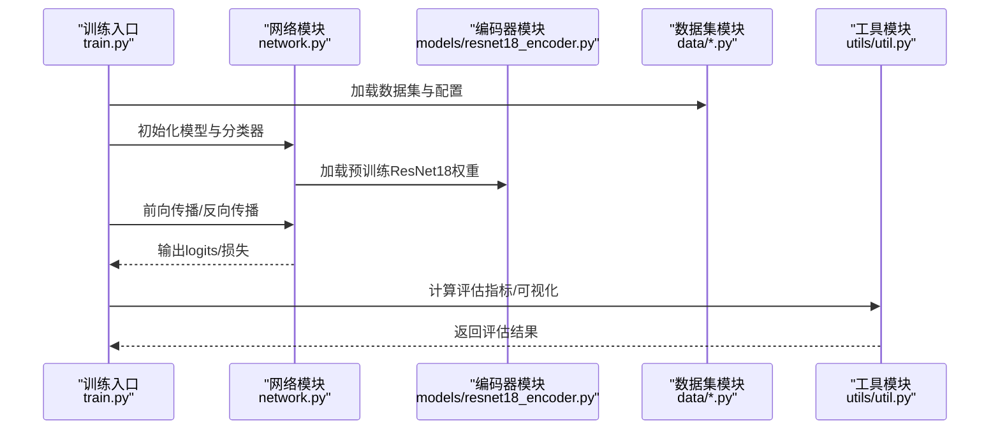
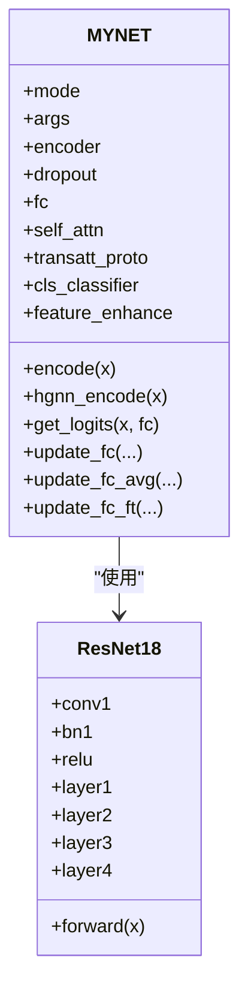
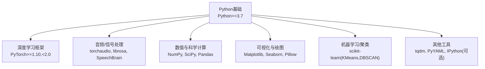

# 技术栈和依赖

<cite>
**本文引用的文件**
- [configs/default.yml](file://configs/default.yml)
- [network.py](file://network.py)
- [models/resnet18_encoder.py](file://models/resnet18_encoder.py)
- [data/FMC.py](file://data/FMC.py)
- [data/librispeech.py](file://data/librispeech.py)
- [data/nsynth.py](file://data/nsynth.py)
- [librispeech_enhance.py](file://librispeech_enhance.py)
- [train.py](file://train.py)
- [utils/util.py](file://utils/util.py)
- [deepcluster.py](file://deepcluster.py)
</cite>

## 目录
1. [简介](#简介)
2. [项目结构](#项目结构)
3. [核心组件](#核心组件)
4. [架构总览](#架构总览)
5. [详细组件分析](#详细组件分析)
6. [依赖关系分析](#依赖关系分析)
7. [性能考虑](#性能考虑)
8. [故障排查指南](#故障排查指南)
9. [结论](#结论)
10. [附录](#附录)

## 简介
本文件面向VAZE项目的技术栈与依赖说明，聚焦于Python运行时、深度学习框架与音频/信号处理生态，以及与GPU加速相关的环境配置。文档基于仓库内源码与配置文件进行归纳总结，明确各依赖库的用途、版本兼容性要求、安装方式、开发环境配置要点、依赖冲突解决策略与性能优化建议。

## 项目结构
项目采用按功能域分层的组织方式：
- 配置层：通过YAML配置文件集中管理训练、网络、数据增强与音频特征提取等参数
- 数据层：提供多种音频数据集的加载与预处理逻辑
- 模型层：包含主干网络、注意力模块、分类器与特征增强模块
- 工具层：提供评估指标、可视化与设备一致性保障等工具函数
- 脚本层：提供实验分析与可视化脚本

**图表来源**
- [configs/default.yml:1-88](file://configs/default.yml#L1-L88)
- [network.py:1-100](file://network.py#L1-L100)
- [models/resnet18_encoder.py:1-50](file://models/resnet18_encoder.py#L1-L50)
- [data/FMC.py:1-21](file://data/FMC.py#L1-L21)
- [data/librispeech.py:1-21](file://data/librispeech.py#L1-L21)
- [data/nsynth.py:1-36](file://data/nsynth.py#L1-L36)
- [train.py:173-210](file://train.py#L173-L210)

**章节来源**
- [configs/default.yml:1-88](file://configs/default.yml#L1-L88)
- [network.py:1-100](file://network.py#L1-L100)
- [models/resnet18_encoder.py:1-50](file://models/resnet18_encoder.py#L1-L50)
- [data/FMC.py:1-21](file://data/FMC.py#L1-L21)
- [data/librispeech.py:1-21](file://data/librispeech.py#L1-L21)
- [data/nsynth.py:1-36](file://data/nsynth.py#L1-L36)
- [train.py:173-210](file://train.py#L173-L210)

## 核心组件
- 配置系统：集中定义训练超参、优化器调度、数据加载器参数、音频特征提取器参数等
- 网络与特征提取：基于ResNet18的编码器，结合Mel频谱与时域STFT提取器、SpecAugment增强器
- 数据集适配：支持LibriSpeech、NSynth、FSDCLIPS等多种音频数据集
- 工具与评估：提供聚类准确率、F1等评估指标与可视化辅助

**章节来源**
- [configs/default.yml:1-88](file://configs/default.yml#L1-L88)
- [network.py:18-504](file://network.py#L18-L504)
- [data/FMC.py:1-21](file://data/FMC.py#L1-L21)
- [data/librispeech.py:1-21](file://data/librispeech.py#L1-L21)
- [data/nsynth.py:1-36](file://data/nsynth.py#L1-L36)
- [utils/util.py:12-75](file://utils/util.py#L12-L75)

## 架构总览
下图展示了训练流程中数据、网络与工具之间的交互关系。

**图表来源**
- [train.py:799-800](file://train.py#L799-L800)
- [network.py:18-504](file://network.py#L18-L504)
- [models/resnet18_encoder.py:133-143](file://models/resnet18_encoder.py#L133-L143)
- [utils/util.py:12-75](file://utils/util.py#L12-L75)

## 详细组件分析

### 配置系统（configs/default.yml）
- 职责：集中管理训练轮次、学习率、优化器、调度器、数据加载器、音频特征提取器等参数
- 关键字段示例：训练轮次、学习率、调度策略、批次大小、工作进程数、Mel频谱参数等
- 影响范围：直接影响训练稳定性、收敛速度与资源占用

**章节来源**
- [configs/default.yml:1-88](file://configs/default.yml#L1-L88)

### 网络与特征提取（network.py）
- ResNet18编码器：作为骨干网络，输出512维特征
- 音频特征提取：基于Spectrogram与LogmelFilterBank，支持不同采样率与窗口参数
- 增强模块：集成SpecAugmentation与时域STFT，提升鲁棒性
- 分类器与注意力：提供多头注意力与分类器模块，支持增量场景下的原型更新

**图表来源**
- [network.py:18-504](file://network.py#L18-L504)
- [models/resnet18_encoder.py:157-194](file://models/resnet18_encoder.py#L157-L194)

**章节来源**
- [network.py:18-504](file://network.py#L18-L504)
- [models/resnet18_encoder.py:133-143](file://models/resnet18_encoder.py#L133-L143)

### 数据集适配（data/*.py）
- LibriSpeech、NSynth、FSDCLIPS等数据集封装，统一提供Dataset接口
- 集成librosa、torchaudio、PIL、Pandas等库进行音频读取、变换与元数据处理
- 支持SpecAugmentation与时域STFT增强

**章节来源**
- [data/FMC.py:1-21](file://data/FMC.py#L1-L21)
- [data/librispeech.py:1-21](file://data/librispeech.py#L1-L21)
- [data/nsynth.py:1-36](file://data/nsynth.py#L1-L36)

### 工具与评估（utils/util.py）
- 聚类准确率与F1等指标计算
- 学习率调度与训练辅助函数

**章节来源**
- [utils/util.py:12-75](file://utils/util.py#L12-L75)

### 训练入口（train.py）
- 参数解析、数据集选择、训练循环与评估流程
- 明确使用GPU（.cuda()）与设备一致性保障（设备迁移）

**章节来源**
- [train.py:173-210](file://train.py#L173-L210)
- [train.py:763-780](file://train.py#L763-L780)

## 依赖关系分析
基于源码导入与模块间调用关系，可归纳如下依赖矩阵：

**图表来源**
- [network.py:1-17](file://network.py#L1-L17)
- [data/FMC.py:8-19](file://data/FMC.py#L8-L19)
- [data/librispeech.py:8-18](file://data/librispeech.py#L8-L18)
- [data/nsynth.py:8-18](file://data/nsynth.py#L8-L18)
- [librispeech_enhance.py:2-15](file://librispeech_enhance.py#L2-L15)
- [utils/util.py:2-6](file://utils/util.py#L2-L6)
- [train.py:1-30](file://train.py#L1-L30)

### 依赖库作用与版本兼容性要求
- Python
  - 作用：运行时环境
  - 兼容性：建议Python 3.8及以上，以获得更好的包生态与性能
- PyTorch
  - 作用：深度学习框架，提供张量运算、自动微分、神经网络模块与CUDA加速
  - 兼容性：建议PyTorch 1.10至2.0之间，具体以项目源码中对API的使用为准
- torchaudio
  - 作用：音频数据加载、变换与增强（如SpecAugmentation）
  - 兼容性：与PyTorch版本保持一致或兼容
- librosa
  - 作用：音频特征提取与处理（在部分数据模块中使用）
  - 兼容性：建议较新的稳定版本
- SpeechBrain
  - 作用：STFT与滤波器组等特征提取工具
  - 兼容性：与PyTorch版本匹配
- NumPy
  - 作用：数值计算与数组操作（广泛用于特征处理与评估）
  - 兼容性：建议1.21以上
- Pandas
  - 作用：数据读取与处理（如CSV元数据）
  - 兼容性：建议1.3以上
- Matplotlib/Seaborn/Pillow
  - 作用：可视化与图像处理
  - 兼容性：建议稳定版本
- scikit-learn
  - 作用：KMeans、DBSCAN、度量指标等
  - 兼容性：建议1.0以上
- tqdm
  - 作用：进度条显示
  - 兼容性：建议最新稳定版
- PyYAML
  - 作用：加载YAML配置文件
  - 兼容性：建议最新稳定版
- IPython（可选）
  - 作用：交互式显示音频（Jupyter环境）
  - 兼容性：按需使用

**章节来源**
- [network.py:1-17](file://network.py#L1-L17)
- [data/FMC.py:8-19](file://data/FMC.py#L8-L19)
- [data/librispeech.py:8-18](file://data/librispeech.py#L8-L18)
- [data/nsynth.py:8-18](file://data/nsynth.py#L8-L18)
- [librispeech_enhance.py:2-15](file://librispeech_enhance.py#L2-L15)
- [utils/util.py:2-6](file://utils/util.py#L2-L6)
- [train.py:1-30](file://train.py#L1-L30)

## 性能考虑
- GPU加速与设备一致性
  - 项目中大量使用.cuda()与设备迁移，建议启用CUDA并确保显存充足
  - 训练配置中num_workers与batch_size需与显存容量匹配
- 数据加载与I/O
  - 合理设置num_workers与pin_memory，平衡CPU与GPU利用率
- 特征提取与增强
  - Mel频谱与STFT计算开销较大，建议在数据加载阶段完成预处理
- 可视化与日志
  - Matplotlib使用Agg后端，适合无GUI环境渲染图表

**章节来源**
- [configs/default.yml:57-60](file://configs/default.yml#L57-L60)
- [train.py:763-780](file://train.py#L763-L780)
- [librispeech_enhance.py:12-14](file://librispeech_enhance.py#L12-L14)

## 故障排查指南
- CUDA不可用或显存不足
  - 现象：.cuda()调用失败或OOM
  - 处理：降低batch_size、减少num_workers、关闭不必要的可视化
- 设备不一致导致的错误
  - 现象：参数与张量不在同一设备
  - 处理：参考工具模块中的设备一致性保障逻辑，确保所有参数与张量在同一设备
- 依赖版本冲突
  - 现象：导入错误或API不存在
  - 处理：锁定PyTorch与torchaudio版本，使用虚拟环境隔离依赖
- 随机性与可复现性
  - 处理：设置随机种子与确定性算法，参考训练入口中的随机性控制

**章节来源**
- [train.py:114-134](file://train.py#L114-L134)
- [utils/utils.py:118-130](file://utils/utils.py#L118-L130)
- [deepcluster.py:39-99](file://deepcluster.py#L39-L99)

## 结论
VAZE项目围绕PyTorch构建，结合torchaudio、librosa、SpeechBrain等生态实现音频特征提取与增强，并通过NumPy、Pandas、Matplotlib等库完成数据处理与可视化。项目对GPU有较强依赖，建议在具备CUDA能力的环境中运行，并根据显存与I/O能力合理配置训练参数。遵循本文提供的安装与优化建议，可有效降低依赖冲突风险并提升训练效率。

## 附录

### 安装指南（conda与pip）
- conda安装（推荐）
  - 创建并激活环境：conda create -n vaze python=3.9
  - 安装PyTorch与torchaudio（根据CUDA版本选择对应wheel）
  - 安装音频与信号处理生态：conda install -c conda-forge librosa
  - 安装数值与可视化：pip install numpy pandas matplotlib seaborn pillow
  - 安装机器学习与进度条：pip install scikit-learn tqdm pyyaml
  - 可选：SpeechBrain（按需安装）
- pip安装
  - 使用与conda相同的依赖列表，注意PyTorch与torchaudio版本匹配
  - 若出现编译问题，优先使用conda-forge渠道安装

### 开发环境配置要点
- Python：3.8及以上
- PyTorch：1.10至2.0之间
- CUDA：若使用GPU，确保CUDA与驱动版本兼容
- 显存：建议至少8GB（根据batch_size与模型规模调整）
- I/O：合理设置num_workers与pin_memory，避免CPU瓶颈

### 依赖冲突与版本升级指导
- 冲突排查
  - 使用conda list或pip list查看已安装版本
  - 优先锁定PyTorch与torchaudio版本，避免跨版本API不兼容
- 升级策略
  - 先升级PyTorch，再升级其他依赖，最后验证项目功能
  - 在独立虚拟环境中进行升级测试，避免影响生产环境